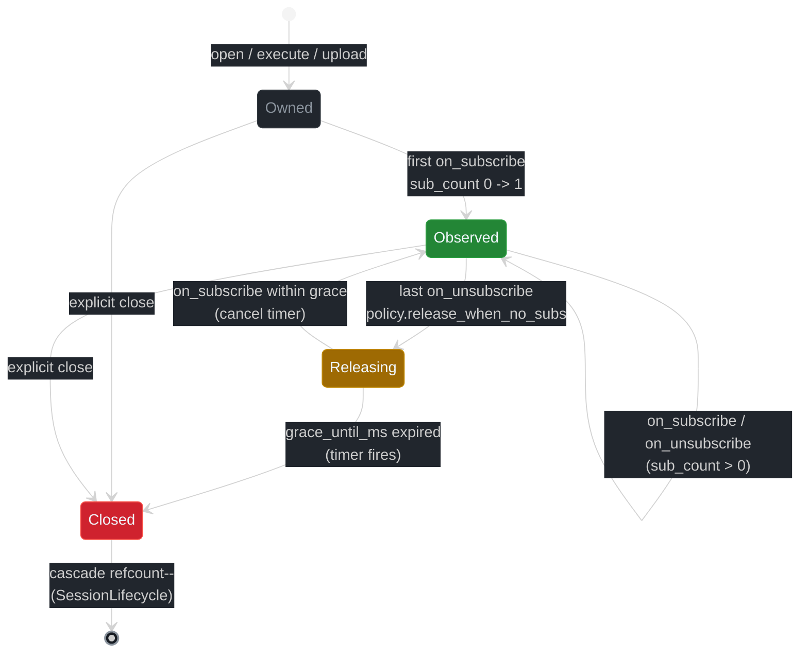
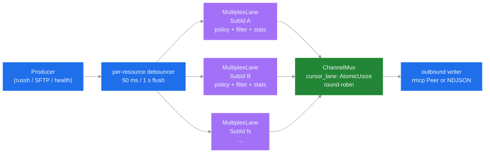

# CLAUDE.md

ssh-mcp **v5.0** — subscribe-first SSH MCP server. Hexagonal core inherited from v4.1 plus three v5 layers: lifecycle binding (Phase 1, ADR 0003), channel mux + sub_id (Phase 2, ADR 0004), LLM UX overhaul (Phase 3, ADR 0005, in flight), NDJSON daemon (Phase 4, ADR 0008, in flight). Wire-compatible with every v3 / v4 host on the legacy 21-tool catalogue. See [docs/MIGRATION_v4_to_v5.md](docs/MIGRATION_v4_to_v5.md) for the migration guide.

## Build Commands

```bash
cargo build --release                              # Build all binaries (default + port_forward)
cargo build --release --bin ssh-mcp                # HTTP server only (axum 0.8 + rmcp 1.6)
cargo build --release --bin ssh-mcp-stdio          # Stdio transport only
cargo build --release --bin ssh-mcp-tail           # NDJSON daemon (Phase 4 — in flight)
cargo build --release --no-default-features        # Without port forwarding
cargo test --lib --quiet                           # ~1378 lib tests on Phase 1+2 stable
cargo test --tests --quiet                         # 2 integration tests (incl. v4 smoke)
cargo test --all-features                          # Combined run
cargo test --features test-fixtures                # Use cases with deterministic in-memory adapters
cargo fmt --all -- --check                         # Check formatting
cargo clippy --release --all-features -- -D warnings                   # Lint (strict baseline — production only)
```

## Architecture (v5.0 — Subscribe-First Hexagonal)

The public MCP API is structurally compatible with v3 / v4.0 / v4.1 / v4.5 / v4.6 / v4.7 / v4.8 — every legacy tool keeps its block-markdown wire shape, structured JSON twin, env vars, and error codes. v5.0 stacks four new things on top of the v4.1 hexagonal base:

- **Lifecycle binding** ([ADR 0003](docs/adr/0003-lifecycle-binding.md)) — every long-lived resource (shell, async command, SFTP transfer, port forward) is wrapped in a CAS state machine (`Owned -> Observed -> Releasing -> Closed`) plus a per-session refcount. When the last subscriber detaches and the resource opted into `release_when_no_subs = true`, a grace timer (default 2 s) arms; new subscribes within the window cancel it. Cascade fires through `SessionLifecycle.active_refs` so a session with active resources is never reaped by the inactivity TTL.
- **Channel mux + sub_id** ([ADR 0004](docs/adr/0004-channel-mux-fairness.md)) — push lanes now key on `(SubId, Uri)` (UUIDv7) instead of `(PeerId, Uri)`. Each subscription owns its own `mpsc::channel(N)`, `LagPolicy` (`BlockSlow` / `DropOldest` / `DropNewest` / `Snapshot` (default)), filter pipeline, replay window, and `SubscriberStats`. A `ChannelMux` round-robin drainer guarantees fair scheduling across lanes — a slow consumer cannot starve a fast one. Legacy `(PeerId, Uri)` hosts get a synthesised `sub_id` for backwards compat.
- **LLM UX overhaul** ([ADR 0005](docs/adr/0005-llm-ux-priorities.md), Phase 3 — in flight) — 9 net-new MCP tools (`ssh_subscribe`, `ssh_unsubscribe`, `ssh_sub_pause`, `ssh_sub_resume`, `ssh_sub_filter`, `ssh_sub_replay`, `ssh_sub_list`, `ssh_sub_stats`, `ssh_daemon_stats`), `HINT:` line severity escalation (REQUIRED / RECOMMENDED / informational), 10-prompt catalog (5 v4 carry-overs + 5 v5 push-first), `SUB_LEAK_RISK` auto-warning watcher, and code-by-code error DETAIL phrasing aligned with the LLM consumer surface.
- **NDJSON daemon binary** ([ADR 0008](docs/adr/0008-ndjson-daemon-protocol.md), Phase 4 — in flight) — `ssh-mcp-tail` embeds the rmcp server + an in-process rmcp client across `tokio::io::duplex` and translates stdin NDJSON ops into MCP tool calls + stdout NDJSON events. Single binary, no IPC, Unix-pipeline composable. Reuses `composition::prod` adapters via the new `composition::embed::wire()` entry point.

The text channel stays byte-identical to v4.7.1 / v4.8 on the 21 carry-over tools. The 9 new tools follow the same `KEY: value` + 8-hex nonce + `--- name [nonce] ---` envelope. v3 / v4 hosts pointed at v5 servers see no behavioural change unless they opt into the new flags / tools / env vars.

### Hexagonal layers

```mermaid
%%{init: {'theme':'dark','themeVariables':{'primaryColor':'#1f6feb','primaryTextColor':'#f0f6fc','primaryBorderColor':'#388bfd','lineColor':'#8b949e','secondaryColor':'#161b22','tertiaryColor':'#21262d','background':'#0d1117','mainBkg':'#161b22','secondBkg':'#21262d','tertiaryBkg':'#0d1117','nodeTextColor':'#f0f6fc','edgeLabelBackground':'#21262d','clusterBkg':'#161b22','clusterBorder':'#30363d','titleColor':'#f0f6fc'}}}%%
flowchart TB
    subgraph BIN["bin — entry points"]
        HTTP["src/main.rs<br/>HTTP"]
        STDIO["src/bin/ssh_mcp_stdio.rs<br/>stdio"]
        TAIL["src/bin/ssh_mcp_tail.rs<br/>NDJSON daemon"]
    end
    subgraph COMP["composition — wiring root"]
        PROD["prod.rs"]
        EMBED["embed.rs<br/>(Phase 4)"]
        FIX["fixtures.rs"]
    end
    subgraph EMBEDLAYER["embed — daemon transport"]
        DUPLEX["duplex_transport.rs"]
        DISP["dispatcher.rs"]
        EVMUX["event_mux.rs"]
    end
    subgraph INFRA["infra/mcp — inbound MCP"]
        TR["tool_router.rs<br/>30 #[tool] fns"]
        RES["resource_handlers.rs"]
        PROMPTS["prompts.rs"]
    end
    subgraph APP["application — use cases"]
        UC["~22 *UseCase generic<br/>over ports"]
    end
    subgraph PORTS["ports — trait skeletons"]
        VPORTS["v4 ports + v5:<br/>lifecycle_policy<br/>channel_mux<br/>subscriber_lane"]
    end
    subgraph ADAPT["adapters — concrete impls"]
        RUSSH["ssh / sftp"]
        REPO["repo/dashmap"]
        LIFE["lifecycle/<br/>(Phase 1)"]
        SUBLANE["subscription/<br/>lane + mux<br/>(Phase 2)"]
    end
    subgraph DOMAIN["domain — pure"]
        ENT["entities + ids +<br/>lifecycle.rs +<br/>subscription.rs"]
    end

    BIN --> COMP
    COMP --> EMBEDLAYER
    COMP --> INFRA
    INFRA --> APP
    APP --> PORTS
    PORTS -.-> ADAPT
    ADAPT --> DOMAIN
    APP --> DOMAIN
    PORTS --> DOMAIN

    style BIN fill:#161b22,color:#f0f6fc,stroke:#30363d
    style COMP fill:#161b22,color:#f0f6fc,stroke:#30363d
    style INFRA fill:#161b22,color:#f0f6fc,stroke:#30363d
    style APP fill:#161b22,color:#f0f6fc,stroke:#30363d
    style PORTS fill:#161b22,color:#f0f6fc,stroke:#30363d
    style ADAPT fill:#161b22,color:#f0f6fc,stroke:#30363d
    style DOMAIN fill:#161b22,color:#f0f6fc,stroke:#30363d
    style EMBEDLAYER fill:#161b22,color:#f0f6fc,stroke:#30363d
    style HTTP fill:#1f6feb,color:#f0f6fc,stroke:#388bfd
    style STDIO fill:#1f6feb,color:#f0f6fc,stroke:#388bfd
    style TAIL fill:#a371f7,color:#f0f6fc,stroke:#bc8cff
    style LIFE fill:#238636,color:#f0f6fc,stroke:#2ea043
    style SUBLANE fill:#a371f7,color:#f0f6fc,stroke:#bc8cff
```



Detailed module-by-module breakdown: [docs/ARCHITECTURE.md](docs/ARCHITECTURE.md#hexagonal-layer-map).

### Lifecycle binding & cascade refcount

CAS state machine driven from `src/adapters/lifecycle/refcount.rs` with all hot-path fields atomic:

| Field | Type | Ordering |
|---|---|---|
| `state` | `AtomicU8` (`Owned | Observed | Releasing | Closed`) | AcqRel writers, Acquire readers |
| `sub_count` | `AtomicUsize` | AcqRel `fetch_add` / `fetch_sub` |
| `grace_until_ms` | `AtomicU64` (epoch ms; 0 when not armed) | Relaxed reads, Release writes |
| `policy` | `ArcSwap<LifecyclePolicy>` | hot-reload of grace_ms / cascade flag |
| `waker` | `Arc<tokio::sync::Notify>` | wakes the grace timer task on policy change |
| `session_id` | `SessionId` | parent ref for cascade |

The grace timer task lives in `src/adapters/lifecycle/grace_timer.rs`; cascade through `SessionLifecycle.active_refs: AtomicUsize` lives in `src/adapters/lifecycle/cascade.rs`. The session reaper consults `active_refs > 0` before honouring the inactivity TTL — refcount supersedes TTL. Defaults preserve v4 semantics (`release_when_no_subs = false`); the flag is opt-in per `ssh_shell_open` / `ssh_execute` / `ssh_upload` / `ssh_download` call (Phase 3 surfaces it on the schema). Loom invariants: `tests/lockfree_invariants.rs` covers four interleavings (subscribe race, grace fire vs re-subscribe, cascade double-disconnect, cursor monotonicity).



Full CAS state-transition diagram with memory ordering annotations: [docs/LOCKS.md](docs/LOCKS.md#cas-state-transition-diagram).

### Channel mux & sub_id isolation

Each `resources/subscribe` (legacy) or `ssh_subscribe` (new tool) call mints a `SubId` (UUIDv7) and creates a `MultiplexLane`:

| Per-lane field | Type | Why |
|---|---|---|
| `byte_cursor` | `Arc<AtomicU64>` | per-sub_id byte position (independent from peer cursor) |
| `tx` | `mpsc::Sender<SubscriptionMessage>` | bounded, single-producer (debouncer), single-consumer (lane task) |
| `policy` | `LagPolicy` (`BlockSlow` / `DropOldest` / `DropNewest` / `Snapshot`) | per-lane backpressure choice |
| `filter` | `ArcSwap<FilterRule>` | hot-reloadable regex / level pipeline |
| `lifecycle` | `Arc<ResourceLifecycle>` | links sub to ADR 0003 refcount |
| `stats` | `SubscriberStats` (8 atomics) | events_sent, lag_drops, queue_depth, ... |
| `pause_flag` | `AtomicBool` | suspend drain without disconnecting |

The `ChannelMux` (`src/adapters/subscription/channel_mux.rs`) owns `DashMap<SubId, MultiplexLane>` plus `cursor_lane: AtomicUsize` for round-robin draining (Acquire load + Release store). Drain wakes on `Arc<Notify>`; no spinning. Fairness invariant: between two backlogged lanes, the mux alternates `try_recv` and bumps cursor on every successful drain. Tested under loom in `tests/lockfree_invariants.rs` (4 new interleavings: mux fairness, lane mpsc full + drop_oldest, concurrent lane add/remove during drain, cursor advance under contention).



Full subscribe pipeline (producer -> debouncer -> lane fan-out -> mux drain -> outbound writer): [docs/ARCHITECTURE.md](docs/ARCHITECTURE.md#subscribe-pipeline-v5-layered-view).

### LLM UX priorities

27B-class instruction-tuned models (Gemma 3 27B IT, Mistral Small 3, Qwen 2.5 32B) hot-poll, forget to unsubscribe, and ignore lag stats. v5 fixes this with a layered escalation surface — same advisory at four sites of increasing specificity:

1. Root `Implementation.instructions` — golden rules + 5 push-first happy paths.
2. Tool description — every long-running tool ends with `When: / Push: / Cleanup: / Cost: / Idempotency: / Hygiene:`.
3. Wire `HINT:` line — `REQUIRED NEXT STEP:` for required actions, `RECOMMENDED:` for soft suggestions.
4. Wire `NEXT:` line — concrete tool calls in push-first priority order.

Plus the `SUB_LEAK_RISK` auto-warning watcher (background scan over every `Owned` resource older than `SSH_SUB_LEAK_RISK_WARN_S`, default 2 s) and a 38-code error taxonomy ([ADR 0007](docs/adr/0007-error-taxonomy.md)) with one-sentence DETAIL lines tuned for direct LLM consumption. Full guide: [docs/llm-ux/](docs/llm-ux/).

### Binary Targets

- **ssh-mcp** (`src/main.rs`): HTTP transport via `axum` 0.8 + `rmcp::transport::streamable_http_server::StreamableHttpService`. Tracks sessions through `Mcp-Session-Id` header. Default bind `0.0.0.0:8000`, path `/`. Root mount uses `Router::fallback_service` (axum 0.8 panics on a nested `/` mount).
- **ssh-mcp-stdio** (`src/bin/ssh_mcp_stdio.rs`): Stdio MCP transport via `rmcp::transport::io::stdio()`. Logs to stderr via `RUST_LOG`.
- **ssh-mcp-tail** (Phase 4 — in flight, ADR 0008): NDJSON daemon. Reads NDJSON ops from stdin, emits NDJSON events on stdout, embeds an in-process rmcp client + server pair across `tokio::io::duplex`. Three subcommands (`run`, `shell`, `daemon`); `daemon` is the primary deliverable. Reference: [docs/INSTRUCTIONS_DAEMON.md](docs/INSTRUCTIONS_DAEMON.md).

All three binaries are thin shells over `composition::prod` (and, for the daemon, `composition::embed`). Each spawns a background **peer-GC task** that scans the subscription registry on `SSH_MCP_PEER_GC_INTERVAL_S` (default 30 s) and drops peers whose rmcp transport closed (rmcp 1.6 does not surface a peer-disconnect callback).

### Layers

| Layer | Path | Responsibility |
|-------|------|----------------|
| **domain** | `src/domain/` | Pure entities, value objects, errors, live event variants. **v5 additions**: `lifecycle.rs` (Lifecycle entities + `ResourceGone` error), `subscription.rs` (`SubId`, `LagPolicy`, `FilterRule`, `SubscriptionLifetime`, `SubscriberStats`). No I/O, no async. |
| **ports** | `src/ports/` | Trait skeletons. Sync via plain trait, async via `trait-variant` AFIT. **v5 additions**: `lifecycle_policy.rs` (`LifecyclePolicyPort` + async slice), `channel_mux.rs` (`ChannelMuxPort`), `subscriber_lane.rs` (`SubscriberLanePort` + `SubscriberLaneAsync`). No `Box<dyn Future>`. |
| **application** | `src/application/` | Use cases (one struct per business operation). Generic over the ports they depend on — static dispatch, no virtual calls in hot paths. |
| **adapters** | `src/adapters/` | Concrete implementations of every port. **v5 additions**: `lifecycle/{refcount,grace_timer,cascade,mod}.rs` (RefcountedLifecycleAdapter), `subscription/{subscriber_lane,channel_mux,filter,replay,...}.rs` (SubscriberLane + ChannelMux + filter pipeline + replay helper). |
| **infra** | `src/infra/mcp/` | Inbound rmcp surface: `McpSshServer<UC>`, `#[tool]` entry points (`tool_router.rs`), `resources/*` + `resources/templates/list` handlers, `prompts/*` catalog, idempotency cache, closest-match suggestions, progress pump, typed result schemas, error DETAIL renderer (`error_detail.rs`), `PeerHandle` plumbing. |
| **composition** | `src/composition/` | Wiring root. `prod.rs` pins concrete adapters at compile time. `embed.rs` (Phase 4 — in flight) wires the in-process duplex transport for `ssh-mcp-tail`. |

### Adapters quick map

| Adapter | Path | Port |
|---------|------|------|
| `RusshClient` (+ `SshHandleRegistry`) | `src/adapters/ssh/` | `ports::ssh_client::SshClientPort` |
| `RusshSftpClient` (+ `InMemorySftp`) | `src/adapters/sftp/` | `ports::sftp_client::SftpClientPort` |
| `DashMap*Repo` (session, command, shell, transfer, forward) | `src/adapters/repo/dashmap/` | `ports::*_repo::*RepoPort` |
| `AuthChain` (`PasswordAuth` -> `KeyAuth` -> `AgentAuth`) | `src/adapters/auth/` | `ports::auth_strategy::AuthStrategyPort` |
| `MemoryRegistry<N>` (generic over notifier) | `src/adapters/subscription/memory_registry.rs` | `ports::subscriber_registry::SubscriberRegistryPort` |
| `RefcountedLifecycleAdapter` (v5 — Phase 1) | `src/adapters/lifecycle/` | `ports::lifecycle_policy::LifecyclePolicyPort` + async slice |
| `SubscriberLane` (v5 — Phase 2) | `src/adapters/subscription/subscriber_lane.rs` | `ports::subscriber_lane::SubscriberLanePort` |
| `ChannelMux` (v5 — Phase 2) | `src/adapters/subscription/channel_mux.rs` | `ports::channel_mux::ChannelMuxPort` |
| `RmcpAdapter` + `RmcpPeer` | `src/adapters/notifier/` | `ports::notifier::NotifierPort` + `PeerHandle` |
| `RusshOutput` + `InMemory` | `src/adapters/output_stream/` | `ports::output_stream::OutputStreamPort` |
| `SystemClock` + `FakeClock` | `src/adapters/clock/` | `ports::clock::ClockPort` |
| `EnvConfig` | `src/adapters/config/` | `ports::config::ConfigPort` |
| `UuidIdGenerator` + `DeterministicIdGenerator` | `src/adapters/id_generator/` | `ports::id_generator::IdGeneratorPort` |

### Response Format (block-only Markdown + structured JSON, byte-compatible with v3 on the text channel)

All 30 (or 29 without `port_forward`) MCP tools in v5.0 return a single markdown `Text<String>` plus a parallel `structured_content` JSON object:

- First line: `TOOL_NAME: STATUS` (e.g. `SSH_CONNECT: OK`).
- One `KEY: value` per line.
- All IDs suffixed with `_ID` (`SESSION_ID`, `COMMAND_ID`, `SHELL_ID`, `TRANSFER_ID`, `SUB_ID`).
- Output blocks use an 8-hex-char nonce per response: `--- stdout [a3f2b1d7] ---\n<content>\n--- stderr [a3f2b1d7] (empty) ---`.
- Errors: `SSH_X: ERROR\nREASON: [CODE] description\nDETAIL: <one-sentence cure>` plus a parallel structured `{ tool, status: "error", code, reason, detail }`. v5 codes: see [ADR 0007](docs/adr/0007-error-taxonomy.md) and [docs/llm-ux/ERROR_HANDBOOK.md](docs/llm-ux/ERROR_HANDBOOK.md).
- v4.7 / v4.8 tools advertise typed `output_schema` on `tools/list`; v5.0 extends this to all 30 tools (Phase 3 — in flight).

The v4 / v5 markdown shape is byte-identical to v3 on the legacy text channel (verified by snapshot tests in `tests/v4_smoke.rs`). v3 hosts work against v5 servers without any change.

### MCP Tools (30 with `port_forward` / 29 without — Phase 3 adds 9)

- **Connection**: `ssh_connect` (typed `ReusePolicy { Suggest, Auto, ForceNew }`), `ssh_disconnect`, `ssh_disconnect_many` (best-effort batch, 1..=64 ids), `ssh_list_sessions`, `ssh_disconnect_agent`.
- **Commands**: `ssh_execute` (optional `pty=true`, optional `release_when_no_subs=true` from v5 Phase 3), `ssh_execute_batch` (sequential 1..=16 commands per session, stop-on-failure), `ssh_run` (one-shot connect + execute + optional disconnect), `ssh_get_command_output`, `ssh_list_commands`, `ssh_cancel_command`.
- **Shell** (subscribe-first via `shell://<id>/output`): `ssh_shell_open` (tunable `inactivity_ttl`, `max_buffer_size`, `release_when_no_subs`; surfaces optional `INITIAL_BUFFER:` line when the PTY emits within `SSH_SHELL_OPEN_INITIAL_PEEK_MS` of open), `ssh_shell_write`, `ssh_shell_send_key` (semantic keystrokes + modifiers + repeat), `ssh_shell_read` (long-poll: `wait` / `wait_timeout_secs` / `min_bytes`), `ssh_shell_wait_for` (multi-pattern gate), `ssh_shell_close`.
- **SFTP**: `ssh_upload`, `ssh_download`, `ssh_get_transfer_progress`.
- **Network**: `ssh_forward` (feature-gated: `port_forward`).
- **v5 Phase 3 — subscription tools (in flight)**: `ssh_subscribe` (open lane; accepts `lifetime`, `lag_policy`, `filter`), `ssh_unsubscribe`, `ssh_sub_pause`, `ssh_sub_resume`, `ssh_sub_filter` (hot-reload), `ssh_sub_replay` (re-emit from cursor), `ssh_sub_list`, `ssh_sub_stats`, `ssh_daemon_stats`.
- **MCP surface**: `prompts/list` + `prompts/get` (10 workflows in v5: 5 carry-overs + 5 push-first — see [docs/llm-ux/PROMPTS_CATALOG.md](docs/llm-ux/PROMPTS_CATALOG.md)). `resources/templates/list` advertises 4 / 5 RFC 6570 URI templates depending on `port_forward`. `notifications/progress` fires during long async waits when the request supplies `_meta.progressToken`. Mutating tools dedup via `_meta.idempotency_key` (default 5-min TTL, env `SSH_IDEMPOTENCY_TTL_SECS` / `SSH_IDEMPOTENCY_MAX_ENTRIES`).

Each session serializes one russh channel at a time through a per-session semaphore (`CHANNEL_CONCURRENCY_PER_SESSION = 1`) so rapid `execute + cancel` bursts never race OpenSSH's `MaxSessions` budget. The shared `SshHandleRegistry` lets the SFTP adapter reuse the russh handle for file transfers.

### MCP Resources (5 schemes, subscribe-first — unchanged from v4)

| Scheme | Description | Cursor |
|--------|-------------|--------|
| `shell://<id>/output` | PTY output stream | yes (`?cursor=auto` or absolute byte offset) |
| `command://<id>/output` | Async command stdout/stderr | yes |
| `transfer://<id>/progress` | SFTP point-in-time progress | no (snapshot) |
| `session://<id>/health` | Session health snapshot | no |
| `forward://<id>/events` | Port-forward event log (feature-gated) | yes |

Subscriptions go through `MemoryRegistry<N>` (generic over the notifier port — no `Box<dyn>`). The debouncer coalesces events on `SSH_NOTIFY_DEBOUNCE_MS` (default 50 ms), force-flushes after `SSH_NOTIFY_FORCE_FLUSH_MS` (default 1000 ms), keepalives every `SSH_NOTIFY_KEEPALIVE_S` (default 30 s). Each event carries a sequence number for gap detection. v5 lagged subscribers auto-recover via the per-lane `Snapshot` policy ([ADR 0006](docs/adr/0006-backpressure-policies.md)).

See [docs/RESOURCES.md](docs/RESOURCES.md) for the full resource contract.

### Configuration

All settings follow: **Parameter -> Environment Variable -> Default**. Full table (33+ env vars across SSH, shell, command, transfer, notification, lifecycle, lane / mux, daemon): [docs/CONFIGURATION.md](docs/CONFIGURATION.md). v5 net-new env vars: see the README env summary or [ADR 0003](docs/adr/0003-lifecycle-binding.md) / [ADR 0006](docs/adr/0006-backpressure-policies.md) / [ADR 0008](docs/adr/0008-ndjson-daemon-protocol.md).

### Error Handling

- **Categorised** ([ADR 0007](docs/adr/0007-error-taxonomy.md)): 38 codes across 7 categories (`AUTH`, `TRANSPORT`, `REMOTE`, `RESOURCE`, `POLICY`, `STATE`, `INTERNAL`) with explicit retry semantics. LLM hosts can branch on category alone.
- **Retryable**: `TRANSPORT` class — `CONNECTION_FAILED`, `CONNECTION_TIMEOUT` (exponential backoff via `backon`, max 10 s).
- **Non-retryable**: `AUTH`, `RESOURCE`, `STATE` (without `_meta.idempotency_key`), `INTERNAL`.
- All tool returns are `Result<CallToolResult, McpError>` (rmcp). Internal layers use `Result<T, DomainError>` (`thiserror`) with structured variants per failure class.
- Every error response carries a one-sentence `DETAIL:` line tuned for direct LLM consumption (see [docs/llm-ux/ERROR_HANDBOOK.md](docs/llm-ux/ERROR_HANDBOOK.md)).

## Code Standards

### Clippy Configuration

Strict clippy enforcement via `Cargo.toml` `[lints.clippy]`:

- **Lint groups**: `clippy::all`, `clippy::pedantic`, `clippy::nursery`, `clippy::cargo` at `deny`.
- **Layer A (forbid)**: `unwrap_used`, `expect_used`, `panic`, `todo`, `unimplemented`, `dbg_macro`, `exit`, `mem_forget`, `infinite_loop`, `print_stdout`, `print_stderr`.
- **Lock-free invariants** (deny): `await_holding_lock`, `await_holding_refcell_ref`, `significant_drop_in_scrutinee`, `significant_drop_tightening`, `mutex_atomic`, `mutex_integer`. Hot-path state types (`RunningCommand`, `RunningShell`, `RunningTransfer`, `SessionRef`, `ForwardHandle`, `ResourceLifecycle`, `SessionLifecycle`, `MultiplexLane`, `ChannelMux`) carry **zero** `Mutex` fields.
- **Quality denies**: `wildcard_enum_match_arm`, `as_conversions`, `clone_on_ref_ptr`, `implicit_clone`, `ref_patterns`, `absolute_paths`, `pub_use`, `allow_attributes_without_reason`, `format_push_string`, `if_then_some_else_none`, `rc_mutex`, `redundant_type_annotations`, `same_name_method`, `tests_outside_test_module`, etc.
- **Thresholds** (`clippy.toml`): `cognitive-complexity-threshold = 25`, `too-many-lines-threshold = 30`, `too-many-arguments-threshold = 7`, `type-complexity-threshold = 250`.
- **Allowed**: `multiple_crate_versions` (transitive deps from russh / axum).

All `#[allow(...)]` attributes **must** include a `reason = "..."`. Never disable a lint to silence a warning — fix the code instead.

**Clippy gate is production-only.** The canonical command is `cargo clippy --release --all-features -- -D warnings` and must always exit 0. Test targets are intentionally excluded because the `forbid(clippy::unwrap_used)` / `forbid(clippy::expect_used)` policy is structurally incompatible with the `#[tokio::test]` macro expansion (the macro injects its own `#[allow(...)]` group, which `forbid` rejects via E0453). Production code stays under the full strict baseline; test code is gated by `cargo test --lib` (must keep green) plus `cargo build --release --all-targets` (must stay warning-free). New `unwrap()` / `expect()` outside test modules still fails the production clippy gate.

See [docs/LOCKS.md](docs/LOCKS.md) for the lock-free invariants enforced by these lints (rewritten for v5 — covers lifecycle adapter atomics, lane mpsc, mux fairness, cascade refcount).

### General

- Methods < 30 lines, SOLID principles.
- Lock-free everywhere on the hot path: `DashMap`, `ArcSwap`, `OnceCell`, `Atomic*`, `tokio::sync::broadcast`, `tokio::sync::Notify`, `mpsc` for owned-resource serialization.
- v5 use cases stay generic over their ports — **no `Box<dyn Trait>` in hot paths**. Async ports use `trait-variant` AFIT; the dyn-safe slices (`LaneAdmin`) live alongside the async slice for cold-path operations.
- Match exhaustively (no `_ =>` for closed enums; `wildcard_enum_match_arm = "deny"`).
- `Arc::clone(&x)` — never `x.clone()` on an `Arc` (`clone_on_ref_ptr = "deny"`).
- ~1378 lib tests on Phase 1+2 stable + 2 integration tests + Python integration suites (`scripts/test_*.py`) + 4 stress scripts (`scripts/stress_*.py`). Phase 3+4 will land more.
- Feature flags: `port_forward` (default: enabled), `test-fixtures` (off — exposes deterministic adapters for downstream tests).
- Loom invariant tests in `tests/lockfree_invariants.rs` (gated `#[cfg(loom)]`); Phase 1 + Phase 2 added 8 new interleavings (lifecycle CAS race, grace fire vs re-subscribe, cascade double-disconnect, cursor monotonicity, mux fairness, lane mpsc full + drop_oldest, concurrent lane add/remove during drain, cursor advance under contention). Full loom mode is currently blocked by upstream tokio/loom incompatibility in russh + axum.

## v5 Migration Notes

- Public MCP API is **wire-compatible** with v3 / v4. v3 / v4 hosts work against v5 servers without any change to wire format, tool catalogue, env vars, or markdown response shape.
- v5 adds 9 net-new MCP tools (Phase 3, in flight) and a third binary `ssh-mcp-tail` (Phase 4, in flight). Both are additive.
- v5 introduces `release_when_no_subs: bool` (default `false` — v4 semantics preserved) on `ssh_shell_open` / `ssh_execute` / `ssh_upload` / `ssh_download` per [ADR 0003](docs/adr/0003-lifecycle-binding.md).
- v5 internally rekeys cursors from `(PeerId, Uri)` to `(SubId, Uri)` per [ADR 0004](docs/adr/0004-channel-mux-fairness.md). Legacy hosts get a synthesised `sub_id` for backwards compat — no host-side change required.
- v5 default lane LagPolicy is `Snapshot` (was: implicit broadcast `RecvError::Lagged` recovery in v4). Behaviour matches v4 semantics (slow subscribers recover via snapshot rebuild) — [ADR 0006](docs/adr/0006-backpressure-policies.md).
- MSRV bumped to Rust **1.95** (Rust 2024 edition baseline + AFIT + APIs stabilized through 1.95).
- New env vars (lifecycle / lane / mux / daemon) — defaults preserve v4 behaviour. See [docs/CONFIGURATION.md](docs/CONFIGURATION.md).

See [docs/MIGRATION_v4_to_v5.md](docs/MIGRATION_v4_to_v5.md) for the full host migration guide and [docs/MIGRATION_v3_to_v4.md](docs/MIGRATION_v3_to_v4.md) for the v3 -> v4 contributor narrative (the v4.1 deep-decouple addendum).
