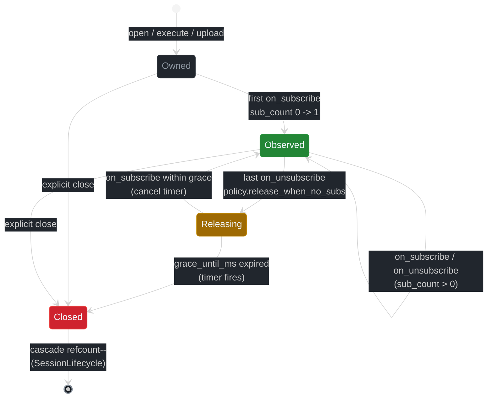

# CLAUDE.md

ssh-mcp **v7.0.0** — subscribe-first SSH MCP server. Hexagonal core (v4.1) plus six layered deltas: lifecycle binding ([ADR 0003](docs/adr/0003-lifecycle-binding.md), Phase 1 — merged), channel mux + sub_id ([ADR 0004](docs/adr/0004-channel-mux-fairness.md), Phase 2 — merged), LLM UX overhaul ([ADR 0005](docs/adr/0005-llm-ux-priorities.md), Phase 3 — merged), NDJSON daemon ([ADR 0008](docs/adr/0008-ndjson-daemon-protocol.md), Phase 4 — merged), serial transport ([ADR 0009](docs/adr/0009-serial-transport.md), v5.2 — merged), SFTP resume + verify ([ADR 0010](docs/adr/0010-sftp-resume.md), v6.1 — merged), and the rsync hybrid transport ([ADR 0011](docs/adr/0011-rsync-hybrid-transport.md), v7.0 — **merged**). v6.0 split the 36-tool catalogue across three semantic eixos: **`ssh_*`** (21 tools, ops over SSH), **`sub_*`** (9 tools, lane management — cross-resource), **`serial_*`** (6 tools, local UART/TTY/COM — no SSH). v7.0 ships **`ssh_rsync` / `ssh_rsync_cancel` / `ssh_rsync_stats`** with two integrated transports — `WireRsyncTransport` (canonical port of OpenBSD `openrsync` speaking rsync wire protocol v31 against a remote `rsync --server`) and `SftpRsyncTransport` (universal SFTP fallback). The Wire transport's openrsync port closed across ten slices: handshake (proto 27→31), file-list (16-bit `XMIT_EXTENDED_FLAGS` + varint30/varlong30), block-checksum decode + Adler32/MD4 hash kernels, MD4 (proto<30) / MD5 (proto≥30) per-file digest, multi-phase `send_files` loop, block-match path (Adler32 hashtable + sliding window), pull direction + receiver state machine, incremental pull, `--delete` + attrs apply (`-p -t -o -g -l`), `--partial` + `-S` sparse hole detection. **Push and pull both byte-identical against `rsync 3.2.7`** on a real Linux VM (six wire e2e tests in `tests/v7_rsync_wire_e2e_vm.rs`, gated `e2e-vm`). The SFTP fallback ships the supported subset (recursive mirror, dry-run, `--delete`, exclude/include patterns, attribute preservation gated on a per-session `SftpFeatures` capability probe). Slices 11–12 (`-c` checksum delta over a wire-format extension and `-H` hardlinks) are deferred — both surface `SFTP_FEATURE_MISSING` today. Resource URIs / push narrative / error taxonomy / structured-content payloads remain byte-identical to v5.x except for the additive `rsync://<id>/progress` scheme and 6 new error codes.

**v7.0.0-alpha.2 architectural retrenchment** — the original v7.0 plan shipped a deployed-agent transport (linux-x86_64 cross-compiled binary, embedded via `include_bytes!`, SFTP-uploaded with sha256 verification). That path was retracted in favour of "tudo integrado": both transports live inside the host crate. The `crates/ssh-mcp-rsync-agent/` and `crates/ssh-mcp-rsync-proto/` sub-crates were deleted; the workspace collapsed back to a **single package**. 4 agent-specific error codes (`AGENT_DEPLOY_FAILED`, `AGENT_ARCH_UNSUPPORTED`, `AGENT_TRUST_VIOLATION`, `AGENT_NOEXEC_TARGET`) were dropped; 1 new code (`SFTP_FEATURE_MISSING`) was added. The `transport` enum is now `Auto | Wire | Sftp`. Resolver 3, edition 2024, MSRV 1.95.

Full module map and design rationale: [docs/ARCHITECTURE.md](docs/ARCHITECTURE.md). Host migration guide: [docs/MIGRATION.md → v6.1 → v7.0](docs/MIGRATION.md#v61--v70).

## Build commands

```bash
cargo build --release                              # All binaries (default + port_forward)
cargo build --release --bin ssh-mcp                # HTTP server (axum 0.8 + rmcp 1.6)
cargo build --release --bin ssh-mcp-stdio          # Stdio MCP transport
cargo build --release --bin ssh-mcp-tail           # NDJSON daemon
cargo build --release --no-default-features        # No port forwarding
cargo test --lib --quiet                           # 1966 lib tests
cargo test --tests --features test-fixtures --quiet  # 134 integration tests across 9 binaries (v4_smoke 2, v5_smoke 8, v5_daemon_smoke 5, v6_resume_smoke 12, v7_rsync_smoke 9, chaos 41, chaos_rsync 16, property 32, property_rsync 9) + lockfree_invariants + lockfree_invariants_rsync (gated #[cfg(loom)]) + v7_rsync_e2e_vm 2 + v7_rsync_wire_e2e_vm 6 (gated e2e-vm)
cargo test --features test-fixtures                # Use cases vs deterministic adapters
cargo fmt --all -- --check
cargo clippy --release --all-features -- -D warnings   # Strict lint gate (production-only)
```

## Architecture summary (v5.0)

The public MCP API is structurally compatible with every v3 / v4.x release — every legacy tool keeps its block-markdown wire shape, structured JSON twin, env vars, and error codes. v5.0 stacks four additive layers on top of the v4.1 hexagonal base. Detailed module-by-module breakdown lives in [docs/ARCHITECTURE.md](docs/ARCHITECTURE.md#hexagonal-layer-map).

```mermaid
%%{init: {'theme':'dark','themeVariables':{'primaryColor':'#1f6feb','primaryTextColor':'#f0f6fc','primaryBorderColor':'#388bfd','lineColor':'#8b949e','secondaryColor':'#161b22','tertiaryColor':'#21262d','background':'#0d1117','mainBkg':'#161b22','secondBkg':'#21262d','tertiaryBkg':'#0d1117','nodeTextColor':'#f0f6fc','edgeLabelBackground':'#21262d','clusterBkg':'#161b22','clusterBorder':'#30363d','titleColor':'#f0f6fc'}}}%%
flowchart TB
    subgraph BIN["bin — entry points"]
        HTTP["src/main.rs<br/>HTTP"]
        STDIO["src/bin/ssh_mcp_stdio.rs<br/>stdio"]
        TAIL["src/bin/ssh_mcp_tail.rs<br/>NDJSON daemon"]
    end
    subgraph COMP["composition — wiring root"]
        PROD["prod.rs"]
        EMBED["embed.rs"]
        FIX["fixtures.rs"]
    end
    subgraph INFRA["infra/mcp — inbound MCP"]
        TR["tool_router.rs<br/>36 #[tool] fns"]
        RES["resource_handlers.rs"]
        PROMPTS["prompts.rs"]
    end
    subgraph APP["application — use cases"]
        UC["~22 *UseCase generic<br/>over ports"]
    end
    subgraph PORTS["ports — trait skeletons"]
        VPORTS["v4 ports + v5:<br/>lifecycle_policy<br/>channel_mux<br/>subscriber_lane"]
    end
    subgraph ADAPT["adapters — concrete impls"]
        RUSSH["ssh / sftp"]
        REPO["repo/dashmap"]
        LIFE["lifecycle/<br/>(Phase 1)"]
        SUBLANE["subscription/<br/>lane + mux<br/>(Phase 2)"]
    end
    subgraph DOMAIN["domain — pure"]
        ENT["entities + ids +<br/>lifecycle.rs +<br/>subscription.rs"]
    end

    BIN --> COMP
    COMP --> INFRA
    INFRA --> APP
    APP --> PORTS
    PORTS -.-> ADAPT
    ADAPT --> DOMAIN
    APP --> DOMAIN
    PORTS --> DOMAIN

    style BIN fill:#161b22,color:#f0f6fc,stroke:#30363d
    style COMP fill:#161b22,color:#f0f6fc,stroke:#30363d
    style INFRA fill:#161b22,color:#f0f6fc,stroke:#30363d
    style APP fill:#161b22,color:#f0f6fc,stroke:#30363d
    style PORTS fill:#161b22,color:#f0f6fc,stroke:#30363d
    style ADAPT fill:#161b22,color:#f0f6fc,stroke:#30363d
    style DOMAIN fill:#161b22,color:#f0f6fc,stroke:#30363d
    style HTTP fill:#1f6feb,color:#f0f6fc,stroke:#388bfd
    style STDIO fill:#1f6feb,color:#f0f6fc,stroke:#388bfd
    style TAIL fill:#a371f7,color:#f0f6fc,stroke:#bc8cff
    style LIFE fill:#238636,color:#f0f6fc,stroke:#2ea043
    style SUBLANE fill:#a371f7,color:#f0f6fc,stroke:#bc8cff
```



The four v5 deltas in one line each:

- **Lifecycle binding** ([ADR 0003](docs/adr/0003-lifecycle-binding.md)) — every long-lived resource is wrapped in a CAS state machine (`Owned → Observed → Releasing → Closed`) plus a per-session refcount. Grace timer arms when last subscriber detaches; new subscribes within the window cancel it. Cascade through `SessionLifecycle.active_refs` so a session with active resources is never reaped by inactivity TTL alone.
- **Channel mux + sub_id** ([ADR 0004](docs/adr/0004-channel-mux-fairness.md)) — push lanes key on `(SubId, Uri)` (UUIDv7). Each subscription owns its own `mpsc::channel(N)`, `LagPolicy`, filter pipeline, replay window, and `SubscriberStats`. A `ChannelMux` round-robin drainer guarantees fair scheduling. Legacy `(PeerId, Uri)` hosts get a synthesised `sub_id`.
- **LLM UX overhaul** ([ADR 0005](docs/adr/0005-llm-ux-priorities.md), Phase 3 — merged) — 9 net-new MCP tools (`sub_open`, `sub_close`, `sub_pause/resume/filter/replay/list/stats`, `sub_stats_all`); `HINT:` line severity escalation; 10-prompt catalog; `SUB_LEAK_RISK` watcher; 38-code error taxonomy ([ADR 0007](docs/adr/0007-error-taxonomy.md)).
- **NDJSON daemon binary** ([ADR 0008](docs/adr/0008-ndjson-daemon-protocol.md), Phase 4 — merged) — `ssh-mcp-tail` embeds rmcp server + in-process rmcp client across `tokio::io::duplex` and translates stdin NDJSON ops into MCP tool calls + stdout NDJSON events. Single binary, no IPC, Unix-pipeline composable.
- **Serial transport** ([ADR 0009](docs/adr/0009-serial-transport.md), v5.2 — merged) — 6 native UART / TTY / COM tools (`serial_open`, `serial_close`, `serial_write`, `serial_press`, `serial_scan`, `serial_active`) with the same lock-free reader / writer split, `serial://<id>/output` push lane, and `SUBSCRIPTION_REGISTRY` debouncer integration as `command://*/output`.

The text channel stays byte-identical to v4.7.1 / v4.8 on the 21 carry-over tools. The 9 new tools follow the same `KEY: value` + 8-hex nonce + `--- name [nonce] ---` envelope.

### Lifecycle state machine

CAS state machine driven from `src/adapters/lifecycle/refcount.rs` with all hot-path fields atomic (`AtomicU8` state, `AtomicUsize` sub_count, `AtomicU64` grace_until_ms, `ArcSwap<LifecyclePolicy>`, `Notify` waker). Cascade through `SessionLifecycle.active_refs: AtomicUsize` (`src/adapters/lifecycle/cascade.rs`). The session reaper consults `active_refs > 0` before honouring the inactivity TTL — refcount supersedes TTL.



Defaults preserve v4 semantics (`release_when_no_subs = false`); the flag is opt-in per `ssh_shell_open` / `ssh_exec` / `ssh_upload` / `ssh_download`. Field table, memory ordering, cascade orchestration: [docs/ARCHITECTURE.md](docs/ARCHITECTURE.md#phase-1--lifecycle-binding-merged) and [docs/DEVELOPMENT.md → Lifecycle adapter invariants](docs/DEVELOPMENT.md#lifecycle-adapter-invariants-phase-1).

### Channel mux pipeline

Each `resources/subscribe` (legacy) or `sub_open` (new tool) call mints a `SubId` (UUIDv7) and creates a `MultiplexLane` (`byte_cursor`, `tx`, `policy`, `filter`, `lifecycle` link, `stats`, `pause_flag`). The `ChannelMux` (`src/adapters/subscription/channel_mux.rs`) owns `DashMap<SubId, MultiplexLane>` plus `cursor_lane: AtomicUsize` for round-robin draining. Fairness invariant: between two backlogged lanes, the mux alternates `try_recv` and bumps cursor on every successful drain.


Per-lane field table and full subscribe pipeline (producer → debouncer → lane fan-out → mux drain → outbound writer): [docs/ARCHITECTURE.md](docs/ARCHITECTURE.md#subscribe-pipeline-v5-layered-view).

### LLM UX priorities

27B-class instruction-tuned models (Gemma 3 27B IT, Mistral Small 3, Qwen 2.5 32B) hot-poll, forget to unsubscribe, and ignore lag stats. v5 fixes this with a layered escalation surface — same advisory at four sites of increasing specificity:

1. Root `Implementation.instructions` — golden rules + 5 push-first happy paths.
2. Tool description — every long-running tool ends with `When: / Push: / Cleanup: / Cost: / Idempotency: / Hygiene:`.
3. Wire `HINT:` line — `REQUIRED NEXT STEP:` for required actions, `RECOMMENDED:` for soft suggestions.
4. Wire `NEXT:` line — concrete tool calls in push-first priority order.

Plus `SUB_LEAK_RISK` auto-warning watcher (background scan; default 2 s) and a 38-code error taxonomy with one-sentence DETAIL lines tuned for direct LLM consumption. Full guide: [docs/LLM_GUIDE.md](docs/LLM_GUIDE.md).

### Binary targets

| Binary | Source | Transport | Notes |
|---|---|---|---|
| `ssh-mcp` | `src/main.rs` | HTTP (axum 0.8 + rmcp StreamableHttpService) | Tracks sessions through `Mcp-Session-Id` header. Default bind `0.0.0.0:8000`, path `/`. Root mount uses `Router::fallback_service` (axum 0.8 panics on a nested `/` mount). |
| `ssh-mcp-stdio` | `src/bin/ssh_mcp_stdio.rs` | Stdio MCP (`rmcp::transport::io::stdio()`) | Logs to stderr via `RUST_LOG`. |
| `ssh-mcp-tail` | `src/bin/ssh_mcp_tail.rs` | NDJSON over stdin/stdout | Three subcommands (`run`, `shell`, `daemon`); `daemon` is the primary deliverable. Reference: [docs/DAEMON.md](docs/DAEMON.md). |

All three binaries are thin shells over `composition::prod` (and, for the daemon, `composition::embed`). Each spawns a background **peer-GC task** that scans the subscription registry on `SSH_MCP_PEER_GC_INTERVAL_S` (default 30 s) and drops peers whose rmcp transport closed (rmcp 1.6 does not surface a peer-disconnect callback).

### MCP tools

36 tools with `port_forward` / 35 without. Three semantic eixos: `ssh_*` (21), `sub_*` (9), `serial_*` (6). Catalogue and per-tool schemas: [docs/API.md](docs/API.md).

> **Lane fanout (v5.3)**: `sub_open` lanes carry the rmcp peer captured at tool-invocation time and receive `notifications/resources/updated` push delivery on stdio/HTTP transports through `LaneFanoutBridge` (in `src/adapters/subscription/lane_bridge.rs`). The bridge is installed on `MemoryRegistry` at composition; legacy `broadcast` walks the lane snapshot for the URI before the v4 peer fan-out, calls `notifier.notify_resource_updated` per lane peer, and increments per-lane atomics (`events_sent`, `bytes_sent`). The NDJSON daemon keeps the channel-mux outbound sink as its delivery path (lane peer = `None`).

Each session serializes one russh channel at a time through a per-session semaphore (`CHANNEL_CONCURRENCY_PER_SESSION = 1`) so rapid `execute + cancel` bursts never race OpenSSH's `MaxSessions` budget. The shared `SshHandleRegistry` lets the SFTP adapter reuse the russh handle for file transfers.

### MCP resources

6 push-capable schemes (`shell://<id>/output`, `command://<id>/output`, `transfer://<id>/progress`, `session://<id>/health`, `forward://<id>/events` (feature-gated), `serial://<id>/output` (v5.2 — ADR 0009)). Cursor support on `shell` / `command` / `forward` / `serial`. Subscriptions go through `MemoryRegistry<N>` (generic over the notifier port — no `Box<dyn>`). Debouncer coalesces on `SSH_NOTIFY_DEBOUNCE_MS` (default 200 ms), force-flushes after `SSH_NOTIFY_FORCE_FLUSH_MS` (default 1 s), keepalives every `SSH_NOTIFY_KEEPALIVE_S` (default 30 s). v5 lagged subscribers auto-recover via the per-lane `Snapshot` policy ([ADR 0006](docs/adr/0006-backpressure-policies.md)). Full contract: [docs/RESOURCES.md](docs/RESOURCES.md).

### Response format

All 36 (or 35 without `port_forward`) MCP tools return a single markdown `Text<String>` plus a parallel `structured_content` JSON object:

- First line: `TOOL_NAME: STATUS` (e.g. `SSH_CONNECT: OK`).
- One `KEY: value` per line. All IDs suffixed with `_ID`.
- Output blocks use an 8-hex-char nonce per response: `--- stdout [a3f2b1d7] ---\n<content>\n--- stderr [a3f2b1d7] (empty) ---`.
- Errors: `SSH_X: ERROR\nREASON: [CODE] description\nDETAIL: <one-sentence cure>` plus structured `{ tool, status: "error", code, reason, detail }`. Codes: [ADR 0007](docs/adr/0007-error-taxonomy.md) and [docs/LLM_GUIDE.md → Error handbook](docs/LLM_GUIDE.md#error-handbook).

The v4 / v5 markdown shape is byte-identical to v3 on the legacy text channel (verified by snapshot tests in `tests/v4_smoke.rs`).

### Configuration

All settings follow: **Parameter → Environment Variable → Default**. Full table (40 env vars across SSH, shell, command, transfer, notification, peer GC, subscriber lanes, daemon): [docs/CONFIGURATION.md](docs/CONFIGURATION.md). Defaults preserve v4 behaviour.

### Error handling

- **Categorised** ([ADR 0007](docs/adr/0007-error-taxonomy.md), extended by [ADR 0010](docs/adr/0010-sftp-resume.md)): 40 codes across 7 categories (`AUTH`, `TRANSPORT`, `REMOTE`, `RESOURCE`, `POLICY`, `STATE`, `INTERNAL`) with explicit retry semantics. v6.1 adds `RESUME_OVERSHOOT` and `RESUME_MISMATCH` to the `STATE` bucket. LLM hosts can branch on category alone.
- **Retryable**: `TRANSPORT` class — exponential backoff via `backon`, max 10 s.
- **Non-retryable**: `AUTH`, `RESOURCE`, `STATE` (without `_meta.idempotency_key`), `INTERNAL`.
- All tool returns are `Result<CallToolResult, McpError>` (rmcp). Internal layers use `Result<T, DomainError>` (`thiserror`).
- Every error response carries a one-sentence `DETAIL:` line tuned for direct LLM consumption — see [docs/LLM_GUIDE.md → Error handbook](docs/LLM_GUIDE.md#error-handbook).

## Code standards

### Clippy

Strict enforcement via `Cargo.toml` `[lints.clippy]`. Lock-free invariants are the headline:

- **Lint groups**: `clippy::all`, `clippy::pedantic`, `clippy::nursery`, `clippy::cargo` at `deny`.
- **Layer A (forbid)**: `unwrap_used`, `expect_used`, `panic`, `todo`, `unimplemented`, `dbg_macro`, `exit`, `mem_forget`, `infinite_loop`, `print_stdout`, `print_stderr`.
- **Lock-free invariants** (deny): `await_holding_lock`, `await_holding_refcell_ref`, `significant_drop_in_scrutinee`, `significant_drop_tightening`, `mutex_atomic`, `mutex_integer`. Every hot-path state type (`RunningCommand`, `RunningShell`, `RunningTransfer`, `SessionRef`, `ForwardHandle`, `ResourceLifecycle`, `SessionLifecycle`, `MultiplexLane`, `ChannelMux`) carries **zero** `Mutex` fields.
- **Quality denies**: `wildcard_enum_match_arm`, `as_conversions`, `clone_on_ref_ptr`, `implicit_clone`, `ref_patterns`, `absolute_paths`, `pub_use`, `allow_attributes_without_reason`, `format_push_string`, `if_then_some_else_none`, `rc_mutex`, `redundant_type_annotations`, `same_name_method`, `tests_outside_test_module`, etc.
- **Thresholds** (`clippy.toml`): `cognitive-complexity-threshold = 25`, `too-many-lines-threshold = 30`, `too-many-arguments-threshold = 7`, `type-complexity-threshold = 250`.
- **Allowed**: `multiple_crate_versions` (transitive deps from russh / axum).

All `#[allow(...)]` attributes **must** include a `reason = "..."`. Never disable a lint to silence a warning — fix the code instead.

**Clippy gate is production-only.** The canonical command is `cargo clippy --release --all-features -- -D warnings` and must always exit 0. Test targets are intentionally excluded — `forbid(clippy::unwrap_used)` / `forbid(clippy::expect_used)` is structurally incompatible with the `#[tokio::test]` macro expansion (the macro injects its own `#[allow(...)]` group, which `forbid` rejects via E0453). Production code stays under the full strict baseline; test code is gated by `cargo test --lib` (must keep green) plus `cargo build --release --all-targets` (must stay warning-free). New `unwrap()` / `expect()` outside test modules still fails the production clippy gate.

Lock-free invariants enforced by these lints (rewritten for v5 — covers lifecycle adapter atomics, lane mpsc, mux fairness, cascade refcount): [docs/DEVELOPMENT.md → Lock-free invariants](docs/DEVELOPMENT.md#lock-free-invariants).

### General

- Methods < 30 lines, SOLID principles.
- Lock-free everywhere on the hot path: `DashMap`, `ArcSwap`, `OnceCell`, `Atomic*`, `tokio::sync::broadcast`, `tokio::sync::Notify`, `mpsc` for owned-resource serialization.
- Use cases stay generic over their ports — **no `Box<dyn Trait>` in hot paths**. Async ports use `trait-variant` AFIT; the dyn-safe slices (`LaneAdmin`) live alongside the async slice for cold-path operations.
- Match exhaustively (no `_ =>` for closed enums; `wildcard_enum_match_arm = "deny"`).
- `Arc::clone(&x)` — never `x.clone()` on an `Arc` (`clone_on_ref_ptr = "deny"`).
- 1966 ssh-mcp lib tests + 134 integration tests across 9 binaries (`v4_smoke` 2, `v5_smoke` 8, `v5_daemon_smoke` 5, `v6_resume_smoke` 12, `v7_rsync_smoke` 9, `chaos` 41, `chaos_rsync` 16, `property` 32, `property_rsync` 9) + 20 loom invariants (`tests/lockfree_invariants.rs`, gated `#[cfg(loom)]`) + 7 rsync loom invariants (`tests/lockfree_invariants_rsync.rs`, gated `#[cfg(loom)]`) + 8 e2e VM tests (`v7_rsync_e2e_vm` 2 + `v7_rsync_wire_e2e_vm` 6, gated `e2e-vm`) + Python integration suites (`scripts/test_*.py`) + 5 stress scripts (`scripts/stress_*.py`).
- Feature flags: `port_forward` (default: enabled), `test-fixtures` (off — exposes deterministic adapters for downstream tests).
- Loom invariant tests in `tests/lockfree_invariants.rs` (gated `#[cfg(loom)]`); 20 `#[test]` annotations covering lifecycle CAS race, grace fire vs re-subscribe, cascade double-disconnect, cursor monotonicity, mux fairness, lane mpsc full + drop_oldest, concurrent lane add/remove during drain, cursor advance under contention. Full loom mode is currently blocked by upstream tokio/loom incompatibility in russh + axum.

## v5 migration notes

- Public MCP API is **wire-compatible** with v3 / v4. v3 / v4 hosts work against v5 servers without any change to wire format, tool catalogue, env vars, or markdown response shape.
- 9 net-new MCP tools (Phase 3) and a third binary `ssh-mcp-tail` (Phase 4). Both additive. v5.2 adds 6 serial / UART / TTY / COM tools (ADR 0009).
- `release_when_no_subs: bool` (default `false` — v4 semantics preserved) on `ssh_shell_open` / `ssh_exec` / `ssh_upload` / `ssh_download` per [ADR 0003](docs/adr/0003-lifecycle-binding.md).
- Cursors rekey from `(PeerId, Uri)` to `(SubId, Uri)` per [ADR 0004](docs/adr/0004-channel-mux-fairness.md). Legacy hosts get a synthesised `sub_id` — no host-side change required.
- Default lane LagPolicy is `Snapshot` (was: implicit broadcast `RecvError::Lagged` recovery in v4). Behaviour matches v4 semantics — [ADR 0006](docs/adr/0006-backpressure-policies.md).
- MSRV bumped to Rust **1.95** (Rust 2024 edition baseline + AFIT + APIs stabilised through 1.95).
- New env vars (lifecycle / lane / mux / daemon) — defaults preserve v4 behaviour. See [docs/CONFIGURATION.md](docs/CONFIGURATION.md).

Full host migration guide: [docs/MIGRATION.md → v4 → v5](docs/MIGRATION.md#v4--v5). v3 → v4 contributor narrative (the v4.1 deep-decouple addendum): [docs/MIGRATION.md → v3 → v4](docs/MIGRATION.md#v3--v4).

## v6.1 migration notes (ADR 0010)

- **Wire-additive** — every v6.0 host keeps working byte-for-byte. No tool name strings, env vars, or default-behaviour deltas. See [docs/MIGRATION.md → v6.0 → v6.1](docs/MIGRATION.md#v60--v61).
- Two opt-in `bool?` flags on `ssh_upload` / `ssh_download`: `resume` (default `false`) and `verify` (default `false`). Per [ADR 0010](docs/adr/0010-sftp-resume.md).
- One new response line: `RESUMED_FROM: <u64>` — emitted only when offset > 0. v6.0 callers see byte-identical wires.
- One new structured-content / domain field: `resumed_from: u64` with `#[serde(default)] = 0`.
- Two new wire codes: `RESUME_OVERSHOOT`, `RESUME_MISMATCH` (both `STATE`, neither retryable). Total error-taxonomy size grows from 38 to 40.
- No new env vars — see [docs/CONFIGURATION.md → v6.1 / ADR 0010](docs/CONFIGURATION.md#v61--adr-0010--resume--verify-no-new-env-vars).
