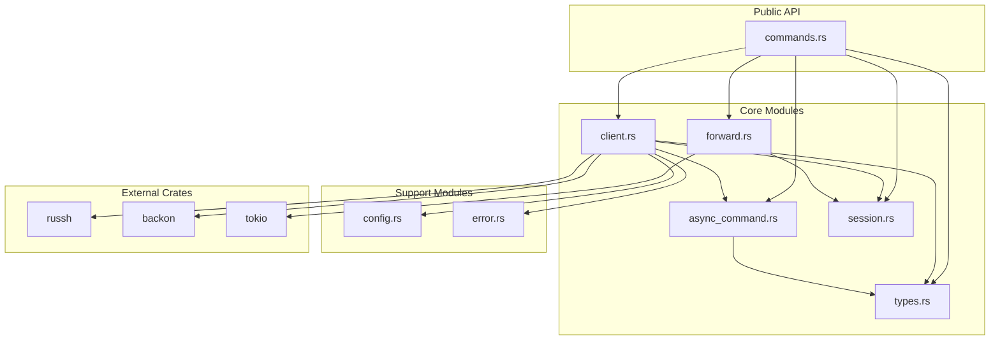
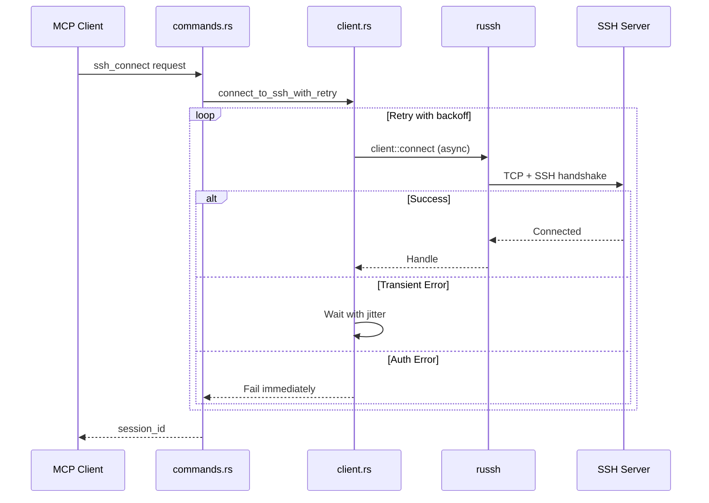

# SSH-MCP Server (Complete Rewrite)

> **This is NOT the original [mingyang91/ssh-mcp](https://github.com/mingyang91/ssh-mcp).**
> **Everything has been rewritten from scratch** - different SSH library, different architecture, different threading model.

[](https://www.rust-lang.org/)
[](LICENSE)
[]()

A Rust SSH server with Model Context Protocol (MCP) integration, enabling LLMs to connect to SSH servers and execute commands remotely.

---

## Why This Fork Exists

The original [mingyang91/ssh-mcp](https://github.com/mingyang91/ssh-mcp) uses `ssh2` (C library bindings) with blocking operations wrapped in `spawn_blocking`. This fork was created to provide:

- **Native async SSH** - No blocking thread pool, true async all the way down
- **Pure Rust** - No C dependencies, compiles anywhere
- **Efficient I/O** - OS-level multiplexing instead of busy-wait polling
- **Modular codebase** - 9 focused modules instead of 1 monolithic file
- **Comprehensive tests** - 136 unit tests covering all functionality

---

## Complete Comparison

| Aspect | Original ([mingyang91/ssh-mcp](https://github.com/mingyang91/ssh-mcp)) | This Fork |
|--------|----------------------|-----------|
| **SSH Library** | `ssh2` (libssh2 C bindings) | `russh` (pure Rust, async-native) |
| **Async Model** | `spawn_blocking()` wrappers | Native tokio async throughout |
| **Port Forwarding** | Manual thread + 10ms polling loop | `tokio::io::copy` + `select!` (zero-copy) |
| **I/O Multiplexing** | None (busy-wait) | Automatic kqueue/epoll/IOCP via mio |
| **C Dependencies** | Requires libssh2, openssl | None - pure Rust |
| **Thread Safety** | `Session` is `!Send` (requires `std::thread`) | `Handle` is `Send + Sync` |
| **Retry Logic** | None | Exponential backoff with jitter via `backon` |
| **Architecture** | Single ~800 line file | 9 modules, 4100+ lines |
| **Test Coverage** | 0 tests | 136 unit tests |
| **Documentation** | Basic README | 4 detailed docs + Mermaid diagrams |
| **Error Classification** | Basic | Smart retry vs non-retry detection |

### What Changed

```
REMOVED:
- ssh2 crate (C bindings to libssh2)
- tokio::task::spawn_blocking() calls
- std::thread::spawn() for port forwarding
- 10ms sleep polling loops
- Manual TCP forwarding implementation

ADDED:
- russh crate (pure Rust, native async)
- backon crate (exponential backoff with jitter)
- Modular architecture (9 files)
- Comprehensive test suite (136 tests)
- Async command execution (background commands with polling)
- Error classification for smart retries
- Documentation with Mermaid diagrams
```

---

## Features

- **Native Async SSH** - All operations use tokio async, no blocking
- **Multiple Auth Methods** - Password, key file, SSH agent
- **Port Forwarding** - Efficient bidirectional tunneling
- **Session Management** - Track multiple concurrent connections
- **Named Sessions** - Assign human-readable names for easy LLM identification
- **Persistent Sessions** - Keep sessions alive indefinitely without inactivity timeout
- **Async Commands** - Run long-running commands in background with polling
- **Smart Retry** - Exponential backoff for transient failures only
- **MCP Protocol** - Full integration with AI/LLM tools

---

## Documentation

| Document | Description |
|----------|-------------|
| [Architecture](docs/ARCHITECTURE.md) | Module design, async model, session storage |
| [Flows](docs/FLOWS.md) | Connection, execution, port forwarding sequences |
| [API Reference](docs/API.md) | Complete MCP tools reference |
| [Configuration](docs/CONFIGURATION.md) | Environment variables and setup |

---

## Quick Start

### Build

```bash
git clone https://github.com/farchanjo/ssh-mcp.git
cd ssh-mcp
cargo build --release
cargo test --all-features  # 136 tests
```

### Install

```bash
# Stdio transport (for MCP integration)
sudo cp ./target/release/ssh-mcp-stdio /usr/local/bin/
sudo codesign -f -s - /usr/local/bin/ssh-mcp-stdio  # macOS only

# HTTP server (optional)
sudo cp ./target/release/ssh-mcp /usr/local/bin/
sudo codesign -f -s - /usr/local/bin/ssh-mcp  # macOS only
```

### Option 1: Stdio Transport (ssh-mcp-stdio)

Uses stdin/stdout for communication. Recommended for most MCP integrations.

#### Claude Code

Add to `~/.claude/settings.json`:

```json
{
  "mcpServers": {
    "ssh": {
      "command": "ssh-mcp-stdio",
      "args": []
    }
  }
}
```

Or add to your project's `.mcp.json`:

```json
{
  "mcpServers": {
    "ssh": {
      "command": "ssh-mcp-stdio",
      "args": []
    }
  }
}
```

#### OpenCode

Add to `~/.config/opencode/opencode.json` (or `opencode.json` in project root):

```json
{
  "mcpServers": {
    "ssh": {
      "command": "ssh-mcp-stdio",
      "args": []
    }
  }
}
```

#### Claude Desktop / Cursor

Add to the MCP config file:

```json
{
  "mcpServers": {
    "ssh": {
      "command": "ssh-mcp-stdio",
      "args": []
    }
  }
}
```

### Option 2: HTTP Server (ssh-mcp)

Runs as a standalone HTTP server. Useful for shared access or non-stdio clients.

#### Start the Server

```bash
# Start on default port 8000
ssh-mcp

# Custom port
MCP_PORT=9000 ssh-mcp

# With debug logging
RUST_LOG=debug ssh-mcp
```

#### macOS Background Service (launchd)

Install as a system service that starts automatically:

```bash
# Create log directory
sudo mkdir -p /usr/local/var/log
sudo mkdir -p /usr/local/var/ssh-mcp

# Copy the plist file
sudo cp com.farchanjo.ssh-mcp.plist /Library/LaunchDaemons/

# Load and start the service
sudo launchctl load /Library/LaunchDaemons/com.farchanjo.ssh-mcp.plist

# Check status
sudo launchctl list | grep ssh-mcp

# View logs
tail -f /usr/local/var/log/ssh-mcp.log
tail -f /usr/local/var/log/ssh-mcp.error.log

# Stop the service
sudo launchctl unload /Library/LaunchDaemons/com.farchanjo.ssh-mcp.plist

# Restart the service
sudo launchctl unload /Library/LaunchDaemons/com.farchanjo.ssh-mcp.plist
sudo launchctl load /Library/LaunchDaemons/com.farchanjo.ssh-mcp.plist
```

For user-level service (no sudo, runs only when logged in):

```bash
cp com.farchanjo.ssh-mcp.plist ~/Library/LaunchAgents/
launchctl load ~/Library/LaunchAgents/com.farchanjo.ssh-mcp.plist
```

#### Claude Code (HTTP/SSE)

Add to `~/.claude/settings.json`:

```json
{
  "mcpServers": {
    "ssh": {
      "url": "http://localhost:8000/sse"
    }
  }
}
```

#### OpenCode (HTTP/SSE)

Add to `~/.config/opencode/opencode.json`:

```json
{
  "mcpServers": {
    "ssh": {
      "url": "http://localhost:8000/sse"
    }
  }
}
```

#### Direct HTTP Usage

Call MCP tools directly via HTTP:

```bash
# List sessions
curl -X POST http://localhost:8000/mcp \
  -H "Content-Type: application/json" \
  -d '{"jsonrpc":"2.0","id":1,"method":"tools/call","params":{"name":"ssh_list_sessions","arguments":{}}}'
```

---

## Usage Examples

### Connect with Password

```json
{
  "tool": "ssh_connect",
  "params": {
    "address": "example.com:22",
    "username": "user",
    "password": "secret"
  }
}
```

### Connect with SSH Agent (Recommended)

```json
{
  "tool": "ssh_connect",
  "params": {
    "address": "example.com:22",
    "username": "user"
  }
}
```

### Connect with Session Name (for LLM identification)

```json
{
  "tool": "ssh_connect",
  "params": {
    "address": "example.com:22",
    "username": "user",
    "name": "production-db"
  }
}
```

### Connect with Persistent Session (no inactivity timeout)

```json
{
  "tool": "ssh_connect",
  "params": {
    "address": "example.com:22",
    "username": "user",
    "name": "long-running-task",
    "persistent": true
  }
}
```

### Execute Command

```json
{
  "tool": "ssh_execute",
  "params": {
    "session_id": "uuid-from-connect",
    "command": "ls -la"
  }
}
```

### Port Forward

```json
{
  "tool": "ssh_forward",
  "params": {
    "session_id": "uuid-from-connect",
    "local_port": 8080,
    "remote_address": "localhost",
    "remote_port": 3000
  }
}
```

### List Sessions

```json
{
  "tool": "ssh_list_sessions",
  "params": {}
}
```

### Disconnect

```json
{
  "tool": "ssh_disconnect",
  "params": {
    "session_id": "uuid-from-connect"
  }
}
```

---

## Async Command Execution

For long-running commands (builds, deployments, data processing), use async execution instead of the synchronous `ssh_execute`. Async commands run in the background and can be polled for status and output.

### When to Use Async vs Sync

| Use `ssh_execute` (sync) | Use `ssh_execute_async` |
|--------------------------|-------------------------|
| Quick commands (< 30s) | Long-running commands (builds, deployments) |
| Need immediate result | Want to run multiple commands in parallel |
| Simple one-off commands | Need to monitor progress or cancel mid-execution |

### Workflow Overview

```
1. ssh_connect(address, username) → session_id
2. ssh_execute_async(session_id, command) → command_id
3. ssh_get_command_output(command_id, wait=false) → status: "running"
4. ssh_get_command_output(command_id, wait=true) → status: "completed", stdout, exit_code
5. ssh_disconnect(session_id) → cleans up all async commands
```

### Start Async Command

```json
{
  "tool": "ssh_execute_async",
  "params": {
    "session_id": "uuid-from-connect",
    "command": "npm run build",
    "timeout_secs": 300
  }
}
```

**Response:**
```json
{
  "command_id": "abc123-def456",
  "message": "Command started in background"
}
```

### Get Command Output

Poll immediately (`wait: false`) or block until completion (`wait: true`):

```json
{
  "tool": "ssh_get_command_output",
  "params": {
    "command_id": "abc123-def456",
    "wait": true,
    "wait_timeout_secs": 60
  }
}
```

**Response:**
```json
{
  "status": "completed",
  "stdout": "Build successful!\n",
  "stderr": "",
  "exit_code": 0
}
```

### List Async Commands

Filter by session or status:

```json
{
  "tool": "ssh_list_commands",
  "params": {
    "session_id": "uuid-from-connect",
    "status": "running"
  }
}
```

**Response:**
```json
{
  "commands": [
    {
      "command_id": "abc123-def456",
      "session_id": "uuid-from-connect",
      "command": "npm run build",
      "status": "running",
      "started_at": "2024-01-15T10:30:00Z"
    }
  ],
  "count": 1
}
```

### Cancel Command

Stop a running command and retrieve partial output:

```json
{
  "tool": "ssh_cancel_command",
  "params": {
    "command_id": "abc123-def456"
  }
}
```

**Response:**
```json
{
  "cancelled": true,
  "stdout": "Partial output collected...",
  "stderr": ""
}
```

### Status Values

| Status | Description | Available Fields |
|--------|-------------|------------------|
| `running` | Command still executing | `stdout`, `stderr` (partial) |
| `completed` | Finished successfully | `stdout`, `stderr`, `exit_code` |
| `cancelled` | Stopped by user | `stdout`, `stderr` (partial) |
| `failed` | Failed to start | `error` message |

### Example: Parallel Build and Test

```
# Start build and tests in parallel
ssh_execute_async(session_id, "cd /app && npm run build") → build_id
ssh_execute_async(session_id, "cd /app && npm test") → test_id

# Wait for both to complete
build_result = ssh_get_command_output(build_id, wait=true, wait_timeout_secs=120)
test_result = ssh_get_command_output(test_id, wait=true, wait_timeout_secs=60)

# Deploy if both succeeded
if build_result.exit_code == 0 and test_result.exit_code == 0:
    ssh_execute(session_id, "cd /app && ./deploy.sh")
```

### Example: Monitor Long Process

```
# Start long-running process
ssh_execute_async(session_id, "python train_model.py") → cmd_id

# Poll periodically to show progress
while True:
    result = ssh_get_command_output(cmd_id, wait=false)
    print(result.stdout)  # Show latest output
    if result.status != "running":
        break
    sleep(5)
```

### Limits

- Max 30 concurrent async commands per session
- Commands auto-cleanup when session disconnects
- Default timeout: 180s (configurable via `timeout_secs` or `SSH_COMMAND_TIMEOUT` env)

---

## Configuration

Priority: **Parameter > Environment Variable > Default**

| Variable | Default | Description |
|----------|---------|-------------|
| `SSH_CONNECT_TIMEOUT` | 30 | Connection timeout (seconds) |
| `SSH_COMMAND_TIMEOUT` | 180 | Command execution timeout (seconds) |
| `SSH_MAX_RETRIES` | 3 | Retry attempts for transient failures |
| `SSH_RETRY_DELAY_MS` | 1000 | Initial retry delay (milliseconds) |
| `SSH_COMPRESSION` | true | Enable zlib compression |
| `MCP_PORT` | 8000 | HTTP server port (ssh-mcp binary) |
| `RUST_LOG` | info | Log level (trace/debug/info/warn/error) |

---

## Architecture

### Module Structure

```
src/mcp/
├── mod.rs           (23 lines)   - Module declarations
├── types.rs         (916 lines)  - Response types (sync + async)
├── config.rs        (601 lines)  - Configuration resolution
├── error.rs         (359 lines)  - Error classification
├── session.rs       (88 lines)   - Session storage
├── client.rs        (862 lines)  - SSH connection/auth/execution
├── async_command.rs (398 lines)  - Async command tracking
├── forward.rs       (155 lines)  - Port forwarding
└── commands.rs      (745 lines)  - MCP tool handlers
```

### Module Dependencies



### Async Flow



---

## Testing

```bash
# All tests
cargo test --all-features

# Specific module
cargo test mcp::config
cargo test mcp::error
cargo test mcp::client

# With output
cargo test --all-features -- --nocapture
```

### Test Coverage

| Module | Tests | Coverage |
|--------|-------|----------|
| config.rs | 33 | Configuration resolution |
| error.rs | 29 | Error classification |
| client.rs | 22 | Address parsing, client config |
| types.rs | 38 | Serialization |
| async_command.rs | 14 | Async command storage and tracking |
| **Total** | **136** | |

---

## Binary Targets

| Binary | Description |
|--------|-------------|
| `ssh-mcp` | HTTP server on port 8000 (Poem framework) |
| `ssh-mcp-stdio` | Stdio transport for MCP integration |

---

## Credits

- Original concept: [mingyang91/ssh-mcp](https://github.com/mingyang91/ssh-mcp)
- SSH implementation: [russh](https://github.com/warp-tech/russh)
- Retry logic: [backon](https://github.com/Xuanwo/backon)
- MCP framework: [poem-mcpserver](https://github.com/poem-web/poem)

---

## License

MIT License - see [LICENSE](LICENSE)

---

## Contributing

Contributions welcome! Please ensure:
- All tests pass: `cargo test --all-features`
- No clippy warnings: `cargo clippy -- -D warnings`
- Code formatted: `cargo fmt`
