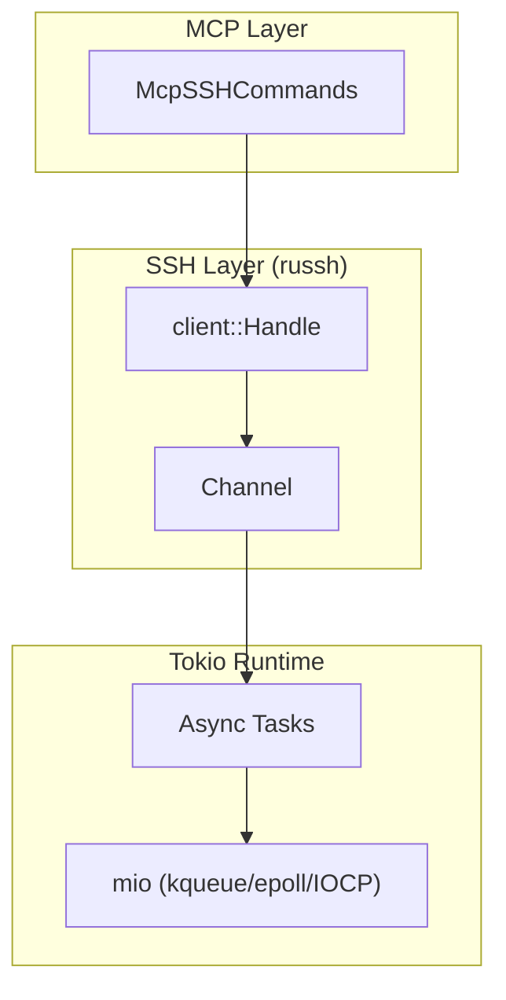

# SSH-MCP Server (Russh Fork)

> **This is a fork of [mingyang91/ssh-mcp](https://github.com/mingyang91/ssh-mcp) with a completely rewritten SSH implementation.**

[](https://www.rust-lang.org/)
[](LICENSE)

A Rust implementation of an SSH client server with Model Context Protocol (MCP) integration, allowing Large Language Models (LLMs) to connect to SSH servers and execute commands remotely.

## What's Different From Original

This fork has been **completely rewritten** with a different SSH backend and architecture:

| Aspect | Original (mingyang91) | This Fork |
|--------|----------------------|-----------|
| **SSH Library** | `ssh2` (libssh2 C bindings) | `russh` (pure Rust, async-native) |
| **Async Model** | `spawn_blocking` wrappers | Native tokio async |
| **Port Forwarding** | Manual thread polling (10ms sleep) | `tokio::io::copy` + `select!` |
| **I/O Backend** | Manual implementation | Automatic kqueue/epoll/IOCP via mio |
| **Dependencies** | Requires C libraries | Pure Rust, no C dependencies |
| **Thread Safety** | `Session` is `!Send` | `Handle` is `Send + Sync` |
| **Test Coverage** | None | 96 unit tests |
| **Documentation** | Basic README | Comprehensive docs with Mermaid diagrams |

### Key Improvements

- **No busy-wait polling** - Port forwarding uses efficient OS-level I/O multiplexing
- **True async** - All SSH operations are natively async, no blocking thread pool needed
- **Better error handling** - Retry logic with exponential backoff and jitter
- **Graceful disconnect** - Proper SSH disconnect messages
- **Cross-platform** - Pure Rust compiles anywhere without C toolchain

## Features

- **SSH Client Integration**: Connect to SSH servers via MCP commands
- **SSH Command Execution**: Run commands on remote SSH servers
- **Port Forwarding**: Setup SSH tunnels with efficient async I/O
- **Session Management**: Track and manage multiple SSH sessions
- **MCP Protocol Support**: Built with poem-mcpserver for AI/LLM compatibility
- **Automatic Retry**: Exponential backoff with jitter for transient failures
- **Multiple Auth Methods**: Password, key file, and SSH agent authentication

## Documentation

| Document | Description |
|----------|-------------|
| [Architecture](docs/ARCHITECTURE.md) | System design, components, and async model |
| [Flows](docs/FLOWS.md) | Connection, execution, and port forwarding flows |
| [API Reference](docs/API.md) | Complete MCP tools reference with examples |
| [Configuration](docs/CONFIGURATION.md) | Environment variables and setup guide |

## Quick Start

### Build from Source

```bash
# Clone this fork
git clone https://github.com/farchanjo/ssh-mcp.git
cd ssh-mcp

# Build release binaries
cargo build --release

# Run tests
cargo test --all-features
```

### Install the Binary

```bash
# Copy to PATH
sudo cp ./target/release/ssh-mcp-stdio /usr/local/bin/

# On macOS, sign the binary
sudo codesign -f -s - /usr/local/bin/ssh-mcp-stdio
```

### MCP Integration (Claude Desktop / Cursor)

Add to your MCP configuration:

```json
{
  "mcpServers": {
    "ssh": {
      "command": "ssh-mcp-stdio",
      "args": []
    }
  }
}
```

## Usage

### Connect to SSH Server

```json
{
  "tool": "ssh_connect",
  "params": {
    "address": "example.com:22",
    "username": "user",
    "password": "secret"
  }
}
```

Or with SSH agent (no password/key needed):

```json
{
  "tool": "ssh_connect",
  "params": {
    "address": "example.com:22",
    "username": "user"
  }
}
```

### Execute Commands

```json
{
  "tool": "ssh_execute",
  "params": {
    "session_id": "uuid-from-connect",
    "command": "ls -la"
  }
}
```

### Port Forwarding

```json
{
  "tool": "ssh_forward",
  "params": {
    "session_id": "uuid-from-connect",
    "local_port": 8080,
    "remote_address": "localhost",
    "remote_port": 3000
  }
}
```

### Disconnect

```json
{
  "tool": "ssh_disconnect",
  "params": {
    "session_id": "uuid-from-connect"
  }
}
```

## Configuration

All settings follow priority: **Parameter → Environment Variable → Default**

| Variable | Description | Default |
|----------|-------------|---------|
| `SSH_CONNECT_TIMEOUT` | Connection timeout (seconds) | 30 |
| `SSH_COMMAND_TIMEOUT` | Command execution timeout (seconds) | 180 |
| `SSH_MAX_RETRIES` | Max retry attempts for transient failures | 3 |
| `SSH_RETRY_DELAY_MS` | Initial retry delay (milliseconds) | 1000 |
| `SSH_COMPRESSION` | Enable zlib compression | true |
| `MCP_PORT` | HTTP server port (ssh-mcp binary only) | 8000 |
| `RUST_LOG` | Logging level | info |

See [Configuration Guide](docs/CONFIGURATION.md) for detailed documentation.

## Architecture



## Testing

```bash
# Run all tests
cargo test --all-features

# Run with output
cargo test --all-features -- --nocapture

# Run specific test module
cargo test config_resolution
```

## Original Project

This project is forked from [mingyang91/ssh-mcp](https://github.com/mingyang91/ssh-mcp).

The original project uses `ssh2` (libssh2 bindings) while this fork has been completely rewritten to use `russh` for native async support and better performance.

## License

This project is licensed under the MIT License - see the [LICENSE](LICENSE) file for details.

## Contributing

Contributions are welcome! Please feel free to submit a Pull Request.
