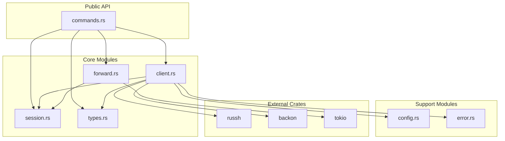
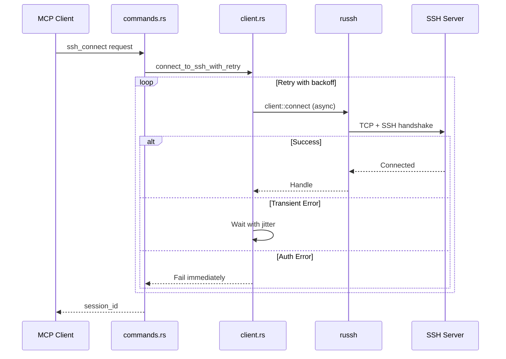

# SSH-MCP Server (Complete Rewrite)

> **This is NOT the original [mingyang91/ssh-mcp](https://github.com/mingyang91/ssh-mcp).**
> **Everything has been rewritten from scratch** - different SSH library, different architecture, different threading model.

[](https://www.rust-lang.org/)
[](LICENSE)
[]()

A Rust SSH server with Model Context Protocol (MCP) integration, enabling LLMs to connect to SSH servers and execute commands remotely.

---

## Why This Fork Exists

The original [mingyang91/ssh-mcp](https://github.com/mingyang91/ssh-mcp) uses `ssh2` (C library bindings) with blocking operations wrapped in `spawn_blocking`. This fork was created to provide:

- **Native async SSH** - No blocking thread pool, true async all the way down
- **Pure Rust** - No C dependencies, compiles anywhere
- **Efficient I/O** - OS-level multiplexing instead of busy-wait polling
- **Modular codebase** - 8 focused modules instead of 1 monolithic file
- **Comprehensive tests** - 93 unit tests covering all functionality

---

## Complete Comparison

| Aspect | Original ([mingyang91/ssh-mcp](https://github.com/mingyang91/ssh-mcp)) | This Fork |
|--------|----------------------|-----------|
| **SSH Library** | `ssh2` (libssh2 C bindings) | `russh` (pure Rust, async-native) |
| **Async Model** | `spawn_blocking()` wrappers | Native tokio async throughout |
| **Port Forwarding** | Manual thread + 10ms polling loop | `tokio::io::copy` + `select!` (zero-copy) |
| **I/O Multiplexing** | None (busy-wait) | Automatic kqueue/epoll/IOCP via mio |
| **C Dependencies** | Requires libssh2, openssl | None - pure Rust |
| **Thread Safety** | `Session` is `!Send` (requires `std::thread`) | `Handle` is `Send + Sync` |
| **Retry Logic** | None | Exponential backoff with jitter via `backon` |
| **Architecture** | Single ~800 line file | 8 modules, 2400+ lines |
| **Test Coverage** | 0 tests | 93 unit tests |
| **Documentation** | Basic README | 4 detailed docs + Mermaid diagrams |
| **Error Classification** | Basic | Smart retry vs non-retry detection |

### What Changed

```
REMOVED:
- ssh2 crate (C bindings to libssh2)
- tokio::task::spawn_blocking() calls
- std::thread::spawn() for port forwarding
- 10ms sleep polling loops
- Manual TCP forwarding implementation

ADDED:
- russh crate (pure Rust, native async)
- backon crate (exponential backoff with jitter)
- Modular architecture (8 files)
- Comprehensive test suite (93 tests)
- Error classification for smart retries
- Documentation with Mermaid diagrams
```

---

## Features

- **Native Async SSH** - All operations use tokio async, no blocking
- **Multiple Auth Methods** - Password, key file, SSH agent
- **Port Forwarding** - Efficient bidirectional tunneling
- **Session Management** - Track multiple concurrent connections
- **Smart Retry** - Exponential backoff for transient failures only
- **MCP Protocol** - Full integration with AI/LLM tools

---

## Documentation

| Document | Description |
|----------|-------------|
| [Architecture](docs/ARCHITECTURE.md) | Module design, async model, session storage |
| [Flows](docs/FLOWS.md) | Connection, execution, port forwarding sequences |
| [API Reference](docs/API.md) | Complete MCP tools reference |
| [Configuration](docs/CONFIGURATION.md) | Environment variables and setup |

---

## Quick Start

### Build

```bash
git clone https://github.com/farchanjo/ssh-mcp.git
cd ssh-mcp
cargo build --release
cargo test --all-features  # 93 tests
```

### Install

```bash
sudo cp ./target/release/ssh-mcp-stdio /usr/local/bin/
sudo codesign -f -s - /usr/local/bin/ssh-mcp-stdio  # macOS only
```

### MCP Configuration

Add to Claude Desktop or Cursor MCP config:

```json
{
  "mcpServers": {
    "ssh": {
      "command": "ssh-mcp-stdio",
      "args": []
    }
  }
}
```

---

## Usage Examples

### Connect with Password

```json
{
  "tool": "ssh_connect",
  "params": {
    "address": "example.com:22",
    "username": "user",
    "password": "secret"
  }
}
```

### Connect with SSH Agent (Recommended)

```json
{
  "tool": "ssh_connect",
  "params": {
    "address": "example.com:22",
    "username": "user"
  }
}
```

### Execute Command

```json
{
  "tool": "ssh_execute",
  "params": {
    "session_id": "uuid-from-connect",
    "command": "ls -la"
  }
}
```

### Port Forward

```json
{
  "tool": "ssh_forward",
  "params": {
    "session_id": "uuid-from-connect",
    "local_port": 8080,
    "remote_address": "localhost",
    "remote_port": 3000
  }
}
```

### List Sessions

```json
{
  "tool": "ssh_list_sessions",
  "params": {}
}
```

### Disconnect

```json
{
  "tool": "ssh_disconnect",
  "params": {
    "session_id": "uuid-from-connect"
  }
}
```

---

## Configuration

Priority: **Parameter > Environment Variable > Default**

| Variable | Default | Description |
|----------|---------|-------------|
| `SSH_CONNECT_TIMEOUT` | 30 | Connection timeout (seconds) |
| `SSH_COMMAND_TIMEOUT` | 180 | Command execution timeout (seconds) |
| `SSH_MAX_RETRIES` | 3 | Retry attempts for transient failures |
| `SSH_RETRY_DELAY_MS` | 1000 | Initial retry delay (milliseconds) |
| `SSH_COMPRESSION` | true | Enable zlib compression |
| `MCP_PORT` | 8000 | HTTP server port (ssh-mcp binary) |
| `RUST_LOG` | info | Log level (trace/debug/info/warn/error) |

---

## Architecture

### Module Structure

```
src/mcp/
├── mod.rs        (22 lines)   - Module declarations
├── types.rs      (283 lines)  - Response types
├── config.rs     (600 lines)  - Configuration resolution
├── error.rs      (359 lines)  - Error classification
├── session.rs    (87 lines)   - Session storage
├── client.rs     (636 lines)  - SSH connection/auth
├── forward.rs    (162 lines)  - Port forwarding
└── commands.rs   (262 lines)  - MCP tool handlers
```

### Module Dependencies



### Async Flow



---

## Testing

```bash
# All tests
cargo test --all-features

# Specific module
cargo test mcp::config
cargo test mcp::error
cargo test mcp::client

# With output
cargo test --all-features -- --nocapture
```

### Test Coverage

| Module | Tests | Coverage |
|--------|-------|----------|
| config.rs | 34 | Configuration resolution |
| error.rs | 29 | Error classification |
| client.rs | 17 | Address parsing, client config |
| types.rs | 13 | Serialization |
| **Total** | **93** | |

---

## Binary Targets

| Binary | Description |
|--------|-------------|
| `ssh-mcp` | HTTP server on port 8000 (Poem framework) |
| `ssh-mcp-stdio` | Stdio transport for MCP integration |

---

## Credits

- Original concept: [mingyang91/ssh-mcp](https://github.com/mingyang91/ssh-mcp)
- SSH implementation: [russh](https://github.com/warp-tech/russh)
- Retry logic: [backon](https://github.com/Xuanwo/backon)
- MCP framework: [poem-mcpserver](https://github.com/poem-web/poem)

---

## License

MIT License - see [LICENSE](LICENSE)

---

## Contributing

Contributions welcome! Please ensure:
- All tests pass: `cargo test --all-features`
- No clippy warnings: `cargo clippy -- -D warnings`
- Code formatted: `cargo fmt`
