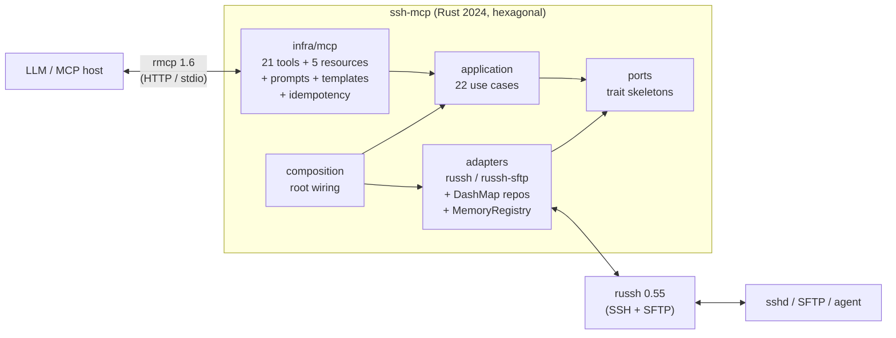

# ssh-mcp

[]()
[](https://www.rust-lang.org/)
[](Cargo.toml)
[]()
[]()
[]()
[]()

> [!CAUTION]
> This is **not** the original [mingyang91/ssh-mcp](https://github.com/mingyang91/ssh-mcp). Rewritten from scratch — different SSH library (`russh` 0.55), different MCP transport (`rmcp` 1.6), different threading model, lock-free hot-path state, full Hexagonal (Ports + Adapters) layout.

A Rust MCP server that exposes SSH as Model Context Protocol tools. LLMs connect to remote hosts, run commands, drive interactive PTY shells with realtime resource subscriptions, transfer files via SFTP, and forward TCP ports — over `rmcp` 1.6 Streamable HTTP (axum-hosted) or stdio. Built for small LLMs (27B-30B class): every tool advertises a typed `output_schema` (v4.8), a `structured_content` JSON twin sits next to the Markdown body, and inter-tool conversation hints (`NEXT:`, `HINT:`, prompts catalog) chain workflows without external docs.

## Quick start

```bash
git clone https://github.com/farchanjo/ssh-mcp.git && cd ssh-mcp
cargo build --release
sudo cp target/release/ssh-mcp{,-stdio} /usr/local/bin/
```

Then run one of the two transports:

```bash
ssh-mcp-stdio                              # stdio transport (recommended for local MCP hosts)
ssh-mcp                                    # HTTP transport on 0.0.0.0:8000/
```

## Highlights (v4.8.1)

| Surface | Count | Notes |
|:---|:---:|:---|
| MCP tools | **21** (20 without `port_forward`) | Connection / Commands / Shell / SFTP / Network |
| Tools advertising `output_schema` | **21 / 21** | v4.8 lifted coverage from 9 to full (additive on `tools/list`) |
| Resource subscribe streams | **5** | `shell://`, `command://`, `transfer://`, `session://`, `forward://` |
| `prompts/list` workflows | **5** | `run_one_shot_command`, `investigate_session`, `upload_and_verify`, `interactive_shell_drive`, `cleanup_agent` |
| RFC 6570 resource templates | **4** (5 with `port_forward`) | Advertised on `resources/templates/list` |
| Mutating tools wrapped by idempotency cache | **15** | Dedup via `_meta.idempotency_key` |
| Wire error tags | **14 + 1** | All live as of v4.6, plus v4.7 `IDEMPOTENCY_KEY_TOO_LONG` |
| Lib tests | **1172** | Plus 2 integration, 11 v4.7 pytest suites, v4.8.1 transfer-progress integration, 4 stress scripts |

The text channel is byte-identical to v3.0.0 / v4.0.x / v4.5 / v4.6 / v4.7. The v4.7 `structured_content` JSON channel sits next to it. v4.8 adds typed schema *advertisement* on every tool's `tools/list` metadata — runtime payloads unchanged. Hosts walking the Markdown body keep working without modification.

## Architecture


```mermaid
flowchart LR
    LLM["LLM / MCP host"]
    subgraph SshMcp["ssh-mcp (Rust 2024, hexagonal)"]
        direction TB
        Infra["infra/mcp<br/>21 tools + 5 resources<br/>+ prompts + templates<br/>+ idempotency"]
        App["application<br/>22 use cases"]
        Ports["ports<br/>trait skeletons"]
        Adapters["adapters<br/>russh / russh-sftp<br/>+ DashMap repos<br/>+ MemoryRegistry"]
        Comp["composition<br/>root wiring"]
        Infra --> App
        App --> Ports
        Adapters --> Ports
        Comp --> Adapters
        Comp --> App
    end
    Russh["russh 0.55<br/>(SSH + SFTP)"]
    Remote["sshd / SFTP / agent"]

    LLM <-->|"rmcp 1.6<br/>(HTTP / stdio)"| Infra
    Adapters <--> Russh
    Russh <--> Remote
```

The full layer-by-layer module map, the subscribe pipeline, and the lock-free invariants live in [docs/ARCHITECTURE.md](docs/ARCHITECTURE.md).

## MCP tools

Every tool advertises a typed `output_schema` on `tools/list` (v4.8). The Markdown body and the parallel `structured_content` JSON twin are byte-stable from v4.7.

| Group | Tool | Purpose | `output_schema` |
|:---|:---|:---|:---:|
| Connection | `ssh_connect` | Open SSH session (typed `ReusePolicy`) | yes |
| Connection | `ssh_disconnect` | Close one session | yes |
| Connection | `ssh_disconnect_many` *(v4.7)* | Best-effort batch (1..=64 ids) | yes |
| Connection | `ssh_list_sessions` | List live sessions (filter by `agent_id`) | yes |
| Connection | `ssh_disconnect_agent` | Bulk-cleanup all sessions owned by an agent | yes |
| Commands | `ssh_execute` | Async command (optional `pty=true`) | yes |
| Commands | `ssh_execute_batch` *(v4.7)* | Sequential 1..=16 commands, stop-on-failure | yes |
| Commands | `ssh_run` *(v4.7)* | One-shot connect + execute + optional disconnect | yes |
| Commands | `ssh_get_command_output` | Poll or long-poll (`wait`, `wait_timeout_secs`) | yes |
| Commands | `ssh_list_commands` | List commands (typed `CommandStatus`) | yes |
| Commands | `ssh_cancel_command` | Cancel an in-flight command | yes |
| Shell | `ssh_shell_open` | Open PTY (carries optional `INITIAL_BUFFER:` line) | yes |
| Shell | `ssh_shell_write` | Send raw bytes to PTY | yes |
| Shell | `ssh_shell_send_key` | Semantic keystrokes + modifiers + repeat | yes |
| Shell | `ssh_shell_read` | Snapshot or long-poll (`wait`, `min_bytes`) | yes |
| Shell | `ssh_shell_wait_for` | Multi-pattern gate | yes |
| Shell | `ssh_shell_close` | Close PTY | yes |
| SFTP | `ssh_upload` | Streaming upload (`transfer://` push) | yes |
| SFTP | `ssh_download` | Streaming download | yes |
| SFTP | `ssh_get_transfer_progress` | Poll or long-poll progress | yes |
| Network | `ssh_forward` *(feature `port_forward`)* | Local TCP port forward | yes |

Per-tool input schema, response shape, and structured payload: [docs/API.md](docs/API.md).

## Resource streams

5 subscribe-friendly URI schemes. Subscribe via `resources/subscribe`; the server pushes `notifications/resources/updated` (SSE on HTTP, stdout on stdio); pull deltas via `resources/read?cursor=auto`.

| URI scheme | Pushes | Cursor | MIME |
|:---|:---|:---:|:---|
| `shell://<shell-id>/output` | PTY output stream | yes | `text/plain` |
| `command://<command-id>/output` | Async command stdout/stderr | yes | `text/plain` |
| `transfer://<transfer-id>/progress` | SFTP point-in-time progress | no | `application/json` |
| `session://<session-id>/health` | Session health snapshot | no | `application/json` |
| `forward://<forward-id>/events` *(feature `port_forward`)* | Port-forward event log | yes | `application/json` |

Producer events coalesce on `SSH_NOTIFY_DEBOUNCE_MS` (default 50 ms), force-flush after `SSH_NOTIFY_FORCE_FLUSH_MS` (default 1000 ms), and keepalive every `SSH_NOTIFY_KEEPALIVE_S` (default 30 s). Each event carries a sequence number for gap detection; lagged subscribers auto-recover by reading from the snapshot buffer. Full contract: [docs/RESOURCES.md](docs/RESOURCES.md). Token-efficient subscribe-first patterns: [docs/LLM_GUIDE.md](docs/LLM_GUIDE.md).

## Configuration

Three-tier resolution: **Parameter > Environment Variable > Built-in default**. The full env-var table (25+ vars including broadcast caps, debouncer timing, peer GC, idempotency cache) lives in [docs/CONFIGURATION.md](docs/CONFIGURATION.md). Most-used vars:

| Variable | Default | Description |
|:---|:---|:---|
| `MCP_HOST` / `MCP_PORT` | `0.0.0.0` / `8000` | HTTP transport bind |
| `MCP_HTTP_PATH` | `/` | HTTP mount path |
| `RUST_LOG` | `info` | Tracing filter |
| `SSH_CONNECT_TIMEOUT` | `30` (s) | SSH handshake timeout |
| `SSH_COMMAND_TIMEOUT` | `180` (s) | Default per-command timeout |
| `SSH_INACTIVITY_TIMEOUT` | `300` (s) | Session idle timeout (disabled when `persistent=true`) |
| `SSH_SHELL_INACTIVITY_TTL` | `600` (s) | Shell auto-close on idle |
| `SSH_SHELL_MAX_BUFFER_SIZE` | `10m` | Shell output buffer cap (`b`/`k`/`m`/`g`/`t`) |
| `SSH_NOTIFY_DEBOUNCE_MS` | `50` | Subscribe debounce window |
| `SSH_IDEMPOTENCY_TTL_SECS` | `300` | Idempotency cache TTL (v4.7) |

## Versioning and compatibility

| Surface | v3.0 | v4.0 | v4.5 | v4.6 | v4.7 | **v4.8** |
|:---|:---:|:---:|:---:|:---:|:---:|:---:|
| Markdown response body | byte-stable | byte-stable | byte-stable | byte-stable* | byte-stable | byte-stable |
| Tool count | 18 | 18 | 18 | 18 | 21 | **21** |
| Tools with `output_schema` | 0 | 0 | 0 | 0 | 9 | **21** |
| `structured_content` channel | — | — | — | — | added | unchanged |
| `prompts/list` | — | — | — | — | added | unchanged |
| `resources/templates/list` | — | — | — | — | added | unchanged |
| `notifications/progress` | — | — | — | — | added | unchanged |
| Idempotency cache | — | — | — | — | added | unchanged |
| Hexagonal layout | — | added | — | — | — | unchanged |

*v4.6 narrow rename: wire key `AGENT:` -> `AGENT_ID:`. Generic key/value parsers unaffected.

v4.8 is **strictly additive** on the `tools/list` metadata: it advertises the typed schema for the 12 tools that previously emitted free-form structured payloads (and consolidates the v4.7 ad-hoc `output_schema` advertisements on the other 9 into the same path). Wire shape, env vars, error codes, runtime behaviour — all unchanged from v4.7.1.

Contributor migration guide: [docs/MIGRATION_v3_to_v4.md](docs/MIGRATION_v3_to_v4.md). Historical client guide v2 -> v3: [docs/MIGRATION_v2_to_v3.md](docs/MIGRATION_v2_to_v3.md).

## Development

```bash
cargo build --release                                                    # both binaries
cargo build --release --bin ssh-mcp                                      # HTTP only
cargo build --release --bin ssh-mcp-stdio                                # stdio only
cargo build --release --no-default-features                              # without port_forward
cargo test --lib --quiet                                                 # 1168 unit tests
cargo test --tests --quiet                                               # 2 integration tests
cargo test --features test-fixtures                                      # use cases against in-memory adapters
cargo fmt --all -- --check
cargo clippy --all-features --all-targets --workspace -- -D warnings
```

Python integration suites (require a reachable sshd):

```bash
python3 scripts/test_http.py                # HTTP transport — all 21 tools + resources
python3 scripts/test_stdio.py               # stdio transport — all 21 tools + resources
python3 scripts/test_send_key.py            # ssh_shell_send_key
python3 scripts/test_wait_for.py            # ssh_shell_wait_for
python3 scripts/test_resources.py           # 5 schemes + subscribe + cursor
python3 scripts/stress_subscribe.py         # subscribe burst
python3 scripts/stress_concurrent_writes.py # writer-task ownership
python3 scripts/stress_lagged_sub.py        # lagged-subscriber recovery
python3 scripts/stress_locks.py             # lock-free hot-path
```

For changes touching shell / command / transfer hot-path state, read [docs/LOCKS.md](docs/LOCKS.md) before introducing any `Mutex`. For changes spanning multiple layers, [docs/ARCHITECTURE.md](docs/ARCHITECTURE.md) shows where each layer's responsibility lies.

### Documentation map

| Document | Description |
|:---|:---|
| [docs/ARCHITECTURE.md](docs/ARCHITECTURE.md) | Hexagonal layout, layer-by-layer module map, dependency graph, sequence diagrams |
| [docs/API.md](docs/API.md) | All 21 MCP tools (inputs, outputs, structured_content, errors) |
| [docs/RESOURCES.md](docs/RESOURCES.md) | 5 resource schemes, cursor / sequence semantics, `_meta` envelope |
| [docs/LLM_GUIDE.md](docs/LLM_GUIDE.md) | Token-efficient subscribe-first patterns for LLM hosts |
| [docs/FLOWS.md](docs/FLOWS.md) | Sequence diagrams for connect / execute / shell / SFTP / subscribe |
| [docs/CONFIGURATION.md](docs/CONFIGURATION.md) | Full env-var table (25+ vars, floors and caps, tuning profiles) |
| [docs/ERRORS.md](docs/ERRORS.md) | Error code catalogue (REASON codes + recovery hints) |
| [docs/LOCKS.md](docs/LOCKS.md) | Lock-free invariants per layer + Clippy enforcement |
| [docs/MIGRATION_v3_to_v4.md](docs/MIGRATION_v3_to_v4.md) | Contributor migration guide (v4.1 deep-decouple addendum) |
| [docs/MIGRATION_v2_to_v3.md](docs/MIGRATION_v2_to_v3.md) | Historical client upgrade guide |
| [docs/adr/0001-migrate-to-rmcp.md](docs/adr/0001-migrate-to-rmcp.md) | Decision: poem-mcpserver -> rmcp 1.6 (v3) |
| [docs/adr/0002-adopt-hexagonal-architecture.md](docs/adr/0002-adopt-hexagonal-architecture.md) | Decision: adopt Hexagonal layout (v4) |

## License

MIT — declared via `license = "MIT"` in `Cargo.toml`.

## Author and links

- Author: Fabricio Archanjo (<fabricio@archanjo.com>)
- Issues: <https://github.com/farchanjo/ssh-mcp/issues>
- Releases: <https://github.com/farchanjo/ssh-mcp/releases>
- Original concept: [mingyang91/ssh-mcp](https://github.com/mingyang91/ssh-mcp)
- SSH library: [russh](https://github.com/warp-tech/russh) — SFTP via [russh-sftp](https://github.com/AspectUnk/russh-sftp)
- MCP framework: [rmcp](https://github.com/modelcontextprotocol/rust-sdk) (official Anthropic Rust SDK)
- HTTP host: [axum](https://github.com/tokio-rs/axum) + [tower](https://github.com/tower-rs/tower)
- Lock-free primitives: [arc-swap](https://github.com/vorner/arc-swap), [dashmap](https://github.com/xacrimon/dashmap)
