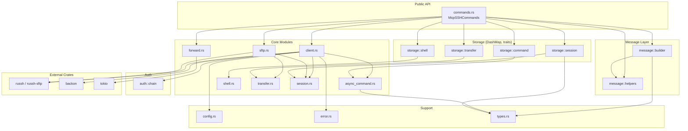

# SSH-MCP Server (Complete Rewrite)

> [!caution]
> This is **NOT** the original [mingyang91/ssh-mcp](https://github.com/mingyang91/ssh-mcp).
> **Everything has been rewritten from scratch** - different SSH library, different architecture, different threading model.

[](https://www.rust-lang.org/)
[](Cargo.toml)
[]()
[]()

A Rust SSH server with Model Context Protocol (MCP) integration, enabling LLMs to connect to SSH servers and execute commands remotely.

[[_TOC_]]

## Why This Fork Exists

The original [mingyang91/ssh-mcp](https://github.com/mingyang91/ssh-mcp) uses `ssh2` (C library bindings) with blocking operations wrapped in `spawn_blocking`. This fork was created to provide:

- **Native async SSH** — No blocking thread pool, true async all the way down
- **Pure Rust** — No C dependencies, compiles anywhere
- **Efficient I/O** — OS-level multiplexing instead of busy-wait polling
- **Interactive shells** — PTY support for SOL/IPMI/OOB access
- **SFTP file transfer** — Streaming upload/download with progress tracking
- **Modular codebase** — 28 focused source files (≈12.9K lines) instead of 1 monolithic file
- **Comprehensive tests** — 501 unit tests + two integration suites (HTTP and stdio)

## Complete Comparison

| Aspect | Original ([mingyang91/ssh-mcp](https://github.com/mingyang91/ssh-mcp)) | This Fork |
|--------|----------------------|-----------|
| **SSH Library** | `ssh2` (libssh2 C bindings) | `russh` 0.55 (pure Rust, async-native) |
| **Async Model** | `spawn_blocking()` wrappers | Native tokio async throughout |
| **Port Forwarding** | Manual thread + 10ms polling loop | `tokio::io::copy` + `select!` (zero-copy) |
| **I/O Multiplexing** | None (busy-wait) | Automatic kqueue/epoll/IOCP via mio |
| **C Dependencies** | Requires libssh2, openssl | None — pure Rust |
| **Thread Safety** | `Session` is `!Send` (requires `std::thread`) | `Handle` is `Send + Sync` |
| **Retry Logic** | None | Exponential backoff with jitter via `backon` |
| **Interactive Shells** | Not supported | PTY sessions for SOL/IPMI/OOB access |
| **SFTP** | Not supported | Streaming upload/download with progress |
| **Architecture** | Single ~800-line file | 28 source files, ≈12.9K lines |
| **Test Coverage** | 0 tests | 501 unit tests + HTTP/stdio integration suites |
| **Documentation** | Basic README | 4 detailed docs + Mermaid diagrams |
| **Error Classification** | Basic | Smart retry vs non-retry detection |
| **Response Format** | Plain text | Structured markdown (v2.0) with typed status lines and nonce-protected output blocks |

<details>
<summary>What Changed</summary>

```
REMOVED:
- ssh2 crate (C bindings to libssh2)
- tokio::task::spawn_blocking() calls
- std::thread::spawn() for port forwarding
- 10ms sleep polling loops
- Manual TCP forwarding implementation
- v1 structured JSON response types (v2.0)

ADDED:
- russh crate (pure Rust, native async)
- russh-sftp crate (SFTP streaming support)
- backon crate (exponential backoff with jitter)
- SOLID architecture (28 source files with storage/auth/message/shell/sftp abstractions)
- Comprehensive test suite (501 unit tests + HTTP/stdio integration suites)
- Async command execution (background commands with polling and cancellation)
- Interactive PTY shell sessions (SOL/IPMI/OOB support) with inactivity TTL + bounded buffer
- SFTP upload/download with progress tracking and error classification
- Smart session reuse (ssh_connect reuse="suggest"|"auto"|"force_new")
- Markdown response format with anti-injection nonces (v2.0)
- Head-drained bounded output buffers (commands and shells)
- Error classification for smart retries
- Documentation with Mermaid diagrams
```

</details>

## Features

- **Native Async SSH** — All operations use tokio async, no blocking
- **Multiple Auth Methods** — Password, key file (explicit or auto-discovered in `~/.ssh/`), SSH agent
- **Port Forwarding** — Efficient bidirectional tunneling (feature-gated: `port_forward`)
- **Session Management** — Track multiple concurrent connections, lock-free with `DashMap`
- **Named Sessions** — Assign human-readable names for easy LLM identification
- **Persistent Sessions** — Keep sessions alive indefinitely without inactivity timeout
- **Smart Session Reuse** — `ssh_connect` auto-detects existing sessions for the same identity triple (host, port, username)
- **Async Commands** — Run long-running commands in background with polling and mid-run cancellation
- **Interactive Shells** — PTY sessions for SOL/IPMI/OOB console access, up to 10 per session
- **Smart Retry** — Exponential backoff for transient failures only
- **SFTP Transfers** — Streaming upload/download in 32 KiB chunks, up to 10 concurrent transfers per session
- **Bounded Buffers** — Head-drained caps for both command and shell output protect long-running processes from OOM
- **Structured Markdown Output** — First-line `TOOL: STATUS` header, nonce-protected output blocks, UTF-8 safe truncation
- **MCP Protocol** — Full integration with AI/LLM tools (16 tools)

## Documentation

| Document | Description |
|----------|-------------|
| [Architecture](docs/ARCHITECTURE.md) | Module design, async model, storage layers |
| [Flows](docs/FLOWS.md) | Connection, execution, port forwarding, SFTP sequences |
| [API Reference](docs/API.md) | Complete MCP tools reference (v2.0 markdown format) |
| [Configuration](docs/CONFIGURATION.md) | Environment variables and setup |

## Quick Start

### Build

```bash
git clone https://github.com/farchanjo/ssh-mcp.git
cd ssh-mcp
cargo build --release
cargo test --all-features  # 501 tests
```

### Install

```bash
# Stdio transport (for MCP integration)
sudo cp ./target/release/ssh-mcp-stdio /usr/local/bin/
sudo codesign -f -s - /usr/local/bin/ssh-mcp-stdio  # macOS only

# HTTP server (optional)
sudo cp ./target/release/ssh-mcp /usr/local/bin/
sudo codesign -f -s - /usr/local/bin/ssh-mcp  # macOS only
```

### Option 1: Stdio Transport (ssh-mcp-stdio)

Uses stdin/stdout for communication. Recommended for most MCP integrations. Logs are emitted on stderr so they never interfere with the JSON-RPC stream on stdout.

<details>
<summary>Client configuration examples</summary>

#### Claude Code

Add to `~/.claude/settings.json`:

```json
{
  "mcpServers": {
    "ssh": {
      "command": "ssh-mcp-stdio",
      "args": []
    }
  }
}
```

Or add to your project's `.mcp.json`:

```json
{
  "mcpServers": {
    "ssh": {
      "command": "ssh-mcp-stdio",
      "args": []
    }
  }
}
```

#### OpenCode

Add to `~/.config/opencode/opencode.json` (or `opencode.json` in project root):

```json
{
  "mcpServers": {
    "ssh": {
      "command": "ssh-mcp-stdio",
      "args": []
    }
  }
}
```

#### Claude Desktop / Cursor

Add to the MCP config file:

```json
{
  "mcpServers": {
    "ssh": {
      "command": "ssh-mcp-stdio",
      "args": []
    }
  }
}
```

</details>

### Option 2: HTTP Server (ssh-mcp)

Runs as a standalone HTTP server. Useful for shared access or non-stdio clients.

#### Start the Server

```bash
# Start on default port 8000
ssh-mcp

# Custom port
MCP_PORT=9000 ssh-mcp

# Bind to localhost only
MCP_HOST=127.0.0.1 ssh-mcp

# With debug logging
RUST_LOG=debug ssh-mcp
```

<details>
<summary>macOS Background Service (launchd)</summary>

Install as a system service that starts automatically:

```bash
# Create log directory
sudo mkdir -p /usr/local/var/log
sudo mkdir -p /usr/local/var/ssh-mcp

# Copy the plist file
sudo cp com.farchanjo.ssh-mcp.plist /Library/LaunchDaemons/

# Load and start the service
sudo launchctl load /Library/LaunchDaemons/com.farchanjo.ssh-mcp.plist

# Check status
sudo launchctl list | grep ssh-mcp

# View logs
tail -f /usr/local/var/log/ssh-mcp.log
tail -f /usr/local/var/log/ssh-mcp.error.log

# Stop the service
sudo launchctl unload /Library/LaunchDaemons/com.farchanjo.ssh-mcp.plist

# Restart the service
sudo launchctl unload /Library/LaunchDaemons/com.farchanjo.ssh-mcp.plist
sudo launchctl load /Library/LaunchDaemons/com.farchanjo.ssh-mcp.plist
```

For user-level service (no sudo, runs only when logged in):

```bash
cp com.farchanjo.ssh-mcp.plist ~/Library/LaunchAgents/
launchctl load ~/Library/LaunchAgents/com.farchanjo.ssh-mcp.plist
```

</details>

<details>
<summary>Client configuration examples</summary>

#### Claude Code (HTTP/SSE)

Add to `~/.claude/settings.json`:

```json
{
  "mcpServers": {
    "ssh": {
      "url": "http://localhost:8000/"
    }
  }
}
```

#### OpenCode (HTTP/SSE)

Add to `~/.config/opencode/opencode.json`:

```json
{
  "mcpServers": {
    "ssh": {
      "url": "http://localhost:8000/"
    }
  }
}
```

#### Direct HTTP Usage

Call MCP tools directly via HTTP:

```bash
# List sessions
curl -X POST http://localhost:8000/ \
  -H "Content-Type: application/json" \
  -d '{"jsonrpc":"2.0","id":1,"method":"tools/call","params":{"name":"ssh_list_sessions","arguments":{}}}'
```

</details>

## Response Format (v2.0)

All 16 MCP tools return a **plain markdown `String`** instead of structured JSON. The format is designed to be both LLM-friendly and machine-parseable.

### Structure

- **First line**: `TOOL_NAME: STATUS` (statuses: `OK`, `REUSED`, `SUGGESTED`, `STARTED`, `RUNNING`, `COMPLETED`, `FAILED`, `TIMEOUT`, `CANCELLED`, `NOOP`, `OPEN`, `CLOSED`, `ACTIVE`, `ERROR`).
- **Block layout** when there are 4+ fields or an embedded output block: one `KEY: value` per line.
- **Inline layout** when there are ≤3 simple fields: `TOOL: STATUS | KEY: v | KEY: v`.
- **Identifiers** use the `_ID` suffix (`SESSION_ID`, `COMMAND_ID`, `SHELL_ID`, `TRANSFER_ID`).

### Output Blocks

Commands and shells that return raw data emit a nonce-protected delimiter to prevent injection from content that imitates the block markers:

```
--- stdout [a3f2b1d7] ---
<content...>
--- stderr [a3f2b1d7] (empty) ---
```

- A fresh **8-character lowercase hex nonce** is generated per response.
- When output is truncated, the annotation carries the truncation extent: `(truncated: showing 16.0KB of 2.3MB)`.
- While a command is still running, the annotation is `(partial)`.

### Error Format

```
SSH_EXECUTE: ERROR
REASON: [CODE] human-readable reason
DETAIL: optional context (truncated to 2 KiB when longer)
```

Error codes include `SESSION_NOT_FOUND`, `COMMAND_NOT_FOUND`, `COMMAND_FAILED`, `SHELL_NOT_FOUND`, `TRANSFER_NOT_FOUND`, `MAX_COMMANDS_EXCEEDED`, `MAX_SHELLS_EXCEEDED`, `MAX_TRANSFERS_EXCEEDED`, `CONNECTION_FAILED`, `FORWARD_FAILED`, `CHANNEL_FAILED`, `LOCAL_FILE_ERROR`, `LOCAL_NOT_FILE`, `REMOTE_METADATA_ERROR`, `SFTP_OPEN_FAILED`, `FEATURE_DISABLED`, and the SFTP classifier codes `FILE_NOT_FOUND`, `PERMISSION_DENIED`, `DISK_FULL`, `CONNECTION_LOST`, `REMOTE_DIR_NOT_FOUND`, `READ_ONLY_FS`, `SFTP_PROTOCOL`, `TIMEOUT`, `IO_ERROR`.

### Parser Reference

`scripts/test_http.py` and `scripts/test_stdio.py` ship a `parse_mcp_response(text)` helper that maps the markdown back into the legacy field names (`session_id`, `command_id`, `stdout`, `count`, ...). Clients that need structured access can use it as a starting point.

## Usage Examples

<details>
<summary>Usage examples</summary>

### Connect with Password

```json
{
  "tool": "ssh_connect",
  "arguments": {
    "address": "example.com:22",
    "username": "user",
    "password": "secret"
  }
}
```

Response:

```
SSH_CONNECT: OK
SESSION_ID: 550e8400-e29b-41d4-a716-446655440000
HOST: user@example.com:22
RETRY: 0
PERSISTENT: false
```

### Connect with SSH Agent (Recommended)

```json
{
  "tool": "ssh_connect",
  "arguments": {
    "address": "example.com:22",
    "username": "user"
  }
}
```

### Connect with Session Name (for LLM identification)

```json
{
  "tool": "ssh_connect",
  "arguments": {
    "address": "example.com:22",
    "username": "user",
    "name": "production-db"
  }
}
```

### Connect with Persistent Session (no inactivity timeout)

```json
{
  "tool": "ssh_connect",
  "arguments": {
    "address": "example.com:22",
    "username": "user",
    "name": "long-running-task",
    "persistent": true
  }
}
```

### Smart Session Reuse

```json
{
  "tool": "ssh_connect",
  "arguments": {
    "address": "example.com:22",
    "username": "user",
    "reuse": "auto"
  }
}
```

- `"suggest"` (default): returns `SSH_CONNECT: SUGGESTED` listing matching sessions without connecting.
- `"auto"`: reuses the most recent healthy match and returns `SSH_CONNECT: REUSED`.
- `"force_new"`: skips the lookup and always creates a new connection.

In every mode, unhealthy matches are disconnected before creating a new session and reported via `REPLACED: N`.

### Execute Command

```json
{
  "tool": "ssh_execute",
  "arguments": {
    "session_id": "uuid-from-connect",
    "command": "ls -la"
  }
}
```

Response:

```
SSH_EXECUTE: STARTED
COMMAND_ID: a1b2c3d4-e5f6-7890-abcd-ef1234567890
SESSION_ID: 550e8400-e29b-41d4-a716-446655440000
```

### Port Forward

```json
{
  "tool": "ssh_forward",
  "arguments": {
    "session_id": "uuid-from-connect",
    "local_port": 8080,
    "remote_address": "localhost",
    "remote_port": 3000
  }
}
```

Response:

```
SSH_FORWARD: OK | LOCAL: 127.0.0.1:8080 | REMOTE: localhost:3000 | ACTIVE: true
```

### List Sessions

```json
{
  "tool": "ssh_list_sessions",
  "arguments": {}
}
```

Response:

```
SSH_LIST_SESSIONS: OK
COUNT: 2
- 550e8400-... user@example.com:22 [agent: my-agent, healthy]
- 6ba7b810-... deploy@server.example.com:22 [name: prod-api, healthy]
```

### Disconnect

```json
{
  "tool": "ssh_disconnect",
  "arguments": {
    "session_id": "uuid-from-connect"
  }
}
```

Response:

```
SSH_DISCONNECT: OK | SESSION_ID: 550e8400-e29b-41d4-a716-446655440000
```

</details>

## Interactive Shell Sessions

For persistent interactive terminals (SOL/IPMI/OOB consoles, serial devices, or commands requiring PTY like `sudo` and `top`).

<details>
<summary>Interactive shell examples</summary>

### Open Shell

```json
{
  "tool": "ssh_shell_open",
  "arguments": {
    "session_id": "uuid-from-connect",
    "term": "xterm",
    "cols": 80,
    "rows": 24
  }
}
```

Response:

```
SSH_SHELL_OPEN: OK
SHELL_ID: a1b2c3d4-e5f6-7890-abcd-ef1234567890
SESSION_ID: 550e8400-e29b-41d4-a716-446655440000
TERM: xterm 80x24
```

### Send Input

```json
{
  "tool": "ssh_shell_write",
  "arguments": {
    "shell_id": "uuid-from-shell-open",
    "input": "ls -la\n"
  }
}
```

Response:

```
SSH_SHELL_WRITE: OK | SHELL_ID: a1b2c3d4-... | BYTES_SENT: 7
```

### Read Output

```json
{
  "tool": "ssh_shell_read",
  "arguments": {
    "shell_id": "uuid-from-shell-open",
    "clear": true,
    "max_output_bytes": 16384
  }
}
```

Response:

```
SSH_SHELL_READ: OPEN
SHELL_ID: a1b2c3d4-...
--- data [c7e1f4a2] ---
total 42
drwxr-xr-x  5 user group 160 Jan 15 10:30 .
...
```

### Close Shell

```json
{
  "tool": "ssh_shell_close",
  "arguments": {
    "shell_id": "uuid-from-shell-open"
  }
}
```

### SOL / IPMI / OOB Access

For Serial Over LAN or out-of-band management consoles:

```json
{
  "tool": "ssh_shell_open",
  "arguments": {
    "session_id": "uuid-from-connect",
    "term": "vt100",
    "cols": 80,
    "rows": 24
  }
}
```

</details>

### Limits

> [!note]
> - Max 10 concurrent interactive shells per session
> - Shells auto-cleanup when session disconnects
> - Idle shells are auto-closed after `SSH_SHELL_INACTIVITY_TTL` (default 600s)
> - Shell output buffer is bounded by `SSH_SHELL_MAX_BUFFER_SIZE` (default 10 MiB); oldest bytes are trimmed when exceeded

## Async Command Execution

For long-running commands (builds, deployments, data processing), use `ssh_execute` which runs commands in the background and can be polled for status and output. Each SSH session multiplexes one channel at a time (OpenSSH `MaxSessions` friendly) — rapid `execute + cancel` bursts queue through a per-session semaphore instead of racing the server.

### When to Use Async Execution

| Scenario | Reason |
|----------|--------|
| Long-running commands | Builds, deployments, data processing |
| Parallel execution | Run multiple commands concurrently |
| Progress monitoring | Poll for partial output during execution |
| Cancellation needed | Ability to stop mid-execution |

### Workflow Overview

```
1. ssh_connect(address, username) -> SESSION_ID
2. ssh_execute(session_id, command) -> COMMAND_ID
3. ssh_get_command_output(command_id, wait=false) -> status: RUNNING
4. ssh_get_command_output(command_id, wait=true) -> status: COMPLETED, stdout, EXIT
5. ssh_disconnect(session_id) -> cleans up all async commands
```

<details>
<summary>Async command examples</summary>

### Start Command

```json
{
  "tool": "ssh_execute",
  "arguments": {
    "session_id": "uuid-from-connect",
    "command": "npm run build",
    "timeout_secs": 300
  }
}
```

**Response:**

```
SSH_EXECUTE: STARTED
COMMAND_ID: abc123-def456
SESSION_ID: uuid-from-connect
```

### Get Command Output

Poll immediately (`wait: false`) or block until completion (`wait: true`). Use `max_output_bytes` to cap how much tail output is returned (default 16 KiB, hard cap 1 MiB).

```json
{
  "tool": "ssh_get_command_output",
  "arguments": {
    "command_id": "abc123-def456",
    "wait": true,
    "wait_timeout_secs": 60,
    "max_output_bytes": 32768
  }
}
```

**Response:**

```
SSH_GET_COMMAND_OUTPUT: COMPLETED
COMMAND_ID: abc123-def456
EXIT: 0
--- stdout [a3f2b1d7] ---
Build successful!
--- stderr [a3f2b1d7] (empty) ---
```

### List Async Commands

Filter by session or status, cap the page size with `max_items` (default 500, cap 10 000):

```json
{
  "tool": "ssh_list_commands",
  "arguments": {
    "session_id": "uuid-from-connect",
    "status": "running",
    "max_items": 100
  }
}
```

**Response:**

```
SSH_LIST_COMMANDS: OK
COUNT: 1
- abc123-def456 [RUNNING] uuid-from-connect: npm run build (10:30:00)
```

### Cancel Command

Stop a running command and retrieve partial output. The tool waits up to 5s for the background task to transition out of `RUNNING` (so the server-side channel is confirmed closed) before returning.

```json
{
  "tool": "ssh_cancel_command",
  "arguments": {
    "command_id": "abc123-def456"
  }
}
```

**Response:**

```
SSH_CANCEL_COMMAND: CANCELLED
COMMAND_ID: abc123-def456
--- stdout [nonce] (partial) ---
Partial output collected...
--- stderr [nonce] (partial, empty) ---
```

If the command already terminated (not running), the response is a NOOP:

```
SSH_CANCEL_COMMAND: NOOP | COMMAND_ID: abc123-def456 | REASON: not running
```

### Status Values

| Status | Description | Available Fields |
|--------|-------------|------------------|
| `RUNNING` | Command still executing | `stdout`, `stderr` (partial) |
| `COMPLETED` | Finished (may be timeout) | `stdout`, `stderr`, `EXIT` (-1 on timeout) |
| `TIMEOUT` | Exceeded `timeout_secs` | `stdout`, `stderr` (partial) |
| `CANCELLED` | Stopped by user | `stdout`, `stderr` (partial) |
| `FAILED` | Failed to start | `ERROR` reason line |

### Example: Parallel Build and Test

```
# Start build and tests in parallel
ssh_execute(session_id, "cd /app && npm run build") -> build_id
ssh_execute(session_id, "cd /app && npm test") -> test_id

# Wait for both to complete
build_result = ssh_get_command_output(build_id, wait=true, wait_timeout_secs=120)
test_result = ssh_get_command_output(test_id, wait=true, wait_timeout_secs=60)

# Deploy if both succeeded
if build_result.exit_code == 0 and test_result.exit_code == 0:
    ssh_execute(session_id, "cd /app && ./deploy.sh")
```

### Example: Monitor Long Process

```
# Start long-running process
ssh_execute(session_id, "python train_model.py") -> cmd_id

# Poll periodically to show progress
while True:
    result = ssh_get_command_output(cmd_id, wait=false)
    print(result.stdout)  # Show latest output
    if result.status != "RUNNING":
        break
    sleep(5)
```

</details>

### Limits

> [!note]
> - Max 100 concurrent async commands per session
> - Each session multiplexes a single russh channel at a time (semaphore-serialized)
> - Commands auto-cleanup after output is read (or after `SSH_COMMAND_CLEANUP_TTL`, default 60s, if unread)
> - Per-command stdout/stderr is bounded by `SSH_COMMAND_MAX_BUFFER_SIZE` (default 10 MiB) — oldest bytes are drained head-first
> - Default command timeout: 180s (configurable via `timeout_secs` or `SSH_COMMAND_TIMEOUT`)

## SFTP Transfers

`ssh_upload` and `ssh_download` stream files in 32 KiB chunks and return a `TRANSFER_ID` you can poll via `ssh_get_transfer_progress`.

<details>
<summary>SFTP examples</summary>

### Start an Upload

```json
{
  "tool": "ssh_upload",
  "arguments": {
    "session_id": "uuid-from-connect",
    "local_path": "~/Downloads/backup.tar.gz",
    "remote_path": "/var/backups/backup.tar.gz"
  }
}
```

Response:

```
SSH_UPLOAD: STARTED
TRANSFER_ID: xfer-1-abc
SESSION_ID: uuid-from-connect
FROM: /Users/me/Downloads/backup.tar.gz
TO: /var/backups/backup.tar.gz
SIZE: 245.7MB (257632256 bytes)
BYTES: 257632256
```

### Poll Progress

```json
{
  "tool": "ssh_get_transfer_progress",
  "arguments": {
    "transfer_id": "xfer-1-abc",
    "wait": true,
    "wait_timeout_secs": 60
  }
}
```

Responses (any of):

```
SSH_GET_TRANSFER_PROGRESS: RUNNING | TRANSFER_ID: xfer-1-abc | UPLOAD 42% (108200100/257632256 bytes)
```

```
SSH_GET_TRANSFER_PROGRESS: COMPLETED | TRANSFER_ID: xfer-1-abc | UPLOAD 100% (257632256/257632256 bytes)
```

```
SSH_GET_TRANSFER_PROGRESS: FAILED
TRANSFER_ID: xfer-1-abc
DIRECTION: UPLOAD
PROGRESS: 10% (25763225/257632256 bytes)
REASON: [CONNECTION_LOST] ...
```

### Download

Same shape, swap directions:

```json
{
  "tool": "ssh_download",
  "arguments": {
    "session_id": "uuid-from-connect",
    "remote_path": "/var/log/app.log",
    "local_path": "~/logs/app.log"
  }
}
```

</details>

### Limits

> [!note]
> - Max 10 concurrent transfers per session
> - Transfers stream in 32 KiB chunks to minimize memory
> - Terminal transfers (Completed / Failed / Cancelled) are kept for `SSH_TRANSFER_CLEANUP_TTL` (default 300s) then auto-removed from storage

## Configuration

Priority: **Parameter > Environment Variable > Default**

| Variable | Default | Description |
|----------|---------|-------------|
| `SSH_CONNECT_TIMEOUT` | 30s | Connection timeout |
| `SSH_COMMAND_TIMEOUT` | 180s | Command execution timeout |
| `SSH_MAX_RETRIES` | 3 | Retry attempts for transient failures |
| `SSH_RETRY_DELAY_MS` | 1000ms | Initial retry delay (milliseconds) |
| `SSH_INACTIVITY_TIMEOUT` | 300s | Session inactivity timeout (disabled when `persistent=true`) |
| `SSH_COMPRESSION` | true | Enable zlib compression |
| `SSH_COMMAND_CLEANUP_TTL` | 60s | TTL before unread completed command output is removed from storage |
| `SSH_COMMAND_MAX_BUFFER_SIZE` | 10m | Per-command stdout/stderr cap (head-drained on overflow) |
| `SSH_SHELL_INACTIVITY_TTL` | 600s | Auto-close shell after this much idle time |
| `SSH_SHELL_MAX_BUFFER_SIZE` | 10m | Shell output buffer cap (b/k/m/g/t suffixes) |
| `SSH_TRANSFER_CLEANUP_TTL` | 300s | TTL before terminated transfers are removed from storage |
| `SSH_MCP_OUTPUT_DEFAULT_BYTES` | 16384 | Default `max_output_bytes` for output-returning tools |
| `SSH_MCP_OUTPUT_MAX_BYTES_CAP` | 1048576 | Hard cap on `max_output_bytes` |
| `SSH_MCP_LIST_MAX_ITEMS` | 500 | Default `max_items` for list tools |
| `SSH_MCP_LIST_MAX_ITEMS_CAP` | 10000 | Hard cap on `max_items` |
| `MCP_HOST` | 0.0.0.0 | HTTP server bind address (ssh-mcp binary) |
| `MCP_PORT` | 8000 | HTTP server port (ssh-mcp binary) |
| `RUST_LOG` | info | Log level (trace/debug/info/warn/error) |

See [docs/CONFIGURATION.md](docs/CONFIGURATION.md) for parsing details (byte suffixes, precedence edge cases, and shell-specific syntax).

## Architecture

### Module Structure

<details>
<summary>Module structure (28 files, ≈12.9K lines)</summary>

```
src/
├── lib.rs                                 - Library crate root (clippy strictness config)
├── main.rs                                - HTTP server binary (Poem, streamable_http)
├── bin/
│   └── ssh_mcp_stdio.rs         (~320)    - Stdio transport binary (JSON-RPC over stdin/stdout)
└── mcp/
    ├── mod.rs                    (40)     - Module root, re-exports
    ├── types.rs                  (230)    - Internal data carriers (SessionInfo, AsyncCommandInfo, ShellInfo)
    ├── config.rs                 (1101)   - Config resolution + byte-size parsing
    ├── error.rs                  (359)    - Retryable vs non-retryable classification
    ├── session.rs                (41)     - SshClientHandler (russh host-key handler)
    ├── client.rs                 (1220)   - Connect/auth/exec/PTY, retry with backon
    ├── async_command.rs          (325)    - RunningCommand + bounded OutputBuffer
    ├── shell.rs                  (152)    - RunningShell + ChannelWriter
    ├── schema.rs                 (76)     - JSON schema helpers for schemars
    ├── forward.rs                (168)    - Port forwarding (feature-gated)
    ├── commands.rs               (2272)   - 16 MCP tool handlers + orchestration helpers
    ├── sftp.rs                   (740)    - SFTP streaming + error classification
    ├── transfer.rs               (342)    - Transfer types + constants (CHUNK_SIZE=32KB)
    ├── storage/
    │   ├── mod.rs                (12)
    │   ├── traits.rs             (186)    - SessionStorage, CommandStorage, ShellStorage, TransferStorage
    │   ├── session.rs            (691)    - DashMap impl + agent + identity indices
    │   ├── command.rs            (1088)   - DashMap impl + session index
    │   ├── shell.rs              (173)
    │   └── transfer.rs           (173)
    ├── auth/
    │   ├── mod.rs                (30)
    │   ├── traits.rs             (40)     - AuthStrategy trait
    │   ├── password.rs           (129)
    │   ├── key.rs                (212)    - RSA-hash negotiation via best_supported_rsa_hash
    │   ├── agent.rs              (145)
    │   └── chain.rs              (330)    - AuthChain composite (password -> keys -> agent)
    └── message/
        ├── mod.rs                (8)
        ├── helpers.rs            (1001)   - nonce, UTF-8 truncation, sanitize, format_error
        └── builder.rs            (1635)   - Per-tool markdown builders + tests
```

</details>

### Module Dependencies


```mermaid
flowchart TB
    subgraph Public["Public API"]
        Commands["commands.rs<br/>McpSSHCommands"]
    end

    subgraph Core["Core Modules"]
        Client["client.rs"]
        AsyncCmd["async_command.rs"]
        Shell["shell.rs"]
        Forward["forward.rs"]
        SFTP["sftp.rs"]
        Transfer["transfer.rs"]
        Session["session.rs"]
    end

    subgraph Storage["Storage (DashMap, traits)"]
        StoreSess["storage::session"]
        StoreCmd["storage::command"]
        StoreShell["storage::shell"]
        StoreXfer["storage::transfer"]
    end

    subgraph Support["Support"]
        Config["config.rs"]
        Error["error.rs"]
        Types["types.rs"]
    end

    subgraph MessageLayer["Message Layer"]
        Helpers["message::helpers"]
        Builder["message::builder"]
    end

    subgraph Auth["Auth"]
        AuthChain["auth::chain"]
    end

    subgraph External["External Crates"]
        Russh["russh / russh-sftp"]
        Backon["backon"]
        Tokio["tokio"]
    end

    Commands --> StoreSess
    Commands --> StoreCmd
    Commands --> StoreShell
    Commands --> StoreXfer
    Commands --> Client
    Commands --> SFTP
    Commands --> Forward
    Commands --> Builder
    Commands --> Helpers
    Builder --> Helpers
    Builder --> Types
    Client --> AuthChain
    Client --> Config
    Client --> Error
    Client --> AsyncCmd
    Client --> Session
    SFTP --> Session
    SFTP --> Transfer
    AsyncCmd --> Types
    StoreSess --> Types
    StoreSess --> Session
    StoreCmd --> AsyncCmd
    StoreShell --> Shell
    StoreXfer --> Transfer
    Client --> Russh
    Client --> Backon
    Forward --> Tokio
    SFTP --> Russh
```

## Testing

```bash
# All unit tests
cargo test --all-features

# Specific module
cargo test mcp::config
cargo test mcp::error
cargo test mcp::client
cargo test mcp::sftp
cargo test mcp::transfer
cargo test mcp::message

# With output
cargo test --all-features -- --nocapture

# Integration tests (requires SSH server reachable)
python3 scripts/test_http.py   # HTTP transport (server must be running)
python3 scripts/test_stdio.py  # Stdio transport (uses binary directly)
```

### Unit Test Coverage

| Module | Tests | Coverage |
|--------|-------|----------|
| `message/helpers.rs` | 83 | Nonce, UTF-8 truncation, sanitize, bytes format, `format_error`, `render_output_block` |
| `config.rs` | 61 | Configuration resolution + byte-size parser |
| `message/builder.rs` | 53 | Markdown builders (connect, execute, shell, transfer, progress, disconnect, list) |
| `storage/command.rs` | 39 | Command storage operations + session index |
| `storage/session.rs` | 35 | Session storage + agent/identity indices |
| `sftp.rs` | 35 | SFTP helpers, path resolution, error classification |
| `client.rs` | 30 | Address parsing, client config, default key discovery |
| `error.rs` | 29 | Retryable vs non-retryable classification |
| `auth/chain.rs` | 23 | AuthChain composite |
| `transfer.rs` | 20 | Transfer tracking types, constants |
| `async_command.rs` | 17 | `OutputBuffer` bounded draining + stress |
| `auth/key.rs` | 16 | Key auth (RSA, Ed25519) |
| `auth/password.rs` | 13 | Password auth |
| `bin/ssh_mcp_stdio.rs` | 10 | JSON-RPC ID routing, cancel interception, fallback responses |
| `storage/shell.rs` | 8 | Shell storage + session index |
| `storage/transfer.rs` | 8 | Transfer storage + session index |
| `auth/agent.rs` | 6 | SSH agent auth |
| `types.rs` | 6 | `SessionInfo`, `AsyncCommandInfo`, `ShellInfo` basics |
| `shell.rs` | 5 | Running shell types |
| `schema.rs` | 4 | JSON schema helpers |
| **Total** | **501** | |

### Integration Tests

| Script | Purpose |
|--------|---------|
| `scripts/test_http.py` | HTTP transport: all 16 tools + chaos/concurrency; ships a `parse_mcp_response` helper |
| `scripts/test_stdio.py` | Stdio transport: all 16 tools + chaos/concurrency; same parser helper |

<details>
<summary>Integration test categories</summary>

Integration test categories: smart reuse (suggest / auto / force_new / REPLACED), concurrent same-session commands, cross-session routing, shell write+disconnect race, rapid connect/disconnect stress, cancel while polling, cancel+execute bursts against OpenSSH `MaxSessions`, multi-session routing verification, invalid ID error handling, mixed valid+invalid concurrent operations, SFTP upload/download with progress polling.

</details>

## Binary Targets

| Binary | Description |
|--------|-------------|
| `ssh-mcp` | HTTP server on port 8000 (Poem framework) |
| `ssh-mcp-stdio` | Stdio transport for MCP integration, logs to stderr |

## Credits

- Original concept: [mingyang91/ssh-mcp](https://github.com/mingyang91/ssh-mcp)
- SSH implementation: [russh](https://github.com/warp-tech/russh)
- SFTP implementation: [russh-sftp](https://github.com/AspectUnk/russh-sftp)
- Retry logic: [backon](https://github.com/Xuanwo/backon)
- MCP framework: [poem-mcpserver](https://github.com/poem-web/poem)

## License

MIT License — declared via `license = "MIT"` in `Cargo.toml`.

## Contributing

Contributions welcome! Please ensure:
- All tests pass: `cargo test --all-features`
- No clippy warnings: `cargo clippy -- -D warnings`
- Code formatted: `cargo fmt`
