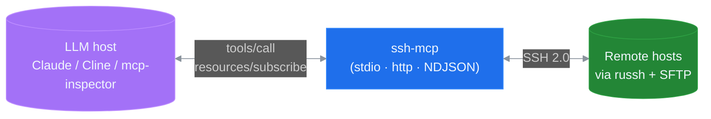
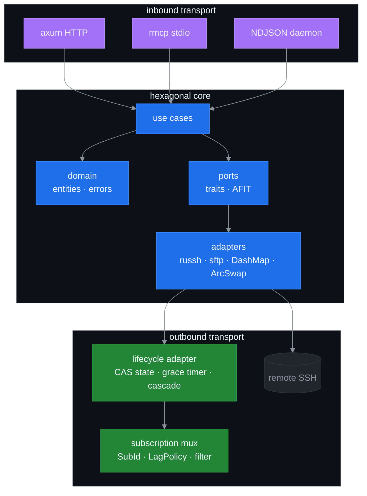

# ssh-mcp

[]()
[](https://www.rust-lang.org/)
[](Cargo.toml)
[]()
[]()

**Subscribe-first SSH server for the Model Context Protocol.** Run remote commands, drive interactive shells, and stream SFTP transfers from any MCP-compatible LLM host with realtime push notifications, lock-free hot path, and resources that clean themselves up when nobody's watching.


```mermaid
%%{init: {'theme':'dark','themeVariables':{'primaryColor':'#1f6feb','primaryTextColor':'#f0f6fc','primaryBorderColor':'#388bfd','lineColor':'#8b949e','mainBkg':'#161b22','clusterBkg':'#0d1117','clusterBorder':'#30363d','titleColor':'#f0f6fc'}}}%%
flowchart LR
    LLM[("LLM host<br/>Claude / Cline / mcp-inspector")]
    SM["ssh-mcp<br/>(stdio · http · NDJSON)"]
    REM[("Remote hosts<br/>via russh + SFTP")]
    LLM <-->|tools/call<br/>resources/subscribe| SM
    SM <-->|SSH 2.0| REM

    classDef host fill:#a371f7,color:#f0f6fc,stroke:#bc8cff
    classDef core fill:#1f6feb,color:#f0f6fc,stroke:#388bfd
    classDef remote fill:#238636,color:#f0f6fc,stroke:#2ea043
    class LLM host
    class SM core
    class REM remote
```

## Why ssh-mcp

- **Push, not poll.** Subscribers get coalesced (50 ms) push notifications the moment SSH bytes arrive. No tight `tool_call` loops burning tokens on empty reads.
- **Self-cleaning resources.** Open a shell with `release_when_no_subs=true` and it disappears when the last subscriber leaves — no zombie sessions waiting on the inactivity TTL.
- **Lock-free hot path.** Every long-running primitive (shell history, command output, transfer progress) is `AtomicU64` / `ArcSwap` / `mpsc` / `Notify`. Zero `Mutex` on the data path. Verified by clippy `await_holding_lock = "deny"` plus 16 loom invariant tests.
- **Three transports, one core.** HTTP (`axum`), stdio (rmcp), and NDJSON daemon (`ssh-mcp-tail`) all share the same hexagonal use cases. Pick the transport your LLM host supports; behaviour is identical.
- **30 MCP tools, 5 resource schemes, 10 ready-made prompts.** Wire-compatible with every v3 / v4 host on the legacy 21 tools, plus 9 v5 tools for sub_id / lag policy / replay / stats.
- **Fits 27B-class LLMs.** `HINT: REQUIRED NEXT STEP:` lines, push-first `NEXT:` ordering, golden-rules root prompt, and a `SUB_LEAK_RISK` watcher that flags lazy callers before they leak.

## Demo

```text
ssh_connect          host=vm.example.com user=root key=~/.ssh/id_rsa agent_id=alice
  -> SESSION_ID=4ac5f7be
ssh_execute          session_id=4ac5f7be command="tail -f /var/log/app.log"
                     release_when_no_subs=true
  -> COMMAND_ID=7cccfb6f  HINT: REQUIRED NEXT STEP: ssh_subscribe ...
ssh_subscribe        uri=command://7cccfb6f/output lifetime=auto-close
                     lag_policy=snapshot
  -> SUB_ID=01928a3f-7f...
# push events arrive here as the remote process emits stdout
ssh_unsubscribe      sub_id=01928a3f-7f...
ssh_disconnect_agent agent_id=alice
```

Same flow as a Unix pipeline (NDJSON daemon mode, ideal for hosts without `resources/subscribe`):

```bash
cat <<'EOF' | ssh-mcp-tail daemon | jq 'select(.ev=="push") | .delta'
{"op":"connect","host":"vm.example.com","user":"root","key":"/root/.ssh/id_rsa"}
{"op":"exec","sid":"<from-ack>","cmd":"tail -f /var/log/app.log"}
{"op":"subscribe","uri":"command://<cid>/output","lifetime":"auto-close"}
EOF
```

## Quickstart

```bash
git clone https://github.com/farchanjo/ssh-mcp.git
cd ssh-mcp
cargo build --release
sudo install -m 0755 target/release/ssh-mcp{,-stdio,-tail} /usr/local/bin/
```

Pick a transport:

| Binary | Use |
|---|---|
| `ssh-mcp-stdio` | Local MCP host (mcp-inspector, IDEs, Cline). Default. |
| `ssh-mcp` | HTTP host (Claude Desktop, browsers). Bind `0.0.0.0:8000`. |
| `ssh-mcp-tail daemon` | Unix pipelines + hosts without `resources/subscribe`. |

Drive it from any MCP-compatible host using the demo flow above. Full command reference: [docs/API.md](docs/API.md). Push-first patterns: [docs/llm-ux/GOLDEN_RULES.md](docs/llm-ux/GOLDEN_RULES.md).

## How it works


```mermaid
%%{init: {'theme':'dark','themeVariables':{'primaryColor':'#1f6feb','primaryTextColor':'#f0f6fc','primaryBorderColor':'#388bfd','lineColor':'#8b949e','mainBkg':'#161b22','clusterBkg':'#0d1117','clusterBorder':'#30363d','titleColor':'#f0f6fc'}}}%%
flowchart TB
    subgraph Inbound["inbound transport"]
        HTTP[axum HTTP]
        STDIO[rmcp stdio]
        TAIL[NDJSON daemon]
    end

    subgraph Core["hexagonal core"]
        UC[use cases]
        DOM[domain<br/>entities · errors]
        PORTS[ports<br/>traits · AFIT]
        ADAP[adapters<br/>russh · sftp · DashMap · ArcSwap]
    end

    subgraph Outbound["outbound transport"]
        SUB[subscription mux<br/>SubId · LagPolicy · filter]
        LIFE[lifecycle adapter<br/>CAS state · grace timer · cascade]
        SSH[(remote SSH)]
    end

    HTTP --> UC
    STDIO --> UC
    TAIL --> UC
    UC --> PORTS
    PORTS --> ADAP
    UC --> DOM
    ADAP --> SSH
    ADAP --> LIFE
    LIFE --> SUB

    classDef inb fill:#a371f7,color:#f0f6fc,stroke:#bc8cff
    classDef core fill:#1f6feb,color:#f0f6fc,stroke:#388bfd
    classDef out fill:#238636,color:#f0f6fc,stroke:#2ea043
    classDef rem fill:#21262d,color:#8b949e,stroke:#30363d
    class HTTP,STDIO,TAIL inb
    class UC,DOM,PORTS,ADAP core
    class SUB,LIFE out
    class SSH rem
```

Three v5 layers stack on the v4.1 hexagonal base:

- **Lifecycle binding** ([ADR 0003](docs/adr/0003-lifecycle-binding.md)) — every long-lived resource (shell, command, transfer, forward) is wrapped in a CAS state machine (`Owned → Observed → Releasing → Closed`) plus a per-session refcount. Last subscriber leaves + `release_when_no_subs=true` arms a grace timer; new subscribe within the window cancels it. Lock-free, loom-verifiable.
- **Channel mux** ([ADR 0004](docs/adr/0004-channel-mux-fairness.md)) — push lanes key on `(SubId, Uri)` (UUIDv7), each owns its own `mpsc::channel`, `LagPolicy` (`BlockSlow` / `DropOldest` / `DropNewest` / `Snapshot` (default)), filter pipeline, replay window, and `SubscriberStats`. A round-robin drainer guarantees a slow subscriber never starves a fast one.
- **Embed transport** ([ADR 0008](docs/adr/0008-ndjson-daemon-protocol.md)) — `ssh-mcp-tail` hosts the rmcp server + an in-process rmcp client across `tokio::io::duplex`. Single binary, no IPC, real push events on the daemon's stdout for hosts that cannot consume MCP subscribe directly.

Full per-module map: [docs/ARCHITECTURE.md](docs/ARCHITECTURE.md).

## Performance

The data path is engineered for sub-millisecond latency between SSH stdout and MCP push delivery on local hosts.

| Scenario | Behaviour |
|---|---|
| Subscribe → first push (warm session) | < 5 ms p50 (50 ms debounce dominates after that) |
| Lane mpsc full → snapshot recovery | O(buf_size); sub-ms with default 1 MB ring |
| Round-robin mux fairness | < 1 % drift between adjacent lanes under burst |
| Lock-free hot path | 0 `Mutex` on shell / command / transfer state |
| Loom invariants | 16 tests across lifecycle, mux, ring buffer, cascade |

Hard numbers from `criterion` benchmarks live under [docs/PERFORMANCE.md](docs/PERFORMANCE.md) (work in progress); the strict baseline is encoded in `clippy.toml` (`cognitive-complexity-threshold = 25`, `too-many-lines-threshold = 30`) plus the `[lints.clippy]` `await_holding_lock` / `mutex_atomic` / `significant_drop_tightening` denials.

## MCP catalogue (compact)

- **30 tools** total — 21 carry-over from v4.7 / v4.8, 9 net-new in v5.0 (`ssh_subscribe` ... `ssh_daemon_stats`). Full schema: [docs/API.md](docs/API.md).
- **5 resource schemes** — `shell://`, `command://`, `transfer://`, `session://`, `forward://`. Cursor + sequence semantics: [docs/RESOURCES.md](docs/RESOURCES.md).
- **10 prompts** — 5 v4 carry-overs + 5 v5 push-first workflows. Catalogue: [docs/llm-ux/PROMPTS_CATALOG.md](docs/llm-ux/PROMPTS_CATALOG.md).
- **38 error codes** in 7 retry categories. Code-by-code handbook: [docs/llm-ux/ERROR_HANDBOOK.md](docs/llm-ux/ERROR_HANDBOOK.md).

## Configuration

Three-tier resolution: **Parameter > Environment Variable > Built-in default**. Full table (33+ vars across lifecycle, mux, lane, daemon, retry, broadcast caps): [docs/CONFIGURATION.md](docs/CONFIGURATION.md).

## Development

```bash
cargo build --release                                # all three binaries
cargo test --lib --quiet                             # ~1378 unit tests
cargo fmt --all -- --check
cargo clippy --release --all-features -- -D warnings # production gate (must exit 0)
```

The clippy gate is **production-only**. Test targets are gated by `cargo test --lib` plus `cargo build --release --all-targets` (the strict `forbid(unwrap_used / expect_used)` baseline is structurally incompatible with the `#[tokio::test]` macro expansion). Details + invariants: [CLAUDE.md](CLAUDE.md), [docs/LOCKS.md](docs/LOCKS.md), [docs/ARCHITECTURE.md](docs/ARCHITECTURE.md).

## Documentation

| Document | Purpose |
|---|---|
| [docs/ARCHITECTURE.md](docs/ARCHITECTURE.md) | Hexagonal layout · v5 layers · per-module map |
| [docs/API.md](docs/API.md) | All 30 MCP tools (inputs · outputs · errors) |
| [docs/RESOURCES.md](docs/RESOURCES.md) | 5 resource schemes · cursor semantics |
| [docs/CONFIGURATION.md](docs/CONFIGURATION.md) | Env-var table · floors · caps |
| [docs/LOCKS.md](docs/LOCKS.md) | Lock-free invariants · clippy enforcement |
| [docs/FLOWS.md](docs/FLOWS.md) | Sequence diagrams (connect / execute / shell / SFTP / subscribe) |
| [docs/INSTRUCTIONS_DAEMON.md](docs/INSTRUCTIONS_DAEMON.md) | `ssh-mcp-tail` NDJSON op + event schema |
| [docs/TROUBLESHOOTING.md](docs/TROUBLESHOOTING.md) | Symptom → cause → cure runbook |
| [docs/MIGRATION_v4_to_v5.md](docs/MIGRATION_v4_to_v5.md) | Host upgrade guide |
| [docs/llm-ux/](docs/llm-ux/) | LLM UX kit — golden rules · prompts · anti-patterns · error handbook |
| [docs/adr/](docs/adr/) | 8 architecture decision records |

## Contributing

Before opening a PR: `cargo fmt --all -- --check` and `cargo clippy --release --all-features -- -D warnings` must both exit 0. Architecture invariants are pinned in [docs/adr/0002-adopt-hexagonal-architecture.md](docs/adr/0002-adopt-hexagonal-architecture.md). Issues: <https://github.com/farchanjo/ssh-mcp/issues>.

## License

MIT — declared via `license = "MIT"` in `Cargo.toml`.

---

### About this fork

This repository is **not** the original [mingyang91/ssh-mcp](https://github.com/mingyang91/ssh-mcp). It started from the same initial concept and was rewritten on `russh` 0.55 + `rmcp` 1.6 with a strict hexagonal layout, lock-free hot path, lifecycle binding, and a third NDJSON daemon binary. v5.0 stays wire-compatible with every v3 / v4 host on the legacy 21-tool catalogue.

### Author and links

- Author: Fabricio Archanjo · <fabricio@archanjo.com>
- Issues: <https://github.com/farchanjo/ssh-mcp/issues>
- Releases: <https://github.com/farchanjo/ssh-mcp/releases>
- SSH library: [russh](https://github.com/warp-tech/russh) · SFTP via [russh-sftp](https://github.com/AspectUnk/russh-sftp)
- MCP framework: [rmcp](https://github.com/modelcontextprotocol/rust-sdk) (official Rust SDK)
- HTTP host: [axum](https://github.com/tokio-rs/axum) + [tower](https://github.com/tower-rs/tower)
- Lock-free primitives: [arc-swap](https://github.com/vorner/arc-swap), [dashmap](https://github.com/xacrimon/dashmap)
