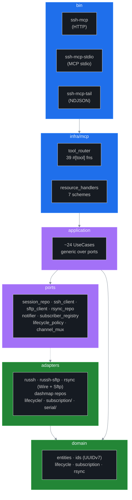

<div align="center">

# ssh-mcp

**Subscribe-first SSH bridge for the Model Context Protocol.**

Drive remote shells, async commands, SFTP transfers, **rsync v31 wire-compat sync**, TCP forwards, and local UART/TTY/COM ports from any MCP-capable LLM host. Bytes stream to the model as they arrive — no polling loops, no empty payloads, no wasted tokens.

[](https://github.com/farchanjo/ssh-mcp/releases/tag/v7.0.0)
[](https://www.rust-lang.org/)
[](Cargo.toml)
[](https://modelcontextprotocol.io/)
[](docs/ARCHITECTURE.md)
[](docs/DEVELOPMENT.md#lock-free-invariants)
[](docs/API.md)
[](docs/RESOURCES.md)
[](docs/adr/)
[]()

</div>

---

## Table of contents

1. [Why ssh-mcp](#why-ssh-mcp)
2. [What's new in v7.0](#whats-new-in-v70)
3. [Quick start](#quick-start)
4. [How push works](#how-push-works)
5. [Architecture](#architecture)
6. [Tool catalogue](#tool-catalogue) — 39 tools, 3 axes
7. [Resource schemes](#resource-schemes) — 7 push streams
8. [How it compares](#how-it-compares)
9. [Performance & guarantees](#performance--guarantees)
10. [Configuration](#configuration)
11. [Release map](#release-map)
12. [Documentation](#documentation)
13. [FAQ](#faq)
14. [Contributing & license](#contributing--license)

---

## Why ssh-mcp

LLM-driven SSH wrappers usually poll. Model loops `get_output()`, server returns empty payloads or duplicate bytes, context fills with noise. 5-minute build burns 30 KB tokens watching nothing.

ssh-mcp inverts that. `sub_open` opens dedicated push lane. New stdout, stderr, transfer progress, port-forward events, session health, serial UART data, **rsync per-file events** — flow as MCP `notifications/resources/updated` the moment bytes arrive. No empty noise.

### Token cost — 5-minute build

| Pattern | Tokens consumed | Round-trips | Notes |
|---|---:|---:|---|
| Poll every 1s with `get_output(wait=true)` | ~45 000 | 300 | Most carry zero new bytes |
| Poll every 5s with `get_output(wait=true)` | ~9 000 | 60 | Misses bursty output |
| **Subscribe + drain (ssh-mcp)** | **~1 500** | **1 setup + N event reads** | Push fires on ~200 ms debounce **or** 64 KiB threshold |

Same throughput. **~30× cheaper.** Model reacts the moment remote process speaks.

### Headline capabilities

| | |
|---|---|
| **39 MCP tools** | `ssh_*` (24) · `sub_*` (9) · `serial_*` (6) |
| **7 push streams** | `shell://` · `command://` · `transfer://` · `session://` · `forward://` · `serial://` · **`rsync://` (v7.0)** |
| **3 transports** | HTTP (axum 0.8) · stdio (rmcp 1.6) · NDJSON daemon (`ssh-mcp-tail`) |
| **2 rsync transports, 1 tool** | `WireRsyncTransport` — canonical port of OpenBSD `openrsync`, byte-identical against `rsync 3.2.7` · `SftpRsyncTransport` — universal SFTP fallback |
| **Per-subscription lanes** | Independent filter, replay buffer, lag policy (`BlockSlow` · `DropOldest` · `DropNewest` · `Snapshot`) per `SubId`. Slow consumer never penalises fast one. |
| **Lock-free hot path** | Zero `Mutex` on shell/command/transfer/rsync state. Enforced by `clippy::mutex_atomic = deny`. |
| **Lifecycle binding + cascade** | CAS state machine (`Owned → Observed → Releasing → Closed`) + refcount cascade. No leaked shells when host crashes. |
| **Strong LLM steering** | `HINT:` lines, `NEXT:` chains, push-first prompts, 46-code error taxonomy with single-sentence cures. Smaller open-source models drive it correctly first try. |

---

## What's new in v7.0

**rsync hybrid transport — `ssh_rsync` / `ssh_rsync_cancel` / `ssh_rsync_stats`** ([ADR 0011](docs/adr/0011-rsync-hybrid-transport.md)).

Two transports live in-process, no remote agent binary:

| Transport | Wire | Probe | Surface |
|---|---|---|---|
| `Wire` | rsync wire protocol v31, port of OpenBSD `openrsync` | requires `rsync ≥ 3.2.0` on remote | full rsync delta-sync (Adler32 + MD4/MD5 block matching, sliding window, sparse holes, attrs `-p -t -o -g -l`, `--delete`, `--partial`) |
| `Sftp` | universal — plain SFTP `readdir/stat/read/write/setstat` | works against any SFTP subsystem | recursive mirror, `--delete`, exclude/include patterns, attribute preservation gated on per-session `SftpFeatures` capability probe |
| `Auto` (default) | probes remote `rsync --version`, picks `Wire` if v31+, `Sftp` otherwise | one-shot probe per session | best of both |

**Push lane:** `sub_open uri=rsync://<RSYNC_ID>/progress` streams per-file events + final `SyncCompleted` aggregate at 200 ms debounce. PREFERRED over polling `ssh_rsync_stats`.

**Verified byte-identical** against `rsync 3.2.7` on a real Linux VM — push and pull, six wire e2e tests in `tests/v7_rsync_wire_e2e_vm.rs` (gated `e2e-vm`).

**v7.0.0-alpha.2 retrenchment** — original plan shipped deployed-agent transport (cross-compiled binary, `include_bytes!`, SFTP-uploaded, sha256-verified). Path retracted. Both transports now in single-package workspace. 4 agent error codes dropped, 1 new code added (`SFTP_FEATURE_MISSING`). `transport` enum: `Auto | Wire | Sftp`.

Slices 11–12 (`-c` checksum delta over wire-format extension, `-H` hardlinks) deferred — surface `SFTP_FEATURE_MISSING` today.

Full migration guide: [docs/MIGRATION.md → v6.1 → v7.0](docs/MIGRATION.md#v61--v70).

---

## Quick start

### 1. Build

```bash
git clone https://github.com/farchanjo/ssh-mcp.git
cd ssh-mcp
cargo build --release
sudo install -m 0755 target/release/ssh-mcp{,-stdio,-tail} /usr/local/bin/
```

Three binaries — pick the transport that matches your host:

| Binary | Transport | Use when |
|---|---|---|
| `ssh-mcp-stdio` | MCP stdio | Local hosts: Claude Desktop, mcp-inspector, IDE plugins, Cline |
| `ssh-mcp` | MCP over HTTP (axum 0.8) | Browser- or service-based hosts |
| `ssh-mcp-tail` | NDJSON over stdin/stdout | Hosts without `resources/subscribe`; Unix pipelines (jq, vector, fluent-bit) |

Skip TCP forwarding via `--no-default-features` (38 tools, smaller binary).

### 2. Wire your MCP host

```json
{
  "mcpServers": {
    "ssh": {
      "type": "stdio",
      "command": "/usr/local/bin/ssh-mcp-stdio"
    }
  }
}
```

Restart host. Model now sees 39 tools + 10 prompts.

### 3. Push-first happy paths

#### A — async command

```text
ssh_connect (agent_id, reuse=Auto)        # one TCP handshake, reuse forever
  └─ ssh_exec  (returns COMMAND_ID)       # async, non-blocking
      └─ sub_open command://<id>/output   # opens push lane
          ←  notifications/resources/updated   # bytes pushed as they arrive
      └─ sub_close                        # cleanup
ssh_disconnect_agent                      # cascade-close everything
```

#### B — recursive sync (v7.0)

```text
ssh_connect
  └─ ssh_rsync transport=Auto src=/local/path dst=/remote/path
      → STARTED + RSYNC_ID + TRANSPORT_PICKED (Wire | Sftp)
      └─ sub_open rsync://<RSYNC_ID>/progress
          ←  per-file events + final SyncCompleted aggregate
      └─ sub_close
```

#### C — interactive shell

```text
ssh_connect
  └─ ssh_shell_open (returns SHELL_ID, INITIAL_BUFFER if prompt within 100 ms)
      └─ sub_open shell://<SHELL_ID>/output
          ←  push deltas
      ssh_shell_write or ssh_shell_press
      └─ sub_close
      └─ ssh_shell_close
```

`ssh_run` exists as **penalised fallback** — pays full SSH handshake every call, tears session down. Default to `ssh_connect` + `ssh_exec`. Two `ssh_run` calls cost as much as one `ssh_connect` + two `ssh_exec` calls.

---

## How push works


```mermaid
%%{init: {'theme':'dark','themeVariables':{'primaryColor':'#1f6feb','primaryTextColor':'#f0f6fc','primaryBorderColor':'#388bfd','lineColor':'#8b949e','background':'#0d1117','mainBkg':'#161b22','clusterBkg':'#161b22','clusterBorder':'#30363d'}}}%%
flowchart LR
    SRC(["Source<br/>remote build · tail -f · rsync · UART"])
    TRANSPORT["Transport<br/>russh 0.55 · russh-sftp 2 · tokio-serial"]
    LIFE["Lifecycle adapter<br/>ArcSwap RingBuffer<br/>AtomicU8 state · refcount"]
    DEB["Debouncer<br/>200 ms coalesce<br/>OR 64 KiB flush"]
    LANE["Per-sub lane<br/>mpsc(1024)<br/>filter · replay · policy"]
    MUX["ChannelMux<br/>AtomicUsize cursor<br/>round-robin"]
    OUT(["LLM host<br/>notifications/resources/updated<br/>or NDJSON line"])

    SRC --> TRANSPORT --> LIFE --> DEB --> LANE --> MUX --> OUT

    classDef rt fill:#1f6feb,color:#f0f6fc,stroke:#388bfd
    classDef mux fill:#a371f7,color:#f0f6fc,stroke:#bc8cff
    classDef host fill:#238636,color:#f0f6fc,stroke:#2ea043
    class TRANSPORT,LIFE,DEB rt
    class LANE,MUX mux
    class OUT host
```

Layer roles, one line each:

1. **Transport** — `russh` parses SSH 2.0 frames over one TCP connection (RFC 4254 multi-channel) for `shell://` · `command://` · `transfer://` · `forward://` · `session://` · `rsync://`; `tokio-serial` reads raw UART for `serial://`.
2. **Lifecycle adapter** — `AtomicU8` state, `AtomicUsize` refcount, `ArcSwap<RingBuffer>` snapshots. CAS state machine, grace timer cancels on re-subscribe.
3. **Debouncer** — coalesces bursts. Flushes whichever fires first: 200 ms window OR 64 KiB byte-threshold (`SSH_NOTIFY_FLUSH_BYTES`). Force-flush every 1 s for liveness.
4. **Per-subscription lane** — own bounded `mpsc::channel(1024)`, own filter regex, own replay buffer, own lag policy. Three subscribers = three independent lanes.
5. **`ChannelMux`** — single `AtomicUsize` cursor walks lanes round-robin. Drift between adjacent lanes < 1% under burst.
6. **Outbound writer** — emits `notifications/resources/updated` (HTTP / stdio) or one NDJSON line per event (`ssh-mcp-tail`).

End-to-end latency: **single-digit milliseconds** on local network. No polling loop anywhere on the path.

---

## Architecture

Hexagonal (Ports & Adapters). Use cases generic over ports — **no `Box<dyn Trait>` on hot paths**. AFIT via `trait-variant` for async ports.


```mermaid
%%{init: {'theme':'dark','themeVariables':{'primaryColor':'#1f6feb','primaryTextColor':'#f0f6fc','primaryBorderColor':'#388bfd','lineColor':'#8b949e','background':'#0d1117','mainBkg':'#161b22','clusterBkg':'#161b22','clusterBorder':'#30363d'}}}%%
flowchart TB
    subgraph BIN["bin"]
        HTTP["ssh-mcp<br/>(HTTP)"]
        STDIO["ssh-mcp-stdio<br/>(MCP stdio)"]
        TAIL["ssh-mcp-tail<br/>(NDJSON)"]
    end
    subgraph INFRA["infra/mcp"]
        TR["tool_router<br/>39 #[tool] fns"]
        RES["resource_handlers<br/>7 schemes"]
    end
    subgraph APP["application"]
        UC["~24 UseCases<br/>generic over ports"]
    end
    subgraph PORTS["ports"]
        P["session_repo · ssh_client · sftp_client · rsync_repo<br/>notifier · subscriber_registry<br/>lifecycle_policy · channel_mux"]
    end
    subgraph ADAPT["adapters"]
        A["russh · russh-sftp · rsync (Wire + Sftp)<br/>dashmap repos<br/>lifecycle/ · subscription/ · serial/"]
    end
    subgraph DOM["domain"]
        D["entities · ids (UUIDv7)<br/>lifecycle · subscription · rsync"]
    end

    BIN --> INFRA --> APP --> PORTS
    PORTS -.-> ADAPT --> DOM
    APP --> DOM

    classDef l fill:#1f6feb,color:#f0f6fc,stroke:#388bfd
    classDef m fill:#a371f7,color:#f0f6fc,stroke:#bc8cff
    classDef g fill:#238636,color:#f0f6fc,stroke:#2ea043
    class BIN,INFRA l
    class APP,PORTS m
    class ADAPT,DOM g
```

| Layer | Where | What |
|---|---|---|
| `bin/` | `src/main.rs`, `src/bin/` | Three thin entry points over `composition::prod` / `embed` |
| `infra/mcp/` | tool_router · resource_handlers · prompts · render · idempotency | Inbound MCP surface (rmcp 1.6) |
| `application/` | `src/application/` | ~24 `*UseCase` types, generic over ports |
| `ports/` | `src/ports/` | Trait skeletons (AFIT) — no implementation |
| `adapters/` | `src/adapters/` | russh · SFTP · rsync (Wire + Sftp) · dashmap repos · lifecycle CAS · channel mux · serial |
| `domain/` | `src/domain/` | Pure entities · UUIDv7 ids · lifecycle / subscription / rsync state |

Full module map and v5/v6/v7 layer deltas: [docs/ARCHITECTURE.md](docs/ARCHITECTURE.md).

---

## Tool catalogue

**39 tools** across 3 semantic axes. Axis split aligns LLM mental model with actual transport.

### `ssh_*` — 24 ops over SSH

| Family | Tools |
|---|---|
| Connection | `ssh_connect` · `ssh_disconnect` · `ssh_disconnect_agent` · `ssh_disconnect_many` · `ssh_sessions` |
| Async commands | `ssh_exec` · `ssh_exec_output` · `ssh_exec_batch` · `ssh_exec_cancel` · `ssh_commands` · `ssh_run` (penalised) |
| Interactive shells | `ssh_shell_open` · `ssh_shell_write` · `ssh_shell_press` · `ssh_shell_read` · `ssh_shell_wait_for` · `ssh_shell_close` |
| SFTP | `ssh_upload` · `ssh_download` · `ssh_transfer_progress` |
| Rsync (v7.0) | `ssh_rsync` · `ssh_rsync_cancel` · `ssh_rsync_stats` |
| TCP forward | `ssh_forward` (feature-gated `port_forward`) |

### `sub_*` — 9 lane management (cross-resource)

`sub_open` · `sub_close` · `sub_pause` · `sub_resume` · `sub_filter` · `sub_replay` · `sub_list` · `sub_stats` · `sub_stats_all`

Verb-uniform — works identically across all 7 schemes (`shell://`, `command://`, `transfer://`, `session://`, `forward://`, `serial://`, `rsync://`).

### `serial_*` — 6 local UART/TTY/COM (no SSH)

`serial_open` · `serial_close` · `serial_write` · `serial_press` · `serial_scan` · `serial_active`

Full `stty` parameter coverage (baud · data · stop · parity · flow · DTR · RTS). Lock-free reader/writer split — `ArcSwap<RingBuffer>` history, bounded `mpsc(64)` writes. Subscribers never contend with OS-level serial reader.

Per-tool inputs/outputs/error codes: [docs/API.md](docs/API.md).

---

## Resource schemes

| Scheme | Source | Cursor | Push trigger | Since |
|---|---|:---:|---|:---:|
| `shell://<id>/output` | PTY stdout/stderr | yes | 200 ms debounce OR 64 KiB | v3 |
| `command://<id>/output` | `ssh_exec` stdout/stderr | yes | 200 ms debounce OR 64 KiB | v3 |
| `transfer://<id>/progress` | SFTP byte counters | no | 200 ms debounce OR per-chunk delta | v3 |
| `session://<id>/health` | SSH transport keepalive | no | health-state change | v4 |
| `forward://<id>/events` | TCP listener accept-loop | yes | per accepted/closed connection | v4 |
| `serial://<id>/output` | OS-level UART read | yes | 200 ms debounce OR 64 KiB | v5.2 |
| `rsync://<id>/progress` | `RsyncSyncUseCase` per-file events | no | 200 ms debounce + final `SyncCompleted` | **v7.0** |

Cursor + sequence semantics + `_meta` envelope: [docs/RESOURCES.md](docs/RESOURCES.md).

---

## How it compares

| | Raw `ssh` shell tool | `paramiko` / `asyncssh` glue | Other MCP SSH wrappers | **ssh-mcp v7.0** |
|---|:---:|:---:|:---:|:---:|
| Push to LLM | no | no (poll) | usually no | **yes (7 schemes)** |
| Self-cleaning lifecycle | no | no | usually no | **yes (cascade refcount)** |
| Per-subscriber backpressure | n/a | n/a | shared broadcast | **independent lanes** |
| Lock-free hot path | n/a | varies | varies | **enforced by clippy** |
| Hosts without subscribe | manual | manual | manual | **NDJSON daemon** |
| Local UART/TTY/COM | no | no | no | **6 native serial tools** |
| Recursive rsync sync | manual `rsync` shell-out | manual | rare | **`ssh_rsync` (Wire + SFTP)** |
| Multi-host, agent-grouped | manual | manual | rare | **`agent_id` + bulk disconnect** |
| TCP port forwarding | no | manual | rare | **production listener** |

---

## Performance & guarantees

Design targets and verified invariants. No public benchmark harness ships in repo; chaos suite (`tests/chaos*.rs`) verifies structural invariants, `tests/lockfree_invariants*.rs` covers concurrency interleavings under loom.

| Scenario | Property | Verified by |
|---|---|---|
| Round-robin mux fairness | No lane starves under uneven load | `tests/chaos.rs::chaos23_*`, loom `loom_mux_round_robin_no_starvation` |
| Lane full + `Snapshot` recovery | Drop backlog, rebuild from per-resource ring; cursor stays monotonic | `tests/chaos.rs::chaos04_*`, loom `slow_subscriber_recovers_after_lag` |
| Session reaper vs active resources | Refcount supersedes inactivity TTL; never reaped while `active_refs > 0` | `tests/chaos.rs::chaos12_*`, loom `loom_phase3_release_when_no_subs_grace` |
| Cascade close on disconnect | `ssh_disconnect_*` force-close every child resource + lane | `tests/chaos.rs::chaos06_*`, `chaos25_*` |
| Rsync wire byte-identical | Push + pull match `rsync 3.2.7` sha256 on real Linux VM | `tests/v7_rsync_wire_e2e_vm.rs` (6 tests, gated `e2e-vm`) |
| Rsync chaos | Cancel mid-flight, partial transfer, capability probe failures | `tests/chaos_rsync.rs` (16) |
| Library tests | ~1.9k+ (`#[test]` + `#[tokio::test]`) | `cargo test --lib` |
| Integration tests | 134 across 9 binaries (v4_smoke 2 · v5_smoke 8 · v5_daemon_smoke 5 · v6_resume_smoke 12 · v7_rsync_smoke 9 · chaos 41 · chaos_rsync 16 · property 32 · property_rsync 9) | `cargo test --tests --features test-fixtures` |
| Loom invariants | 27 across 2 files (`lockfree_invariants` 20 + `lockfree_invariants_rsync` 7) | `RUSTFLAGS="--cfg loom" cargo test --release` |
| Python integration | 21 across `scripts/test_v7_rsync_*.py` (19 passed, 2 xfailed) | `pytest scripts/` |
| ADRs | 11 (rmcp · hexagonal · lifecycle · mux · LLM UX · backpressure · errors · daemon · serial · resume · rsync) | `docs/adr/000{1..9}-*.md`, `0010-*`, `0011-*` |

Latency / throughput numbers operator-measured; reproduce against workload that matches your traffic. Hot path is lock-free — `clippy::mutex_atomic = deny` enforces.

### Strict baseline

- `cargo clippy --release --all-features -- -D warnings` — exit 0 every commit
- `forbid(unwrap_used · expect_used · panic · todo · unimplemented · dbg_macro · exit · mem_forget · infinite_loop · print_stdout · print_stderr)` in production code
- `deny(await_holding_lock · mutex_atomic · mutex_integer · significant_drop_in_scrutinee · significant_drop_tightening)` — lock-free hot path mechanically enforced
- Every `#[allow(...)]` carries `reason = "..."`

Lock-free invariants explained: [docs/DEVELOPMENT.md → Lock-free invariants](docs/DEVELOPMENT.md#lock-free-invariants).

---

## Configuration

Three-tier resolution: **parameter → env var → built-in default.** Defaults preserve v6.0 behaviour. v6.1 + v7.0 layers add no new env vars on the legacy surface. Full table (40+ vars): [docs/CONFIGURATION.md](docs/CONFIGURATION.md).

### High-impact env vars

| Variable | Default | Purpose |
|---|---|---|
| `SSH_NOTIFY_DEBOUNCE_MS` | `200` | Coalesce window per push |
| `SSH_NOTIFY_FLUSH_BYTES` | `65536` | Byte threshold; flush on whichever fires first |
| `SSH_NOTIFY_FORCE_FLUSH_MS` | `1000` | Liveness flush |
| `SSH_LANE_BUFFER` | `1024` | Bounded mpsc capacity per lane |
| `SSH_MUX_BUFFER` | `1024` | `ChannelMux` outbound mpsc capacity |
| `SSH_MCP_PEER_GC_INTERVAL_S` | `30` | Dead-transport scan cadence |
| `SSH_MAX_SUBS_PER_URI` | `16` | Hard cap on lanes per resource |
| `SSH_MAX_SUBS_TOTAL` | `1024` | Hard cap server-wide |
| `SSH_RSYNC_PROBE_TIMEOUT_MS` | `2000` | Max wait for `rsync --version` probe |
| `SSH_RSYNC_FILE_LIST_LIMIT` | `1000000` | Refuse sync above this with `RSYNC_FILE_LIST_TOO_LARGE` |

---

## Release map

| Release | Headline | ADRs |
|---|---|---|
| **v3** | Initial 21-tool catalogue, basic push via broadcast channel | 0001 (rmcp) |
| **v4** | Hexagonal rewrite, lock-free hot path, agent-grouped sessions, TCP port-forward | 0002 (hexagonal) |
| **v5** | Lifecycle binding, channel mux + per-sub lanes, NDJSON daemon, serial transport | 0003 · 0004 · 0005 · 0006 · 0007 · 0008 · 0009 |
| **v6.0** | 3-axis tool catalogue rename (`ssh_*` / `sub_*` / `serial_*`) | wire-additive |
| **v6.1** | SFTP resume + verify (`resume`, `verify`, `RESUMED_FROM`) | 0010 |
| **v7.0** | rsync hybrid transport — Wire (openrsync port) + Sftp fallback | 0011 |

Per-release migration: [docs/MIGRATION.md](docs/MIGRATION.md). v3/v4 hosts work against v7 byte-identical on the legacy 21-tool surface — wire-compat preserved.

---

## Documentation

| Document | Purpose |
|---|---|
| [docs/](docs/README.md) | Index + per-doc decision tree |
| [docs/ARCHITECTURE.md](docs/ARCHITECTURE.md) | Hexagonal layout, v5/v6/v7 layers, sequence diagrams |
| [docs/API.md](docs/API.md) | All 39 tools — inputs, outputs, structured content, errors |
| [docs/RESOURCES.md](docs/RESOURCES.md) | 7 schemes, cursor + sequence semantics, `_meta` |
| [docs/CONFIGURATION.md](docs/CONFIGURATION.md) | Env-var table, floors, caps, tuning profiles |
| [docs/LLM_GUIDE.md](docs/LLM_GUIDE.md) | Golden rules, prompts, anti-patterns, 46-code error handbook |
| [docs/OPERATIONS.md](docs/OPERATIONS.md) | Symptom → cure runbook, recovery flows |
| [docs/DEVELOPMENT.md](docs/DEVELOPMENT.md) | Build/clippy gates, lock-free invariants |
| [docs/DAEMON.md](docs/DAEMON.md) | `ssh-mcp-tail` NDJSON op + event schema |
| [docs/MIGRATION.md](docs/MIGRATION.md) | v2 → v3 → v4 → v5 → v6 → v6.1 → v7.0 |
| [docs/adr/](docs/adr/) | 11 ADRs covering every load-bearing design decision |

---

## FAQ

**Is this wire-compatible with my existing v4/v5 host?**
Yes on the legacy 21-tool catalogue — byte-identical responses, env vars, error codes. v6.0 renames tools (apply `sed` snippet in `docs/MIGRATION.md`). New tools (`sub_*`, `serial_*`, `ssh_rsync*`) are additive.

**My LLM host does not surface push notifications. Can I still benefit?**
Yes. Run `ssh-mcp-tail daemon` as subprocess and read NDJSON push events from its stdout. In-process MCP client + server pair over `tokio::io::duplex`. No IPC. See [docs/DAEMON.md](docs/DAEMON.md).

**How do I avoid leaking shells when host crashes mid-task?**
Pass `release_when_no_subs=true` on `ssh_shell_open` / `ssh_exec` / `ssh_upload` / `ssh_download`. Peer-GC detects dropped transport, lifecycle grace timer fires, resource released automatically.

**Why per-subscription lanes instead of one broadcast channel?**
Broadcast forces one shared lag policy — when one consumer falls behind, everyone falls behind. Per-sub lanes give each consumer independent backpressure, filter regex, replay buffer, and lag policy (`BlockSlow` · `DropOldest` · `DropNewest` · `Snapshot`).

**Is the lock-free claim real?**
Yes. Enforced by `clippy::await_holding_lock` + `clippy::mutex_atomic` + `clippy::significant_drop_tightening` denials. 27 loom invariant tests across `tests/lockfree_invariants*.rs`. Production `-D warnings` exit 0 every commit.

**Does `ssh_rsync` deploy a binary on my remote?**
No. v7.0.0-alpha.2 retracted the agent path. Both transports run in-process — `Wire` speaks rsync v31 to the remote's existing `rsync --server`, `Sftp` uses the SFTP subsystem. Nothing is uploaded or executed on your remote beyond `rsync --server` itself.

**What if my remote has no `rsync` or an old version?**
`transport=Auto` (default) probes and falls back to `Sftp` automatically. `transport=Wire` returns `RSYNC_VERSION_TOO_OLD` if remote rsync is missing or older than 3.2.0. Force `transport=Sftp` to skip the probe.

**Can I run only the legacy 21 tools and skip v5/v6/v7 features?**
Yes. v5/v6/v7 features are entirely opt-in. Skip subscribe + don't pass `release_when_no_subs=true` + don't call `ssh_rsync*` → behaviour byte-identical to v4.

---

## Contributing & license

Before opening PR, verify the four gates:

```bash
cargo build --release
cargo test --lib --quiet
cargo fmt --all -- --check
cargo clippy --release --all-features -- -D warnings
```

All four must exit 0. Hot-path changes touching atomics or `ArcSwap` ship with loom invariant. New env vars need row in [docs/CONFIGURATION.md](docs/CONFIGURATION.md) and floor/cap in `src/adapters/config/internal/mod.rs`.

Architecture invariants: [docs/adr/0002-adopt-hexagonal-architecture.md](docs/adr/0002-adopt-hexagonal-architecture.md). Read once before touching layer boundaries.

**License:** MIT — declared in [`Cargo.toml`](Cargo.toml).

---

### Author

- **Fabricio Archanjo** · <fabricio@archanjo.com>
- Repository: <https://github.com/farchanjo/ssh-mcp> · Issues: <https://github.com/farchanjo/ssh-mcp/issues> · Releases: <https://github.com/farchanjo/ssh-mcp/releases>

### Stack

[russh](https://github.com/warp-tech/russh) 0.55 · [russh-sftp](https://github.com/AspectUnk/russh-sftp) 2 · [rmcp](https://github.com/modelcontextprotocol/rust-sdk) 1.6 · [tokio](https://tokio.rs/) 1.x · [axum](https://github.com/tokio-rs/axum) 0.8 · [arc-swap](https://github.com/vorner/arc-swap) 1.7 · [dashmap](https://github.com/xacrimon/dashmap) 6 · [tokio-serial](https://github.com/berkowski/tokio-serial) 5 · [trait-variant](https://github.com/rust-lang/impl-trait-utils) 0.1

### About this fork

Not the original [mingyang91/ssh-mcp](https://github.com/mingyang91/ssh-mcp). Started from the same concept, rewritten on `russh` 0.55 + `rmcp` 1.6 with a strict hexagonal layout, lock-free hot path, lifecycle binding, channel multiplexing, NDJSON daemon binary, native serial transport, **rsync v31 wire-compat hybrid transport (v7.0)**, and a 3-namespace tool catalogue.
