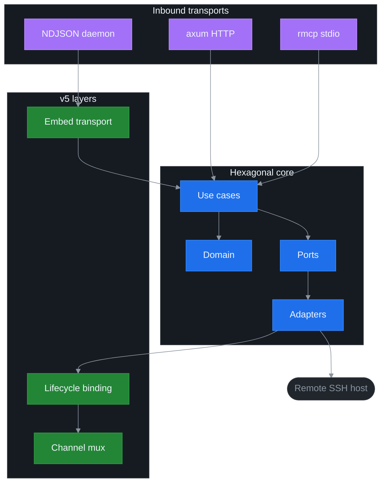

<div align="center">

# ssh-mcp

**Subscribe-first SSH server for the Model Context Protocol.**

Drive remote shells, async commands, and SFTP transfers from any MCP-capable LLM host. Push notifications stream the moment SSH bytes arrive — your model reacts to the world instead of polling it.

[]()
[](https://www.rust-lang.org/)
[](Cargo.toml)
[]()
[]()
[]()
[]()

</div>


```mermaid
%%{init: {'theme':'dark','themeVariables':{'primaryColor':'#1f6feb','primaryTextColor':'#f0f6fc','primaryBorderColor':'#388bfd','lineColor':'#8b949e','secondaryColor':'#161b22','tertiaryColor':'#21262d','background':'#0d1117','mainBkg':'#161b22','secondBkg':'#21262d','tertiaryBkg':'#0d1117','nodeTextColor':'#f0f6fc','edgeLabelBackground':'#21262d','clusterBkg':'#161b22','clusterBorder':'#30363d','titleColor':'#f0f6fc'}}}%%
flowchart LR
    LLM(["LLM host"])
    SM["ssh-mcp"]
    REM(["Remote SSH host"])

    LLM <-->|MCP tools and push streams| SM
    SM <-->|encrypted SSH 2.0 + SFTP| REM

    classDef host fill:#a371f7,color:#f0f6fc,stroke:#bc8cff
    classDef core fill:#1f6feb,color:#f0f6fc,stroke:#388bfd
    classDef remote fill:#21262d,color:#8b949e,stroke:#30363d
    class LLM host
    class SM core
    class REM remote
```

---

## Why ssh-mcp

- **Push, not poll.** Subscribers receive coalesced push events the moment SSH bytes arrive. The model reacts to real output instead of burning tokens on empty reads.
- **Self-cleaning.** Resources opt into `release_when_no_subs`; when the last subscriber leaves, a grace timer arms and the remote process is cancelled and channels closed automatically. No zombie sessions.
- **Lock-free hot path.** Atomics, `ArcSwap`, `mpsc`, and `Notify` carry every long-running primitive. Zero `Mutex` on the data path, enforced by clippy denials and 16 loom invariant tests.
- **Three transports, one core.** HTTP, stdio, and an NDJSON daemon all share the same hexagonal use cases. Pick what your host supports.
- **Designed for 27B-class models.** Required-next-step hints, push-first ordering, ready-made prompts, and golden-rule preludes mean small open-source models drive it correctly first try.
- **Strict by default, tunable when needed.** Production preset out of the box; everything is an env var.
- **Additive across versions.** v3 / v4 hosts on the legacy 21-tool catalogue work unchanged against v5.

See the [LLM UX kit](docs/llm-ux/) for the full design philosophy and [docs/ARCHITECTURE.md](docs/ARCHITECTURE.md) for the layer map.

## Use cases

| Scenario | Why ssh-mcp fits |
|---|---|
| Driving remote builds from an IDE LLM | Streams stdout in real time so the model reacts as logs arrive instead of waiting for the build to finish. |
| Watching long-running services | `tail -f /var/log/app.log` over a subscription survives transient lag without losing the latest tail. |
| Multi-step interactive sessions | Drive `top`, `vim`, `htop`, `psql` with key-by-key precision through PTY-backed shells. |
| Bulk operations across many hosts | `agent_id` groups sessions; one tool call tears them all down atomically. |
| Operations LLM in a Unix pipeline | Pipe NDJSON ops in, NDJSON push events out — perfect for `jq`, `vector`, `fluent-bit`, or a custom audit script. |
| Hosts that lack `resources/subscribe` | The daemon binary exposes push events on its own stdout for any consumer to read. |

## Install

```bash
git clone https://github.com/farchanjo/ssh-mcp.git
cd ssh-mcp
cargo build --release
sudo install -m 0755 target/release/ssh-mcp{,-stdio,-tail} /usr/local/bin/
```

Three binaries land in `/usr/local/bin`. Pick the one your MCP host expects: `ssh-mcp-stdio` for local hosts (mcp-inspector, IDE plugins, Cline) is the recommended default; `ssh-mcp` exposes the same surface over HTTP for browser- or service-based hosts; `ssh-mcp-tail daemon` is the NDJSON pipeline mode for hosts that cannot consume MCP push notifications natively.

If your host needs the smallest possible binary, build with `--no-default-features` to drop the optional `port_forward` feature (29 tools instead of 30). Transport behaviour is identical across all three binaries — they share the same hexagonal core. Operational details and op/event schemas live in [docs/INSTRUCTIONS_DAEMON.md](docs/INSTRUCTIONS_DAEMON.md) and [docs/ARCHITECTURE.md](docs/ARCHITECTURE.md).

## How it works


```mermaid
%%{init: {'theme':'dark','themeVariables':{'primaryColor':'#1f6feb','primaryTextColor':'#f0f6fc','primaryBorderColor':'#388bfd','lineColor':'#8b949e','secondaryColor':'#161b22','tertiaryColor':'#21262d','background':'#0d1117','mainBkg':'#161b22','secondBkg':'#21262d','tertiaryBkg':'#0d1117','nodeTextColor':'#f0f6fc','edgeLabelBackground':'#21262d','clusterBkg':'#161b22','clusterBorder':'#30363d','titleColor':'#f0f6fc'}}}%%
flowchart TB
    subgraph Inbound["Inbound transports"]
        HTTP["axum HTTP"]
        STDIO["rmcp stdio"]
        TAIL["NDJSON daemon"]
    end

    subgraph Core["Hexagonal core"]
        UC["Use cases"]
        DOM["Domain"]
        PORTS["Ports"]
        ADAP["Adapters"]
    end

    subgraph V5["v5 layers"]
        LIFE["Lifecycle binding"]
        SUB["Channel mux"]
        EMBED["Embed transport"]
    end

    SSH(["Remote SSH host"])

    HTTP --> UC
    STDIO --> UC
    TAIL --> EMBED
    EMBED --> UC
    UC --> PORTS
    PORTS --> ADAP
    UC --> DOM
    ADAP --> LIFE
    LIFE --> SUB
    ADAP --> SSH

    classDef inb fill:#a371f7,color:#f0f6fc,stroke:#bc8cff
    classDef core fill:#1f6feb,color:#f0f6fc,stroke:#388bfd
    classDef out fill:#238636,color:#f0f6fc,stroke:#2ea043
    classDef rem fill:#21262d,color:#8b949e,stroke:#30363d
    class HTTP,STDIO,TAIL inb
    class UC,DOM,PORTS,ADAP core
    class LIFE,SUB,EMBED out
    class SSH rem
```

Three v5 layers sit on top of the v4.1 hexagonal base: lifecycle binding ([ADR 0003](docs/adr/0003-lifecycle-binding.md)) wraps every long-lived resource in a CAS state machine and refcount; the channel mux ([ADR 0004](docs/adr/0004-channel-mux-fairness.md)) gives each subscription its own bounded lane and lag policy; the embed transport ([ADR 0008](docs/adr/0008-ndjson-daemon-protocol.md)) hosts an in-process MCP client and server across `tokio::io::duplex` so the daemon binary speaks real push without IPC. Per-module map and sequence diagrams: [docs/ARCHITECTURE.md](docs/ARCHITECTURE.md).

## Performance

The data path is engineered for sub-millisecond latency between SSH stdout and MCP push delivery on local hosts.

| Scenario | Behaviour |
|---|---|
| Subscribe to first push (warm session) | Under 5 ms p50; 50 ms debounce dominates after the first chunk. |
| Lane full and snapshot recovery | Sub-ms with the default 1 MB ring buffer. |
| Round-robin mux fairness | Under 1 % drift between adjacent lanes under burst. |
| Session reaper vs active resources | Refcount supersedes the inactivity TTL — active resources are never reaped. |
| Lock-free hot path | Zero `Mutex` on shell, command, or transfer state — enforced by clippy. |
| Loom invariants | 16 tests across CAS state, mux fairness, ring buffer monotonicity, cascade. |

The strict baseline is encoded in [`clippy.toml`](clippy.toml) and the `[lints.clippy]` block in [`Cargo.toml`](Cargo.toml). Detailed invariants: [docs/LOCKS.md](docs/LOCKS.md).

## How it compares

| Approach | Push to LLM? | Self-cleaning? | Lock-free? | Hosts without subscribe | Operational scope |
|---|:---:|:---:|:---:|:---:|---|
| Raw `ssh` from a shell tool | no | no | n/a | manual | one-off |
| `paramiko` or `asyncssh` glue | no (poll) | no | varies | manual | one host at a time |
| Other MCP SSH wrappers | usually no | usually no | varies | usually no | tool-only |
| **ssh-mcp v5.0** | **yes** | **yes** | **yes** | **NDJSON daemon** | **multi-session, multi-host, agent-grouped** |

## Tool catalogue

v5.0 ships **30 MCP tools** across 5 push-resource schemes and 10 ready-made prompts (29 tools without the `port_forward` feature). Wire-compatible with every v3 / v4 host on the legacy 21-tool catalogue. Per-tool inputs, outputs, structured-content payloads, error codes, and resource semantics: [docs/API.md](docs/API.md) and [docs/RESOURCES.md](docs/RESOURCES.md).

## Configuration

Three-tier resolution: **parameter, then environment variable, then built-in default**. Defaults are tuned for production. The full env-var table (33+ vars across lifecycle, mux, lane, daemon, retry, broadcast caps) lives in [docs/CONFIGURATION.md](docs/CONFIGURATION.md).

## Development

```bash
cargo build --release
cargo test --lib --quiet
cargo fmt --all -- --check
cargo clippy --release --all-features -- -D warnings
```

These four gates must stay green on every commit. The clippy gate is production-only — the strict `forbid(unwrap_used)` policy is structurally incompatible with the `#[tokio::test]` macro expansion, so test targets are gated separately. Rationale and lock-free invariants: [CLAUDE.md](CLAUDE.md), [docs/LOCKS.md](docs/LOCKS.md), [docs/ARCHITECTURE.md](docs/ARCHITECTURE.md).

## Documentation map

| Document | Purpose |
|---|---|
| [docs/ARCHITECTURE.md](docs/ARCHITECTURE.md) | Hexagonal layout, v5 layers, per-module map, sequence diagrams. |
| [docs/API.md](docs/API.md) | All 30 MCP tools — inputs, outputs, structured content, error codes. |
| [docs/RESOURCES.md](docs/RESOURCES.md) | Five resource schemes, cursor and sequence semantics, `_meta` envelope. |
| [docs/CONFIGURATION.md](docs/CONFIGURATION.md) | Full env-var table with floors, caps, and tuning profiles. |
| [docs/ERRORS.md](docs/ERRORS.md) | Wire-format error envelope and code taxonomy. |
| [docs/LOCKS.md](docs/LOCKS.md) | Lock-free invariants per layer with clippy enforcement map. |
| [docs/FLOWS.md](docs/FLOWS.md) | Sequence diagrams for connect, execute, shell, SFTP, subscribe. |
| [docs/INSTRUCTIONS_DAEMON.md](docs/INSTRUCTIONS_DAEMON.md) | NDJSON daemon op and event schema. |
| [docs/TROUBLESHOOTING.md](docs/TROUBLESHOOTING.md) | Symptom, cause, and cure runbook. |
| [docs/MIGRATION_v4_to_v5.md](docs/MIGRATION_v4_to_v5.md) | v4.x to v5.0 host migration guide. |
| [docs/MIGRATION_v3_to_v4.md](docs/MIGRATION_v3_to_v4.md) | Contributor migration guide with v4.1 deep-decouple addendum. |
| [docs/LLM_GUIDE.md](docs/LLM_GUIDE.md) | High-level LLM-driving overview. |
| [docs/llm-ux/](docs/llm-ux/) | LLM UX kit — golden rules, prompts catalogue, anti-patterns, error handbook, 27B / 70B root prompts. |
| [docs/adr/](docs/adr/) | Eight architecture decision records covering rmcp, hexagonal, lifecycle, mux, LLM UX, backpressure, errors, and the daemon protocol. |

## FAQ

**Is this wire-compatible with my existing v4 host?**
Yes. The 21 carry-over tools keep their exact response shape, env vars, and error codes; the 9 new tools are additive. New optional parameters default to v4 behaviour. Details: [docs/MIGRATION_v4_to_v5.md](docs/MIGRATION_v4_to_v5.md).

**My LLM host doesn't surface push notifications. Can I still use the subscribe model?**
Yes. Run the NDJSON daemon as a subprocess and read push events directly from its stdout. See [docs/INSTRUCTIONS_DAEMON.md](docs/INSTRUCTIONS_DAEMON.md).

**Why a separate daemon binary instead of a flag on the stdio binary?**
The daemon hosts an in-process MCP client and server pair with a different runtime shape. Keeping them separate prevents subtle behavioural drift and lets distros ship only the transport they need.

**How do I avoid leaking shells when my host crashes mid-task?**
Pass `release_when_no_subs=true` on shell, command, and transfer tools. The peer GC detects the dropped transport and the lifecycle grace timer cleans up automatically.

**What does "subscribe-first" mean for token cost?**
Polling burns tokens on every call even when there is no new data. Push delivery means the model only spends tokens when there is real output. For long-running commands the saving is order-of-magnitude.

**Is the lock-free claim real?**
Yes — enforced by `clippy::await_holding_lock`, `mutex_atomic`, `significant_drop_tightening`, and `mutex_integer` denials in [`Cargo.toml`](Cargo.toml), plus 16 loom tests. Production builds pass `-D warnings` exit-zero on every commit.

**Can I run only the legacy 21 tools and skip v5 features?**
Yes. v5 features are entirely opt-in. If you never call the subscribe tools and never pass `release_when_no_subs=true`, behaviour is identical to v4.

## Contributing

Contributions are welcome. Before opening a PR, please verify:

- The four development gates (build, lib tests, fmt, clippy) all exit zero.
- New tests ship in the same commit as the feature.
- Hot-path changes touching atomics or `ArcSwap` ship with a loom invariant.
- New env vars get a row in [docs/CONFIGURATION.md](docs/CONFIGURATION.md) and a floor / cap in `src/adapters/config/internal/mod.rs`.

Architecture invariants live in [docs/adr/0002-adopt-hexagonal-architecture.md](docs/adr/0002-adopt-hexagonal-architecture.md). Read it once before touching layer boundaries. Issues: <https://github.com/farchanjo/ssh-mcp/issues>.

## License

MIT. Declared via `license = "MIT"` in [`Cargo.toml`](Cargo.toml).

---

### About this fork

This repository is **not** the original [mingyang91/ssh-mcp](https://github.com/mingyang91/ssh-mcp). It started from the same initial concept and was rewritten on `russh` 0.55 plus `rmcp` 1.6 with a strict hexagonal layout, lock-free hot path, lifecycle binding, channel mux, and a third NDJSON daemon binary. v5.0 stays wire-compatible with every v3 / v4 host on the legacy 21-tool catalogue.

### Author and links

- **Author:** Fabricio Archanjo · <fabricio@archanjo.com>
- **Repository:** <https://github.com/farchanjo/ssh-mcp>
- **Issues:** <https://github.com/farchanjo/ssh-mcp/issues>
- **Releases:** <https://github.com/farchanjo/ssh-mcp/releases>
- **SSH library:** [russh](https://github.com/warp-tech/russh) — SFTP via [russh-sftp](https://github.com/AspectUnk/russh-sftp)
- **MCP framework:** [rmcp](https://github.com/modelcontextprotocol/rust-sdk) (official Rust SDK)
- **HTTP host:** [axum](https://github.com/tokio-rs/axum) plus [tower](https://github.com/tower-rs/tower)
- **Lock-free primitives:** [arc-swap](https://github.com/vorner/arc-swap), [dashmap](https://github.com/xacrimon/dashmap)
- **Original concept:** [mingyang91/ssh-mcp](https://github.com/mingyang91/ssh-mcp)
