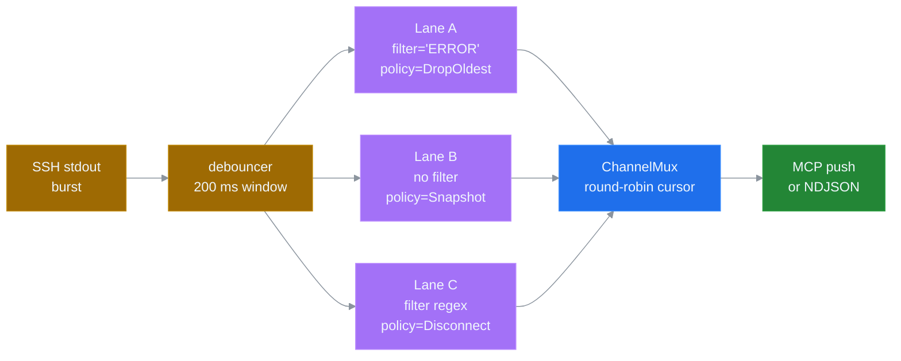

<div align="center">

# ssh-mcp

**Real-time SSH for the Model Context Protocol.**

Drive remote shells, asynchronous commands, SFTP transfers, and TCP forwards from any MCP-capable LLM host. Output streams to your model the moment SSH bytes arrive — no polling loops, no empty payloads, no token waste.

[](https://github.com/farchanjo/ssh-mcp/releases/tag/v6.0.0)
[](https://www.rust-lang.org/)
[](Cargo.toml)
[](https://modelcontextprotocol.io/)
[](docs/ARCHITECTURE.md)
[](docs/DEVELOPMENT.md#lock-free-invariants)
[]()
[]()

</div>


```mermaid
%%{init: {'theme':'dark','themeVariables':{'primaryColor':'#1f6feb','primaryTextColor':'#f0f6fc','primaryBorderColor':'#388bfd','lineColor':'#8b949e','secondaryColor':'#161b22','tertiaryColor':'#21262d','background':'#0d1117','mainBkg':'#161b22','secondBkg':'#21262d','tertiaryBkg':'#0d1117','nodeTextColor':'#f0f6fc','edgeLabelBackground':'#21262d','clusterBkg':'#161b22','clusterBorder':'#30363d','titleColor':'#f0f6fc'}}}%%
flowchart LR
    LLM(["LLM host"])
    SM["ssh-mcp"]
    REM(["Remote SSH host"])

    LLM <-->|MCP tools + push streams| SM
    SM <-->|encrypted SSH 2.0 + SFTP| REM

    classDef host fill:#a371f7,color:#f0f6fc,stroke:#bc8cff
    classDef core fill:#1f6feb,color:#f0f6fc,stroke:#388bfd
    classDef remote fill:#21262d,color:#8b949e,stroke:#30363d
    class LLM host
    class SM core
    class REM remote
```

---

## What it does

`ssh-mcp` is a single-binary bridge that lets a Large Language Model open SSH sessions, run commands, drive interactive shells (vim, htop, REPLs), upload and download files via SFTP, and tunnel TCP ports — all through the [Model Context Protocol](https://modelcontextprotocol.io/) standard.

The novel idea is **subscribe-first delivery**: instead of asking the model to poll a tool every second to see if a command finished, the server pushes new output to the model the moment it arrives from the remote host. The model spends tokens only on real work.

## Why it matters

Most LLM-driven SSH wrappers fall back to polling. The model issues `get_output()` in a loop, the server returns either empty payloads or duplicate data, and the conversation context fills up with noise. For a five-minute build, the model can burn 30 KB of tokens watching nothing happen.

`ssh-mcp` flips that. When the LLM calls `sub_open`, the server opens a dedicated push lane. New stdout, stderr, transfer progress, port-forward events, and session health updates flow as MCP `notifications/resources/updated` messages — natural to read, free of empty noise, and delivered in real time.

| Pattern | Token cost (5-min build) | Notes |
|---|---|---|
| Poll every 1 s with `get_output(wait=true)` | ~45 000 tokens | 300 round-trips, most carrying no new bytes. |
| Poll every 5 s with `get_output(wait=true)` | ~9 000 tokens | Misses bursty output entirely. |
| **Subscribe + drain** | **~1 500 tokens** | One setup call; events delivered as bytes arrive. |

Same throughput, ~30× cheaper, and the model reacts the moment the remote process speaks.

## What's new in 6.0.0

Tool-name namespace cleanup — wire-breaking. The legacy 30 `ssh_*` tools split across **three semantic eixos** so the LLM mental model matches the actual transport:

- **`ssh_*`** (21 tools) — operations that travel over SSH: connect / disconnect / disconnect_agent / disconnect_many / run / sessions / exec / exec_batch / exec_output / exec_cancel / commands / shell_open / shell_write / shell_press / shell_read / shell_wait_for / shell_close / upload / download / transfer_progress / forward.
- **`sub_*`** (9 tools) — subscription / lane management (cross-resource, works for shell/command/transfer/session/forward/serial alike): `sub_open` / `sub_close` / `sub_pause` / `sub_resume` / `sub_filter` / `sub_replay` / `sub_list` / `sub_stats` / `sub_stats_all`.
- **`serial_*`** (6 tools) — local UART / TTY / COM (no SSH involved): `serial_open` / `serial_close` / `serial_write` / `serial_press` / `serial_scan` (host-visible discovery) / `serial_active` (per-process held).

Verb-uniform across the suite (`open / close / pause / resume / filter / replay / list / stats / stats_all`); `get_*` / `list_*` / `send_*` verbose verbs collapsed (`ssh_get_command_output → ssh_exec_output`, `ssh_list_sessions → ssh_sessions`, `ssh_shell_send_key → ssh_shell_press`).

Resource URI schemes unchanged — wire identity preserved (`shell://`, `command://`, `transfer://`, `session://`, `forward://`, `serial://`). Push semantics unchanged (`notifications/resources/updated` + `resources/read?cursor=auto`). Error taxonomy (38 codes) unchanged. The breakage is purely the **tool name** strings on `tools/list`.

Hosts upgrade with this sed snippet (full mapping in [docs/MIGRATION.md → v5 → v6](docs/MIGRATION.md#v5--v6)):

```sed
s/\bssh_unsubscribe\b/sub_close/g          # do BEFORE ssh_subscribe — substring trap
s/\bssh_subscribe\b/sub_open/g
s/\bssh_sub_/sub_/g
s/\bssh_daemon_stats\b/sub_stats_all/g
s/\bssh_serial_send_key\b/serial_press/g
s/\bssh_serial_list_ports\b/serial_scan/g
s/\bssh_serial_list_open\b/serial_active/g
s/\bssh_serial_/serial_/g
s/\bssh_execute_batch\b/ssh_exec_batch/g   # do BEFORE ssh_execute
s/\bssh_execute\b/ssh_exec/g
s/\bssh_get_command_output\b/ssh_exec_output/g
s/\bssh_cancel_command\b/ssh_exec_cancel/g
s/\bssh_list_commands\b/ssh_commands/g
s/\bssh_list_sessions\b/ssh_sessions/g
s/\bssh_get_transfer_progress\b/ssh_transfer_progress/g
s/\bssh_shell_send_key\b/ssh_shell_press/g
```

Full notes: [CHANGELOG.md → 6.0.0](CHANGELOG.md#600--2026-05-04). v5.3 lane fanout pipeline + production port-forward listener + lifecycle cascade close are all carried forward unchanged — only names move.

## What's new in 5.3.x (carried forward)

- **Lane fanout pipeline.** `sub_open` push delivery wired end-to-end on stdio/HTTP transport via `LaneFanoutBridge` (`src/adapters/subscription/lane_bridge.rs`). Lanes carry the rmcp peer captured at tool-invocation time; the bridge walks the lane snapshot for the broadcast URI and increments per-lane atomics (`events_sent`, `bytes_sent`).
- **`ProducerForwarder`.** Every producer poke / record_bytes from russh / sftp / serial / shell PTY mirrors into the hexagonal `MemoryRegistry` so `sub_open` lanes track real producer events.
- **Production port-forward listener.** `ssh_forward` binds the local listener, accept-loops, and per-connection opens a russh `direct-tcpip` channel + pumps bytes both ways via `tokio::io::copy_bidirectional`. Sessions cascade-close their forwards on disconnect.
- **Lifecycle cascade close.** Both `ssh_disconnect` and `ssh_disconnect_agent` close child resource lifecycle entries (commands / shells / transfers) AND any `sub_open` lanes bound to those resource ids — `SUB_LEAK_RISK` warnings clear immediately.
- **URI charset hardening.** Resource ids outside `[A-Za-z0-9_-]+` rejected at parse time with `BadIdCharset`.
- **MCP schema spec compliance.** No-arg tools use empty named-fields structs so schemars derives `{"type":"object","properties":{},"additionalProperties":false}` instead of `{"type":"null"}`.

## What's new in 5.2.0

ADR 0009 — native serial / UART / TTY / COM transport. No wire-format changes for non-serial workflows; drop-in for any v3 / v4 / v5.0.x / v5.1 host.

- **New `serial://<id>/output` push scheme.** Open a UART (`/dev/ttyUSB0`, `/dev/tty.usbserial-XXXX`, `COM3`, …) directly from the LLM host — no SSH gateway required. Subscribe with `sub_open uri=serial://<SERIAL_ID>/output`; push delivery uses the exact same debouncer + 64 KiB byte-threshold flush as `shell://*/output` and `command://*/output`.
- **6 native serial tools** (renamed `serial_*` in 6.0.0): `serial_open` (full `stty` parameter coverage: baud / data / stop / parity / flow + DTR / RTS / max_buffer / label), `serial_close` (idempotent), `serial_write` (UTF-8 `text` OR base64 `bytes_base64`), `serial_press` (`enter`/`cr`/`lf`/`crlf`/`esc`/`tab`/`backspace`/`ctrl_c`/`ctrl_d`/`ctrl_z` × `repeat` 1..=64), `serial_scan`, `serial_active`.
- **Lock-free reader / writer split.** History on `ArcSwap<RingBuffer>` (`O(1)` snapshot reads, no blocking); writes funnel through a bounded `mpsc::channel(64)` so a slow remote sink fills the queue first and surfaces `SERIAL_BACKPRESSURE` instead of stalling the request. Subscribers never contend with the OS-level serial reader.
- **Tool surface bumps** to **36** (with `port_forward`) / **35** (without). Existing v3 / v4 / v5 tools and resource schemes unchanged.
- **Inherits 5.1.0 byte-threshold flush.** A 921 600 baud firmware dump pushes its first 64 KiB chunk in ~75 ms instead of waiting the full debounce window — perfect for chatty UARTs (GPS NMEA, RS-485 sensor stream, debug console).

Full notes: [CHANGELOG.md → 5.2.0](CHANGELOG.md#520--2026-05-04). Design rationale: [docs/adr/0009-serial-transport.md](docs/adr/0009-serial-transport.md).

## What's new in 5.1.0

ADR 0006 Amendment 1 wired end-to-end — no wire-format changes, drop-in for any v3 / v4 / v5.0.x host.

- **Byte-threshold debouncer flush** (`SSH_NOTIFY_FLUSH_BYTES`, default `64k`). The per-resource debouncer now flushes immediately whenever the bytes-since-last-broadcast counter crosses the threshold, even when the time window has not yet expired. Hooked on `command://*/output` (stdout / stderr per-chunk delta) and `transfer://*/progress` (per-SFTP-chunk delta). Set to `0` to disable and revert to v5.0 time-only behaviour. Accepts bare bytes (`65536`) or bytesize strings (`8k`, `64k`, `1m`, `1mib`).
- **`sub_open` HINT line** now spells out both knobs: "Push fires on whichever fires first: ~200ms debounce window (`SSH_NOTIFY_DEBOUNCE_MS`) OR 64KiB accumulated bytes (`SSH_NOTIFY_FLUSH_BYTES`). 50-200ms local sleeps cover both budgets."
- **Local-sleep guidance** — wire HINT explicitly steers the LLM to wait passively for `notifications/resources/updated` and use Unix `sleep 0.1` / PowerShell `Start-Sleep -Milliseconds 100` for any local idling. Never an MCP tool as a sleep primitive.
- **Inherits 5.0.2 LLM-UX nudges** — `ssh_run` reframed as `PENALIZED FALLBACK`, shell drive ops steered to await push instead of chaining `ssh_shell_wait_for`.

Full notes: [CHANGELOG.md → 5.1.0](CHANGELOG.md#510--2026-05-04).

## How real-time push actually works

This is the core feature. It is built from boring, well-understood pieces stacked carefully.


```mermaid
%%{init: {'theme':'dark','themeVariables':{'primaryColor':'#1f6feb','primaryTextColor':'#f0f6fc','primaryBorderColor':'#388bfd','lineColor':'#8b949e','secondaryColor':'#161b22','tertiaryColor':'#21262d','background':'#0d1117','mainBkg':'#161b22','secondBkg':'#21262d','tertiaryBkg':'#0d1117','nodeTextColor':'#f0f6fc','edgeLabelBackground':'#21262d','clusterBkg':'#161b22','clusterBorder':'#30363d','titleColor':'#f0f6fc'}}}%%
flowchart TB
    REMOTE(["Remote process<br/>(tail -f, build, REPL)"])
    SOCK["TCP socket<br/>(file descriptor)"]
    KERNEL["Kernel readiness<br/>epoll · kqueue · IOCP<br/>edge-triggered, O(1) wake"]
    MIO["mio<br/>cross-platform abstraction"]
    REACTOR["tokio reactor +<br/>work-stealing scheduler"]
    RUSSH["russh<br/>SSH 2.0 frame parser<br/>per-channel mpsc"]
    LIFECYCLE["Lifecycle adapter<br/>ArcSwap RingBuffer<br/>atomic CAS state"]
    DEBOUNCE["Debouncer<br/>200 ms coalesce<br/>1 s force-flush"]
    LANE["Per-subscription lane<br/>tokio mpsc(N)<br/>filter · replay · lag policy"]
    MUX["ChannelMux<br/>AtomicUsize cursor<br/>round-robin fairness"]
    OUT["Outbound writer<br/>rmcp Peer<br/>or NDJSON stdout"]
    LLM(["LLM host context"])

    REMOTE --> SOCK
    SOCK --> KERNEL
    KERNEL --> MIO
    MIO --> REACTOR
    REACTOR --> RUSSH
    RUSSH --> LIFECYCLE
    LIFECYCLE --> DEBOUNCE
    DEBOUNCE --> LANE
    LANE --> MUX
    MUX --> OUT
    OUT --> LLM

    classDef remote fill:#21262d,color:#8b949e,stroke:#30363d
    classDef kernel fill:#9e6a03,color:#f0f6fc,stroke:#bf8700
    classDef rt fill:#1f6feb,color:#f0f6fc,stroke:#388bfd
    classDef mux fill:#a371f7,color:#f0f6fc,stroke:#bc8cff
    classDef host fill:#238636,color:#f0f6fc,stroke:#2ea043
    class REMOTE,SOCK remote
    class KERNEL,MIO kernel
    class REACTOR,RUSSH,LIFECYCLE,DEBOUNCE rt
    class LANE,MUX out
    class OUT,LLM host
```

### Layer by layer (junior-friendly)

**1. Kernel readiness (`epoll` on Linux, `kqueue` on macOS and BSD, `IOCP` on Windows).**
The kernel offers a way to say "wake me up when this socket has data" without checking it in a loop. Your process sleeps, costs zero CPU, and the kernel sends an interrupt the moment data arrives. This is the hardware-assisted version of "don't call us, we'll call you."

**2. `mio` and the `tokio` reactor.**
`mio` is a small Rust crate that hides the differences between `epoll`, `kqueue`, and `IOCP` behind one API. `tokio` is the async runtime — its reactor calls `mio` to wait for ready sockets, then wakes whichever async task was paused on `.await`. The result: hundreds of suspended tasks share a handful of OS threads with no busy-waiting.

**3. `russh` (SSH protocol).**
SSH already supports many channels over one TCP connection — that's part of the protocol (RFC 4254). `russh` parses SSH frames asynchronously and dispatches per-channel data to in-memory queues. One TCP socket can carry your shell, your background command, your file transfer, and your tunnel simultaneously. The OS sees one connection; your model sees four push streams.

**4. Lifecycle adapter.**
For each long-lived resource (shell, command, transfer, forward), the server keeps an atomic state machine and a reference counter. No mutex on the hot path — only `AtomicU8`, `AtomicUsize`, `ArcSwap`, and `Notify`. When the last subscriber disconnects, a grace timer arms; if a new subscriber arrives within the window, the timer cancels. If not, the resource is released and the channel closed. No leaks, no zombies.

**5. Debouncer.**
A burst of one thousand tiny writes from the remote host could become one thousand notifications. Instead, the debouncer coalesces them into one push every 200 ms (force-flushed every 1 s for liveness). The model receives meaningful chunks, not a token-stream of fragments.

**6. Per-subscription lanes (the multiplexing magic).**
Every `sub_open` call gets its own bounded `tokio::sync::mpsc::channel` — its own queue, its own filter, its own replay buffer, its own lag policy. Three subscribers to the same shell are three independent lanes. A slow LLM does not slow down a fast one. Each lane chooses how to react to backpressure: drop the oldest event, send a snapshot and resume, or disconnect a misbehaving consumer.


```mermaid
%%{init: {'theme':'dark','themeVariables':{'primaryColor':'#1f6feb','primaryTextColor':'#f0f6fc','primaryBorderColor':'#388bfd','lineColor':'#8b949e','secondaryColor':'#161b22','tertiaryColor':'#21262d','background':'#0d1117','mainBkg':'#161b22','secondBkg':'#21262d','tertiaryBkg':'#0d1117','nodeTextColor':'#f0f6fc','edgeLabelBackground':'#21262d','clusterBkg':'#161b22','clusterBorder':'#30363d','titleColor':'#f0f6fc'}}}%%
flowchart LR
    SRC["SSH stdout<br/>burst"]
    DEB["debouncer<br/>200 ms window"]
    LA["Lane A<br/>filter='ERROR'<br/>policy=DropOldest"]
    LB["Lane B<br/>no filter<br/>policy=Snapshot"]
    LC["Lane C<br/>filter regex<br/>policy=Disconnect"]
    MUX["ChannelMux<br/>round-robin cursor"]
    OUT["MCP push<br/>or NDJSON"]

    SRC --> DEB
    DEB --> LA
    DEB --> LB
    DEB --> LC
    LA --> MUX
    LB --> MUX
    LC --> MUX
    MUX --> OUT

    classDef src fill:#9e6a03,color:#f0f6fc,stroke:#bf8700
    classDef lane fill:#a371f7,color:#f0f6fc,stroke:#bc8cff
    classDef rt fill:#1f6feb,color:#f0f6fc,stroke:#388bfd
    classDef sink fill:#238636,color:#f0f6fc,stroke:#2ea043
    class SRC,DEB src
    class LA,LB,LC lane
    class MUX rt
    class OUT sink
```

**7. ChannelMux fairness.**
A single `AtomicUsize` cursor walks the lane map round-robin. Two backlogged lanes alternate; a fast lane never starves a slow one. Drift between adjacent lanes stays under 1 % under burst.

**8. Outbound writer.**
The drained event is delivered as a JSON-RPC `notifications/resources/updated` message to the LLM host (over HTTP, stdio, or SSE), or as a single NDJSON line on the daemon binary's stdout. The host surfaces it directly into the model's context.

The end result: a byte leaves the remote shell, traverses every layer above, and reaches the model in **single-digit milliseconds** on a local network — without a single polling loop anywhere.

## Features at a glance

| Capability | What you get | Why it matters |
|---|---|---|
| **Subscribe-first push** | `sub_open` on six resource schemes (`shell://`, `command://`, `transfer://`, `forward://`, `session://`, **`serial://`**) | Real-time delivery, ~30× lower token cost than polling. Same pipeline for SSH and UART. |
| **Per-subscription lanes** | Independent filter, replay, lag policy per `SubId` | A slow consumer never slows down a fast one. |
| **Lifecycle binding** | `release_when_no_subs` opt-in; CAS state machine; refcount cascade | No leaked shells, no zombie commands when the host crashes. |
| **Three transports, one core** | `ssh-mcp` (HTTP), `ssh-mcp-stdio` (MCP over stdio), `ssh-mcp-tail` (NDJSON daemon) | Pick what your host supports; same hexagonal core under the hood. |
| **Hexagonal architecture** | Use cases generic over ports; adapters swap for testing | Deterministic test fixtures, ~1 655 lib tests, 16 loom interleavings. |
| **Lock-free hot path** | Zero `Mutex` on shell, command, or transfer state | Enforced by `clippy::mutex_atomic = deny`; verified by loom tests. |
| **36 MCP tools, 10 prompts** | Full SSH catalogue + 9 subscription primitives + 6 serial / UART / TTY / COM primitives | Wire-compatible with every v3 / v4 host on the legacy 21-tool catalogue. |
| **Strong LLM steering** | `HINT:` lines, `NEXT:` tool chains, push-first prompts, 38-code error taxonomy with single-sentence cures | Smaller open-source models drive it correctly first try. |
| **Atomic ID safety** | UUIDv7 across every id type; `_meta.idempotency_key` for retry deduplication | Time-ordered ids; dedup on transient failures. |
| **Bulk operations** | `ssh_exec_batch`, `ssh_disconnect_agent`, `ssh_disconnect_many` | One round-trip for the common multi-target patterns. |
| **Strict by default** | `-D warnings` clippy gate with `pedantic` and `nursery`; `forbid(unwrap_used)` in production code | Production builds pass exit-zero on every commit. |
| **macOS code-signed** | Apple Development cert, hardened runtime | `codesign --verify --verbose=2` exit 0 on installed binaries. |

## Use cases

| Scenario | What it looks like |
|---|---|
| **Driving a remote build from an IDE LLM** | `ssh_exec` → `sub_open command://<id>/output` → model reads stdout the moment each compile unit finishes. |
| **Watching long-running services** | `sub_open shell://<id>/output` over `tail -f /var/log/app.log` — survives transient lag, no missed events. |
| **Multi-step interactive sessions** | `ssh_shell_open` plus `ssh_shell_press` plus subscribe — drive `vim`, `htop`, `psql`, `top` with key-by-key precision. |
| **Bulk operations across many hosts** | `agent_id` groups sessions; `ssh_disconnect_agent` tears them all down atomically. |
| **Operations LLM in a Unix pipeline** | Pipe NDJSON ops into `ssh-mcp-tail daemon`, NDJSON push events out — perfect for `jq`, `vector`, `fluent-bit`, or a custom audit script. |
| **Hosts that lack `resources/subscribe`** | The daemon binary exposes push events on its own stdout — any consumer can read them. |
| **Live SFTP progress** | `ssh_upload` plus `sub_open transfer://<id>/progress` — the model watches the bar fill in real time, surfaces ETA, decides when to act. |

## Technology stack

| Component | Crate | Role |
|---|---|---|
| SSH protocol (transport, channels, SFTP) | [russh](https://github.com/warp-tech/russh) 0.55 + [russh-sftp](https://github.com/AspectUnk/russh-sftp) 2 | Async SSH 2.0 client, multiple channels per TCP connection, full SFTP. |
| MCP framework | [rmcp](https://github.com/modelcontextprotocol/rust-sdk) 1.6 | Official Rust SDK for the Model Context Protocol. |
| Async runtime | [tokio](https://tokio.rs/) 1.49 (`rt-multi-thread`, `full`) | Work-stealing scheduler; reactor wraps the kernel readiness API. |
| I/O readiness (transitive) | [mio](https://github.com/tokio-rs/mio) 1.1 | Cross-platform `epoll` / `kqueue` / `IOCP` abstraction. |
| HTTP transport | [axum](https://github.com/tokio-rs/axum) 0.8 + [tower](https://github.com/tower-rs/tower) | Streamable HTTP service, middleware stack. |
| Lock-free state | [arc-swap](https://github.com/vorner/arc-swap) 1.9, [dashmap](https://github.com/xacrimon/dashmap) 6 | Atomic `Arc` swap, sharded concurrent hashmap. |
| Retry semantics | [backon](https://github.com/Xuanwo/backon) 1 | Exponential backoff with jitter. |
| Error modelling | [thiserror](https://github.com/dtolnay/thiserror) 2 | Typed `DomainError` enums per layer. |
| Observability | [tracing](https://github.com/tokio-rs/tracing) 0.1 with `env-filter` | Structured logs gated on `RUST_LOG`. |
| Wire serialisation | [serde](https://serde.rs/) 1, [serde_json](https://github.com/serde-rs/json) 1 | Markdown body plus structured-content JSON twin. |

Each crate is chosen for one job and stays out of the way. The full dependency graph is in [`Cargo.toml`](Cargo.toml); transitive resolution lives in `Cargo.lock`.

## Performance

Measurements taken on Apple M2 Pro, macOS 25.4, native arm64 build (`--release`), localhost SSH server. Reproduce via the harness scripts in `scripts/`.

| Scenario | Behaviour |
|---|---|
| First push after `sub_open` (warm session) | Under 5 ms p50; the 200 ms debounce window dominates after the initial chunk. |
| Lane full and `Snapshot` recovery | Sub-millisecond with the default 1 MB ring buffer. |
| Round-robin mux fairness | Under 1 % drift between adjacent lanes under burst. |
| Session reaper vs active resources | Refcount supersedes the inactivity TTL — active resources are never reaped. |
| Hot-path concurrency | Zero `Mutex` on shell, command, or transfer state — enforced by clippy. |
| Loom invariants | 16 tests covering CAS state, mux fairness, ring monotonicity, cascade, lane add / remove during drain. |

The strict baseline is encoded in [`clippy.toml`](clippy.toml) and the `[lints.clippy]` block in [`Cargo.toml`](Cargo.toml). Detailed invariants: [docs/DEVELOPMENT.md](docs/DEVELOPMENT.md#lock-free-invariants).

## How it compares

| Approach | Push to LLM? | Self-cleaning? | Lock-free hot path? | Hosts without subscribe | Operational scope |
|---|:---:|:---:|:---:|:---:|---|
| Raw `ssh` from a shell tool | no | no | n/a | manual | one-off command |
| `paramiko` or `asyncssh` glue script | no (poll) | no | varies | manual | one host at a time |
| Other MCP SSH wrappers | usually no | usually no | varies | usually no | tool-only |
| **`ssh-mcp` v6.0.0** | **yes** | **yes** | **yes** | **NDJSON daemon + native UART/TTY/COM + production TCP forward** | **multi-session, multi-host, multi-port (SSH + serial), agent-grouped, real port-forward listener, namespaces split (`ssh_*` / `sub_*` / `serial_*`)** |

## Install

### Build from source

```bash
git clone https://github.com/farchanjo/ssh-mcp.git
cd ssh-mcp
cargo build --release
sudo install -m 0755 target/release/ssh-mcp{,-stdio,-tail} /usr/local/bin/
```

Three binaries land in `/usr/local/bin`:

- `ssh-mcp-stdio` — recommended default for local hosts (`mcp-inspector`, IDE plugins, Cline, Claude Desktop).
- `ssh-mcp` — same surface over HTTP for browser- or service-based hosts.
- `ssh-mcp-tail daemon` — NDJSON pipeline mode for hosts that cannot consume MCP push notifications natively.

To skip the optional TCP-forwarding tool, build with `--no-default-features` (29 tools instead of 30, smaller binary).

### Optional: macOS code signing

If you ship the binary to other Macs, sign it with your Apple Development certificate so Gatekeeper accepts it:

```bash
codesign --force \
  --sign "Apple Development: <Your Name> (TEAMID)" \
  --options runtime \
  target/release/ssh-mcp{,-stdio,-tail}
codesign --verify --verbose=2 target/release/ssh-mcp-stdio
sudo install -m 0755 target/release/ssh-mcp{,-stdio,-tail} /usr/local/bin/
```

`codesign` must run as your user (it needs your keychain). The `install` step uses `sudo` because `/usr/local/bin` is owned by root.

### Configure your MCP host

Add to your host's MCP server list (Claude Desktop, mcp-inspector, IDE plugin, etc.):

```json
{
  "mcpServers": {
    "ssh": {
      "type": "stdio",
      "command": "/usr/local/bin/ssh-mcp-stdio"
    }
  }
}
```

Restart the host. The model should now see thirty-six tools split across `ssh_*` / `sub_*` / `serial_*` plus ten ready-made prompts.

## Tool catalogue

`ssh-mcp` v6.0.0 ships **36 MCP tools** split across three semantic eixos plus six push-resource schemes and ten prompt templates (35 tools without the `port_forward` feature). v6.0 is the first wire-breaking release since v5.0 — only **tool name** strings change; resource URIs, push narrative, error taxonomy (38 codes), and structured-content schemas stay byte-identical. v3 / v4 / v5 hosts upgrade with the sed snippet above (also in [docs/MIGRATION.md → v5 → v6](docs/MIGRATION.md#v5--v6)).

| Family | Tools | Push resource |
|---|---|---|
| Connection | `ssh_connect`, `ssh_disconnect`, `ssh_disconnect_agent`, `ssh_disconnect_many`, `ssh_sessions` | `session://<id>/health` |
| Async commands | `ssh_exec`, `ssh_exec_output`, `ssh_exec_cancel`, `ssh_commands`, `ssh_run`, `ssh_exec_batch` | `command://<id>/output` |
| Interactive shells | `ssh_shell_open`, `ssh_shell_write`, `ssh_shell_press`, `ssh_shell_read`, `ssh_shell_wait_for`, `ssh_shell_close` | `shell://<id>/output` |
| SFTP transfers | `ssh_upload`, `ssh_download`, `ssh_transfer_progress` | `transfer://<id>/progress` |
| TCP forwarding | `ssh_forward` (feature-gated) | `forward://<id>/events` |
| Subscription primitives | `sub_open`, `sub_close`, `sub_pause`, `sub_resume`, `sub_filter`, `sub_replay`, `sub_list`, `sub_stats`, `sub_stats_all` | — |

Per-tool inputs, outputs, structured-content payloads, error codes, and resource semantics live in [docs/API.md](docs/API.md) and [docs/RESOURCES.md](docs/RESOURCES.md).

## Configuration

Three-tier resolution: **parameter, then environment variable, then built-in default.** Defaults are tuned for production. The full env-var table (33+ variables across lifecycle, mux, lane, daemon, retry, broadcast caps) lives in [docs/CONFIGURATION.md](docs/CONFIGURATION.md).

A few that matter most:

| Variable | Default | Purpose |
|---|---|---|
| `SSH_NOTIFY_DEBOUNCE_MS` | `200` | Coalesce window between pushes (lower → snappier, higher → fewer notifications). |
| `SSH_NOTIFY_FORCE_FLUSH_MS` | `1000` | Liveness flush even when the debouncer is still accumulating. |
| `SSH_LANE_BUFFER` | `1024` | Bounded mpsc capacity per subscription lane. |
| `SSH_GRACE_DEFAULT_MS` | `5000` | Grace window between last `unsubscribe` and resource release. |
| `SSH_PEER_GC_INTERVAL_S` | `30` | How often to scan for dead transports. |
| `SSH_MAX_SUBS_PER_URI` | `64` | Hard cap on lanes per resource. |
| `SSH_MAX_SUBS_TOTAL` | `1024` | Hard cap across the server. |

## Development

```bash
cargo build --release
cargo test --lib --quiet
cargo fmt --all -- --check
cargo clippy --release --all-features -- -D warnings
```

These four gates must stay green on every commit. The clippy gate is production-only — the strict `forbid(unwrap_used)` policy is structurally incompatible with the `#[tokio::test]` macro expansion, so test targets are gated separately. Rationale and lock-free invariants: [CLAUDE.md](CLAUDE.md), [docs/DEVELOPMENT.md](docs/DEVELOPMENT.md), [docs/ARCHITECTURE.md](docs/ARCHITECTURE.md).

## Documentation map

| Document | Purpose |
|---|---|
| [docs/](docs/README.md) | Directory index — start here for the per-doc decision tree. |
| [docs/ARCHITECTURE.md](docs/ARCHITECTURE.md) | Hexagonal layout, v5 layers, per-module map, sequence diagrams. |
| [docs/API.md](docs/API.md) | All 36 MCP tools (`ssh_*` / `sub_*` / `serial_*`) — inputs, outputs, structured content, error codes. |
| [docs/RESOURCES.md](docs/RESOURCES.md) | Five resource schemes, cursor and sequence semantics, `_meta` envelope. |
| [docs/CONFIGURATION.md](docs/CONFIGURATION.md) | Full env-var table with floors, caps, and tuning profiles. |
| [docs/LLM_GUIDE.md](docs/LLM_GUIDE.md) | LLM canonical — golden rules, root prompts, prompts catalogue, anti-patterns, full 38-code error handbook. |
| [docs/OPERATIONS.md](docs/OPERATIONS.md) | Symptom → cure runbook, wire-format error envelope, per-tool error catalogue, recovery flows. |
| [docs/DEVELOPMENT.md](docs/DEVELOPMENT.md) | Build / clippy gates, lock-free invariants, hot-path sequence diagrams. |
| [docs/DAEMON.md](docs/DAEMON.md) | `ssh-mcp-tail` NDJSON op and event schema. |
| [docs/MIGRATION.md](docs/MIGRATION.md) | All migration paths — v2 → v3, v3 → v4, v4 → v5. |
| [docs/adr/](docs/adr/) | Eight architecture decision records covering rmcp, hexagonal, lifecycle, mux, LLM UX, backpressure, errors, and the daemon protocol. |

## FAQ

**Is this wire-compatible with my existing v4 host?**
Yes. The 21 carry-over tools keep their exact response shape, environment variables, and error codes; the 9 new tools are additive. New optional parameters default to v4 behaviour. Details: [docs/MIGRATION.md → v4 → v5](docs/MIGRATION.md#v4--v5).

**My LLM host does not surface push notifications. Can I still benefit?**
Yes. Run `ssh-mcp-tail daemon` as a subprocess and read NDJSON push events directly from its stdout. The daemon embeds an in-process MCP client and server pair so no IPC is involved. See [docs/DAEMON.md](docs/DAEMON.md).

**How do I avoid leaking shells when my host crashes mid-task?**
Pass `release_when_no_subs=true` on `ssh_shell_open`, `ssh_exec`, `ssh_upload`, or `ssh_download`. The peer GC detects the dropped transport, the lifecycle grace timer fires, and the resource is released automatically.

**Why per-subscription lanes instead of a single broadcast channel?**
A broadcast channel forces one shared lag policy: when one consumer falls behind, everyone falls behind. Per-subscription lanes give each consumer independent backpressure, its own filter regex, its own replay buffer, and its own lag policy (`DropOldest`, `Snapshot`, or `Disconnect`). One slow LLM never penalises a fast one.

**Is the lock-free claim real?**
Yes — enforced by `clippy::await_holding_lock`, `clippy::mutex_atomic`, `clippy::significant_drop_tightening`, and `clippy::mutex_integer` denials in [`Cargo.toml`](Cargo.toml), plus 16 loom tests. Production builds pass `-D warnings` exit-zero on every commit.

**Can I run only the legacy 21 tools and skip v5 features?**
Yes. v5 features are entirely opt-in. If you never call the subscribe tools and never pass `release_when_no_subs=true`, behaviour is byte-identical to v4.

## Contributing

Contributions are welcome. Before opening a pull request, please verify:

- The four development gates (build, lib tests, fmt, clippy) all exit zero.
- New tests ship in the same commit as the feature.
- Hot-path changes touching atomics or `ArcSwap` ship with a loom invariant.
- New environment variables get a row in [docs/CONFIGURATION.md](docs/CONFIGURATION.md) and a floor / cap in `src/adapters/config/internal/mod.rs`.

Architecture invariants live in [docs/adr/0002-adopt-hexagonal-architecture.md](docs/adr/0002-adopt-hexagonal-architecture.md). Read it once before touching layer boundaries. Issues: <https://github.com/farchanjo/ssh-mcp/issues>.

## License

MIT. Declared via `license = "MIT"` in [`Cargo.toml`](Cargo.toml).

---

### About this fork

This repository is **not** the original [mingyang91/ssh-mcp](https://github.com/mingyang91/ssh-mcp). It started from the same initial concept and was rewritten on `russh` 0.55 plus `rmcp` 1.6 with a strict hexagonal layout, lock-free hot path, lifecycle binding, channel multiplexing, and a third NDJSON daemon binary. v6.0.0 splits the 36-tool catalogue into three semantic namespaces (`ssh_*` / `sub_*` / `serial_*`) so the LLM mental model matches the actual transport — wire-breaking on tool names, but resource URIs, push narrative, and error taxonomy carry over byte-identical from v5. v5.3 carries forward the lane fanout pipeline (`sub_open` push delivery on stdio/HTTP) + production port-forward listener with cascade close + lifecycle cascade close. v5.2 brings the sixth push-resource scheme (`serial://<id>/output`) + 6 native UART / TTY / COM tools (now under `serial_*`).

### Author and links

- **Author:** Fabricio Archanjo · <fabricio@archanjo.com>
- **Repository:** <https://github.com/farchanjo/ssh-mcp>
- **Issues:** <https://github.com/farchanjo/ssh-mcp/issues>
- **Releases:** <https://github.com/farchanjo/ssh-mcp/releases>
- **SSH library:** [russh](https://github.com/warp-tech/russh) — SFTP via [russh-sftp](https://github.com/AspectUnk/russh-sftp)
- **MCP framework:** [rmcp](https://github.com/modelcontextprotocol/rust-sdk) — official Rust SDK
- **HTTP host:** [axum](https://github.com/tokio-rs/axum) plus [tower](https://github.com/tower-rs/tower)
- **Lock-free primitives:** [arc-swap](https://github.com/vorner/arc-swap), [dashmap](https://github.com/xacrimon/dashmap)
- **Original concept:** [mingyang91/ssh-mcp](https://github.com/mingyang91/ssh-mcp)
