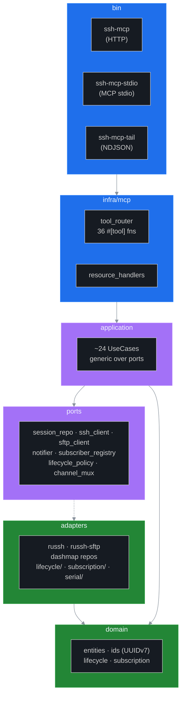

<div align="center">

# ssh-mcp

**Subscribe-first SSH bridge for the Model Context Protocol.**

Drive remote shells, async commands, SFTP transfers, recursive rsync (wire-compat or SFTP fallback), TCP forwards, and local UART/TTY/COM ports from any MCP-capable LLM host. Output streams to the model the moment bytes arrive — no polling, no empty payloads, no token waste.

[](https://github.com/farchanjo/ssh-mcp/releases/tag/v7.0.0)
[](https://www.rust-lang.org/)
[](Cargo.toml)
[](https://modelcontextprotocol.io/)
[](docs/ARCHITECTURE.md)
[](docs/DEVELOPMENT.md#lock-free-invariants)
[](docs/API.md)
[]()

</div>

---

## Table of contents

1. [Why ssh-mcp](#why-ssh-mcp)
2. [Quick start](#quick-start)
3. [How real-time push works](#how-real-time-push-works)
4. [Architecture](#architecture)
5. [Tool catalogue](#tool-catalogue)
6. [Resource schemes](#resource-schemes)
7. [How it compares](#how-it-compares)
8. [Performance & guarantees](#performance--guarantees)
9. [Configuration](#configuration)
10. [v6.0 migration](#v60-migration)
11. [Documentation map](#documentation-map)
12. [FAQ](#faq)
13. [Contributing & License](#contributing--license)

---

## Why ssh-mcp

Most LLM-driven SSH wrappers poll. The model calls `get_output()` in a loop, the server returns either empty payloads or duplicate bytes, and the conversation context fills with noise. A 5-minute build can burn 30 KB of tokens watching nothing happen.

ssh-mcp inverts that. `sub_open` opens a dedicated push lane. New stdout, stderr, transfer progress, port-forward events, session health, and serial UART data flow as MCP `notifications/resources/updated` messages — delivered as bytes arrive, no empty noise.

### Token cost — 5-minute build

| Pattern | Tokens consumed | Round-trips | Notes |
|---|---:|---:|---|
| Poll every 1s with `get_output(wait=true)` | ~45 000 | 300 | Most carry zero new bytes |
| Poll every 5s with `get_output(wait=true)` | ~9 000 | 60 | Misses bursty output |
| **Subscribe + drain (ssh-mcp)** | **~1 500** | **1 setup + N event reads** | Push fires on ~200 ms debounce **or** 64 KiB threshold |

Same throughput. **~30× cheaper.** Model reacts the moment the remote process speaks.

### Headline capabilities

- **7 push-resource schemes** — `shell://` · `command://` · `transfer://` · `session://` · `forward://` · `serial://` (local UART/TTY/COM, no SSH) · `rsync://` (per-file + aggregate sync progress, v7.0)
- **39 MCP tools across 4 namespaces** — `ssh_*` (24, includes `ssh_rsync` / `ssh_rsync_cancel` / `ssh_rsync_stats`) · `sub_*` (9) · `serial_*` (6)
- **Per-subscription lanes** — independent filter, replay buffer, lag policy (`BlockSlow` / `DropOldest` / `DropNewest` / `Snapshot`) per `SubId`. One slow consumer never penalizes a fast one.
- **Lock-free hot path** — zero `Mutex` on shell/command/transfer/rsync state. Enforced by `clippy::mutex_atomic = deny`.
- **Lifecycle binding with cascade** — CAS state machine (`Owned → Observed → Releasing → Closed`) + refcount cascade. No leaked shells when the host crashes.
- **Three transports, one core** — HTTP (axum), stdio (rmcp), NDJSON daemon (Unix-pipeline composable).
- **Two rsync transports, one tool** — `WireRsyncTransport` (canonical port of OpenBSD `openrsync`, v31 wire-compat against `rsync --server`) and `SftpRsyncTransport` (universal SFTP fallback). Push and pull both byte-identical against `rsync 3.2.7` on a real Linux VM.
- **Strong LLM steering** — `HINT:` lines, `NEXT:` chains, push-first prompts, 46-code error taxonomy with single-sentence cures. Smaller open-source models drive it correctly first try.

---

## Quick start

### 1. Build

```bash
git clone https://github.com/farchanjo/ssh-mcp.git
cd ssh-mcp
cargo build --release
sudo install -m 0755 target/release/ssh-mcp{,-stdio,-tail} /usr/local/bin/
```

Three binaries:

| Binary | Transport | Use when |
|---|---|---|
| `ssh-mcp-stdio` | MCP stdio | Local hosts: Claude Desktop, mcp-inspector, IDE plugins, Cline |
| `ssh-mcp` | MCP over HTTP (axum 0.8) | Browser- or service-based hosts |
| `ssh-mcp-tail` | NDJSON over stdin/stdout | Hosts without `resources/subscribe`; Unix pipelines (jq, vector, fluent-bit) |

Skip TCP forwarding via `--no-default-features` (35 tools, smaller binary).

### 2. Wire your MCP host

```json
{
  "mcpServers": {
    "ssh": {
      "type": "stdio",
      "command": "/usr/local/bin/ssh-mcp-stdio"
    }
  }
}
```

Restart host. Model now sees 36 tools + 10 prompts.

### 3. The push-first happy path

```text
ssh_connect (agent_id, reuse=Auto)        # one TCP handshake, reuse forever
  └─ ssh_exec  (returns COMMAND_ID)       # async, non-blocking
      └─ sub_open command://<id>/output   # opens push lane
          ←  notifications/resources/updated   # bytes pushed as they arrive
      └─ sub_close                        # cleanup
ssh_disconnect_agent                      # cascade-close everything
```

`ssh_run` exists as a **penalized fallback** — it pays a full SSH handshake every call. Default to `ssh_connect` + `ssh_exec`.

---

## How real-time push works


```mermaid
%%{init: {'theme':'dark','themeVariables':{'primaryColor':'#1f6feb','primaryTextColor':'#f0f6fc','primaryBorderColor':'#388bfd','lineColor':'#8b949e','background':'#0d1117','mainBkg':'#161b22','clusterBkg':'#161b22','clusterBorder':'#30363d'}}}%%
flowchart LR
    REM(["Source<br/>(remote build · tail -f · REPL · local UART)"])
    KER["Kernel readiness<br/>epoll · kqueue · IOCP"]
    MIO["mio + tokio reactor<br/>work-stealing scheduler"]
    SRC["Transport<br/>russh 0.55 (SSH) ·<br/>tokio-serial (UART)"]
    LIFE["Lifecycle adapter<br/>ArcSwap RingBuffer<br/>AtomicU8 state · refcount"]
    DEB["Debouncer<br/>200 ms coalesce<br/>OR 64 KiB flush"]
    LANE["Per-sub lane<br/>mpsc(1024)<br/>filter · replay · policy"]
    MUX["ChannelMux<br/>AtomicUsize cursor<br/>round-robin"]
    OUT(["LLM host<br/>notifications/resources/updated<br/>or NDJSON line"])

    REM --> KER --> MIO --> SRC --> LIFE --> DEB --> LANE --> MUX --> OUT

    classDef rt fill:#1f6feb,color:#f0f6fc,stroke:#388bfd
    classDef mux fill:#a371f7,color:#f0f6fc,stroke:#bc8cff
    classDef host fill:#238636,color:#f0f6fc,stroke:#2ea043
    class KER,MIO,SRC,LIFE,DEB rt
    class LANE,MUX mux
    class OUT host
```

**Layer roles in one line each:**

1. **Kernel readiness** — `epoll` / `kqueue` / `IOCP` wakes the process when the socket / TTY has data. Zero CPU while idle.
2. **`mio` + `tokio` reactor** — cross-platform abstraction; work-stealing scheduler resumes the awaiting task.
3. **Transport layer** — `russh` parses SSH 2.0 frames over one TCP connection (RFC 4254 multi-channel) for `shell://` / `command://` / `transfer://` / `forward://` / `session://`; `tokio-serial` reads raw UART bytes for `serial://` (ADR 0009).
4. **Lifecycle adapter** — `AtomicU8` state, `AtomicUsize` refcount, `ArcSwap<RingBuffer>` snapshots. CAS state machine, grace timer cancels on re-subscribe.
5. **Debouncer** — coalesces bursts. Flushes on whichever fires first: 200 ms window OR 64 KiB byte-threshold (`SSH_NOTIFY_FLUSH_BYTES`). Force-flush every 1 s for liveness.
6. **Per-subscription lane** — own bounded `mpsc::channel(1024)`, own filter regex, own replay buffer, own lag policy. Three subscribers = three independent lanes.
7. **`ChannelMux`** — single `AtomicUsize` cursor walks lanes round-robin. Drift between adjacent lanes < 1% under burst.
8. **Outbound writer** — emits `notifications/resources/updated` (HTTP / stdio) or one NDJSON line per event (`ssh-mcp-tail` daemon).

End-to-end latency: **single-digit milliseconds** on a local network. No polling loop anywhere on the path.

---

## Architecture

Hexagonal (Ports & Adapters). Use cases generic over ports — **no `Box<dyn Trait>` on hot paths**. AFIT via `trait-variant` for async ports.


```mermaid
%%{init: {'theme':'dark','themeVariables':{'primaryColor':'#1f6feb','primaryTextColor':'#f0f6fc','primaryBorderColor':'#388bfd','lineColor':'#8b949e','background':'#0d1117','mainBkg':'#161b22','clusterBkg':'#161b22','clusterBorder':'#30363d'}}}%%
flowchart TB
    subgraph BIN["bin"]
        HTTP["ssh-mcp<br/>(HTTP)"]
        STDIO["ssh-mcp-stdio<br/>(MCP stdio)"]
        TAIL["ssh-mcp-tail<br/>(NDJSON)"]
    end
    subgraph INFRA["infra/mcp"]
        TR["tool_router<br/>36 #[tool] fns"]
        RES["resource_handlers"]
    end
    subgraph APP["application"]
        UC["~24 UseCases<br/>generic over ports"]
    end
    subgraph PORTS["ports"]
        P["session_repo · ssh_client · sftp_client<br/>notifier · subscriber_registry<br/>lifecycle_policy · channel_mux"]
    end
    subgraph ADAPT["adapters"]
        A["russh · russh-sftp<br/>dashmap repos<br/>lifecycle/ · subscription/ · serial/"]
    end
    subgraph DOM["domain"]
        D["entities · ids (UUIDv7)<br/>lifecycle · subscription"]
    end

    BIN --> INFRA --> APP --> PORTS
    PORTS -.-> ADAPT --> DOM
    APP --> DOM

    classDef l fill:#1f6feb,color:#f0f6fc,stroke:#388bfd
    classDef m fill:#a371f7,color:#f0f6fc,stroke:#bc8cff
    classDef g fill:#238636,color:#f0f6fc,stroke:#2ea043
    class BIN,INFRA l
    class APP,PORTS m
    class ADAPT,DOM g
```

| Layer | Where | What |
|---|---|---|
| `bin/` | `src/main.rs`, `src/bin/` | Three thin entry points over `composition::prod` / `embed` |
| `infra/mcp/` | tool_router · resource_handlers · prompts · render · idempotency | Inbound MCP surface (rmcp 1.6) |
| `application/` | `src/application/` | ~24 `*UseCase` types, generic over ports |
| `ports/` | `src/ports/` | Trait skeletons (AFIT) — no implementation |
| `adapters/` | `src/adapters/` | russh, SFTP, dashmap repos, lifecycle CAS machine, channel mux, serial |
| `domain/` | `src/domain/` | Pure entities, UUIDv7 ids, lifecycle + subscription state |

Full module map: [docs/ARCHITECTURE.md](docs/ARCHITECTURE.md).

---

## Tool catalogue

**36 tools** across three semantic axes. v6.0 split aligns the LLM mental model with the actual transport.

### `ssh_*` — 21 ops over SSH

| Family | Tools |
|---|---|
| Connection | `ssh_connect` · `ssh_disconnect` · `ssh_disconnect_agent` · `ssh_disconnect_many` · `ssh_sessions` |
| Async commands | `ssh_exec` · `ssh_exec_output` · `ssh_exec_batch` · `ssh_exec_cancel` · `ssh_commands` · `ssh_run` (penalized) |
| Interactive shells | `ssh_shell_open` · `ssh_shell_write` · `ssh_shell_press` · `ssh_shell_read` · `ssh_shell_wait_for` · `ssh_shell_close` |
| SFTP | `ssh_upload` · `ssh_download` · `ssh_transfer_progress` |
| TCP forward | `ssh_forward` (feature-gated `port_forward`) |

### `sub_*` — 9 lane management (cross-resource)

`sub_open` · `sub_close` · `sub_pause` · `sub_resume` · `sub_filter` · `sub_replay` · `sub_list` · `sub_stats` · `sub_stats_all`

Verb-uniform — works identically for `shell://`, `command://`, `transfer://`, `session://`, `forward://`, `serial://`.

### `serial_*` — 6 local UART/TTY/COM (no SSH)

`serial_open` · `serial_close` · `serial_write` · `serial_press` · `serial_scan` · `serial_active`

Full `stty` parameter coverage (baud · data · stop · parity · flow · DTR · RTS). Lock-free reader/writer split — `ArcSwap<RingBuffer>` history, bounded `mpsc(64)` writes. Subscribers never contend with the OS-level serial reader.

Per-tool inputs/outputs/error codes: [docs/API.md](docs/API.md).

---

## Resource schemes

| Scheme | Source | Cursor | Push trigger |
|---|---|:---:|---|
| `shell://<id>/output` | PTY stdout/stderr | yes | 200 ms debounce OR 64 KiB |
| `command://<id>/output` | `ssh_exec` stdout/stderr | yes | 200 ms debounce OR 64 KiB |
| `transfer://<id>/progress` | SFTP byte counters | no | 200 ms debounce OR per-chunk delta |
| `session://<id>/health` | SSH transport keepalive | no | health-state change |
| `forward://<id>/events` | TCP listener accept-loop | yes | per accepted/closed connection |
| `serial://<id>/output` | OS-level UART read | yes | 200 ms debounce OR 64 KiB |

Cursor + sequence semantics + `_meta` envelope: [docs/RESOURCES.md](docs/RESOURCES.md).

---

## How it compares

| | Raw `ssh` shell tool | `paramiko` / `asyncssh` glue | Other MCP SSH wrappers | **ssh-mcp v6.0** |
|---|:---:|:---:|:---:|:---:|
| Push to LLM | no | no (poll) | usually no | **yes** |
| Self-cleaning lifecycle | no | no | usually no | **yes (cascade refcount)** |
| Per-subscriber backpressure | n/a | n/a | shared broadcast | **independent lanes** |
| Lock-free hot path | n/a | varies | varies | **enforced by clippy** |
| Hosts without subscribe | manual | manual | manual | **NDJSON daemon** |
| Local UART/TTY/COM | no | no | no | **6 native serial tools** |
| Multi-host, agent-grouped | manual | manual | rare | **`agent_id` + bulk disconnect** |
| TCP port forwarding | no | manual | rare | **production listener** |

---

## Performance & guarantees

Design targets and verified invariants. No public benchmark harness ships in the repo today; the chaos suite (`tests/chaos/*.rs`) verifies the structural invariants, and `tests/lockfree_invariants.rs` covers the concurrency interleavings under loom.

| Scenario | Property | Verified by |
|---|---|---|
| Round-robin mux fairness | No lane starves under uneven load (heaviest lane does not block all others) | `tests/chaos/chaos23_channel_mux_fairness_n_lanes.rs`, loom `loom_mux_round_robin_no_starvation` |
| Lane full + `Snapshot` recovery | Drop backlog, rebuild from per-resource ring buffer; cursor stays monotonic | `tests/chaos/chaos04_slow_consumer_overflow.rs`, loom `slow_subscriber_recovers_after_lag` |
| Session reaper vs active resources | Refcount supersedes inactivity TTL; session never reaped while `active_refs > 0` | `tests/chaos/chaos12_session_inactivity_during_active_sub.rs`, loom `loom_phase3_release_when_no_subs_grace` |
| Cascade close on disconnect | `ssh_disconnect` / `ssh_disconnect_agent` force-close every child resource lifecycle entry + lane | `tests/chaos/chaos06_concurrent_disconnect_subscribe.rs`, `tests/chaos/chaos25_cascade_refcount_many_simultaneous_close.rs` |
| Library tests | ~1657 (`#[test]` + `#[tokio::test]`) | `cargo test --lib` |
| Integration tests | 88 across 5 binaries (`v4_smoke` 2, `v5_smoke` 8, `v5_daemon_smoke` 5, `chaos` 41, `property` 32) | `cargo test --tests --features test-fixtures` |
| Loom invariants | 20 interleavings in `tests/lockfree_invariants.rs` (gated `#[cfg(loom)]`) | `RUSTFLAGS="--cfg loom" cargo test --test lockfree_invariants --release` |
| ADRs | 9 (rmcp · hexagonal · lifecycle · mux · LLM UX · backpressure · errors · daemon · serial) | `docs/adr/000{1..9}-*.md` |

Latency / throughput numbers are operator-measured; reproduce against a workload that matches your traffic. The hot path is lock-free (no `Mutex` on `Running*` state — `clippy::mutex_atomic = deny` enforces) and debouncer / lane / mux drains run on the work-stealing tokio scheduler.

### Strict baseline

- `cargo clippy --release --all-features -- -D warnings` — exit 0 every commit
- `forbid(unwrap_used · expect_used · panic · todo · unimplemented · dbg_macro · exit · mem_forget · infinite_loop · print_stdout · print_stderr)` in production code
- `deny(await_holding_lock · mutex_atomic · mutex_integer · significant_drop_in_scrutinee · significant_drop_tightening)` — lock-free hot path mechanically enforced
- Every `#[allow(...)]` carries `reason = "..."`

Lock-free invariants explained: [docs/DEVELOPMENT.md → Lock-free invariants](docs/DEVELOPMENT.md#lock-free-invariants).

---

## Configuration

Three-tier resolution: **parameter → env var → built-in default.** Defaults preserve v4 behaviour. Full table (40 vars): [docs/CONFIGURATION.md](docs/CONFIGURATION.md).

### High-impact env vars

| Variable | Default | Purpose |
|---|---|---|
| `SSH_NOTIFY_DEBOUNCE_MS` | `200` | Coalesce window per push |
| `SSH_NOTIFY_FLUSH_BYTES` | `65536` | Byte threshold; flush on whichever fires first |
| `SSH_NOTIFY_FORCE_FLUSH_MS` | `1000` | Liveness flush |
| `SSH_LANE_BUFFER` | `1024` | Bounded mpsc capacity per lane |
| `SSH_MUX_BUFFER` | `1024` | `ChannelMux` outbound mpsc capacity |
| `SSH_MCP_PEER_GC_INTERVAL_S` | `30` | Dead-transport scan cadence |
| `SSH_MAX_SUBS_PER_URI` | `16` | Hard cap on lanes per resource |
| `SSH_MAX_SUBS_TOTAL` | `1024` | Hard cap server-wide |

---

## v6.0 migration

Wire-breaking on **tool name strings only**. Resource URIs, push narrative, error taxonomy (38 codes), and structured-content schemas are byte-identical to v5.x.

```sed
s/\bssh_unsubscribe\b/sub_close/g          # do BEFORE ssh_subscribe — substring trap
s/\bssh_subscribe\b/sub_open/g
s/\bssh_sub_/sub_/g
s/\bssh_daemon_stats\b/sub_stats_all/g
s/\bssh_serial_send_key\b/serial_press/g
s/\bssh_serial_list_ports\b/serial_scan/g
s/\bssh_serial_list_open\b/serial_active/g
s/\bssh_serial_/serial_/g
s/\bssh_execute_batch\b/ssh_exec_batch/g   # do BEFORE ssh_execute
s/\bssh_execute\b/ssh_exec/g
s/\bssh_get_command_output\b/ssh_exec_output/g
s/\bssh_cancel_command\b/ssh_exec_cancel/g
s/\bssh_list_commands\b/ssh_commands/g
s/\bssh_list_sessions\b/ssh_sessions/g
s/\bssh_get_transfer_progress\b/ssh_transfer_progress/g
s/\bssh_shell_send_key\b/ssh_shell_press/g
```

Full mapping: [docs/MIGRATION.md → v5 → v6](docs/MIGRATION.md#v5--v6). v3/v4 paths preserved unchanged.

---

## Documentation map

| Document | Purpose |
|---|---|
| [docs/](docs/README.md) | Index + per-doc decision tree |
| [docs/ARCHITECTURE.md](docs/ARCHITECTURE.md) | Hexagonal layout, v5 layers, sequence diagrams |
| [docs/API.md](docs/API.md) | All 36 tools — inputs, outputs, structured content, errors |
| [docs/RESOURCES.md](docs/RESOURCES.md) | 6 schemes, cursor + sequence semantics, `_meta` |
| [docs/CONFIGURATION.md](docs/CONFIGURATION.md) | Env-var table, floors, caps, tuning profiles |
| [docs/LLM_GUIDE.md](docs/LLM_GUIDE.md) | Golden rules, prompts, anti-patterns, 38-code error handbook |
| [docs/OPERATIONS.md](docs/OPERATIONS.md) | Symptom → cure runbook, recovery flows |
| [docs/DEVELOPMENT.md](docs/DEVELOPMENT.md) | Build/clippy gates, lock-free invariants |
| [docs/DAEMON.md](docs/DAEMON.md) | `ssh-mcp-tail` NDJSON op + event schema |
| [docs/MIGRATION.md](docs/MIGRATION.md) | v2 → v3, v3 → v4, v4 → v5, v5 → v6 |
| [docs/adr/](docs/adr/) | 9 ADRs covering every design decision |

---

## FAQ

**Is this wire-compatible with my existing v4 host?**
On the legacy 21-tool catalogue, byte-identical responses, env vars, error codes. v6.0 only renames tools — apply the sed snippet above. New tools (`sub_*`, `serial_*`) are additive.

**My LLM host does not surface push notifications. Can I still benefit?**
Yes. Run `ssh-mcp-tail daemon` as a subprocess and read NDJSON push events from its stdout. In-process MCP client + server pair over `tokio::io::duplex`. No IPC. See [docs/DAEMON.md](docs/DAEMON.md).

**How do I avoid leaking shells when my host crashes mid-task?**
Pass `release_when_no_subs=true` on `ssh_shell_open` / `ssh_exec` / `ssh_upload` / `ssh_download`. Peer-GC detects dropped transport, lifecycle grace timer fires, resource released automatically.

**Why per-subscription lanes instead of one broadcast channel?**
Broadcast forces one shared lag policy — when one consumer falls behind, everyone falls behind. Per-sub lanes give each consumer independent backpressure, filter regex, replay buffer, and lag policy (`BlockSlow` · `DropOldest` · `DropNewest` · `Snapshot`).

**Is the lock-free claim real?**
Yes. Enforced by `clippy::await_holding_lock` + `clippy::mutex_atomic` + `clippy::significant_drop_tightening` denials. 20 loom invariant tests in `tests/lockfree_invariants.rs`. Production `-D warnings` exit 0 every commit.

**Can I run only the legacy 21 tools and skip v5/v6 features?**
Yes. v5/v6 features are entirely opt-in. Skip subscribe + don't pass `release_when_no_subs=true` → behaviour byte-identical to v4.

---

## Contributing & License

Before opening a PR, verify the four gates:

```bash
cargo build --release
cargo test --lib --quiet
cargo fmt --all -- --check
cargo clippy --release --all-features -- -D warnings
```

All four must exit 0. Hot-path changes touching atomics or `ArcSwap` ship with a loom invariant. New env vars need a row in [docs/CONFIGURATION.md](docs/CONFIGURATION.md) and a floor/cap in `src/adapters/config/internal/mod.rs`.

Architecture invariants: [docs/adr/0002-adopt-hexagonal-architecture.md](docs/adr/0002-adopt-hexagonal-architecture.md). Read once before touching layer boundaries.

**License:** MIT. Declared in [`Cargo.toml`](Cargo.toml).

---

### Author

- **Fabricio Archanjo** · <fabricio@archanjo.com>
- Repository: <https://github.com/farchanjo/ssh-mcp> · Issues: <https://github.com/farchanjo/ssh-mcp/issues> · Releases: <https://github.com/farchanjo/ssh-mcp/releases>

### Stack

[russh](https://github.com/warp-tech/russh) 0.55 + [russh-sftp](https://github.com/AspectUnk/russh-sftp) 2 · [rmcp](https://github.com/modelcontextprotocol/rust-sdk) 1.6 · [tokio](https://tokio.rs/) 1.x · [axum](https://github.com/tokio-rs/axum) 0.8 · [arc-swap](https://github.com/vorner/arc-swap) 1.7 · [dashmap](https://github.com/xacrimon/dashmap) 6 · [tokio-serial](https://github.com/berkowski/tokio-serial) 5 · [trait-variant](https://github.com/rust-lang/impl-trait-utils) 0.1

### About this fork

Not the original [mingyang91/ssh-mcp](https://github.com/mingyang91/ssh-mcp). Started from the same concept, rewritten on `russh` 0.55 + `rmcp` 1.6 with a strict hexagonal layout, lock-free hot path, lifecycle binding, channel multiplexing, NDJSON daemon binary, native serial transport, and a 3-namespace tool catalogue.
