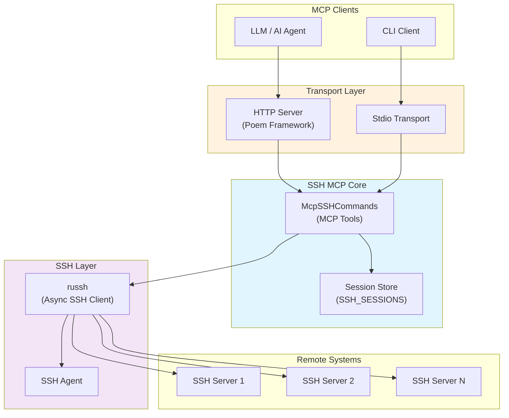
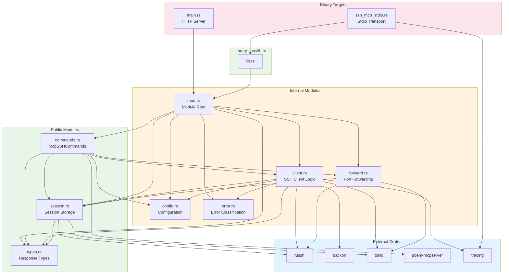
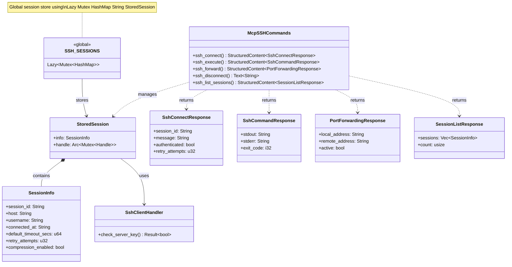
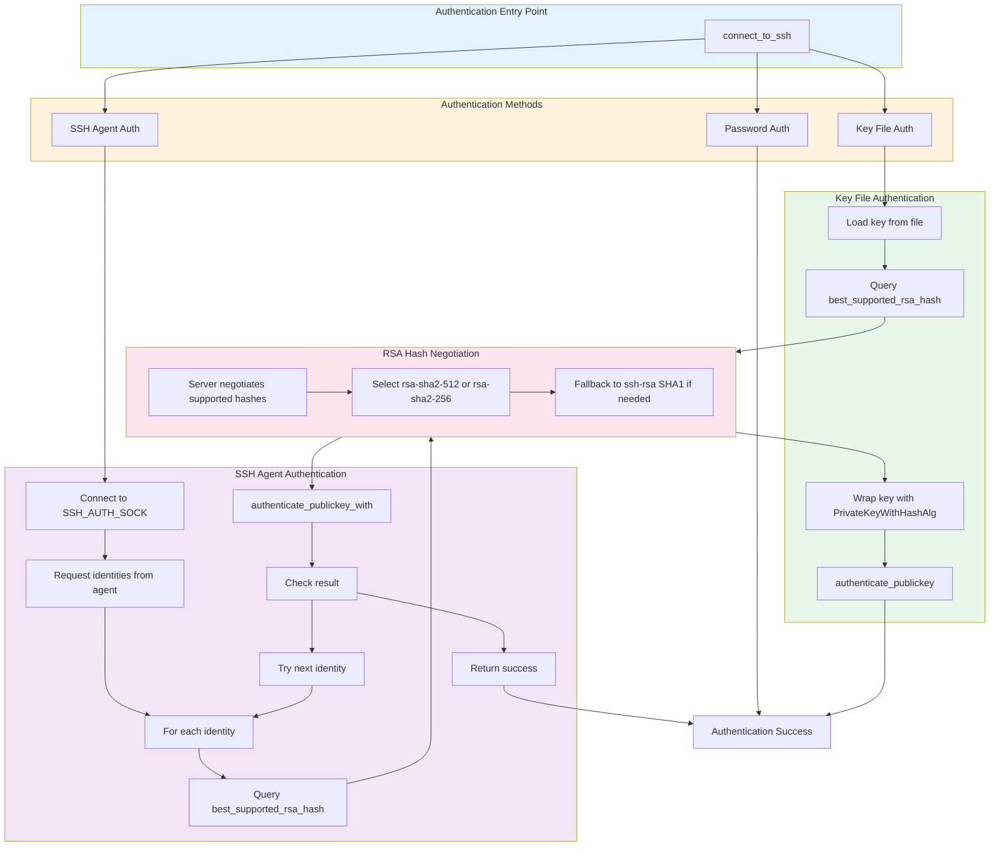
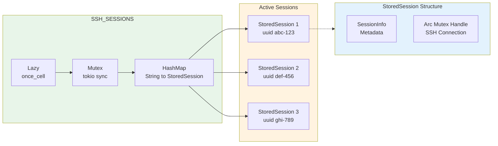
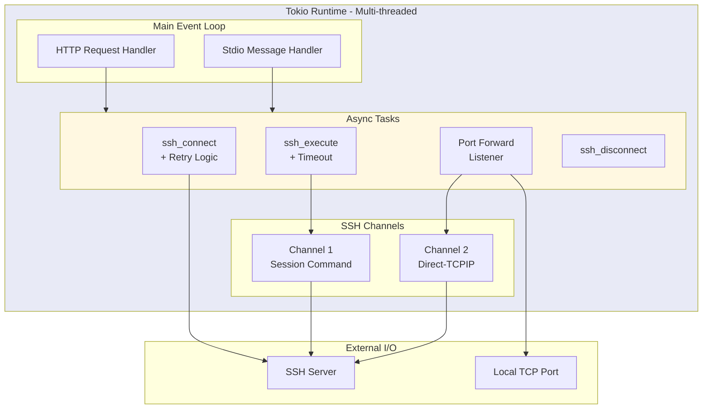
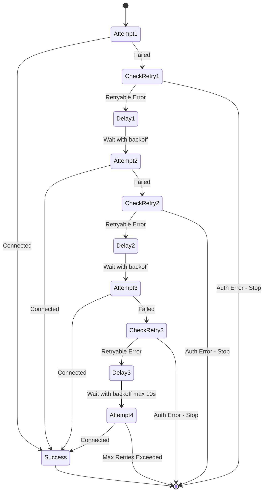
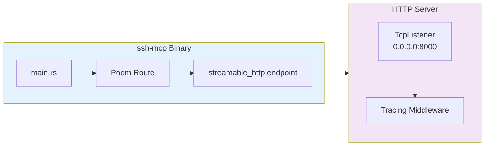
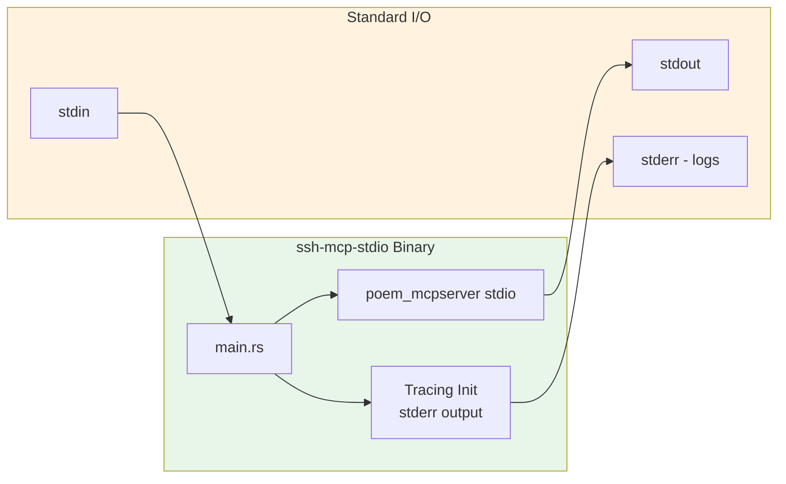
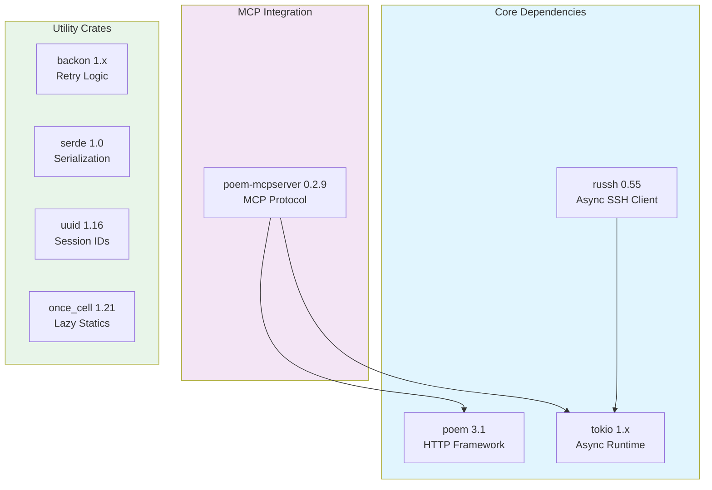

# SSH MCP Architecture

This document describes the system architecture of the SSH Model Context Protocol (MCP) Server, providing a comprehensive overview of components, their relationships, and the underlying threading model.

## Table of Contents

- [Overview](#overview)
- [Module Structure](#module-structure)
- [Module Dependency Graph](#module-dependency-graph)
- [Component Architecture](#component-architecture)
- [Authentication Flow](#authentication-flow)
- [Session Storage Architecture](#session-storage-architecture)
- [Threading and Async Model](#threading-and-async-model)
- [Binary Targets](#binary-targets)
- [Key Dependencies](#key-dependencies)

---

## Overview

SSH MCP is a Rust-based server that exposes SSH operations as MCP tools, enabling LLM-based systems to interact with remote servers via SSH. The system provides two transport modes:

1. **HTTP Transport** (`ssh-mcp`) - Poem-based HTTP server on port 8000
2. **Stdio Transport** (`ssh-mcp-stdio`) - Direct stdio communication for MCP integration



---

## Module Structure

The codebase consists of **8 source files** organized into a modular structure:

| File | Location | Visibility | Description |
|------|----------|------------|-------------|
| `lib.rs` | `src/` | `pub` | Library crate root, exposes `mcp` module |
| `mod.rs` | `src/mcp/` | - | Module root, re-exports `McpSSHCommands` |
| `types.rs` | `src/mcp/` | `pub` | Serializable response types for MCP tools |
| `config.rs` | `src/mcp/` | `pub(crate)` | Configuration resolution with environment variable support |
| `error.rs` | `src/mcp/` | `pub(crate)` | Error classification for retry logic |
| `session.rs` | `src/mcp/` | `pub` | Session storage and SSH client handler |
| `client.rs` | `src/mcp/` | `pub(crate)` | SSH connection, authentication, and command execution |
| `forward.rs` | `src/mcp/` | `pub(crate)` | Port forwarding implementation (feature-gated) |
| `commands.rs` | `src/mcp/` | `pub` | MCP tool implementations via `#[Tools]` macro |

### Module Responsibilities

**lib.rs** - Library Root
- Exposes the `mcp` module for external use
- Entry point for the library crate

**mod.rs** - Module Root
- Declares and organizes submodules
- Controls visibility (pub, pub(crate))
- Re-exports `McpSSHCommands` for convenience

**types.rs** - Response Types
- `SessionInfo` - Session metadata for tracking connections
- `SshConnectResponse` - Connection result with retry information
- `SshCommandResponse` - Command output with stdout, stderr, exit code
- `PortForwardingResponse` - Port forwarding status (feature-gated)
- `SessionListResponse` - List of active sessions

**config.rs** - Configuration Management
- Default constants for timeouts, retries, compression
- Environment variable names and parsing
- `resolve_*` functions implementing Parameter -> Env -> Default priority

**error.rs** - Error Classification
- `is_retryable_error()` - Classifies errors as transient or permanent
- Authentication errors (non-retryable) vs connection errors (retryable)

**session.rs** - Session Management
- `SshClientHandler` - russh client handler that accepts all host keys
- `StoredSession` - Combines SessionInfo with SSH handle
- `SSH_SESSIONS` - Global lazy-initialized session storage

**client.rs** - SSH Client Operations
- `build_client_config()` - Builds russh configuration with compression preferences
- `parse_address()` - Parses host and port from address string
- `connect_to_ssh_with_retry()` - Connection with exponential backoff via backon
- `authenticate_with_key()` - Private key authentication with RSA hash negotiation
- `authenticate_with_agent()` - SSH agent authentication with RSA hash negotiation
- `execute_ssh_command()` - Command execution via channel-based async I/O

**forward.rs** - Port Forwarding (feature-gated)
- `setup_port_forwarding()` - Creates TCP listener and spawns forwarder
- `handle_port_forward_connection()` - Bidirectional I/O via direct-tcpip

**commands.rs** - MCP Tools
- `McpSSHCommands` struct with `#[Tools]` impl
- `ssh_connect` - Connect and authenticate
- `ssh_execute` - Run commands with timeout
- `ssh_forward` - Setup port forwarding (feature-gated)
- `ssh_disconnect` - Graceful session cleanup
- `ssh_list_sessions` - List active sessions

---

## Module Dependency Graph



---

## Component Architecture

The following diagram illustrates the relationships between the main components:



### Component Descriptions

| Component | Module | Description |
|-----------|--------|-------------|
| `McpSSHCommands` | commands.rs | Main struct implementing MCP tools via the `#[Tools]` attribute macro |
| `StoredSession` | session.rs | Wraps session metadata with the actual SSH handle |
| `SessionInfo` | types.rs | Serializable metadata for tracking connection information |
| `SshClientHandler` | session.rs | Implements `russh::client::Handler` for host key verification |
| `SSH_SESSIONS` | session.rs | Global thread-safe storage for active SSH sessions |

---

## Authentication Flow

The client.rs module handles three authentication methods with modern RSA hash negotiation:



### RSA Hash Algorithm Negotiation

Modern SSH servers often disable legacy `ssh-rsa` (SHA-1) signatures for security. The client.rs module uses `best_supported_rsa_hash()` to negotiate modern algorithms:

| Priority | Algorithm | Description |
|----------|-----------|-------------|
| 1 | `rsa-sha2-512` | RSA with SHA-512 - strongest option |
| 2 | `rsa-sha2-256` | RSA with SHA-256 - widely supported |
| 3 | `ssh-rsa` | Legacy RSA with SHA-1 - fallback only |

```rust
// Query server for best supported RSA hash algorithm
let hash_alg = handle
    .best_supported_rsa_hash()
    .await
    .ok()
    .flatten()
    .flatten();

// Wrap the key with the negotiated algorithm
let key_with_hash = keys::PrivateKeyWithHashAlg::new(Arc::new(key_pair), hash_alg);
```

This negotiation happens automatically for both key file and SSH agent authentication, ensuring compatibility with modern SSH servers while maintaining backward compatibility.

---

## Session Storage Architecture

SSH sessions are stored in a global, thread-safe data structure that allows concurrent access from multiple async tasks.



### Storage Design Decisions

1. **`Lazy` Initialization**: Sessions store is initialized on first access using `once_cell::sync::Lazy`
2. **`tokio::sync::Mutex`**: Async-aware mutex for non-blocking lock acquisition in async contexts
3. **`Arc<Mutex<Handle>>`**: Session handles are wrapped in `Arc<Mutex>` to allow sharing across tasks while maintaining exclusive access during operations
4. **UUID Session IDs**: Each session receives a unique UUID v4 identifier for tracking

### Lock Scope Optimization

The codebase follows a strict pattern of minimizing lock scope:

```rust
// Clone Arc and release global lock immediately
let handle_arc = {
    let sessions = SSH_SESSIONS.lock().await;
    sessions
        .get(&session_id)
        .map(|s| s.handle.clone())
        .ok_or_else(|| format!("No active SSH session with ID: {}", session_id))?
};

// Actual SSH operations happen outside the global lock
// Only the specific session's handle mutex is held
```

---

## Threading and Async Model

The system uses Tokio's multi-threaded async runtime with native async SSH operations via russh.



### Native Async Architecture

Unlike implementations using blocking SSH libraries, this system uses **russh** which provides native async support:

| Operation | Async Pattern | Notes |
|-----------|---------------|-------|
| SSH Connect | `tokio::time::timeout` | Wrapped with configurable timeout |
| Retry Logic | `backon::Retryable` | Exponential backoff with jitter |
| Command Execution | Channel-based async I/O | Non-blocking read/write via `ChannelMsg` |
| Port Forwarding | `tokio::spawn` | Background task per listener |
| Session Lock | `tokio::sync::Mutex` | Async-aware mutex |
| Bidirectional I/O | `tokio::io::copy` + `select!` | Efficient zero-copy forwarding |

### Key Differences from Blocking Libraries

- **No `spawn_blocking`**: All SSH operations are natively async
- **Channel-based I/O**: Uses russh `ChannelMsg` enum for stdout, stderr, exit status
- **Direct-TCPIP**: Port forwarding uses `channel_open_direct_tcpip` with `into_stream()`
- **Graceful disconnect**: Uses `Disconnect::ByApplication` for clean session termination

### Retry Logic with Backoff



**Retry Classification (error.rs)**:
- **Non-retryable**: Authentication failures, permission denied, publickey errors
- **Retryable**: Connection refused, timeout, network unreachable, broken pipe

---

## Binary Targets

### HTTP Server (`ssh-mcp`)



**Features:**
- Runs on port 8000 (configurable via `MCP_PORT`)
- Uses Poem's streamable HTTP transport
- Includes tracing middleware for debugging
- Loads environment from `.env` file
- Initializes tracing with `info` level default

### Stdio Transport (`ssh-mcp-stdio`)



**Features:**
- Minimal binary for direct MCP integration
- No HTTP overhead
- Ideal for embedding in LLM tools
- Tracing initialized with `RUST_LOG` environment filter
- Logs directed to stderr to avoid interfering with MCP protocol on stdout

---

## Key Dependencies



| Dependency | Version | Purpose |
|------------|---------|---------|
| `russh` | 0.55 | Pure Rust async SSH client implementation |
| `tokio` | 1.x | Async runtime with full features |
| `poem` | 3.1 | HTTP framework matching poem-mcpserver |
| `poem-mcpserver` | 0.2.9 | MCP protocol implementation |
| `backon` | 1.x | Retry logic with exponential backoff |
| `serde` | 1.0 | JSON serialization/deserialization |
| `uuid` | 1.16 | UUID v4 generation for session IDs |
| `once_cell` | 1.21 | Lazy static initialization |
| `tracing` | 0.1 | Structured logging |
| `tracing-subscriber` | 0.3 | Tracing output and filtering |
| `chrono` | 0.4 | Timestamp generation |

---

## Feature Flags

The project supports optional features via Cargo:

| Feature | Default | Description |
|---------|---------|-------------|
| `port_forward` | Yes | Enables SSH port forwarding support via `ssh_forward` tool |

To build without port forwarding:

```bash
cargo build --release --no-default-features
```
