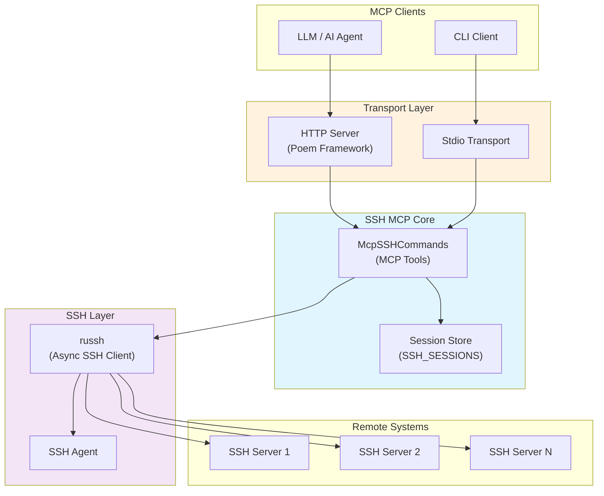
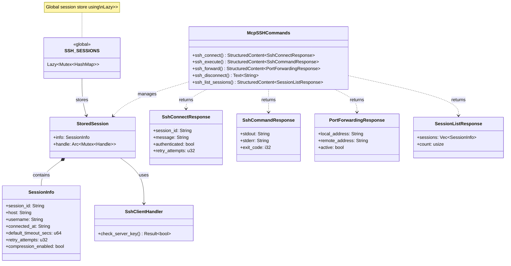
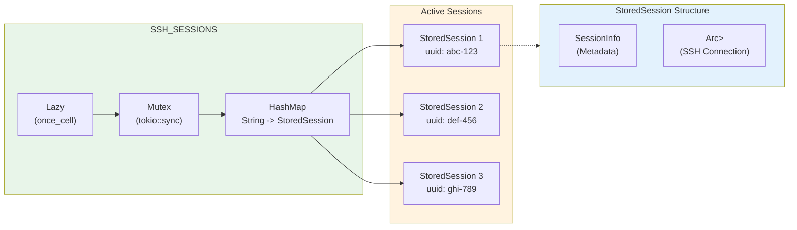
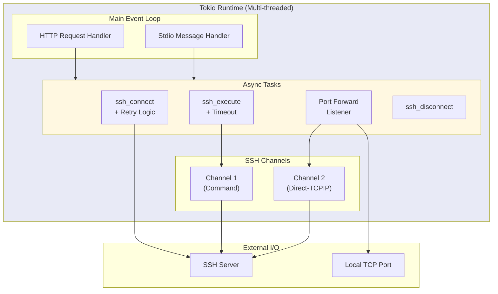
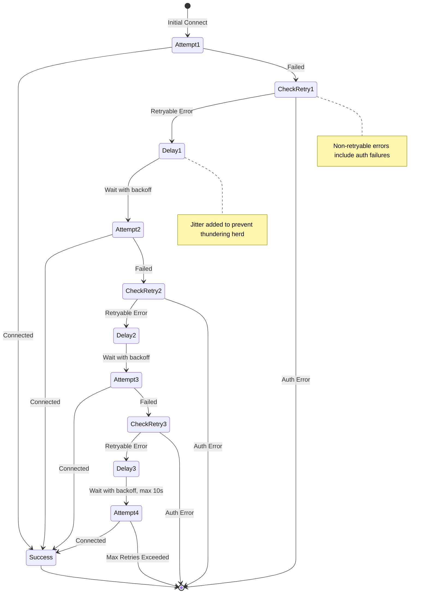
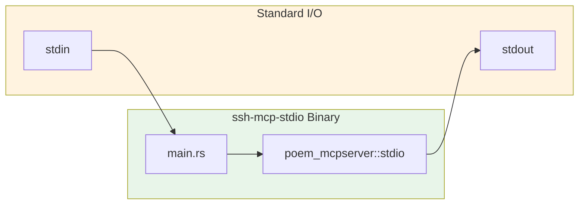
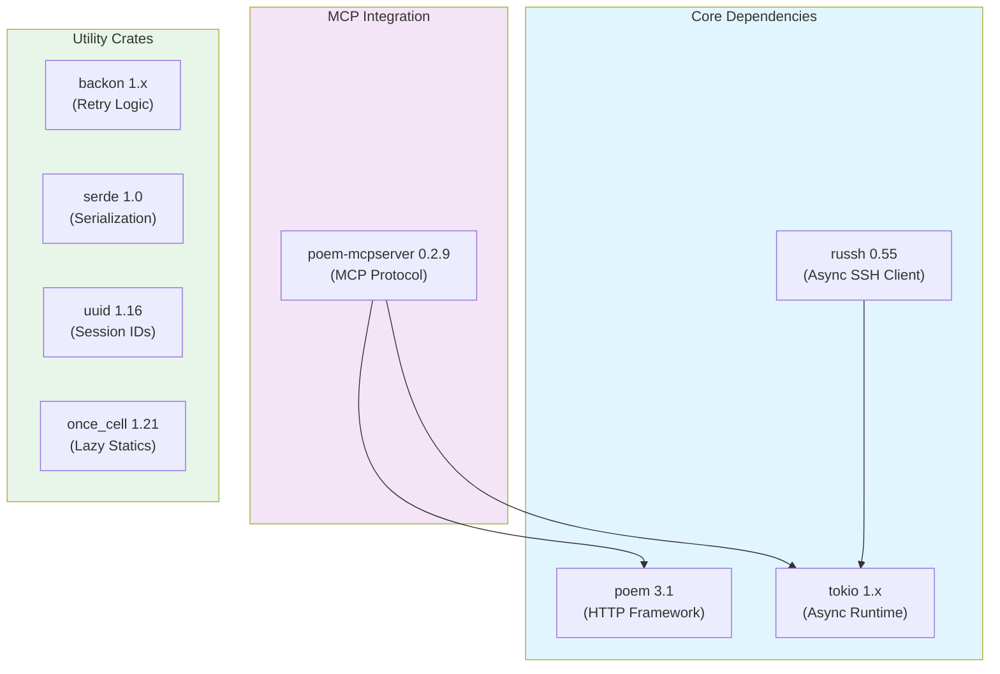

# SSH MCP Architecture

This document describes the system architecture of the SSH Model Context Protocol (MCP) Server, providing a comprehensive overview of components, their relationships, and the underlying threading model.

## Table of Contents

- [Overview](#overview)
- [Component Architecture](#component-architecture)
- [Session Storage Architecture](#session-storage-architecture)
- [Threading and Async Model](#threading-and-async-model)
- [Binary Targets](#binary-targets)
- [Key Dependencies](#key-dependencies)

---

## Overview

SSH MCP is a Rust-based server that exposes SSH operations as MCP tools, enabling LLM-based systems to interact with remote servers via SSH. The system provides two transport modes:

1. **HTTP Transport** (`ssh-mcp`) - Poem-based HTTP server on port 8000
2. **Stdio Transport** (`ssh-mcp-stdio`) - Direct stdio communication for MCP integration



---

## Component Architecture

The following diagram illustrates the relationships between the main components:



### Component Descriptions

| Component | Description |
|-----------|-------------|
| `McpSSHCommands` | Main struct implementing MCP tools via the `#[Tools]` attribute macro |
| `StoredSession` | Wraps session metadata with the actual SSH handle |
| `SessionInfo` | Serializable metadata for tracking connection information |
| `SshClientHandler` | Implements `russh::client::Handler` for host key verification |
| `SSH_SESSIONS` | Global thread-safe storage for active SSH sessions |

---

## Session Storage Architecture

SSH sessions are stored in a global, thread-safe data structure that allows concurrent access from multiple async tasks.



### Storage Design Decisions

1. **`Lazy` Initialization**: Sessions store is initialized on first access using `once_cell::sync::Lazy`
2. **`tokio::sync::Mutex`**: Async-aware mutex for non-blocking lock acquisition in async contexts
3. **`Arc<Mutex<Handle>>`**: Session handles are wrapped in `Arc<Mutex>` to allow sharing across tasks while maintaining exclusive access during operations
4. **UUID Session IDs**: Each session receives a unique UUID v4 identifier for tracking

### Lock Scope Optimization

The codebase follows a strict pattern of minimizing lock scope:

```rust
// Clone Arc and release global lock immediately
let handle_arc = {
    let sessions = SSH_SESSIONS.lock().await;
    sessions
        .get(&session_id)
        .map(|s| s.handle.clone())
        .ok_or_else(|| format!("No active SSH session with ID: {}", session_id))?
};

// Actual SSH operations happen outside the global lock
// Only the specific session's handle mutex is held
```

---

## Threading and Async Model

The system uses Tokio's multi-threaded async runtime with careful handling of blocking operations.



### Async Operations

| Operation | Async Pattern | Notes |
|-----------|---------------|-------|
| SSH Connect | `tokio::time::timeout` | Wrapped with configurable timeout |
| Retry Logic | `backon::Retryable` | Exponential backoff with jitter |
| Command Execution | Channel-based async I/O | Non-blocking read/write |
| Port Forwarding | `tokio::spawn` | Background task per listener |
| Session Lock | `tokio::sync::Mutex` | Async-aware mutex |

### Retry Logic with Backoff



---

## Binary Targets

### HTTP Server (`ssh-mcp`)


**Features:**
- Runs on port 8000 (configurable via `MCP_PORT`)
- Uses Poem's streamable HTTP transport
- Includes tracing middleware for debugging
- Loads environment from `.env` file

### Stdio Transport (`ssh-mcp-stdio`)



**Features:**
- Minimal binary for direct MCP integration
- No HTTP overhead
- Ideal for embedding in LLM tools

---

## Key Dependencies



| Dependency | Version | Purpose |
|------------|---------|---------|
| `russh` | 0.55 | Pure Rust async SSH client implementation |
| `tokio` | 1.x | Async runtime with full features |
| `poem` | 3.1 | HTTP framework matching poem-mcpserver |
| `poem-mcpserver` | 0.2.9 | MCP protocol implementation |
| `backon` | 1.x | Retry logic with exponential backoff |
| `serde` | 1.0 | JSON serialization/deserialization |
| `uuid` | 1.16 | UUID v4 generation for session IDs |
| `once_cell` | 1.21 | Lazy static initialization |
| `tracing` | 0.1 | Structured logging |

---

## Feature Flags

The project supports optional features via Cargo:

| Feature | Default | Description |
|---------|---------|-------------|
| `port_forward` | Yes | Enables SSH port forwarding support via `ssh_forward` tool |

To build without port forwarding:

```bash
cargo build --release --no-default-features
```
