# SSH MCP Architecture

This document describes the system architecture of the SSH Model Context Protocol (MCP) Server, providing a comprehensive overview of components, their relationships, and the underlying threading model. Unless stated otherwise, everything here reflects the **v2.0.1** codebase, where every tool returns a markdown `Text<String>` response built by `message::builder`.

[[_TOC_]]

## Overview

SSH MCP is a Rust crate that exposes SSH operations as MCP tools, enabling LLM-based systems to interact with remote servers via SSH. Two transport binaries are provided:

1. **HTTP Transport** (`ssh-mcp`) — Poem-based HTTP server, default port 8000, streamable HTTP endpoint.
2. **Stdio Transport** (`ssh-mcp-stdio`) — Line-delimited JSON-RPC on stdin/stdout, logs go to stderr. Ships a small event loop (`src/bin/ssh_mcp_stdio.rs`) that intercepts `notifications/cancelled` (both `camelCase` and `snake_case`) and drops responses for cancelled IDs.

<details>
<summary>System overview diagram</summary>

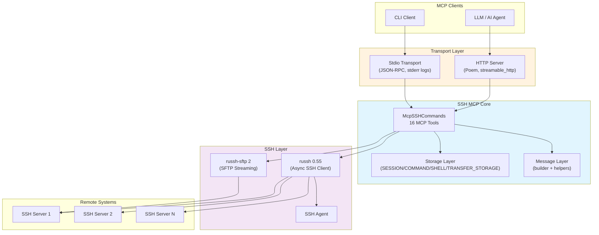
```mermaid
flowchart TB
    subgraph Clients["MCP Clients"]
        LLM["LLM / AI Agent"]
        CLI["CLI Client"]
    end

    subgraph Transport["Transport Layer"]
        HTTP["HTTP Server<br/>(Poem, streamable_http)"]
        STDIO["Stdio Transport<br/>(JSON-RPC, stderr logs)"]
    end

    subgraph Core["SSH MCP Core"]
        MCP["McpSSHCommands<br/>16 MCP Tools"]
        Storage["Storage Layer<br/>(SESSION/COMMAND/SHELL/TRANSFER_STORAGE)"]
        Messages["Message Layer<br/>(builder + helpers)"]
    end

    subgraph SSH["SSH Layer"]
        Russh["russh 0.55<br/>(Async SSH Client)"]
        RusshSftp["russh-sftp 2<br/>(SFTP Streaming)"]
        Agent["SSH Agent"]
    end

    subgraph Remote["Remote Systems"]
        Server1["SSH Server 1"]
        Server2["SSH Server 2"]
        ServerN["SSH Server N"]
    end

    LLM --> HTTP
    CLI --> STDIO
    HTTP --> MCP
    STDIO --> MCP
    MCP --> Storage
    MCP --> Messages
    MCP --> Russh
    MCP --> RusshSftp
    Russh --> Agent
    Russh --> Server1
    Russh --> Server2
    Russh --> ServerN
    RusshSftp --> Server1

    style Core fill:#e1f5fe
    style Transport fill:#fff3e0
    style SSH fill:#f3e5f5
```

</details>

## Module Structure

The codebase consists of **28 source files** (roughly **12.9K lines** including tests) organized into a SOLID-friendly, trait-driven architecture.

### Core Modules (`src/mcp/`)

| File | Lines | Visibility | Description |
|------|-------|------------|-------------|
| `mod.rs` | 40 | — | Module root / feature gating. |
| `types.rs` | 230 | `pub` | Internal data carriers (`SessionInfo`, `AsyncCommandInfo`, `ShellInfo`, status enums). Structured response types from v1 were removed — handlers now build markdown directly via `message::builder`. |
| `config.rs` | 1101 | `pub(crate)` | Parameter / env / default resolution plus human-readable byte-size parser. |
| `error.rs` | 359 | `pub(crate)` | Retryable vs non-retryable classifier. |
| `session.rs` | 41 | `pub` | `SshClientHandler` (russh host-key handler — currently accepts all keys, ready for extension). |
| `client.rs` | 1220 | `pub(crate)` | Address parsing, `build_client_config`, retry loop with `backon`, command execution (sync + async + async-PTY), PTY shell open, default key discovery. |
| `async_command.rs` | 325 | `pub(crate)` | `RunningCommand` + bounded `OutputBuffer` (head-drained stdout/stderr). |
| `shell.rs` | 152 | `pub(crate)` | `RunningShell`, `ChannelWriter`, shell capacity constants (`MAX_SHELLS_PER_SESSION = 10`). |
| `schema.rs` | 76 | `pub` | `uint` schema helper for `schemars` (avoids `format: "uint"` which some LLMs can't parse). |
| `forward.rs` | 168 | `pub(crate)` | Port forwarding via `channel_open_direct_tcpip` + bidirectional `tokio::io::copy` (feature-gated `port_forward`). |
| `commands.rs` | 2272 | `pub` | `McpSSHCommands` with the 16 `#[Tools]`-annotated handlers and their orchestration helpers (reuse detection, cleanup tasks, response builders). |
| `sftp.rs` | 740 | `pub(crate)` | `open_sftp_session`, path resolution (`~` + relative → home), streaming upload/download, `classify_transfer_error` (FILE_NOT_FOUND, PERMISSION_DENIED, ...). |
| `transfer.rs` | 342 | `pub(crate)` | `RunningTransfer`, `TransferDirection`, `TransferStatus`, `MAX_TRANSFERS_PER_SESSION = 10`, `CHUNK_SIZE = 32 KiB`. |

### Storage Layer (`src/mcp/storage/`) — SOLID: SRP, DIP

Traits live in `traits.rs`; each implementation uses `DashMap` for lock-free concurrent reads and writes, plus secondary indices for O(1) lookups.

| File | Lines | Description |
|------|-------|-------------|
| `mod.rs` | 12 | Module exports. |
| `traits.rs` | 186 | `SessionStorage`, `CommandStorage`, `ShellStorage`, `TransferStorage` traits plus `SessionRef` / `CommandRef` read-only views. |
| `session.rs` | 691 | `DashMapSessionStorage`, `parse_host_port`, `find_by_identity`, agent & identity indices, per-session channel semaphore (`CHANNEL_CONCURRENCY_PER_SESSION = 1`). |
| `command.rs` | 1088 | `DashMapCommandStorage` with session index and running-only counter. |
| `shell.rs` | 173 | `DashMapShellStorage` with session index. |
| `transfer.rs` | 173 | `DashMapTransferStorage` with session index. |

Global singleton instances (`SESSION_STORAGE`, `COMMAND_STORAGE`, `SHELL_STORAGE`, `TRANSFER_STORAGE`) expose the traits to the rest of the crate via `LazyLock`.

### Authentication Layer (`src/mcp/auth/`) — SOLID: OCP, SRP

Strategy pattern via `AuthStrategy`, with `AuthChain` composing multiple strategies in order.

| File | Lines | Description |
|------|-------|-------------|
| `mod.rs` | 30 | Module exports and a usage example. |
| `traits.rs` | 40 | `AuthStrategy` trait (`authenticate`, `name`). |
| `password.rs` | 129 | Password auth. |
| `key.rs` | 212 | Key-file auth. Queries `best_supported_rsa_hash()` and wraps the key with `PrivateKeyWithHashAlg` so RSA keys negotiate `rsa-sha2-256` / `rsa-sha2-512` when available. |
| `agent.rs` | 145 | SSH-agent auth. Connects via `SSH_AUTH_SOCK`, iterates all identities, negotiates RSA hash per identity. |
| `chain.rs` | 330 | `AuthChain` — fluent builder: `.with_password`, `.with_key`, `.with_agent`. |

The default chain assembled in `client::build_auth_chain` is:

1. `PasswordAuth` (if a password was provided).
2. `KeyAuth` for each provided / discovered key file — `key_path` when explicit, otherwise each default OpenSSH file found in `~/.ssh/` (`id_ed25519`, `id_ecdsa`, `id_ecdsa_sk`, `id_ed25519_sk`, `id_rsa`, `id_dsa`).
3. `AgentAuth` is always appended.

### Message Layer (`src/mcp/message/`) — SOLID: SRP

| File | Lines | Description |
|------|-------|-------------|
| `mod.rs` | 8 | Re-exports. |
| `helpers.rs` | 1001 | Shared primitives: `generate_nonce()`, `truncate_utf8_safe_tail`/`head`, `sanitize_value`, `format_bytes_human`, `format_error`, `render_output_block`. |
| `builder.rs` | 1635 | Per-tool markdown builders — see below. |

**`message::helpers`** (shared across every tool response):

- `generate_nonce()` — 8-character lowercase hex, sourced from the high 32 bits of a fresh UUIDv4 (~4 billion unique values). Used as an anti-injection token in `--- stdout [nonce] ---` delimiters.
- `truncate_utf8_safe_tail` / `truncate_utf8_safe_head` — respect UTF-8 char boundaries when cutting bytes.
- `sanitize_value` — `Cow` wrapper; only allocates if the input contains `\n`, `\r`, or `\t` (escaped to two-char literals).
- `format_bytes_human` — base-1024 size renderer with one decimal place (`B`, `KB`, `MB`, `GB`).
- `format_error(tool, code, reason, detail?)` — canonical `TOOL: ERROR` / `REASON: [CODE] ...` / `DETAIL: ...` block; detail is head-truncated at 2 KiB.
- `render_output_block(name, nonce, &[u8], max_bytes, status_hint?)` — renders an output block without materializing the whole buffer as `String`; only the truncated tail is allocated.

**`message::builder`** — dedicated builder for each tool response. All builders are `#[must_use]` and return `String`:

- `ConnectOkBuilder` (OK / REUSED / replaced), `ConnectSuggestedBuilder` (single- and multi-match) + `SessionMatch`.
- `ExecuteStartedBuilder`.
- `GetCommandOutputBuilder` with `GetCommandOutputState::{Running, Completed(i32), Timeout}`.
- `CancelCommandCancelledBuilder` + `render_cancel_command_noop`.
- `ShellOpenBuilder`, `ShellReadBuilder` with `ShellReadState::{Open, Closed}`.
- `TransferStartedBuilder` (+ `TransferStartDirection::{Upload, Download}`), `TransferProgressBuilder` with `TransferProgressState::{Running, Completed, Failed(&str)}`.
- `ListSessionsBuilder`, `ListCommandsBuilder` — apply pagination markers (`COUNT: N (showing N of M)`).
- Inline renderers for small responses: `render_disconnect_ok`, `render_disconnect_agent`, `render_shell_write_ok`, `render_shell_close_ok`, `render_forward_ok`.

### Response Format (v2.0)

- **First line** → `TOOL_NAME: STATUS` where status is one of `OK`, `REUSED`, `SUGGESTED`, `STARTED`, `RUNNING`, `COMPLETED`, `FAILED`, `TIMEOUT`, `CANCELLED`, `NOOP`, `OPEN`, `CLOSED`, `ACTIVE`, `ERROR`.
- **Block layout** when the body has 4+ fields or an output block (one `KEY: value` per line).
- **Inline layout** for ≤3 simple fields (`TOOL: STATUS | KEY: v | KEY: v`).
- **Identifiers** use the `_ID` suffix (`SESSION_ID`, `COMMAND_ID`, `SHELL_ID`, `TRANSFER_ID`).
- **Output blocks** — `--- stdout [a3f2b1d7] ---`, `--- stdout [a3f2b1d7] (empty) ---`, `--- stdout [a3f2b1d7] (partial, truncated: showing 16.0KB of 2.3MB) ---`. Shells use `data` instead of `stdout`/`stderr`.
- **Errors** — `TOOL: ERROR\nREASON: [CODE] ...\nDETAIL: ...`. See [`docs/API.md`](API.md#error-format) for the code catalogue.

## Module Dependency Graph

<details>
<summary>Module dependency graph</summary>

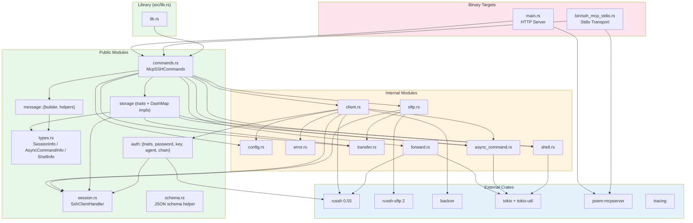
```mermaid
flowchart TB
    subgraph Binaries["Binary Targets"]
        main["main.rs<br/>HTTP Server"]
        stdio["bin/ssh_mcp_stdio.rs<br/>Stdio Transport"]
    end

    subgraph Library["Library (src/lib.rs)"]
        lib["lib.rs"]
    end

    subgraph Public["Public Modules"]
        commands["commands.rs<br/>McpSSHCommands"]
        types["types.rs<br/>SessionInfo / AsyncCommandInfo / ShellInfo"]
        session["session.rs<br/>SshClientHandler"]
        schema["schema.rs<br/>JSON schema helper"]
        storage["storage (traits + DashMap impls)"]
        message["message::{builder, helpers}"]
        auth["auth::{traits, password, key, agent, chain}"]
    end

    subgraph Internal["Internal Modules"]
        client["client.rs"]
        config["config.rs"]
        error["error.rs"]
        forward["forward.rs"]
        async_cmd["async_command.rs"]
        shell["shell.rs"]
        sftp["sftp.rs"]
        transfer["transfer.rs"]
    end

    subgraph External["External Crates"]
        russh["russh 0.55"]
        russh_sftp["russh-sftp 2"]
        backon["backon"]
        tokio["tokio + tokio-util"]
        poem_mcp["poem-mcpserver"]
        tracing["tracing"]
    end

    main --> poem_mcp
    main --> commands
    stdio --> commands
    stdio --> poem_mcp
    lib --> commands

    commands --> client
    commands --> sftp
    commands --> forward
    commands --> async_cmd
    commands --> shell
    commands --> storage
    commands --> message
    commands --> transfer
    commands --> config

    client --> auth
    client --> config
    client --> error
    client --> session
    client --> async_cmd
    client --> russh
    client --> backon

    sftp --> session
    sftp --> transfer
    sftp --> russh_sftp

    storage --> session
    storage --> async_cmd
    storage --> shell
    storage --> transfer
    storage --> types

    message --> types

    auth --> session
    auth --> russh

    forward --> russh
    forward --> tokio
    async_cmd --> tokio
    shell --> tokio

    style Binaries fill:#fce4ec
    style Library fill:#e8f5e9
    style Public fill:#e8f5e9
    style Internal fill:#fff3e0
    style External fill:#e3f2fd
```

</details>

## Component Architecture

The following diagram shows the concrete types behind the 16 tools. Note that v1's many public response structs were removed; every tool now returns `Text<String>` built by `message::builder`.

<details>
<summary>Component class diagram</summary>

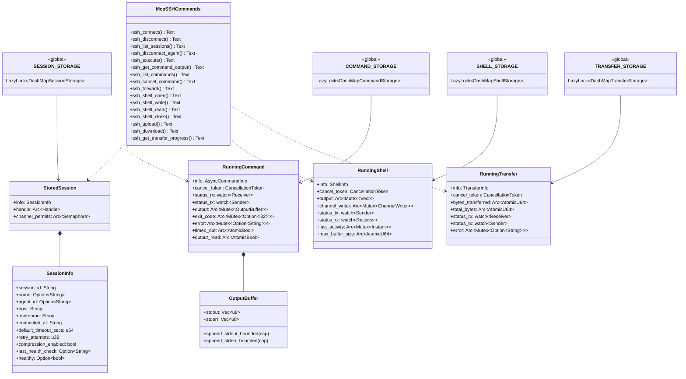
```mermaid
classDiagram
    class McpSSHCommands {
        +ssh_connect() Text
        +ssh_disconnect() Text
        +ssh_list_sessions() Text
        +ssh_disconnect_agent() Text
        +ssh_execute() Text
        +ssh_get_command_output() Text
        +ssh_list_commands() Text
        +ssh_cancel_command() Text
        +ssh_forward() Text
        +ssh_shell_open() Text
        +ssh_shell_write() Text
        +ssh_shell_read() Text
        +ssh_shell_close() Text
        +ssh_upload() Text
        +ssh_download() Text
        +ssh_get_transfer_progress() Text
    }

    class StoredSession {
        +info: SessionInfo
        +handle: Arc~Handle~
        +channel_permits: Arc~Semaphore~
    }

    class SessionInfo {
        +session_id: String
        +name: Option~String~
        +agent_id: Option~String~
        +host: String
        +username: String
        +connected_at: String
        +default_timeout_secs: u64
        +retry_attempts: u32
        +compression_enabled: bool
        +last_health_check: Option~String~
        +healthy: Option~bool~
    }

    class RunningCommand {
        +info: AsyncCommandInfo
        +cancel_token: CancellationToken
        +status_rx: watch~Receiver~
        +status_tx: watch~Sender~
        +output: Arc~Mutex~OutputBuffer~~
        +exit_code: Arc~Mutex~Option~i32~~~
        +error: Arc~Mutex~Option~String~~~
        +timed_out: Arc~AtomicBool~
        +output_read: Arc~AtomicBool~
    }

    class OutputBuffer {
        +stdout: Vec~u8~
        +stderr: Vec~u8~
        +append_stdout_bounded(cap)
        +append_stderr_bounded(cap)
    }

    class RunningShell {
        +info: ShellInfo
        +cancel_token: CancellationToken
        +output: Arc~Mutex~Vec~~
        +channel_writer: Arc~Mutex~ChannelWriter~~
        +status_tx: watch~Sender~
        +status_rx: watch~Receiver~
        +last_activity: Arc~Mutex~Instant~~
        +max_buffer_size: Arc~AtomicU64~
    }

    class RunningTransfer {
        +info: TransferInfo
        +cancel_token: CancellationToken
        +bytes_transferred: Arc~AtomicU64~
        +total_bytes: Arc~AtomicU64~
        +status_rx: watch~Receiver~
        +status_tx: watch~Sender~
        +error: Arc~Mutex~Option~String~~~
    }

    class SESSION_STORAGE {
        <<global>>
        LazyLock~DashMapSessionStorage~
    }
    class COMMAND_STORAGE {
        <<global>>
        LazyLock~DashMapCommandStorage~
    }
    class SHELL_STORAGE {
        <<global>>
        LazyLock~DashMapShellStorage~
    }
    class TRANSFER_STORAGE {
        <<global>>
        LazyLock~DashMapTransferStorage~
    }

    McpSSHCommands ..> StoredSession
    McpSSHCommands ..> RunningCommand
    McpSSHCommands ..> RunningShell
    McpSSHCommands ..> RunningTransfer
    StoredSession *-- SessionInfo
    RunningCommand *-- OutputBuffer
    SESSION_STORAGE --> StoredSession
    COMMAND_STORAGE --> RunningCommand
    SHELL_STORAGE --> RunningShell
    TRANSFER_STORAGE --> RunningTransfer
```

</details>

### Component Descriptions

| Component | Module | Description |
|-----------|--------|-------------|
| `McpSSHCommands` | `commands.rs` | MCP tool surface. Each handler returns `Result<Text<String>, String>` or `Text<String>` directly. |
| `SshClientHandler` | `session.rs` | russh host-key handler (accepts all keys — extend for `known_hosts` verification in production). |
| `SessionStorage` trait + `DashMapSessionStorage` | `storage/session.rs` | Primary map + agent index + identity-triple index (`host_lc`, `port`, `user`) for smart reuse. Each stored session owns a 1-permit channel semaphore. |
| `CommandStorage` trait + `DashMapCommandStorage` | `storage/command.rs` | Primary map + per-session index; `count_running_by_session` feeds the 100-commands-per-session cap. |
| `ShellStorage` trait + `DashMapShellStorage` | `storage/shell.rs` | Primary map + per-session index. |
| `TransferStorage` trait + `DashMapTransferStorage` | `storage/transfer.rs` | Primary map + per-session index. |
| `AuthStrategy` trait + `AuthChain` | `auth/*` | Strategy / chain pattern. `with_password`, `with_key`, `with_agent` fluent builder. |
| `RunningCommand` / `OutputBuffer` | `async_command.rs` | Async command state; `OutputBuffer` drains head-first when over `SSH_COMMAND_MAX_BUFFER_SIZE` (default 10 MiB). |
| `RunningShell` / `ChannelWriter` | `shell.rs` | Interactive PTY state. Output buffer bounded by `max_buffer_size`; shell reader task drops oldest bytes on overflow. |
| `RunningTransfer` | `transfer.rs` | SFTP transfer state. `bytes_transferred` / `total_bytes` are atomic so progress polls are lock-free. |
| Message builders | `message/builder.rs` | Per-tool markdown assemblers. Each carries the tool name, status, and relevant `_ID` fields. |
| Helpers | `message/helpers.rs` | `format_error`, `render_output_block`, `generate_nonce`, sanitization, UTF-8 safe truncation. |

## Authentication Flow

`client.rs` composes an `AuthChain` and calls it inside the retry loop. Retries run only for connection-layer failures; authentication failures surface immediately.

<details>
<summary>Authentication flow diagram</summary>

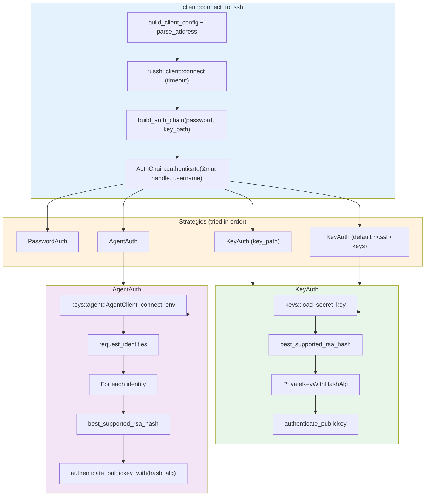
```mermaid
flowchart TB
    subgraph Entry["client::connect_to_ssh"]
        Start["build_client_config + parse_address"]
        Connect["russh::client::connect (timeout)"]
        BuildChain["build_auth_chain(password, key_path)"]
        Authenticate["AuthChain.authenticate(&mut handle, username)"]
    end

    subgraph Methods["Strategies (tried in order)"]
        Password["PasswordAuth"]
        KeyExplicit["KeyAuth (key_path)"]
        KeyDefault["KeyAuth (default ~/.ssh/ keys)"]
        Agent["AgentAuth"]
    end

    subgraph KeyFlow["KeyAuth"]
        LoadKey["keys::load_secret_key"]
        QueryRSA["best_supported_rsa_hash"]
        Wrap["PrivateKeyWithHashAlg"]
        DoAuth["authenticate_publickey"]
    end

    subgraph AgentFlow["AgentAuth"]
        ConnectAgent["keys::agent::AgentClient::connect_env"]
        ListIds["request_identities"]
        LoopIds["For each identity"]
        QueryAgentRSA["best_supported_rsa_hash"]
        AgentAuthCall["authenticate_publickey_with(hash_alg)"]
    end

    Start --> Connect
    Connect --> BuildChain
    BuildChain --> Authenticate

    Authenticate --> Password
    Authenticate --> KeyExplicit
    Authenticate --> KeyDefault
    Authenticate --> Agent

    KeyExplicit --> KeyFlow
    KeyDefault --> KeyFlow
    KeyFlow --> LoadKey --> QueryRSA --> Wrap --> DoAuth

    Agent --> AgentFlow
    AgentFlow --> ConnectAgent --> ListIds --> LoopIds --> QueryAgentRSA --> AgentAuthCall

    style Entry fill:#e3f2fd
    style Methods fill:#fff3e0
    style KeyFlow fill:#e8f5e9
    style AgentFlow fill:#f3e5f5
```

</details>

### RSA Hash Algorithm Negotiation

Both `KeyAuth` and `AgentAuth` call `handle.best_supported_rsa_hash()`. The algorithm is wrapped into the key via `keys::PrivateKeyWithHashAlg::new(key, hash_alg)` so the SSH layer signs with the server's preferred modern hash:

| Priority | Algorithm |
|----------|-----------|
| 1 | `rsa-sha2-512` |
| 2 | `rsa-sha2-256` |
| 3 | Legacy `ssh-rsa` (SHA-1) — used only when the server does not advertise a modern option. |

## Session Storage Architecture

`DashMapSessionStorage` holds three data structures:

- **Primary map** — `session_id → StoredSession`.
- **Agent index** — `agent_id → HashSet<session_id>` for `ssh_disconnect_agent` and agent-filtered listings.
- **Identity index** — `(host_lc, port, username) → HashSet<session_id>` for smart reuse (`ssh_connect reuse="suggest"|"auto"|"force_new"`).

Each `StoredSession` carries an `Arc<Semaphore>` with a single permit (`CHANNEL_CONCURRENCY_PER_SESSION = 1`): background command tasks acquire it before `channel_open_session()` and drop it when the channel has fully closed. This keeps rapid `execute + cancel` bursts from racing OpenSSH's `MaxSessions` budget (typically 10).

<details>
<summary>Session storage diagram</summary>

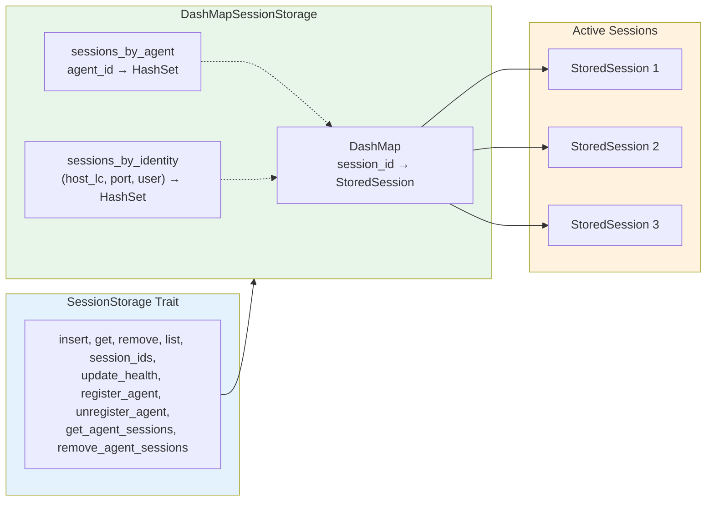
```mermaid
flowchart LR
    subgraph Abstraction["SessionStorage Trait"]
        Trait["insert, get, remove, list, session_ids,<br/>update_health, register_agent, unregister_agent,<br/>get_agent_sessions, remove_agent_sessions"]
    end

    subgraph Implementation["DashMapSessionStorage"]
        Primary["DashMap<br/>session_id → StoredSession"]
        SecAgent["sessions_by_agent<br/>agent_id → HashSet<session_id>"]
        SecIdent["sessions_by_identity<br/>(host_lc, port, user) → HashSet<session_id>"]
    end

    subgraph Sessions["Active Sessions"]
        S1["StoredSession 1"]
        S2["StoredSession 2"]
        S3["StoredSession 3"]
    end

    Trait --> Implementation
    Primary --> S1
    Primary --> S2
    Primary --> S3
    SecAgent -.-> Primary
    SecIdent -.-> Primary

    style Abstraction fill:#e3f2fd
    style Implementation fill:#e8f5e9
    style Sessions fill:#fff3e0
```

</details>

### Storage Design Decisions

1. **Trait-based abstraction (DIP).** Storage traits allow mocking in unit tests and future swap-in of alternative backends.
2. **DashMap.** Lock-free concurrent access — readers and writers never block each other.
3. **Multiple secondary indices.** Keep `O(1)` path for identity-triple lookups, agent cleanup, and session scans.
4. **`Arc<Handle>`.** Each russh handle is wrapped in `Arc` so multiple async tasks can share it (the semaphore serializes channel opens, not handle reads).
5. **UUIDv4 identifiers.** All `session_id` / `command_id` / `shell_id` / `transfer_id` values are UUIDv4 strings.

### Lock-Free Access Pattern

```rust
use crate::mcp::storage::{SESSION_STORAGE, COMMAND_STORAGE};

// Insert (v2 signature)
SESSION_STORAGE.insert(session_id, info, Arc::new(handle));

// Fetch metadata + handle
if let Some(session_ref) = SESSION_STORAGE.get(&session_id) {
    // session_ref.info     — SessionInfo clone
    // session_ref.handle   — Arc<russh::client::Handle<SshClientHandler>>
    // session_ref.channel_permits — Arc<Semaphore>
}

// Smart reuse lookup
let candidates = SESSION_STORAGE.find_by_identity("host.example.com", 22, "user");

// Agent-based operations
SESSION_STORAGE.register_agent(&agent_id, &session_id);
let agent_sessions = SESSION_STORAGE.get_agent_sessions(&agent_id);
```

## Async Command Architecture

Async commands are the backbone of long-running work. Each `ssh_execute` call creates a `RunningCommand`, registers it in `COMMAND_STORAGE`, and spawns a background task that awaits the per-session channel semaphore before opening a russh channel.

<details>
<summary>Async command architecture diagram</summary>

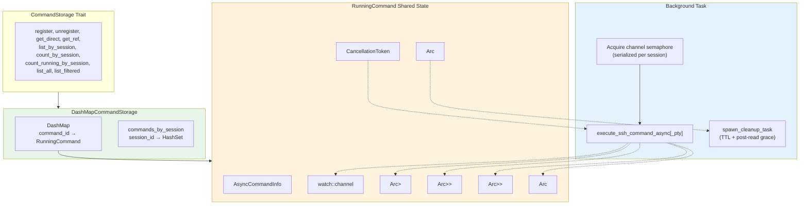
```mermaid
flowchart TB
    subgraph Trait["CommandStorage Trait"]
        T["register, unregister, get_direct, get_ref,<br/>list_by_session, count_by_session,<br/>count_running_by_session, list_all, list_filtered"]
    end

    subgraph Storage["DashMapCommandStorage"]
        Map["DashMap<br/>command_id → RunningCommand"]
        Idx["commands_by_session<br/>session_id → HashSet<command_id>"]
    end

    Trait --> Storage

    subgraph RunningCmd["RunningCommand Shared State"]
        Info["AsyncCommandInfo"]
        CancelToken["CancellationToken"]
        StatusChan["watch::channel<AsyncCommandStatus>"]
        Output["Arc<Mutex<OutputBuffer>>"]
        ExitCode["Arc<Mutex<Option<i32>>>"]
        Error["Arc<Mutex<Option<String>>>"]
        TimedOut["Arc<AtomicBool>"]
        OutputRead["Arc<AtomicBool>"]
    end

    subgraph Execution["Background Task"]
        Permit["Acquire channel semaphore<br/>(serialized per session)"]
        Exec["execute_ssh_command_async[_pty]"]
        Cleanup["spawn_cleanup_task<br/>(TTL + post-read grace)"]
    end

    Map --> RunningCmd
    Permit --> Exec
    Exec -.-> Output
    Exec -.-> StatusChan
    Exec -.-> ExitCode
    Exec -.-> Error
    Exec -.-> TimedOut
    CancelToken -.-> Exec
    OutputRead -.-> Cleanup

    style Storage fill:#e8f5e9
    style RunningCmd fill:#fff3e0
    style Execution fill:#e3f2fd
```

</details>

### Async Command Flow

1. **`ssh_execute`** — `count_running_by_session` enforces `MAX_ASYNC_COMMANDS_PER_SESSION = 100`; `create_running_command` allocates the shared state; `register_and_spawn` calls `spawn_command_task` which awaits the semaphore before running `execute_ssh_command_async` (or the PTY variant).
2. **`ssh_get_command_output`** — clones the `status_rx` / `output` handles, optionally waits for completion with a 300 s cap, marks `output_read` atomically, and renders via `GetCommandOutputBuilder`.
3. **`ssh_cancel_command`** — runs `cancel_token.cancel()`, waits up to 5 s for `status_rx` to leave `Running` (so the server-side channel is confirmed closed), then pauses 100 ms more before returning — back-to-back cancel+execute bursts never race the `CHANNEL_CLOSE` ack.
4. **`ssh_list_commands`** — filters by session/status and sorts by `started_at`; pagination applies `max_items` (default 500, cap 10 000).
5. **Cleanup task** — spawned alongside the command. Waits for the command to leave `Running`; if `output_read` was set, cleanup happens after a 1 s grace; otherwise waits up to `SSH_COMMAND_CLEANUP_TTL` (default 60 s) before removing the entry from storage.

### Concurrency Controls

| Control | Value | Purpose |
|---------|-------|---------|
| `MAX_ASYNC_COMMANDS_PER_SESSION` | 100 | Running-command cap per session. |
| `CHANNEL_CONCURRENCY_PER_SESSION` | 1 | Serializes russh channel opens on the same session (semaphore). |
| `SSH_COMMAND_MAX_BUFFER_SIZE` | 10 MiB | Head-drained stdout/stderr bound per command. |
| `Arc<AtomicBool>` for `timed_out` / `output_read` | — | Lock-free flags. |
| `watch::channel` | — | Lock-free status broadcasting. |
| `CommandStorage` trait | — | Dependency-injection seam for tests. |

### Session Cleanup

`ssh_disconnect` (and the agent variant) run in this order per session:

1. `cancel_session_transfers` — iterate `TRANSFER_STORAGE.list_by_session`, cancel each token, unregister entries.
2. `close_session_shells` — iterate `SHELL_STORAGE.list_by_session`, cancel reader tasks, close `ChannelWriter`, unregister.
3. `cancel_session_commands` — iterate `COMMAND_STORAGE.list_by_session`, cancel tokens, unregister entries. Returns the count rendered in `ssh_disconnect_agent`'s `COMMANDS:` field.
4. `SESSION_STORAGE.remove` and `Disconnect::ByApplication` on the handle.

## Threading and Async Model

The system uses Tokio's multi-threaded async runtime. Everything is native async — there is no `spawn_blocking`.

<details>
<summary>Threading and async model diagram</summary>

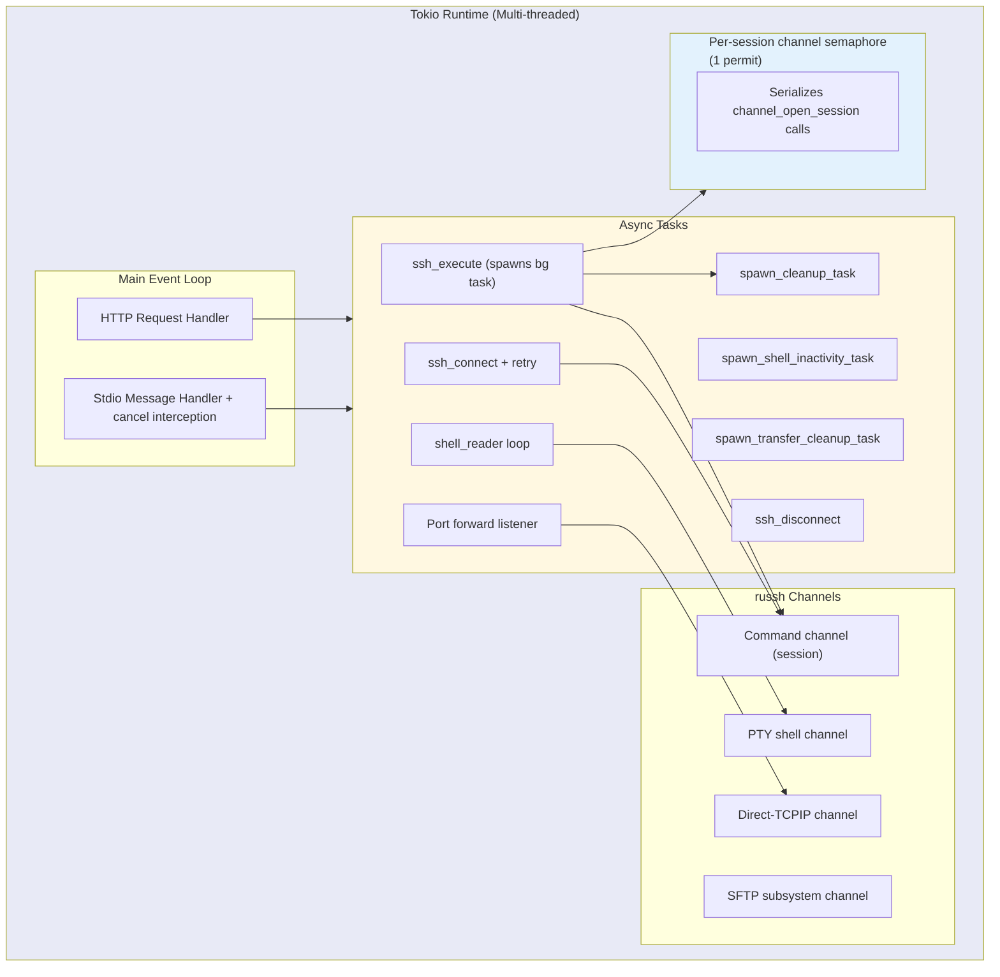
```mermaid
flowchart TB
    subgraph Runtime["Tokio Runtime (Multi-threaded)"]
        subgraph MainLoop["Main Event Loop"]
            HTTP["HTTP Request Handler"]
            STDIO["Stdio Message Handler + cancel interception"]
        end

        subgraph Tasks["Async Tasks"]
            Connect["ssh_connect + retry"]
            Execute["ssh_execute (spawns bg task)"]
            CancelCleanup["spawn_cleanup_task"]
            ShellReader["shell_reader loop"]
            ShellTTL["spawn_shell_inactivity_task"]
            XferCleanup["spawn_transfer_cleanup_task"]
            Forward["Port forward listener"]
            Disconnect["ssh_disconnect"]
        end

        subgraph Channels["russh Channels"]
            ChanExec["Command channel (session)"]
            ChanPty["PTY shell channel"]
            ChanFwd["Direct-TCPIP channel"]
            ChanSftp["SFTP subsystem channel"]
        end

        subgraph Semaphore["Per-session channel semaphore<br/>(1 permit)"]
            S["Serializes channel_open_session calls"]
        end
    end

    HTTP --> Tasks
    STDIO --> Tasks
    Execute --> Semaphore
    Execute --> ChanExec
    ShellReader --> ChanPty
    Forward --> ChanFwd
    Execute --> CancelCleanup
    Connect --> ChanExec

    style Runtime fill:#e8eaf6
    style Tasks fill:#fff8e1
    style Semaphore fill:#e3f2fd
```

</details>

### Native Async Patterns

| Operation | Pattern |
|-----------|---------|
| SSH connect | `tokio::time::timeout(client::connect(...))` |
| Retry | `backon::ExponentialBuilder` with `.with_jitter()`, capped at `MAX_RETRY_DELAY` (10 s). |
| Synchronous exec (health checks) | `collect_sync_output` over `ChannelMsg::Data` / `ExtendedData` / `ExitStatus` / `Eof` / `Close`. |
| Background exec | `tokio::spawn(execute_ssh_command_async)` with `tokio::select!` (`biased`, cancel token first, then timeout, then output poll). |
| Shell reader | Dedicated task owning `ChannelReadHalf`; `ChannelWriter` stays on the write half to avoid locking. |
| Cancellation | `tokio_util::sync::CancellationToken`. |
| Status propagation | `tokio::sync::watch::channel` (`RunningCommand`, `RunningShell`, `RunningTransfer`). |
| Port forwarding | `tokio::io::copy` both directions in `tokio::select!`. |
| Serialization of SSH channels | `tokio::sync::Semaphore` per session (`CHANNEL_CONCURRENCY_PER_SESSION`). |
| Bounded buffers | `OutputBuffer::append_*_bounded` + shell reader's `append_shell_output` drain oldest bytes when the cap is exceeded. |

## Retry Logic with Backoff

<details>
<summary>Retry logic state diagram</summary>

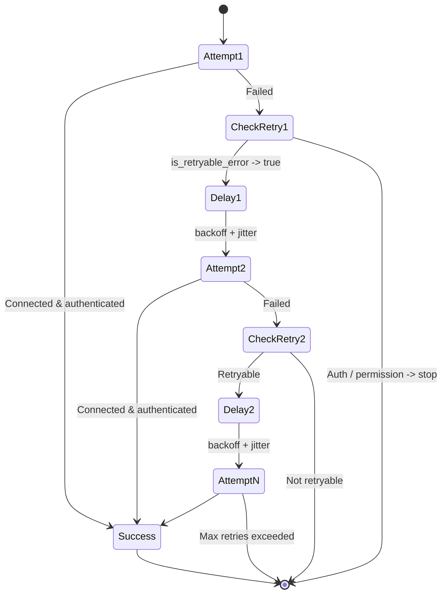
```mermaid
stateDiagram-v2
    [*] --> Attempt1

    Attempt1 --> Success: Connected & authenticated
    Attempt1 --> CheckRetry1: Failed

    CheckRetry1 --> Delay1: is_retryable_error -> true
    CheckRetry1 --> [*]: Auth / permission -> stop

    Delay1 --> Attempt2: backoff + jitter

    Attempt2 --> Success: Connected & authenticated
    Attempt2 --> CheckRetry2: Failed

    CheckRetry2 --> Delay2: Retryable
    CheckRetry2 --> [*]: Not retryable

    Delay2 --> AttemptN: backoff + jitter

    AttemptN --> Success
    AttemptN --> [*]: Max retries exceeded

    Success --> [*]
```

</details>

`error::is_retryable_error` classifies errors by case-insensitive substring match:

- **Non-retryable** — any of the `AUTH_ERRORS` keywords (auth failed, permission denied, publickey, ...).
- **Retryable** — any of the `RETRYABLE_ERRORS` keywords (connection refused, reset, timed out, timeout, network unreachable, no route to host, host is down, temporary failure, resource temporarily unavailable, handshake failed, failed to connect, broken pipe, would block).
- **Unknown, contains "ssh"** — retryable only if the message also mentions "timeout" or "connect".
- **Unknown, no "ssh"** — treated as retryable (conservative default).

Authentication keywords are checked first so ambiguous messages like "Connection timeout during authentication failed" are classified as non-retryable.

## Binary Targets

### HTTP Server (`ssh-mcp`)

<details>
<summary>HTTP server diagram</summary>

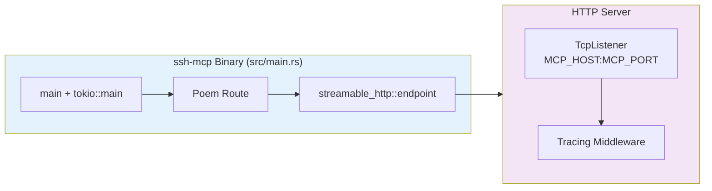
```mermaid
flowchart LR
    subgraph Binary["ssh-mcp Binary (src/main.rs)"]
        Main["main + tokio::main"]
        Route["Poem Route"]
        Streamable["streamable_http::endpoint"]
    end

    subgraph Server["HTTP Server"]
        TCP["TcpListener<br/>MCP_HOST:MCP_PORT"]
        Tracing["Tracing Middleware"]
    end

    Main --> Route
    Route --> Streamable
    Streamable --> Server
    TCP --> Tracing

    style Binary fill:#e3f2fd
    style Server fill:#f3e5f5
```

</details>

**Features:**

- Binds to `MCP_HOST:MCP_PORT` (defaults `0.0.0.0:8000`).
- Uses Poem's `streamable_http` endpoint — supports plain JSON and SSE event streams.
- Includes Poem's `Tracing` middleware.
- Loads `.env` via `dotenvy`.
- Initializes `tracing_subscriber` with `info` as default.

### Stdio Transport (`ssh-mcp-stdio`)

<details>
<summary>Stdio transport diagram</summary>

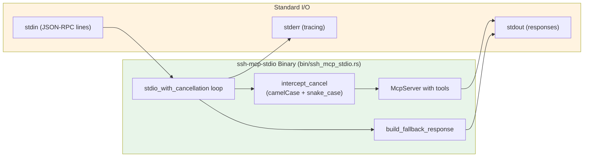
```mermaid
flowchart LR
    subgraph Binary["ssh-mcp-stdio Binary (bin/ssh_mcp_stdio.rs)"]
        Loop["stdio_with_cancellation loop"]
        Interceptor["intercept_cancel<br/>(camelCase + snake_case)"]
        Server["McpServer with tools"]
        Fallback["build_fallback_response"]
    end

    subgraph IO["Standard I/O"]
        STDIN["stdin (JSON-RPC lines)"]
        STDOUT["stdout (responses)"]
        STDERR["stderr (tracing)"]
    end

    STDIN --> Loop
    Loop --> Interceptor
    Interceptor --> Server
    Loop --> Fallback
    Server --> STDOUT
    Fallback --> STDOUT
    Loop --> STDERR

    style Binary fill:#e8f5e9
    style IO fill:#fff3e0
```

</details>

**Features:**

- Intercepts `notifications/cancelled` for both `request_id` (snake_case) and `requestId` (camelCase) — needed because poem-mcpserver 0.3.1 only knows the snake_case form.
- Emits fallback responses (`resources/templates/list` → empty, `resources/read` → "Resource not found", `prompts/get` → "Prompt not found", unknown method → `-32601 Method not found`).
- Serialises every response through a `Mutex<()>` on stdout so cancellation can drop stale responses atomically.
- Spawns a dedicated task per incoming batch so a long `ssh_get_command_output(wait=true)` never blocks subsequent cancel notifications.
- Logs exclusively to stderr.

## Key Dependencies

<details>
<summary>Dependency graph</summary>

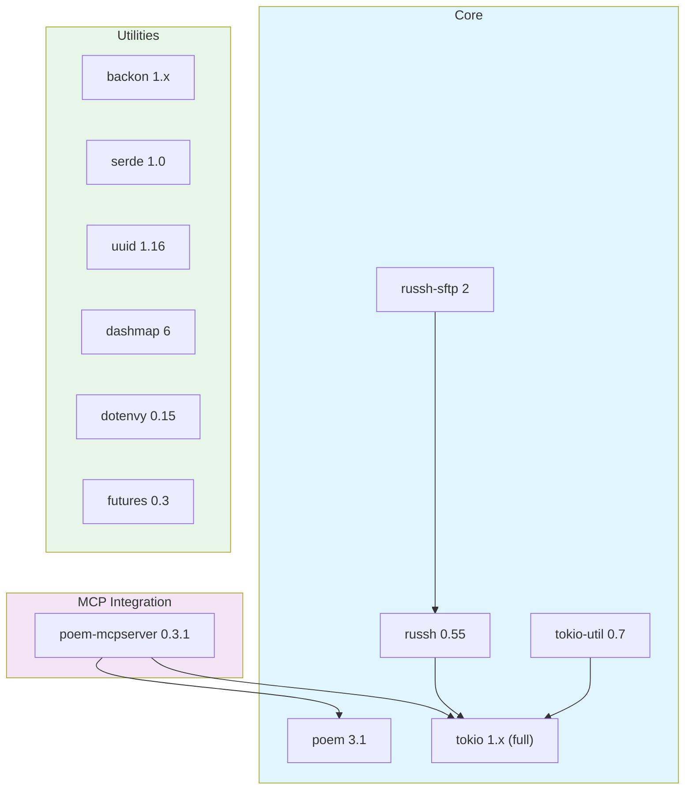
```mermaid
flowchart TB
    subgraph Core["Core"]
        Russh["russh 0.55"]
        RusshSftp["russh-sftp 2"]
        Tokio["tokio 1.x (full)"]
        TokioUtil["tokio-util 0.7"]
        Poem["poem 3.1"]
    end

    subgraph MCP["MCP Integration"]
        PoemMCP["poem-mcpserver 0.3.1"]
    end

    subgraph Utilities["Utilities"]
        Backon["backon 1.x"]
        Serde["serde 1.0"]
        UUID["uuid 1.16"]
        DashMap["dashmap 6"]
        Dotenvy["dotenvy 0.15"]
        Futures["futures 0.3"]
    end

    PoemMCP --> Poem
    PoemMCP --> Tokio
    Russh --> Tokio
    RusshSftp --> Russh
    TokioUtil --> Tokio

    style Core fill:#e1f5fe
    style MCP fill:#f3e5f5
    style Utilities fill:#e8f5e9
```

</details>

| Dependency | Version | Purpose |
|------------|---------|---------|
| `russh` | 0.55 | Async SSH client. |
| `russh-sftp` | 2 | SFTP streaming on top of russh. |
| `async-trait` | 0.1 | Async traits for `AuthStrategy`. |
| `tokio` | 1.x (full) | Async runtime. |
| `tokio-util` | 0.7 | `CancellationToken`. |
| `poem` | 3.1 | HTTP framework used by the `ssh-mcp` binary. |
| `poem-mcpserver` | 0.3.1 | MCP protocol implementation (`streamable_http`, `#[Tools]`). |
| `backon` | 1.x | Exponential backoff + jitter for retries. |
| `serde` + `serde_json` | 1.0 | JSON serialization for transport. |
| `schemars` | 1.0 | JSON schemas for tool parameters (used by `poem-mcpserver`). |
| `uuid` | 1.16 | UUIDv4 identifiers + nonces. |
| `dashmap` | 6 | Lock-free concurrent hashmap. |
| `dotenvy` | 0.15 | `.env` loader. |
| `tracing` + `tracing-subscriber` | 0.1 / 0.3 | Structured logging. |
| `chrono` | 0.4 | RFC3339 timestamps. |
| `futures` | 0.3 | `join_all` for the `ssh_list_sessions` health sweep. |

## Feature Flags

| Feature | Default | Description |
|---------|---------|-------------|
| `port_forward` | Yes | Enables SSH port forwarding (`ssh_forward` tool, `src/mcp/forward.rs`). |

Build without port forwarding:

```bash
cargo build --release --no-default-features
```

When the feature is disabled, `ssh_forward` returns `SSH_FORWARD: ERROR` with `REASON: [FEATURE_DISABLED] port forwarding feature is not enabled`.

## Strict Lint Profile

`src/lib.rs` opts into `clippy::all + pedantic + nursery + cargo` and then `deny`s a long list of correctness-critical lints (`unwrap_used`, `expect_used`, `panic`, `todo`, `unimplemented`, `dbg_macro`, `exit`, `mem_forget`, `infinite_loop`, `print_stdout`, `print_stderr`, `wildcard_enum_match_arm`, `as_conversions`, `clone_on_ref_ptr`, `implicit_clone`, `ref_patterns`, `absolute_paths`, `pub_use`, ...). `clippy.toml` sets `cognitive-complexity-threshold = 25`, `too-many-lines-threshold = 30`, `too-many-arguments-threshold = 7`. Every `#[allow(...)]` carries a `reason = "..."` documented alongside the suppression.

## Test Surface

501 unit tests across the crate (see [`README.md`](../README.md#unit-test-coverage) for per-module breakdown) plus two Python integration scripts:

| Script | Focus |
|--------|-------|
| `scripts/test_http.py` | HTTP transport suite. Exercises every tool, smart-reuse policies, chaos/concurrency scenarios, SFTP round-trip. Ships `parse_mcp_response` to convert markdown back to dict. |
| `scripts/test_stdio.py` | Same suite against the stdio transport — also verifies the cancel notification shim in `bin/ssh_mcp_stdio.rs`. |

Both scripts can be pointed at any reachable SSH server via the `SSH_HOST`, `SSH_USER`, `SSH_KEY_PATH`, `LOCAL_FILE` environment variables and default to `reuse="force_new"` so repeated runs never collide.
