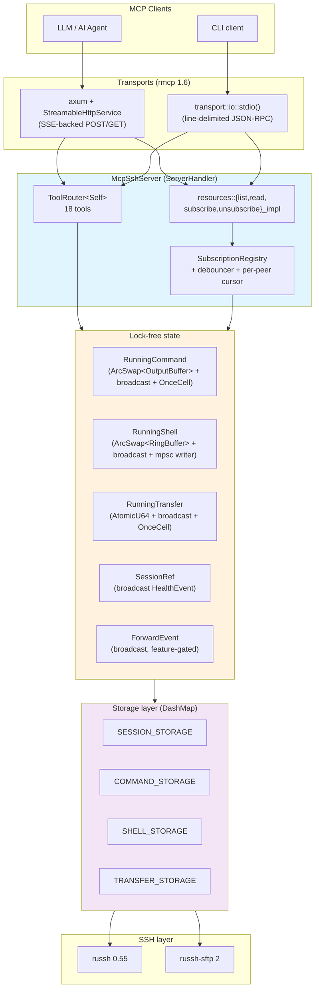
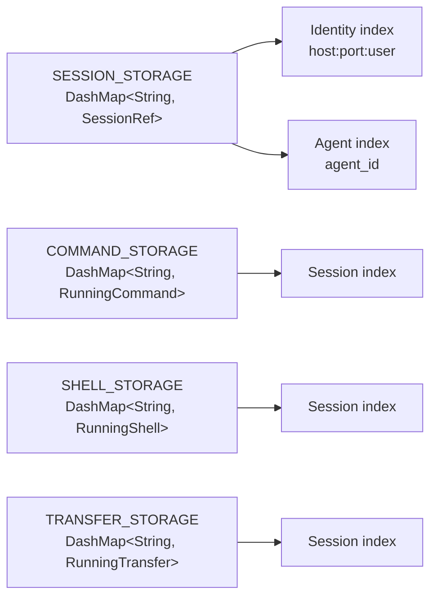
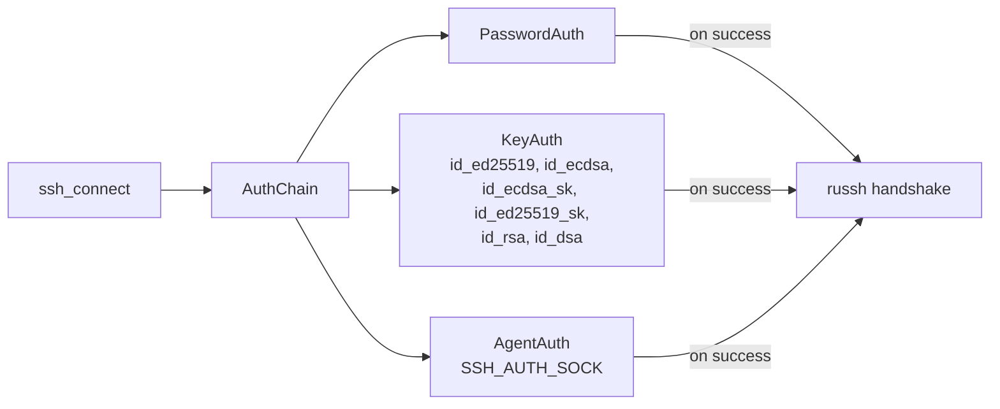

# SSH MCP Architecture (v3.0.0)

This document describes the architecture of the SSH Model Context Protocol (MCP) server. It reflects the **v3.0.0** codebase, where the server is built on top of [rmcp 1.6](https://github.com/modelcontextprotocol/rust-sdk), exposes 18 MCP tools and 5 resource subscribe schemes, and replaces the v2 lock-heavy state with a fully lock-free design (`ArcSwap`, atomics, broadcast channels, `OnceCell`).

[[_TOC_]]

## Overview

ssh-mcp is a Rust crate (edition `2024`) that turns SSH operations into MCP tools. v3.0.0 ships:

- **Server core**: a single `rmcp::ServerHandler` (`McpSshServer`) backed by an `rmcp::ToolRouter<Self>` aggregating the 18 tools.
- **Transports**: two binaries — `ssh-mcp` (axum 0.7 host for rmcp's `StreamableHttpService`) and `ssh-mcp-stdio` (rmcp `transport::io::stdio()`).
- **Resources**: 5 subscribe schemes — `shell://`, `command://`, `transfer://`, `session://`, `forward://` — wired into the rmcp `resources/list`, `resources/read`, `resources/subscribe`, `resources/unsubscribe` lifecycle, with per-resource debouncing and per-peer cursors.
- **Lock-free state**: every long-lived data carrier uses `ArcSwap<RingBuffer>` / `ArcSwap<OutputBuffer>` for snapshots, `tokio::sync::broadcast` for live fan-out, `tokio::sync::mpsc` for single-consumer writers, `AtomicU64` for cursors and timestamps, and `tokio::sync::OnceCell` for write-once terminal fields.
- **Linting**: a multi-layer Clippy baseline (forbid / deny / quality) that bans `await_holding_lock`, `unwrap_used`, `expect_used`, `panic`, `print_*`, and friends — see [Lints baseline](#lints-baseline).

The migration from `poem-mcpserver` to `rmcp` removed approximately 250 LOC of custom cancellation glue (rmcp 1.6 handles `notifications/cancelled` natively), and the new resource subscribe layer enables push-based realtime UX over both transports.

## High-level diagram

```mermaid
flowchart TB
    subgraph Clients["MCP Clients"]
        LLM["LLM / AI Agent"]
        CLI["CLI client"]
    end

    subgraph Transports["Transports (rmcp 1.6)"]
        HTTP["axum + StreamableHttpService<br/>(SSE-backed POST/GET)"]
        STDIO["transport::io::stdio()<br/>(line-delimited JSON-RPC)"]
    end

    subgraph Server["McpSshServer (ServerHandler)"]
        Router["ToolRouter&lt;Self&gt;<br/>18 tools"]
        Resources["resources::{list,read,<br/>subscribe,unsubscribe}_impl"]
        Subscription["SubscriptionRegistry<br/>+ debouncer + per-peer cursor"]
    end

    subgraph State["Lock-free state"]
        Cmd["RunningCommand<br/>(ArcSwap&lt;OutputBuffer&gt; + broadcast + OnceCell)"]
        Sh["RunningShell<br/>(ArcSwap&lt;RingBuffer&gt; + broadcast + mpsc writer)"]
        Tr["RunningTransfer<br/>(AtomicU64 + broadcast + OnceCell)"]
        Sess["SessionRef<br/>(broadcast HealthEvent)"]
        Fwd["ForwardEvent<br/>(broadcast, feature-gated)"]
    end

    subgraph Storage["Storage layer (DashMap)"]
        SessStore["SESSION_STORAGE"]
        CmdStore["COMMAND_STORAGE"]
        ShStore["SHELL_STORAGE"]
        TrStore["TRANSFER_STORAGE"]
    end

    subgraph SSH["SSH layer"]
        Russh["russh 0.55"]
        RusshSftp["russh-sftp 2"]
    end

    LLM --> HTTP
    CLI --> STDIO
    HTTP --> Router
    HTTP --> Resources
    STDIO --> Router
    STDIO --> Resources
    Resources --> Subscription
    Router --> State
    Subscription --> State
    State --> Storage
    Storage --> Russh
    Storage --> RusshSftp

    style Server fill:#e1f5fe
    style State fill:#fff3e0
    style Storage fill:#f3e5f5
```

## Module map

The crate root is `src/`. Library code lives under `src/mcp/`; the binaries under `src/main.rs` and `src/bin/`.

### Server / transports

| File | Role |
|------|------|
| `src/main.rs` | HTTP transport binary (`ssh-mcp`). Boots axum 0.7, mounts rmcp's `StreamableHttpService`, spawns the peer GC task. |
| `src/bin/ssh_mcp_stdio.rs` | Stdio transport binary (`ssh-mcp-stdio`). Calls `McpSshServer::new().serve(stdio())` and the peer GC task. |
| `src/mcp/server.rs` | `McpSshServer` — implements `rmcp::ServerHandler`. Hosts the `#[tool_router]` block with the 18 `#[tool]` entry points and the four `resources/*` overrides. |

### Tools (`src/mcp/tools/`)

| File | Tools owned |
|------|-------------|
| `connection.rs` | `ssh_connect`, `ssh_disconnect`, `ssh_list_sessions`, `ssh_disconnect_agent` |
| `execute.rs` | `ssh_execute`, `ssh_get_command_output`, `ssh_list_commands`, `ssh_cancel_command` |
| `shell.rs` | `ssh_shell_open`, `ssh_shell_write`, `ssh_shell_send_key`, `ssh_shell_read`, `ssh_shell_wait_for`, `ssh_shell_close` |
| `sftp.rs` | `ssh_upload`, `ssh_download`, `ssh_get_transfer_progress` |
| `forward.rs` | `ssh_forward` (feature-gated `port_forward`) |
| `legacy_helpers.rs` | Shared helpers ported from v2's monolithic `commands.rs`. Builds the markdown response strings, runs the per-tool retry loops, and centralises the v3 clamping helpers (`clamp_output_bytes`, `clamp_list_items`). |
| `mod.rs` | Re-exports plus `ReusePolicy` and `CommandStatus` enums (replace v2's `Option<String>` filters). |

### Resources & subscriptions

| File | Role |
|------|------|
| `src/mcp/resources.rs` | URI parser (`parse_resource_uri`), `list_resources_impl`, `read_resource_impl`, `subscribe_impl`, `unsubscribe_impl`. Owns the cursor semantics (`?cursor=auto\|<N>\|0`) and the `_meta` payload builder. |
| `src/mcp/subscription.rs` | `SubscriptionRegistry`, `PeerProgress`, the per-resource debouncer task (waker `Notify` + force-flush + keepalive), `spawn_peer_gc` for closed-peer GC. |

### Lock-free state carriers

| File | Role |
|------|------|
| `src/mcp/async_command.rs` | `RunningCommand` (lock-free): `output_history: Arc<ArcSwap<OutputBuffer>>`, `output_tx: broadcast::Sender<OutputChunk>`, `exit_code: Arc<OnceCell<i32>>`, `error: Arc<OnceCell<String>>`, `status_rx: watch::Receiver<AsyncCommandStatus>`, plus a cancel `CancellationToken`. |
| `src/mcp/shell.rs` | `RunningShell` (lock-free): `history: Arc<ArcSwap<RingBuffer>>`, `output_tx: broadcast::Sender<Bytes>`, `data_notify: Arc<Notify>`, `input_tx: mpsc::Sender<WriteRequest>`, `last_activity_ms: Arc<AtomicU64>`, `max_buffer_size: Arc<AtomicU64>`. Defines `MAX_SHELLS_PER_SESSION = 10` and the writer task contract. |
| `src/mcp/transfer.rs` | `RunningTransfer` (lock-free): `bytes_transferred: Arc<AtomicU64>`, `total_bytes: Arc<AtomicU64>`, `error: Arc<OnceCell<String>>`, `progress_tx: broadcast::Sender<ProgressEvent>`, `data_notify: Arc<Notify>`. Constants: `MAX_TRANSFERS_PER_SESSION = 10`, `CHUNK_SIZE = 32 KiB`. |
| `src/mcp/types.rs` | Internal data carriers (`SessionInfo`, `AsyncCommandInfo`, `ShellInfo`) and the live event enums (`ProgressEvent`, `HealthEvent`, `ForwardEvent`). Each event variant carries a `seq: u64` allocated by the subscription registry. |
| `src/mcp/keys.rs` | `ShellKey` + `KeyModifiers` + `encode()` for semantic keystrokes (xterm-compatible byte sequences). Backs `ssh_shell_send_key`. |

### SSH plumbing

| File | Role |
|------|------|
| `src/mcp/client.rs` | `connect_to_ssh_with_retry`, `execute_ssh_command` (sync + async + async-PTY), `open_pty_shell`, default key discovery, retry loop with `backon`. |
| `src/mcp/sftp.rs` | `open_sftp_session`, `resolve_local_path` (`~` + relative → home), streaming upload/download, `classify_transfer_error`. |
| `src/mcp/forward.rs` | `setup_port_forwarding` — feature-gated under `port_forward`. Bidirectional `tokio::io::copy` over `channel_open_direct_tcpip`. |
| `src/mcp/session.rs` | `SshClientHandler` (russh client callbacks). |
| `src/mcp/error.rs` | `SshError` retryable / non-retryable classifier. |
| `src/mcp/schema.rs` | `uint` JSON-schema helper (avoids `format: "uint"`, which breaks some LLM clients). |

### Storage (`src/mcp/storage/`)

Trait-driven concurrent maps; every implementation uses `DashMap` for shard-locked O(1) inserts / removes.

| File | Role |
|------|------|
| `traits.rs` | `SessionStorage`, `CommandStorage`, `ShellStorage`, `TransferStorage` traits + `SessionRef`, `CommandRef` views. |
| `session.rs` | `DashMapSessionStorage`, identity index, agent index, per-session channel semaphore (`CHANNEL_CONCURRENCY_PER_SESSION = 1`), `health_tx: broadcast::Sender<HealthEvent>`. |
| `command.rs` | `DashMapCommandStorage` with session index and running-only counter. |
| `shell.rs` | `DashMapShellStorage` with session index. |
| `transfer.rs` | `DashMapTransferStorage` with session index. |

### Authentication (`src/mcp/auth/`)

Strategy pattern via `AuthStrategy` and `AuthChain` (fluent builder).

| File | Role |
|------|------|
| `traits.rs` | `AuthStrategy` trait. |
| `password.rs` | Password auth. |
| `key.rs` | Key-file auth (RSA/Ed25519/ECDSA; negotiates `rsa-sha2-256/512` when supported). |
| `agent.rs` | SSH agent auth via `SSH_AUTH_SOCK`. |
| `chain.rs` | `AuthChain` — `.with_password()`, `.with_key()`, `.with_agent()`. |

### Message layer (`src/mcp/message/`)

| File | Role |
|------|------|
| `helpers.rs` | `generate_nonce()` (8-hex), `truncate_utf8_safe_{tail,head}`, `sanitize_value`, `format_bytes_human`, `format_error`, `render_output_block`. |
| `builder.rs` | Per-tool markdown builders (`ConnectOkBuilder`, `ConnectSuggestedBuilder`, `ExecuteStartedBuilder`, `GetCommandOutputBuilder`, `ShellReadBuilder`, `ShellWaitForBuilder`, `TransferProgressBuilder`, `ListSessionsBuilder`, `ListCommandsBuilder`, …). All return `String`; all are `#[must_use]`. |

### Other modules

| File | Role |
|------|------|
| `src/mcp/config.rs` | Parameter / env / default resolution for every tunable, plus the human-readable byte-size parser (`512k`, `10m`, `1g`, `1t`). See [CONFIGURATION.md](./CONFIGURATION.md). |
| `src/mcp/mod.rs` | Module root and feature gating. |
| `src/lib.rs` | Crate root with the strict lint baseline (see [Lints baseline](#lints-baseline)). |

## Lock-free design

v3.0.0 removes every `Mutex` from the long-lived state carriers. Each pattern is a simple primitive composed for a specific concurrency shape.

### `ArcSwap<RingBuffer>` for shell history

`RunningShell.history: Arc<ArcSwap<RingBuffer>>` lets readers (`ssh_shell_read`, `read_resource_impl(shell://)`) load a consistent `Arc<RingBuffer>` without locking. The PTY reader task uses `rcu` to publish atomic updates: `RingBuffer { data: Bytes }` is cheap to clone (Bytes is reference-counted).

When the buffer exceeds `max_buffer_size`, the reader trims from the head inside the same `rcu` closure. Readers that were holding an old snapshot keep working with their copy — they simply observe a slightly older view of the buffer.

### `ArcSwap<OutputBuffer>` for command output

`RunningCommand.output_history: Arc<ArcSwap<OutputBuffer>>` follows the same pattern. `OutputBuffer { stdout: BytesMut, stderr: BytesMut }` is replaced atomically each time the producer appends.

### `broadcast::Sender<T>` for live fan-out

Every long-lived resource exposes a `tokio::sync::broadcast::Sender<T>` so subscribers receive incremental events without polling:

| Carrier | Channel |
|---------|---------|
| `RunningShell` | `output_tx: broadcast::Sender<Bytes>` |
| `RunningCommand` | `output_tx: broadcast::Sender<OutputChunk>` |
| `RunningTransfer` | `progress_tx: broadcast::Sender<ProgressEvent>` |
| `SessionRef` | `health_tx: broadcast::Sender<HealthEvent>` |
| Forward task | `events_tx: broadcast::Sender<ForwardEvent>` (feature-gated) |

Channel capacity is configurable per kind (`SSH_*_BROADCAST_CAP`, see [CONFIGURATION.md](./CONFIGURATION.md#subscribe-layer-new-v3)). When a slow consumer falls behind, broadcast emits `RecvError::Lagged` — the registry can detect and report the gap via `_meta.lagged_since_last_read` (currently reserved for future telemetry).

### `mpsc::Sender<WriteRequest>` for shell input

PTY writes are funnelled through `RunningShell.input_tx: mpsc::Sender<WriteRequest>`. A single dedicated writer task owns the russh channel and processes `WriteRequest::{Data(Bytes), Close}`. This serialises writes without locking the channel and makes back-pressure explicit (the channel's bounded capacity blocks the caller when the writer falls behind).

### `AtomicU64` for cursors, activity, sequences

| Use site | Field |
|----------|-------|
| Per-peer byte cursor | `PeerProgress.byte_cursor` |
| Last sequence seen by a peer | `PeerProgress.last_seq_seen` |
| Per-resource sequence allocator | `SubscriptionRegistry.sequence_counters` |
| Shell last-activity epoch (ms) | `RunningShell.last_activity_ms` |
| Shell buffer cap (tunable) | `RunningShell.max_buffer_size` |
| Transfer counters | `RunningTransfer.bytes_transferred`, `RunningTransfer.total_bytes` |

### `OnceCell<T>` for write-once terminal fields

Terminal values (`exit_code`, `error`) use `tokio::sync::OnceCell<T>` so they can be set exactly once and read concurrently without any lock. v2 used `Mutex<Option<i32>>` / `Mutex<Option<String>>`, which both forced unnecessary serialisation.

### `Notify` for fast wakeups

`Notify` (`shell.data_notify`, `transfer.data_notify`, the per-resource registry waker) is the lock-free single-shot signal used by long-poll fallbacks (`ssh_shell_read.wait`, `ssh_shell_wait_for`) and by the subscription debouncer.

### `DashMap` shard locks (lock-free externally)

Storage layers wrap a `DashMap`. Internally `DashMap` uses fine-grained shard locks; externally callers see lock-free `get`, `insert`, `remove`. Every storage method releases the shard guard before any `await`, satisfying `clippy::await_holding_lock`. Secondary indices (`agent_index`, `session_index`) are also `DashMap`s.

### Sequence diagram: shell read fan-out under concurrent writes

```mermaid
sequenceDiagram
    participant Producer as PTY reader task
    participant History as ArcSwap&lt;RingBuffer&gt;
    participant Broadcast as broadcast::Sender&lt;Bytes&gt;
    participant Notify as Notify (data_notify)
    participant Reg as SubscriptionRegistry
    participant Reader1 as Snapshot reader<br/>(ssh_shell_read)
    participant Sub as Subscriber<br/>(resources/subscribe)

    Producer->>History: rcu(append + head-trim)
    Producer->>Broadcast: send(Bytes)
    Producer->>Notify: notify_waiters()
    Producer->>Reg: poke(Shell, id)

    par Snapshot path
        Reader1->>History: load_full()
        History-->>Reader1: Arc&lt;RingBuffer&gt;
        Reader1->>Reader1: render markdown
    and Subscribe path
        Reg->>Reg: debounce 50 ms
        Reg-->>Sub: notifications/resources/updated
        Sub->>Reg: resources/read?cursor=auto
        Reg->>History: load_full()
        History-->>Reg: Arc&lt;RingBuffer&gt;
        Reg-->>Sub: text + _meta{cursor, last_seq, ...}
    end
```

## Subscription pipeline

The subscribe layer turns producer events into rate-limited `notifications/resources/updated` calls. Subscribers then pull byte deltas via `resources/read?cursor=auto`.

```mermaid
sequenceDiagram
    participant Prod as Producer<br/>(PTY/cmd reader, SFTP, health probe)
    participant Reg as SubscriptionRegistry
    participant Deb as Debouncer task<br/>(per resource)
    participant Peer as rmcp::Peer&lt;RoleServer&gt;
    participant Client as MCP client

    Note over Client,Reg: Subscribe handshake
    Client->>Peer: resources/subscribe shell://abc/output
    Peer->>Reg: subscribe(kind, id, uri, peer_id, peer)
    Reg->>Deb: spawn_debouncer(kind, id) (first subscriber)

    Note over Prod,Deb: Producer path
    Prod->>Reg: next_seq(kind, id) -> u64
    Prod->>Reg: poke(kind, id) (Notify::notify_one)
    loop within 50 ms window
        Prod->>Reg: poke(kind, id)
    end

    Deb->>Deb: tokio::sleep(50 ms)
    Deb->>Reg: snapshot_subscribers(uri)
    Deb-->>Peer: notify_resource_updated(uri)
    Peer-->>Client: notifications/resources/updated

    Note over Client: Pull delta
    Client->>Peer: resources/read shell://abc/output?cursor=auto
    Peer->>Reg: read_resource_impl(...)
    Reg-->>Peer: text + _meta {cursor, buffer_size, last_seq, ...}
    Peer-->>Client: ReadResourceResult

    Note over Deb: Force flush + keepalive
    Deb->>Deb: every force_flush_ms (default 1 s)
    Deb-->>Peer: notify_resource_updated(uri)
    Deb->>Deb: every keepalive_s (default 30 s)
    Deb-->>Peer: notify_resource_updated(uri)
```

### Backpressure features (A + B + D)

| Feature | Scope | Mechanism | Tunable |
|---------|-------|-----------|---------|
| **A. Sequence numbers** | Every event variant (`OutputChunk`, `ProgressEvent`, `HealthEvent`, `ForwardEvent`) | `seq: u64` allocated by `SubscriptionRegistry::next_seq`; mirrored in `_meta.last_seq` so subscribers can detect gaps after a `Lagged` recovery. | — (allocator is global, atomic) |
| **B. Keepalive** | Per resource | Per-debouncer ticker emits one notification every `SSH_NOTIFY_KEEPALIVE_S` even when no fresh chunks arrived. Keeps SSE / stdio frames warm. | `SSH_NOTIFY_KEEPALIVE_S` (default `30`s, range `5..300`) |
| **D. Cumulative chunks** | Per resource | The debouncer collapses every `poke` inside a `SSH_NOTIFY_DEBOUNCE_MS` window into exactly one outbound notification; the actual byte coalescing happens server-side when the client calls `resources/read?cursor=auto`. | `SSH_NOTIFY_DEBOUNCE_MS` (default `50`ms), `SSH_NOTIFY_FORCE_FLUSH_MS` (default `1000`ms) |

**Per-peer cursor**. Each `(peer_id, uri)` pair gets a shared `Arc<PeerProgress>`. Reads with `?cursor=auto` slice the buffer from `PeerProgress.byte_cursor` and advance it after rendering. Reads with `?cursor=<N>` allow explicit recovery (typically `?cursor=0` for a full snapshot after detecting a gap).

**Truncation compensation**. When the producer drops bytes from the head (buffer cap exceeded), `SubscriptionRegistry::compensate_truncation(uri, dropped)` decrements every peer cursor on the same URI by `dropped` (saturating). The next `resources/read` then surfaces the loss via `_meta.truncated_since_last_read`.

**Peer GC**. rmcp 1.6 does not surface a peer-disconnect callback. Both binaries spawn a `spawn_peer_gc(interval, cancel)` task that periodically scans `SubscriptionRegistry` and drops every peer whose `peer.is_transport_closed()` returns `true`. Tunable via `SSH_MCP_PEER_GC_INTERVAL_S` (default `30`s).

## Tool router

`McpSshServer` declares a `ToolRouter<Self>` aggregating 18 `#[tool]` entry points. The router is built once in `McpSshServer::new()` and exposes `tool_router.list_all()` for the rmcp `tools/list` request.

| Domain | Tools | File |
|--------|-------|------|
| Connection | `ssh_connect`, `ssh_disconnect`, `ssh_list_sessions`, `ssh_disconnect_agent` | `tools/connection.rs` |
| Execute | `ssh_execute`, `ssh_get_command_output`, `ssh_list_commands`, `ssh_cancel_command` | `tools/execute.rs` |
| Shell | `ssh_shell_open`, `ssh_shell_write`, `ssh_shell_send_key`, `ssh_shell_read`, `ssh_shell_wait_for`, `ssh_shell_close` | `tools/shell.rs` |
| SFTP | `ssh_upload`, `ssh_download`, `ssh_get_transfer_progress` | `tools/sftp.rs` |
| Network | `ssh_forward` (feature-gated) | `tools/forward.rs` |

See [API.md](./API.md) for full schemas and response semantics.

## Resource schemes

The five subscribe-capable resource schemes follow a uniform shape:

| Scheme | Resource id | Sub-path | Cursor support | MIME type | Producer |
|--------|-------------|----------|----------------|-----------|----------|
| `shell://<shell_id>/output` | `shell_id` | `output` | yes (`auto`, `<N>`, `0`) | `text/plain` | PTY reader task in `RunningShell` |
| `command://<command_id>/output` | `command_id` | `output` | yes | `text/plain` | Async command reader in `RunningCommand` |
| `transfer://<transfer_id>/progress` | `transfer_id` | `progress` | no (point-in-time) | `application/json` | SFTP streaming loop |
| `session://<session_id>/health` | `session_id` | `health` | no (point-in-time) | `application/json` | Health probe in `ssh_list_sessions` and `ssh_connect` reuse |
| `forward://<forward_id>/events` | `forward_id` | `events` | yes | `application/json` | Forward task accept/close events (feature-gated) |

`shell://` and `command://` are byte streams: the cursor is a byte offset into the buffered history. `transfer://` and `session://` are point-in-time snapshots — there is no historical replay, so the cursor is always `0` and `_meta.buffer_size = 0`. `forward://` keeps an event log when storage is wired (currently the registry accepts subscriptions and serves a placeholder snapshot until a dedicated `ForwardStorage` lands; see [Future work](#future-work)).

`_meta` is always populated. Common keys:

| Key | Meaning |
|-----|---------|
| `cursor` | Next cursor value the client should pass on the next read. |
| `buffer_size` | Bytes currently in the history (or `0` for point-in-time resources). |
| `last_seq` | Latest sequence allocated for the resource. |
| `keepalive` | `true` when no fresh bytes / events were available. |
| `truncated_since_last_read` | Bytes the server dropped from the head between this read and the previous one (only when positive). |
| `lagged_since_last_read` | Reserved for broadcast `Lagged` recovery telemetry (currently omitted). |
| `<kind>_status` | Kind-specific status string (`shell_status`, `command_status`, `transfer_status`, `session_status`, `forward_status`). |

## Storage layer

Four DashMap singletons, each instantiated via `LazyLock`:

```mermaid
flowchart LR
    SS[SESSION_STORAGE<br/>DashMap&lt;String, SessionRef&gt;] --> SI[Identity index<br/>host:port:user]
    SS --> AI[Agent index<br/>agent_id]
    CS[COMMAND_STORAGE<br/>DashMap&lt;String, RunningCommand&gt;] --> CI[Session index]
    SH[SHELL_STORAGE<br/>DashMap&lt;String, RunningShell&gt;] --> SHI[Session index]
    TR[TRANSFER_STORAGE<br/>DashMap&lt;String, RunningTransfer&gt;] --> TI[Session index]
```

Secondary indices use `DashMap<K, Vec<String>>` and are mutated atomically alongside the primary. Every public method drops shard guards before any `await` (enforced by `clippy::await_holding_lock`).

## Authentication chain

```mermaid
flowchart LR
    Connect[ssh_connect] --> Chain[AuthChain]
    Chain --> Pwd[PasswordAuth]
    Chain --> Key[KeyAuth<br/>id_ed25519, id_ecdsa,<br/>id_ecdsa_sk, id_ed25519_sk,<br/>id_rsa, id_dsa]
    Chain --> Agent[AgentAuth<br/>SSH_AUTH_SOCK]
    Pwd -->|on success| Russh[russh handshake]
    Key -->|on success| Russh
    Agent -->|on success| Russh
```

The chain is assembled in `client::build_auth_chain`:

1. `PasswordAuth` (only when `password` is provided).
2. `KeyAuth` for each key file — `key_path` when explicit, otherwise each default OpenSSH file found in `~/.ssh/`.
3. `AgentAuth` (always appended).

`KeyAuth` queries `best_supported_rsa_hash()` per identity and wraps the key in `PrivateKeyWithHashAlg` so RSA keys negotiate `rsa-sha2-256` / `rsa-sha2-512` whenever supported.

## Lints baseline

The crate root in `src/lib.rs` activates the strict baseline declared in `Cargo.toml` `[lints.clippy]`:

### Layer A — forbid (cannot be downgraded)

`unwrap_used`, `expect_used`, `panic`, `todo`, `unimplemented`, `dbg_macro`, `exit`, `mem_forget`, `infinite_loop`, `print_stdout`, `print_stderr`.

### Layer B — deny (group-wide)

`clippy::all`, `clippy::pedantic`, `clippy::nursery`, `clippy::cargo`. The only allowed exception is `multiple_crate_versions` (transitive deps from russh / rmcp / poem).

### Layer C — quality denies

| Lint | Rationale |
|------|-----------|
| `wildcard_enum_match_arm` | Force exhaustive matching so new enum variants surface in CI. |
| `as_conversions` | Require explicit `try_from` / `From` (no silent integer cast). |
| `clone_on_ref_ptr` | Use `Arc::clone(&x)` / `Rc::clone(&x)` over `x.clone()` for clarity. |
| `await_holding_lock` | Drop shard guards before any `await`. **Critical to v3 lock-free guarantees.** |
| `await_holding_refcell_ref` | Same intent as above for `RefCell`. |
| `significant_drop_in_scrutinee` / `significant_drop_tightening` | Avoid implicit lock holds across `match` / `select!`. |
| `mutex_atomic` / `mutex_integer` | Reach for atomics over `Mutex` for trivial state. |
| `pub_use`, `absolute_paths`, `allow_attributes_without_reason` | Stylistic & traceability hygiene. |

Every `#[allow(...)]` in the codebase carries a `reason = "..."`. See [LOCKS.md](./LOCKS.md) (next iteration) for the await-holding-lock contract.

### `[lints.rust]`

`unsafe_code = "deny"` (kept at `deny` rather than `forbid` so test modules can opt-in via `#[allow(unsafe_code, reason = "...")]` for env-var manipulation). Production paths remain unsafe-free.

## Future work

- **`notifications/resources/list_changed`** wiring through every tool entry point that creates / destroys a resource (capability is already advertised in `get_info()`; the `Notify` plumbing lands in a follow-up).
- **`lagged_since_last_read` telemetry**: detect broadcast `RecvError::Lagged` in the registry, populate `_meta.lagged_since_last_read`, and let clients trigger an explicit `?cursor=0` snapshot recovery.
- **Per-subscriber dedicated `mpsc` channel**: replace the shared `broadcast::Sender` fan-out so a slow subscriber cannot pressure the producer; the producer would then push into a per-subscriber bounded queue.
- **`ForwardStorage`**: dedicated DashMap singleton + secondary indices so `forward://` resources become fully enumerable in `resources/list` (currently the registry serves a placeholder snapshot).
- **Lints follow-up**: re-enable `dead_code`, `unused_variables`, `unused_qualifications`, `trivial_numeric_casts`, `trivial_casts`, `let_underscore_drop` once the post-tools-migration rebuild stabilises (see TODO comment in `Cargo.toml [lints.rust]`).
