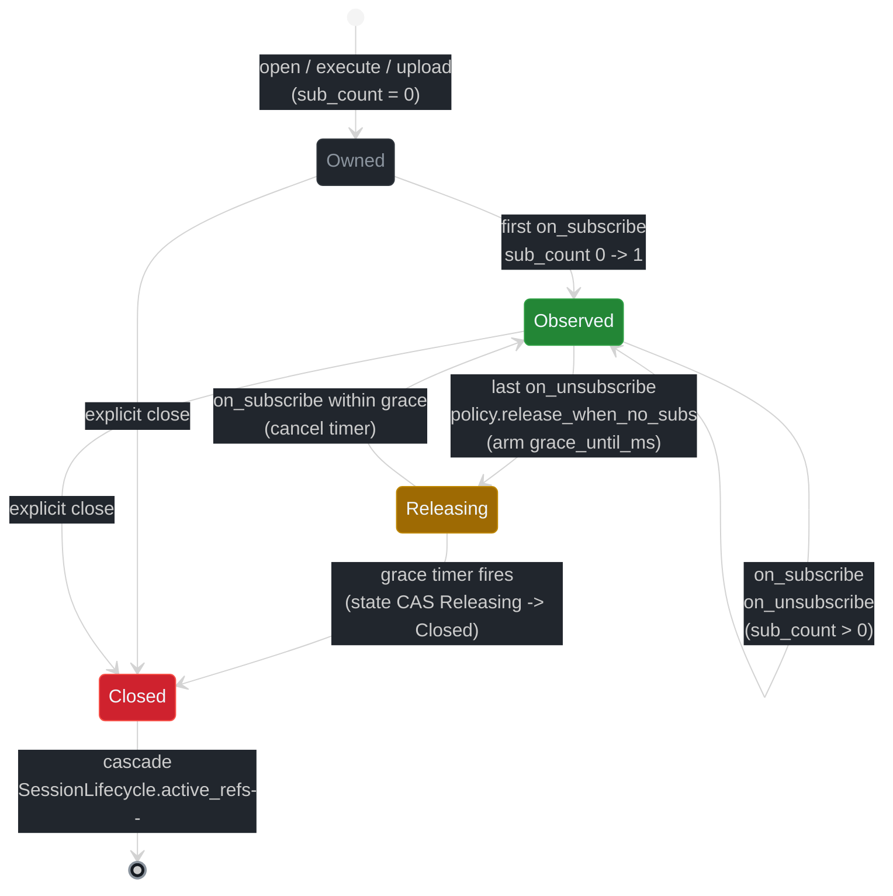
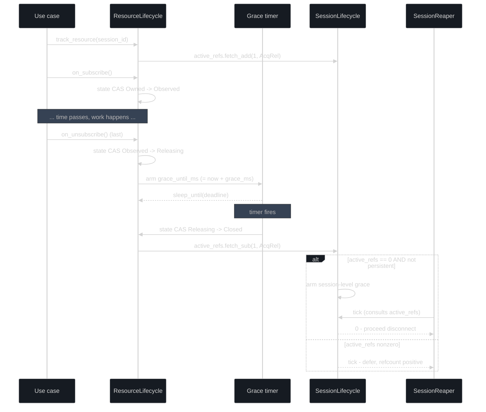
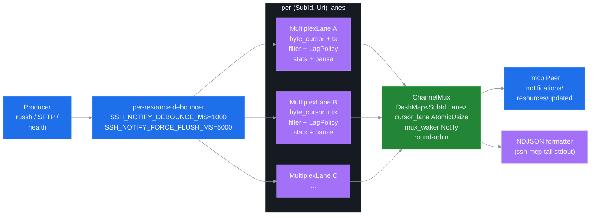
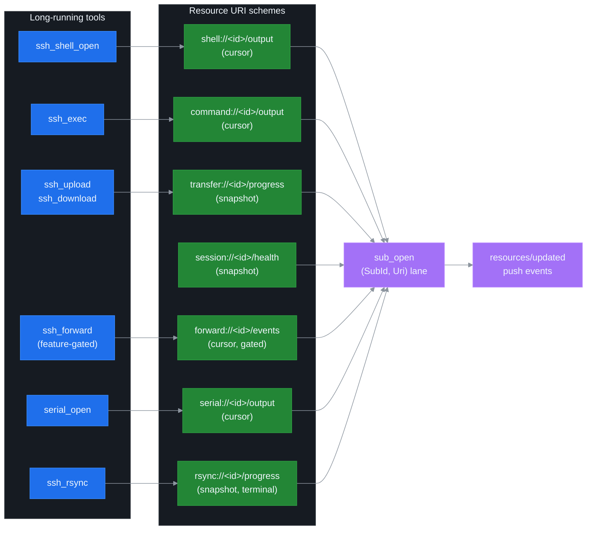
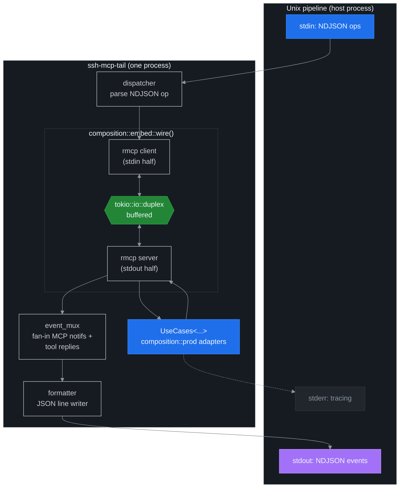
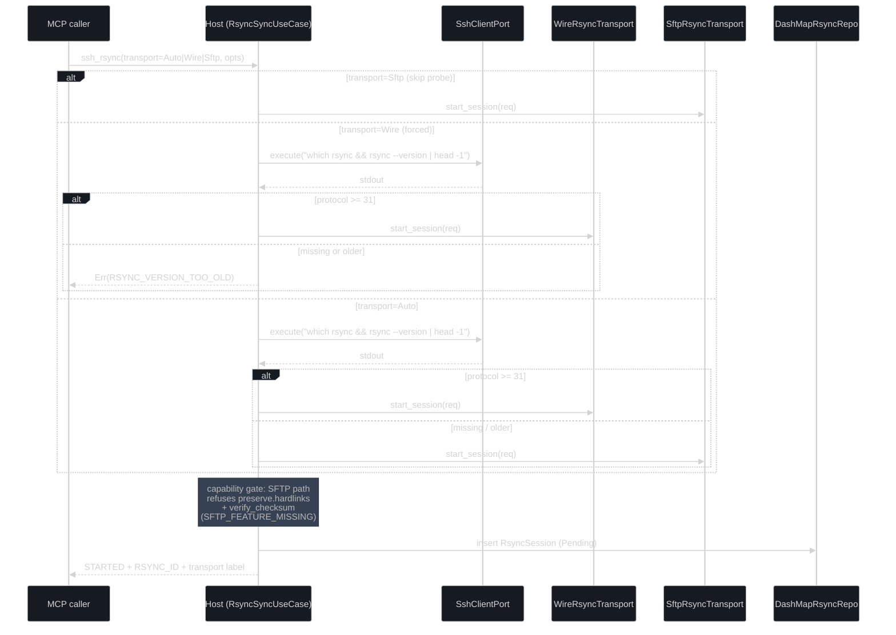
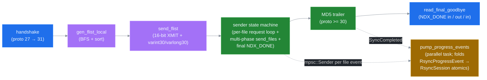
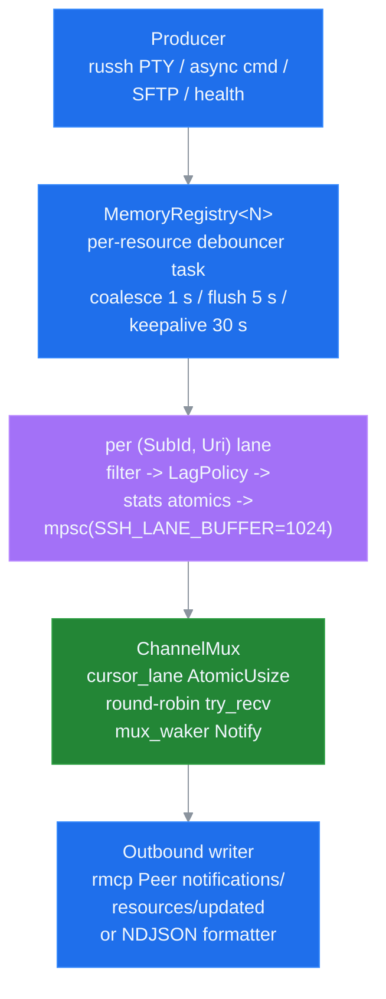

# SSH MCP Architecture (v7.0 — rsync hybrid transport on subscribe-first hexagonal)

Architecture of the SSH Model Context Protocol (MCP) server on `master` (v7.0.0). The hexagonal (Ports and Adapters) layout from v4.1 is preserved — same six top-level layers, same dependency rules, same lock-free invariants — with seven layered deltas stacked on top: **lifecycle binding** ([ADR 0003](./adr/0003-lifecycle-binding.md), Phase 1 — merged), **channel mux + sub_id** ([ADR 0004](./adr/0004-channel-mux-fairness.md), Phase 2 — merged), **LLM UX overhaul** ([ADR 0005](./adr/0005-llm-ux-priorities.md), Phase 3 — merged), the **NDJSON daemon** ([ADR 0008](./adr/0008-ndjson-daemon-protocol.md), Phase 4 — merged), the **serial transport** ([ADR 0009](./adr/0009-serial-transport.md), v5.2 — merged), the **SFTP resume + verify** primitive ([ADR 0010](./adr/0010-sftp-resume.md), v6.1 — merged), and the **rsync hybrid transport** ([ADR 0011](./adr/0011-rsync-hybrid-transport.md), v7.0 — merged). The text channel stays byte-stable since v3 on the 21 carry-over tools; v5 adds 9 net-new subscription tools, the v5.2 release adds 6 serial tools, v6.0 splits the catalogue across the `ssh_*` / `sub_*` / `serial_*` eixos, and v7.0 adds 3 rsync tools (39 tools / 38 without `port_forward`).

Version trail (one line each):

- **v4.0 / v4.1** — original hexagonal restructuring; `src/mcp/` deleted; `async-trait` dropped. See [ADR 0002](./adr/0002-adopt-hexagonal-architecture.md).
- **v4.5 / v4.6 / v4.7 / v4.8** — LLM UX foundation (`PeerId`, `_meta` envelope, granular wire codes, `Implementation` identity, `ToolAnnotations`, `NEXT:` / `HINT:` lines, JSON Schema defaults, `Cost:` hints, `AGENT_ID:` rename), MCP inter-tool conversation surface (`structured_content`, `resources/templates/list`, `notifications/progress`, prompts catalog, idempotency cache, NOT_FOUND closest-match), full `output_schema` coverage. Tool catalogue grew 18 → 21.
- **v5.0** — subscribe-first refresh. See ADRs [0003](./adr/0003-lifecycle-binding.md), [0004](./adr/0004-channel-mux-fairness.md), [0005](./adr/0005-llm-ux-priorities.md), [0006](./adr/0006-backpressure-policies.md), [0007](./adr/0007-error-taxonomy.md), [0008](./adr/0008-ndjson-daemon-protocol.md). 9 net-new MCP tools, `ssh-mcp-tail` daemon binary, MSRV bumped to Rust 1.95.
- **v5.2** — native serial / UART / TTY / COM transport. See [ADR 0009](./adr/0009-serial-transport.md). 6 net-new tools, `serial://` push lane.
- **v6.0** — three-axis tool catalogue rename (`ssh_*` / `sub_*` / `serial_*`); wire-additive on tool name strings only.
- **v6.1** — SFTP resume + verify on `ssh_upload` / `ssh_download`. See [ADR 0010](./adr/0010-sftp-resume.md). Adds `RESUME_OVERSHOOT` / `RESUME_MISMATCH` codes (40-code taxonomy).
- **v7.0** — rsync hybrid transport. See [ADR 0011](./adr/0011-rsync-hybrid-transport.md). 3 net-new tools (`ssh_rsync` / `ssh_rsync_cancel` / `ssh_rsync_stats`), `rsync://` push lane, `WireRsyncTransport` (port of OpenBSD `openrsync`, byte-identical against `rsync 3.2.7`) + `SftpRsyncTransport` (universal SFTP fallback). The `transport` enum collapsed back to `Auto | Wire | Sftp` after the v7.0.0-alpha.2 architectural retrenchment retracted the deployed-agent path; workspace returned to a single package. Adds `RSYNC_NOT_FOUND` / `RSYNC_VERSION_TOO_OLD` / `RSYNC_PROTOCOL_ERROR` / `RSYNC_FILE_LIST_TOO_LARGE` / `RSYNC_PARTIAL_TRANSFER` / `SFTP_FEATURE_MISSING` codes (46-code taxonomy).

[[_TOC_]]

## Hexagonal layer map


```mermaid
%%{init: {'theme':'dark','themeVariables':{'primaryColor':'#1f6feb','primaryTextColor':'#f0f6fc','primaryBorderColor':'#388bfd','lineColor':'#8b949e','secondaryColor':'#161b22','tertiaryColor':'#21262d','background':'#0d1117','mainBkg':'#161b22','secondBkg':'#21262d','tertiaryBkg':'#0d1117','nodeTextColor':'#f0f6fc','edgeLabelBackground':'#21262d','clusterBkg':'#161b22','clusterBorder':'#30363d','titleColor':'#f0f6fc'}}}%%
flowchart TB
    subgraph BIN["bin — entry points"]
        HTTP["src/main.rs"]
        STDIO["src/bin/ssh_mcp_stdio.rs"]
        TAIL["src/bin/ssh_mcp_tail.rs"]
    end
    subgraph COMP["composition — wiring root"]
        PROD["prod.rs"]
        EMB["embed.rs"]
        FIX["fixtures.rs"]
    end
    subgraph EMBEDLAYER["embed — daemon transport"]
        DUPLEX["duplex_transport.rs"]
        DISP["dispatcher.rs"]
        EVMUX["event_mux.rs"]
        FMT["formatter.rs"]
    end
    subgraph INFRA["infra/mcp — inbound MCP"]
        SERVER["server.rs"]
        TR["tool_router.rs<br/>39 #[tool] fns"]
        RES["resource_handlers.rs"]
        PROMPTS["prompts.rs"]
        RESULTS["results.rs"]
        ERR["error_detail.rs"]
    end
    subgraph APP["application — use cases"]
        UCONN["connect_session<br/>disconnect_*"]
        UEXE["execute_command<br/>get_command_output"]
        USHELL["open_shell<br/>read_shell"]
        USFTP["upload_file<br/>download_file"]
        URES["subscribe_resource<br/>unsubscribe_resource<br/>subscription_admin"]
        URSYNC["rsync_sync<br/>(v7.0)"]
    end
    subgraph PORTS["ports — trait skeletons"]
        SSHP["ssh_client / sftp_client"]
        REGP["subscriber_registry"]
        LIFEP["lifecycle_policy<br/>(Phase 1)"]
        MUXP["channel_mux<br/>(Phase 2)"]
        LANEP["subscriber_lane<br/>(Phase 2)"]
    end
    subgraph ADAPT["adapters — concrete impls"]
        RUSSH["ssh/russh_adapter"]
        SFTP["sftp/russh_sftp_adapter"]
        REPO["repo/dashmap"]
        MEMREG["subscription/memory_registry"]
        LIFE["lifecycle/<br/>refcount + grace_timer +<br/>cascade<br/>(Phase 1)"]
        LANE["subscription/<br/>subscriber_lane +<br/>channel_mux + filter +<br/>replay<br/>(Phase 2)"]
        NOTIF["notifier/rmcp_*"]
    end
    subgraph DOMAIN["domain — pure"]
        ENT["entities + ids +<br/>events + lifecycle.rs +<br/>subscription.rs"]
    end

    BIN --> COMP
    COMP --> EMBEDLAYER
    COMP --> INFRA
    INFRA --> APP
    APP --> PORTS
    PORTS -.-> ADAPT
    ADAPT --> DOMAIN
    APP --> DOMAIN
    PORTS --> DOMAIN

    style BIN fill:#161b22,color:#f0f6fc,stroke:#30363d
    style COMP fill:#161b22,color:#f0f6fc,stroke:#30363d
    style EMBEDLAYER fill:#161b22,color:#f0f6fc,stroke:#30363d
    style INFRA fill:#161b22,color:#f0f6fc,stroke:#30363d
    style APP fill:#161b22,color:#f0f6fc,stroke:#30363d
    style PORTS fill:#161b22,color:#f0f6fc,stroke:#30363d
    style ADAPT fill:#161b22,color:#f0f6fc,stroke:#30363d
    style DOMAIN fill:#161b22,color:#f0f6fc,stroke:#30363d
    style HTTP fill:#1f6feb,color:#f0f6fc,stroke:#388bfd
    style STDIO fill:#1f6feb,color:#f0f6fc,stroke:#388bfd
    style TAIL fill:#a371f7,color:#f0f6fc,stroke:#bc8cff
    style LIFE fill:#238636,color:#f0f6fc,stroke:#2ea043
    style LANE fill:#a371f7,color:#f0f6fc,stroke:#bc8cff
    style LIFEP fill:#238636,color:#f0f6fc,stroke:#2ea043
    style MUXP fill:#a371f7,color:#f0f6fc,stroke:#bc8cff
    style LANEP fill:#a371f7,color:#f0f6fc,stroke:#bc8cff
```

## Layer rules

| Layer | What lives here | Allowed deps | Forbidden deps |
|-------|-----------------|--------------|----------------|
| `domain` | Entities, value objects, errors, live event variants. v5: `lifecycle.rs`, `subscription.rs`. | `std`, `serde`, `serde_json`, `chrono`, `thiserror`, `schemars`, `bytes` | `tokio`, `russh`, `rmcp`, `axum`, `dashmap` |
| `ports` | Trait skeletons (sync + async via `#[trait_variant::make(Port: Send)]`). v5: `lifecycle_policy.rs`, `channel_mux.rs`, `subscriber_lane.rs`. | `domain`, `bytes`, `chrono`, `std`, `trait_variant` | `tokio`, `russh`, `rmcp`, `axum`, `dashmap` |
| `application` | Use cases (`*UseCase<Ports...>`) — one struct + DTO per business operation. | `domain`, `ports`, `tokio` (for `select!` / `spawn`) | `russh`, `rmcp`, `axum`, `dashmap` |
| `adapters` | Concrete implementations of every port. v5: `lifecycle/`, `subscription/{subscriber_lane,channel_mux,filter,replay}`. | All runtime crates (`tokio`, `russh`, `russh_sftp`, `dashmap`, `arc_swap`) | `rmcp` (only `notifier/rmcp_*`), `axum` |
| `infra` | Inbound MCP transport (`#[tool_router]`, `ServerHandler`, render, args, helpers). v5: `error_detail.rs`. | `rmcp`, `application`, `domain`, `adapters::notifier::rmcp_peer` | `russh`, `russh_sftp`, `dashmap` |
| `composition` | Root wiring — pins concrete adapters via `type ConcreteX = …`, builds the `UseCases` container. v5: `embed.rs` (Phase 4 — merged). | All adapters + `infra::mcp` + `application` | — (it is the leaf) |

### Static dispatch + AFIT (no async-trait, no dyn on hot path)

Async ports use the `trait-variant` macro pattern. The dyn-safe slices (`LaneAdmin`, async slice on `LifecyclePolicyAsync`, …) live alongside the AFIT trait surface for cold-path admin operations only. Use cases stay generic over the static-dispatch port and never over `dyn Trait`. The composition root pins one concrete adapter per port. Wiring errors surface at `cargo build`, not at runtime.

## Module map

The crate root is `src/`. Library code lives under `src/{domain,ports,application,adapters,infra,composition}/`. The three binaries are thin shells that delegate to `composition::prod` (and, for the daemon, `composition::embed`).

### Binary entry points

| File | Role |
|------|------|
| `src/main.rs` | HTTP transport (`ssh-mcp`). Calls `composition::prod::run_http()`. Default bind `0.0.0.0:8000`, path `/`. |
| `src/bin/ssh_mcp_stdio.rs` | Stdio transport (`ssh-mcp-stdio`). Calls `composition::prod::run_stdio()`. Logs to stderr via `RUST_LOG`. |
| `src/bin/ssh_mcp_tail.rs` | NDJSON daemon (`ssh-mcp-tail`). Embeds rmcp client + server pair across `tokio::io::duplex` via `composition::embed::wire()`. |

All three spawn the peer-GC task on `SSH_MCP_PEER_GC_INTERVAL_S` (default 30 s). rmcp 1.6 does not expose a peer-disconnect callback, so the periodic scan is the only way to reclaim subscription state for closed transports.

### `src/domain/` — pure layer

| File | Role |
|------|------|
| `mod.rs` | Re-export tree. **MUST NOT** import `tokio`, `russh`, `rmcp`, `axum`, or `dashmap`. |
| `auth.rs` | `AuthError` variant for credential rejection. |
| `command.rs` | `CommandEntity`, `CommandRequest`, `CommandStatus`. |
| `error.rs` | `DomainError` (top-level) — variants per failure class plus v5 additions (`ResourceGone`, `LifecycleStateConflict`, `SessionRefcountUnderflow`, `SubNotFound`, `SubMaxPerUriExceeded`, `SubMaxTotalExceeded`, `LaneBufferFull`, `LagBackpressure`, …). |
| `events.rs` | Live event enums shipped by the runtime ports — `OutputChunk`, `ProgressEvent`, `HealthEvent`, `ForwardEvent`. Every variant carries `seq: u64` allocated by the subscription registry. |
| `forward.rs` | `ForwardEntity`. |
| `identity.rs` | `Address`, `Credentials`. |
| `ids.rs` | Newtype ids — `SessionId`, `CommandId`, `ShellId`, `TransferId`, `ForwardId`, `AgentId`, `PeerId`. |
| `keys.rs` | `ShellKey`, `KeyModifiers`, semantic keystroke encoder. |
| `lifecycle.rs` (v5) | `LifecycleState` enum (`Owned | Observed | Releasing | Closed`), `LifecyclePolicy`, `LifecycleSnapshot`, `SessionPolicy`, `DEFAULT_GRACE_MS`. Pure data; the atomic state machine lives in the adapter. |
| `policy.rs` | `CommandStatusFilter`, `MaxItemsPolicy`, etc. |
| `ringbuffer.rs` | `RingBuffer` value type. |
| `session.rs` | `SessionEntity`. |
| `shell.rs` | `ShellEntity`, `ShellTerminal`. |
| `subscription.rs` (v5) | `SubId` (UUIDv7 wrapper), `LagPolicy` enum (`BlockSlow | DropOldest | DropNewest | Snapshot`), `LogLevel`, `FilterRule`, `SubscriptionLifetime`, `SubscriberStats` (8 atomics). |
| `transfer.rs` | `TransferEntity`, `TransferStatus`, `TransferDirection`. |

### `src/ports/` — trait skeletons

| File | Role |
|------|------|
| `ssh_client.rs` | `SshClientPort` — connect, disconnect, execute (sync + async), open/write/close shell, health check. |
| `sftp_client.rs` | `SftpClientPort` — upload, download, cancel. |
| `session_repo.rs` | `SessionRepository`. |
| `command_repo.rs` | `CommandRepository`. |
| `shell_repo.rs` | `ShellRepository`. |
| `transfer_repo.rs` | `TransferRepository`. |
| `forward_repo.rs` | `ForwardRepository` (feature-gated). |
| `notifier.rs` | `NotifierPort` + `PeerHandle`. |
| `output_stream.rs` | `OutputStreamPort` — `snapshot_command`, `snapshot_shell`. |
| `subscriber_registry.rs` | `SubscriberRegistryPort` (sync) + `SubscriberRegistryAsync`. |
| `lifecycle_policy.rs` (v5) | `LifecyclePolicyPort` (sync slice — `track_resource`, `on_subscribe`, `on_unsubscribe`, `force_close`, `snapshot`) + `LifecyclePolicyAsync` (`arm_grace_timer`, `cancel_grace_timer`). |
| `channel_mux.rs` (v5) | `ChannelMuxPort` — `active_lane_count`, `aggregate_stats`. Drives the round-robin drainer. |
| `subscriber_lane.rs` (v5) | `SubscriberLanePort` (sync — `stats_snapshot`, `current_cursor`, `advance_cursor`, `list_subs`) + `SubscriberLaneAsync` (`open_lane`, `close_lane`, `pause_lane`, `resume_lane`, `set_filter`, `replay_from_cursor`) + `LaneAdmin` (dyn-safe shim for cold-path lane open/close). |
| `auth_strategy.rs` | `AuthStrategyPort`. |
| `clock.rs` | `ClockPort`. |
| `config.rs` | `ConfigPort` (~33 typed accessors in v5). |
| `id_generator.rs` | `IdGeneratorPort`. |

### `src/application/` — use cases

25 files (excl. `mod.rs`), one per business operation or admin slice. Each is a `*UseCase<Ports...>` struct with a single `pub async fn execute(&self, req: Request) -> Result<Outcome, DomainError>` entry point. Phase 1 wired the lifecycle layer into `open_shell`, `execute_command`, `upload_file`, `download_file` (commit `525b795`); Phase 2 wired the subscriber lane into `subscribe_resource` and `unsubscribe_resource` (commit `30fbdd9`). Phase 3 added the consolidated `subscription_admin` slice that powers all 9 net-new MCP tools (`sub_open`, `sub_close`, `sub_pause`, `sub_resume`, `sub_filter`, `sub_replay`, `sub_list`, `sub_stats`, `sub_stats_all`). The serial transport (ADR 0009) is wired through `infra::mcp` directly against the in-process `SerialPortRegistry` adapter. v7.0 adds `rsync_sync.rs` (`RsyncSyncUseCase`) which drives `ssh_rsync` / `ssh_rsync_cancel` / `ssh_rsync_stats` over both `WireRsyncTransport` and `SftpRsyncTransport` ([Phase 5 below](#phase-5--rsync-hybrid-transport-v70-final)).

| Domain | Use cases |
|--------|-----------|
| Connection | `connect_session`, `disconnect_session`, `list_sessions`, `disconnect_agent` |
| Commands | `execute_command`, `get_command_output`, `list_commands`, `cancel_command` |
| Shell | `open_shell`, `write_shell`, `send_key`, `read_shell`, `wait_for_pattern`, `close_shell` |
| SFTP | `upload_file`, `download_file`, `get_transfer_progress` |
| Network | `forward_port` (feature-gated `port_forward`) |
| Resources | `list_resources`, `read_resource`, `subscribe_resource`, `unsubscribe_resource` |
| Background | `peer_gc` |

### `src/adapters/` — concrete adapters

| Adapter | Port(s) | File |
|---------|---------|------|
| `RusshAdapter` | `SshClientPort` | `ssh/russh_adapter.rs` |
| `RusshSftpAdapter` | `SftpClientPort` | `sftp/russh_sftp_adapter.rs` |
| `DashMap*Repo` | `*Repository` (5) | `repo/dashmap/{session,command,shell,transfer,forward}.rs` |
| `RmcpNotifier` + `RmcpPeerHandle` + `PeerTable` | `NotifierPort` + `PeerHandle` | `notifier/{rmcp_adapter,rmcp_peer}.rs` |
| `MemoryRegistry<N>` | `SubscriberRegistryPort` + `SubscriberRegistryAsync` | `subscription/memory_registry.rs` |
| `RefcountedLifecycleAdapter` (v5) | `LifecyclePolicyPort` + async slice | `lifecycle/{mod,refcount,grace_timer,cascade}.rs` |
| `SubscriberLane` (v5) | `SubscriberLanePort` + async slice | `subscription/subscriber_lane.rs` |
| `ChannelMux` (v5) | `ChannelMuxPort` | `subscription/channel_mux.rs` |
| `FilterPipeline` (v5) | internal to lane | `subscription/filter.rs` |
| `Replay` helper (v5) | internal to lane | `subscription/replay.rs` |
| `RusshOutputAdapter` | `OutputStreamPort` | `output_stream/russh_output.rs` |
| `AuthChainAdapter` | `AuthStrategyPort` | `auth/{password,key,agent,chain}.rs` |
| `SystemClock` (+ `FakeClock` under `#[cfg(any(test, feature = "test-fixtures"))]`) | `ClockPort` | `clock/{system,fake}.rs` |
| `EnvConfig` (+ `MemoryConfig`) | `ConfigPort` | `config/{env,memory}.rs` |
| `UuidIds` (+ `DeterministicIds`) | `IdGeneratorPort` | `id_generator/{uuid,deterministic}.rs` |

### `src/infra/mcp/` — inbound MCP transport

| File | Role |
|------|------|
| `server.rs` | `McpSshServer<UC>` — generic over the `UseCases<…>` container. |
| `tool_router.rs` | `#[tool_router]` impl populating the 24 `ssh_*` + 9 `sub_*` + 6 `serial_*` = 39 `#[tool]` entry points (38 without `port_forward`). The `ssh_*` family adds `ssh_rsync` / `ssh_rsync_cancel` / `ssh_rsync_stats` in v7.0. |
| `results.rs` | Typed Rust output structs for every tool's `structured_content` payload. |
| `prompts.rs` | `prompts/list` + `prompts/get` catalog — 10 workflows in v5 (5 carry-overs + 5 push-first). See [LLM_GUIDE.md → Prompts catalogue](./LLM_GUIDE.md#prompts-catalogue). |
| `idempotency.rs` | DashMap-backed LRU cache — dedup mutating tool calls by `_meta.idempotency_key`. |
| `progress.rs` | `notifications/progress` emitter — best-effort, mid-flight on long async waits. |
| `suggestions.rs` | NOT_FOUND closest-match picker (Levenshtein top-3, lock-free). |
| `error_detail.rs` (v5) | Code-by-code `DETAIL:` line renderer aligned with [ADR 0007](./adr/0007-error-taxonomy.md) and [LLM_GUIDE.md → Error handbook](./LLM_GUIDE.md#error-handbook). |
| `resource_templates.rs` | `resources/templates/list` static catalogue (4 / 5 RFC 6570 URI shapes). |
| `resource_handlers.rs` | Adapters between rmcp `resources/{list,read,subscribe,unsubscribe}` payloads and the matching `*_resource` use cases. |
| `peer_handle.rs` | Type aliases (`PeerTable`, `RmcpPeerHandle`). |
| `args/` | One module per tool domain (`connection`, `execute`, `shell`, `sftp`, `forward`; v5 adds `subscription`). |
| `render/` | One module per tool domain rendering the use case outcome into the markdown body. |
| `helpers/` | Shared primitives — `error::format_error`, `nonce::generate_nonce`, `output::render_output_block`, plus UTF-8 safe truncation. |

### `src/composition/` — root wiring

| File | Role |
|------|------|
| `mod.rs` | The generic `UseCases<…>` container (compiled twice via `#[cfg]` — `port_forward` toggle). |
| `prod.rs` | Production wiring — pins concrete adapters via `type ConcreteX = …`; exposes `build_use_cases()`, `build_server()`, `run_http()`, `run_stdio()`. v5 commit `4730066` injected `SubscriberLane` + `ChannelMux` adapters. |
| `embed.rs` | In-process duplex transport for `ssh-mcp-tail`. Spawns the rmcp server task; the daemon's main loop owns the rmcp client side. |
| `fixtures.rs` | Deterministic adapters for tests (gated by `test-fixtures`). |
| `id_lister.rs` | Helper consumed by the closest-match suggestion path. |
| `status_sinks.rs` | Adapter wiring for the v4.8.1 transfer progress watcher. |

### Adapter-internal modules

Each runtime adapter owns its private internals under `internal/` (the v4.1 deep-decouple closed `src/mcp/`).

| File | Owner adapter | Role |
|------|---------------|------|
| `src/adapters/ssh/internal/{client,session,async_command,shell,types,error}.rs` | SSH | russh wiring — `connect_to_ssh_with_retry`, `execute_ssh_command`, `open_pty_shell`, `RunningCommand`, `RunningShell` + `RingBuffer`, retry classification. |
| `src/adapters/ssh/internal/auth/{traits,password,key,agent,chain}.rs` | SSH | Internal auth chain (PasswordAuth -> KeyAuth -> AgentAuth) statically dispatched through an enum (no `async-trait`). |
| `src/adapters/sftp/internal/{sftp,transfer,types}.rs` | SFTP | Streaming SFTP session helpers; `RunningTransfer` lock-free state. |
| `src/adapters/config/internal/mod.rs` | Config | Env-var resolvers (40 tunables in v5/v6). |
| `src/adapters/subscription/legacy.rs` | Subscription (transitional) | `SubscriptionRegistry` global + `spawn_peer_gc`. Coexists with `MemoryRegistry<N>` until the SSH/SFTP runtime adapters are wired through the port surface end-to-end. |

## Phase 1 — Lifecycle binding (merged)

ADR: [adr/0003-lifecycle-binding.md](./adr/0003-lifecycle-binding.md). Every long-lived resource (shell, async command, SFTP transfer, port forward) is wrapped in a CAS state machine plus a per-session refcount. State machine lives in `src/adapters/lifecycle/refcount.rs`, grace timer task in `src/adapters/lifecycle/grace_timer.rs`, cascade in `src/adapters/lifecycle/cascade.rs`.

### State machine


```mermaid
%%{init: {'theme':'dark','themeVariables':{'primaryColor':'#1f6feb','primaryTextColor':'#f0f6fc','primaryBorderColor':'#388bfd','lineColor':'#8b949e','secondaryColor':'#161b22','tertiaryColor':'#21262d','background':'#0d1117','mainBkg':'#161b22','secondBkg':'#21262d','tertiaryBkg':'#0d1117','nodeTextColor':'#f0f6fc','edgeLabelBackground':'#21262d','clusterBkg':'#161b22','clusterBorder':'#30363d','titleColor':'#f0f6fc'}}}%%
stateDiagram-v2
    [*] --> Owned: open / execute / upload<br/>(sub_count = 0)
    Owned --> Observed: first on_subscribe<br/>sub_count 0 -> 1
    Observed --> Observed: on_subscribe<br/>on_unsubscribe<br/>(sub_count > 0)
    Observed --> Releasing: last on_unsubscribe<br/>policy.release_when_no_subs<br/>(arm grace_until_ms)
    Releasing --> Observed: on_subscribe within grace<br/>(cancel timer)
    Releasing --> Closed: grace timer fires<br/>(state CAS Releasing -> Closed)
    Owned --> Closed: explicit close
    Observed --> Closed: explicit close
    Closed --> [*]: cascade<br/>SessionLifecycle.active_refs--

    classDef owned fill:#21262d,color:#8b949e,stroke:#30363d
    classDef observed fill:#238636,color:#f0f6fc,stroke:#2ea043
    classDef releasing fill:#9e6a03,color:#f0f6fc,stroke:#bf8700
    classDef closed fill:#cf222e,color:#f0f6fc,stroke:#f85149

    class Owned owned
    class Observed observed
    class Releasing releasing
    class Closed closed
```

### Per-resource refcount

Per-resource state lives behind a single `Arc<ResourceLifecycle>`:

| Field | Type | Ordering |
|---|---|---|
| `state` | `AtomicU8` (encoded `LifecycleState`) | AcqRel writers, Acquire readers |
| `sub_count` | `AtomicUsize` | AcqRel `fetch_add` / `fetch_sub` |
| `grace_until_ms` | `AtomicU64` (epoch ms; 0 not armed) | Relaxed reads, Release writes |
| `policy` | `ArcSwap<LifecyclePolicy>` | hot-reload of grace_ms / cascade flag |
| `waker` | `Arc<tokio::sync::Notify>` | wakes the grace timer task |
| `session_id` | `SessionId` | parent ref for cascade |

The hot path takes zero `Mutex`. The `await_holding_lock`, `significant_drop_in_scrutinee`, and `mutex_atomic` clippy denials in `Cargo.toml` continue to enforce this.

### Cascade chain

`SessionLifecycle` aggregates resource refs:

| Field | Type |
|---|---|
| `active_refs` | `AtomicUsize` (shells + commands + transfers + manual `pin`) |
| `idle_until_ms` | `AtomicU64` |
| `state` | `AtomicU8` (`Active | Idle | Releasing | Closed`) |
| `policy` | `ArcSwap<SessionPolicy { persistent: bool, idle_grace_ms: u32 }>` |

`release_resource` is the single chokepoint:

1. CAS resource `state: Releasing -> Closed`.
2. Drop the owner handle (delegates to existing `Disconnect*UseCase`).
3. `session.active_refs.fetch_sub(1, AcqRel)`.
4. If `active_refs == 0` AND `!session.policy.persistent` AND not already `Releasing`, arm the session-level grace timer.

The session reaper consults `active_refs > 0` before honouring the inactivity TTL — refcount supersedes TTL. A session with active resources is never reaped by TTL alone.


```mermaid
%%{init: {'theme':'dark','themeVariables':{'primaryColor':'#1f6feb','primaryTextColor':'#f0f6fc','primaryBorderColor':'#388bfd','lineColor':'#8b949e','secondaryColor':'#161b22','tertiaryColor':'#21262d','background':'#0d1117','mainBkg':'#161b22','secondBkg':'#21262d','tertiaryBkg':'#0d1117','nodeTextColor':'#f0f6fc','edgeLabelBackground':'#21262d','clusterBkg':'#161b22','clusterBorder':'#30363d','titleColor':'#f0f6fc'}}}%%
sequenceDiagram
    participant UC as Use case
    participant RL as ResourceLifecycle
    participant GT as Grace timer
    participant SL as SessionLifecycle
    participant Reaper as SessionReaper

    UC->>RL: track_resource(session_id)
    RL->>SL: active_refs.fetch_add(1, AcqRel)
    UC->>RL: on_subscribe()
    RL->>RL: state CAS Owned -> Observed
    Note over UC,RL: ... time passes, work happens ...
    UC->>RL: on_unsubscribe() (last)
    RL->>RL: state CAS Observed -> Releasing
    RL->>GT: arm grace_until_ms (= now + grace_ms)
    GT-->>RL: sleep_until(deadline)
    Note over GT: timer fires
    GT->>RL: state CAS Releasing -> Closed
    RL->>SL: active_refs.fetch_sub(1, AcqRel)
    alt active_refs == 0 AND not persistent
        SL->>SL: arm session-level grace
        Reaper->>SL: tick (consults active_refs)
        SL-->>Reaper: 0 - proceed disconnect
    else active_refs nonzero
        SL-->>Reaper: tick - defer, refcount positive
    end
```

### Defaults preserve v4 semantics

```text
LifecyclePolicy { release_when_no_subs: false, grace_ms: 2_000, cascade_session: true }
SessionPolicy   { persistent: false, idle_grace_ms: 5_000 }
```

`release_when_no_subs` is exposed on `ssh_shell_open` / `ssh_exec` / `ssh_upload` / `ssh_download` (Phase 3 surfaces it in the MCP tool schema). Phase 1 wired the layer with the v4-compat default; existing MCP hosts see no behaviour change.

Loom coverage: 4 new interleavings in `tests/lockfree_invariants.rs` (subscribe / unsubscribe race, grace fire vs re-subscribe, cascade double-disconnect, cursor monotonicity). Full lock-free invariants summary: [DEVELOPMENT.md](./DEVELOPMENT.md#lock-free-invariants).

## Phase 2 — Channel mux + sub_id (merged)

ADR: [adr/0004-channel-mux-fairness.md](./adr/0004-channel-mux-fairness.md). Cursor key shifts from `(PeerId, Uri)` (v4) to `(SubId, Uri)` (v5). Each subscription owns its own state via a `MultiplexLane`; a `ChannelMux` provides round-robin fair drain. `SubId` is a UUIDv7 wrapper (`src/domain/subscription.rs`) — the unix-ms timestamp prefix makes subs sortable by creation time without a separate column.

### Per-lane state

`Arc<MultiplexLane>` (`src/adapters/subscription/subscriber_lane.rs`):

| Field | Type | Why |
|---|---|---|
| `byte_cursor` | `Arc<AtomicU64>` | per-sub_id byte position (independent from peer cursor) |
| `tx` | `mpsc::Sender<SubscriptionMessage>` | bounded, single-producer (debouncer), single-consumer (lane task) |
| `policy` | `LagPolicy` (`BlockSlow | DropOldest | DropNewest | Snapshot`) | per-lane backpressure choice |
| `filter` | `ArcSwap<FilterRule>` | hot-reloadable regex / level pipeline |
| `lifecycle` | `Arc<ResourceLifecycle>` | links sub to ADR 0003 refcount |
| `stats` | `SubscriberStats` (8 atomics) | events_sent, lag_drops, queue_depth, ... |
| `pause_flag` | `AtomicBool` | suspend drain without disconnecting |

LagPolicy variants and per-fronteira behaviour: [ADR 0006](./adr/0006-backpressure-policies.md). `Snapshot` is the default — drop backlog and rebuild from the ring buffer; sub-ms on local memory.

### ChannelMux fairness

`ChannelMux` owns `DashMap<SubId, MultiplexLane>` plus `cursor_lane: AtomicUsize` for round-robin drain (`src/adapters/subscription/channel_mux.rs`). The drain loop snapshots active lanes, parks on `Notify` if empty, round-robins from `cursor_lane.load(Acquire)` calling `try_recv` on each lane (first non-empty wins), forwards to the outbound writer (rmcp peer or NDJSON formatter), then `cursor_lane.store((idx + 1) % lanes.len(), Release)`. Fairness invariant: between two backlogged lanes A and B, the mux drains them in alternation — a 10x faster lane never starves a slower one. Loom-verified (commit `c48a0ba` — 4 new interleavings).


```mermaid
%%{init: {'theme':'dark','themeVariables':{'primaryColor':'#1f6feb','primaryTextColor':'#f0f6fc','primaryBorderColor':'#388bfd','lineColor':'#8b949e','secondaryColor':'#161b22','tertiaryColor':'#21262d','background':'#0d1117','mainBkg':'#161b22','secondBkg':'#21262d','tertiaryBkg':'#0d1117','nodeTextColor':'#f0f6fc','edgeLabelBackground':'#21262d','clusterBkg':'#161b22','clusterBorder':'#30363d','titleColor':'#f0f6fc'}}}%%
flowchart LR
    Prod["Producer<br/>russh / SFTP /<br/>health"]
    Deb["per-resource debouncer<br/>SSH_NOTIFY_DEBOUNCE_MS=1000<br/>SSH_NOTIFY_FORCE_FLUSH_MS=5000"]

    subgraph LANES["per-(SubId, Uri) lanes"]
        direction TB
        L1["MultiplexLane A<br/>byte_cursor + tx<br/>filter + LagPolicy<br/>stats + pause"]
        L2["MultiplexLane B<br/>byte_cursor + tx<br/>filter + LagPolicy<br/>stats + pause"]
        L3["MultiplexLane C<br/>..."]
    end

    Mux["ChannelMux<br/>DashMap&lt;SubId,Lane&gt;<br/>cursor_lane AtomicUsize<br/>mux_waker Notify<br/>round-robin"]
    OutA["rmcp Peer<br/>notifications/<br/>resources/updated"]
    OutB["NDJSON formatter<br/>(ssh-mcp-tail stdout)"]

    Prod --> Deb
    Deb --> L1
    Deb --> L2
    Deb --> L3
    L1 --> Mux
    L2 --> Mux
    L3 --> Mux
    Mux --> OutA
    Mux --> OutB

    style Prod fill:#1f6feb,color:#f0f6fc,stroke:#388bfd
    style Deb fill:#1f6feb,color:#f0f6fc,stroke:#388bfd
    style L1 fill:#a371f7,color:#f0f6fc,stroke:#bc8cff
    style L2 fill:#a371f7,color:#f0f6fc,stroke:#bc8cff
    style L3 fill:#a371f7,color:#f0f6fc,stroke:#bc8cff
    style Mux fill:#238636,color:#f0f6fc,stroke:#2ea043
    style OutA fill:#1f6feb,color:#f0f6fc,stroke:#388bfd
    style OutB fill:#a371f7,color:#f0f6fc,stroke:#bc8cff
    style LANES fill:#161b22,color:#f0f6fc,stroke:#30363d
```

Subscribers cannot extend or shorten a resource's lifetime — only its creator can. When a `SubId` is registered, `lifecycle_policy.on_subscribe(kind, resource_id)` (ADR 0003) fires; when the last `SubId` on a `(kind, resource_id)` pair unsubscribes, `lifecycle_policy.on_unsubscribe` fires. The lifecycle layer decides whether to arm the grace timer based on the resource's policy (set at creation time).

## Resource scheme topology

7 push-capable URI schemes (`shell` · `command` · `transfer` · `session` · `forward` · `serial` · `rsync`) map to the 6 long-running tool families. Subscribers fan in through `(SubId, Uri)` lanes and exit through the `ChannelMux`.


```mermaid
%%{init: {'theme':'dark','themeVariables':{'primaryColor':'#1f6feb','primaryTextColor':'#f0f6fc','primaryBorderColor':'#388bfd','lineColor':'#8b949e','secondaryColor':'#161b22','tertiaryColor':'#21262d','background':'#0d1117','mainBkg':'#161b22','secondBkg':'#21262d','tertiaryBkg':'#0d1117','nodeTextColor':'#f0f6fc','edgeLabelBackground':'#21262d','clusterBkg':'#161b22','clusterBorder':'#30363d','titleColor':'#f0f6fc'}}}%%
flowchart LR
    subgraph TOOLS["Long-running tools"]
        TShell["ssh_shell_open"]
        TExec["ssh_exec"]
        TSftp["ssh_upload<br/>ssh_download"]
        TFwd["ssh_forward<br/>(feature-gated)"]
        TSerial["serial_open"]
        TRsync["ssh_rsync"]
    end
    subgraph SCHEMES["Resource URI schemes"]
        Sshell["shell://&lt;id&gt;/output<br/>(cursor)"]
        Scmd["command://&lt;id&gt;/output<br/>(cursor)"]
        Stransfer["transfer://&lt;id&gt;/progress<br/>(snapshot)"]
        Ssession["session://&lt;id&gt;/health<br/>(snapshot)"]
        Sforward["forward://&lt;id&gt;/events<br/>(cursor, gated)"]
        Sserial["serial://&lt;id&gt;/output<br/>(cursor)"]
        Srsync["rsync://&lt;id&gt;/progress<br/>(snapshot, terminal)"]
    end
    Sub["sub_open<br/>(SubId, Uri) lane"]
    Push["resources/updated<br/>push events"]

    TShell --> Sshell
    TExec --> Scmd
    TSftp --> Stransfer
    TFwd --> Sforward
    TSerial --> Sserial
    TRsync --> Srsync
    Sshell --> Sub
    Scmd --> Sub
    Stransfer --> Sub
    Ssession --> Sub
    Sforward --> Sub
    Sserial --> Sub
    Srsync --> Sub
    Sub --> Push

    style TShell fill:#1f6feb,color:#f0f6fc,stroke:#388bfd
    style TExec fill:#1f6feb,color:#f0f6fc,stroke:#388bfd
    style TSftp fill:#1f6feb,color:#f0f6fc,stroke:#388bfd
    style TFwd fill:#1f6feb,color:#f0f6fc,stroke:#388bfd
    style TSerial fill:#1f6feb,color:#f0f6fc,stroke:#388bfd
    style TRsync fill:#1f6feb,color:#f0f6fc,stroke:#388bfd
    style Sshell fill:#238636,color:#f0f6fc,stroke:#2ea043
    style Scmd fill:#238636,color:#f0f6fc,stroke:#2ea043
    style Stransfer fill:#238636,color:#f0f6fc,stroke:#2ea043
    style Ssession fill:#238636,color:#f0f6fc,stroke:#2ea043
    style Sforward fill:#238636,color:#f0f6fc,stroke:#2ea043
    style Sserial fill:#238636,color:#f0f6fc,stroke:#2ea043
    style Srsync fill:#238636,color:#f0f6fc,stroke:#2ea043
    style Sub fill:#a371f7,color:#f0f6fc,stroke:#bc8cff
    style Push fill:#a371f7,color:#f0f6fc,stroke:#bc8cff
    style TOOLS fill:#161b22,color:#f0f6fc,stroke:#30363d
    style SCHEMES fill:#161b22,color:#f0f6fc,stroke:#30363d
```

Per-scheme cursor + sequence semantics: [RESOURCES.md](./RESOURCES.md). Per-`(SubId, Uri)` lane atomics: [DEVELOPMENT.md → Subscription mux invariants](./DEVELOPMENT.md#subscription-mux-invariants-phase-2).

## Phase 3 — LLM UX surface (merged)

ADR: [adr/0005-llm-ux-priorities.md](./adr/0005-llm-ux-priorities.md). 9 net-new MCP tools (`sub_open`, `sub_close`, `sub_pause`, `sub_resume`, `sub_filter`, `sub_replay`, `sub_list`, `sub_stats`, `sub_stats_all`); `HINT:` severity escalation (REQUIRED / RECOMMENDED / informational); 10-prompt catalog (5 carry-overs + 5 push-first); `SUB_LEAK_RISK` watcher; 46-code error taxonomy after the v6.1 + v7.0 deltas ([ADR 0007](./adr/0007-error-taxonomy.md), [ADR 0010](./adr/0010-sftp-resume.md), [ADR 0011](./adr/0011-rsync-hybrid-transport.md)).

This document tracks names; the canonical LLM reference is [LLM_GUIDE.md](./LLM_GUIDE.md) (golden rules, prompts catalogue, anti-patterns, error handbook).

## Phase 4 — NDJSON daemon (merged)

ADR: [adr/0008-ndjson-daemon-protocol.md](./adr/0008-ndjson-daemon-protocol.md). Binary `ssh-mcp-tail` with three subcommands (`run`, `shell`, `daemon`). Embeds an rmcp client + server pair across `tokio::io::duplex` via `composition::embed::wire()`. Stdin reads NDJSON ops; stdout emits NDJSON events (`ack`, `push`, `completed`, `lagged`, `snapshot`, `warn`, `heartbeat`, `daemon_stats`).

The daemon exists for tier-2 / tier-3 LLM hosts (Claude Desktop, Claude Code CLI, IDE integrations) that do not surface `notifications/resources/updated` to the model. Driving it as a subprocess gives the LLM real push delivery without host-level subscribe support. Full op + event schema: [DAEMON.md](./DAEMON.md).


```mermaid
%%{init: {'theme':'dark','themeVariables':{'primaryColor':'#1f6feb','primaryTextColor':'#f0f6fc','primaryBorderColor':'#388bfd','lineColor':'#8b949e','secondaryColor':'#161b22','tertiaryColor':'#21262d','background':'#0d1117','mainBkg':'#161b22','secondBkg':'#21262d','tertiaryBkg':'#0d1117','nodeTextColor':'#f0f6fc','edgeLabelBackground':'#21262d','clusterBkg':'#161b22','clusterBorder':'#30363d','titleColor':'#f0f6fc'}}}%%
flowchart TB
    subgraph PIPE["Unix pipeline (host process)"]
        Stdin["stdin: NDJSON ops"]
        Stdout["stdout: NDJSON events"]
        Stderr["stderr: tracing"]
    end

    subgraph DAEMON["ssh-mcp-tail (one process)"]
        direction TB
        Disp["dispatcher<br/>parse NDJSON op"]
        EvMux["event_mux<br/>fan-in MCP notifs +<br/>tool replies"]
        Fmt["formatter<br/>JSON line writer"]
        subgraph BRIDGE["composition::embed::wire()"]
            ClientSide["rmcp client<br/>(stdin half)"]
            Duplex{{"tokio::io::duplex<br/>buffered"}}
            ServerSide["rmcp server<br/>(stdout half)"]
        end
        UC["UseCases&lt;...&gt;<br/>composition::prod adapters"]
    end

    Stdin --> Disp
    Disp --> ClientSide
    ClientSide <--> Duplex
    Duplex <--> ServerSide
    ServerSide --> UC
    UC --> ServerSide
    ServerSide --> EvMux
    EvMux --> Fmt
    Fmt --> Stdout
    UC -.-> Stderr

    style PIPE fill:#161b22,color:#f0f6fc,stroke:#30363d
    style DAEMON fill:#161b22,color:#f0f6fc,stroke:#30363d
    style BRIDGE fill:#161b22,color:#f0f6fc,stroke:#30363d
    style Stdin fill:#1f6feb,color:#f0f6fc,stroke:#388bfd
    style Stdout fill:#a371f7,color:#f0f6fc,stroke:#bc8cff
    style Stderr fill:#21262d,color:#8b949e,stroke:#30363d
    style Duplex fill:#238636,color:#f0f6fc,stroke:#2ea043
    style UC fill:#1f6feb,color:#f0f6fc,stroke:#388bfd
```

## Phase 5 — Rsync hybrid transport (v7.0 final)

ADR: [adr/0011-rsync-hybrid-transport.md](./adr/0011-rsync-hybrid-transport.md). Two-tier transport behind a single `ssh_rsync` MCP tool. Both transports live in-process inside the host crate (workspace is a single package). `WireRsyncTransport` is a canonical port of OpenBSD `openrsync` (BSD/ISC) speaking rsync wire protocol v31 against a remote `rsync --server` over the existing russh exec channel. `SftpRsyncTransport` is the universal fallback driving plain `readdir` + `stat` + `read` + `write` + `setstat` (no remote helper). Both are live for the supported feature set; push and pull are byte-identical against `rsync 3.2.7` on a real Linux VM.

The transports ride the existing russh session via the shared `SshHandleRegistry` — one handshake per host, one channel per sync, zero new `Mutex` on the hot path. The progress lane registers under `rsync://<id>/progress` exactly like every other v5 push resource.

### Hexagonal layer additions (v7.0)

| Layer | Type | Module | Notes |
|-------|------|--------|-------|
| Domain | `RsyncSession` aggregate | `domain/rsync.rs` | `AtomicU8` status + 7 `AtomicU64` counters; CAS-driven status transitions; zero `Mutex`. |
| Domain | `RsyncStats` value object | `domain/rsync.rs` | Aggregate counters; pure data. Re-exported via `adapters/rsync/types.rs` for transport-side projections. |
| Domain | `RsyncId` newtype | `domain/rsync_ids.rs` | UUIDv7 wrapper. |
| Domain | `DomainError::Rsync*` + `SftpFeatureMissing` | `domain/error.rs` | 6 new variants (RSYNC_NOT_FOUND, RSYNC_VERSION_TOO_OLD, RSYNC_PROTOCOL_ERROR, RSYNC_FILE_LIST_TOO_LARGE, RSYNC_PARTIAL_TRANSFER, SFTP_FEATURE_MISSING). |
| Domain | `Flist`, `BlockSet`, `BlockSig`, `Direction` | `adapters/rsync/wire/{flist,blocks}.rs` | Wire-domain value objects. Mirror openrsync's `struct flist + flstat + blkset + blk` field-for-field with widened Rust integer types. |
| Domain | `RsyncStartRequest`, `RsyncStartOutcome` | `ports/rsync_transport.rs` | DTOs threaded between the use case and the transports. |
| Ports | `RsyncTransportPort` | `ports/rsync_transport.rs` | AFIT — `start_session`, `recv_event`, `close`. |
| Ports | `RsyncRepository` | `ports/rsync_repo.rs` | AFIT — `insert`, `insert_if_under_cap`, `get`, `remove`, `count_by_session`, `list_filtered`. |
| Ports | `RsyncSftpFsPort` | `ports/rsync_sftp_fs.rs` | AFIT — `readdir`, `lstat`, `read_link`, `mkdir`, `rmdir`, `remove_file`, `symlink`, `set_metadata`, `read_chunk`, `write_chunk`. Narrow remote-fs slice distinct from the legacy `SftpClientPort`. |
| Application | `RsyncSyncUseCase` | `application/rsync_sync.rs` | Generic over `W: RsyncTransportPort` (wire) + `Sf: RsyncTransportPort` (sftp) + `Sfs: RsyncSftpFsPort` (probe) + `R: RsyncRepository` + `SR: SessionRepository` + `Ssh: SshClientPort` + `Idg` + `Cfg`. Drives probe + select + start + register, then `spawn_progress_pump` (one `tokio::spawn` per session) to fold `RsyncProgressEvent` into the `RsyncSession` aggregate. The pump exits on `SyncCompleted` / `SessionFailed` (terminal events) or marks `Failed` on lane close / transport error. Lock-free: zero new `Mutex`; the spawned task owns its `recv_event` future end-to-end. The probe runs the rsync version `ssh_exec` directly through `SshClientPort::execute`. The SFTP capability probe (`mkdir + setstat + symlink`) is cached per-session in a `DashMap<SessionId, SftpFeatures>`. |
| Adapters | `WireRsyncTransport` | `adapters/rsync/wire/` | Tier 1 transport. Drives `rsync --server` over the russh exec channel speaking protocol v31. Sub-modules: `session.rs` (handshake), `io.rs` (mplex framing), `flist.rs` (file-list codec + local walker), `blocks.rs` (block-checksum codec), `hash.rs` (Adler32 + MD4 + MD5 kernels), `tokens.rs` (literal/EOF/match token stream), `match_.rs` (block-match Adler32 hashtable + sliding window), `ndx.rs` (file-index codec), `sender.rs` (multi-phase `send_files`), `receiver.rs` (downloader + atomic rename + tempfile staging). |
| Adapters | `SftpRsyncTransport` | `adapters/rsync/sftp/` | Tier 2 transport. Sub-modules: `walker.rs` (BFS over `readdir`), `comparator.rs` (sync-action derivation), `executor.rs` (action apply + per-file event emission), `bwlimit.rs` (token bucket), `probe.rs` (capability probe). |
| Adapters | `RusshRsyncSftpFs` | `adapters/sftp/rsync_fs_impl.rs` | Production `RsyncSftpFsPort` impl over the shared russh-sftp session. Honours OpenSSH's `SSH_FXP_SYMLINK` argument-order quirk. |
| Adapters | `FakeRsyncTransport` + `FakeRsyncSftpFs` | `adapters/rsync/{fake.rs, sftp/fake.rs}` | Test-only fakes (gated `test-fixtures`). Used by `tests/v7_rsync_smoke.rs` + property strategies. |
| Adapters | `adapters/rsync/types.rs` | value objects | `FileKind`, `PreserveFlags`, `RsyncProgressEvent`, `RsyncTransportKind`, `SkipReason`, `ErrorCode`. Replaces the deleted `ssh-mcp-rsync-proto` crate. |
| Adapters | `DashMapRsyncRepo` | `adapters/repo/dashmap/rsync.rs` | Lock-free repo; primary `by_id` + secondary `by_session` index; `Arc<RsyncSession>` shared between producer and consumer. |
| Infra MCP | `args/rsync.rs` + `render/rsync.rs` + `tool_router::ssh_rsync*` | `infra/mcp/` | Wire-additive — three new tools (`ssh_rsync`, `ssh_rsync_cancel`, `ssh_rsync_stats`) + the `rsync://<id>/progress` resource read short-circuit + `resources/list` injection of live rsync URIs. |

### Transport selection flow


```mermaid
%%{init: {'theme':'dark','themeVariables':{'primaryColor':'#1f6feb','primaryTextColor':'#f0f6fc','primaryBorderColor':'#388bfd','lineColor':'#8b949e','secondaryColor':'#161b22','tertiaryColor':'#21262d','background':'#0d1117','mainBkg':'#161b22','secondBkg':'#21262d','tertiaryBkg':'#0d1117','nodeTextColor':'#f0f6fc','edgeLabelBackground':'#21262d','clusterBkg':'#161b22','clusterBorder':'#30363d','titleColor':'#f0f6fc'}}}%%
sequenceDiagram
    participant Caller as MCP caller
    participant H as Host (RsyncSyncUseCase)
    participant Ssh as SshClientPort
    participant W as WireRsyncTransport
    participant Sf as SftpRsyncTransport
    participant Reg as DashMapRsyncRepo

    Caller->>H: ssh_rsync(transport=Auto|Wire|Sftp, opts)
    alt transport=Sftp (skip probe)
        H->>Sf: start_session(req)
    else transport=Wire (forced)
        H->>Ssh: execute("which rsync && rsync --version | head -1")
        Ssh-->>H: stdout
        alt protocol >= 31
            H->>W: start_session(req)
        else missing or older
            H-->>Caller: Err(RSYNC_VERSION_TOO_OLD)
        end
    else transport=Auto
        H->>Ssh: execute("which rsync && rsync --version | head -1")
        Ssh-->>H: stdout
        alt protocol >= 31
            H->>W: start_session(req)
        else missing / older
            H->>Sf: start_session(req)
        end
    end
    Note over H: capability gate: SFTP path<br/>refuses preserve.hardlinks<br/>+ verify_checksum<br/>(SFTP_FEATURE_MISSING)
    H->>Reg: insert RsyncSession (Pending)
    H-->>Caller: STARTED + RSYNC_ID + transport label
```

### Push pipeline (Wire transport)

The wire driver task feeds `RsyncProgressEvent` over a per-session `mpsc::Sender`; a parallel `pump_progress_events` task (spawned by `RsyncSyncUseCase::execute`) drains the receiver into the `RsyncSession` aggregate's atomic counters. `ssh_rsync_stats` reads the same atomics with `Acquire` ordering, so the snapshot lane and the live counters never disagree.


```mermaid
%%{init: {'theme':'dark','themeVariables':{'primaryColor':'#1f6feb','primaryTextColor':'#f0f6fc','primaryBorderColor':'#388bfd','lineColor':'#8b949e','secondaryColor':'#161b22','tertiaryColor':'#21262d','background':'#0d1117','mainBkg':'#161b22','secondBkg':'#21262d','tertiaryBkg':'#0d1117','nodeTextColor':'#f0f6fc','edgeLabelBackground':'#21262d','clusterBkg':'#161b22','clusterBorder':'#30363d','titleColor':'#f0f6fc'}}}%%
flowchart LR
    H["handshake<br/>(proto 27 → 31)"]
    F["gen_flist_local<br/>(BFS + sort)"]
    SF["send_flist<br/>(16-bit XMIT + varint30/varlong30)"]
    SS["sender state machine<br/>(per-file request loop +<br/>multi-phase send_files +<br/>final NDX_DONE)"]
    M["MD5 trailer<br/>(proto >= 30)"]
    G["read_final_goodbye<br/>(NDX_DONE in / out / in)"]
    P["pump_progress_events<br/>(parallel task; folds<br/>RsyncProgressEvent →<br/>RsyncSession atomics)"]

    H --> F
    F --> SF
    SF --> SS
    SS --> M
    M --> G
    SS -.->|mpsc::Sender per file event| P
    M -.->|SyncCompleted| P

    style H fill:#1f6feb,color:#f0f6fc,stroke:#388bfd
    style F fill:#a371f7,color:#f0f6fc,stroke:#bc8cff
    style SF fill:#a371f7,color:#f0f6fc,stroke:#bc8cff
    style SS fill:#238636,color:#f0f6fc,stroke:#2ea043
    style M fill:#238636,color:#f0f6fc,stroke:#2ea043
    style G fill:#1f6feb,color:#f0f6fc,stroke:#388bfd
    style P fill:#9e6a03,color:#f0f6fc,stroke:#bf8700
```

### Pull pipeline (Wire transport)


```mermaid
%%{init: {'theme':'dark','themeVariables':{'primaryColor':'#1f6feb','primaryTextColor':'#f0f6fc','primaryBorderColor':'#388bfd','lineColor':'#8b949e','secondaryColor':'#161b22','tertiaryColor':'#21262d','background':'#0d1117','mainBkg':'#161b22','secondBkg':'#21262d','tertiaryBkg':'#0d1117','nodeTextColor':'#f0f6fc','edgeLabelBackground':'#21262d','clusterBkg':'#161b22','clusterBorder':'#30363d','titleColor':'#f0f6fc'}}}%%
flowchart LR
    H["handshake<br/>(proto 27 → 31)"]
    R["recv_flist<br/>(post-sort indices +<br/>IO_ERROR_ENDLIST)"]
    BS["request blocksets<br/>(null_sum whole-file<br/>or local block sigs)"]
    CT["consume tokens<br/>(literal / match)<br/>+ tempfile staging"]
    V["verify MD5 trailer<br/>+ atomic rename"]
    A["apply attrs<br/>(perms / mtime / symlinks)"]
    P["pump_progress_events<br/>(parallel task; folds<br/>RsyncProgressEvent →<br/>RsyncSession atomics)"]

    H --> R
    R --> BS
    BS --> CT
    CT --> V
    V --> A
    CT -.->|mpsc::Sender per file event| P
    A -.->|SyncCompleted| P

    style H fill:#1f6feb,color:#f0f6fc,stroke:#388bfd
    style R fill:#a371f7,color:#f0f6fc,stroke:#bc8cff
    style BS fill:#a371f7,color:#f0f6fc,stroke:#bc8cff
    style CT fill:#238636,color:#f0f6fc,stroke:#2ea043
    style V fill:#238636,color:#f0f6fc,stroke:#2ea043
    style A fill:#1f6feb,color:#f0f6fc,stroke:#388bfd
    style P fill:#9e6a03,color:#f0f6fc,stroke:#bf8700
```

### Lock-free invariants

`RsyncSession` carries the entire mutable state as atomics — `AtomicU8` for the status byte (CAS-driven transitions), `AtomicU64` for each of the 7 progress counters. The producer (transport reader task) calls `record_file_done` / `record_file_failed` / `record_file_deleted` with `Acquire` / `AcqRel` orderings; the consumer (`ssh_rsync_stats`) reads the same atomics with `Acquire` ordering, so a counter snapshot always sees a consistent set of writes. Zero `Mutex` on the hot path.

Both transports own per-session lanes via `tokio::sync::mpsc::channel(N)`, exactly like the channel-mux pattern from ADR 0004 — never holding a lock across an `.await`. The single documented exception is the `LaneState::{rx, join}` slot in both `wire/mod.rs` and `sftp/mod.rs`, wrapping a per-session `mpsc::Receiver` and `JoinHandle`. That mutex is per-lane, per-session, and is never held across an `.await` of another resource.

Every flist value-object, block-set, hash kernel, sender / receiver state machine, ndx cursor, phase counter, and bandwidth token bucket lives by-value on the per-task stack or threads as `&mut` through the call chain. `cargo clippy --release --all-features -- -D warnings` passes the strict `mutex_atomic = "deny"` + `await_holding_lock = "deny"` baseline.

## Subscribe pipeline (v5 layered view)


```mermaid
%%{init: {'theme':'dark','themeVariables':{'primaryColor':'#1f6feb','primaryTextColor':'#f0f6fc','primaryBorderColor':'#388bfd','lineColor':'#8b949e','secondaryColor':'#161b22','tertiaryColor':'#21262d','background':'#0d1117','mainBkg':'#161b22','secondBkg':'#21262d','tertiaryBkg':'#0d1117','nodeTextColor':'#f0f6fc','edgeLabelBackground':'#21262d','clusterBkg':'#161b22','clusterBorder':'#30363d','titleColor':'#f0f6fc'}}}%%
flowchart TB
    P1["Producer<br/>russh PTY / async cmd /<br/>SFTP / health"]
    P2["MemoryRegistry&lt;N&gt;<br/>per-resource debouncer task<br/>coalesce 1 s / flush 5 s /<br/>keepalive 30 s"]
    P3["per (SubId, Uri) lane<br/>filter -> LagPolicy -><br/>stats atomics -><br/>mpsc(SSH_LANE_BUFFER=1024)"]
    P4["ChannelMux<br/>cursor_lane AtomicUsize<br/>round-robin try_recv<br/>mux_waker Notify"]
    P5["Outbound writer<br/>rmcp Peer notifications/<br/>resources/updated<br/>or NDJSON formatter"]

    P1 --> P2
    P2 --> P3
    P3 --> P4
    P4 --> P5

    style P1 fill:#1f6feb,color:#f0f6fc,stroke:#388bfd
    style P2 fill:#1f6feb,color:#f0f6fc,stroke:#388bfd
    style P3 fill:#a371f7,color:#f0f6fc,stroke:#bc8cff
    style P4 fill:#238636,color:#f0f6fc,stroke:#2ea043
    style P5 fill:#1f6feb,color:#f0f6fc,stroke:#388bfd
```

## Lock-free invariants summary

The full table — every atomic, every channel, every guard — lives in [DEVELOPMENT.md](./DEVELOPMENT.md#lock-free-invariants). v5 adds three new categories:

- **Lifecycle adapter atomics** (Phase 1): `state` AtomicU8, `sub_count` AtomicUsize, `grace_until_ms` AtomicU64, `policy` ArcSwap, `waker` Arc<Notify>.
- **Subscription mux atomics** (Phase 2): per-lane mpsc, `cursor_lane` AtomicUsize, `pause_flag` AtomicBool, 8 stats atomics.
- **Cascade refcount** (Phase 1): `SessionLifecycle.active_refs` AtomicUsize. CAS Active -> Idle -> Releasing -> Closed.

`cargo clippy --release --all-features -- -D warnings` exit-0 invariant holds under v7.0. Loom coverage extends from v4's 8 invariants to 27 across two files: `tests/lockfree_invariants.rs` (20 — lifecycle CAS, mux fairness, lane mpsc, cascade refcount) + `tests/lockfree_invariants_rsync.rs` (7 — `RsyncSession` state transitions, rsync lane pause/resume under concurrent producer, file-list ordering, sparse-file handling races).

## Configuration

The full env-var table (40 tunables) lives in [CONFIGURATION.md](./CONFIGURATION.md). v5 adds three categories of new vars: lane / mux / backpressure (`SSH_LAG_POLICY_DEFAULT`, `SSH_LANE_BUFFER`, `SSH_MUX_BUFFER`, `SSH_BP_BLOCK_TIMEOUT_MS`, `SSH_REPLAY_WINDOW_BYTES`, `SSH_FILTER_REGEX_MAX`, `SSH_MAX_SUBS_PER_URI`, `SSH_MAX_SUBS_TOTAL`), LLM hygiene (`SSH_SUB_LEAK_RISK_WARN_S`, `SSH_SUB_LEAK_RISK_KILL_S`), daemon (`SSH_NDJSON_LINE_MAX`, `SSH_HEARTBEAT_INTERVAL_S`, `SSH_DAEMON_STATS_INTERVAL_S`, `SSH_GRACE_HARD_TIMEOUT_S`, `SSH_NDJSON_PRETTY`). The lifecycle layer ([ADR 0003](./adr/0003-lifecycle-binding.md)) sets grace windows programmatically per `release_when_no_subs` call; no env var overrides today.

Defaults preserve v4 behaviour. v4 hosts pointed at v5 servers see no behavioural change unless they opt into the new flags / tools / env vars.

## Capabilities

`McpSshServer` declares the following capabilities through the rmcp `ServerHandler::get_info()` contract:

| Capability | Status |
|------------|--------|
| `tools/list` | 39 tools registered (38 without `port_forward`); every tool advertises a typed `outputSchema` |
| `tools/call` | One handler per tool, all returning `Result<CallToolResult, McpError>` |
| `resources/list` | 6 schemes (`shell`, `command`, `transfer`, `session`, `forward`, `serial`) — see [RESOURCES.md](./RESOURCES.md) |
| `resources/read` | All 6 schemes with `_meta` envelope; cursor support on `shell` / `command` / `forward` / `serial` |
| `resources/subscribe` + `resources/unsubscribe` | Per `(SubId, Uri)` cursor in v5; `(PeerId, Uri)` synthesised for legacy hosts |
| `notifications/resources/updated` | Emitted by the per-resource debouncer task |
| `notifications/resources/list_changed` | Capability advertised; emission still deferred (tracked under [Future work](#future-work)) |
| `prompts/list` + `prompts/get` | 10 workflows in v5 (5 carry-overs + 5 push-first) |
| `notifications/progress` | Best-effort; fires on long async waits when `_meta.progressToken` is supplied |
| Cancellation | Native via rmcp 1.6 |

## Cross references

| Doc | Purpose |
|---|---|
| [DEVELOPMENT.md](./DEVELOPMENT.md) | Lock-free patterns, acquisition order, channel sizing, loom invariants, hot-path sequence diagrams |
| [API.md](./API.md) | MCP tool reference (schemas, response shape) |
| [RESOURCES.md](./RESOURCES.md) | `resources/*` contract, cursor semantics, `_meta` envelope |
| [OPERATIONS.md](./OPERATIONS.md) | Wire-format error envelope, per-tool error catalogue, symptom → cure runbook, recovery flows |
| [CONFIGURATION.md](./CONFIGURATION.md) | Env-var table |
| [DAEMON.md](./DAEMON.md) | `ssh-mcp-tail daemon` NDJSON op + event schema |
| [LLM_GUIDE.md](./LLM_GUIDE.md) | Golden rules, prompts, anti-patterns, error handbook, 27B / 70B root prompts |
| [MIGRATION.md](./MIGRATION.md) | All migration paths (v2 → v3, v3 → v4, v4 → v5) |
| [adr/](./adr/) | 0001 rmcp · 0002 hexagonal · 0003 lifecycle · 0004 mux+sub_id · 0005 LLM UX · 0006 LagPolicy · 0007 errors · 0008 daemon |

## Future work

- **`notifications/resources/list_changed`** — wire emission through every use case that creates / destroys a tracked resource (capability advertised; `Notify` plumbing pending).
- **Subscription registry consolidation** — migrate the SSH/SFTP runtime adapters off `adapters::subscription::legacy::SUBSCRIPTION_REGISTRY` (current poker) and onto the `MemoryRegistry<N>` port handle, then delete the legacy adapter.
- **Multi-tenant scoping** — `tenant_id` field on `Subscriber` and the daemon's NDJSON envelope. Out of scope for v5.0.
- **HTTP/SSE bridge as separate binary** — alternative to `ssh-mcp-tail` for hosts that prefer HTTP. May ship in a later release.
- **Per-tenant rate-limit middleware** — when multi-tenant lands.
