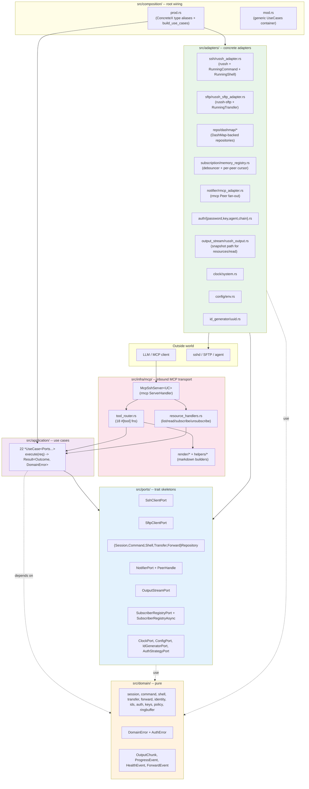
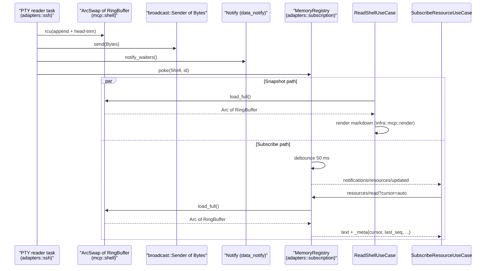
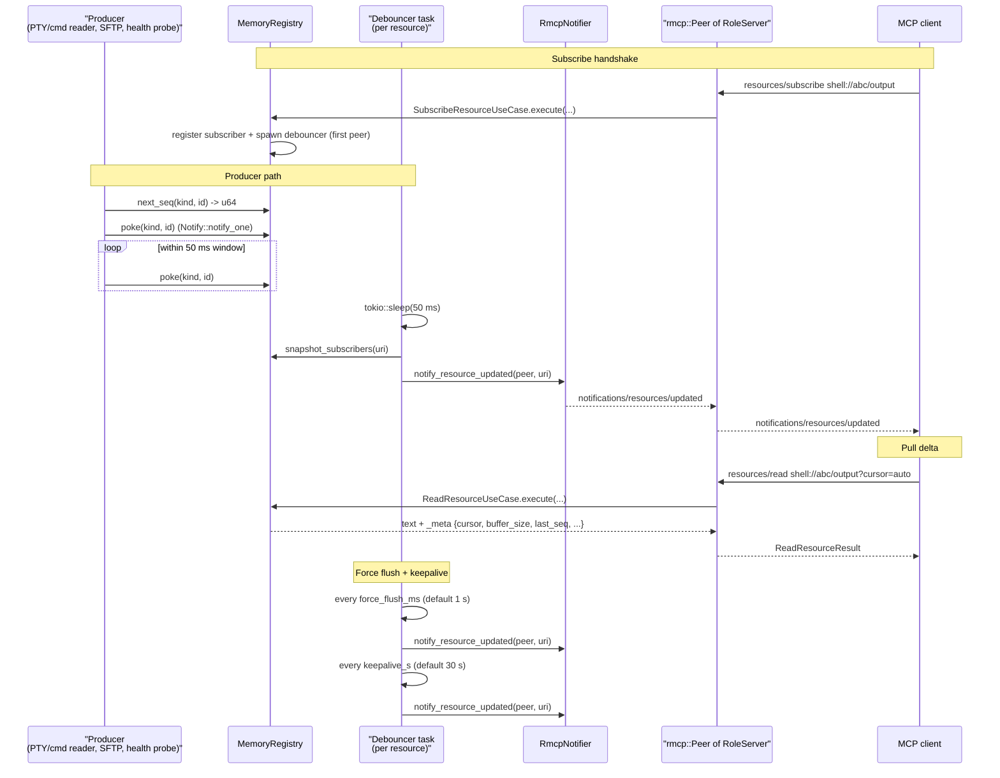

# SSH MCP Architecture (v4.0.0 — hexagonal)

This document describes the architecture of the SSH Model Context Protocol (MCP) server. It reflects the **v4.0.0** codebase, which adopts a strict hexagonal (Ports and Adapters) layout on top of the v3 lock-free runtime: same 18 MCP tools, same 5 resource subscribe schemes, same wire format — but the internals are split into `domain/` (pure), `ports/` (trait skeletons), `application/` (use cases), `adapters/` (concrete implementations), `infra/` (inbound MCP transport), and `composition/` (root wiring).

[[_TOC_]]

## Overview

ssh-mcp is a Rust crate (edition `2024`, MSRV `1.85`) that turns SSH operations into MCP tools. v4.0.0 ships:

- **Hexagonal architecture** — every concrete dependency (rmcp, russh, russh-sftp, dashmap, tokio) is wrapped behind a port trait. Use cases compose ports through static-dispatch generics, never `dyn`. Adapters live in `src/adapters/` and are swapped wholesale at composition time.
- **Inbound MCP layer** under `src/infra/mcp/` — an `rmcp::ServerHandler` (`McpSshServer<UC>`) generic over the `UseCases<…>` container, with the `#[tool_router]` block aggregating the 18 `#[tool]` entry points and the `resources/*` overrides.
- **Two binaries** — `ssh-mcp` (HTTP via `axum 0.8` + `rmcp::transport::streamable_http_server::StreamableHttpService`) and `ssh-mcp-stdio` (stdio via `rmcp::transport::io::stdio()`). Both delegate to `composition::prod::run_{http,stdio}` so the wiring lives in one place.
- **Lock-free runtime** preserved verbatim from v3 — `Arc<ArcSwap<T>>`, `tokio::sync::broadcast`, `tokio::sync::mpsc`, `OnceCell`, `AtomicU64`, `Notify`, `DashMap`. The carriers (`RunningCommand`, `RunningShell`, `RunningTransfer`) and the per-resource debouncer / subscription registry are ported into `src/adapters/` (see [LOCKS.md](./LOCKS.md)).
- **Strict lint baseline** — Clippy `forbid` / `deny` plus `await_holding_lock`, `mutex_atomic`, `mutex_integer`, `clone_on_ref_ptr`, `as_conversions`, `pub_use`, `absolute_paths`, `allow_attributes_without_reason`. Every `#[allow(...)]` carries `reason = "..."`.

Public MCP API is **stable**: same 18 tools, same 5 resource schemes, same response markdown shape, same env-var names. Only the internal module layout moved. See [MIGRATION_v3_to_v4.md](./MIGRATION_v3_to_v4.md) for the contributor-facing change log.

## Hexagonal layers

Six top-level directories under `src/`. Each layer's import rules are enforced by the strict lint baseline plus per-module documentation rather than by macro magic.


```mermaid
flowchart TB
    subgraph Outside["Outside world"]
        LLM["LLM / MCP client"]
        SSH["sshd / SFTP / agent"]
    end

    subgraph Infra["src/infra/mcp/  -- inbound MCP transport"]
        Server["McpSshServer&lt;UC&gt;<br/>(rmcp ServerHandler)"]
        ToolRouter["tool_router.rs<br/>(18 #[tool] fns)"]
        ResHandlers["resource_handlers.rs<br/>(list/read/subscribe/unsubscribe)"]
        Render["render/* + helpers/*<br/>(markdown builders)"]
    end

    subgraph Application["src/application/  -- use cases"]
        UC["22 *UseCase&lt;Ports...&gt;<br/>execute(req) -&gt; Result&lt;Outcome, DomainError&gt;"]
    end

    subgraph Ports["src/ports/  -- trait skeletons"]
        SshP["SshClientPort"]
        SftpP["SftpClientPort"]
        Repos["{Session,Command,Shell,Transfer,Forward}Repository"]
        Notif["NotifierPort + PeerHandle"]
        Out["OutputStreamPort"]
        Sub["SubscriberRegistryPort + SubscriberRegistryAsync"]
        Misc["ClockPort, ConfigPort, IdGeneratorPort, AuthStrategyPort"]
    end

    subgraph Domain["src/domain/  -- pure"]
        Entities["session, command, shell, transfer, forward, identity, ids, auth, keys, policy, ringbuffer"]
        Errors["DomainError + AuthError"]
        Events["OutputChunk, ProgressEvent, HealthEvent, ForwardEvent"]
    end

    subgraph Adapters["src/adapters/  -- concrete adapters"]
        Russh["ssh/russh_adapter.rs<br/>(russh + RunningCommand + RunningShell)"]
        Sftp["sftp/russh_sftp_adapter.rs<br/>(russh-sftp + RunningTransfer)"]
        Dash["repo/dashmap/*<br/>(DashMap-backed repositories)"]
        SubReg["subscription/memory_registry.rs<br/>(debouncer + per-peer cursor)"]
        Notifier["notifier/rmcp_adapter.rs<br/>(rmcp Peer fan-out)"]
        Auth["auth/{password,key,agent,chain}.rs"]
        Output["output_stream/russh_output.rs<br/>(snapshot path for resources/read)"]
        Clock["clock/system.rs"]
        Cfg["config/env.rs"]
        Ids["id_generator/uuid.rs"]
    end

    subgraph Composition["src/composition/  -- root wiring"]
        Prod["prod.rs<br/>(ConcreteX type aliases + build_use_cases)"]
        Mod["mod.rs<br/>(generic UseCases container)"]
    end

    LLM --> Server
    Server --> ToolRouter
    Server --> ResHandlers
    ToolRouter --> Render
    ToolRouter --> UC
    ResHandlers --> UC
    UC --> Ports
    Adapters --> Ports
    Adapters --> SSH
    UC -.depends on.-> Domain
    Ports -.use.-> Domain
    Adapters -.use.-> Domain
    Prod --> UC
    Prod --> Adapters

    style Domain fill:#fff3e0
    style Ports fill:#e3f2fd
    style Application fill:#f3e5f5
    style Adapters fill:#e8f5e9
    style Infra fill:#fce4ec
    style Composition fill:#fffde7
```

### Layer contracts

| Layer | What lives here | Allowed deps | Forbidden deps |
|-------|-----------------|--------------|----------------|
| `domain` | Entities, value objects, errors, live event variants, semantic keystroke encoder | `std`, `serde`, `serde_json`, `chrono`, `thiserror`, `schemars`, `bytes` | `tokio`, `russh`, `rmcp`, `axum`, `dashmap` |
| `ports` | Trait skeletons (sync + async via `#[trait_variant::make(Port: Send)]`) | `domain`, `bytes`, `chrono`, `std`, `trait_variant` | `tokio`, `russh`, `rmcp`, `axum`, `dashmap` |
| `application` | Use cases (`*UseCase<Ports...>`) — one struct + DTO per business operation | `domain`, `ports`, `tokio` (for `select!` / `spawn`) | `russh`, `rmcp`, `axum`, `dashmap` |
| `adapters` | Concrete implementations of every port | All runtime crates (`tokio`, `russh`, `russh_sftp`, `dashmap`, `arc_swap`) | `rmcp` (only `notifier/rmcp_*`), `axum` |
| `infra` | Inbound MCP transport (`#[tool_router]`, `ServerHandler`, render, args, helpers) | `rmcp`, `application`, `domain`, `adapters::notifier::rmcp_peer` | `russh`, `russh_sftp`, `dashmap` |
| `composition` | Root wiring — pins concrete adapters via `type ConcreteX = …`, builds the `UseCases` container | All adapters + `infra::mcp` + `application` | — (it is the leaf) |

### Static dispatch + AFIT (no async-trait, no dyn)

Async ports use the `trait-variant` macro pattern:

```rust
// src/ports/ssh_client.rs
#[trait_variant::make(SshClientPort: Send)]
pub trait LocalSshClientPort: Send + Sync {
    async fn connect(&self, ...) -> Result<SessionEntity, DomainError>;
    async fn execute(&self, request: CommandRequest) -> Result<CommandOutcome, DomainError>;
    // ...
}
```

The macro generates two trait surfaces:

- `LocalSshClientPort` — pure AFIT (`async fn` in trait), kept private and used by tests.
- `SshClientPort` — `Send`-bounded re-export consumed by use cases as a generic parameter.

Use cases stay generic over the port, never over `dyn Trait`:

```rust
pub struct ConnectSessionUseCase<S, SR, C, Idg, Cfg>
where
    S: SshClientPort + Send + Sync + 'static,
    SR: SessionRepository + Send + Sync + 'static,
    // ...
{
    ssh: Arc<S>,
    sessions: Arc<SR>,
    // ...
}
```

The composition root pins one concrete adapter per port:

```rust
// src/composition/prod.rs
type ConcreteSsh = RusshAdapter;
type ConcreteSessionRepo = DashMapSessionRepo;
// ...

pub type ProdUseCases = UseCases<ConcreteSsh, ConcreteSftp, /* ... */>;
```

This has three benefits: zero virtual-call overhead in the hot path, every use case can be unit-tested with in-memory fakes (loaded as a different `UseCases<FakeSsh, …>`), and rustc surfaces wiring errors at the composition root rather than at runtime.

The legacy v3 auth chain (`src/mcp/auth/*.rs`) still uses `#[async_trait]` because the H8 refit landed under `src/adapters/auth/` while the v3 module remains runtime-active. The `async-trait` direct dependency is slated for deletion in the v4.1 cleanup window (see [Future work](#future-work)).

## Module map

The crate root is `src/`. Library code lives under `src/{domain,ports,application,adapters,infra,composition}/`. The two binaries are thin shells that delegate to `composition::prod`.

### Binary entry points

| File | Role |
|------|------|
| `src/main.rs` | HTTP transport binary (`ssh-mcp`). Calls `composition::prod::run_http()`. Default bind `0.0.0.0:8000`, path `/`. |
| `src/bin/ssh_mcp_stdio.rs` | Stdio transport binary (`ssh-mcp-stdio`). Calls `composition::prod::run_stdio()`. Logs to stderr via `RUST_LOG`. |

Both entry points spawn the peer-GC task (`mcp::subscription::spawn_peer_gc`) on `SSH_MCP_PEER_GC_INTERVAL_S` (default 30s). rmcp 1.6 does not expose a peer-disconnect callback, so the periodic scan is the only way to reclaim subscription state for closed transports.

### `src/domain/` — pure layer

| File | Role |
|------|------|
| `mod.rs` | Re-export tree. **MUST NOT** import `tokio`, `russh`, `rmcp`, `axum`, or `dashmap`. |
| `auth.rs` | `AuthError` variant for credential rejection. |
| `command.rs` | `CommandEntity`, `CommandRequest`, `CommandStatus`. |
| `error.rs` | `DomainError` (top-level) — variants: `SessionNotFound`, `CommandNotFound`, `ShellNotFound`, `TransferNotFound`, `ForwardNotFound`, `MaxCommandsExceeded`, `MaxShellsExceeded`, `MaxTransfersExceeded`, `InvalidArgument`, `ConnectFailed`, `Auth`, `Timeout`, `Sftp`, `PortInUse`, `Transport`, `Storage`, `Internal`. |
| `events.rs` | Live event enums shipped by the runtime ports — `OutputChunk`, `ProgressEvent`, `HealthEvent`, `ForwardEvent`. Every variant carries `seq: u64` allocated by the subscription registry. |
| `forward.rs` | `ForwardEntity`. |
| `identity.rs` | `Address`, `Credentials`. |
| `ids.rs` | Newtype ids — `SessionId`, `CommandId`, `ShellId`, `TransferId`, `ForwardId`, `AgentId`, `PeerId`. |
| `keys.rs` | `ShellKey`, `KeyModifiers`, semantic keystroke encoder (xterm-compatible byte sequences). Backs the `ssh_shell_send_key` use case. |
| `policy.rs` | `CommandStatusFilter`, `MaxItemsPolicy`, etc. |
| `ringbuffer.rs` | `RingBuffer` value type used by the shell adapter. |
| `session.rs` | `SessionEntity`. |
| `shell.rs` | `ShellEntity`, `ShellTerminal`. |
| `transfer.rs` | `TransferEntity`, `TransferStatus`, `TransferDirection`. |

### `src/ports/` — trait skeletons

| File | Role |
|------|------|
| `ssh_client.rs` | `SshClientPort` — connect, disconnect, execute (sync + async), open/write/close shell, health check. |
| `sftp_client.rs` | `SftpClientPort` — upload, download, cancel. |
| `session_repo.rs` | `SessionRepository` — insert, get, remove, list, update_health, register_agent, list_by_agent, remove_by_agent. |
| `command_repo.rs` | `CommandRepository` — insert, update, get, remove, count_by_session, count_running_by_session, list_filtered. |
| `shell_repo.rs` | `ShellRepository` — same shape, scoped to shells. |
| `transfer_repo.rs` | `TransferRepository` — same shape, scoped to transfers. |
| `forward_repo.rs` | `ForwardRepository` (feature-gated `port_forward`). |
| `notifier.rs` | `NotifierPort` (async fan-out) + `PeerHandle` (sync, dyn-safe handle to a connected MCP peer). |
| `output_stream.rs` | `OutputStreamPort` — `snapshot_command`, `snapshot_shell`. Returns `OutputSnapshot { byte_cursor, last_seq, stdout, stderr }`. |
| `subscriber_registry.rs` | `SubscriberRegistryPort` (sync slice — `next_seq`, `current_seq`, `poke`, cursor read/advance, GC) + `SubscriberRegistryAsync` (subscribe/unsubscribe/drop_peer). |
| `auth_strategy.rs` | `AuthStrategyPort` — single async `try_authenticate` step in the chain. |
| `clock.rs` | `ClockPort` — `utc_now`, `instant_now`. Sync, dyn-safe. |
| `config.rs` | `ConfigPort` — every tunable as a typed accessor (~26 methods). |
| `id_generator.rs` | `IdGeneratorPort` — `next_session`, `next_command`, `next_shell`, `next_transfer`, `next_forward`, `next_peer`. |

Async ports are declared `#[trait_variant::make(Port: Send)]`; sync ports stay plain `dyn`-safe traits.

### `src/application/` — use cases

22 files, one per business operation. Each is a `*UseCase<Ports...>` struct with a single `pub async fn execute(&self, req: Request) -> Result<Outcome, DomainError>` entry point.

| Domain | Use cases |
|--------|-----------|
| Connection | `connect_session`, `disconnect_session`, `list_sessions`, `disconnect_agent` |
| Commands | `execute_command`, `get_command_output`, `list_commands`, `cancel_command` |
| Shell | `open_shell`, `write_shell`, `send_key`, `read_shell`, `wait_for_pattern`, `close_shell` |
| SFTP | `upload_file`, `download_file`, `get_transfer_progress` |
| Network | `forward_port` (feature-gated `port_forward`) |
| Resources | `list_resources`, `read_resource`, `subscribe_resource`, `unsubscribe_resource` |
| Background | `peer_gc` (periodic invocation of `SubscriberRegistryPort::gc_closed_peers`) |

Inbound DTOs and outcome enums live alongside each use case so an inbound adapter (rmcp tool wrapper, future REST gateway, …) can drive the use case without touching the domain layer directly.

### `src/adapters/` — concrete adapters

Every adapter implements one or more ports.

| Adapter | Port(s) | File |
|---------|---------|------|
| `RusshAdapter` | `SshClientPort` | `ssh/russh_adapter.rs` |
| `RusshSftpAdapter` | `SftpClientPort` | `sftp/russh_sftp_adapter.rs` |
| `DashMap*Repo` | `*Repository` (5 of them) | `repo/dashmap/{session,command,shell,transfer,forward}.rs` |
| `RmcpNotifier` + `RmcpPeerHandle` + `PeerTable` | `NotifierPort` + `PeerHandle` | `notifier/{rmcp_adapter,rmcp_peer}.rs` |
| `MemoryRegistry<N>` | `SubscriberRegistryPort` + `SubscriberRegistryAsync` | `subscription/memory_registry.rs` |
| `RusshOutputAdapter` | `OutputStreamPort` | `output_stream/russh_output.rs` |
| `AuthChainAdapter` (+ `PasswordAuth`, `KeyAuth`, `AgentAuth`) | `AuthStrategyPort` | `auth/{password,key,agent,chain}.rs` |
| `SystemClock` (+ `FakeClock` under `#[cfg(any(test, feature = "test-fixtures"))]`) | `ClockPort` | `clock/{system,fake}.rs` |
| `EnvConfig` (+ `MemoryConfig`) | `ConfigPort` | `config/{env,memory}.rs` |
| `UuidIds` (+ `DeterministicIds`) | `IdGeneratorPort` | `id_generator/{uuid,deterministic}.rs` |

`FakeSshAdapter` and `FakeSftpAdapter` (under `#[cfg(any(test, feature = "test-fixtures"))]`) provide in-memory implementations of `SshClientPort` and `SftpClientPort` for use case tests.

### `src/infra/mcp/` — inbound MCP transport

| File | Role |
|------|------|
| `server.rs` | `McpSshServer<UC>` — generic over the `UseCases<…>` container. Owns `Arc<UC>` plus `Arc<PeerTable>`. |
| `tool_router.rs` | `#[tool_router]` impl populating the 18 `#[tool]` entry points (one per MCP tool) and the `#[tool_handler] impl ServerHandler` block. Compiled twice via `#[cfg]` (with / without `port_forward`) so the generic signature stays clean. |
| `resource_handlers.rs` | Adapters between rmcp `resources/{list,read,subscribe,unsubscribe}` payloads and the matching `*_resource` use cases. Maps `DomainError` onto `McpError` (validation -> `invalid_params`, not-found -> `resource_not_found`, everything else -> `internal_error`). |
| `peer_handle.rs` | Type aliases (`PeerTable`, `RmcpPeerHandle`) re-surfacing the adapter that lives under `src/adapters/notifier/rmcp_peer.rs`. The wrapper mints a fresh `PeerId`, registers in the per-process `PeerTable` on construction, and removes itself on `Drop`. |
| `args/` | One module per tool domain (`connection`, `execute`, `shell`, `sftp`, `forward`) with `#[derive(Deserialize, JsonSchema)]` argument structs. |
| `render/` | One module per tool domain rendering the use case outcome into the v3 markdown body. Uses `helpers::nonce::generate_nonce` (8-hex) and `helpers::output::render_output_block`. |
| `helpers/` | Shared primitives — `error::format_error`, `nonce::generate_nonce`, `output::render_output_block`, plus UTF-8 safe truncation. |

### `src/composition/` — root wiring

| File | Role |
|------|------|
| `mod.rs` | The generic `UseCases<S, F, SR, CR, ShR, TR, [FR,] N, AS, OS, SubR, C, Cfg, Idg>` container. Compiled twice via `#[cfg]` so the `FR` (`ForwardRepository`) parameter only exists with `port_forward`. |
| `prod.rs` | Production wiring — pins concrete adapters via `type ConcreteX = …`, exposes `build_use_cases() -> (Arc<ProdUseCases>, Arc<PeerTable>)`, `build_server() -> McpSshServer<ProdUseCases>`, and the two transport entry points `run_http()` / `run_stdio()`. |
| `fixtures.rs` | (Reserved for the H18+ test harness.) |

### Foundational `src/mcp/` — runtime-active v3 leftovers (v4.1 cleanup)

After the H17.5a hard-delete the legacy `src/mcp/{tools,storage,server,message,resources,schema,keys,forward}` modules are gone. The following modules remain runtime-active because the v4 adapters delegate into them; the v4.1 cleanup window will absorb them into the hexagonal layout and retire the `mcp::` namespace entirely.

| File | Why it stays for v4.0.0 |
|------|-------------------------|
| `src/mcp/async_command.rs` | `RunningCommand` lock-free state consumed by the russh adapter. |
| `src/mcp/auth/` | Strategy chain still uses `#[async_trait]`; the `src/adapters/auth/` chain (H8) is the v4 surface, the v3 module is unreachable but pinned by `Cargo.toml`'s transitional `async-trait` dep. |
| `src/mcp/client.rs` | Low-level russh connect / exec / PTY helpers (`connect_to_ssh_with_retry`, `execute_ssh_command`, `open_pty_shell`) reused by the adapter. |
| `src/mcp/config.rs` | Env-var resolvers; `adapters::config::env::EnvConfig` delegates here. |
| `src/mcp/error.rs` | Retry-classification helper consumed by `mcp::client`. |
| `src/mcp/session.rs` | `SshClientHandler` russh callback type. |
| `src/mcp/sftp.rs` | Streaming SFTP transfer state used by the SFTP adapter. |
| `src/mcp/shell.rs` | `RunningShell` + `RingBuffer` consumed by the russh adapter. |
| `src/mcp/subscription.rs` | `SUBSCRIPTION_REGISTRY` global + `spawn_peer_gc` task spawned by `composition::prod`. The `MemoryRegistry` adapter (H9) is the v4 surface for use cases, but the v3 global is still poked from the foundational producers. |
| `src/mcp/transfer.rs` | `RunningTransfer` lock-free state. |
| `src/mcp/types.rs` | Shared payload structs (`SessionInfo`, `AsyncCommandInfo`, `ShellInfo`, …). |

## Lock-free design (now in `adapters/`)

v4 preserves every lock-free invariant from v3 — no `Mutex` on the long-lived state carriers. The carriers themselves now sit in the adapters layer alongside the production rust-channel plumbing. See [LOCKS.md](./LOCKS.md) for the complete acquisition order, channel-capacity table, and decision tree.

| Carrier | Owner module (v4) | Pattern |
|---------|------------------|---------|
| Per-command output history | `mcp::async_command::RunningCommand` (consumed by `adapters::ssh::russh_adapter`, snapshot via `adapters::output_stream::russh_output`) | `Arc<ArcSwap<OutputBuffer>>` + `broadcast::Sender<OutputChunk>` + `OnceCell<i32>` exit + `OnceCell<String>` error |
| Per-shell PTY history | `mcp::shell::RunningShell` (consumed by `adapters::ssh::russh_adapter`) | `Arc<ArcSwap<RingBuffer>>` + `broadcast::Sender<Bytes>` + `mpsc::Sender<WriteRequest>` writer-task ownership + `AtomicU64` activity + `Notify` |
| Per-transfer progress | `mcp::transfer::RunningTransfer` (consumed by `adapters::sftp::russh_sftp_adapter`) | `AtomicU64` byte counters + `broadcast::Sender<ProgressEvent>` + `OnceCell<String>` error + `Notify` |
| Subscription registry | `adapters::subscription::memory_registry::MemoryRegistry<N>` | `DashMap` shards (subscribers / progress / waker / debouncer task / sequence counter) + per-`(peer, uri)` `Arc<PeerProgress>` (`AtomicU64` cursor + `AtomicU64` last seen) + per-resource `Arc<Notify>` waker |
| Repositories | `adapters::repo::dashmap::*` | `Arc<DashMap<Id, Entity>>` primary + secondary `DashMap<AgentId, HashSet<SessionId>>` index. No `await` while a shard guard is alive. |

Snapshot reads always clone the `Arc` out of the relevant `DashMap` (or load the `ArcSwap` payload) **before** touching `.await`. The `clippy::await_holding_lock` + `clippy::significant_drop_in_scrutinee` lints prevent regressions.

### Sequence diagram — shell read fan-out under concurrent writes


```mermaid
sequenceDiagram
    participant Producer as "PTY reader task<br/>(adapters::ssh)"
    participant History as "ArcSwap of RingBuffer<br/>(mcp::shell)"
    participant Broadcast as "broadcast::Sender of Bytes"
    participant Notify as "Notify (data_notify)"
    participant Reg as "MemoryRegistry<br/>(adapters::subscription)"
    participant Reader as ReadShellUseCase
    participant Sub as SubscribeResourceUseCase

    Producer->>History: rcu(append + head-trim)
    Producer->>Broadcast: send(Bytes)
    Producer->>Notify: notify_waiters()
    Producer->>Reg: poke(Shell, id)

    par Snapshot path
        Reader->>History: load_full()
        History-->>Reader: Arc of RingBuffer
        Reader->>Reader: render markdown (infra::mcp::render)
    and Subscribe path
        Reg->>Reg: debounce 50 ms
        Reg-->>Sub: notifications/resources/updated
        Sub->>Reg: resources/read?cursor=auto
        Reg->>History: load_full()
        History-->>Reg: Arc of RingBuffer
        Reg-->>Sub: text + _meta{cursor, last_seq, ...}
    end
```

## Subscribe pipeline

The subscribe layer turns producer events into rate-limited `notifications/resources/updated` calls. Subscribers then pull byte deltas via `resources/read?cursor=auto`. Logic lives in `adapters::subscription::memory_registry::MemoryRegistry<N>` (where `N` is the `NotifierPort` adapter monomorphised at composition time).


```mermaid
sequenceDiagram
    participant Prod as "Producer<br/>(PTY/cmd reader, SFTP, health probe)"
    participant Reg as MemoryRegistry
    participant Deb as "Debouncer task<br/>(per resource)"
    participant Notif as RmcpNotifier
    participant Peer as "rmcp::Peer of RoleServer"
    participant Client as MCP client

    Note over Client,Reg: Subscribe handshake
    Client->>Peer: resources/subscribe shell://abc/output
    Peer->>Reg: SubscribeResourceUseCase.execute(...)
    Reg->>Reg: register subscriber + spawn debouncer (first peer)

    Note over Prod,Deb: Producer path
    Prod->>Reg: next_seq(kind, id) -> u64
    Prod->>Reg: poke(kind, id)        (Notify::notify_one)
    loop within 50 ms window
        Prod->>Reg: poke(kind, id)
    end

    Deb->>Deb: tokio::sleep(50 ms)
    Deb->>Reg: snapshot_subscribers(uri)
    Deb->>Notif: notify_resource_updated(peer, uri)
    Notif-->>Peer: notifications/resources/updated
    Peer-->>Client: notifications/resources/updated

    Note over Client: Pull delta
    Client->>Peer: resources/read shell://abc/output?cursor=auto
    Peer->>Reg: ReadResourceUseCase.execute(...)
    Reg-->>Peer: text + _meta {cursor, buffer_size, last_seq, ...}
    Peer-->>Client: ReadResourceResult

    Note over Deb: Force flush + keepalive
    Deb->>Deb: every force_flush_ms (default 1 s)
    Deb->>Notif: notify_resource_updated(peer, uri)
    Deb->>Deb: every keepalive_s (default 30 s)
    Deb->>Notif: notify_resource_updated(peer, uri)
```

### Backpressure features (A + B + D)

| Feature | Scope | Mechanism | Tunable |
|---------|-------|-----------|---------|
| **A. Sequence numbers** | Every event variant (`OutputChunk`, `ProgressEvent`, `HealthEvent`, `ForwardEvent`) | `seq: u64` allocated by `MemoryRegistry::next_seq`; mirrored in `_meta.last_seq` so subscribers detect gaps after a `Lagged` recovery. | — (allocator is shard-atomic) |
| **B. Keepalive** | Per resource | Per-debouncer ticker emits one notification every `SSH_NOTIFY_KEEPALIVE_S` even when no fresh chunks arrived. Keeps SSE / stdio frames warm. | `SSH_NOTIFY_KEEPALIVE_S` (default `30` s, range `5..=300`) |
| **D. Cumulative chunks** | Per resource | The debouncer collapses every `poke` inside `SSH_NOTIFY_DEBOUNCE_MS` into exactly one outbound notification; the actual byte coalescing happens server-side when the client calls `resources/read?cursor=auto`. | `SSH_NOTIFY_DEBOUNCE_MS` (default `50` ms), `SSH_NOTIFY_FORCE_FLUSH_MS` (default `1000` ms) |

**Per-peer cursor.** Each `(peer_id, uri)` pair owns a shared `Arc<PeerProgress>` (`byte_cursor: AtomicU64`, `last_seq_seen: AtomicU64`). Reads with `?cursor=auto` slice the buffer from `byte_cursor` and bump it after rendering. Reads with `?cursor=<N>` allow explicit recovery (typically `?cursor=0` for a full snapshot).

**Truncation compensation.** When the producer drops bytes from the head (buffer cap exceeded), `MemoryRegistry::compensate_truncation(uri, dropped)` decrements every peer cursor on the same URI by `dropped` (saturating). The next `resources/read` then surfaces the loss via `_meta.truncated_since_last_read`.

**Peer GC.** rmcp 1.6 does not surface a peer-disconnect callback. Both binaries spawn `mcp::subscription::spawn_peer_gc(interval, cancel)` that periodically scans the registry and drops every peer whose `PeerHandle::is_closed()` returns `true`. The `application::peer_gc::PeerGcUseCase` is the v4 façade; the production wiring still spawns the foundational task during the v4.0.0 transition window.

## Capabilities

`McpSshServer` declares the following capabilities through the rmcp `ServerHandler::get_info()` contract:

| Capability | Status |
|------------|--------|
| `tools/list` | 18 tools registered via `#[tool_router]` (see [API.md](./API.md)) |
| `tools/call` | One handler per tool, all returning `Result<CallToolResult, McpError>` |
| `resources/list` | 5 schemes (`shell`, `command`, `transfer`, `session`, `forward`) — see [RESOURCES.md](./RESOURCES.md) |
| `resources/read` | All 5 schemes with `_meta` envelope; cursor support on `shell` / `command` / `forward` |
| `resources/subscribe` + `resources/unsubscribe` | Per `(peer, uri)` cursor maintained by `MemoryRegistry` |
| `notifications/resources/updated` | Emitted by the per-resource debouncer task |
| `notifications/resources/list_changed` | Capability advertised; emission still deferred (tracked under [Future work](#future-work)) |
| Cancellation | Native via rmcp 1.6 — the v3 custom stdio cancel-id parser is gone since v3.0.0 |

## Future work

- **`notifications/resources/list_changed`** — wire emission through every use case that creates / destroys a tracked resource (capability is already advertised; `Notify` plumbing pending).
- **`lagged_since_last_read` telemetry** — detect broadcast `RecvError::Lagged` in the registry, populate `_meta.lagged_since_last_read`, and let clients trigger an explicit `?cursor=0` snapshot recovery.
- **Per-subscriber dedicated `mpsc` channel** — replace the shared `broadcast::Sender` fan-out so a slow subscriber cannot pressure the producer.
- **H17.6 — foundational decoupling** — absorb the surviving `src/mcp/{async_command,client,config,error,session,sftp,shell,subscription,transfer,types,auth}` modules into the hexagonal layout and delete the `mcp::` namespace. The v4.0.0 release ships with these modules runtime-active because the russh / SFTP adapters still delegate into them; v4.1 will own the cleanup. See [adr/0002-adopt-hexagonal-architecture.md](./adr/0002-adopt-hexagonal-architecture.md) for the deferral rationale.
- **`async-trait` removal** — the v3 `mcp::auth` module is the last consumer of `#[async_trait]`. Its v4 replacement (`adapters::auth::chain::AuthChainAdapter`) already uses `trait-variant` AFIT; the `Cargo.toml` direct dependency goes away with H17.6.

## Cross references

- [LOCKS.md](./LOCKS.md) — lock-free patterns, acquisition order, channel sizing, loom invariants.
- [API.md](./API.md) — MCP tool reference (schemas, response shape).
- [RESOURCES.md](./RESOURCES.md) — `resources/*` contract, cursor semantics, `_meta` envelope.
- [ERRORS.md](./ERRORS.md) — error catalog.
- [CONFIGURATION.md](./CONFIGURATION.md) — env-var table.
- [FLOWS.md](./FLOWS.md) — end-to-end sequence diagrams.
- [LLM_GUIDE.md](./LLM_GUIDE.md) — guidance for LLM hosts.
- [MIGRATION_v3_to_v4.md](./MIGRATION_v3_to_v4.md) — internal migration narrative for contributors.
- [adr/0001-migrate-to-rmcp.md](./adr/0001-migrate-to-rmcp.md) — v3 transport choice.
- [adr/0002-adopt-hexagonal-architecture.md](./adr/0002-adopt-hexagonal-architecture.md) — v4 architecture choice.
