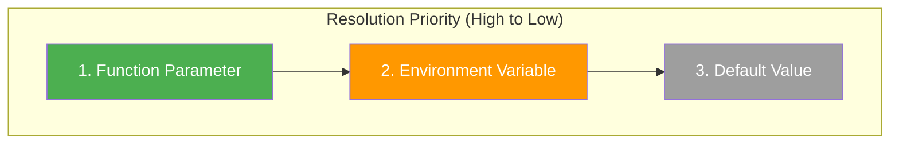
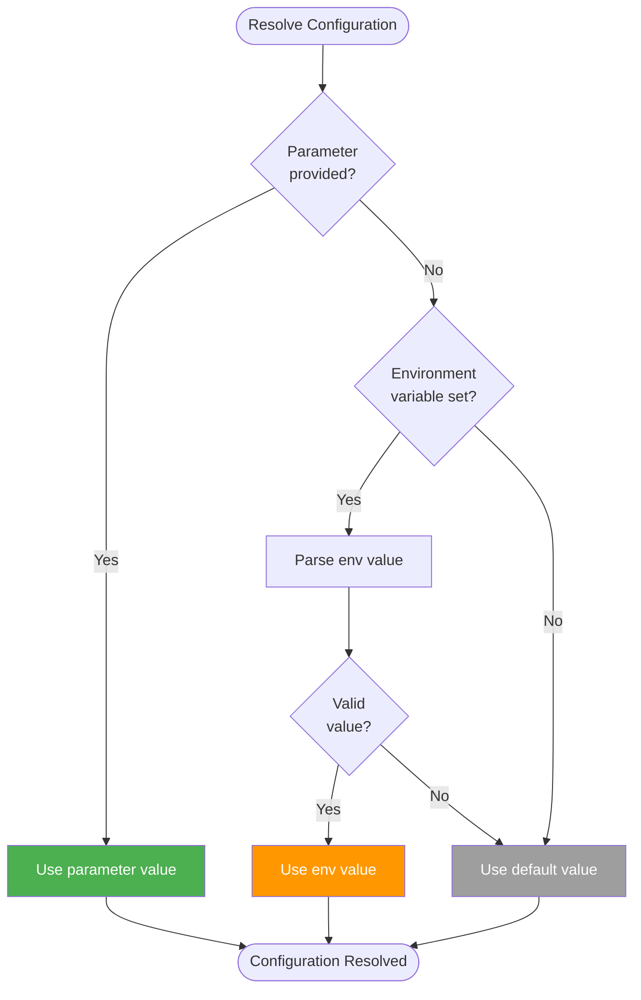
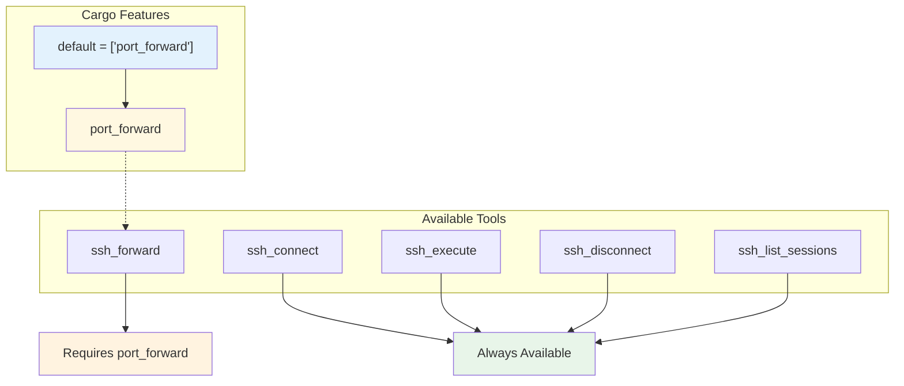
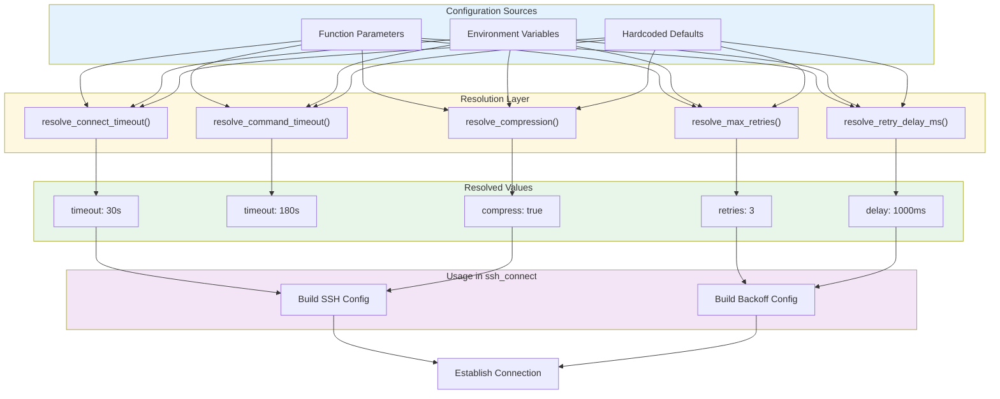

# SSH MCP Configuration Guide

This document provides a comprehensive guide to configuring the SSH MCP server, including environment variables, parameter priority, and example configurations.

## Table of Contents

- [Configuration Priority](#configuration-priority)
- [Environment Variables](#environment-variables)
- [Feature Flags](#feature-flags)
- [Example Configurations](#example-configurations)
- [MCP Client Configuration](#mcp-client-configuration)

---

## Configuration Priority

All configuration settings follow a consistent priority chain:



### Resolution Flow



This priority system allows you to:
- Set global defaults via environment variables
- Override per-request via function parameters
- Fall back to sensible defaults when nothing is specified

---

## Environment Variables

### Connection Settings

| Variable | Type | Default | Description |
|----------|------|---------|-------------|
| `SSH_CONNECT_TIMEOUT` | `u64` | `30` | Connection timeout in seconds |
| `SSH_COMMAND_TIMEOUT` | `u64` | `180` | Command execution timeout in seconds |
| `SSH_MAX_RETRIES` | `u32` | `3` | Maximum retry attempts for transient failures |
| `SSH_RETRY_DELAY_MS` | `u64` | `1000` | Initial delay between retries (milliseconds) |
| `SSH_COMPRESSION` | `bool` | `true` | Enable zlib compression (`true`, `1`, or `false`, `0`) |

### Server Settings

| Variable | Type | Default | Description |
|----------|------|---------|-------------|
| `MCP_PORT` | `u16` | `8000` | HTTP server port (only for `ssh-mcp` binary) |
| `RUST_LOG` | `string` | `info` | Log level (`trace`, `debug`, `info`, `warn`, `error`) |

### Variable Details

#### SSH_CONNECT_TIMEOUT

Controls how long to wait for the initial TCP connection and SSH handshake.

```bash
# Wait up to 60 seconds for slow networks
export SSH_CONNECT_TIMEOUT=60
```

**Considerations:**
- Too short: Connections fail on high-latency networks
- Too long: Slow failure detection for unreachable hosts
- Recommended: 30-60 seconds for most environments

#### SSH_COMMAND_TIMEOUT

Maximum time allowed for command execution.

```bash
# Allow 5 minutes for long-running commands
export SSH_COMMAND_TIMEOUT=300
```

**Considerations:**
- Should be longer than your longest expected command
- Set conservatively for automation
- Can be overridden per-command via parameter

#### SSH_MAX_RETRIES

Number of retry attempts after initial failure.

```bash
# Retry up to 5 times for unreliable networks
export SSH_MAX_RETRIES=5
```

**Behavior:**
- `0`: No retries (fail immediately on error)
- `1-10`: Recommended range
- Only retries on transient errors (connection refused, timeout, etc.)
- Authentication failures are never retried

#### SSH_RETRY_DELAY_MS

Initial delay before first retry. Uses exponential backoff with jitter.

```bash
# Start with 2 second delay
export SSH_RETRY_DELAY_MS=2000
```

**Backoff Calculation:**
```
delay = min(min_delay * 2^attempt, 10 seconds) + jitter
```

Example timeline with `SSH_RETRY_DELAY_MS=1000`:
- Attempt 1: Immediate
- Retry 1: ~1s delay
- Retry 2: ~2s delay
- Retry 3: ~4s delay
- Retry 4: ~8s delay
- Retry 5+: ~10s delay (capped)

#### SSH_COMPRESSION

Enable or disable zlib compression on the SSH connection.

```bash
# Disable compression for low-latency networks
export SSH_COMPRESSION=false
```

**Accepted Values:**
- Enable: `true`, `TRUE`, `1`
- Disable: `false`, `FALSE`, `0`, any other value

**Trade-offs:**
- Enable for: High-latency networks, large data transfers
- Disable for: Low-latency networks, CPU-constrained systems

---

## Feature Flags

Cargo feature flags control compile-time functionality.



### Building Without Port Forwarding

```bash
# Minimal build without port forwarding
cargo build --release --no-default-features
```

### Building With All Features

```bash
# Explicit full feature set
cargo build --release --features port_forward
```

---

## Example Configurations

### Development Environment

For local development with verbose logging:

```bash
# .env file
SSH_CONNECT_TIMEOUT=10
SSH_COMMAND_TIMEOUT=60
SSH_MAX_RETRIES=1
SSH_RETRY_DELAY_MS=500
SSH_COMPRESSION=false
MCP_PORT=8000
RUST_LOG=debug
```

### Production Environment

For production with reliability focus:

```bash
# .env file
SSH_CONNECT_TIMEOUT=30
SSH_COMMAND_TIMEOUT=300
SSH_MAX_RETRIES=5
SSH_RETRY_DELAY_MS=2000
SSH_COMPRESSION=true
MCP_PORT=8000
RUST_LOG=info
```

### High-Latency Network

For satellite or intercontinental connections:

```bash
# .env file
SSH_CONNECT_TIMEOUT=120
SSH_COMMAND_TIMEOUT=600
SSH_MAX_RETRIES=10
SSH_RETRY_DELAY_MS=5000
SSH_COMPRESSION=true
```

### Low-Latency Local Network

For local datacenter or LAN:

```bash
# .env file
SSH_CONNECT_TIMEOUT=5
SSH_COMMAND_TIMEOUT=60
SSH_MAX_RETRIES=2
SSH_RETRY_DELAY_MS=200
SSH_COMPRESSION=false
```

### CI/CD Pipeline

For automated deployments:

```bash
# .env file
SSH_CONNECT_TIMEOUT=30
SSH_COMMAND_TIMEOUT=600
SSH_MAX_RETRIES=3
SSH_RETRY_DELAY_MS=1000
SSH_COMPRESSION=true
RUST_LOG=warn
```

---

## MCP Client Configuration

### Claude Desktop Configuration

Add to `claude_desktop_config.json`:

```json
{
  "mcpServers": {
    "ssh": {
      "command": "/usr/local/bin/ssh-mcp-stdio",
      "env": {
        "SSH_CONNECT_TIMEOUT": "30",
        "SSH_COMMAND_TIMEOUT": "180",
        "SSH_MAX_RETRIES": "3",
        "SSH_COMPRESSION": "true"
      }
    }
  }
}
```

### Cursor IDE Configuration

Add to MCP settings:

```json
{
  "mcpServers": {
    "ssh": {
      "command": "/usr/local/bin/ssh-mcp-stdio",
      "args": [],
      "env": {
        "SSH_CONNECT_TIMEOUT": "60"
      }
    }
  }
}
```

### HTTP Server with Docker

```dockerfile
FROM rust:latest AS builder
WORKDIR /app
COPY . .
RUN cargo build --release

FROM debian:bookworm-slim
COPY --from=builder /app/target/release/ssh-mcp /usr/local/bin/
ENV SSH_CONNECT_TIMEOUT=30
ENV SSH_COMMAND_TIMEOUT=180
ENV SSH_MAX_RETRIES=3
ENV MCP_PORT=8000
EXPOSE 8000
CMD ["ssh-mcp"]
```

```yaml
# docker-compose.yml
version: '3.8'
services:
  ssh-mcp:
    build: .
    ports:
      - "8000:8000"
    environment:
      - SSH_CONNECT_TIMEOUT=30
      - SSH_COMMAND_TIMEOUT=180
      - SSH_MAX_RETRIES=3
      - SSH_COMPRESSION=true
      - RUST_LOG=info
```

---

## Configuration Diagram

Complete configuration flow:



### Configuration Constants

From `ssh_commands.rs`:

```rust
/// Default SSH connection timeout in seconds
const DEFAULT_CONNECT_TIMEOUT_SECS: u64 = 30;

/// Default SSH command execution timeout in seconds
const DEFAULT_COMMAND_TIMEOUT_SECS: u64 = 180;

/// Default maximum retry attempts for SSH connection
const DEFAULT_MAX_RETRIES: u32 = 3;

/// Default retry delay in milliseconds
const DEFAULT_RETRY_DELAY_MS: u64 = 1000;

/// Maximum retry delay cap in seconds (10 seconds)
const MAX_RETRY_DELAY_SECS: u64 = 10;
```

---

## Best Practices

1. **Use Environment Variables for Defaults**
   - Set organization-wide defaults in environment
   - Override per-request only when needed

2. **Tune Timeouts to Your Network**
   - Measure actual connection times
   - Add 50% buffer for network variance

3. **Balance Retries and Delay**
   - More retries = longer total wait time
   - Consider: `total_time = sum(delay * 2^i)` for i=0..retries

4. **Enable Compression Wisely**
   - Enable for WAN connections
   - Disable for LAN to reduce CPU overhead

5. **Log Level by Environment**
   - Development: `debug` or `trace`
   - Production: `info` or `warn`
   - Troubleshooting: `debug`
