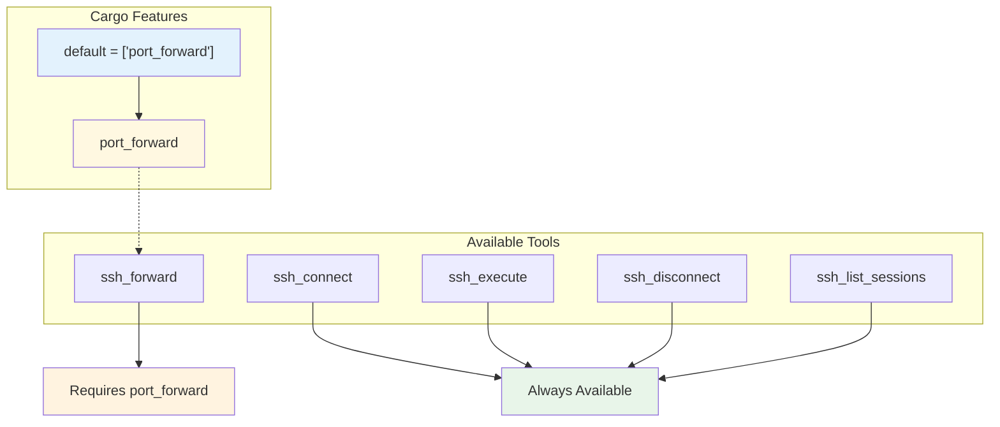
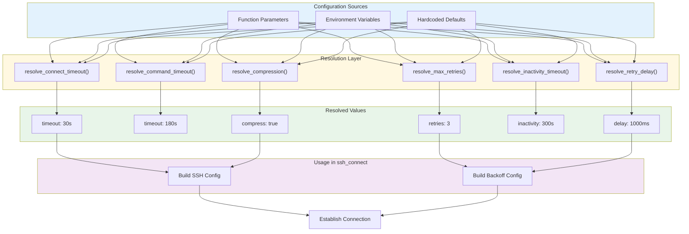

# SSH MCP Configuration Guide

This document provides a comprehensive guide to configuring the SSH MCP server, including environment variables, parameter priority, and example configurations.

## Table of Contents

- [Configuration Priority](#configuration-priority)
- [Environment Variables](#environment-variables)
- [Session Naming and Persistence](#session-naming-and-persistence)
- [Async Command Limits](#async-command-limits)
- [Tracing and Logging](#tracing-and-logging)
- [SSH Agent Authentication](#ssh-agent-authentication)
- [RSA Signature Algorithm](#rsa-signature-algorithm)
- [Feature Flags](#feature-flags)
- [Example Configurations](#example-configurations)
- [MCP Client Configuration](#mcp-client-configuration)

---

## Configuration Priority

All configuration settings follow a consistent priority chain:


### Resolution Flow


This priority system allows you to:
- Set global defaults via environment variables
- Override per-request via function parameters
- Fall back to sensible defaults when nothing is specified

### Session-Level Options

Some options are only configurable per-session via function parameters:

| Parameter | Type | Default | Description |
|-----------|------|---------|-------------|
| `name` | `string` | `null` | Human-readable session name for LLM identification |
| `persistent` | `bool` | `false` | Disable inactivity timeout, keep session alive indefinitely |

---

## Environment Variables

### Connection Settings

| Variable | Type | Default | Description |
|----------|------|---------|-------------|
| `SSH_CONNECT_TIMEOUT` | `u64` | `30` | Connection timeout in seconds |
| `SSH_COMMAND_TIMEOUT` | `u64` | `180` | Command execution timeout in seconds |
| `SSH_MAX_RETRIES` | `u32` | `3` | Maximum retry attempts for transient failures |
| `SSH_RETRY_DELAY_MS` | `u64` | `1000` | Initial delay between retries (milliseconds) |
| `SSH_INACTIVITY_TIMEOUT` | `u64` | `300` | Session inactivity timeout in seconds |
| `SSH_COMPRESSION` | `bool` | `true` | Enable zlib compression (`true`, `1`, or `false`, `0`) |

### Server Settings

| Variable | Type | Default | Description |
|----------|------|---------|-------------|
| `MCP_PORT` | `u16` | `8000` | HTTP server port (only for `ssh-mcp` binary) |
| `RUST_LOG` | `string` | `info` | Log level filter (see [Tracing and Logging](#tracing-and-logging)) |

### SSH Agent Settings

| Variable | Type | Default | Description |
|----------|------|---------|-------------|
| `SSH_AUTH_SOCK` | `string` | (system) | Path to SSH agent socket (see [SSH Agent Authentication](#ssh-agent-authentication)) |

### Variable Details

#### SSH_CONNECT_TIMEOUT

Controls how long to wait for the initial TCP connection and SSH handshake.

```bash
# Wait up to 60 seconds for slow networks
export SSH_CONNECT_TIMEOUT=60
```

**Considerations:**
- Too short: Connections fail on high-latency networks
- Too long: Slow failure detection for unreachable hosts
- Recommended: 30-60 seconds for most environments

#### SSH_COMMAND_TIMEOUT

Maximum time allowed for command execution.

```bash
# Allow 5 minutes for long-running commands
export SSH_COMMAND_TIMEOUT=300
```

**Considerations:**
- Should be longer than your longest expected command
- Set conservatively for automation
- Can be overridden per-command via parameter

**Note:** When a command times out, SSH MCP returns any partial output captured up to that point rather than failing with an error. This graceful timeout behavior ensures you receive useful output even from long-running commands that exceed the timeout.

#### SSH_MAX_RETRIES

Number of retry attempts after initial failure.

```bash
# Retry up to 5 times for unreliable networks
export SSH_MAX_RETRIES=5
```

**Behavior:**
- `0`: No retries (fail immediately on error)
- `1-10`: Recommended range
- Only retries on transient errors (connection refused, timeout, etc.)
- Authentication failures are never retried

#### SSH_RETRY_DELAY_MS

Initial delay before first retry. Uses exponential backoff with jitter.

```bash
# Start with 2 second delay
export SSH_RETRY_DELAY_MS=2000
```

**Backoff Calculation:**
```
delay = min(min_delay * 2^attempt, 10 seconds) + jitter
```

Example timeline with `SSH_RETRY_DELAY_MS=1000`:
- Attempt 1: Immediate
- Retry 1: ~1s delay
- Retry 2: ~2s delay
- Retry 3: ~4s delay
- Retry 4: ~8s delay
- Retry 5+: ~10s delay (capped)

#### SSH_INACTIVITY_TIMEOUT

Controls how long an idle session can remain open before being automatically closed. This is separate from the connection timeout.

```bash
# Keep sessions alive for 10 minutes of inactivity
export SSH_INACTIVITY_TIMEOUT=600
```

**Considerations:**
- Only applies to non-persistent sessions (`persistent: false`)
- Persistent sessions (`persistent: true`) disable this timeout entirely
- Keepalive packets (30s interval) are sent independently of this timeout
- Default 300s (5 minutes) is suitable for most interactive use cases
- Set higher for workflows with long think/compose pauses between commands

#### SSH_COMPRESSION

Enable or disable zlib compression on the SSH connection.

```bash
# Disable compression for low-latency networks
export SSH_COMPRESSION=false
```

**Accepted Values:**
- Enable: `true`, `TRUE`, `1`
- Disable: `false`, `FALSE`, `0`, any other value

**Trade-offs:**
- Enable for: High-latency networks, large data transfers
- Disable for: Low-latency networks, CPU-constrained systems

---

## Session Naming and Persistence

### Session Names

The `name` parameter allows you to assign human-readable names to SSH sessions. This is particularly useful when working with LLMs that need to manage multiple connections.

```json
{
  "tool": "ssh_connect",
  "arguments": {
    "address": "db.example.com:22",
    "username": "admin",
    "name": "production-database"
  }
}
```

**Benefits:**
- Easier session identification in `ssh_list_sessions` output
- LLMs can reference sessions by meaningful names
- Helps organize multiple concurrent connections

**Behavior:**
- Names are optional and can be any string
- Names are not required to be unique
- When not set, the `name` field is omitted from JSON responses
- Session IDs (UUIDs) remain the authoritative identifier

### Persistent Sessions

The `persistent` parameter disables the inactivity timeout for a session.

```json
{
  "tool": "ssh_connect",
  "arguments": {
    "address": "worker.example.com:22",
    "username": "deploy",
    "persistent": true
  }
}
```

**Behavior:**
- `persistent: false` (default): Sessions may time out after inactivity
- `persistent: true`: Sessions stay alive indefinitely until:
  - Explicitly disconnected via `ssh_disconnect`
  - The SSH MCP process terminates
  - The remote server closes the connection

**Keepalive:**
- Keepalive packets are still sent for persistent sessions
- Interval: 30 seconds
- Max failed attempts: 3
- This prevents network equipment from dropping idle connections

**Response Message:**
When `persistent=true`, the success message includes a suffix:
```
"Successfully connected to user@host:22 [persistent session]"
```

**Use Cases:**
- Long-running deployment scripts
- Background monitoring tasks
- Sessions that must survive extended idle periods

---

## Async Command Limits

SSH MCP supports asynchronous command execution, allowing commands to run in the background while you perform other operations. This section describes the limits and configuration options for async commands.

### Limits and Quotas

| Limit | Value | Description |
|-------|-------|-------------|
| Max concurrent async commands per session | 100 | Maximum number of multiplexed commands that can run simultaneously on a single SSH session (`MAX_ASYNC_COMMANDS_PER_SESSION`) |
| Command timeout | 180s (default) | Maximum execution time for async commands, configurable via `SSH_COMMAND_TIMEOUT` |
| Wait timeout | 30s (default) | Default timeout when polling for command output via `ssh_get_command_output` |
| Max wait timeout | 300s | Maximum allowed value for `wait_timeout_secs` parameter |

### Timeout Behavior

Async commands respect the same `SSH_COMMAND_TIMEOUT` setting as synchronous commands:

```bash
# Set async command timeout to 10 minutes
export SSH_COMMAND_TIMEOUT=600
```

When an async command exceeds the timeout:
- The command is terminated
- Partial output captured up to that point is preserved
- The command status changes to `completed` with `timed_out: true`

### Retrieving Async Command Output

Use `ssh_get_command_output` to retrieve results from async commands:

```json
{
  "tool": "ssh_get_command_output",
  "arguments": {
    "command_id": "cmd-456",
    "wait": true,
    "wait_timeout_secs": 60
  }
}
```

**`wait_timeout_secs` Parameter:**
- Default: 30 seconds
- Maximum: 300 seconds (5 minutes)
- Set to `0` for immediate (non-blocking) check
- If the command completes within the wait timeout, output is returned immediately

### Automatic Cleanup

Async commands are automatically cleaned up in the following scenarios:

1. **Session Disconnect**: When `ssh_disconnect` is called, all pending async commands for that session are terminated and cleaned up
2. **Session Timeout**: If a non-persistent session times out due to inactivity, associated async commands are cleaned up
3. **Server Shutdown**: All async commands are terminated when the SSH MCP process exits

### Best Practices

1. **Monitor Active Commands**
   - Use `ssh_list_commands` to check running commands before starting new ones
   - Avoid hitting the 100-command limit by completing or canceling unused commands

2. **Set Appropriate Timeouts**
   - For long-running commands, increase `SSH_COMMAND_TIMEOUT` via environment variable
   - Use reasonable `wait_timeout_secs` values to avoid blocking

3. **Handle Partial Output**
   - Check the `timed_out` field in responses
   - Design commands to produce incremental output when possible

4. **Clean Up Explicitly**
   - Cancel unneeded async commands rather than waiting for automatic cleanup
   - Disconnect sessions when work is complete

---

## Tracing and Logging

SSH MCP uses the `tracing` crate with `tracing-subscriber` for structured logging. Log output is controlled via the `RUST_LOG` environment variable.

### Log Levels

| Level | Description |
|-------|-------------|
| `error` | Critical failures that prevent operation |
| `warn` | Warning conditions that may indicate problems |
| `info` | Informational messages about normal operation (default) |
| `debug` | Detailed information for debugging |
| `trace` | Very detailed tracing information |

### Setting the Log Level

```bash
# Set global log level
export RUST_LOG=debug

# Set module-specific log levels
export RUST_LOG=ssh_mcp=debug,poem=info

# Enable trace for SSH operations only
export RUST_LOG=ssh_mcp::mcp=trace

# Minimal logging (errors and warnings only)
export RUST_LOG=warn
```

### Log Output Destination

- **ssh-mcp (HTTP server)**: Logs to stdout
- **ssh-mcp-stdio (MCP stdio transport)**: Logs to stderr (to avoid interfering with JSON-RPC communication over stdout)

### Example Log Output

```
2024-01-15T10:30:45.123Z  INFO ssh_mcp::mcp::commands: Attempting SSH connection to user@192.168.1.100:22 with timeout 30s, max_retries=3, retry_delay_ms=1000, compress=true
2024-01-15T10:30:45.456Z  INFO ssh_mcp::mcp::client: Successfully authenticated with SSH agent
2024-01-15T10:30:46.789Z  INFO ssh_mcp::mcp::commands: Executing command on SSH session abc123 with timeout 180s: ls -la
```

### Filtering by Component

```bash
# Only show connection-related logs
export RUST_LOG=ssh_mcp::mcp::client=debug

# Show all SSH MCP logs at debug, everything else at warn
export RUST_LOG=warn,ssh_mcp=debug

# Include poem framework logs for HTTP debugging
export RUST_LOG=ssh_mcp=debug,poem=debug
```

---

## SSH Agent Authentication

SSH MCP supports authentication via SSH agent, which allows you to use keys stored in your running ssh-agent without providing a password or key path.

### How It Works

1. When no password or key_path is provided to `ssh_connect`, the server attempts agent authentication
2. The agent is accessed via the `SSH_AUTH_SOCK` environment variable
3. All identities in the agent are tried sequentially until one succeeds

### Prerequisites

Ensure your SSH agent is running and has keys loaded:

```bash
# Start the SSH agent (if not already running)
eval "$(ssh-agent -s)"

# Add your SSH key to the agent
ssh-add ~/.ssh/id_ed25519
ssh-add ~/.ssh/id_rsa

# Verify keys are loaded
ssh-add -l
```

### SSH_AUTH_SOCK

The `SSH_AUTH_SOCK` environment variable contains the path to the SSH agent socket. This is typically set automatically when you start an SSH agent.

```bash
# Check if SSH_AUTH_SOCK is set
echo $SSH_AUTH_SOCK
# Example output: /tmp/ssh-XXXXXX/agent.12345

# Manually set SSH_AUTH_SOCK (rarely needed)
export SSH_AUTH_SOCK=/path/to/agent.sock
```

### MCP Configuration with SSH Agent

When using the MCP stdio transport with Claude Desktop or other clients, ensure the SSH agent socket is accessible:

```json
{
  "mcpServers": {
    "ssh": {
      "command": "/usr/local/bin/ssh-mcp-stdio",
      "env": {
        "SSH_AUTH_SOCK": "/run/user/1000/ssh-agent.socket"
      }
    }
  }
}
```

**Note:** On macOS, the SSH agent socket is typically at `/private/tmp/com.apple.launchd.*/Listeners`. You may need to pass the current value:

```json
{
  "mcpServers": {
    "ssh": {
      "command": "/usr/local/bin/ssh-mcp-stdio",
      "env": {
        "SSH_AUTH_SOCK": "${SSH_AUTH_SOCK}"
      }
    }
  }
}
```

### Authentication Priority

When connecting, SSH MCP tries authentication methods in this order:

1. **Password** (if provided via `password` parameter)
2. **Private key file** (if provided via `key_path` parameter)
3. **SSH agent** (if neither password nor key_path is provided)

### Troubleshooting Agent Authentication

If agent authentication fails:

```bash
# Verify the agent is running
ssh-add -l

# If you see "Could not open connection to your authentication agent"
eval "$(ssh-agent -s)"
ssh-add ~/.ssh/id_ed25519

# Check SSH_AUTH_SOCK is set correctly
echo $SSH_AUTH_SOCK

# Test the agent connection manually
ssh -o PreferredAuthentications=publickey user@host
```

---

## RSA Signature Algorithm

SSH MCP automatically negotiates the best RSA signature algorithm with the server. No configuration is needed.

### Background

Legacy SSH servers and clients used `ssh-rsa` signatures with SHA-1, which is now considered weak. Modern SSH implementations prefer:

- `rsa-sha2-256` (SHA-256 based signatures)
- `rsa-sha2-512` (SHA-512 based signatures)

### Automatic Negotiation

When authenticating with RSA keys (via key file or SSH agent), SSH MCP:

1. Queries the server for supported RSA hash algorithms
2. Selects the best available algorithm (`rsa-sha2-256` or `rsa-sha2-512`)
3. Falls back to legacy `ssh-rsa` only if the server doesn't support modern algorithms

### Compatibility

This automatic negotiation ensures compatibility with:
- Modern OpenSSH servers (8.0+) that disable `ssh-rsa` by default
- Legacy servers that only support `ssh-rsa`
- Cloud providers that may have specific algorithm requirements

### No Configuration Required

The RSA algorithm selection is fully automatic. You do not need to:
- Configure any environment variables
- Specify algorithm preferences
- Modify SSH configuration files

If you encounter RSA authentication failures, verify:
1. Your RSA key is valid and not corrupted
2. The server accepts RSA keys (some may only accept Ed25519)
3. Your key is properly loaded in the SSH agent (for agent auth)

---

## Feature Flags

Cargo feature flags control compile-time functionality.



### Building Without Port Forwarding

```bash
# Minimal build without port forwarding
cargo build --release --no-default-features
```

### Building With All Features

```bash
# Explicit full feature set
cargo build --release --features port_forward
```

---

## Example Configurations

### Development Environment

For local development with verbose logging:

```bash
# .env file or shell exports
export SSH_CONNECT_TIMEOUT=10
export SSH_COMMAND_TIMEOUT=60
export SSH_MAX_RETRIES=1
export SSH_RETRY_DELAY_MS=500
export SSH_COMPRESSION=false
export MCP_PORT=8000
export RUST_LOG=debug
```

### Production Environment

For production with reliability focus:

```bash
# .env file or shell exports
export SSH_CONNECT_TIMEOUT=30
export SSH_COMMAND_TIMEOUT=300
export SSH_MAX_RETRIES=5
export SSH_RETRY_DELAY_MS=2000
export SSH_COMPRESSION=true
export MCP_PORT=8000
export RUST_LOG=info
```

### High-Latency Network

For satellite or intercontinental connections:

```bash
# .env file or shell exports
export SSH_CONNECT_TIMEOUT=120
export SSH_COMMAND_TIMEOUT=600
export SSH_MAX_RETRIES=10
export SSH_RETRY_DELAY_MS=5000
export SSH_COMPRESSION=true
```

### Low-Latency Local Network

For local datacenter or LAN:

```bash
# .env file or shell exports
export SSH_CONNECT_TIMEOUT=5
export SSH_COMMAND_TIMEOUT=60
export SSH_MAX_RETRIES=2
export SSH_RETRY_DELAY_MS=200
export SSH_COMPRESSION=false
```

### CI/CD Pipeline

For automated deployments:

```bash
# .env file or shell exports
export SSH_CONNECT_TIMEOUT=30
export SSH_COMMAND_TIMEOUT=600
export SSH_MAX_RETRIES=3
export SSH_RETRY_DELAY_MS=1000
export SSH_COMPRESSION=true
export RUST_LOG=warn
```

### Setting Variables in Different Shells

**Bash/Zsh (Linux/macOS):**
```bash
export SSH_CONNECT_TIMEOUT=30
export RUST_LOG=debug
```

**Fish:**
```fish
set -x SSH_CONNECT_TIMEOUT 30
set -x RUST_LOG debug
```

**PowerShell (Windows):**
```powershell
$env:SSH_CONNECT_TIMEOUT = "30"
$env:RUST_LOG = "debug"
```

**Inline for Single Command:**
```bash
SSH_CONNECT_TIMEOUT=60 RUST_LOG=debug ./ssh-mcp-stdio
```

---

## MCP Client Configuration

### Claude Desktop Configuration

Add to `claude_desktop_config.json`:

```json
{
  "mcpServers": {
    "ssh": {
      "command": "/usr/local/bin/ssh-mcp-stdio",
      "env": {
        "SSH_CONNECT_TIMEOUT": "30",
        "SSH_COMMAND_TIMEOUT": "180",
        "SSH_MAX_RETRIES": "3",
        "SSH_COMPRESSION": "true",
        "RUST_LOG": "info"
      }
    }
  }
}
```

### Claude Desktop with SSH Agent (macOS)

```json
{
  "mcpServers": {
    "ssh": {
      "command": "/usr/local/bin/ssh-mcp-stdio",
      "env": {
        "SSH_CONNECT_TIMEOUT": "30",
        "SSH_AUTH_SOCK": "/private/tmp/com.apple.launchd.XXXXX/Listeners",
        "RUST_LOG": "info"
      }
    }
  }
}
```

**Note:** Replace the `SSH_AUTH_SOCK` path with your actual agent socket path. Find it with `echo $SSH_AUTH_SOCK`.

### Cursor IDE Configuration

Add to MCP settings:

```json
{
  "mcpServers": {
    "ssh": {
      "command": "/usr/local/bin/ssh-mcp-stdio",
      "args": [],
      "env": {
        "SSH_CONNECT_TIMEOUT": "60",
        "RUST_LOG": "debug"
      }
    }
  }
}
```

### HTTP Server with Docker

```dockerfile
FROM rust:latest AS builder
WORKDIR /app
COPY . .
RUN cargo build --release

FROM debian:bookworm-slim
COPY --from=builder /app/target/release/ssh-mcp /usr/local/bin/
ENV SSH_CONNECT_TIMEOUT=30
ENV SSH_COMMAND_TIMEOUT=180
ENV SSH_MAX_RETRIES=3
ENV SSH_COMPRESSION=true
ENV MCP_PORT=8000
ENV RUST_LOG=info
EXPOSE 8000
CMD ["ssh-mcp"]
```

```yaml
# docker-compose.yml
version: '3.8'
services:
  ssh-mcp:
    build: .
    ports:
      - "8000:8000"
    environment:
      - SSH_CONNECT_TIMEOUT=30
      - SSH_COMMAND_TIMEOUT=180
      - SSH_MAX_RETRIES=3
      - SSH_COMPRESSION=true
      - MCP_PORT=8000
      - RUST_LOG=info
```

---

## Configuration Diagram

Complete configuration flow:



### Configuration Constants

From `config.rs`:

```rust
use std::time::Duration;

/// Default SSH connection timeout (30 seconds)
const DEFAULT_CONNECT_TIMEOUT: Duration = Duration::from_secs(30);

/// Default SSH command execution timeout (180 seconds / 3 minutes)
const DEFAULT_COMMAND_TIMEOUT: Duration = Duration::from_secs(180);

/// Default maximum retry attempts for SSH connection
const DEFAULT_MAX_RETRIES: u32 = 3;

/// Default retry delay (1000 milliseconds)
const DEFAULT_RETRY_DELAY: Duration = Duration::from_millis(1000);

/// Default session inactivity timeout (300 seconds / 5 minutes)
const DEFAULT_INACTIVITY_TIMEOUT: Duration = Duration::from_secs(300);

/// Maximum retry delay cap (10 seconds)
const MAX_RETRY_DELAY: Duration = Duration::from_secs(10);
```

**Note:** While the internal implementation uses `Duration` types for type safety, environment variables still accept integer values (seconds for timeouts, milliseconds for retry delay). The conversion to `Duration` happens internally.

---

## Best Practices

1. **Use Environment Variables for Defaults**
   - Set organization-wide defaults in environment
   - Override per-request only when needed

2. **Tune Timeouts to Your Network**
   - Measure actual connection times
   - Add 50% buffer for network variance

3. **Balance Retries and Delay**
   - More retries = longer total wait time
   - Consider: `total_time = sum(delay * 2^i)` for i=0..retries

4. **Enable Compression Wisely**
   - Enable for WAN connections
   - Disable for LAN to reduce CPU overhead

5. **Log Level by Environment**
   - Development: `debug` or `trace`
   - Production: `info` or `warn`
   - Troubleshooting: `debug`

6. **Use SSH Agent When Possible**
   - More secure than storing passwords
   - Supports passphrase-protected keys
   - Works with hardware tokens (YubiKey, etc.)

7. **Prefer Ed25519 Keys**
   - Faster and more secure than RSA
   - Smaller key sizes
   - No algorithm negotiation complexity
