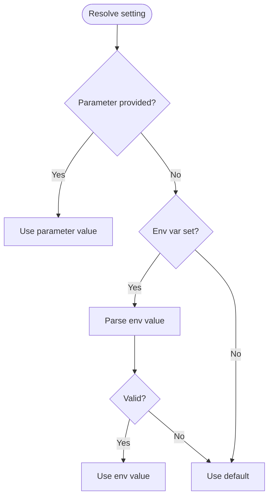

# SSH MCP Configuration Guide (v7.0)

Every tunable on the v7.0 ssh-mcp server: env vars, parameter priority, validation ranges, plus a tuning guide for common deployment shapes (verbose shells, many subscribers, embedded / low-RAM, real-time interactive UX, rsync probe). Every legacy v4 var name, default, floor, and cap carries forward unchanged ([MIGRATION.md → v3 → v4](./MIGRATION.md#v3--v4)). v5 adds the lifecycle / lane / mux / daemon families; v6.0 only renames tool strings; v6.1 adds resume / verify on `ssh_upload` / `ssh_download` (no new env vars); **v7.0 adds three rsync probe / planner knobs** (`SSH_RSYNC_PROBE_TIMEOUT_MS`, `SSH_RSYNC_BLOCK_SIZE`, `SSH_RSYNC_FILE_LIST_LIMIT`) on top of an env-var surface byte-identical to v5.3.x.

> **v7.0 — three new env vars (rsync only).** Every existing var carries forward byte-identical from v6.x. The deployed-agent path was retracted in v7.0.0-alpha.2; agent-cache env vars (`SSH_RSYNC_AGENT_CACHE_TTL_DAYS`, `SSH_RSYNC_AGENT_CACHE_DIR`) from the original plan were dropped. See [v7.0 / ADR 0011 — rsync hybrid transport](#v70--adr-0011--rsync-hybrid-transport-3-env-vars) below.

[[_TOC_]]

## Configuration priority

Every tunable resolves through a three-tier chain:


```mermaid
flowchart LR
    P1["1. Function parameter"] --> P2["2. Environment variable"]
    P2 --> P3["3. Built-in default"]

    style P1 fill:#4caf50,color:#fff
    style P2 fill:#ff9800,color:#fff
    style P3 fill:#9e9e9e,color:#fff
```

- **Parameter** — explicitly provided per tool call (highest priority).
- **Env var** — read once per resolve call; values that fail to parse fall through to the next tier.
- **Default** — built-in fallback (lowest priority).


```mermaid
flowchart TD
    Start([Resolve setting]) --> CheckParam{Parameter provided?}
    CheckParam -->|Yes| UseParam[Use parameter value]
    CheckParam -->|No| CheckEnv{Env var set?}
    CheckEnv -->|Yes| ParseEnv[Parse env value]
    CheckEnv -->|No| UseDefault[Use default]
    ParseEnv --> ValidEnv{Valid?}
    ValidEnv -->|Yes| UseEnv[Use env value]
    ValidEnv -->|No| UseDefault
```

Per-call parameter overrides are documented per tool in [API.md](./API.md). The rest of this document focuses on env vars.

## Connection

| Variable | Type | Default | Range | Description |
|----------|------|---------|-------|-------------|
| `SSH_CONNECT_TIMEOUT` | `u64` (s) | `30` | `>= 1` | Connection timeout used by `ssh_connect`. |
| `SSH_COMMAND_TIMEOUT` | `u64` (s) | `180` | `>= 1` | Default per-command execution timeout. Override per call via `ssh_exec.timeout_secs`. |
| `SSH_MAX_RETRIES` | `u32` | `3` | `>= 0` | Retry attempts on transient handshake failures. |
| `SSH_RETRY_DELAY_MS` | `u64` (ms) | `1000` | capped at `10 000` | Initial retry delay. Exponential backoff capped at 10 s. |
| `SSH_INACTIVITY_TIMEOUT` | `u64` (s) | `300` | `>= 0` | Session inactivity timeout. Ignored when `persistent=true` on `ssh_connect`. |
| `SSH_COMPRESSION` | `bool` | `true` | — | Enable zlib compression (`true`/`TRUE`/`1` enable; `false`/`FALSE`/`0` disable). |

## Command execution

| Variable | Type | Default | Range | Description |
|----------|------|---------|-------|-------------|
| `SSH_COMMAND_CLEANUP_TTL` | `u64` (s) | `60` | `>= 0` | TTL before unread completed-command output is GC'd from the command repository. Reading consumes the entry after a 1 s post-read grace window. |
| `SSH_COMMAND_MAX_BUFFER_SIZE` | bytes (`b/k/m/g/t`) | `10m` | `>= 1` | Per-command stdout/stderr cap. Oldest bytes are head-drained when exceeded. |
| `SSH_MCP_OUTPUT_DEFAULT_BYTES` | `usize` | `16384` | `>= 1` | Default `max_output_bytes` applied to output-returning tools. |
| `SSH_MCP_OUTPUT_MAX_BYTES_CAP` | `usize` | `1048576` | `>= 1` | Hard cap on `max_output_bytes` regardless of caller request. |
| `SSH_MCP_LIST_MAX_ITEMS` | `usize` | `500` | `>= 1` | Default `max_items` returned by `ssh_sessions` and `ssh_commands`. |
| `SSH_MCP_LIST_MAX_ITEMS_CAP` | `usize` | `10000` | `>= 1` | Hard cap on `max_items`. |

## Shell sessions

| Variable | Type | Default | Range | Description |
|----------|------|---------|-------|-------------|
| `SSH_SHELL_INACTIVITY_TTL` | `u64` (s) | `600` | `>= 0` | Auto-close interactive shells after N seconds of no read/write. Override per shell via `ssh_shell_open.inactivity_ttl`. |
| `SSH_SHELL_MAX_BUFFER_SIZE` | bytes (`b/k/m/g/t`) | `10m` | `>= 1` | Output buffer cap per shell. Oldest bytes head-drained. Override per shell via `ssh_shell_open.max_buffer_size`. |

## Transfers

| Variable | Type | Default | Range | Description |
|----------|------|---------|-------|-------------|
| `SSH_TRANSFER_CLEANUP_TTL` | `u64` (s) | `300` | `>= 0` | TTL before terminated (completed/failed/cancelled) transfers are removed from the transfer repository. Gives clients a window to poll the final state. |

### v6.1 / ADR 0010 — resume + verify (no new env vars)

The ADR 0010 resume primitive is purely runtime opt-in via two `bool?` request flags (`resume`, `verify`) on `ssh_upload` / `ssh_download`. There are **no new environment variables**:

- Chunk size, debouncer windows, lag policies, per-transfer broadcast cap, and lifecycle bindings are inherited byte-for-byte from v6.0.
- The `verify=true` hash command runs through the existing `ssh_exec` path; its O(offset) cost is documented in [API.md → ssh_upload](./API.md#ssh_upload) but is not configurable.
- Resume preflight pays at most one `metadata` round-trip on the SFTP channel; no caller-tunable cap exists.

If a future ADR introduces resume tuning knobs (chunk-size override, parallel hash threads, prefix-truncation policy), they will land here.

### v7.0 / ADR 0011 — rsync hybrid transport (3 env vars)

Three knobs governing the v7.0 rsync hybrid transport. The agent-cache env vars from the original v7.0 plan (`SSH_RSYNC_AGENT_CACHE_TTL_DAYS`, `SSH_RSYNC_AGENT_CACHE_DIR`) were dropped along with the agent path during the v7.0.0-alpha.2 architectural retrenchment — see [MIGRATION.md → v6.1 → v7.0](./MIGRATION.md#v61--v70).

| Variable | Type | Default | Description |
|----------|------|---------|-------------|
| `SSH_RSYNC_PROBE_TIMEOUT_MS` | `u64` (ms) | `2000` | Max wait for the `which rsync && rsync --version` probe before treating the host as having no rsync (Auto transport falls through to SFTP). |
| `SSH_RSYNC_BLOCK_SIZE` | `u32` (bytes) | `0` (auto: `sqrt(file_size)` rounded to 1 KiB) | Override the rolling-checksum block size on the Wire transport's block-match path. Smaller blocks yield finer deltas at the cost of larger signature footprints. SFTP transport ignores this knob. |
| `SSH_RSYNC_FILE_LIST_LIMIT` | `u64` (entries) | `1_000_000` | Max file-list size; both transports refuse with `RSYNC_FILE_LIST_TOO_LARGE` above this cap. Cure: tighten `opts.exclude` (`.git/`, `node_modules/`, `target/`, large generated trees) or raise this limit if the workload genuinely needs it. |

## Subscribe layer

The subscription layer (introduced in v3, preserved in v4) adds eight env vars covering broadcast channel sizing, debouncer timing, and peer GC. See [ARCHITECTURE.md](./ARCHITECTURE.md#subscribe-pipeline) for the producer → debouncer → notification pipeline.

### Broadcast channel capacities

Each `tokio::sync::broadcast` channel is sized at instance creation. Larger caps tolerate more subscriber lag at the cost of memory; smaller caps surface `RecvError::Lagged` faster.

| Variable | Type | Default | Floor | Cap | Description |
|----------|------|---------|-------|-----|-------------|
| `SSH_COMMAND_BROADCAST_CAP` | `usize` | `1024` | `16` | `65536` | Per-command output chunk channel (`OutputChunk`). |
| `SSH_SHELL_BROADCAST_CAP` | `usize` | `1024` | `16` | `65536` | Per-shell output chunk channel (`Bytes`). |
| `SSH_TRANSFER_BROADCAST_CAP` | `usize` | `256` | `8` | `4096` | Per-transfer progress channel (`ProgressEvent`). |
| `SSH_SESSION_BROADCAST_CAP` | `usize` | `256` | `8` | `4096` | Per-session health channel (`HealthEvent`). |
| `SSH_FORWARD_BROADCAST_CAP` | `usize` | `256` | `8` | `4096` | Per-forwarder events channel (`ForwardEvent`). Feature-gated under `port_forward`. |

### Debouncer timing

Per-resource debouncer behaviour. The same task drives all three timers via `tokio::select!`.

| Variable | Type | Default | Floor | Cap | Description |
|----------|------|---------|-------|-----|-------------|
| `SSH_NOTIFY_DEBOUNCE_MS` | `u64` (ms) | `1000` | `5` | `5000` | Debounce window. Producer pokes inside this window collapse into a single `notifications/resources/updated`. |
| `SSH_NOTIFY_FORCE_FLUSH_MS` | `u64` (ms) | `5000` | `100` | `60000` | Force-flush ticker. Guarantees a notification fires at least every N ms even when poke storms keep resetting the debouncer. |
| `SSH_NOTIFY_KEEPALIVE_S` | `u64` (s) | `30` | `5` | `300` | Keepalive ticker. Sends a notification this often even when no fresh data arrived (warms SSE / stdio frames). |
| `SSH_NOTIFY_FLUSH_BYTES` | `usize` (bytes) or bytesize string (`8k`, `64k`, `1m`, `1mib`) | `64k` (`65_536`) | `1024` | `1_048_576` | ADR 0006 Amendment 1 — byte-threshold flush. The per-resource debouncer flushes immediately when bytes-since-last-broadcast cross this value, regardless of `SSH_NOTIFY_DEBOUNCE_MS`. Set to `0` to disable byte-threshold (time-only debouncer, v5.0 behaviour). Hooked on `command://*/output` (stdout/stderr) and `transfer://*/progress` (per-chunk delta). |

### Peer GC

| Variable | Type | Default | Floor | Cap | Description |
|----------|------|---------|-------|-----|-------------|
| `SSH_MCP_PEER_GC_INTERVAL_S` | `u64` (s) | `30` | `5` | `300` | Interval at which each binary scans the subscription registry for peers whose rmcp transport has closed. rmcp 1.6 does not raise a callback on disconnect, so this scan is the only way to reclaim subscription state. |

### Subscriber lanes (v5 — ADR 0004 / 0006)

Per-`SubId` lane / `ChannelMux` / backpressure / replay tunables. Wired by the `composition::prod::build_use_cases` root.

| Variable | Type | Default | Floor | Cap | Description |
|----------|------|---------|-------|-----|-------------|
| `SSH_LANE_BUFFER` | `usize` | `1024` | `16` | `65536` | Per-`SubId` lane mpsc capacity. Each `sub_open` mints one lane with this many slots; the producer falls back to the lag policy when the lane fills. |
| `SSH_MUX_BUFFER` | `usize` | `8192` | `64` | `1048576` | `ChannelMux` outbound mpsc capacity (drained by the daemon writer / lane fanout bridge). |
| `SSH_MAX_SUBS_PER_URI` | `u16` | `16` | `1` | `u16::MAX` | Hard cap on lanes per resource URI. Returns `LANE_LIMIT_PER_URI` once exhausted. |
| `SSH_MAX_SUBS_TOTAL` | `u16` | `1024` | `1` | `u16::MAX` | Hard cap on lanes server-wide. Returns `LANE_LIMIT_TOTAL` once exhausted. |
| `SSH_LAG_POLICY_DEFAULT` | enum (`block_slow` / `drop_oldest` / `drop_newest` / `snapshot`) | `snapshot` | — | — | Default lag policy applied by `sub_open` when the call omits `lag_policy`. |
| `SSH_BP_BLOCK_TIMEOUT_MS` | `u64` (ms) | `5000` | `100` | `600000` | Maximum time the producer waits on `BlockSlow` before giving up and falling through to `Snapshot`. |
| `SSH_FILTER_REGEX_MAX` | `usize` (chars) | `1024` | `16` | `65536` | Maximum compiled regex length accepted by `sub_open.filter` / `sub_filter`. Returns `FILTER_INVALID` past the cap. |
| `SSH_REPLAY_WINDOW_BYTES` | `usize` (bytes) | `1048576` | `4096` | `67108864` | Default `sub_replay` window (bytes) when the call omits `bytes`. |
| `SSH_SUB_LEAK_RISK_WARN_S` | `u32` (s) | `2` | `1` | `3600` | Background scan period for the `SUB_LEAK_RISK` watcher (seconds). |
| `SSH_SUB_LEAK_RISK_KILL_S` | `u32` (s) | `0` | `0` | `86400` | Auto-kill threshold (seconds) for resources that stay subscriber-less longer than this. `0` disables auto-kill (warning-only). |

## Daemon (`ssh-mcp-tail`, v5 Phase 4 — ADR 0008)

Resolvers consumed only by the `ssh-mcp-tail` binary; the HTTP and stdio binaries never read these.

| Variable | Type | Default | Floor | Cap | Description |
|----------|------|---------|-------|-----|-------------|
| `SSH_NDJSON_LINE_MAX` | `usize` (bytes) | `1048576` | `1024` | `16777216` | Cap on a single NDJSON line received on the daemon's stdin. Lines past this are rejected with `LINE_TOO_LONG`. |
| `SSH_HEARTBEAT_INTERVAL_S` | `u64` (s) | `30` | `1` | `3600` | Heartbeat emit interval. The daemon emits an `ev=heartbeat` line this often even when no other event arrives. |
| `SSH_DAEMON_STATS_INTERVAL_S` | `u64` (s) | `60` | `1` | `3600` | `ev=daemon_stats` emit interval (lane counts, bytes / events served, error tallies). |
| `SSH_GRACE_HARD_TIMEOUT_S` | `u64` (s) | `30` | `1` | `3600` | Hard-shutdown deadline on SIGTERM / SIGINT / SIGHUP. The daemon drains lanes for up to this long before force-closing. |
| `SSH_NDJSON_PRETTY` | `bool` | `false` | — | — | When `true` / `1` / `yes`, the daemon pretty-prints outbound NDJSON (one event per multiple lines). Off by default — strict NDJSON producers expect compact one-line-per-event. |

## Idempotency cache (v4.7)

The v4.7 idempotency wrapper deduplicates retries of mutating tools when the caller passes `_meta.idempotency_key` (1..=256 bytes). Key + tool tuple is cached in a per-process DashMap; a hit within the TTL returns the cached `CallToolResult` verbatim (Markdown body + structured payload).

| Variable | Type | Default | Range | Description |
|----------|------|---------|-------|-------------|
| `SSH_IDEMPOTENCY_TTL_SECS` | `u64` (s) | `300` | `>= 1` | Idempotency cache TTL. Override via positive integer; otherwise default. |
| `SSH_IDEMPOTENCY_MAX_ENTRIES` | `usize` | `1024` | `>= 1` | Soft cap on cache entries. When reached, oldest entries (by `inserted_at`) are pruned. |

The `IDEMPOTENCY_KEY_MAX_BYTES` cap (256 bytes, `IDEMPOTENCY_KEY_TOO_LONG` on overflow) is hard-coded — UUIDv4 (36 bytes) and similar identifiers fit comfortably. Read-only tools (`ssh_list_*`, `ssh_get_*`, `ssh_shell_read`, `ssh_shell_wait_for`) ignore the key. Reference: `src/infra/mcp/idempotency.rs`.

## Initial buffer peek on ssh_shell_open (v4.7)

When the PTY emits stdout within ~100 ms after `ssh_shell_open`, the response embeds an `INITIAL_BUFFER:` Markdown line and a structured `initial_buffer` field. Smaller LLMs that follow the `subscribe -> read` pattern can sometimes skip the first `resources/read` round-trip when the prompt is already visible.

| Variable | Type | Default | Range | Description |
|----------|------|---------|-------|-------------|
| `SSH_SHELL_OPEN_INITIAL_PEEK_MS` | `u64` (ms) | `100` | `>= 0` | Total budget the open call spends peeking for stdout before returning. |
| `SSH_SHELL_OPEN_INITIAL_PEEK_TICK_MS` | `u64` (ms) | `5` | `>= 1` | Polling tick within the budget; lower values catch the first chunk faster but cost CPU. |
| `SSH_SHELL_OPEN_INITIAL_BUFFER_MAX_BYTES` | `usize` | `4096` | `>= 1` | Hard cap on the rendered slice (head bytes; tail dropped on overflow). |

Reference: `src/infra/mcp/render/shell.rs::shell_open_render_with_initial`.

## Server transport

| Variable | Type | Default | Range | Description |
|----------|------|---------|-------|-------------|
| `MCP_HOST` | `string` | `0.0.0.0` | — | HTTP transport bind address (binary `ssh-mcp` only). |
| `MCP_PORT` | `u16` | `8000` | `1..=65535` | HTTP transport port. |
| `MCP_HTTP_PATH` | `string` | `/` | — | Mount path for the rmcp `StreamableHttpService`. |
| `RUST_LOG` | tracing filter | `info` | — | `tracing-subscriber` env filter. Stdio transport writes logs to stderr; HTTP transport writes to stdout. |

The stdio transport (`ssh-mcp-stdio`) ignores `MCP_HOST` / `MCP_PORT` / `MCP_HTTP_PATH` — JSON-RPC is fixed on stdin/stdout.

## Tuning guide

Pick a profile based on the dominant workload. All profiles keep the parameter / env / default chain intact — set the env vars system-wide via `.env` or systemd `Environment=` lines.

### Profile A — verbose shells (high-throughput PTY)

When shells produce thousands of lines per second (e.g. `tail -f` on busy logs, build pipelines), grow the broadcast channels and the per-shell buffer.

```bash
export SSH_SHELL_MAX_BUFFER_SIZE=64m
export SSH_SHELL_BROADCAST_CAP=8192
export SSH_COMMAND_BROADCAST_CAP=8192
export SSH_NOTIFY_DEBOUNCE_MS=100   # coalesce more aggressively
export SSH_NOTIFY_FORCE_FLUSH_MS=500
```

The bigger buffer absorbs spikes; the wider broadcast tolerates slow subscribers without `Lagged`. Bumping `SSH_NOTIFY_DEBOUNCE_MS` to `100` ms collapses more producer pokes into one outbound notification.

### Profile B — many subscribers per resource

Several agents subscribed to the same shell or command. Coalesce more aggressively to keep notification volume bounded:

```bash
export SSH_NOTIFY_DEBOUNCE_MS=200
export SSH_NOTIFY_FORCE_FLUSH_MS=1000
export SSH_NOTIFY_KEEPALIVE_S=60
```

Each subscriber still pulls deltas via `resources/read?cursor=auto`; the debouncer only changes how often the server pushes the `updated` notification.

### Profile C — embedded / low-RAM hosts

When memory is tight (containers <= 256 MB, embedded gateways), shrink buffers and channels:

```bash
export SSH_SHELL_MAX_BUFFER_SIZE=512k
export SSH_COMMAND_MAX_BUFFER_SIZE=512k
export SSH_SHELL_BROADCAST_CAP=64
export SSH_COMMAND_BROADCAST_CAP=64
export SSH_TRANSFER_BROADCAST_CAP=16
export SSH_SESSION_BROADCAST_CAP=16
export SSH_FORWARD_BROADCAST_CAP=16
export SSH_MCP_OUTPUT_DEFAULT_BYTES=4096
export SSH_MCP_OUTPUT_MAX_BYTES_CAP=131072
export SSH_MCP_LIST_MAX_ITEMS=100
```

Expect more `Lagged` events under load; clients should detect gaps via `_meta.last_seq` and resync via `resources/read?cursor=0` (see [OPERATIONS.md → Subscriber lagged + auto-recovery](./OPERATIONS.md#subscriber-lagged--auto-recovery)).

### Profile D — real-time interactive UX

When end-users wait on the rendered output (TUIs, REPL-like flows), keep notifications snappy:

```bash
export SSH_NOTIFY_DEBOUNCE_MS=20
export SSH_NOTIFY_FORCE_FLUSH_MS=200
export SSH_NOTIFY_KEEPALIVE_S=10
export SSH_MCP_PEER_GC_INTERVAL_S=10
```

A 20 ms debounce keeps p95 round-trip < 50 ms; a 10 s keepalive frequently warms SSE frames so proxies do not reset idle connections.

## Validation behaviour

- **Out-of-range values are clamped.** For example, setting `SSH_NOTIFY_DEBOUNCE_MS=99999` resolves to `5000` (the cap); `SSH_SHELL_BROADCAST_CAP=2` resolves to `16` (the floor).
- **Unparseable values fall back to the default.** `SSH_NOTIFY_DEBOUNCE_MS=banana` resolves to `1000`.
- **Boolean parsing** accepts `true`/`TRUE`/`1` for true, `false`/`FALSE`/`0` for false. Anything else is treated as false.
- **Byte-size suffixes** (`SSH_SHELL_MAX_BUFFER_SIZE`, `SSH_COMMAND_MAX_BUFFER_SIZE`) accept plain bytes or `b/k/kb/m/mb/g/gb/t/tb` (case-insensitive).
- **Compression**: `SSH_COMPRESSION` is the only setting where falling through to default is `true`; every other env var without a value defaults to its built-in.

## Cross-references

- Tool reference: [API.md](./API.md)
- Lock-free design and subscribe pipeline: [ARCHITECTURE.md](./ARCHITECTURE.md)
- End-to-end workflows: [DEVELOPMENT.md → Hot-path sequence diagrams](./DEVELOPMENT.md#hot-path-sequence-diagrams) / [OPERATIONS.md → Recovery flows](./OPERATIONS.md#recovery-flows)
