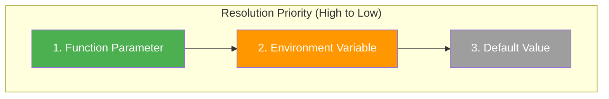
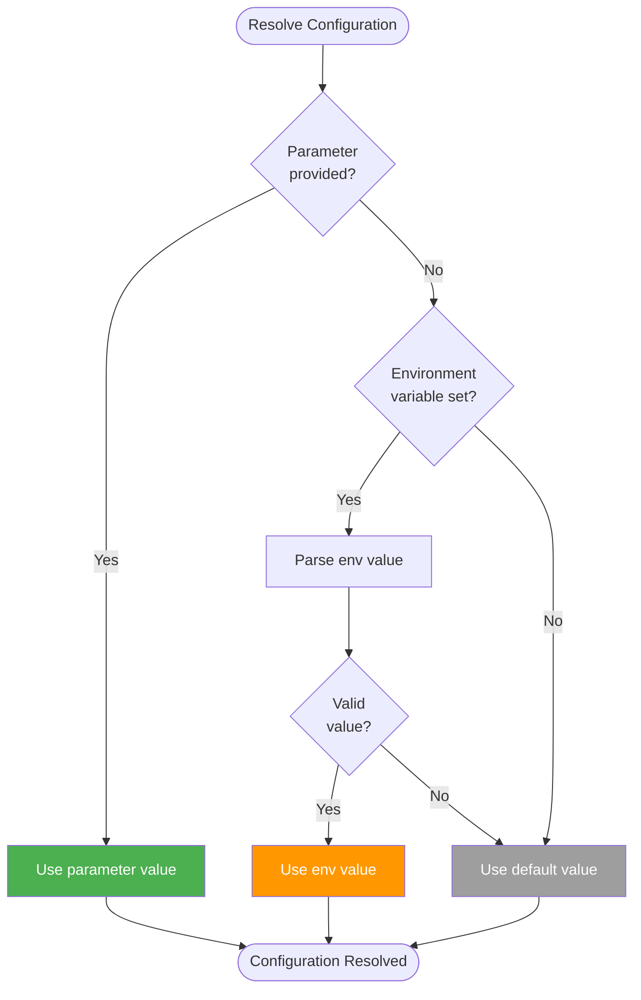

# SSH MCP Configuration Guide

This document provides a comprehensive guide to configuring the SSH MCP server: environment variables, parameter priority, resource limits, and example deployments.

## Table of Contents

[[_TOC_]]

## Configuration Priority

All configuration settings follow a consistent priority chain:

<details>
<summary>Priority resolution diagram</summary>


```mermaid
flowchart LR
    subgraph Priority["Resolution Priority (High to Low)"]
        direction LR
        P1["1. Function Parameter"]
        P2["2. Environment Variable"]
        P3["3. Default Value"]

        P1 --> P2
        P2 --> P3
    end

    style P1 fill:#4caf50,color:#fff
    style P2 fill:#ff9800,color:#fff
    style P3 fill:#9e9e9e,color:#fff
```

</details>

### Resolution Flow

<details>
<summary>Resolution flow diagram</summary>


```mermaid
flowchart TD
    Start([Resolve Configuration]) --> CheckParam{Parameter<br/>provided?}

    CheckParam -->|Yes| UseParam["Use parameter value"]
    CheckParam -->|No| CheckEnv{Environment<br/>variable set?}

    CheckEnv -->|Yes| ParseEnv["Parse env value"]
    CheckEnv -->|No| UseDefault["Use default value"]

    ParseEnv --> ValidEnv{Valid<br/>value?}
    ValidEnv -->|Yes| UseEnv["Use env value"]
    ValidEnv -->|No| UseDefault

    UseParam --> Done([Configuration Resolved])
    UseEnv --> Done
    UseDefault --> Done

    style UseParam fill:#4caf50,color:#fff
    style UseEnv fill:#ff9800,color:#fff
    style UseDefault fill:#9e9e9e,color:#fff
```

</details>

This priority system lets you:

- Set organization-wide defaults via environment variables.
- Override per-request via tool parameters.
- Fall back to sensible defaults when nothing is specified.

### Session-Level Options

Some options are only configurable per-session via tool parameters:

| Parameter | Type | Default | Description |
|-----------|------|---------|-------------|
| `name` | `string` | `null` | Human-readable session name, surfaced in `ssh_list_sessions` and the `SUGGESTED` reuse response. |
| `persistent` | `bool` | `false` | Disable inactivity timeout — the session stays alive until explicitly disconnected. |
| `reuse` | `string` | `"suggest"` | Smart reuse policy (`"suggest"`, `"auto"`, `"force_new"`). See [Smart Session Reuse](#smart-session-reuse). |
| `agent_id` | `string` | `null` | Group sessions for bulk cleanup via `ssh_disconnect_agent`. |

## Environment Variables

### Connection Settings

| Variable | Type | Default | Description |
|----------|------|---------|-------------|
| `SSH_CONNECT_TIMEOUT` | `u64` | `30` | Connection timeout in seconds. |
| `SSH_COMMAND_TIMEOUT` | `u64` | `180` | Command execution timeout in seconds. |
| `SSH_MAX_RETRIES` | `u32` | `3` | Maximum retry attempts for transient failures. |
| `SSH_RETRY_DELAY_MS` | `u64` | `1000` | Initial retry delay (milliseconds). Exponential backoff capped at 10 s with jitter. |
| `SSH_INACTIVITY_TIMEOUT` | `u64` | `300` | Session inactivity timeout in seconds. Ignored when `persistent=true`. |
| `SSH_COMPRESSION` | `bool` | `true` | Enable zlib compression (`true`, `TRUE`, `1`, or `false`, `FALSE`, `0`, or any other value → false). |

### Background Work TTLs & Caps

| Variable | Type | Default | Description |
|----------|------|---------|-------------|
| `SSH_COMMAND_CLEANUP_TTL` | `u64` seconds | `60` | How long a completed command stays in storage before removal when the caller never reads its output. Reading consumes the entry after a 1 s post-read grace window. |
| `SSH_COMMAND_MAX_BUFFER_SIZE` | bytes | `10m` | Per-command stdout/stderr cap. Oldest bytes are drained head-first when exceeded. Accepts plain bytes or suffixes `b/k/kb/m/mb/g/gb/t/tb`. |
| `SSH_SHELL_INACTIVITY_TTL` | `u64` seconds | `600` | Auto-close a shell after this many seconds with no read/write activity. Overridable per-shell via `ssh_shell_open(inactivity_ttl=...)`. |
| `SSH_SHELL_MAX_BUFFER_SIZE` | bytes | `10m` | Shell output buffer cap. Oldest bytes are trimmed when exceeded. Same suffixes as above. Overridable per-shell via `ssh_shell_open(max_buffer_size="...")`. |
| `SSH_TRANSFER_CLEANUP_TTL` | `u64` seconds | `300` | How long a terminated transfer (Completed / Failed / Cancelled) stays in storage before being removed. |

### Output and List Budgets

| Variable | Type | Default | Description |
|----------|------|---------|-------------|
| `SSH_MCP_OUTPUT_DEFAULT_BYTES` | `usize` | `16384` | Default `max_output_bytes` applied to `ssh_get_command_output`, `ssh_shell_read`, `ssh_cancel_command`. |
| `SSH_MCP_OUTPUT_MAX_BYTES_CAP` | `usize` | `1048576` | Hard cap on `max_output_bytes` (1 MiB). |
| `SSH_MCP_LIST_MAX_ITEMS` | `usize` | `500` | Default `max_items` for `ssh_list_sessions` and `ssh_list_commands`. |
| `SSH_MCP_LIST_MAX_ITEMS_CAP` | `usize` | `10000` | Hard cap on `max_items`. |

### Server Settings

| Variable | Type | Default | Description |
|----------|------|---------|-------------|
| `MCP_HOST` | `string` | `0.0.0.0` | HTTP server bind address (only for `ssh-mcp` binary). |
| `MCP_PORT` | `u16` | `8000` | HTTP server port (only for `ssh-mcp` binary). |
| `RUST_LOG` | `string` | `info` | Log level filter (see [Tracing and Logging](#tracing-and-logging)). |

### SSH Agent Settings

| Variable | Type | Default | Description |
|----------|------|---------|-------------|
| `SSH_AUTH_SOCK` | `string` | (system) | Path to SSH agent socket (see [SSH Agent Authentication](#ssh-agent-authentication)). |

### Variable Details

#### SSH_CONNECT_TIMEOUT

Controls how long to wait for the initial TCP connection plus SSH handshake.

```bash
export SSH_CONNECT_TIMEOUT=60
```

> [!tip]
> - Too short: connections fail on high-latency networks.
> - Too long: slow failure detection for unreachable hosts.
> - Recommended: 30–60 s for most environments.

#### SSH_COMMAND_TIMEOUT

Maximum time allowed for command execution.

```bash
export SSH_COMMAND_TIMEOUT=300
```

> [!note]
> When a command times out, the tool response is `SSH_GET_COMMAND_OUTPUT: TIMEOUT` with `(partial)` output blocks — the session itself stays connected.

#### SSH_MAX_RETRIES

Number of retry attempts after the initial failure.

```bash
export SSH_MAX_RETRIES=5
```

- `0` → no retries (fail immediately on the first attempt).
- Only applies to **transient** errors (connection refused, timeout, ...). Auth failures are never retried.

#### SSH_RETRY_DELAY_MS

Initial delay before the first retry. Exponential backoff with jitter, capped at 10 s.

```bash
export SSH_RETRY_DELAY_MS=2000
```

Backoff timeline with `SSH_RETRY_DELAY_MS=1000`:

- Attempt 1: immediate
- Retry 1: ~1 s
- Retry 2: ~2 s
- Retry 3: ~4 s
- Retry 4: ~8 s
- Retry 5+: ~10 s (capped)

#### SSH_INACTIVITY_TIMEOUT

How long an idle non-persistent session can remain open before russh closes it.

```bash
export SSH_INACTIVITY_TIMEOUT=600
```

> [!tip]
> - Ignored when `persistent=true` was passed to `ssh_connect`.
> - Keepalive packets (30 s interval, max 3 failures) are emitted separately — they exist to prevent network equipment from dropping idle connections, not to refresh the inactivity timer.
> - Default 300 s (5 min) is suitable for interactive use.
> - Set higher for workflows that pause between commands.

#### SSH_COMPRESSION

Enable / disable zlib compression on the SSH connection.

```bash
export SSH_COMPRESSION=false
```

**Accepted values:**

- Enable: `true`, `TRUE`, `1`.
- Disable: `false`, `FALSE`, `0`, or any other value that doesn't match the truthy list.

> [!tip]
> - Enable for: high-latency networks, large data transfers.
> - Disable for: low-latency networks, CPU-constrained systems.

#### SSH_COMMAND_CLEANUP_TTL

TTL applied by the command cleanup task to **unread** completed commands.

```bash
export SSH_COMMAND_CLEANUP_TTL=120
```

Mechanics:

- After the command leaves `Running` the cleanup task polls every second.
- If the caller has read the output (`output_read` flag is set), cleanup happens after a 1 s grace window.
- Otherwise the task waits up to `SSH_COMMAND_CLEANUP_TTL` seconds before removing the entry from storage.

#### SSH_COMMAND_MAX_BUFFER_SIZE

Head-drained cap for per-command stdout/stderr. Applies independently to each stream.

```bash
export SSH_COMMAND_MAX_BUFFER_SIZE=50m
```

Behavior when the cap is exceeded:

1. The oldest bytes are drained from the front of the buffer (`Vec::drain(..excess)`).
2. If the buffer's capacity dwarfs its length (≥4×), `shrink_to_fit()` is called to release memory.
3. The cap applies to the buffer as it accumulates — what the LLM sees via `max_output_bytes` is an additional tail-size filter on top.

Setting the cap to `0` disables the limit (the buffer grows unbounded).

#### SSH_SHELL_INACTIVITY_TTL

Auto-closes shells with no read or write activity for the TTL.

```bash
export SSH_SHELL_INACTIVITY_TTL=1800
```

- Every `ssh_shell_write` / `ssh_shell_read` resets `last_activity`.
- The shell inactivity task polls every 5 s.
- When triggered, it cancels the reader task and closes the `ChannelWriter`.

#### SSH_SHELL_MAX_BUFFER_SIZE

Head-drained cap for the shell's continuous output buffer.

```bash
export SSH_SHELL_MAX_BUFFER_SIZE=25m
```

Uses the same byte-size parser as `SSH_COMMAND_MAX_BUFFER_SIZE`. The `ssh_shell_read` tool renders the **tail** of the buffer (bounded by `max_output_bytes`), while this cap bounds the buffer itself.

#### SSH_TRANSFER_CLEANUP_TTL

TTL applied per terminated transfer (Completed, Failed, Cancelled).

```bash
export SSH_TRANSFER_CLEANUP_TTL=600
```

- The cleanup task spawns alongside each transfer when it is registered.
- It waits for the transfer to leave `Running`, sleeps for the TTL, then removes the entry from `TRANSFER_STORAGE`.
- This gives the LLM a fixed window to poll the final state before it disappears.

#### SSH_MCP_OUTPUT_DEFAULT_BYTES / SSH_MCP_OUTPUT_MAX_BYTES_CAP

Control the `max_output_bytes` parameter shared by `ssh_get_command_output`, `ssh_shell_read`, and `ssh_cancel_command`.

```bash
export SSH_MCP_OUTPUT_DEFAULT_BYTES=32768   # 32 KiB default
export SSH_MCP_OUTPUT_MAX_BYTES_CAP=524288  # 512 KiB hard cap
```

Priority: **caller parameter** → `SSH_MCP_OUTPUT_DEFAULT_BYTES` → `16384` → clamped to `SSH_MCP_OUTPUT_MAX_BYTES_CAP` (defaults to 1 MiB).

#### SSH_MCP_LIST_MAX_ITEMS / SSH_MCP_LIST_MAX_ITEMS_CAP

Control `max_items` for `ssh_list_sessions` / `ssh_list_commands`.

```bash
export SSH_MCP_LIST_MAX_ITEMS=250
export SSH_MCP_LIST_MAX_ITEMS_CAP=5000
```

Priority: **caller parameter** → `SSH_MCP_LIST_MAX_ITEMS` → `500` → clamped to `SSH_MCP_LIST_MAX_ITEMS_CAP` (defaults to 10 000). The effective value is always within `[1, cap]`.

## Byte Size Parsing

Buffer-size variables (`SSH_COMMAND_MAX_BUFFER_SIZE`, `SSH_SHELL_MAX_BUFFER_SIZE`) and the `max_buffer_size` parameter of `ssh_shell_open` accept a compact, case-insensitive format handled by `config::parse_byte_size`:

| Suffix (case-insensitive) | Multiplier |
|---------------------------|-----------|
| (none) | 1 (bytes) |
| `b` | 1 |
| `k` / `kb` | 1 024 |
| `m` / `mb` | 1 024² |
| `g` / `gb` | 1 024³ |
| `t` / `tb` | 1 024⁴ |

Examples:

```
"1024"      -> 1024 bytes
"100b"      -> 100 bytes
"512k"      -> 524 288 bytes
"512kb"     -> 524 288 bytes
"10m"       -> 10 485 760 bytes
"10mb"      -> 10 485 760 bytes
"1g"        -> 1 073 741 824 bytes
"2gb"       -> 2 147 483 648 bytes
"1t"        -> 1 099 511 627 776 bytes
```

Invalid values (empty string, non-numeric, `m` alone, ...) are ignored and the default is used. Leading/trailing whitespace is trimmed before parsing.

## Smart Session Reuse

`ssh_connect` supports three reuse policies keyed on the identity triple `(host_lowercase, port, username)`:

| `reuse` | Behavior |
|---------|----------|
| `"suggest"` (default) | Returns `SSH_CONNECT: SUGGESTED` listing healthy matches without opening a new connection. |
| `"auto"` | Returns `SSH_CONNECT: REUSED` with the most recent healthy match and skips opening a new connection. |
| `"force_new"` | Skips the identity lookup completely and always opens a new connection. |

In every mode, unhealthy matches are disconnected before a new session is created and reported via `REPLACED: N`. Health checks are 5 s `echo 1` probes executed via the short-lived synchronous `execute_ssh_command` path.

## Session Naming and Persistence

### Session Names

The `name` parameter attaches a human-readable label to a session so LLMs can refer to it intuitively.

```json
{
  "tool": "ssh_connect",
  "arguments": {
    "address": "db.example.com:22",
    "username": "admin",
    "name": "production-database"
  }
}
```

Names are:

- Optional (`null` by default).
- Not required to be unique.
- Shown as `[name: production-database]` decoration in `ssh_list_sessions` and the multi-match `SUGGESTED` output.
- **Not** a replacement for `SESSION_ID` — UUIDs remain the authoritative identifier.

### Persistent Sessions

`persistent=true` asks the server to build the russh client config with `inactivity_timeout: None`. The SSH keepalive interval (30 s) and the 3-keepalive max still apply so network equipment cannot silently drop the connection.

```json
{
  "tool": "ssh_connect",
  "arguments": {
    "address": "worker.example.com:22",
    "username": "deploy",
    "persistent": true
  }
}
```

Persistent sessions stay alive until:

- The caller issues `ssh_disconnect` (or `ssh_disconnect_agent`).
- The remote server closes the connection.
- The SSH MCP process terminates.

The response includes `PERSISTENT: true` on the `SSH_CONNECT: OK` block.

## Async Command Limits

| Limit | Value | Source |
|-------|-------|--------|
| Max running async commands per session | `100` | `MAX_ASYNC_COMMANDS_PER_SESSION` (`src/mcp/async_command.rs`). |
| Russh channels opened simultaneously per session | `1` | `CHANNEL_CONCURRENCY_PER_SESSION` (serialized via `Semaphore`). |
| Command timeout (default) | 180 s | `SSH_COMMAND_TIMEOUT`. |
| Wait-timeout default for `ssh_get_command_output` / `ssh_get_transfer_progress` | 30 s | Clamped at 300 s by the tool. |
| Command buffer cap (stdout and stderr each) | 10 MiB | `SSH_COMMAND_MAX_BUFFER_SIZE`. |
| Command cleanup TTL (unread) | 60 s | `SSH_COMMAND_CLEANUP_TTL`. Reading marks `output_read` and cleanup happens after a 1 s grace window. |

### Timeout Behavior

When an async command exceeds its timeout:

- The task sets `timed_out = true` and closes the channel.
- The status transitions to `Completed` (with `EXIT: -1` if no exit code was ever received).
- The tool response becomes `SSH_GET_COMMAND_OUTPUT: TIMEOUT` with `(partial)` blocks.

### Retrieving Output

```json
{
  "tool": "ssh_get_command_output",
  "arguments": {
    "command_id": "cmd-456",
    "wait": true,
    "wait_timeout_secs": 60,
    "max_output_bytes": 65536
  }
}
```

- `wait_timeout_secs` default is 30, max 300. Set to 0 for non-blocking.
- `max_output_bytes` default / cap use the `SSH_MCP_OUTPUT_*` variables.
- Reading any amount of output consumes the entry (after a 1 s grace window). A second read before cleanup still works.

### Automatic Cleanup

- **Session disconnect** (`ssh_disconnect` / `ssh_disconnect_agent`) cancels all running commands and unregisters them.
- **Session inactivity timeout** (for non-persistent sessions) will eventually close the underlying russh handle, which causes the background tasks to transition to `Failed` and then clean up.
- **Server shutdown** aborts all tokio tasks.

### Best Practices

1. **Monitor active commands** — use `ssh_list_commands` before starting new ones to avoid hitting the 100-cap.
2. **Tune timeouts** — set `SSH_COMMAND_TIMEOUT` or per-call `timeout_secs` based on your longest expected command.
3. **Respect head-draining** — when commands emit enormous output, expect to see only the tail. Design tools to print important data toward the end or dedicate a shell session to capture full logs.
4. **Clean up explicitly** — cancel unused commands and disconnect sessions when work ends.

## Interactive Shell Limits

| Limit | Value | Source |
|-------|-------|--------|
| Max shells per session | `10` | `MAX_SHELLS_PER_SESSION` (`src/mcp/shell.rs`). |
| Shell inactivity TTL (default) | 600 s | `SSH_SHELL_INACTIVITY_TTL` / `ssh_shell_open(inactivity_ttl=...)`. |
| Shell buffer cap (default) | 10 MiB | `SSH_SHELL_MAX_BUFFER_SIZE` / `ssh_shell_open(max_buffer_size=...)`. |

`ssh_shell_read(clear=true)` (default) performs head-based pagination: it removes only the bytes actually shown in the response and keeps the rest available for the next call.

## SFTP Limits

| Limit | Value | Source |
|-------|-------|--------|
| Max transfers per session | `10` | `MAX_TRANSFERS_PER_SESSION` (`src/mcp/transfer.rs`). |
| Streaming chunk size | 32 KiB | `CHUNK_SIZE`. |
| Transfer cleanup TTL | 300 s | `SSH_TRANSFER_CLEANUP_TTL`. |

## Tracing and Logging

SSH MCP uses `tracing` + `tracing-subscriber`. `RUST_LOG` controls the directive:

| Level | Use |
|-------|-----|
| `error` | Critical failures that prevent operation. |
| `warn` | Warning conditions that may indicate problems. |
| `info` | Normal operation (default). |
| `debug` | Detailed debugging information. |
| `trace` | Very detailed per-message tracing. |

### Setting the Log Level

```bash
# Global
export RUST_LOG=debug

# Module-specific
export RUST_LOG=ssh_mcp=debug,poem=info

# SSH subtree only
export RUST_LOG=ssh_mcp::mcp=trace

# Minimal
export RUST_LOG=warn
```

### Log Output Destination

- **ssh-mcp** (HTTP server): logs to stdout.
- **ssh-mcp-stdio**: logs to **stderr** — critical because stdout carries the JSON-RPC protocol.

### Example Log Output

```
2026-04-18T10:30:45.123Z INFO ssh_mcp::mcp::commands: Attempting SSH to deploy@prod-server:22 timeout=30s retries=3 delay=1000ms compress=true persistent=false name=Some("prod") agent=Some("ci-bot")
2026-04-18T10:30:45.456Z DEBUG ssh_mcp::mcp::auth::chain: Trying authentication strategy: agent
2026-04-18T10:30:46.123Z INFO ssh_mcp::mcp::commands: Starting async command abc123 on session def456: npm run build
```

## SSH Agent Authentication

When neither `password` nor `key_path` is provided (and no default OpenSSH key is found in `~/.ssh/`), the chain falls through to `AgentAuth`.

### How It Works

1. `keys::agent::AgentClient::connect_env()` opens the socket at `SSH_AUTH_SOCK`.
2. The agent's identities are requested and tried sequentially.
3. Each identity negotiates the RSA hash via `best_supported_rsa_hash()` (only matters for RSA keys).

### Prerequisites

```bash
eval "$(ssh-agent -s)"
ssh-add ~/.ssh/id_ed25519
ssh-add -l   # verify keys are loaded
```

### SSH_AUTH_SOCK

```bash
echo $SSH_AUTH_SOCK
# e.g. /private/tmp/com.apple.launchd.ABCDE/Listeners
```

### MCP Client Configuration

When using stdio with a client that doesn't inherit your shell environment:

```json
{
  "mcpServers": {
    "ssh": {
      "command": "/usr/local/bin/ssh-mcp-stdio",
      "env": {
        "SSH_AUTH_SOCK": "/run/user/1000/ssh-agent.socket"
      }
    }
  }
}
```

> [!note]
> On macOS the socket path is ephemeral; prefer `"${SSH_AUTH_SOCK}"` when your client supports variable expansion.

## RSA Signature Algorithm

`KeyAuth` and `AgentAuth` automatically negotiate the best RSA hash via `best_supported_rsa_hash()`. The returned algorithm (`rsa-sha2-512` > `rsa-sha2-256` > legacy `ssh-rsa`) is wrapped into the key via `PrivateKeyWithHashAlg`. Nothing to configure — the negotiation runs transparently.

If you hit RSA-auth failures, verify:

1. The key is valid and not corrupted.
2. The server accepts RSA (some only accept Ed25519).
3. For agent authentication, the key is properly loaded in `ssh-agent`.

## Feature Flags

| Feature | Default | Description |
|---------|---------|-------------|
| `port_forward` | Yes | Compiles `src/mcp/forward.rs` and wires `ssh_forward`. |

Build without port forwarding:

```bash
cargo build --release --no-default-features
```

When disabled, `ssh_forward` returns:

```
SSH_FORWARD: ERROR
REASON: [FEATURE_DISABLED] port forwarding feature is not enabled
DETAIL: rebuild with --features port_forward
```

## Example Configurations

<details>
<summary>Development environment</summary>

```bash
# Fast feedback, verbose logging, generous output budgets
export SSH_CONNECT_TIMEOUT=10
export SSH_COMMAND_TIMEOUT=60
export SSH_MAX_RETRIES=1
export SSH_RETRY_DELAY_MS=500
export SSH_COMPRESSION=false
export SSH_SHELL_INACTIVITY_TTL=1800
export SSH_MCP_OUTPUT_DEFAULT_BYTES=65536
export MCP_HOST=0.0.0.0
export MCP_PORT=8000
export RUST_LOG=debug
```

</details>

<details>
<summary>Production environment</summary>

```bash
# Reliability focus, conservative logging
export SSH_CONNECT_TIMEOUT=30
export SSH_COMMAND_TIMEOUT=300
export SSH_MAX_RETRIES=5
export SSH_RETRY_DELAY_MS=2000
export SSH_COMPRESSION=true
export SSH_COMMAND_CLEANUP_TTL=120
export SSH_TRANSFER_CLEANUP_TTL=600
export MCP_HOST=127.0.0.1
export MCP_PORT=8000
export RUST_LOG=info
```

</details>

<details>
<summary>High-latency network</summary>

```bash
# Satellite / intercontinental
export SSH_CONNECT_TIMEOUT=120
export SSH_COMMAND_TIMEOUT=600
export SSH_MAX_RETRIES=10
export SSH_RETRY_DELAY_MS=5000
export SSH_COMPRESSION=true
export SSH_INACTIVITY_TIMEOUT=900
```

</details>

<details>
<summary>Low-latency local network</summary>

```bash
# Local datacenter / LAN
export SSH_CONNECT_TIMEOUT=5
export SSH_COMMAND_TIMEOUT=60
export SSH_MAX_RETRIES=2
export SSH_RETRY_DELAY_MS=200
export SSH_COMPRESSION=false
export SSH_MCP_OUTPUT_DEFAULT_BYTES=131072
```

</details>

<details>
<summary>CI/CD pipeline</summary>

```bash
# Automated deployments
export SSH_CONNECT_TIMEOUT=30
export SSH_COMMAND_TIMEOUT=600
export SSH_MAX_RETRIES=3
export SSH_RETRY_DELAY_MS=1000
export SSH_COMPRESSION=true
export SSH_COMMAND_MAX_BUFFER_SIZE=50m
export RUST_LOG=warn
```

</details>

<details>
<summary>Shell-specific syntax examples</summary>

**Bash / Zsh (Linux, macOS):**

```bash
export SSH_CONNECT_TIMEOUT=30
export RUST_LOG=debug
```

**Fish:**

```fish
set -x SSH_CONNECT_TIMEOUT 30
set -x RUST_LOG debug
```

**PowerShell (Windows):**

```powershell
$env:SSH_CONNECT_TIMEOUT = "30"
$env:RUST_LOG = "debug"
```

**Inline for a single command:**

```bash
SSH_CONNECT_TIMEOUT=60 RUST_LOG=debug ./ssh-mcp-stdio
```

</details>

## MCP Client Configuration

<details>
<summary>Claude Desktop</summary>

Add to `claude_desktop_config.json`:

```json
{
  "mcpServers": {
    "ssh": {
      "command": "/usr/local/bin/ssh-mcp-stdio",
      "env": {
        "SSH_CONNECT_TIMEOUT": "30",
        "SSH_COMMAND_TIMEOUT": "180",
        "SSH_MAX_RETRIES": "3",
        "SSH_COMPRESSION": "true",
        "RUST_LOG": "info"
      }
    }
  }
}
```

</details>

<details>
<summary>Claude Desktop with SSH Agent (macOS)</summary>

```json
{
  "mcpServers": {
    "ssh": {
      "command": "/usr/local/bin/ssh-mcp-stdio",
      "env": {
        "SSH_CONNECT_TIMEOUT": "30",
        "SSH_AUTH_SOCK": "${SSH_AUTH_SOCK}",
        "RUST_LOG": "info"
      }
    }
  }
}
```

> [!note]
> Replace `${SSH_AUTH_SOCK}` with the actual socket path if your client does not expand environment variables. Find it with `echo $SSH_AUTH_SOCK`.

</details>

<details>
<summary>Cursor IDE</summary>

Add to MCP settings:

```json
{
  "mcpServers": {
    "ssh": {
      "command": "/usr/local/bin/ssh-mcp-stdio",
      "args": [],
      "env": {
        "SSH_CONNECT_TIMEOUT": "60",
        "SSH_MCP_OUTPUT_DEFAULT_BYTES": "65536",
        "RUST_LOG": "debug"
      }
    }
  }
}
```

</details>

<details>
<summary>Docker deployment</summary>

```dockerfile
FROM rust:latest AS builder
WORKDIR /app
COPY . .
RUN cargo build --release

FROM debian:bookworm-slim
COPY --from=builder /app/target/release/ssh-mcp /usr/local/bin/
ENV SSH_CONNECT_TIMEOUT=30
ENV SSH_COMMAND_TIMEOUT=180
ENV SSH_MAX_RETRIES=3
ENV SSH_COMPRESSION=true
ENV MCP_HOST=0.0.0.0
ENV MCP_PORT=8000
ENV RUST_LOG=info
EXPOSE 8000
CMD ["ssh-mcp"]
```

```yaml
# docker-compose.yml
version: '3.8'
services:
  ssh-mcp:
    build: .
    ports:
      - "8000:8000"
    environment:
      - SSH_CONNECT_TIMEOUT=30
      - SSH_COMMAND_TIMEOUT=180
      - SSH_MAX_RETRIES=3
      - SSH_COMPRESSION=true
      - SSH_COMMAND_MAX_BUFFER_SIZE=50m
      - MCP_HOST=0.0.0.0
      - MCP_PORT=8000
      - RUST_LOG=info
```

</details>

## Configuration Diagram

<details>
<summary>Complete configuration flow diagram</summary>


```mermaid
flowchart TB
    subgraph Sources["Configuration Sources"]
        Param["Tool Parameters"]
        Env["Environment Variables"]
        Default["Hardcoded Defaults"]
    end

    subgraph Resolution["Resolution Layer (config.rs)"]
        Connect["resolve_connect_timeout()"]
        CmdTo["resolve_command_timeout()"]
        Retries["resolve_max_retries()"]
        Delay["resolve_retry_delay()"]
        Inactivity["resolve_inactivity_timeout()"]
        Compress["resolve_compression()"]
        CleanupTtl["resolve_command_cleanup_ttl()"]
        CmdBuf["resolve_command_max_buffer_size()"]
        ShellTtl["resolve_shell_inactivity_ttl()"]
        ShellBuf["resolve_shell_max_buffer_size()"]
        XferTtl["resolve_transfer_cleanup_ttl()"]
        OutDefault["resolve_output_default_bytes()"]
        OutCap["resolve_output_max_bytes_cap()"]
        ListDefault["resolve_list_max_items_default()"]
        ListCap["resolve_list_max_items_cap()"]
    end

    subgraph Values["Resolved Values"]
        TC["connect_timeout: 30s"]
        TCmd["command_timeout: 180s"]
        MR["max_retries: 3"]
        RD["retry_delay: 1s"]
        IT["inactivity: 300s"]
        CO["compress: true"]
        CT["command_cleanup_ttl: 60s"]
        CB["command_buf_cap: 10MiB"]
        ST["shell_ttl: 600s"]
        SB["shell_buf_cap: 10MiB"]
        XT["transfer_ttl: 300s"]
        OD["output_default: 16KiB"]
        OC["output_cap: 1MiB"]
        LD["list_default: 500"]
        LC["list_cap: 10000"]
    end

    Param --> Resolution
    Env --> Resolution
    Default --> Resolution

    Connect --> TC
    CmdTo --> TCmd
    Retries --> MR
    Delay --> RD
    Inactivity --> IT
    Compress --> CO
    CleanupTtl --> CT
    CmdBuf --> CB
    ShellTtl --> ST
    ShellBuf --> SB
    XferTtl --> XT
    OutDefault --> OD
    OutCap --> OC
    ListDefault --> LD
    ListCap --> LC

    style Sources fill:#e3f2fd
    style Resolution fill:#fff8e1
    style Values fill:#e8f5e9
```

</details>

### Configuration Constants

Pulled from `src/mcp/config.rs`:

```rust
use std::time::Duration;

pub const DEFAULT_CONNECT_TIMEOUT: Duration = Duration::from_secs(30);
pub const DEFAULT_COMMAND_TIMEOUT: Duration = Duration::from_secs(180);
pub const DEFAULT_MAX_RETRIES: u32 = 3;
pub const DEFAULT_RETRY_DELAY: Duration = Duration::from_millis(1000);
pub const DEFAULT_INACTIVITY_TIMEOUT: Duration = Duration::from_secs(300);
pub const MAX_RETRY_DELAY: Duration = Duration::from_secs(10);

pub const DEFAULT_COMMAND_CLEANUP_TTL: Duration = Duration::from_secs(60);
pub const DEFAULT_SHELL_INACTIVITY_TTL: Duration = Duration::from_secs(600);
pub const DEFAULT_SHELL_MAX_BUFFER_SIZE: u64 = 10 * 1024 * 1024;
pub const DEFAULT_COMMAND_MAX_BUFFER_SIZE: u64 = 10 * 1024 * 1024;
pub const DEFAULT_TRANSFER_CLEANUP_TTL_SECS: u64 = 300;

pub const DEFAULT_OUTPUT_MAX_BYTES: usize = 16 * 1024;
pub const DEFAULT_OUTPUT_MAX_BYTES_CAP: usize = 1024 * 1024;
pub const DEFAULT_LIST_MAX_ITEMS: usize = 500;
pub const DEFAULT_LIST_MAX_ITEMS_CAP: usize = 10_000;
```

> [!note]
> Internal types use `Duration` for type safety. Environment variables accept integers (seconds for timeouts, milliseconds for retry delay, bytes / suffix notation for buffers) and are converted during `resolve_*`.

## Best Practices

1. **Use environment variables for defaults** — set organization-wide defaults in the environment, override per-request only when needed.
2. **Tune timeouts to your network** — measure actual connection times and add ~50% buffer for variance.
3. **Balance retries and delay** — more retries mean longer total wait; `total_wait ≈ Σ(delay × 2^i)`.
4. **Enable compression wisely** — helpful on WAN, wasteful on LAN.
5. **Log level per environment** — `debug`/`trace` in development, `info`/`warn` in production, `debug` during troubleshooting.
6. **Prefer SSH Agent** — avoids storing passwords, supports passphrase-protected keys and hardware tokens (e.g., YubiKey).
7. **Prefer Ed25519 keys** — faster, smaller, no RSA hash negotiation.
8. **Set `agent_id` when creating sessions** — lets you bulk-clean with `ssh_disconnect_agent` instead of tracking every `SESSION_ID`.
9. **Prefer `reuse="auto"`** for idempotent connects — avoids silently multiplying sessions on retry.
10. **Tune buffer caps for long-running processes** — `SSH_COMMAND_MAX_BUFFER_SIZE` and `SSH_SHELL_MAX_BUFFER_SIZE` are head-drained, so older output is lost; raise them for processes where older output matters.
