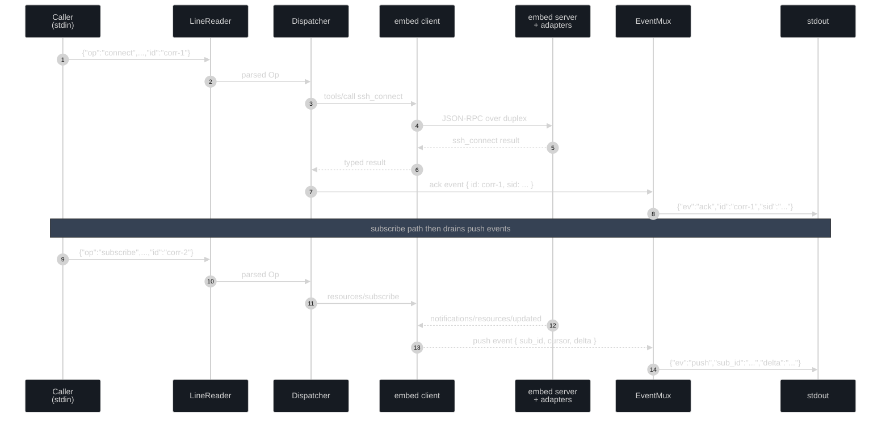
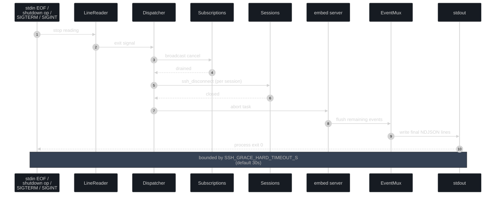

# `ssh-mcp-tail` — NDJSON Daemon Reference

`ssh-mcp-tail` is the v7.0 NDJSON-daemon binary for running ssh-mcp as a Unix-composable NDJSON pipe. It embeds the same `composition::prod` adapters as `ssh-mcp` (HTTP) and `ssh-mcp-stdio` (stdio MCP), wired to itself through an in-process `tokio::io::duplex` MCP transport. Stdin reads NDJSON commands; stdout emits NDJSON events; stderr emits `RUST_LOG`-controlled tracing.

The binary is shipped (Phase 4 merged into v5.x; carried forward unchanged into v6.0 / v6.1 / v7.0). Wire shape is locked by [ADR 0008](./adr/0008-ndjson-daemon-protocol.md); the JSON schema at `docs/api/ssh-mcp-ndjson.schema.json` is forthcoming and will become the authoritative contract once published. The v7.0 rsync tools (`ssh_rsync`, `ssh_rsync_cancel`, `ssh_rsync_stats`) are driven through the embedded MCP client surface — no new NDJSON ops were added; rsync progress events surface as `push` events on `uri="rsync://<RSYNC_ID>/progress"` ([ADR 0011](./adr/0011-rsync-hybrid-transport.md)).

## When to use this binary

Pick `ssh-mcp-tail` over `ssh-mcp-stdio` or `ssh-mcp` (HTTP) in any of the following scenarios:

- **Hosts without `resources/subscribe` support reaching the LLM.** Claude Code CLI (as of 2026-Q1) accepts the protocol but does not deliver `notifications/resources/updated` to the LLM as conversation context. Driving `ssh-mcp-tail` as a subprocess inside a Claude Code shell gives the LLM real push delivery via stdout NDJSON, bypassing the host's missing surface.
- **Composable Unix pipelines.** `jq` filters, `tee` audit logs, `vector` / `fluentbit` / `logstash` shipping, browser-side bridges. The NDJSON format is purpose-built for line-oriented tools.
- **In-process audit log / monitoring.** A long-running process can spawn `ssh-mcp-tail daemon` as a child, write ops to its stdin, and pipe events into a metrics or audit pipeline without implementing MCP itself.
- **Integration tests.** Reuses `composition::embed::wire()` so the same adapters that power production binaries also power tests, browser bridges, and any in-process consumer.

For full-spec MCP hosts (mcp-inspector, custom rmcp clients, Goose CLI, Cline) the canonical `ssh-mcp` HTTP or `ssh-mcp-stdio` binary is the right tool. The daemon does **not** replace them; it complements them.

## Architecture summary

The daemon embeds the rmcp `ServerHandler` inside the same process as an rmcp client; the two halves talk to each other via an in-memory `tokio::io::duplex(64 KB)` byte pair, which carries real JSON-RPC framing. The dispatcher reads NDJSON ops from stdin, translates them into `tools/call` and `resources/subscribe` requests on the embedded client, and forwards rmcp notifications to the stdout writer as NDJSON events.



The `composition::embed::wire()` factory pins concrete `composition::prod` adapters (russh client, russh-sftp, DashMap repos, AuthChain, MemoryRegistry, RmcpAdapter, ...) and exposes both halves of the duplex so the binary main loop can spawn them as cooperating tasks. No IPC syscall is involved; both sides share the same async runtime.

The full design rationale is in [ADR 0008](./adr/0008-ndjson-daemon-protocol.md).

## Subcommands

`ssh-mcp-tail` exposes three subcommands. `daemon` is the primary deliverable; `run` and `shell` are thin shell wrappers (~10 LOC each) over `daemon`.

| Subcommand | Use | Stdin | Stdout |
|---|---|---|---|
| `ssh-mcp-tail run` | One-shot connect + exec + drain. Emits push events for the single command. | unused | NDJSON events for the command. |
| `ssh-mcp-tail shell` | Interactive PTY shell. Bytes on stdin become `ssh_shell_write`; PTY bytes become NDJSON events. | bytes (forwarded) | NDJSON events including `shell_output`. |
| `ssh-mcp-tail daemon` | Multi-session NDJSON command/event loop. | NDJSON ops, one per line. | NDJSON events. |

A typical `run` invocation:

```bash
ssh-mcp-tail run --host vm.example.com --user root -- "uptime"
# output (one NDJSON line per event):
# {"ev":"ack","sid":"<session-uuid>"}
# {"ev":"started","cid":"<cmd-uuid>","sid":"<session-uuid>"}
# {"ev":"push","sub_id":"<sub-uuid>","uri":"command://<cmd-uuid>/output", ...}
# {"ev":"completed","cid":"<cmd-uuid>","exit":0}
# {"ev":"closed","sid":"<session-uuid>"}
```

A typical `daemon` invocation reads ops from a file:

```bash
cat ops.ndjson | ssh-mcp-tail daemon | tee out.ndjson
```

## NDJSON command schema (stdin)

One JSON object per line, terminated by `\n`. Each op is `serde`-tagged on the `op` field. The optional `id` field on every op is echoed on every event tied to that op for correlation.

The 13 ops below are the v5.0 schema (carried forward unchanged into v6.0 / v6.1 / v7.0). The shape is locked by [ADR 0008](./adr/0008-ndjson-daemon-protocol.md); the JSON schema at `docs/api/ssh-mcp-ndjson.schema.json` becomes the binding contract once published. v7.0 rsync tools (`ssh_rsync`, `ssh_rsync_cancel`, `ssh_rsync_stats`) are driven through the embedded MCP client surface, not via new NDJSON ops — subscribe to the `rsync://<RSYNC_ID>/progress` URI through the existing `subscribe` op to drive a sync from the daemon.

### `connect`

Open an SSH session. Returns an `ack` with `sid`.

```json
{"op":"connect","host":"vm.example.com","user":"root","key":"/home/user/.ssh/id_rsa","port":22,"agent_id":"my-agent","reuse_policy":"auto","id":"corr-1"}
```

| Field | Required | Default | Notes |
|---|---|---|---|
| `host` | yes | — | DNS name or IP. |
| `user` | yes | — | Remote user. |
| `key` | no | env / agent | Path to private key. Falls through `PasswordAuth -> KeyAuth -> AgentAuth`. |
| `password` | no | — | Inline password (avoid in production). |
| `port` | no | 22 | Remote port. |
| `agent_id` | no | random UUIDv7 | Logical group for `ssh_disconnect_agent` cleanup. |
| `reuse_policy` | no | `suggest` | `suggest` / `auto` / `force_new`. |
| `id` | no | — | Correlation. |

Errors: `AUTH_FAILED`, `CONNECTION_FAILED`, `CONNECTION_TIMEOUT`, `AUTH_KEY_PARSE`, `INVALID_ARGUMENT`.

### `exec`

Run a remote command. Returns `started` + `completed` (or `err`).

```json
{"op":"exec","sid":"<session-uuid>","cmd":"ls -la","pty":false,"release_when_no_subs":true,"id":"corr-2"}
```

| Field | Required | Default | Notes |
|---|---|---|---|
| `sid` | yes | — | Session UUID from `connect`'s `ack`. |
| `cmd` | yes | — | Remote command line. |
| `pty` | no | `false` | Allocate a PTY for the command. |
| `release_when_no_subs` | no | `false` | Auto-cleanup once the last subscriber leaves. See [ADR 0003](./adr/0003-lifecycle-binding.md). |
| `id` | no | — | Correlation. |

Errors: `SESSION_NOT_FOUND`, `INVALID_ARGUMENT`, `STORAGE_ERROR`, `REMOTE_CMD_FAILED`.

### `subscribe`

Open a push channel. Returns `ack` with `sub_id`.

```json
{"op":"subscribe","uri":"command://<cmd-uuid>/output","lifetime":"auto-close","grace_ms":2000,"lag_policy":"snapshot","filter":"ERROR","id":"corr-3"}
```

| Field | Required | Default | Notes |
|---|---|---|---|
| `uri` | yes | — | One of `shell://`, `command://`, `transfer://`, `session://`, `forward://`. |
| `lifetime` | no | `manual` | `manual` (caller closes), `auto-close` (resource closes when last sub leaves), `lease` (expires at deadline). |
| `grace_ms` | no | 2000 | Grace window when `lifetime=auto-close`. |
| `lag_policy` | no | `snapshot` | `block_slow`, `drop_oldest`, `drop_newest`, `snapshot`. See [ADR 0006](./adr/0006-backpressure-policies.md). |
| `filter` | no | — | Regex (line-mode) or level filter. Filtering happens before mpsc enqueue. |
| `start_cursor` | no | 0 | Replay from this cursor on the lane's first drain. |
| `id` | no | — | Correlation. |

Errors: `SUB_NOT_FOUND` (parent resource gone), `RESOURCE_GONE`, `MAX_SUBS_PER_URI_EXCEEDED`, `MAX_SUBS_TOTAL_EXCEEDED`, `INVALID_LIFETIME`, `INVALID_LAG_POLICY`.

### `unsubscribe`

Close a push channel. Triggers grace timer if last sub on the URI and `release_when_no_subs = true`.

```json
{"op":"unsubscribe","sub_id":"<sub-uuid>","id":"corr-4"}
```

Errors: `SUB_NOT_FOUND`.

### `read`

Explicit `resources/read` snapshot — returns the current ring-buffer slice for a URI. No subscribe needed; useful for one-shot inspection or cursor-based catch-up after a `lagged` event.

```json
{"op":"read","uri":"command://<cmd-uuid>/output","cursor":102400,"id":"corr-5"}
```

Optional `cursor` byte offset; omit to start from the head of the buffer. Returns a `snapshot` event keyed to `id`.

Errors: `RESOURCE_NOT_FOUND`, `RESOURCE_GONE`, `INVALID_CURSOR`.

### `shell_open`

Open a PTY shell. Returns `ack` with `shid`.

```json
{"op":"shell_open","sid":"<session-uuid>","cols":80,"rows":24,"release_when_no_subs":true,"inactivity_ttl_secs":900,"max_buffer_size":1048576,"id":"corr-5"}
```

| Field | Required | Default | Notes |
|---|---|---|---|
| `sid` | yes | — | Session UUID. |
| `cols` | no | 80 | PTY width. |
| `rows` | no | 24 | PTY height. |
| `release_when_no_subs` | no | `false` | See [ADR 0003](./adr/0003-lifecycle-binding.md). |
| `inactivity_ttl_secs` | no | env (`SSH_SHELL_INACTIVITY_TTL_SECS`) | Idle reaper TTL. |
| `max_buffer_size` | no | env (`SSH_SHELL_MAX_BUFFER`) | Ring buffer cap (bytes). |

Errors: `SESSION_NOT_FOUND`, `MAX_SHELLS_EXCEEDED`, `STORAGE_ERROR`.

### `shell_write`

Send bytes to the PTY stdin.

```json
{"op":"shell_write","shid":"<shell-uuid>","bytes":"ls -la\n","id":"corr-6"}
```

Errors: `SHELL_NOT_FOUND`, `INVALID_ARGUMENT`.

### `shell_key`

Send a semantic keystroke (encoded by `domain::keys`). Supports modifiers (`ctrl_c`, `ctrl_d`, `arrow_up`, `tab`, ...) and a `repeat` count.

```json
{"op":"shell_key","shid":"<shell-uuid>","key":"ctrl_c","repeat":1,"id":"corr-7"}
```

Errors: `SHELL_NOT_FOUND`, `INVALID_ARGUMENT`, `INVALID_REPEAT`.

### `upload`

Upload a local file via SFTP. Returns `ack` with `tid`.

```json
{"op":"upload","sid":"<session-uuid>","local":"/tmp/file","remote":"/srv/file","release_when_no_subs":true,"id":"corr-8"}
```

Errors: `SESSION_NOT_FOUND`, `SFTP_ERROR`, `STORAGE_ERROR`.

### `download`

Download a remote file via SFTP. Returns `ack` with `tid`. Mirrors `upload` (reversed `local` / `remote` semantics).

```json
{"op":"download","sid":"<session-uuid>","remote":"/srv/file","local":"/tmp/file","release_when_no_subs":true,"id":"corr-9"}
```

Errors: `SESSION_NOT_FOUND`, `SFTP_OPEN_FAILED`, `REMOTE_METADATA_ERROR`, `SFTP_ERROR`.

### `cancel`

Cancel a running command.

```json
{"op":"cancel","cid":"<cmd-uuid>","id":"corr-9"}
```

Errors: `COMMAND_NOT_FOUND`.

### `disconnect`

Disconnect a session. Cascade-closes every owned shell, command, and transfer.

```json
{"op":"disconnect","sid":"<session-uuid>","id":"corr-10"}
```

Errors: `SESSION_NOT_FOUND`.

### `shutdown`

Graceful drain. Daemon exits with code 0 after the drain completes (`SSH_GRACE_HARD_TIMEOUT_S` deadline).

```json
{"op":"shutdown","id":"corr-11"}
```



The shutdown sequence is detailed in [ADR 0008](./adr/0008-ndjson-daemon-protocol.md).

## NDJSON event schema (stdout)

One JSON object per line. `ev` is the discriminator. Events tied to a stdin op echo the op's `id` for correlation.

The 14 event variants below cover the v5.0 schema. Additional variants may be added in v5.x; the discriminator is open-ended on the wire (consumers should ignore unknown `ev` values).

### `ack`

Emitted for every successful stdin op. Carries the resource UUID(s) created.

```json
{"ev":"ack","id":"corr-1","sid":"<session-uuid>"}
{"ev":"ack","id":"corr-3","sub_id":"<sub-uuid>","uri":"command://..."}
```

### `err`

Emitted on every failed op. The envelope mirrors [ADR 0007](./adr/0007-error-taxonomy.md): `code` is the wire code, `reason` is the one-sentence summary, `detail` is the action-oriented `DETAIL:` line.

```json
{"ev":"err","id":"corr-1","code":"AUTH_FAILED","reason":"Authentication failed","detail":"Check credentials; never retry without changing them."}
```

The full code-by-code reference (cure, prevention, retry policy) lives in [LLM_GUIDE.md → Error handbook](./LLM_GUIDE.md#error-handbook).

### `started`

Async command launched.

```json
{"ev":"started","id":"corr-2","cid":"<cmd-uuid>","sid":"<session-uuid>"}
```

### `push`

Subscriber received a push event. `seq_local` is the per-sub_id sequence; `seq_global` is the per-resource sequence; `cursor` is the byte cursor into the resource ring buffer; `delta` is the new bytes appended since the previous push (subject to `filter`). `ts` is RFC 3339. Across all 7 push schemes (`shell://`, `command://`, `transfer://`, `session://`, `forward://`, `serial://`, **`rsync://`**) the wire shape is identical — only the `uri` discriminator and `delta` payload type change.

```json
{"ev":"push","sub_id":"<sub-uuid>","uri":"command://<cmd-uuid>/output","seq_local":1,"seq_global":1893,"cursor":102400,"delta":"....","ts":"2026-05-04T12:34:56.789Z"}
```

v7.0 rsync progress events ride the same envelope, with `delta` carrying a JSON-encoded `RsyncProgressEvent` ([ADR 0011](./adr/0011-rsync-hybrid-transport.md)):

```json
{"ev":"push","sub_id":"<sub-uuid>","uri":"rsync://<rsync-uuid>/progress","seq_local":4,"seq_global":17,"cursor":0,"delta":"{\"kind\":\"file_progress\",\"rel_path\":\"src/main.rs\",\"bytes_done\":1024,\"bytes_total\":2048}","ts":"2026-05-04T12:34:56.789Z"}
```

### `completed`

Async command finished. `exit` is the exit code (`null` on signal-killed).

```json
{"ev":"completed","cid":"<cmd-uuid>","exit":0}
```

### `transfer_progress`

SFTP transfer progress.

```json
{"ev":"transfer_progress","tid":"<xfer-uuid>","bytes":1024,"total":4096}
```

### `shell_output`

PTY raw bytes (for `shell` subcommand convenience; the `daemon` subcommand prefers the `push` event with `uri=shell://.../output`).

```json
{"ev":"shell_output","shid":"<shell-uuid>","bytes":"..."}
```

### `snapshot`

Lane recovered from overflow under `lag_policy=snapshot`. The `delta` field carries the rebuilt content from the per-resource ring buffer; the consumer's cursor advances to `cursor`.

```json
{"ev":"snapshot","sub_id":"<sub-uuid>","cursor":102400,"delta":"..."}
```

See [ADR 0006](./adr/0006-backpressure-policies.md) for the rebuild semantics.

### `lagged`

Drop marker under `lag_policy=drop_oldest` or `drop_newest`. `dropped` is the cumulative drop count for this gap.

```json
{"ev":"lagged","sub_id":"<sub-uuid>","dropped":42}
```

### `warn`

Server-emitted advisory marker. The `code` field uses the `POLICY` category from [ADR 0007](./adr/0007-error-taxonomy.md). Common codes: `SUB_LEAK_RISK`, `LAG_BACKPRESSURE`, `LAG_DETECTED`.

```json
{"ev":"warn","code":"SUB_LEAK_RISK","resource":"shell://abc/output","msg":"Resource owned > 2s with 0 subs and no auto-cleanup."}
```

### `closed`

Session disconnected.

```json
{"ev":"closed","sid":"<session-uuid>"}
```

### `resource_closed`

Long-running resource (shell / command / transfer) released. The `reason` field documents which lifecycle path fired.

```json
{"ev":"resource_closed","uri":"command://<cmd-uuid>/output","reason":"unsubscribe_grace_elapsed"}
```

Possible reasons: `unsubscribe_grace_elapsed`, `manual_close`, `cascade_disconnect`, `inactivity_ttl_fired`, `lifetime_lease_expired`.

### `heartbeat`

Periodic liveness signal. Emit cadence: `SSH_HEARTBEAT_INTERVAL_S` (default 30 s). Carries the protocol version (so consumers can pin compatibility — see [Versioning](#versioning)).

```json
{"ev":"heartbeat","ts":"2026-05-04T12:34:56.789Z","protocol":"ssh-mcp-ndjson/1"}
```

### `daemon_stats`

Periodic global stats. Emit cadence: `SSH_DAEMON_STATS_INTERVAL_S` (default 60 s). The full schema covers active sessions, active subs, per-policy breakdowns, mux backlog, peer GC pace, and rejected ops.

```json
{"ev":"daemon_stats","active_sessions":3,"active_subs":7,"events_sent_total":18493,"lagged_drops_total":0,"mux_queue_depth":12,"protocol":"ssh-mcp-ndjson/1"}
```

## Stderr / logging

`stderr` carries the `RUST_LOG`-controlled tracing output. `stdout` is **strictly** NDJSON events; no log noise leaks into the event stream. Operators select verbosity:

```bash
RUST_LOG=ssh_mcp=info,ssh_mcp_tail=debug ssh-mcp-tail daemon
```

Cargo features that affect logging:

| Feature | Default | Effect |
|---|---|---|
| `port_forward` | on | Includes the `forward://` resource scheme and the `ssh_forward` tool surface in the embedded server. |
| `test-fixtures` | off | Wires deterministic adapters (`FakeClock`, `DeterministicIdGen`). For tests; never enable in production builds. |

The strict Clippy gate from `Cargo.toml` `[lints.clippy]` applies to the binary as well as the libraries. `print_stdout` and `print_stderr` are forbidden — every byte on stdout goes through the typed event formatter; every byte on stderr goes through `tracing`.

## Examples

### One-shot `run`

```bash
ssh-mcp-tail run --host vm.example.com --user root -- "uptime"
```

Produces ~5 NDJSON lines on stdout (ack, started, push, completed, closed). Exit code matches the remote command's exit code.

### Tail a remote log file

```bash
ssh-mcp-tail run --host vm.example.com --user root -- "tail -f /var/log/app.log" \
  | jq 'select(.ev=="push") | .delta' \
  | grep ERROR
```

The `jq` filter selects only push events; the `.delta` extracts the new bytes; `grep` filters error lines. The lifecycle is `auto-close` by default for `run`, so the resource releases when the consumer SIGPIPEs.

### Multi-session daemon driven by a script

```bash
cat ops.ndjson | ssh-mcp-tail daemon | tee audit.ndjson | \
  jq 'select(.ev=="completed" and .exit != 0)'
```

Where `ops.ndjson` is:

```jsonl
{"op":"connect","host":"vm-a","user":"root","id":"a"}
{"op":"connect","host":"vm-b","user":"root","id":"b"}
{"op":"exec","sid":"<resolved-from-ack-a>","cmd":"systemctl status nginx","id":"a-status"}
{"op":"exec","sid":"<resolved-from-ack-b>","cmd":"systemctl status nginx","id":"b-status"}
{"op":"shutdown","id":"shut"}
```

In practice the script reads ack events from stdout, resolves the `sid` for each correlated `id`, and writes the next op. A reference shell harness shipping with the binary (`scripts/daemon_smoke.sh`) demonstrates the pattern.

### Browser bridge

A JS WebSocket bridge that proxies `ssh-mcp-tail` to a browser inspector reads stdin from WS frames, writes ops to the daemon, and forwards stdout NDJSON events back as WS frames. Because the protocol is line-oriented and byte-clean, the bridge is ~50 LOC.

## Limits and env vars

| Limit | Default | Env var |
|---|---|---|
| Max NDJSON line size on stdin | 1 MB | `SSH_NDJSON_LINE_MAX` |
| Per-lane mpsc buffer | 1024 events | `SSH_LANE_BUFFER` |
| Mux mpsc buffer | 8192 events | `SSH_MUX_BUFFER` |
| Heartbeat interval | 30 s | `SSH_HEARTBEAT_INTERVAL_S` |
| Daemon stats auto-emit | 60 s | `SSH_DAEMON_STATS_INTERVAL_S` |
| Hard shutdown deadline | 30 s | `SSH_GRACE_HARD_TIMEOUT_S` |
| `BlockSlow` lag-policy escape hatch | 5 s | `SSH_BP_BLOCK_TIMEOUT_MS` |
| Sub leak risk warning threshold | 2 s | `SSH_SUB_LEAK_RISK_WARN_S` |
| Sub leak risk hard kill threshold | 0 s (off) | `SSH_SUB_LEAK_RISK_KILL_S` |

The full env var table for v5.0 (covering the legacy v4 entries plus all v5 additions) lives in [CONFIGURATION.md](./CONFIGURATION.md).

## Backpressure

Per-lane and per-mux backpressure is governed by [ADR 0006](./adr/0006-backpressure-policies.md). The `lag_policy` argument on `subscribe` selects per-lane behaviour from `BlockSlow` / `DropOldest` / `DropNewest` / `Snapshot`. `Snapshot` is the default: lane mpsc backlog drops, the next drain triggers a `read_resource(uri, cursor=current_seq)` rebuild from the per-resource ring buffer, and a `snapshot` event surfaces on the wire so the consumer's cursor advances.

The daemon's outbound writer is itself a bounded `mpsc::channel(SSH_MUX_BUFFER)`. When the consumer of the NDJSON stream stalls (a slow `jq` filter, a paused `tee`), the mux fills, the lane consumer's `try_send` fails, and the lane falls back to its own lag policy. The daemon never deadlocks on outbound stall: every fronteira has a documented overflow strategy.

The `sub_stats` and `sub_stats_all` MCP tools expose per-lane and aggregate counters (events_sent, lagged_drops, queue_depth, queue_high_watermark, block_total_ms). The daemon also auto-emits `daemon_stats` events on the NDJSON stream every `SSH_DAEMON_STATS_INTERVAL_S`.

## Lifecycle policy on subscribe

Every subscribe-capable op (`subscribe`, `shell_open`, `exec`, `upload`, `download`) honours [ADR 0003](./adr/0003-lifecycle-binding.md). The two policy fields that matter:

- `release_when_no_subs` (per resource creator) — when `true`, the resource transitions `Owned -> Releasing` once the subscriber count drops to zero, with a `grace_ms` window to allow re-subscription. New subscribes during the window cancel the grace timer (CAS `Releasing -> Observed`). The default is `false` to match v4 semantics; set it on every resource the daemon creates if you want auto-cleanup.
- `lifetime` (per subscriber) — `manual` (caller closes), `auto-close` (release when last sub leaves and `release_when_no_subs=true`), `lease` (expires at deadline). The `auto-close` value is the safe default for daemon workloads.

The state machine (Owned -> Observed -> Releasing -> Closed) and its CAS edges are documented in [ADR 0003](./adr/0003-lifecycle-binding.md). Cascade is automatic: a `disconnect` op decrements every owned resource's refcount; the parent session's `active_refs` aggregate fires the session-level grace timer when it reaches zero.

## Error codes

The daemon's `err` events use the same wire taxonomy as the MCP server (46 codes, 7 categories, action-oriented `DETAIL` lines). The complete reference is at [LLM_GUIDE.md → Error handbook](./LLM_GUIDE.md#error-handbook). The categories are summarised in [ADR 0007](./adr/0007-error-taxonomy.md):

| Category | Retry semantics |
|---|---|
| `AUTH` | Never retry. |
| `TRANSPORT` | Auto-retry with exponential backoff (cap 10 s). |
| `REMOTE` | Depends on remote command exit; LLM judges. |
| `RESOURCE` | Never retry. |
| `POLICY` | Retry conditional on policy change. |
| `STATE` | Never retry without `_meta.idempotency_key`. |
| `INTERNAL` | Never retry; report bug. |

The two daemon-specific codes are `INVALID_OP` (NDJSON parse error or unknown `op` discriminator — the daemon continues processing subsequent lines) and `IDEMPOTENCY_KEY_MISMATCH` (same key with different argument set — pick a new key).

## Composition recipes

### `jq` filtering by event type

```bash
ssh-mcp-tail daemon < ops.ndjson \
  | jq -c 'select(.ev=="push" or .ev=="completed")'
```

### Vector pipeline

```toml
[sources.ssh_mcp]
type = "stdin"

[sinks.elasticsearch]
type = "elasticsearch"
inputs = ["ssh_mcp"]
endpoints = ["http://es:9200"]
```

Pipe `ssh-mcp-tail daemon` into `vector --config /etc/vector/vector.toml`.

### Fluentbit forwarder

```ini
[INPUT]
    Name        stdin
    Tag         ssh_mcp.events

[OUTPUT]
    Name        kafka
    Match       ssh_mcp.events
    Brokers     kafka:9092
    Topic       ssh_mcp_audit
```

### Bash test harness

```bash
#!/usr/bin/env bash
set -euo pipefail
cat > ops.ndjson <<'EOF'
{"op":"connect","host":"localhost","user":"root","id":"c1"}
{"op":"exec","sid":"PLACEHOLDER","cmd":"echo hello","id":"e1"}
{"op":"shutdown","id":"s"}
EOF
ssh-mcp-tail daemon < ops.ndjson > out.ndjson
grep -q '"ev":"completed"' out.ndjson || { echo "smoke fail"; exit 1; }
```

The placeholder pattern (resolving the session UUID from the daemon's `ack` event before issuing dependent ops) is left as an exercise for the harness; a more capable script would use `jq` to read events incrementally.

## Versioning

Every `heartbeat` and `daemon_stats` event carries a `protocol` field in the form `ssh-mcp-ndjson/<major>`. v5.0 ships `ssh-mcp-ndjson/1`. Consumers should:

- Accept any `protocol` matching their major version.
- Treat unknown `ev` discriminators as informational and skip them.
- Treat unknown fields on a known `ev` as additive and ignore them.

The full JSON schema (op + event variants, field types, enum values) is forthcoming at `docs/api/ssh-mcp-ndjson.schema.json`. Until then the schema in this document and [ADR 0008](./adr/0008-ndjson-daemon-protocol.md) is authoritative.

## See also

- [ADR 0008 — NDJSON Daemon Protocol](./adr/0008-ndjson-daemon-protocol.md) — design rationale and protocol shape.
- [ADR 0003 — Lifecycle Binding](./adr/0003-lifecycle-binding.md) — `release_when_no_subs`, grace timer, cascade.
- [ADR 0004 — Channel Mux + SubId](./adr/0004-channel-mux-fairness.md) — per-sub_id lane isolation.
- [ADR 0006 — Backpressure Policies](./adr/0006-backpressure-policies.md) — the four `LagPolicy` variants.
- [ADR 0007 — Error Taxonomy](./adr/0007-error-taxonomy.md) — the 38 wire codes.
- [MIGRATION.md → v4 → v5](./MIGRATION.md#v4--v5) — host migration guide.
- [OPERATIONS.md](./OPERATIONS.md) — diagnostic guide for daemon symptoms.
- [LLM_GUIDE.md → Error handbook](./LLM_GUIDE.md#error-handbook) — every code, every cure.
