# SSH MCP Operation Flows

This document describes the operational flows of the SSH MCP server, including connection establishment, command execution, port forwarding, and session lifecycle management.

## Table of Contents

- [Session Lifecycle](#session-lifecycle)
- [SSH Connection Flow](#ssh-connection-flow)
- [Authentication Flow](#authentication-flow)
- [Command Execution Flow](#command-execution-flow)
- [Port Forwarding Flow](#port-forwarding-flow)
- [Error Handling and Retry Logic](#error-handling-and-retry-logic)

---

## Session Lifecycle

The complete lifecycle of an SSH session from creation to termination.

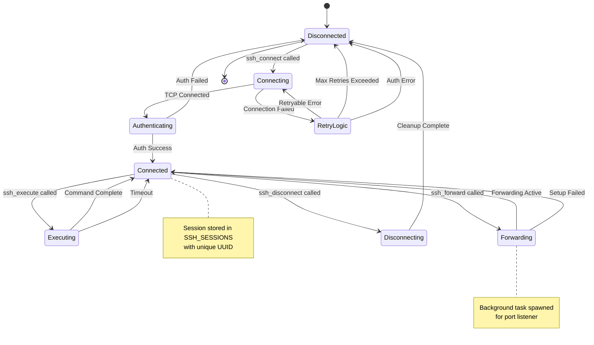

### Session States

| State | Description |
|-------|-------------|
| `Disconnected` | No active connection, session not in store |
| `Connecting` | TCP connection in progress with retry logic |
| `Authenticating` | Connection established, auth in progress |
| `Connected` | Fully connected and ready for operations |
| `Executing` | Command execution in progress |
| `Forwarding` | Port forwarding setup in progress |
| `Disconnecting` | Graceful disconnect in progress |

---

## SSH Connection Flow

Detailed flow of the `ssh_connect` operation using russh native async.

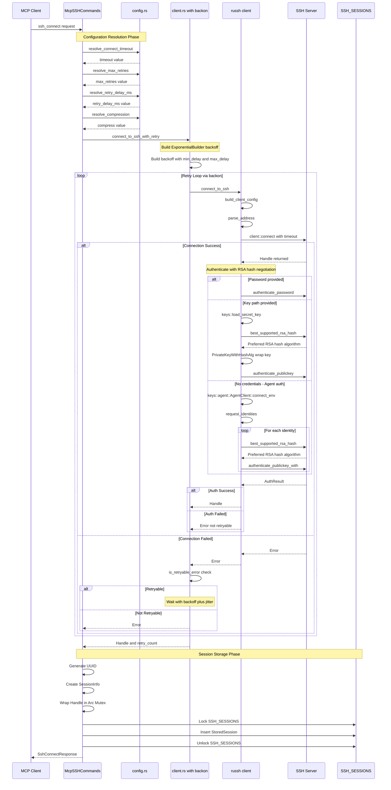

### Configuration Resolution Priority

Each configuration value follows the same resolution pattern.

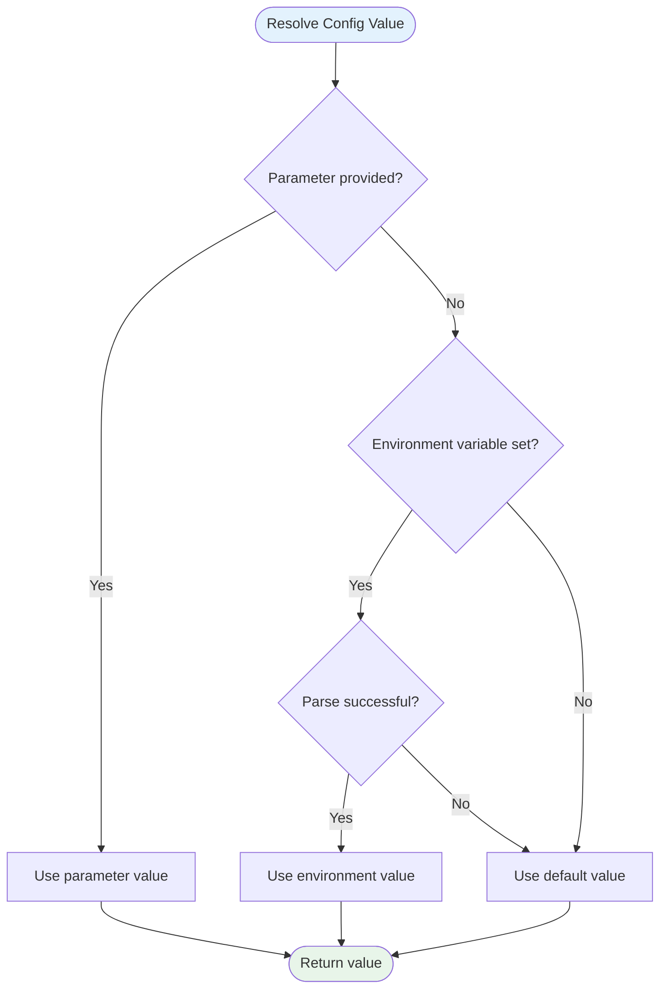

### Address Parsing

The address is parsed to extract host and port using rsplit_once.

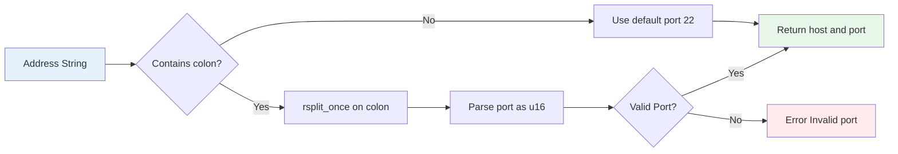

---

## Authentication Flow

Detailed authentication flow supporting multiple methods with RSA hash algorithm negotiation.

For RSA keys, the client negotiates the hash algorithm with the server using `best_supported_rsa_hash()`. This ensures modern algorithms like `rsa-sha2-256` or `rsa-sha2-512` are used instead of the legacy `ssh-rsa` with SHA1.

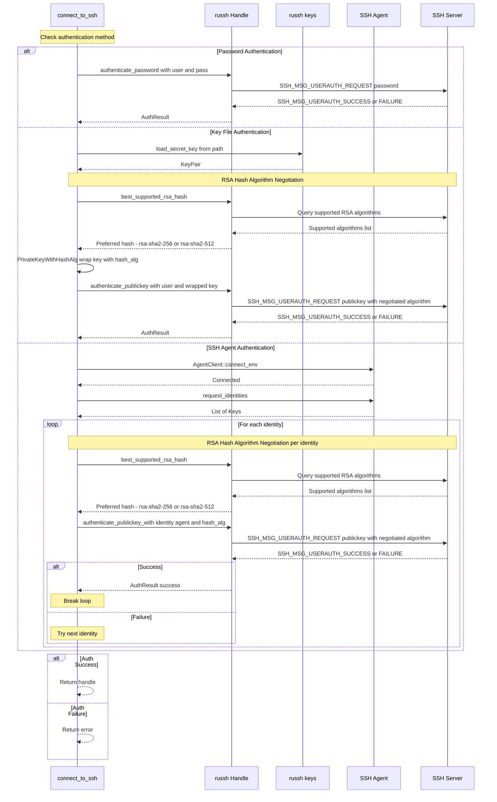

### RSA Hash Algorithm Negotiation

The `best_supported_rsa_hash()` function queries the server for supported RSA signature algorithms and returns the best available option.

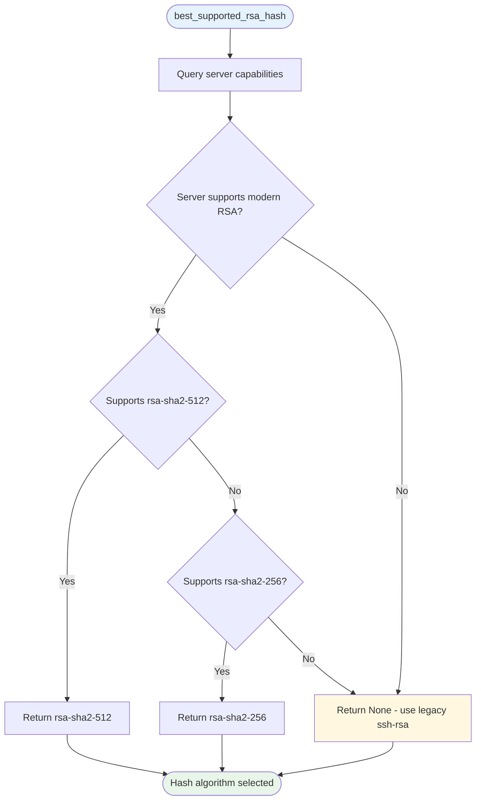

### Authentication Method Priority

---

## Command Execution Flow

Flow of the `ssh_execute` operation.

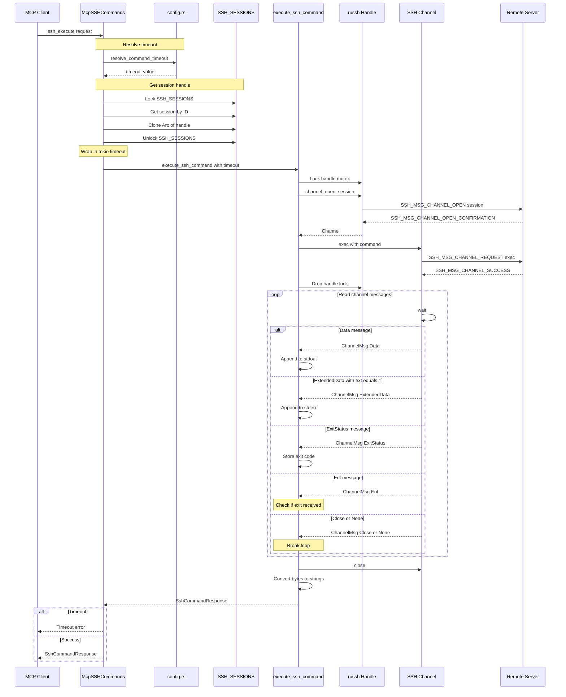

### Channel Message Types

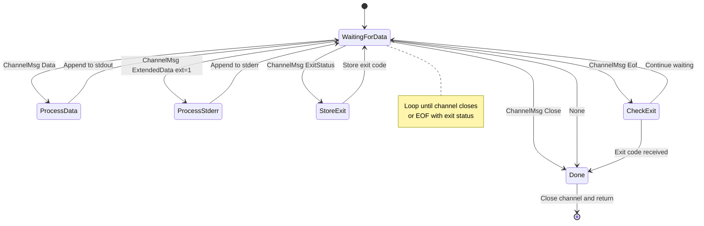

---

## Port Forwarding Flow

Flow of the `ssh_forward` operation when port_forward feature is enabled.

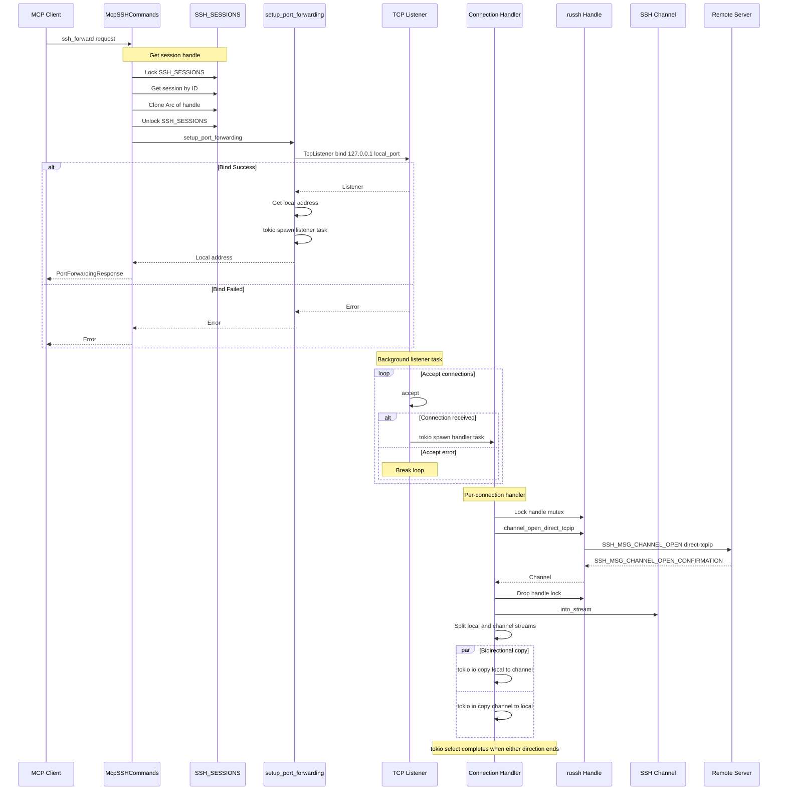

### Port Forwarding Data Flow

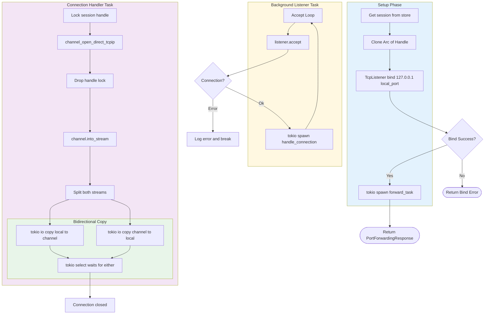

---

## Error Handling and Retry Logic

### Error Classification

The `is_retryable_error` function in error.rs classifies errors.

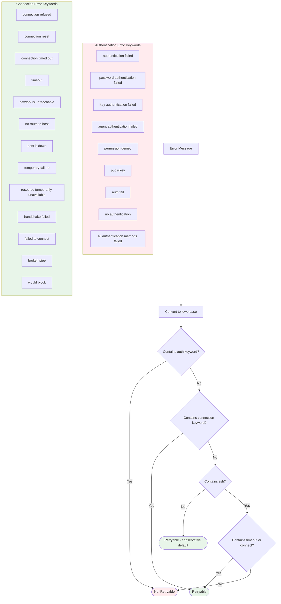

### Exponential Backoff with Jitter

The retry logic uses backon ExponentialBuilder.

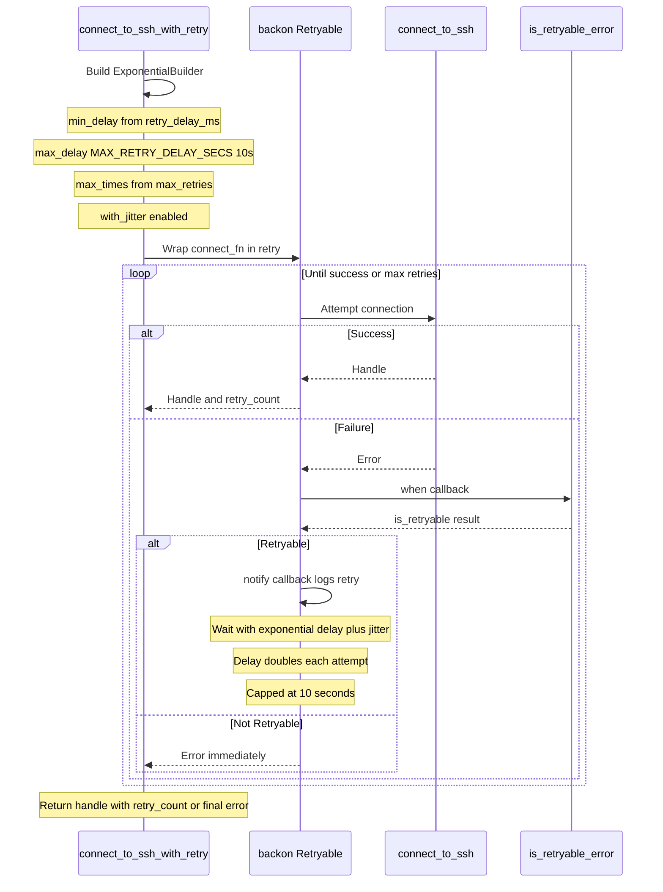

### Retry Timeline Example

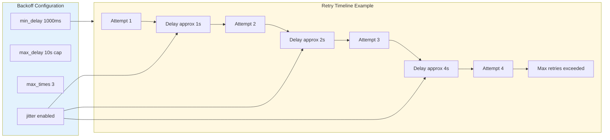

### Retry Notification Flow

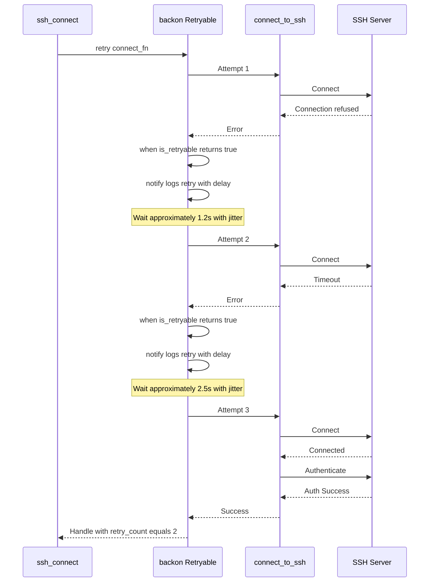

---

## Module Responsibilities

| Module | Responsibility |
|--------|----------------|
| `commands.rs` | MCP tool entry points and response building |
| `client.rs` | SSH connection, authentication, and command execution |
| `session.rs` | Global session storage and russh handler |
| `config.rs` | Configuration resolution with priority chain |
| `error.rs` | Error classification for retry decisions |
| `forward.rs` | Port forwarding with bidirectional IO |
