# SSH MCP Operation Flows

This document describes the operational flows of the SSH MCP server, including connection establishment, command execution, port forwarding, and session lifecycle management.

## Table of Contents

- [Session Lifecycle](#session-lifecycle)
- [SSH Connection Flow](#ssh-connection-flow)
- [Authentication Flow](#authentication-flow)
- [Command Execution Flow](#command-execution-flow)
- [Async Command Execution Flow](#async-command-execution-flow)
- [Async Command Lifecycle](#async-command-lifecycle)
- [Command Cancellation Flow](#command-cancellation-flow)
- [Port Forwarding Flow](#port-forwarding-flow)
- [Error Handling and Retry Logic](#error-handling-and-retry-logic)

---

## Session Lifecycle

The complete lifecycle of an SSH session from creation to termination.

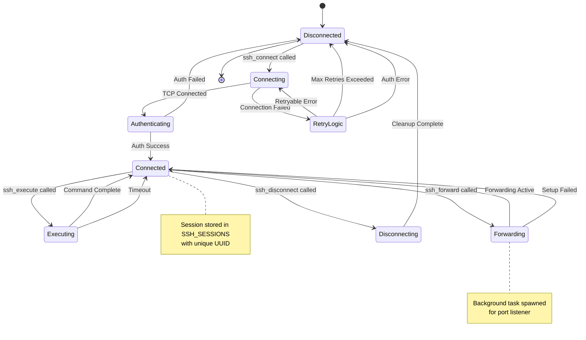

### Session States

| State | Description |
|-------|-------------|
| `Disconnected` | No active connection, session not in store |
| `Connecting` | TCP connection in progress with retry logic |
| `Authenticating` | Connection established, auth in progress |
| `Connected` | Fully connected and ready for operations |
| `Executing` | Command execution in progress |
| `Forwarding` | Port forwarding setup in progress |
| `Disconnecting` | Graceful disconnect in progress |

### Session Properties

| Property | Description |
|----------|-------------|
| `name` | Optional human-readable identifier for LLM identification |
| `persistent` | When true, disables inactivity timeout (keepalive still active) |

---

## SSH Connection Flow

Detailed flow of the `ssh_connect` operation using russh native async.

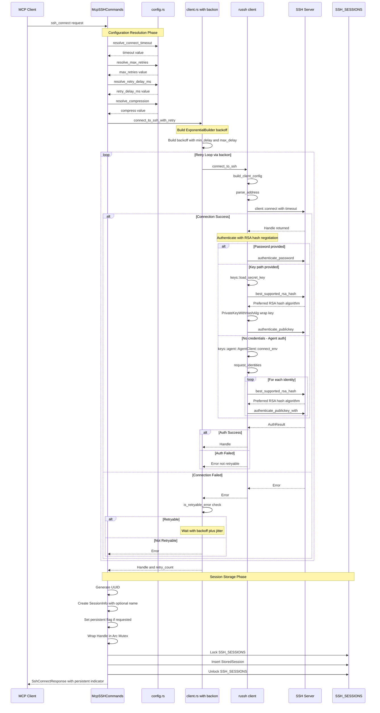

### Configuration Resolution Priority

Each configuration value follows the same resolution pattern.


### Address Parsing

The address is parsed to extract host and port using rsplit_once.

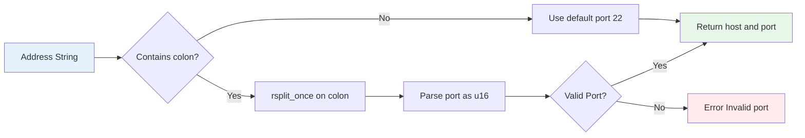

---

## Authentication Flow

Detailed authentication flow supporting multiple methods with RSA hash algorithm negotiation.

For RSA keys, the client negotiates the hash algorithm with the server using `best_supported_rsa_hash()`. This ensures modern algorithms like `rsa-sha2-256` or `rsa-sha2-512` are used instead of the legacy `ssh-rsa` with SHA1.

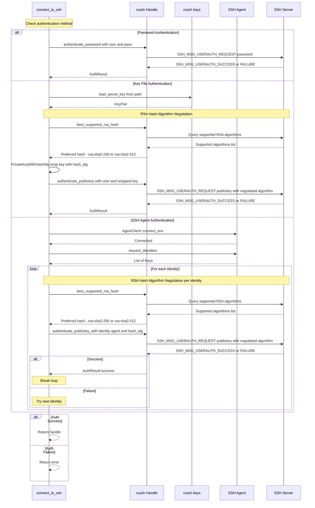

### RSA Hash Algorithm Negotiation

The `best_supported_rsa_hash()` function queries the server for supported RSA signature algorithms and returns the best available option.


### Authentication Method Priority

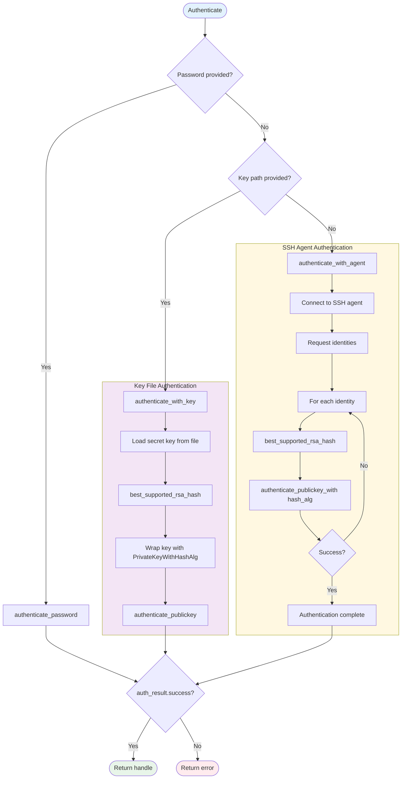

---

## Command Execution Flow

Flow of the `ssh_execute` operation.

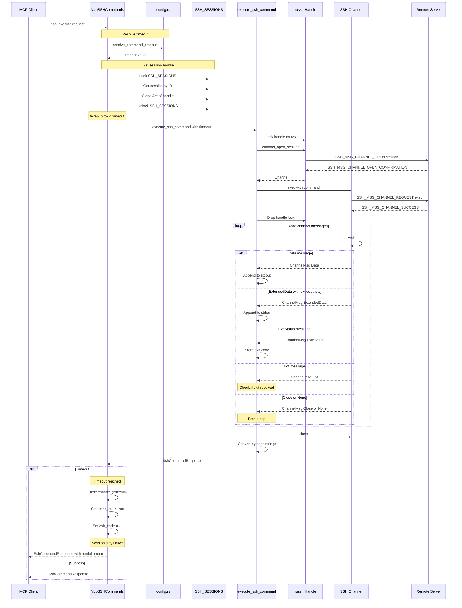

### Channel Message Types

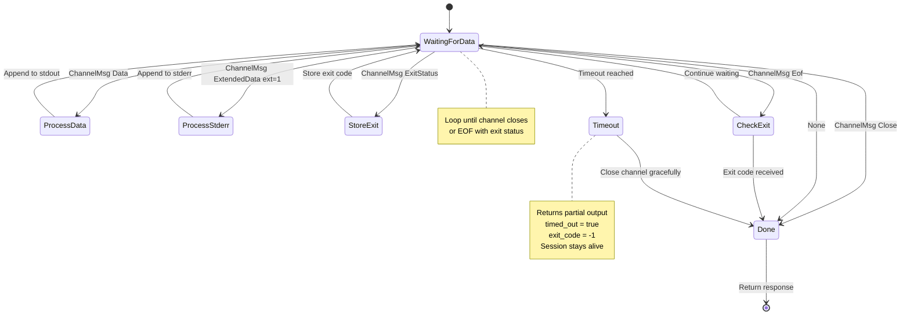

### Command Timeout Handling

When a command exceeds the configured timeout (`SSH_COMMAND_TIMEOUT`), the system handles it gracefully without disconnecting the session.

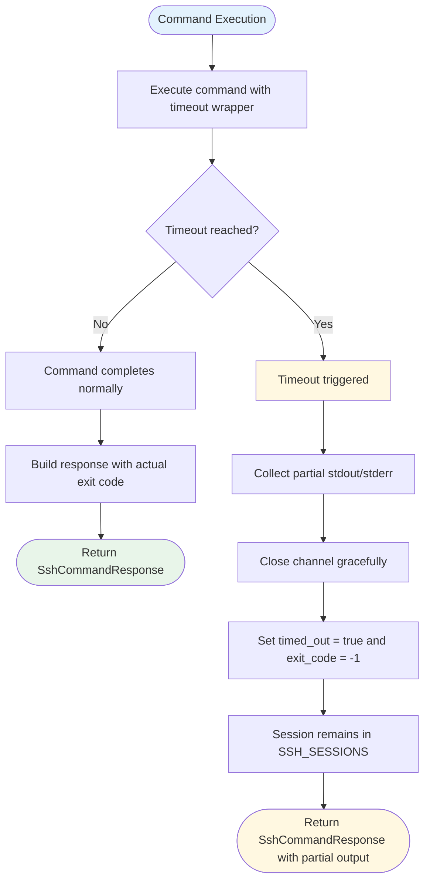

**Timeout Response Fields:**

| Field | Value | Description |
|-------|-------|-------------|
| `stdout` | Partial output | Any stdout received before timeout |
| `stderr` | Partial output | Any stderr received before timeout |
| `exit_code` | `-1` | Indicates abnormal termination |
| `timed_out` | `true` | Signals timeout occurred |

**Key Behavior:**
- The SSH session remains connected and can be reused for subsequent commands
- No error is returned; instead, a valid response with partial output is provided
- The channel is closed gracefully to avoid resource leaks
- Clients should check the `timed_out` flag to detect timeout conditions

---

## Async Command Execution Flow

Flow of the `ssh_execute_async` operation for long-running commands that return immediately with a command ID for polling.

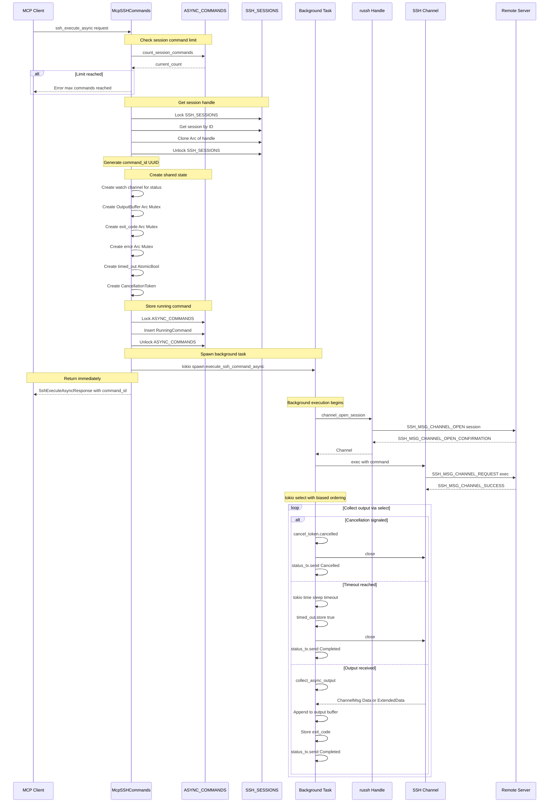

### Polling for Output

The `ssh_get_command_output` tool allows clients to poll for command status and output.

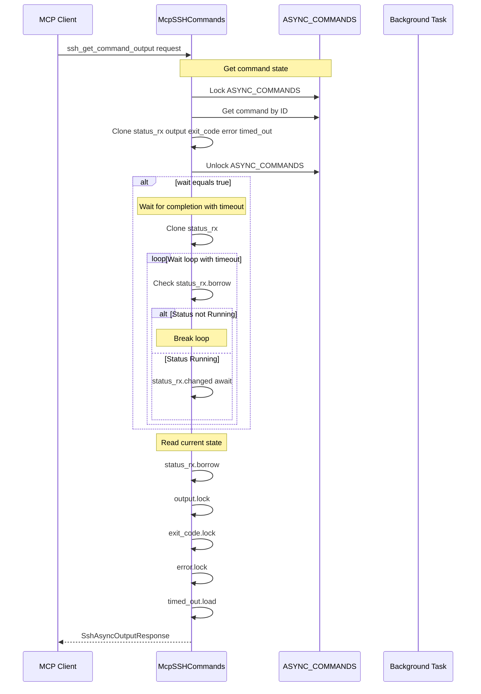

### Async Command State Machine

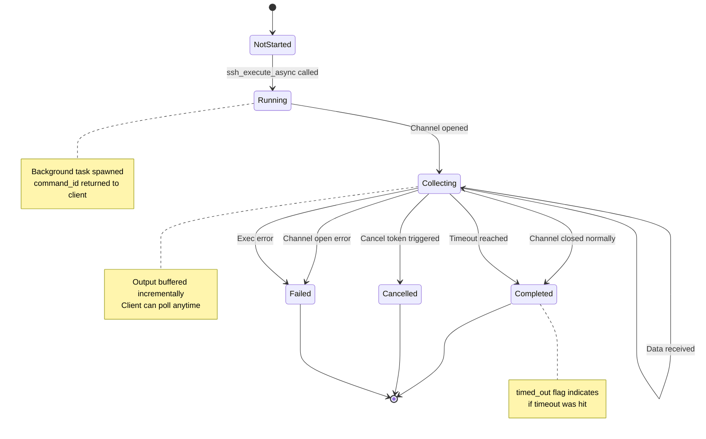

### Async Command Limits

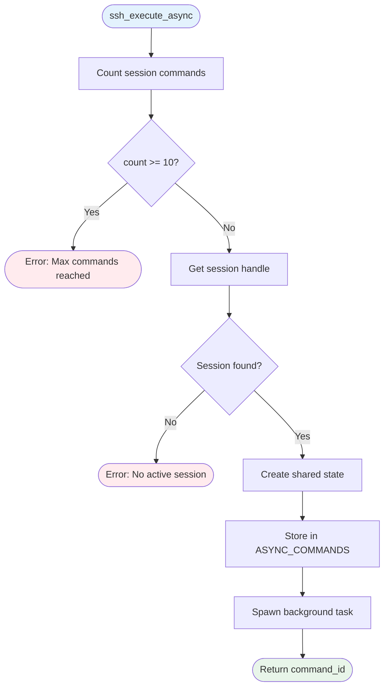

---

## Async Command Lifecycle

Complete lifecycle of an async command from creation to cleanup.

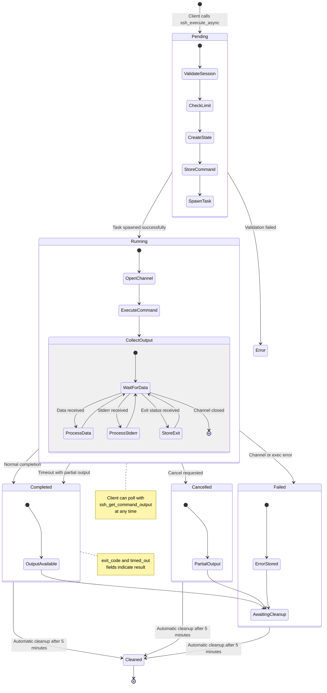

### Status Transitions

| From | To | Trigger |
|------|-----|---------|
| Pending | Running | Task spawned, channel open successful |
| Running | Completed | Normal exit or timeout |
| Running | Cancelled | `ssh_cancel_command` called |
| Running | Failed | Channel open error, exec error |

### AsyncCommandStatus Values

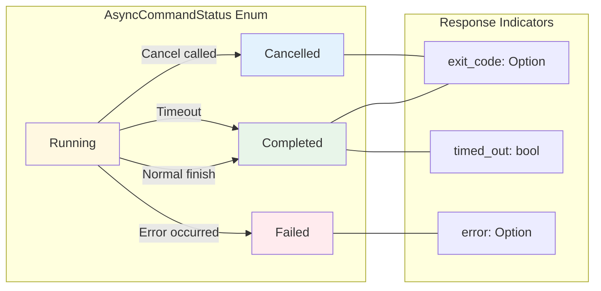

### Output Collection Flow

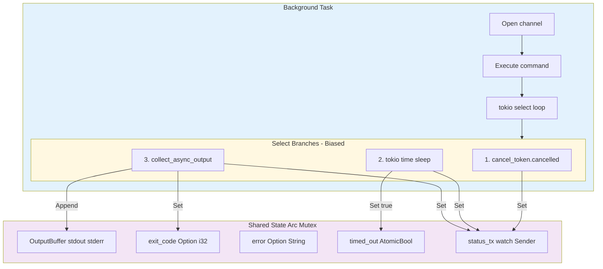

---

## Command Cancellation Flow

Flow of the `ssh_cancel_command` operation to stop a running async command.

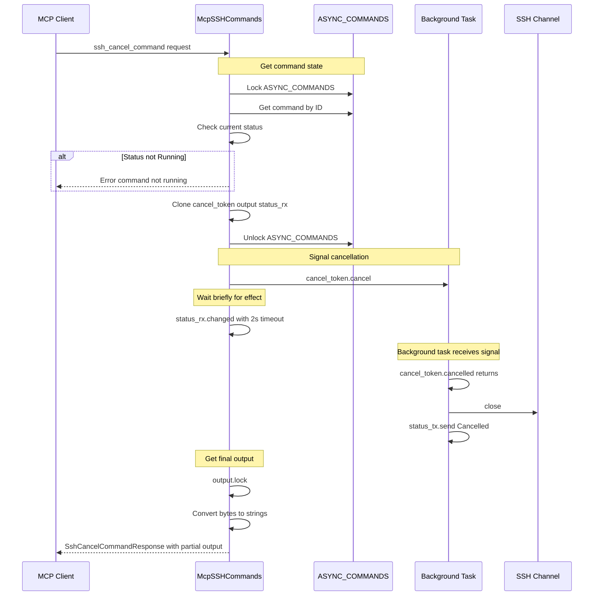

### Cancellation Signal Flow

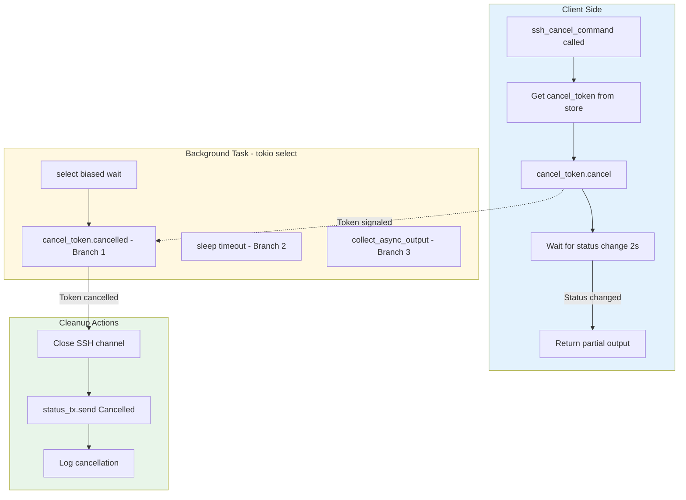

### Cancellation State Transitions

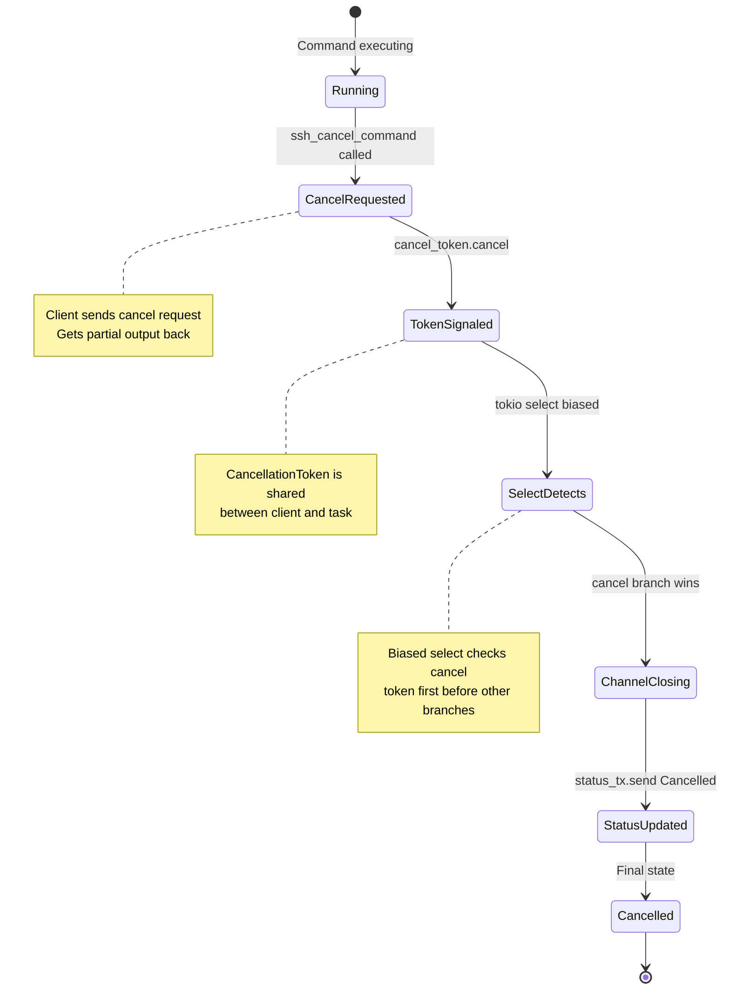

### Partial Output Recovery

When a command is cancelled, the client receives all output collected up to that point.

```mermaid
flowchart LR
    subgraph BeforeCancel["Before Cancellation"]
        Stdout1["stdout: partial data"]
        Stderr1["stderr: partial data"]
        Status1["status: Running"]
    end

    subgraph CancelAction["Cancel Action"]
        Signal["cancel_token.cancel"]
        Wait["Wait up to 2s"]
    end

    subgraph AfterCancel["After Cancellation"]
        Stdout2["stdout: preserved"]
        Stderr2["stderr: preserved"]
        Status2["status: Cancelled"]
        Cancelled2["cancelled: true"]
    end

    BeforeCancel --> CancelAction
    CancelAction --> AfterCancel

    Stdout1 -.->|"Preserved"| Stdout2
    Stderr1 -.->|"Preserved"| Stderr2

    style BeforeCancel fill:#fff8e1
    style CancelAction fill:#ffebee
    style AfterCancel fill:#e8f5e9
```

### Cancel Response Fields

| Field | Type | Description |
|-------|------|-------------|
| `command_id` | String | The cancelled command's ID |
| `cancelled` | bool | Always `true` on success |
| `message` | String | Confirmation message |
| `stdout` | String | Output collected before cancellation |
| `stderr` | String | Error output collected before cancellation |

---

## Port Forwarding Flow

Flow of the `ssh_forward` operation when port_forward feature is enabled.

```mermaid
sequenceDiagram
    participant Client as MCP Client
    participant Cmd as McpSSHCommands
    participant Store as SSH_SESSIONS
    participant Fwd as setup_port_forwarding
    participant Listener as TCP Listener
    participant Handler as Connection Handler
    participant Handle as russh Handle
    participant Channel as SSH Channel
    participant Remote as Remote Server

    Client->>Cmd: ssh_forward request

    Note over Cmd,Store: Get session handle
    Cmd->>Store: Lock SSH_SESSIONS
    Cmd->>Store: Get session by ID
    Cmd->>Store: Clone Arc of handle
    Cmd->>Store: Unlock SSH_SESSIONS

    Cmd->>Fwd: setup_port_forwarding

    Fwd->>Listener: TcpListener bind 127.0.0.1 local_port
    alt Bind Success
        Listener-->>Fwd: Listener
        Fwd->>Fwd: Get local address
        Fwd->>Fwd: tokio spawn listener task
        Fwd-->>Cmd: Local address
        Cmd-->>Client: PortForwardingResponse
    else Bind Failed
        Listener-->>Fwd: Error
        Fwd-->>Cmd: Error
        Cmd-->>Client: Error
    end

    Note over Listener: Background listener task

    loop Accept connections
        Listener->>Listener: accept
        alt Connection received
            Listener->>Handler: tokio spawn handler task
        else Accept error
            Note over Listener: Break loop
        end
    end

    Note over Handler: Per-connection handler

    Handler->>Handle: Lock handle mutex
    Handler->>Handle: channel_open_direct_tcpip
    Handle->>Remote: SSH_MSG_CHANNEL_OPEN direct-tcpip
    Remote-->>Handle: SSH_MSG_CHANNEL_OPEN_CONFIRMATION
    Handle-->>Handler: Channel
    Handler->>Handle: Drop handle lock

    Handler->>Channel: into_stream
    Handler->>Handler: Split local and channel streams

    par Bidirectional copy
        Handler->>Handler: tokio io copy local to channel
    and
        Handler->>Handler: tokio io copy channel to local
    end

    Note over Handler: tokio select completes when either direction ends
```

### Port Forwarding Data Flow

```mermaid
flowchart TD
    subgraph Setup["Setup Phase"]
        GetSession["Get session from store"]
        CloneArc["Clone Arc of Handle"]
        BindLocal["TcpListener bind 127.0.0.1 local_port"]
        SpawnTask["tokio spawn forward_task"]
    end

    GetSession --> CloneArc
    CloneArc --> BindLocal
    BindLocal --> BindResult{Bind Success?}
    BindResult -->|No| BindError([Return Bind Error])
    BindResult -->|Yes| SpawnTask
    SpawnTask --> ReturnResponse([Return PortForwardingResponse])

    subgraph ListenerTask["Background Listener Task"]
        AcceptLoop["Accept Loop"]
        Accept["listener.accept"]
        SpawnHandler["tokio spawn handle_connection"]
    end

    AcceptLoop --> Accept
    Accept --> AcceptResult{Connection?}
    AcceptResult -->|Error| LogBreak["Log error and break"]
    AcceptResult -->|Ok| SpawnHandler
    SpawnHandler --> AcceptLoop

    subgraph ConnectionHandler["Connection Handler Task"]
        LockHandle["Lock session handle"]
        OpenDirect["channel_open_direct_tcpip"]
        DropLock["Drop handle lock"]
        IntoStream["channel.into_stream"]
        SplitStreams["Split both streams"]

        subgraph Bidirectional["Bidirectional Copy"]
            LocalToRemote["tokio io copy local to channel"]
            RemoteToLocal["tokio io copy channel to local"]
            Select["tokio select waits for either"]
        end
    end

    LockHandle --> OpenDirect
    OpenDirect --> DropLock
    DropLock --> IntoStream
    IntoStream --> SplitStreams
    SplitStreams --> LocalToRemote
    SplitStreams --> RemoteToLocal
    LocalToRemote --> Select
    RemoteToLocal --> Select
    Select --> CloseConn["Connection closed"]

    style Setup fill:#e3f2fd
    style ListenerTask fill:#fff8e1
    style ConnectionHandler fill:#f3e5f5
    style Bidirectional fill:#e8f5e9
```

---

## Error Handling and Retry Logic

### Error Classification

The `is_retryable_error` function in error.rs classifies errors.

```mermaid
flowchart TD
    Error["Error Message"] --> ToLower["Convert to lowercase"]
    ToLower --> CheckAuth{Contains auth keyword?}

    CheckAuth -->|Yes| NonRetryable([Not Retryable])
    CheckAuth -->|No| CheckConn{Contains connection keyword?}

    CheckConn -->|Yes| Retryable([Retryable])
    CheckConn -->|No| CheckSSH{Contains ssh?}

    CheckSSH -->|No| DefaultRetry([Retryable - conservative default])
    CheckSSH -->|Yes| CheckTimeout{Contains timeout or connect?}

    CheckTimeout -->|Yes| Retryable
    CheckTimeout -->|No| NonRetryable

    subgraph AuthKeywords["Authentication Error Keywords"]
        Auth1["authentication failed"]
        Auth2["password authentication failed"]
        Auth3["key authentication failed"]
        Auth4["agent authentication failed"]
        Auth5["permission denied"]
        Auth6["publickey"]
        Auth7["auth fail"]
        Auth8["no authentication"]
        Auth9["all authentication methods failed"]
    end

    subgraph ConnKeywords["Connection Error Keywords"]
        Conn1["connection refused"]
        Conn2["connection reset"]
        Conn3["connection timed out"]
        Conn4["timeout"]
        Conn5["network is unreachable"]
        Conn6["no route to host"]
        Conn7["host is down"]
        Conn8["temporary failure"]
        Conn9["resource temporarily unavailable"]
        Conn10["handshake failed"]
        Conn11["failed to connect"]
        Conn12["broken pipe"]
        Conn13["would block"]
    end

    style NonRetryable fill:#ffebee
    style Retryable fill:#e8f5e9
    style DefaultRetry fill:#e8f5e9
    style AuthKeywords fill:#ffebee
    style ConnKeywords fill:#e8f5e9
```

### Exponential Backoff with Jitter

The retry logic uses backon ExponentialBuilder.

```mermaid
sequenceDiagram
    participant Client as connect_to_ssh_with_retry
    participant Backoff as backon Retryable
    participant SSH as connect_to_ssh
    participant Error as is_retryable_error

    Client->>Client: Build ExponentialBuilder
    Note over Client: min_delay from retry_delay_ms
    Note over Client: max_delay MAX_RETRY_DELAY_SECS 10s
    Note over Client: max_times from max_retries
    Note over Client: with_jitter enabled

    Client->>Backoff: Wrap connect_fn in retry

    loop Until success or max retries
        Backoff->>SSH: Attempt connection
        alt Success
            SSH-->>Backoff: Handle
            Backoff-->>Client: Handle and retry_count
        else Failure
            SSH-->>Backoff: Error
            Backoff->>Error: when callback
            Error-->>Backoff: is_retryable result
            alt Retryable
                Backoff->>Backoff: notify callback logs retry
                Note over Backoff: Wait with exponential delay plus jitter
                Note over Backoff: Delay doubles each attempt
                Note over Backoff: Capped at 10 seconds
            else Not Retryable
                Backoff-->>Client: Error immediately
            end
        end
    end

    Note over Client: Return handle with retry_count or final error
```

### Retry Timeline Example

```mermaid
flowchart LR
    subgraph Backoff["Backoff Configuration"]
        Min["min_delay 1000ms"]
        Max["max_delay 10s cap"]
        MaxRetries["max_times 3"]
        Jitter["jitter enabled"]
    end

    subgraph Timeline["Retry Timeline Example"]
        T0["Attempt 1"] --> D1["Delay approx 1s"]
        D1 --> T1["Attempt 2"]
        T1 --> D2["Delay approx 2s"]
        D2 --> T2["Attempt 3"]
        T2 --> D3["Delay approx 4s"]
        D3 --> T3["Attempt 4"]
        T3 --> End["Max retries exceeded"]
    end

    Min --> Timeline
    Jitter --> D1
    Jitter --> D2
    Jitter --> D3

    style Backoff fill:#e3f2fd
    style Timeline fill:#fff8e1
```

### Retry Notification Flow

```mermaid
sequenceDiagram
    participant Client as ssh_connect
    participant Backon as backon Retryable
    participant SSH as connect_to_ssh
    participant Server as SSH Server

    Client->>Backon: retry connect_fn

    Backon->>SSH: Attempt 1
    SSH->>Server: Connect
    Server-->>SSH: Connection refused
    SSH-->>Backon: Error

    Backon->>Backon: when is_retryable returns true
    Backon->>Backon: notify logs retry with delay
    Note over Backon: Wait approximately 1.2s with jitter

    Backon->>SSH: Attempt 2
    SSH->>Server: Connect
    Server-->>SSH: Timeout
    SSH-->>Backon: Error

    Backon->>Backon: when is_retryable returns true
    Backon->>Backon: notify logs retry with delay
    Note over Backon: Wait approximately 2.5s with jitter

    Backon->>SSH: Attempt 3
    SSH->>Server: Connect
    Server-->>SSH: Connected
    SSH->>Server: Authenticate
    Server-->>SSH: Auth Success
    SSH-->>Backon: Success

    Backon-->>Client: Handle with retry_count equals 2
```

---

## Module Responsibilities

| Module | Responsibility |
|--------|----------------|
| `commands.rs` | MCP tool entry points and response building |
| `client.rs` | SSH connection, authentication, and command execution |
| `session.rs` | Global session storage and russh handler |
| `config.rs` | Configuration resolution with priority chain |
| `error.rs` | Error classification for retry decisions |
| `forward.rs` | Port forwarding with bidirectional IO |
