# SSH MCP Operation Flows

This document describes the operational flows of the SSH MCP server, including connection establishment, command execution, port forwarding, and session lifecycle management.

## Table of Contents

- [Session Lifecycle](#session-lifecycle)
- [SSH Connection Flow](#ssh-connection-flow)
- [Authentication Flow](#authentication-flow)
- [Command Execution Flow](#command-execution-flow)
- [Port Forwarding Flow](#port-forwarding-flow)
- [Error Handling and Retry Logic](#error-handling-and-retry-logic)

---

## Session Lifecycle

The complete lifecycle of an SSH session from creation to termination:

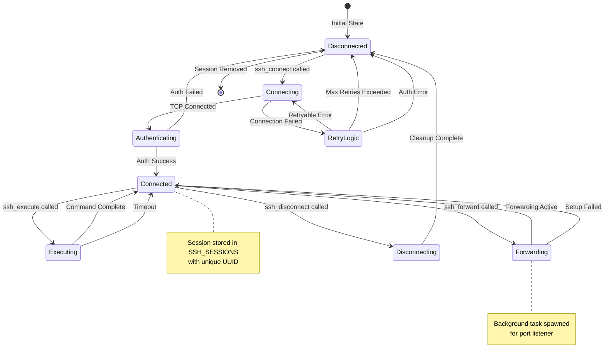

### Session States

| State | Description |
|-------|-------------|
| `Disconnected` | No active connection; session not in store |
| `Connecting` | TCP connection in progress with retry logic |
| `Authenticating` | Connection established; auth in progress |
| `Connected` | Fully connected and ready for operations |
| `Executing` | Command execution in progress |
| `Forwarding` | Port forwarding setup in progress |
| `Disconnecting` | Graceful disconnect in progress |

---

## SSH Connection Flow

Detailed flow of the `ssh_connect` operation:

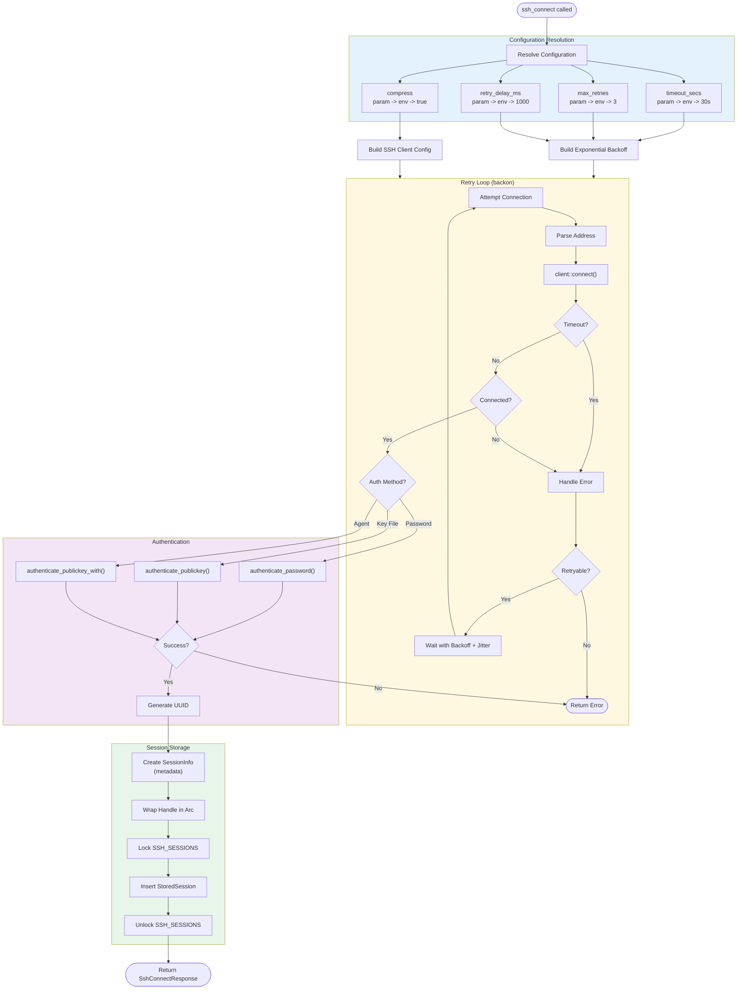

### Address Parsing

The address is parsed to extract host and port:

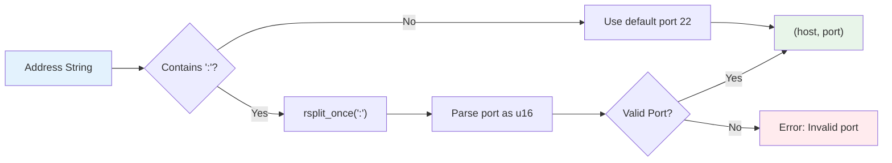

---

## Authentication Flow

Detailed authentication flow supporting multiple methods:

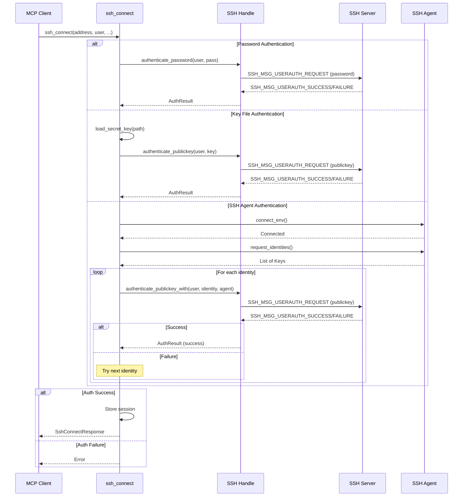

### Authentication Method Priority

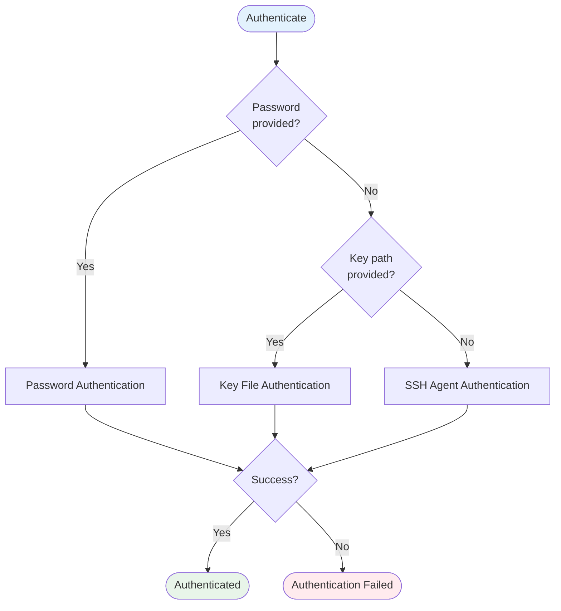

---

## Command Execution Flow

Flow of the `ssh_execute` operation:

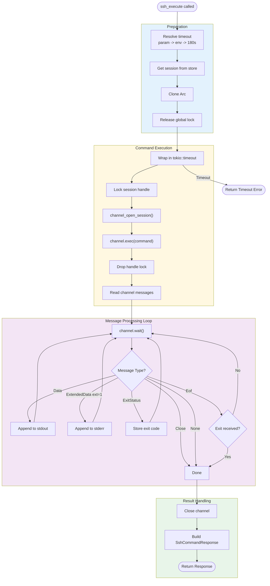

### Channel Message Types

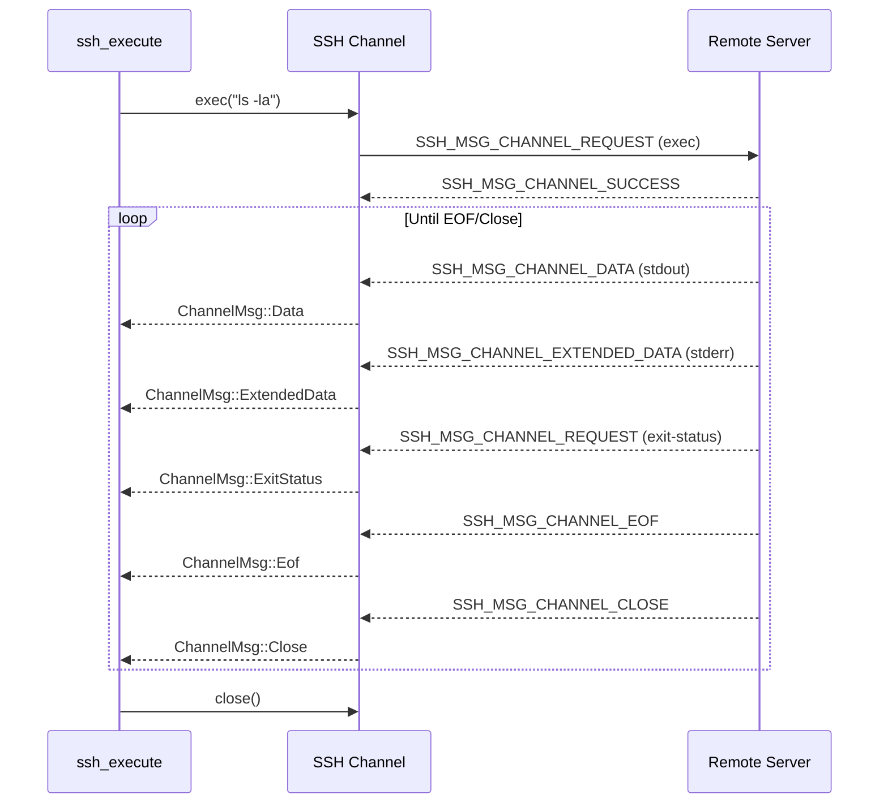

---

## Port Forwarding Flow

Flow of the `ssh_forward` operation (requires `port_forward` feature):

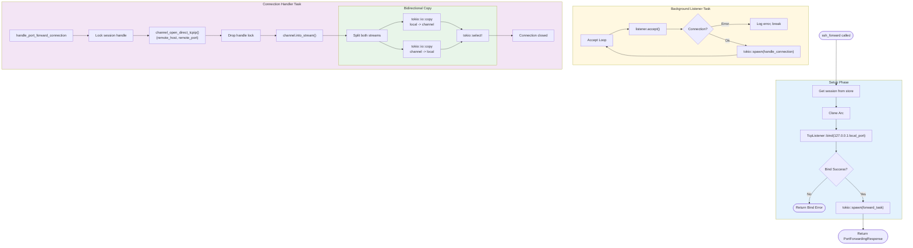

### Port Forwarding Data Flow

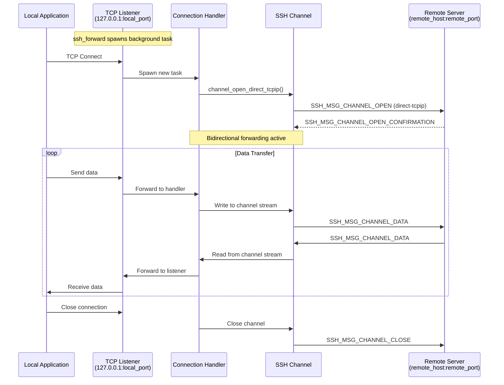

---

## Error Handling and Retry Logic

### Error Classification

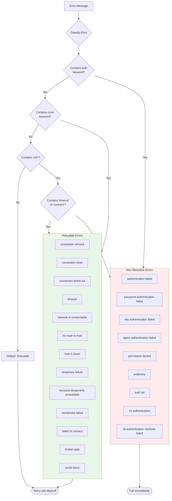

### Exponential Backoff with Jitter

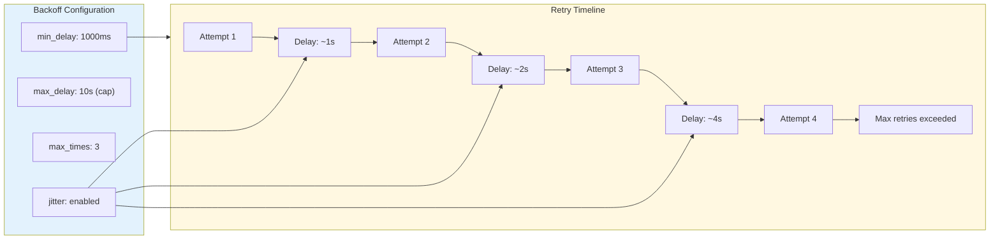

### Retry Notification Flow

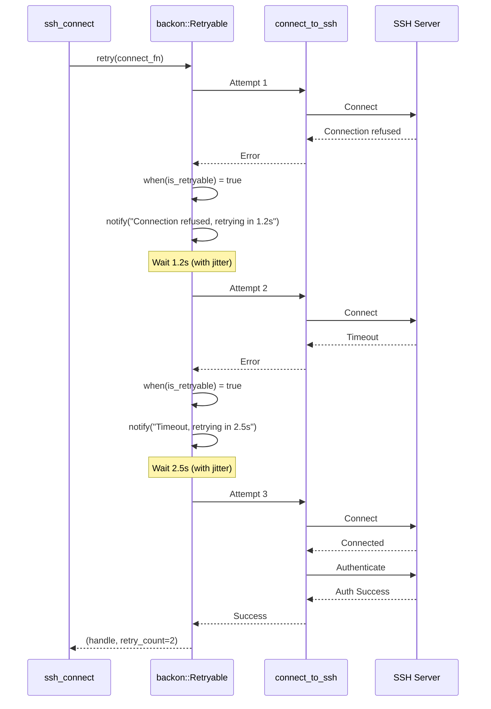
