# SSH MCP Operation Flows

This document describes the operational flows of the SSH MCP server: session lifecycle, connection with smart reuse, authentication, command execution + cancellation, interactive shell lifecycle, SFTP transfers, port forwarding, and retry/error handling. Diagrams reflect the **v2.0.1** codebase where every tool returns a markdown `Text<String>`.

[[_TOC_]]

## Session Lifecycle

The complete lifecycle of an SSH session from creation to termination.

Session lifecycle state diagram

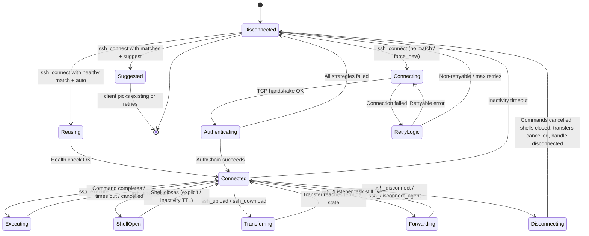
```mermaid
stateDiagram-v2
    [*] --> Disconnected

    Disconnected --> Reusing: ssh_connect with healthy match + auto
    Disconnected --> Suggested: ssh_connect with matches + suggest
    Disconnected --> Connecting: ssh_connect (no match / force_new)

    Suggested --> [*]: client picks existing or retries
    Reusing --> Connected: Health check OK

    Connecting --> Authenticating: TCP handshake OK
    Connecting --> RetryLogic: Connection failed

    RetryLogic --> Connecting: Retryable error
    RetryLogic --> Disconnected: Non-retryable / max retries

    Authenticating --> Connected: AuthChain succeeds
    Authenticating --> Disconnected: All strategies failed

    Connected --> Executing: ssh_execute
    Connected --> ShellOpen: ssh_shell_open
    Connected --> Transferring: ssh_upload / ssh_download
    Connected --> Forwarding: ssh_forward
    Connected --> Disconnecting: ssh_disconnect / ssh_disconnect_agent
    Connected --> Disconnected: Inactivity timeout

    Executing --> Connected: Command completes / times out / cancelled
    ShellOpen --> Connected: Shell closes (explicit / inactivity TTL)
    Transferring --> Connected: Transfer reaches terminal state
    Forwarding --> Connected: Listener task still live

    Disconnecting --> Disconnected: Commands cancelled, shells closed, transfers cancelled, handle disconnected

    Disconnected --> [*]
```

### Session States

| State | Description |
|-------|-------------|
| `Disconnected` | Not present in `SESSION_STORAGE`. |
| `Suggested` | `ssh_connect` found healthy matches and returned `SSH_CONNECT: SUGGESTED` without opening a connection. |
| `Reusing` | `ssh_connect` ran a 5 s `echo 1` health check on an existing session and is returning `SSH_CONNECT: REUSED`. |
| `Connecting` | TCP connection + retry logic in flight. |
| `Authenticating` | AuthChain running; on success, the session is stored. |
| `Connected` | Handle wrapped in `Arc`, `channel_permits: Semaphore(1)` allocated. |
| `Executing` / `ShellOpen` / `Transferring` / `Forwarding` | Background tasks are touching the session — they coexist with other tasks on the same session (channel opens are serialized through the semaphore). |
| `Disconnecting` | `cancel_session_transfers` → `close_session_shells` → `cancel_session_commands` → `SESSION_STORAGE.remove` → `Disconnect::ByApplication`. |

### Session Properties

| Property | Description |
|----------|-------------|
| `name` | Optional human-readable identifier (surfaces in `ssh_list_sessions` and `SUGGESTED` responses). |
| `agent_id` | Optional grouping key used by `ssh_disconnect_agent`. |
| `persistent` | When true, `build_client_config` sets `inactivity_timeout: None`; keepalive (30 s interval, max 3) still runs. |
| `compression_enabled` | Reported on `ssh_list_sessions` decorations as `[compression: off]` when disabled (default: on). |
| `last_health_check` / `healthy` | Populated by `ssh_list_sessions` (sweeps sessions with a 5 s `echo 1`) and by the smart-reuse logic in `ssh_connect`. |
| `channel_permits` | `Arc<Semaphore>` with `CHANNEL_CONCURRENCY_PER_SESSION = 1`. Every russh channel open goes through it, serializing bursts so `MaxSessions` on the remote is never exceeded. |

## SSH Connection Flow

`ssh_connect` combines smart-reuse detection, retry logic, and auth-chain composition.

ssh_connect sequence diagram

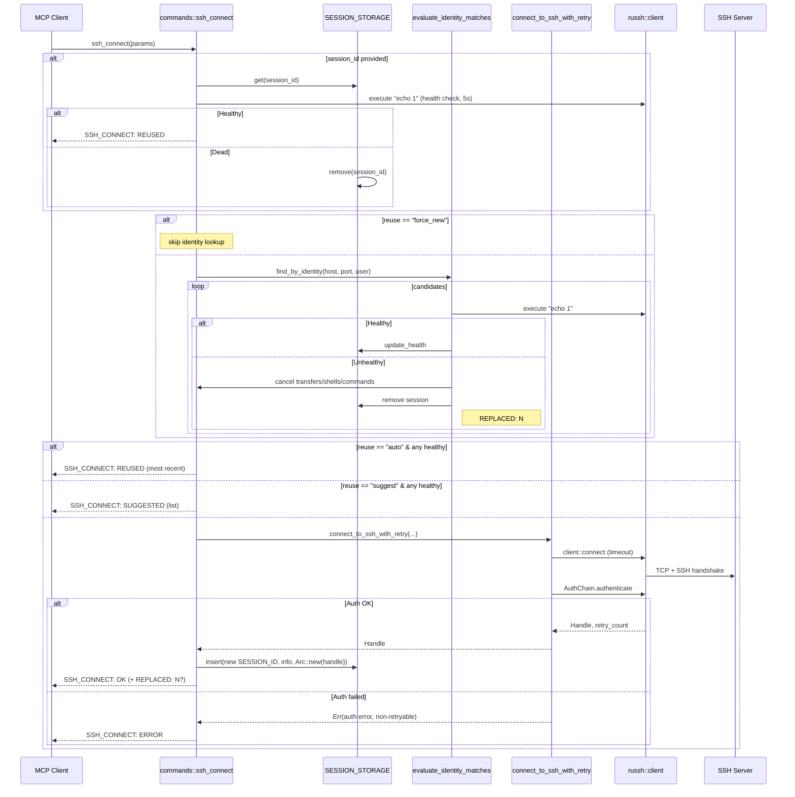
```mermaid
sequenceDiagram
    participant Client as MCP Client
    participant Cmd as commands::ssh_connect
    participant Store as SESSION_STORAGE
    participant Reuse as evaluate_identity_matches
    participant Retry as connect_to_ssh_with_retry
    participant SSH as russh::client
    participant Server as SSH Server

    Client->>Cmd: ssh_connect(params)

    alt session_id provided
        Cmd->>Store: get(session_id)
        Cmd->>SSH: execute "echo 1" (health check, 5s)
        alt Healthy
            Cmd-->>Client: SSH_CONNECT: REUSED
        else Dead
            Store->>Store: remove(session_id)
        end
    end

    alt reuse == "force_new"
        Note over Cmd: skip identity lookup
    else
        Cmd->>Reuse: find_by_identity(host, port, user)
        loop candidates
            Reuse->>SSH: execute "echo 1"
            alt Healthy
                Reuse->>Store: update_health
            else Unhealthy
                Reuse->>Cmd: cancel transfers/shells/commands
                Reuse->>Store: remove session
                Note right of Reuse: REPLACED: N
            end
        end
    end

    alt reuse == "auto" & any healthy
        Cmd-->>Client: SSH_CONNECT: REUSED (most recent)
    else reuse == "suggest" & any healthy
        Cmd-->>Client: SSH_CONNECT: SUGGESTED (list)
    else
        Cmd->>Retry: connect_to_ssh_with_retry(...)
        Retry->>SSH: client::connect (timeout)
        SSH->>Server: TCP + SSH handshake
        Retry->>SSH: AuthChain.authenticate
        alt Auth OK
            SSH-->>Retry: Handle, retry_count
            Retry-->>Cmd: Handle
            Cmd->>Store: insert(new SESSION_ID, info, Arc::new(handle))
            Cmd-->>Client: SSH_CONNECT: OK (+ REPLACED: N?)
        else Auth failed
            Retry-->>Cmd: Err(auth error, non-retryable)
            Cmd-->>Client: SSH_CONNECT: ERROR
        end
    end
```

### Smart Session Reuse

Smart reuse policy flowchart

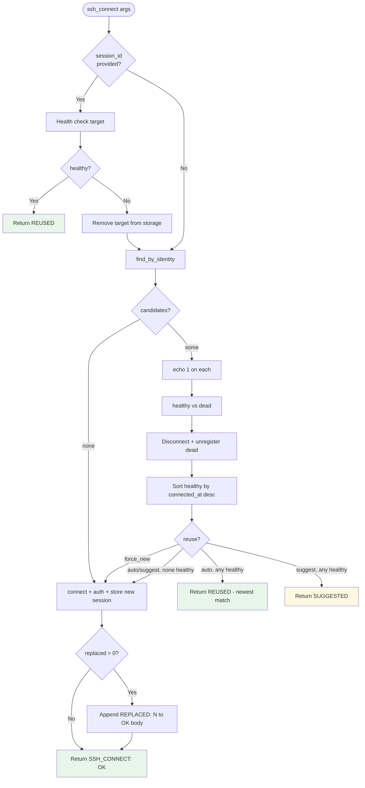
```mermaid
flowchart TD
    Start([ssh_connect args]) --> HasSessionId{session_id<br/>provided?}

    HasSessionId -->|Yes| HealthOne[Health check target]
    HealthOne --> HealthyOne{healthy?}
    HealthyOne -->|Yes| OutputReused[Return REUSED]
    HealthyOne -->|No| DropOne[Remove target from storage]
    DropOne --> LookupIdent

    HasSessionId -->|No| LookupIdent[find_by_identity]

    LookupIdent --> EachCandidate{candidates?}
    EachCandidate -->|none| CreateNew
    EachCandidate -->|some| HealthCheck[echo 1 on each]
    HealthCheck --> Classify[healthy vs dead]
    Classify --> DropDead[Disconnect + unregister dead]
    DropDead --> Sort[Sort healthy by connected_at desc]

    Sort --> Policy{reuse?}
    Policy -->|force_new| CreateNew
    Policy -->|auto, any healthy| OutputReusedAuto[Return REUSED - newest match]
    Policy -->|suggest, any healthy| OutputSuggested[Return SUGGESTED]
    Policy -->|auto/suggest, none healthy| CreateNew

    CreateNew[connect + auth + store new session] --> AppendReplaced{replaced > 0?}
    AppendReplaced -->|Yes| AppendLine[Append REPLACED: N to OK body]
    AppendReplaced -->|No| ReturnOk
    AppendLine --> ReturnOk[Return SSH_CONNECT: OK]

    style OutputReused fill:#e8f5e9
    style OutputReusedAuto fill:#e8f5e9
    style ReturnOk fill:#e8f5e9
    style OutputSuggested fill:#fff8e1
```

### Configuration Resolution Priority

Each configuration value follows the same resolution pattern.

Configuration resolution flowchart

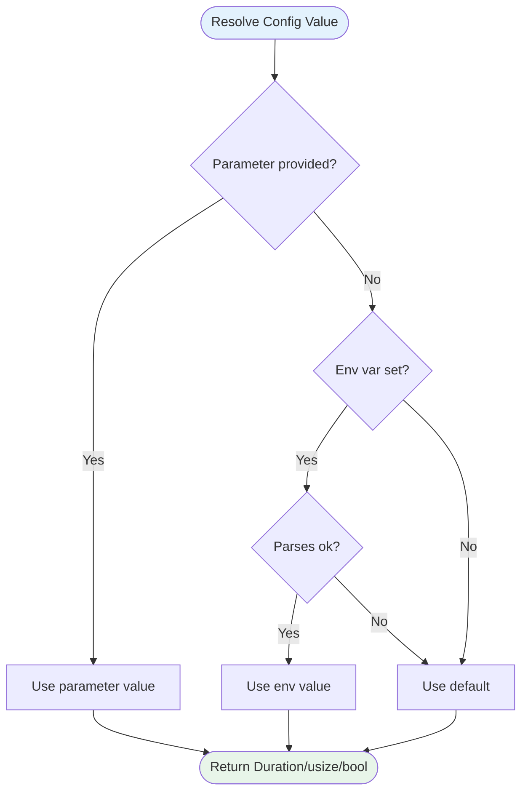
```mermaid
flowchart TD
    Start([Resolve Config Value]) --> CheckParam{Parameter provided?}

    CheckParam -->|Yes| UseParam[Use parameter value]
    CheckParam -->|No| CheckEnv{Env var set?}

    CheckEnv -->|Yes| ParseEnv{Parses ok?}
    CheckEnv -->|No| UseDefault[Use default]

    ParseEnv -->|Yes| UseEnv[Use env value]
    ParseEnv -->|No| UseDefault

    UseParam --> Return([Return Duration/usize/bool])
    UseEnv --> Return
    UseDefault --> Return

    style Start fill:#e3f2fd
    style Return fill:#e8f5e9
```

### Address Parsing

`parse_host_port` (for identity lookups) and `parse_address` (for the russh client) accept plain hosts, `host:port`, and IPv6 bracketed forms.

Address parsing flowchart

```mermaid
flowchart LR
    Input["Address String"] --> IPv6{Starts with '['?}

    IPv6 -->|Yes| SplitBracket["Split on ']'"]
    SplitBracket --> ExtractPort["Port after ':' (default 22)"]
    ExtractPort --> Lowercase

    IPv6 -->|No| Colon{Contains colon?}
    Colon -->|Yes| Split["rsplit_once on colon"]
    Colon -->|No| Default22["port = 22"]

    Split --> ParsePort["Parse as u16"]
    ParsePort --> Valid{Valid?}
    Valid -->|Yes| Lowercase
    Valid -->|No| Default22

    Default22 --> Lowercase
    Lowercase["Lowercase host"] --> Return["(host_lc, port)"]

    style Input fill:#e3f2fd
    style Return fill:#e8f5e9
```

## Authentication Flow

`client::build_auth_chain` composes an `AuthChain` that is later called by `client::connect_to_ssh`:

1. `PasswordAuth` (when `password` is provided).
2. `KeyAuth` for `key_path` (if explicit) **or** one per default OpenSSH key found in `~/.ssh/` (`id_ed25519`, `id_ecdsa`, `id_ecdsa_sk`, `id_ed25519_sk`, `id_rsa`, `id_dsa`).
3. `AgentAuth` (always appended).

Every strategy implements `AuthStrategy`; the chain stops at the first success.

Authentication sequence diagram

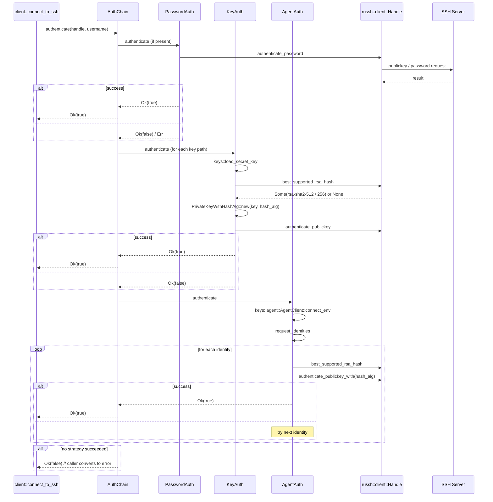
```mermaid
sequenceDiagram
    participant Client as client::connect_to_ssh
    participant Chain as AuthChain
    participant Pass as PasswordAuth
    participant Key as KeyAuth
    participant Agent as AgentAuth
    participant Handle as russh::client::Handle
    participant Server as SSH Server

    Client->>Chain: authenticate(handle, username)

    Chain->>Pass: authenticate (if present)
    Pass->>Handle: authenticate_password
    Handle->>Server: publickey / password request
    Server-->>Handle: result
    alt success
        Pass-->>Chain: Ok(true)
        Chain-->>Client: Ok(true)
    else
        Pass-->>Chain: Ok(false) / Err
    end

    Chain->>Key: authenticate (for each key path)
    Key->>Key: keys::load_secret_key
    Key->>Handle: best_supported_rsa_hash
    Handle-->>Key: Some(rsa-sha2-512 / 256) or None
    Key->>Key: PrivateKeyWithHashAlg::new(key, hash_alg)
    Key->>Handle: authenticate_publickey
    alt success
        Key-->>Chain: Ok(true)
        Chain-->>Client: Ok(true)
    else
        Key-->>Chain: Ok(false)
    end

    Chain->>Agent: authenticate
    Agent->>Agent: keys::agent::AgentClient::connect_env
    Agent->>Agent: request_identities
    loop for each identity
        Agent->>Handle: best_supported_rsa_hash
        Agent->>Handle: authenticate_publickey_with(hash_alg)
        alt success
            Agent-->>Chain: Ok(true)
            Chain-->>Client: Ok(true)
        else
            Note over Agent: try next identity
        end
    end

    alt no strategy succeeded
        Chain-->>Client: Ok(false)  // caller converts to error
    end
```

### RSA Hash Algorithm Negotiation

RSA hash negotiation flowchart

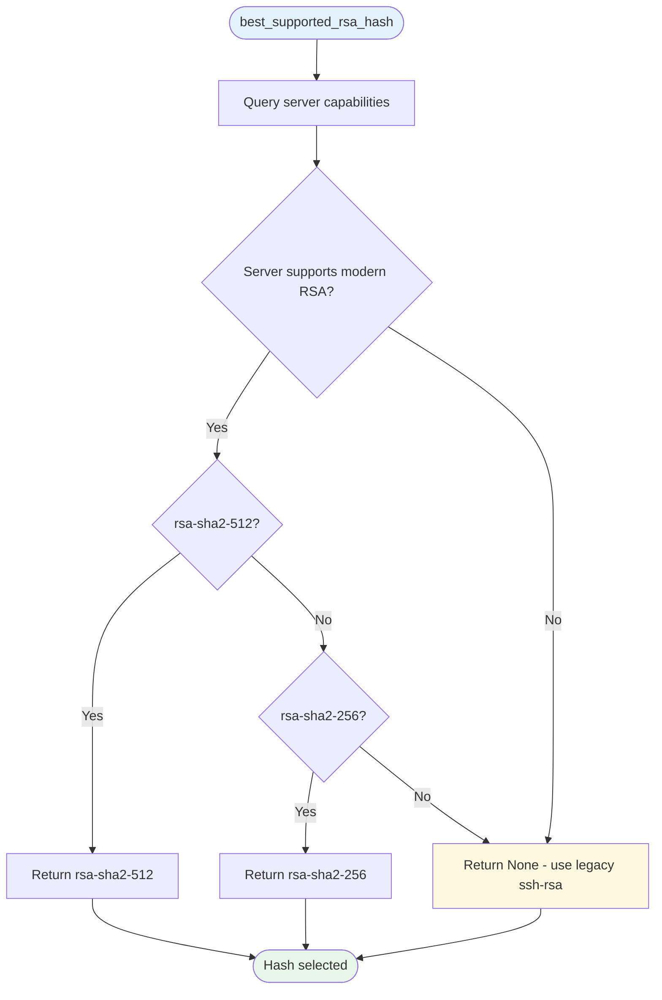
```mermaid
flowchart TD
    Start([best_supported_rsa_hash]) --> Query[Query server capabilities]
    Query --> CheckSupport{Server supports modern RSA?}

    CheckSupport -->|Yes| CheckSHA512{rsa-sha2-512?}
    CheckSupport -->|No| Legacy[Return None - use legacy ssh-rsa]

    CheckSHA512 -->|Yes| UseSHA512[Return rsa-sha2-512]
    CheckSHA512 -->|No| CheckSHA256{rsa-sha2-256?}

    CheckSHA256 -->|Yes| UseSHA256[Return rsa-sha2-256]
    CheckSHA256 -->|No| Legacy

    UseSHA512 --> End([Hash selected])
    UseSHA256 --> End
    Legacy --> End

    style Start fill:#e3f2fd
    style End fill:#e8f5e9
    style Legacy fill:#fff8e1
```

### Authentication Method Priority

Authentication priority flowchart

```mermaid
flowchart TD
    Start([build_auth_chain]) --> CheckPassword{password<br/>provided?}
    CheckPassword -->|Yes| AddPassword[chain.with_password]
    AddPassword --> CheckKey
    CheckPassword -->|No| CheckKey{key_path<br/>provided?}

    CheckKey -->|Yes| AddKey[chain.with_key(key_path)]
    CheckKey -->|No| Discover[discover_default_keys]
    Discover --> LoopKeys{found any?}
    LoopKeys -->|Yes| EachKey[chain.with_key(path)]
    EachKey --> LoopKeys
    LoopKeys -->|No| AddAgent

    AddKey --> AddAgent[chain.with_agent (always)]
    Discover --> AddAgent

    AddAgent --> Done([Chain ready])

    style Start fill:#e3f2fd
    style Done fill:#e8f5e9
```

## Command Execution Flow

`ssh_execute` registers a `RunningCommand`, queues a background task through the per-session channel semaphore, and returns a `COMMAND_ID` immediately.

ssh_execute sequence diagram

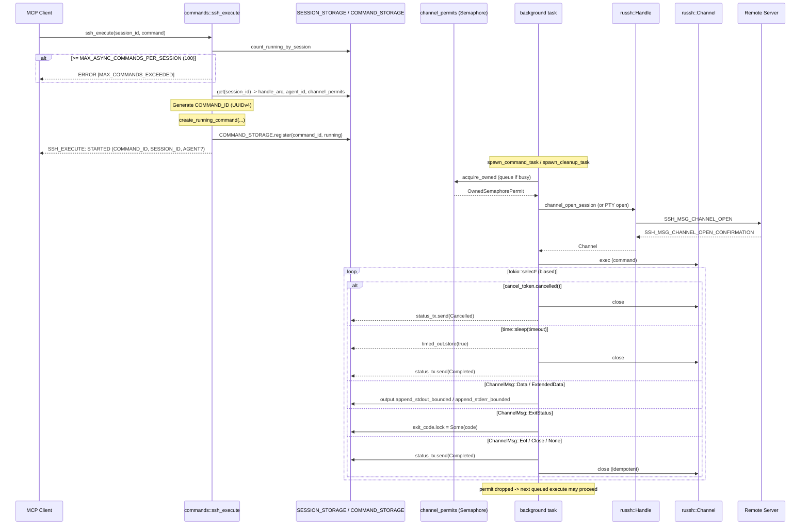
```mermaid
sequenceDiagram
    participant Client as MCP Client
    participant Cmd as commands::ssh_execute
    participant Store as SESSION_STORAGE / COMMAND_STORAGE
    participant Sem as channel_permits (Semaphore)
    participant Task as background task
    participant Handle as russh::Handle
    participant Channel as russh::Channel
    participant Server as Remote Server

    Client->>Cmd: ssh_execute(session_id, command)

    Cmd->>Store: count_running_by_session
    alt >= MAX_ASYNC_COMMANDS_PER_SESSION (100)
        Cmd-->>Client: ERROR [MAX_COMMANDS_EXCEEDED]
    end

    Cmd->>Store: get(session_id) -> handle_arc, agent_id, channel_permits

    Note over Cmd: Generate COMMAND_ID (UUIDv4)
    Note over Cmd: create_running_command(...)
    Cmd->>Store: COMMAND_STORAGE.register(command_id, running)

    Cmd-->>Client: SSH_EXECUTE: STARTED (COMMAND_ID, SESSION_ID, AGENT?)

    Note over Task: spawn_command_task / spawn_cleanup_task

    Task->>Sem: acquire_owned (queue if busy)
    Sem-->>Task: OwnedSemaphorePermit

    Task->>Handle: channel_open_session (or PTY open)
    Handle->>Server: SSH_MSG_CHANNEL_OPEN
    Server-->>Handle: SSH_MSG_CHANNEL_OPEN_CONFIRMATION
    Handle-->>Task: Channel

    Task->>Channel: exec (command)

    loop tokio::select! (biased)
        alt cancel_token.cancelled()
            Task->>Channel: close
            Task-->>Store: status_tx.send(Cancelled)
        else time::sleep(timeout)
            Task-->>Store: timed_out.store(true)
            Task->>Channel: close
            Task-->>Store: status_tx.send(Completed)
        else ChannelMsg::Data / ExtendedData
            Task->>Store: output.append_stdout_bounded / append_stderr_bounded
        else ChannelMsg::ExitStatus
            Task->>Store: exit_code.lock = Some(code)
        else ChannelMsg::Eof / Close / None
            Task->>Store: status_tx.send(Completed)
            Task->>Channel: close (idempotent)
        end
    end

    Note over Task: permit dropped -> next queued execute may proceed
```

### Polling for Output

Polling sequence diagram

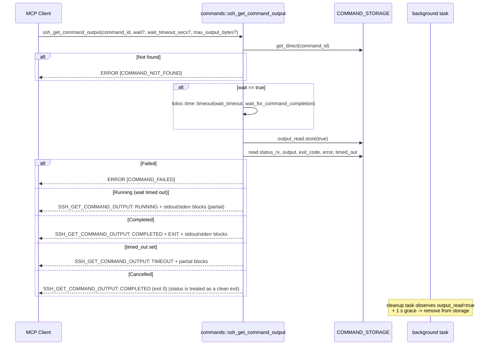
```mermaid
sequenceDiagram
    participant Client as MCP Client
    participant Cmd as commands::ssh_get_command_output
    participant Store as COMMAND_STORAGE
    participant Task as background task

    Client->>Cmd: ssh_get_command_output(command_id, wait?, wait_timeout_secs?, max_output_bytes?)

    Cmd->>Store: get_direct(command_id)
    alt Not found
        Cmd-->>Client: ERROR [COMMAND_NOT_FOUND]
    end

    alt wait == true
        Cmd->>Cmd: tokio::time::timeout(wait_timeout, wait_for_command_completion)
    end

    Cmd->>Store: output_read.store(true)
    Cmd->>Store: read status_rx, output, exit_code, error, timed_out

    alt Failed
        Cmd-->>Client: ERROR [COMMAND_FAILED]
    else Running (wait timed out)
        Cmd-->>Client: SSH_GET_COMMAND_OUTPUT: RUNNING + stdout/stderr blocks (partial)
    else Completed
        Cmd-->>Client: SSH_GET_COMMAND_OUTPUT: COMPLETED + EXIT + stdout/stderr blocks
    else timed_out set
        Cmd-->>Client: SSH_GET_COMMAND_OUTPUT: TIMEOUT + partial blocks
    else Cancelled
        Cmd-->>Client: SSH_GET_COMMAND_OUTPUT: COMPLETED (exit 0) (status is treated as a clean exit)
    end

    Note over Task: cleanup task observes output_read=true<br/>+ 1 s grace -> remove from storage
```

### Async Command State Machine

Async command state machine

```mermaid
stateDiagram-v2
    [*] --> NotStarted

    NotStarted --> Queued: ssh_execute registers RunningCommand
    Queued --> Acquiring: Await channel_permits
    Acquiring --> Collecting: channel_open_session + exec
    Acquiring --> Failed: Channel open error

    Collecting --> Collecting: ChannelMsg::Data / ExtendedData
    Collecting --> Completed: Eof / Close / exit_code received
    Collecting --> Completed: Timeout -> partial + timed_out=true
    Collecting --> Cancelled: cancel_token triggered
    Collecting --> Failed: exec error / permit closed

    Completed --> ReadyRead
    Cancelled --> ReadyRead
    Failed --> ReadyRead
    ReadyRead --> Cleanup: output_read + 1s grace
    ReadyRead --> Cleanup: TTL (SSH_COMMAND_CLEANUP_TTL)

    Cleanup --> [*]
```

### Session Cap Enforcement

Async command limits flowchart

```mermaid
flowchart TD
    Start([ssh_execute]) --> CountRunning[COMMAND_STORAGE.count_running_by_session]
    CountRunning --> CheckLimit{>= 100?}

    CheckLimit -->|Yes| Reject[Return ERROR [MAX_COMMANDS_EXCEEDED]]
    CheckLimit -->|No| GetSession[SESSION_STORAGE.get]

    GetSession --> Found{Found?}
    Found -->|No| SessionError[Return ERROR [SESSION_NOT_FOUND]]
    Found -->|Yes| CreateState[create_running_command + register_and_spawn]

    CreateState --> Spawn[tokio::spawn background task]
    Spawn --> Return[Return SSH_EXECUTE: STARTED]

    style Return fill:#e8f5e9
    style Reject fill:#ffebee
    style SessionError fill:#ffebee
```

## Command Cancellation Flow

`ssh_cancel_command` triggers the cancellation token, waits up to 5 s for the background task to transition out of `Running`, then pauses 100 ms more before returning. The post-drain pause guarantees the server's `CHANNEL_CLOSE` accounting is settled, so a quick `execute + cancel + execute` burst never races `MaxSessions`.

Cancellation sequence diagram

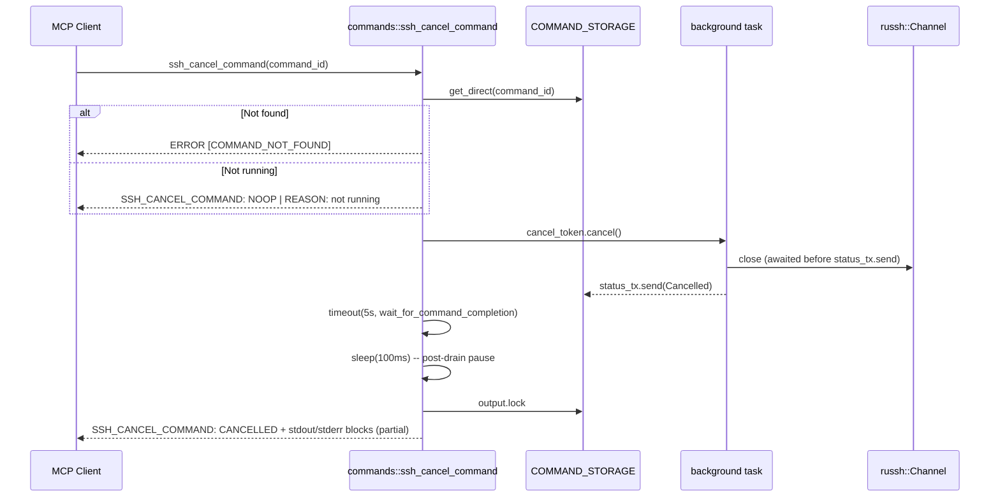
```mermaid
sequenceDiagram
    participant Client as MCP Client
    participant Cmd as commands::ssh_cancel_command
    participant Store as COMMAND_STORAGE
    participant Task as background task
    participant Channel as russh::Channel

    Client->>Cmd: ssh_cancel_command(command_id)

    Cmd->>Store: get_direct(command_id)
    alt Not found
        Cmd-->>Client: ERROR [COMMAND_NOT_FOUND]
    else Not running
        Cmd-->>Client: SSH_CANCEL_COMMAND: NOOP | REASON: not running
    end

    Cmd->>Task: cancel_token.cancel()

    Task->>Channel: close (awaited before status_tx.send)
    Task-->>Store: status_tx.send(Cancelled)

    Cmd->>Cmd: timeout(5s, wait_for_command_completion)
    Cmd->>Cmd: sleep(100ms) -- post-drain pause

    Cmd->>Store: output.lock
    Cmd-->>Client: SSH_CANCEL_COMMAND: CANCELLED + stdout/stderr blocks (partial)
```

### Cancellation Signal Flow

Cancellation signal flow

```mermaid
flowchart TD
    subgraph ClientSide["Client Side"]
        Call[ssh_cancel_command]
        Lookup[COMMAND_STORAGE.get_direct]
        SignalCancel[cancel_token.cancel]
        WaitStatus[timeout(5s) + sleep(100ms)]
        Response[SSH_CANCEL_COMMAND: CANCELLED]
    end

    subgraph BackgroundTask["Background Task (select! biased)"]
        WaitSelect[select! awaits]
        CancelBranch[cancel_token.cancelled()]
        TimeoutBranch[time::sleep(timeout)]
        OutputBranch[ChannelMsg / collect_async_output]
    end

    subgraph Cleanup["Cleanup Side"]
        Close[Channel.close]
        Status[status_tx.send(Cancelled)]
    end

    Call --> Lookup
    Lookup --> SignalCancel
    SignalCancel -.->|signal| CancelBranch
    SignalCancel --> WaitStatus

    WaitSelect --> CancelBranch
    CancelBranch --> Close
    Close --> Status

    WaitStatus -->|status changed| Response

    style ClientSide fill:#e3f2fd
    style BackgroundTask fill:#fff8e1
    style Cleanup fill:#e8f5e9
```

### Partial Output Recovery

When a command is cancelled, whatever was collected before the signal is preserved:

Partial output recovery

```mermaid
flowchart LR
    subgraph Before["Before Cancellation"]
        Stdout1[stdout: partial bytes]
        Stderr1[stderr: partial bytes]
        Status1[status: Running]
    end

    subgraph Cancel["Cancellation"]
        Signal[cancel_token.cancel]
        Wait[Wait up to 5s + 100ms drain]
    end

    subgraph After["After Cancellation"]
        Stdout2[stdout: preserved + head-drained]
        Stderr2[stderr: preserved + head-drained]
        Status2[status: Cancelled]
        Annotated[(partial) output block]
    end

    Before --> Cancel
    Cancel --> After

    Stdout1 -.-> Stdout2
    Stderr1 -.-> Stderr2

    style Before fill:#fff8e1
    style Cancel fill:#ffebee
    style After fill:#e8f5e9
```

### Cancel Response Fields

| Field | Description |
|-------|-------------|
| `SSH_CANCEL_COMMAND: CANCELLED` | Command was running and cancel succeeded. |
| `SSH_CANCEL_COMMAND: NOOP` | Command was not in `Running` state — idempotent response. |
| `COMMAND_ID` | The cancelled command's UUID. |
| `--- stdout [nonce] (partial) ---` | Captured output before cancellation. |
| `--- stderr [nonce] (partial, empty) ---` | Empty output block when stderr was never written. |

## Interactive Shell Lifecycle

`ssh_shell_open` allocates a PTY channel, splits it into read/write halves, and spawns a dedicated reader task plus an inactivity-TTL watcher.

Shell open/read/close sequence

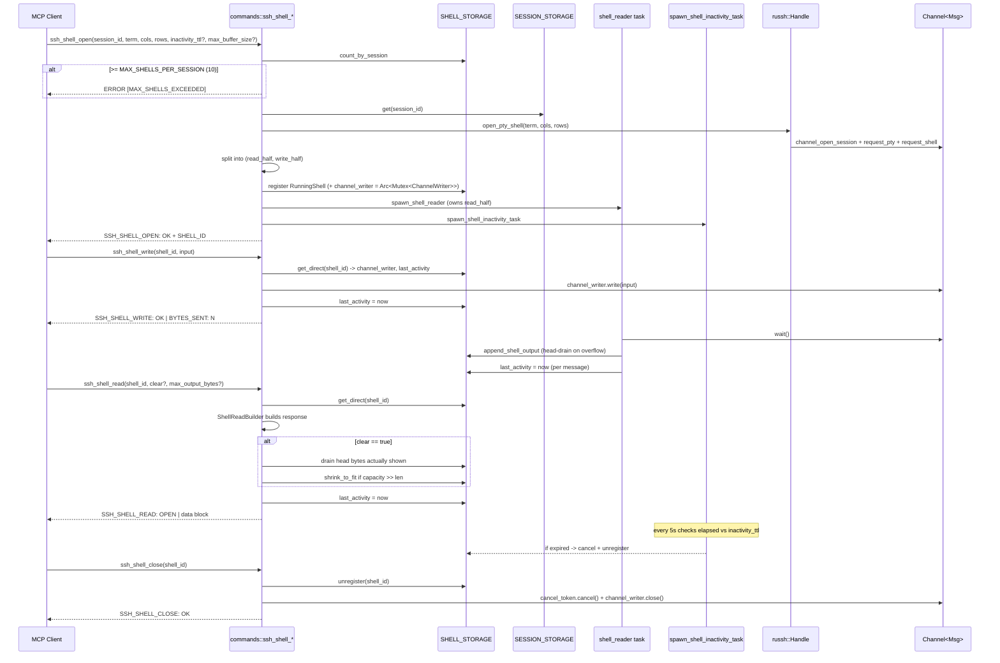
```mermaid
sequenceDiagram
    participant Client as MCP Client
    participant Cmd as commands::ssh_shell_*
    participant Store as SHELL_STORAGE
    participant Session as SESSION_STORAGE
    participant Reader as shell_reader task
    participant TTL as spawn_shell_inactivity_task
    participant Handle as russh::Handle
    participant Channel as Channel<Msg>

    Client->>Cmd: ssh_shell_open(session_id, term, cols, rows, inactivity_ttl?, max_buffer_size?)
    Cmd->>Store: count_by_session
    alt >= MAX_SHELLS_PER_SESSION (10)
        Cmd-->>Client: ERROR [MAX_SHELLS_EXCEEDED]
    end
    Cmd->>Session: get(session_id)
    Cmd->>Handle: open_pty_shell(term, cols, rows)
    Handle->>Channel: channel_open_session + request_pty + request_shell
    Cmd->>Cmd: split into (read_half, write_half)
    Cmd->>Store: register RunningShell (+ channel_writer = Arc<Mutex<ChannelWriter>>)
    Cmd->>Reader: spawn_shell_reader (owns read_half)
    Cmd->>TTL: spawn_shell_inactivity_task
    Cmd-->>Client: SSH_SHELL_OPEN: OK + SHELL_ID

    Client->>Cmd: ssh_shell_write(shell_id, input)
    Cmd->>Store: get_direct(shell_id) -> channel_writer, last_activity
    Cmd->>Channel: channel_writer.write(input)
    Cmd->>Store: last_activity = now
    Cmd-->>Client: SSH_SHELL_WRITE: OK | BYTES_SENT: N

    Reader->>Channel: wait()
    Reader->>Store: append_shell_output (head-drain on overflow)
    Reader->>Store: last_activity = now (per message)

    Client->>Cmd: ssh_shell_read(shell_id, clear?, max_output_bytes?)
    Cmd->>Store: get_direct(shell_id)
    Cmd->>Cmd: ShellReadBuilder builds response
    alt clear == true
        Cmd->>Store: drain head bytes actually shown
        Cmd->>Store: shrink_to_fit if capacity >> len
    end
    Cmd->>Store: last_activity = now
    Cmd-->>Client: SSH_SHELL_READ: OPEN | data block

    Note over TTL: every 5s checks elapsed vs inactivity_ttl
    TTL-->>Store: if expired -> cancel + unregister

    Client->>Cmd: ssh_shell_close(shell_id)
    Cmd->>Store: unregister(shell_id)
    Cmd->>Channel: cancel_token.cancel() + channel_writer.close()
    Cmd-->>Client: SSH_SHELL_CLOSE: OK
```

### Shell States

| State | Trigger |
|-------|---------|
| `Open` | Successful `ssh_shell_open`. Reader task running, TTL task watching activity. |
| `Closed` | Reader received `Eof`/`Close`/`None`, or the inactivity task cancelled the token, or `ssh_shell_close` removed the entry. `status_tx` broadcasts `Closed`. |

Head-based pagination on `ssh_shell_read(clear=true)` removes only the bytes rendered in the response, keeping the rest available for the next call.

## SFTP Transfer Flow

Transfers are spawned as background tasks similar to async commands but do not consume the per-session channel semaphore (SFTP runs on its own subsystem channel).

SFTP upload sequence

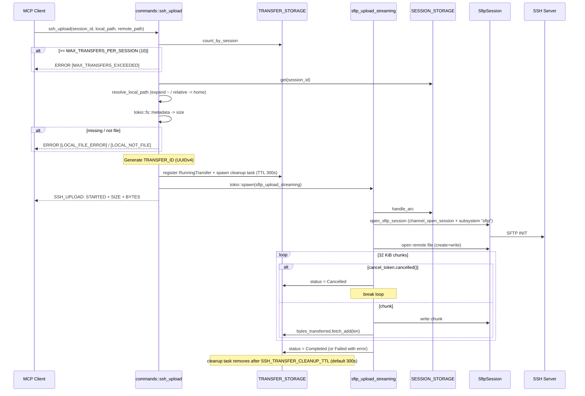
```mermaid
sequenceDiagram
    participant Client as MCP Client
    participant Cmd as commands::ssh_upload
    participant Store as TRANSFER_STORAGE
    participant Task as sftp_upload_streaming
    participant Session as SESSION_STORAGE
    participant SFTP as SftpSession
    participant Server as SSH Server

    Client->>Cmd: ssh_upload(session_id, local_path, remote_path)

    Cmd->>Store: count_by_session
    alt >= MAX_TRANSFERS_PER_SESSION (10)
        Cmd-->>Client: ERROR [MAX_TRANSFERS_EXCEEDED]
    end

    Cmd->>Session: get(session_id)
    Cmd->>Cmd: resolve_local_path (expand ~ / relative -> home)
    Cmd->>Cmd: tokio::fs::metadata -> size
    alt missing / not file
        Cmd-->>Client: ERROR [LOCAL_FILE_ERROR] / [LOCAL_NOT_FILE]
    end

    Note over Cmd: Generate TRANSFER_ID (UUIDv4)
    Cmd->>Store: register RunningTransfer + spawn cleanup task (TTL 300s)
    Cmd->>Task: tokio::spawn(sftp_upload_streaming)

    Cmd-->>Client: SSH_UPLOAD: STARTED + SIZE + BYTES

    Task->>Session: handle_arc
    Task->>SFTP: open_sftp_session (channel_open_session + subsystem "sftp")
    SFTP->>Server: SFTP INIT
    Task->>SFTP: open remote file (create+write)

    loop 32 KiB chunks
        alt cancel_token.cancelled()
            Task->>Store: status = Cancelled
            Note over Task: break loop
        else chunk
            Task->>SFTP: write chunk
            Task->>Store: bytes_transferred.fetch_add(len)
        end
    end

    Task->>Store: status = Completed (or Failed with error)

    Note over Store: cleanup task removes after SSH_TRANSFER_CLEANUP_TTL (default 300s)
```

Downloads mirror the flow through `sftp_download_streaming`: the tool pre-fetches metadata via `SftpSession::metadata` to know the total size before starting, then streams in 32 KiB chunks.

### Transfer State Machine

Transfer state machine

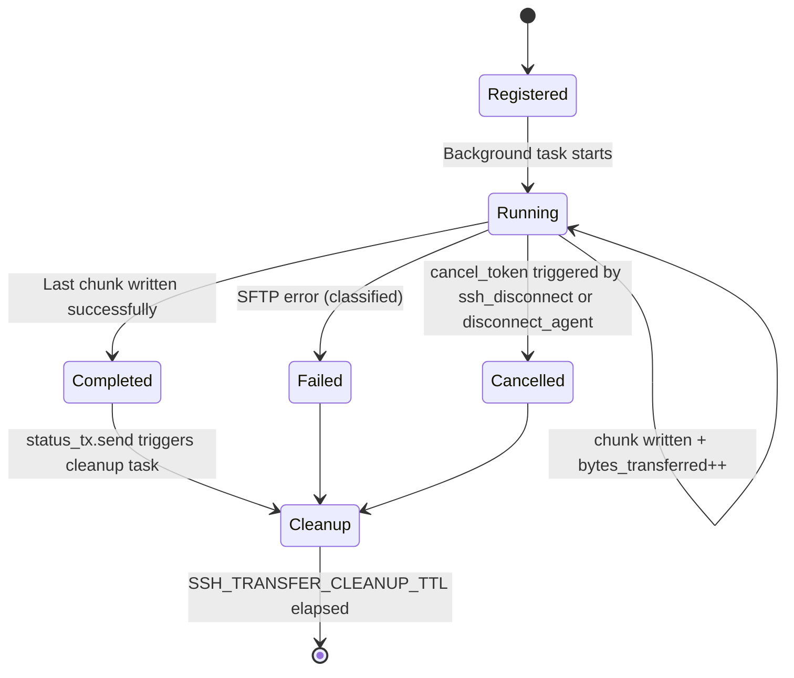
```mermaid
stateDiagram-v2
    [*] --> Registered
    Registered --> Running: Background task starts
    Running --> Running: chunk written + bytes_transferred++
    Running --> Completed: Last chunk written successfully
    Running --> Failed: SFTP error (classified)
    Running --> Cancelled: cancel_token triggered by ssh_disconnect or disconnect_agent

    Completed --> Cleanup: status_tx.send triggers cleanup task
    Failed --> Cleanup
    Cancelled --> Cleanup

    Cleanup --> [*]: SSH_TRANSFER_CLEANUP_TTL elapsed
```

### Error Classification

`classify_transfer_error(operation, raw)` maps raw SFTP errors to structured codes consumed by the tool responses:

| Code | Trigger substring | Emitted via |
|------|-------------------|-------------|
| `READ_ONLY_FS` | `"read-only file system"` | `REASON: [READ_ONLY_FS] target filesystem is read-only ...` |
| `DISK_FULL` | `"no space left on device"` | ... |
| `PERMISSION_DENIED` | `"permission denied"` | ... |
| `CONNECTION_LOST` | `broken pipe` / `connection reset/refused` / `network is unreachable` / `no route to host` | ... |
| `TIMEOUT` | `timed out` / `timeout` | ... |
| `REMOTE_DIR_NOT_FOUND` | (`no such file` or `not a directory`) AND operation contains `create` | Missing remote parent directory on upload. |
| `FILE_NOT_FOUND` | `no such file` / `not found` | ... |
| `SFTP_PROTOCOL` | `channel` / `subsystem` / `sftp` / `session` | ... |
| `IO_ERROR` | fallback | ... |

## Port Forwarding Flow

`ssh_forward` binds a local TCP listener on `127.0.0.1:<local_port>` and spawns an accept loop. Every incoming connection is handled by a per-connection task that opens a `direct-tcpip` channel and copies bytes both ways via `tokio::io::copy`.

Port forwarding sequence diagram

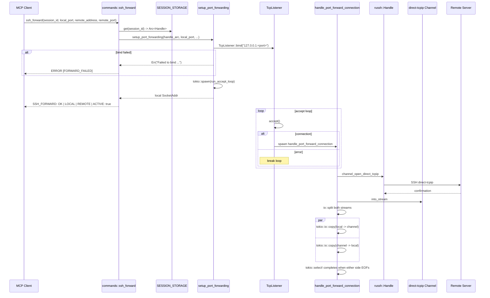
```mermaid
sequenceDiagram
    participant Client as MCP Client
    participant Cmd as commands::ssh_forward
    participant Session as SESSION_STORAGE
    participant Setup as setup_port_forwarding
    participant Listener as TcpListener
    participant Handler as handle_port_forward_connection
    participant Handle as russh::Handle
    participant Channel as direct-tcpip Channel
    participant Remote as Remote Server

    Client->>Cmd: ssh_forward(session_id, local_port, remote_address, remote_port)
    Cmd->>Session: get(session_id) -> Arc<Handle>
    Cmd->>Setup: setup_port_forwarding(handle_arc, local_port, ...)

    Setup->>Listener: TcpListener::bind("127.0.0.1:<port>")
    alt bind failed
        Setup-->>Cmd: Err("Failed to bind ...")
        Cmd-->>Client: ERROR [FORWARD_FAILED]
    end

    Setup->>Setup: tokio::spawn(run_accept_loop)
    Setup-->>Cmd: local SocketAddr
    Cmd-->>Client: SSH_FORWARD: OK | LOCAL | REMOTE | ACTIVE: true

    loop accept loop
        Listener->>Listener: accept()
        alt connection
            Listener->>Handler: spawn handle_port_forward_connection
        else error
            Note over Listener: break loop
        end
    end

    Handler->>Handle: channel_open_direct_tcpip
    Handle->>Remote: SSH direct-tcpip
    Remote-->>Handle: confirmation
    Handler->>Channel: into_stream
    Handler->>Handler: io::split both streams
    par
        Handler->>Handler: tokio::io::copy(local -> channel)
    and
        Handler->>Handler: tokio::io::copy(channel -> local)
    end
    Handler->>Handler: tokio::select! completes when either side EOFs
```

### Port Forwarding Data Flow

Port forwarding data flow

```mermaid
flowchart TD
    subgraph Setup["Setup"]
        GetSession[Get session handle]
        Bind[TcpListener::bind 127.0.0.1:port]
        Spawn[tokio::spawn(run_accept_loop)]
    end

    GetSession --> Bind
    Bind --> BindResult{Bind ok?}
    BindResult -->|No| ErrReturn([Return FORWARD_FAILED])
    BindResult -->|Yes| Spawn
    Spawn --> OkReturn([Return OK | LOCAL | REMOTE | ACTIVE: true])

    subgraph AcceptLoop["Accept Loop (background)"]
        Accept[listener.accept]
        Decide{Connection?}
        Dispatch[spawn handle_port_forward_connection]
    end

    Accept --> Decide
    Decide -->|Ok| Dispatch
    Decide -->|Error| Break[log + break]

    subgraph PerConn["Per-connection Handler"]
        OpenDirect[channel_open_direct_tcpip]
        IntoStream[channel.into_stream]
        Split[io::split]
        L2R[tokio::io::copy local to remote]
        R2L[tokio::io::copy remote to local]
        SelectCopy[tokio::select! either side]
    end

    OpenDirect --> IntoStream --> Split
    Split --> L2R
    Split --> R2L
    L2R --> SelectCopy
    R2L --> SelectCopy

    style Setup fill:#e3f2fd
    style AcceptLoop fill:#fff8e1
    style PerConn fill:#f3e5f5
```

## Error Handling and Retry Logic

### Error Classification

`error::is_retryable_error` matches case-insensitive substrings.

Error classification flowchart

```mermaid
flowchart TD
    Error["Error Message"] --> ToLower["Lowercase"]
    ToLower --> CheckAuth{auth keyword?}

    CheckAuth -->|Yes| NonRetryable([Not retryable])
    CheckAuth -->|No| CheckConn{connection keyword?}

    CheckConn -->|Yes| Retryable([Retryable])
    CheckConn -->|No| CheckSSH{contains "ssh"?}

    CheckSSH -->|No| DefaultRetry([Retryable - conservative default])
    CheckSSH -->|Yes| CheckTimeout{contains "timeout" or "connect"?}

    CheckTimeout -->|Yes| Retryable
    CheckTimeout -->|No| NonRetryable

    subgraph AuthKeywords["Auth keywords (AUTH_ERRORS)"]
        direction TB
        A1["authentication failed"]
        A2["password authentication failed"]
        A3["key authentication failed"]
        A4["agent authentication failed"]
        A5["permission denied"]
        A6["publickey"]
        A7["auth fail"]
        A8["no authentication"]
        A9["all authentication methods failed"]
    end

    subgraph ConnKeywords["Connection keywords (RETRYABLE_ERRORS)"]
        direction TB
        C1["connection refused"]
        C2["connection reset"]
        C3["connection timed out"]
        C4["timeout"]
        C5["network is unreachable"]
        C6["no route to host"]
        C7["host is down"]
        C8["temporary failure"]
        C9["resource temporarily unavailable"]
        C10["handshake failed"]
        C11["failed to connect"]
        C12["broken pipe"]
        C13["would block"]
    end

    style NonRetryable fill:#ffebee
    style Retryable fill:#e8f5e9
    style DefaultRetry fill:#e8f5e9
```

### Exponential Backoff with Jitter

`client::build_backoff` constructs a `backon::ExponentialBuilder` with `min_delay = retry_delay`, `max_delay = MAX_RETRY_DELAY` (10 s), `max_times = max_retries`, and `.with_jitter()`.

Exponential backoff sequence diagram

```mermaid
sequenceDiagram
    participant Client as connect_to_ssh_with_retry
    participant Retryable as backon::Retryable
    participant SSH as connect_to_ssh
    participant Classifier as is_retryable_error

    Client->>Client: ExponentialBuilder (min/max/max_times + jitter)
    Client->>Retryable: wrap retryable closure

    loop until success or max retries
        Retryable->>SSH: attempt connection
        alt Success
            SSH-->>Retryable: Handle
            Retryable-->>Client: Ok(Handle)
        else Error
            SSH-->>Retryable: Err(message)
            Retryable->>Classifier: when(err)
            alt Retryable
                Note over Retryable: wait with jitter (capped at 10s)
            else Not retryable
                Retryable-->>Client: Err immediately
            end
        end
    end

    Note over Client: Return handle + retry_count
```

### Retry Timeline Example

Retry timeline diagram

```mermaid
flowchart LR
    subgraph Backoff["Backoff Config"]
        Min[min_delay: 1000ms]
        Max[max_delay: 10s]
        MaxRetries[max_times: 3]
        Jitter[jitter enabled]
    end

    subgraph Timeline["Timeline Example"]
        T0[Attempt 1] --> D1[~1s]
        D1 --> T1[Attempt 2]
        T1 --> D2[~2s]
        D2 --> T2[Attempt 3]
        T2 --> D3[~4s]
        D3 --> T3[Attempt 4]
        T3 --> End[Max retries exceeded]
    end

    Min --> Timeline
    Jitter --> D1
    Jitter --> D2
    Jitter --> D3

    style Backoff fill:#e3f2fd
    style Timeline fill:#fff8e1
```

### Retry Notification Flow

Retry notification sequence

```mermaid
sequenceDiagram
    participant Client as ssh_connect
    participant Retryable as backon::Retryable
    participant SSH as connect_to_ssh
    participant Server as SSH Server

    Client->>Retryable: retry(connect_fn)
    Retryable->>SSH: Attempt 1
    SSH->>Server: connect
    Server-->>SSH: Connection refused
    SSH-->>Retryable: Err

    Retryable->>Retryable: when(is_retryable_error) -> true
    Retryable->>Retryable: notify (tracing::warn)
    Note over Retryable: Wait ~1s + jitter

    Retryable->>SSH: Attempt 2
    SSH->>Server: connect
    Server-->>SSH: Timeout
    SSH-->>Retryable: Err

    Retryable->>Retryable: when -> true
    Retryable->>Retryable: notify
    Note over Retryable: Wait ~2s + jitter

    Retryable->>SSH: Attempt 3
    SSH->>Server: connect
    Server-->>SSH: Connected
    SSH->>Server: Authenticate
    Server-->>SSH: Success
    SSH-->>Retryable: Ok(handle)

    Retryable-->>Client: Ok(handle, retry_count=2)
```

## Module Responsibilities

| Module | Responsibility |
|--------|----------------|
| `commands.rs` | MCP tool entry points, helpers for smart reuse / cleanup / response rendering (16 tools). |
| `client.rs` | SSH connection, retry wrapper, sync command execution (`execute_ssh_command`), async execution (`execute_ssh_command_async`, PTY variant), PTY shell open, auth chain composition, default key discovery. |
| `session.rs` | `SshClientHandler` for russh callbacks. |
| `shell.rs` | Interactive PTY shell types. |
| `sftp.rs` | SFTP session management, streaming upload/download, error classification, path resolution. |
| `transfer.rs` | Transfer tracking types (`RunningTransfer`, `TransferStatus`, `TransferDirection`, `CHUNK_SIZE`, `MAX_TRANSFERS_PER_SESSION`). |
| `config.rs` | Configuration resolution + byte-size parser. |
| `error.rs` | `is_retryable_error` classification. |
| `forward.rs` | Port forwarding (TcpListener + `direct-tcpip` + bidirectional io::copy). |
| `storage/*` | Lock-free `DashMap` storage with secondary indices for sessions (agent / identity), commands, shells, and transfers. |
| `auth/*` | Password / key / agent strategies and the composite `AuthChain`. |
| `message/helpers` | Shared primitives: nonce, UTF-8 truncation, sanitize, `format_error`, `render_output_block`. |
| `message/builder` | Per-tool markdown builders (connect OK/REUSED/SUGGESTED, execute STARTED, get-output RUNNING/COMPLETED/TIMEOUT, cancel CANCELLED/NOOP, shell OPEN/CLOSED, transfer STARTED/RUNNING/COMPLETED/FAILED, list sessions/commands, forward OK, disconnect OK). |
