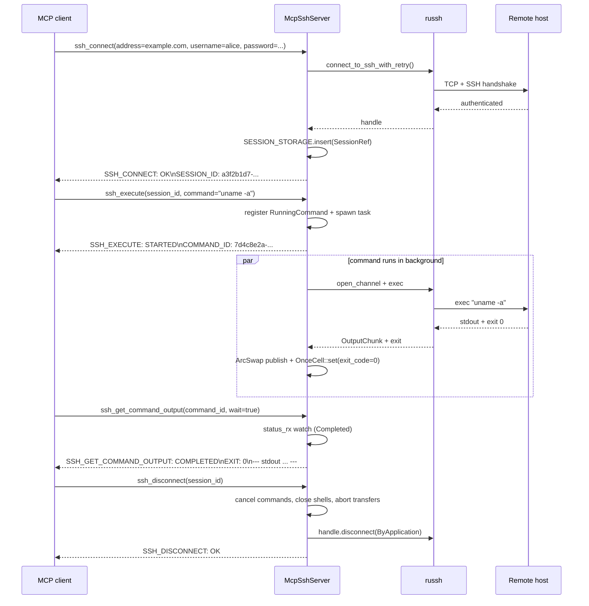
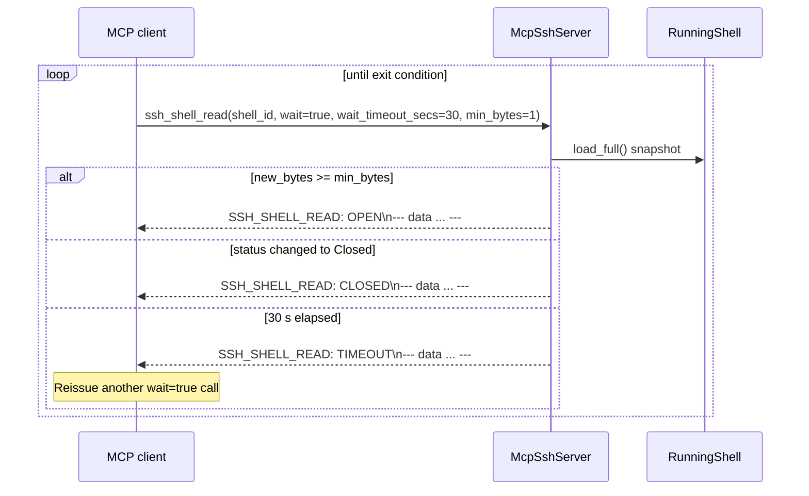
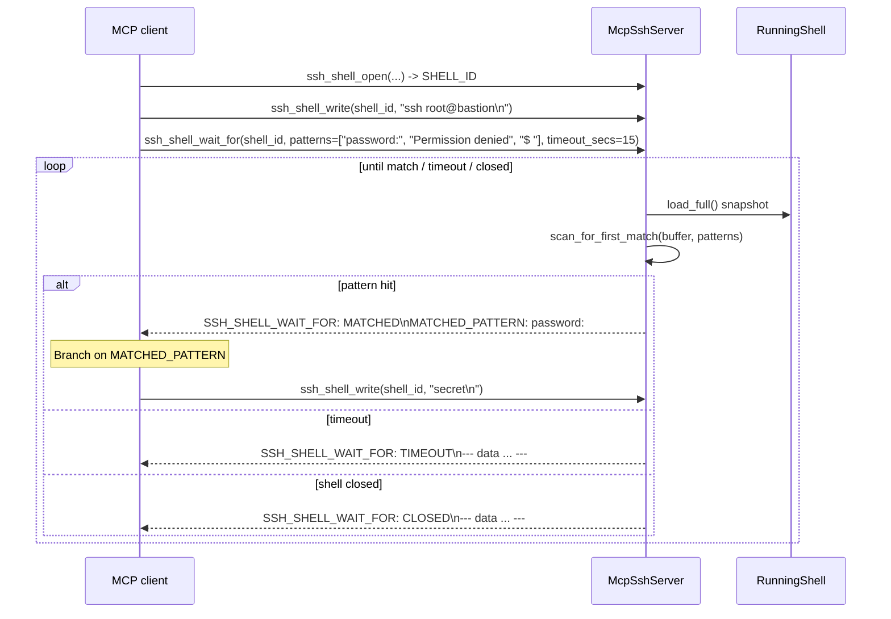
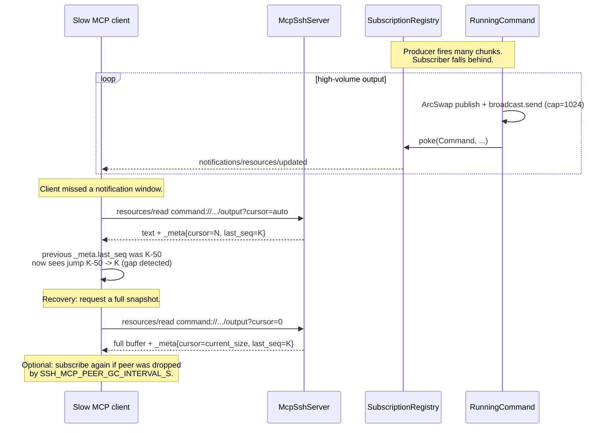

# SSH MCP Flow Diagrams (v3.0.0)

Sequence diagrams for the most common workflows on top of the v3.0.0 ssh-mcp server. All diagrams are Mermaid and assume the rmcp 1.6 transport (HTTP via axum or stdio).

[[_TOC_]]

## 1. Connect, execute, disconnect (golden path)

The minimal end-to-end flow: open a connection, run one command, tear down.

```mermaid
sequenceDiagram
    participant Client as MCP client
    participant Server as McpSshServer
    participant SSH as russh
    participant Remote as Remote host

    Client->>Server: ssh_connect(address=example.com, username=alice, password=...)
    Server->>SSH: connect_to_ssh_with_retry()
    SSH->>Remote: TCP + SSH handshake
    Remote-->>SSH: authenticated
    SSH-->>Server: handle
    Server->>Server: SESSION_STORAGE.insert(SessionRef)
    Server-->>Client: SSH_CONNECT: OK\nSESSION_ID: a3f2b1d7-...

    Client->>Server: ssh_execute(session_id, command="uname -a")
    Server->>Server: register RunningCommand + spawn task
    Server-->>Client: SSH_EXECUTE: STARTED\nCOMMAND_ID: 7d4c8e2a-...

    par command runs in background
        Server->>SSH: open_channel + exec
        SSH->>Remote: exec "uname -a"
        Remote-->>SSH: stdout + exit 0
        SSH-->>Server: OutputChunk + exit
        Server->>Server: ArcSwap publish + OnceCell::set(exit_code=0)
    end

    Client->>Server: ssh_get_command_output(command_id, wait=true)
    Server->>Server: status_rx watch (Completed)
    Server-->>Client: SSH_GET_COMMAND_OUTPUT: COMPLETED\nEXIT: 0\n--- stdout ... ---

    Client->>Server: ssh_disconnect(session_id)
    Server->>Server: cancel commands, close shells, abort transfers
    Server->>SSH: handle.disconnect(ByApplication)
    Server-->>Client: SSH_DISCONNECT: OK
```

## 2. Subscribe-first PTY interactive (preferred)

The recommended UX for interactive shells: subscribe to push notifications instead of polling.

```mermaid
sequenceDiagram
    participant Client as MCP client
    participant Server as McpSshServer
    participant Reg as SubscriptionRegistry
    participant Reader as PTY reader task
    participant Writer as PTY writer task

    Client->>Server: ssh_connect(...)
    Server-->>Client: SESSION_ID

    Client->>Server: ssh_shell_open(session_id, term=xterm)
    Server->>Reader: spawn (ArcSwap&lt;RingBuffer&gt; + broadcast + Notify)
    Server->>Writer: spawn (mpsc::Receiver&lt;WriteRequest&gt;)
    Server-->>Client: SSH_SHELL_OPEN: OK\nSHELL_ID: 4b9c8e2a-...\nTERM: xterm 80x24

    Client->>Server: resources/subscribe shell://4b9c8e2a-.../output
    Server->>Reg: subscribe(Shell, "4b9c8e2a-...", uri, peer_id, peer)
    Reg->>Reg: spawn debouncer (first subscriber)
    Server-->>Client: ()

    Client->>Server: ssh_shell_write(shell_id, "ls -la\n")
    Server->>Writer: WriteRequest::Data(b"ls -la\n")
    Writer->>Reader: bytes flow back
    Reader->>Reader: rcu append + head-trim
    Reader->>Reg: poke(Shell, "4b9c8e2a-...")

    Reg->>Reg: tokio::sleep(50 ms)
    Reg-->>Client: notifications/resources/updated shell://4b9c8e2a-.../output

    Client->>Server: resources/read shell://4b9c8e2a-.../output?cursor=auto
    Server-->>Client: text="$ ls -la\n..." + _meta{cursor=128, last_seq=3, shell_status=open}

    Note over Reader,Reg: Subsequent pokes within 50 ms<br/>collapse into one notification.

    Client->>Server: resources/unsubscribe shell://4b9c8e2a-.../output
    Server->>Reg: unsubscribe(peer_id, uri) -> debouncer aborted

    Client->>Server: ssh_shell_close(shell_id)
    Server-->>Client: SSH_SHELL_CLOSE: OK
    Client->>Server: ssh_disconnect(session_id)
```

## 3. Long-poll fallback (no subscribe support)

Clients that cannot subscribe fall back to `ssh_shell_read.wait`.

```mermaid
sequenceDiagram
    participant Client as MCP client
    participant Server as McpSshServer
    participant Shell as RunningShell

    loop until exit condition
        Client->>Server: ssh_shell_read(shell_id, wait=true, wait_timeout_secs=30, min_bytes=1)
        Server->>Shell: load_full() snapshot
        alt new_bytes >= min_bytes
            Server-->>Client: SSH_SHELL_READ: OPEN\n--- data ... ---
        else status changed to Closed
            Server-->>Client: SSH_SHELL_READ: CLOSED\n--- data ... ---
        else 30 s elapsed
            Server-->>Client: SSH_SHELL_READ: TIMEOUT\n--- data ... ---
            Note over Client: Reissue another wait=true call
        end
    end
```

## 4. wait_for fallback (gated single-shot)

Branch a workflow on the first matching pattern (e.g. `password:`, `Permission denied`, `$ `).

```mermaid
sequenceDiagram
    participant Client as MCP client
    participant Server as McpSshServer
    participant Shell as RunningShell

    Client->>Server: ssh_shell_open(...) -> SHELL_ID

    Client->>Server: ssh_shell_write(shell_id, "ssh root@bastion\n")

    Client->>Server: ssh_shell_wait_for(shell_id, patterns=["password:", "Permission denied", "$ "], timeout_secs=15)

    loop until match / timeout / closed
        Server->>Shell: load_full() snapshot
        Server->>Server: scan_for_first_match(buffer, patterns)
        alt pattern hit
            Server-->>Client: SSH_SHELL_WAIT_FOR: MATCHED\nMATCHED_PATTERN: password:
            Note over Client: Branch on MATCHED_PATTERN
            Client->>Server: ssh_shell_write(shell_id, "secret\n")
        else timeout
            Server-->>Client: SSH_SHELL_WAIT_FOR: TIMEOUT\n--- data ... ---
        else shell closed
            Server-->>Client: SSH_SHELL_WAIT_FOR: CLOSED\n--- data ... ---
        end
    end
```

## 5. send_key Ctrl+C interrupt

Send a semantic keystroke to interrupt a running command without closing the shell.

```mermaid
sequenceDiagram
    participant Client as MCP client
    participant Server as McpSshServer
    participant Shell as RunningShell
    participant Remote as Remote PTY

    Client->>Server: ssh_shell_open(...) -> SHELL_ID
    Client->>Server: ssh_shell_write(shell_id, "while true; do date; sleep 1; done\n")

    Note over Remote: shell prints date every second

    Client->>Server: ssh_shell_send_key(shell_id, key=ctrl_c)
    Server->>Server: ShellKey::CtrlC.encode(empty_mods) -> b"\x03"
    Server->>Shell: input_tx.send(WriteRequest::Data(b"\x03"))
    Shell->>Remote: \x03
    Remote-->>Shell: ^C\n$
    Server-->>Client: SSH_SHELL_SEND_KEY: OK\nSHELL_ID: ...\nKEY: ctrl_c\nBYTES_SENT: 1

    Note over Client: Shell remains open and ready for next command.
```

## 6. Async command with realtime monitoring (subscribe)

Subscribe to `command://<id>/output` to observe stdout/stderr live.

```mermaid
sequenceDiagram
    participant Client as MCP client
    participant Server as McpSshServer
    participant Reg as SubscriptionRegistry
    participant Cmd as RunningCommand

    Client->>Server: ssh_execute(session_id, command="cargo build --release")
    Server->>Cmd: spawn (ArcSwap&lt;OutputBuffer&gt; + broadcast + OnceCell)
    Server-->>Client: SSH_EXECUTE: STARTED\nCOMMAND_ID: 7d4c8e2a-...

    Client->>Server: resources/subscribe command://7d4c8e2a-.../output
    Server->>Reg: subscribe(Command, "7d4c8e2a-...", uri, peer_id, peer)
    Reg->>Reg: spawn debouncer
    Server-->>Client: ()

    loop output chunks
        Cmd->>Cmd: ArcSwap publish + broadcast
        Cmd->>Reg: poke(Command, "7d4c8e2a-...")
        Reg-->>Client: notifications/resources/updated (debounced)
        Client->>Server: resources/read command://7d4c8e2a-.../output?cursor=auto
        Server-->>Client: text + _meta{cursor, last_seq, command_status=running}
    end

    Cmd->>Cmd: OnceCell::set(exit_code=0); status_rx -> Completed
    Cmd->>Reg: poke(Command, "7d4c8e2a-...")
    Reg-->>Client: notifications/resources/updated (final)
    Client->>Server: resources/read ...?cursor=auto
    Server-->>Client: text + _meta{command_status=completed, last_seq=N}

    Client->>Server: resources/unsubscribe command://7d4c8e2a-.../output
```

## 7. SFTP upload with progress subscribe

Subscribe to `transfer://<id>/progress` for tick-driven progress updates.

```mermaid
sequenceDiagram
    participant Client as MCP client
    participant Server as McpSshServer
    participant Reg as SubscriptionRegistry
    participant Tr as RunningTransfer
    participant SFTP as russh-sftp

    Client->>Server: ssh_upload(session_id, local_path, remote_path)
    Server->>Tr: spawn (AtomicU64 + broadcast::Sender&lt;ProgressEvent&gt; + OnceCell)
    Server-->>Client: SSH_UPLOAD: STARTED\nTRANSFER_ID: 8f7e6d5c-...

    Client->>Server: resources/subscribe transfer://8f7e6d5c-.../progress
    Server->>Reg: subscribe(Transfer, "8f7e6d5c-...", uri, peer_id, peer)
    Reg->>Reg: spawn debouncer (force-flush every 1 s)
    Server-->>Client: ()

    loop 32 KiB chunks
        SFTP->>Tr: write chunk
        Tr->>Tr: bytes_transferred.fetch_add(32 KiB)
        Tr->>Tr: progress_tx.send(ProgressEvent::Tick{seq, bytes, total})
        Tr->>Reg: poke(Transfer, "8f7e6d5c-...")
        Reg-->>Client: notifications/resources/updated (debounced)
        Client->>Server: resources/read transfer://8f7e6d5c-.../progress
        Server-->>Client: JSON {bytes_transferred, total_bytes, status="running", last_seq}
    end

    Tr->>Tr: progress_tx.send(ProgressEvent::Completed{seq, bytes})
    Tr->>Reg: poke(Transfer, ...)
    Reg-->>Client: notifications/resources/updated
    Client->>Server: resources/read ...
    Server-->>Client: JSON {status="completed", bytes=total, last_seq=N}

    Client->>Server: resources/unsubscribe transfer://8f7e6d5c-.../progress
```

## 8. Multi-session health monitoring

Subscribe to `session://<id>/health` for each session and react to disconnect events.

```mermaid
sequenceDiagram
    participant Client as MCP client
    participant Server as McpSshServer
    participant Reg as SubscriptionRegistry
    participant SS as SESSION_STORAGE

    Client->>Server: ssh_connect(host=db1, ...)
    Server-->>Client: SESSION_ID: s1
    Client->>Server: ssh_connect(host=db2, ...)
    Server-->>Client: SESSION_ID: s2

    Client->>Server: resources/subscribe session://s1/health
    Server->>Reg: subscribe(Session, "s1", uri, peer_id, peer)
    Client->>Server: resources/subscribe session://s2/health

    Note over Server,Reg: ssh_list_sessions probes echo 1 every call;<br/>each probe fires HealthEvent::Healthy.

    par s1 stays healthy
        Client->>Server: ssh_list_sessions
        Server->>SS: probe s1 -> ok -> health_tx.send(Healthy)
        Server->>Reg: poke(Session, "s1")
        Reg-->>Client: notifications/resources/updated session://s1/health
        Client->>Server: resources/read session://s1/health
        Server-->>Client: JSON {healthy:true, last_health_check, last_seq}
    and s2 dies
        Server->>SS: probe s2 -> error -> SESSION_STORAGE.remove(s2)
        SS->>SS: health_tx.send(HealthEvent::Disconnected{seq})
        SS->>Reg: poke(Session, "s2")
        Reg-->>Client: notifications/resources/updated session://s2/health
        Client->>Server: resources/read session://s2/health
        Server-->>Client: error: McpError::resource_not_found
        Note over Client: React: ssh_connect again or surface alert.
    end
```

## 9. Cancellation propagation

`notifications/cancelled` is routed natively by rmcp 1.6 — no custom transport handling required.

```mermaid
sequenceDiagram
    participant Client as MCP client
    participant Rmcp as rmcp transport
    participant Server as McpSshServer
    participant Cmd as RunningCommand

    Client->>Server: ssh_execute(session_id, command="sleep 600")
    Server-->>Client: SSH_EXECUTE: STARTED\nCOMMAND_ID: 7d4c8e2a-...

    Note over Client: Decide to cancel.

    par via notifications/cancelled
        Client->>Rmcp: notifications/cancelled {requestId}
        Rmcp->>Server: native cancellation routing
        Server->>Server: tool task aborted; status_rx -> Cancelled
    and via ssh_cancel_command tool
        Client->>Server: ssh_cancel_command(command_id="7d4c8e2a-...")
        Server->>Cmd: cancel_token.cancel()
        Cmd->>Cmd: status_rx -> Cancelled
        Server-->>Client: SSH_CANCEL_COMMAND: CANCELLED\n--- stdout (partial) ---
    end

    Note over Cmd: status persists as Cancelled until the<br/>SSH_COMMAND_CLEANUP_TTL post-read GC removes it.
```

## 10. Subscriber lagged + auto-recovery

`broadcast::RecvError::Lagged` recovery uses `_meta.last_seq` to detect gaps and `?cursor=0` to resync.

```mermaid
sequenceDiagram
    participant Client as Slow MCP client
    participant Server as McpSshServer
    participant Reg as SubscriptionRegistry
    participant Cmd as RunningCommand

    Note over Cmd,Reg: Producer fires many chunks.<br/>Subscriber falls behind.

    loop high-volume output
        Cmd->>Cmd: ArcSwap publish + broadcast.send (cap=1024)
        Cmd->>Reg: poke(Command, ...)
        Reg-->>Client: notifications/resources/updated
    end

    Note over Client: Client missed a notification window.

    Client->>Server: resources/read command://.../output?cursor=auto
    Server-->>Client: text + _meta{cursor=N, last_seq=K}

    Client->>Client: previous _meta.last_seq was K-50<br/>now sees jump K-50 -> K (gap detected)

    Note over Client: Recovery: request a full snapshot.
    Client->>Server: resources/read command://.../output?cursor=0
    Server-->>Client: full buffer + _meta{cursor=current_size, last_seq=K}

    Note over Client: Optional: subscribe again if peer was dropped<br/>by SSH_MCP_PEER_GC_INTERVAL_S.
```

## 11. Peer disconnect GC

`spawn_peer_gc` periodically removes peers whose rmcp transport has closed (rmcp 1.6 does not raise a callback).

```mermaid
sequenceDiagram
    participant Bin as ssh-mcp / ssh-mcp-stdio
    participant GC as spawn_peer_gc task
    participant Reg as SubscriptionRegistry
    participant Peer as rmcp::Peer (closed)

    Bin->>GC: spawn_peer_gc(interval_s, cancel_token)

    loop every SSH_MCP_PEER_GC_INTERVAL_S (default 30 s)
        GC->>Reg: gc_closed_peers()
        Reg->>Reg: snapshot subscribers; for each unique peer_id check peer.is_transport_closed()
        Reg->>Peer: is_transport_closed() -> true
        Reg->>Reg: drop_peer(peer_id) -> for each URI: unsubscribe(peer_id, uri)
        Note over Reg: Last unsubscribe per URI<br/>aborts the debouncer task.
    end

    Bin->>GC: cancel_token.cancel() (Ctrl-C / stdin close)
    GC->>GC: tokio::select! cancellation branch -> exit
```

---

## Cross-references

- Tool reference: [API.md](./API.md)
- Architectural background: [ARCHITECTURE.md](./ARCHITECTURE.md)
- Tunables: [CONFIGURATION.md](./CONFIGURATION.md)
