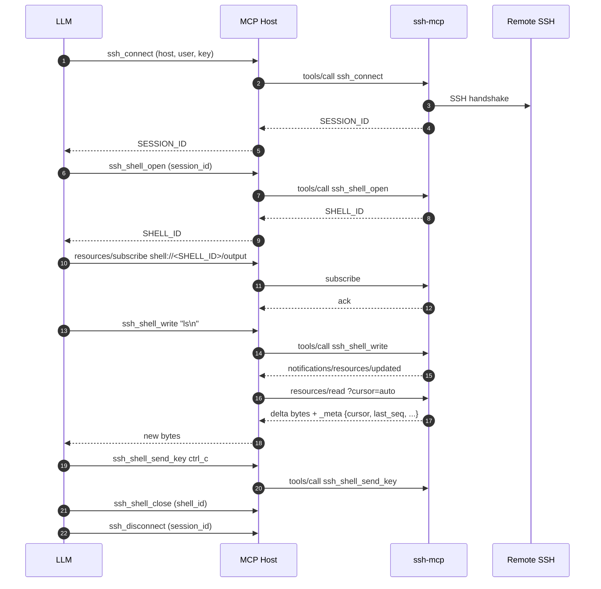

# LLM Guide (v4.0.0)

This guide is written for **small LLMs (~30B class)** driving ssh-mcp through an MCP host. The goal is to minimise cognitive load and token spend by directing the model to the most efficient tool / pattern for each intent. The MCP wire contract is identical to v3.0.0 (see [MIGRATION_v3_to_v4.md](./MIGRATION_v3_to_v4.md)).

Cross references:

- [API.md](./API.md) — full tool reference.
- [RESOURCES.md](./RESOURCES.md) — `resources/*` deep dive.
- [ERRORS.md](./ERRORS.md) — exhaustive error code catalog.
- [FLOWS.md](./FLOWS.md) — annotated end-to-end flows.

## Decision table

The single most important table in this document. Pick the ★-marked path whenever the host advertises `resources.subscribe = true` (every spec-compliant MCP host since protocol 2025-06-18 does).

| What you want                                      | Tool / Pattern                                                |
| -------------------------------------------------- | ------------------------------------------------------------- |
| Run a one-shot remote command                      | `ssh_execute` -> `ssh_get_command_output`                     |
| Open an interactive shell                          | `ssh_shell_open` + `resources/subscribe shell://<id>/output` ★ |
| Send `Ctrl+C`, arrows, function keys               | `ssh_shell_send_key`                                          |
| Send raw text input                                | `ssh_shell_write`                                             |
| Watch shell output realtime                        | `resources/subscribe` + `resources/read` ★                    |
| Wait for a specific prompt (gate)                  | `ssh_shell_wait_for`                                          |
| Read shell buffer once (snapshot)                  | `resources/read shell://<id>/output`                          |
| Watch async command output realtime                | `resources/subscribe command://<id>/output` ★                 |
| Watch SFTP transfer progress realtime              | `resources/subscribe transfer://<id>/progress` ★              |
| Watch session health changes                       | `resources/subscribe session://<id>/health` ★                 |
| Watch port-forward events                          | `resources/subscribe forward://<id>/events` ★                 |
| Upload / download a file                           | `ssh_upload` / `ssh_download`                                 |
| Cancel a long-running command                      | `ssh_cancel_command`                                          |
| Forward a TCP port                                 | `ssh_forward` (feature-gated)                                 |
| Cleanup all sessions for an agent                  | `ssh_disconnect_agent`                                        |
| Disconnect a single session cleanly                | `ssh_disconnect`                                              |
| Discover existing SESSION_IDs                      | `ssh_list_sessions`                                           |
| Check what is still running before disconnect      | `ssh_list_commands`                                           |

★ = preferred path (lowest latency, lowest token cost).

## Golden path (subscribe-first PTY)

This is the canonical multi-step interactive flow. Every step that the LLM emits is annotated.

Step-by-step prose:

1. **Connect** with `ssh_connect`. Capture `SESSION_ID` (and optional `AGENT_ID`).
2. **Open the PTY** with `ssh_shell_open`. Capture `SHELL_ID`.
3. **Subscribe immediately** to `shell://<SHELL_ID>/output` — before sending any input. This means the very first byte the remote emits triggers a `notifications/resources/updated`, instead of you polling.
4. **Drive input** with `ssh_shell_write` (text) or `ssh_shell_send_key` (named keys). Both are non-blocking.
5. **Read the delta** with `resources/read?cursor=auto` whenever you receive `notifications/resources/updated`. The server tracks per-peer cursor so each read is just the new bytes.
6. **Gate on prompts** with `ssh_shell_wait_for` only when you need a single-shot gate (for example before sending the next command). For continuous observation prefer the subscribe loop.
7. **Close cleanly** with `ssh_shell_close`, then `ssh_disconnect` (or `ssh_disconnect_agent`).

## Anti-patterns to avoid

- **Polling `ssh_shell_read` in a loop when subscribe is available.** Every poll consumes tokens for the round trip plus the response payload. The subscribe path emits a single `notifications/resources/updated` per debounce window (50 ms by default — see [RESOURCES.md](./RESOURCES.md)), and `resources/read?cursor=auto` returns only the delta.
- **Calling `ssh_shell_wait_for` as a polling substitute.** It is a single-shot prompt gate (1..=16 patterns). Calling it repeatedly with the same patterns wastes a long-poll budget; subscribe instead.
- **Sending hex escape sequences via `ssh_shell_write`** when `ssh_shell_send_key` already covers the keystroke. The named API validates modifier rules at the schema layer and avoids LLM transcription mistakes (`\x1b[A` vs `\x1bOA`).
- **Reusing a `SESSION_ID` without verification when in doubt.** If you cannot remember whether the session still lives, call `ssh_list_sessions` (it runs an `echo 1` health probe and prunes dead sessions) before issuing tool calls that would otherwise return `SESSION_NOT_FOUND`.
- **Calling `ssh_disconnect` on a session with running async commands without first checking `ssh_list_commands`.** The disconnect cancels every running command — useful when you mean it, surprising when you do not.
- **Ignoring `_meta.last_seq` after a long pause.** If `last_seq` jumped by more than 1 since your previous read, you may have lagged. Re-read with `?cursor=0` to get a full snapshot, then resume `?cursor=auto`.
- **Spamming `resources/read` between notifications.** The notification is the signal — read once per notification.

## Token efficiency tips

- **Use `?cursor=auto`** on `resources/read` so the server tracks the per-peer delta — every read returns just the new bytes since your previous read.
- **Tune `max_output_bytes`** to match the room you have left in your context window when you fall back to `ssh_shell_read`. Default is 16 KiB; cap is 1 MiB (env: `SSH_MCP_OUTPUT_DEFAULT_BYTES` / `SSH_MCP_OUTPUT_MAX_BYTES_CAP`).
- **Prefer `ssh_shell_wait_for` with multi-pattern** over multiple sequential reads when branching logic depends on which prompt appears. Example: `["password:", "Permission denied", "$ "]` resolves three login outcomes in one tool call.
- **Use `ssh_list_sessions` once at the start of a long task**, then trust your `SESSION_ID`s for the rest of the session.
- **Filter `ssh_list_commands` with `status="running"`** when you only care about live work — the response is shorter.

## Cross-tool flow map

## When to fall back (no subscribe support)

Some hosts do not consume MCP notifications. Fallback paths:

- **Continuous shell observation** -> `ssh_shell_read` with `wait=true` and `min_bytes` (default 1, cap = `max_output_bytes`).
- **Single-shot prompt gating** -> `ssh_shell_wait_for` (always works regardless of subscribe support).
- **Async command completion** -> `ssh_get_command_output` with `wait=true` (default 30 s, cap 300 s).
- **Transfer completion** -> `ssh_get_transfer_progress` with `wait=true`.

Even on the fallback path, prefer the long-poll `wait=true` variants over a tight loop of `wait=false` polls — the long-poll wakes immediately on real activity and idles cheaply otherwise.

## Sample prompts for the LLM

These illustrate how an LLM should map a user request to the decision table.

### Example 1 — "tail nginx error log and alert me on a 500 spike"

1. `ssh_connect` (or look up `SESSION_ID` via `ssh_list_sessions`).
2. `ssh_execute` with `command="tail -F /var/log/nginx/error.log"` -> capture `COMMAND_ID`.
3. `resources/subscribe command://<COMMAND_ID>/output`.
4. On every `notifications/resources/updated`, `resources/read?cursor=auto` and scan the delta for `" 500 "`. Emit a chat alert when a threshold is crossed.
5. `ssh_cancel_command` when the user is done.

### Example 2 — "log into a router console, configure interface, save"

1. `ssh_connect` to the jump host.
2. `ssh_shell_open` with `term="vt100"`, 80x24 (SOL/IPMI consoles need this).
3. `resources/subscribe shell://<SHELL_ID>/output`.
4. `ssh_shell_wait_for` patterns `["Username:", "login:"]` -> branch.
5. `ssh_shell_write` username + `\n`.
6. `ssh_shell_wait_for` `["Password:"]`.
7. `ssh_shell_write` password + `\n`.
8. `ssh_shell_wait_for` `["#", ">"]`.
9. Configure the interface via `ssh_shell_write`.
10. `ssh_shell_send_key` with `key="ctrl_z"` to background, then `write "wr mem\n"`.
11. `ssh_shell_close` + `ssh_disconnect`.

### Example 3 — "upload a backup and verify"

1. `ssh_upload` with `local_path` and `remote_path` -> capture `TRANSFER_ID`.
2. `resources/subscribe transfer://<TRANSFER_ID>/progress` (optional but recommended for long uploads).
3. Either wait for `notifications/resources/updated` with terminal status, or call `ssh_get_transfer_progress` with `wait=true`.
4. `ssh_execute` `sha256sum <remote_path>` -> capture `COMMAND_ID`.
5. `ssh_get_command_output` with `wait=true` to compare the digest.

### Example 4 — "kill the deploy that is hanging"

1. `ssh_list_commands` with `status="running"` -> pick the offending `COMMAND_ID`.
2. `ssh_cancel_command` -> response carries partial stdout/stderr (head-truncated, tail preserved).
3. Optionally `ssh_disconnect_agent` if you want to tear down the entire agent's footprint at once.
