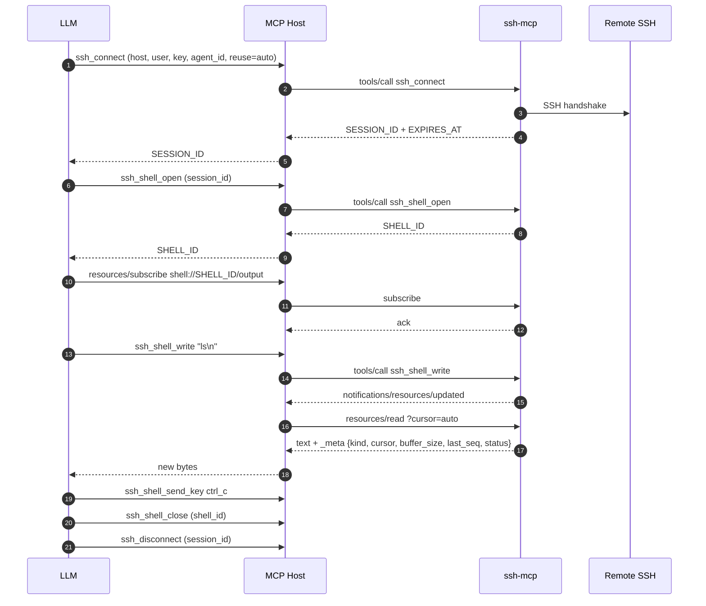
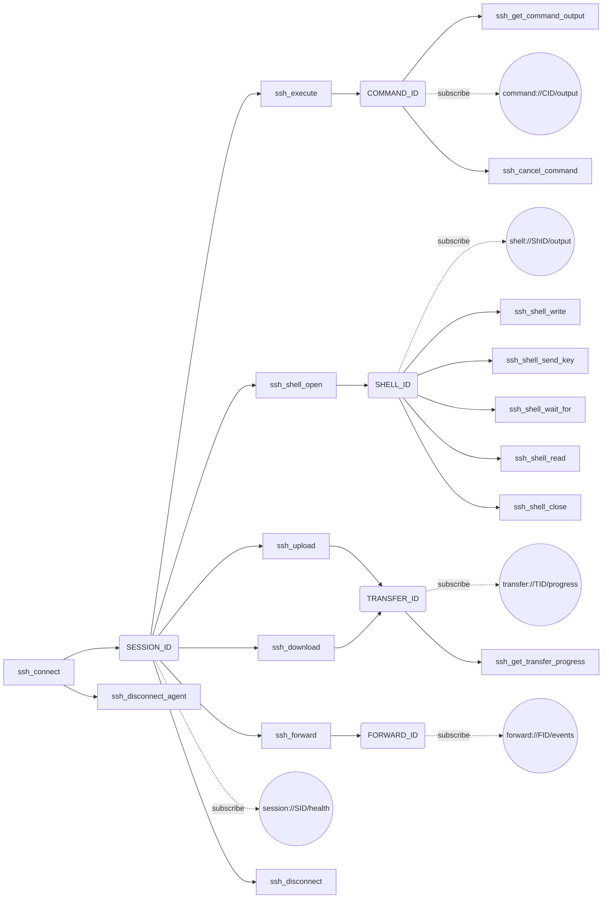

# LLM Guide (v4.7.0)

This guide is written for **small LLMs (~30B class)** driving ssh-mcp through an MCP host. The goal is to minimise cognitive load and token spend by directing the model to the most efficient tool / pattern for each intent. The MCP wire contract is byte-compatible with v3.0.0 / v4.0.x / v4.6.0 on the text channel; v4.7 layers a parallel `structured_content` JSON channel, new tools, and an inter-tool conversation surface on top — without touching the v4.6 Markdown body. v4.7 adds three new tools (`ssh_run`, `ssh_execute_batch`, `ssh_disconnect_many` — catalogue moves from 18 to 21, or 17 to 20 without `port_forward`), `resources/templates/list`, `notifications/progress` during long async waits, an MCP `prompts/list` + `prompts/get` catalog with 5 canonical workflows, idempotent retries via `_meta.idempotency_key` (15 mutating tools), `NOT_FOUND` closest-match suggestions, and an optional `INITIAL_BUFFER` line on `ssh_shell_open`. v4.6 surface (subscribe-first `HINT:`, `NEXT:` advisory, `AGENT_ID:` rename, JSON Schema defaults, cost hints, wired icon) carries forward unchanged.

Cross references:

- [API.md](./API.md) — full tool reference.
- [RESOURCES.md](./RESOURCES.md) — `resources/*` deep dive.
- [ERRORS.md](./ERRORS.md) — exhaustive error code catalog.
- [FLOWS.md](./FLOWS.md) — annotated end-to-end flows.

## Decision table

The single most important table in this document. Pick the star-marked path whenever the host advertises `resources.subscribe = true` (every spec-compliant MCP host since protocol 2025-06-18 does).

| What you want                                      | Tool / Pattern                                                |
| -------------------------------------------------- | ------------------------------------------------------------- |
| Run a one-shot remote command                      | `ssh_execute` -> `ssh_get_command_output`                     |
| Open an interactive shell                          | `ssh_shell_open` + `resources/subscribe shell://<id>/output` * |
| Send `Ctrl+C`, arrows, function keys               | `ssh_shell_send_key`                                          |
| Send raw text input                                | `ssh_shell_write`                                             |
| Watch shell output realtime                        | `resources/subscribe` + `resources/read?cursor=auto` *        |
| Wait for a specific prompt (gate)                  | `ssh_shell_wait_for`                                          |
| Read shell buffer once (snapshot)                  | `resources/read shell://<id>/output`                          |
| Watch async command output realtime                | `resources/subscribe command://<id>/output` *                 |
| Watch SFTP transfer progress realtime              | `resources/subscribe transfer://<id>/progress` *              |
| Watch session health changes                       | `resources/subscribe session://<id>/health` *                 |
| Watch port-forward events                          | `resources/subscribe forward://<id>/events` *                 |
| Upload / download a file                           | `ssh_upload` / `ssh_download`                                 |
| Cancel a long-running command                      | `ssh_cancel_command`                                          |
| Forward a TCP port                                 | `ssh_forward` (feature-gated)                                 |
| Cleanup all sessions for an agent                  | `ssh_disconnect_agent`                                        |
| Disconnect a single session cleanly                | `ssh_disconnect`                                              |
| Discover existing SESSION_IDs                      | `ssh_list_sessions`                                           |
| Check what is still running before disconnect      | `ssh_list_commands`                                           |

* = preferred path (lowest latency, lowest token cost).

> **v4.6 quick-pick:** if the response contains a `NEXT:` line, prefer one of those tool calls over guessing the next move. See [section E](#e-next-advisory-line-v46) for the full coverage matrix.

## Subscribe-first contract (live as of v4.5)

Every `resources/read` response now embeds the v4.5 `_meta` envelope on the `ResourceContents`. Subscribe-first is no longer aspirational — the cursor and sequence telemetry the LLM relies on for delta replay is in the wire payload of every read.

### Envelope shape

```json
{
  "uri": "shell://4b9c8e2a-.../output",
  "mimeType": "text/plain",
  "text": "$ ls -la\n...",
  "_meta": {
    "kind": "shell",
    "cursor": 4096,
    "buffer_size": 4096,
    "last_seq": 17,
    "status": "open"
  }
}
```

Fields:

- `kind` — one of `"shell" | "command" | "transfer" | "session" | "forward"`. Lets the host route the response without re-parsing the URI.
- `cursor` — `u64`. Next cursor value to pass on the following `?cursor=` read. **Only present on `shell` and `command`** (the byte-stream resources).
- `buffer_size` — `u64`. Bytes currently held in the resource history buffer. **Only present on `shell` and `command`**.
- `last_seq` — `u64`. Last sequence number allocated for `(kind, id)` by the producer. Compare to your previous `last_seq` to detect gaps.
- `status` — string. Kind-specific (`open` / `closed` / `running` / `completed` / `failed` / `healthy` / `unhealthy`).

`transfer://`, `session://`, and `forward://` are point-in-time snapshots and omit `cursor` / `buffer_size`.

### MIME types

| Scheme | MIME | Body shape |
|--------|------|------------|
| `shell://` | `text/plain` | UTF-8 lossy slice of the PTY buffer. |
| `command://` | `text/plain` | Block-style v3 stdout/stderr (one nonce per response, two `--- name [nonce] ---` blocks). |
| `transfer://` | `application/json` | Snapshot JSON (transfer id, direction, paths, bytes_transferred, total_bytes, status, last_seq). |
| `session://` | `application/json` | Snapshot JSON (session id, healthy, last_health_check, last_seq). |
| `forward://` | `application/json` | Snapshot JSON (forward id, listener, target, accepted/closed counters, last_seq). |

### Cursor-aware loop

```
1. resources/subscribe { uri }
2. wait for notifications/resources/updated { uri }
3. resources/read { uri: "<uri>?cursor=auto" }
4. server returns only fresh bytes/events since this peer's last read
   _meta.cursor advances atomically to <previous>+bytes_returned
5. goto 2
```

The server tracks `(peer, uri) -> cursor` internally — the LLM does not have to remember byte offsets. Re-issuing `?cursor=auto` after a notification returns just the delta.

### Stable peer identity

The peer identity used by `?cursor=auto` is derived from the transport, not minted per request:

- HTTP transport: `Mcp-Session-Id` header (case-insensitive). Every request that lands on the same Streamable HTTP session shares the same `PeerId`.
- Stdio transport: process-wide singleton (`Stdio` key).

That means subscribe and unsubscribe addressed to the same connection always see the same per-peer cursor. Two concurrent peers (two HTTP clients with different `Mcp-Session-Id` values, or one HTTP client + one stdio client) advance independently.

## Golden path (subscribe-first PTY)

This is the canonical multi-step interactive flow.



Step-by-step prose:

1. **Connect** with `ssh_connect`. Pass `agent_id` (groups sessions for bulk cleanup) and `reuse=auto` (pick the most recent healthy match in one round-trip). Capture `SESSION_ID`. Watch the response for an `EXPIRES_AT` line — it is the RFC3339 deadline at which the inactivity sweeper will reap the session unless you ping it.
2. **Open the PTY** with `ssh_shell_open`. Capture `SHELL_ID`.
3. **Subscribe immediately** to `shell://<SHELL_ID>/output` — before sending any input. The very first byte the remote emits triggers `notifications/resources/updated` instead of you polling.
4. **Drive input** with `ssh_shell_write` (text) or `ssh_shell_send_key` (named keys). Both are non-blocking.
5. **Read the delta** with `resources/read?cursor=auto` whenever you receive `notifications/resources/updated`. The server tracks per-peer cursor, so each read is just the new bytes.
6. **Gate on prompts** with `ssh_shell_wait_for` only when you need a single-shot gate (for example before sending the next command). For continuous observation prefer the subscribe loop.
7. **Close cleanly** with `ssh_shell_close`, then `ssh_disconnect` (or `ssh_disconnect_agent`).

## Anti-patterns to avoid

- **Polling `ssh_shell_read` in a loop when subscribe is available.** Every poll consumes tokens for the round trip plus the response payload. The subscribe path emits a single `notifications/resources/updated` per debounce window (50 ms by default), and `resources/read?cursor=auto` returns only the delta.
- **Calling `ssh_shell_wait_for` as a polling substitute.** It is a single-shot prompt gate (1..=16 patterns). Calling it repeatedly with the same patterns wastes a long-poll budget; subscribe instead.
- **Sending hex escape sequences via `ssh_shell_write`** when `ssh_shell_send_key` already covers the keystroke. The named API validates modifier rules at the schema layer (returns `MODIFIER_NOT_ALLOWED` instead of corrupting the PTY) and avoids LLM transcription mistakes (`\x1b[A` vs `\x1bOA`).
- **Reusing a `SESSION_ID` without verification when in doubt.** If you cannot remember whether the session still lives, call `ssh_list_sessions` (it runs an `echo 1` health probe and prunes dead sessions) before issuing tool calls that would otherwise return `SESSION_NOT_FOUND`. Even better: pass `agent_id` on every `ssh_connect` and let `reuse=auto` pick the live one for you.
- **Calling `ssh_disconnect` on a session with running async commands without first checking `ssh_list_commands`.** The disconnect cancels every running command — useful when you mean it, surprising when you do not.
- **Ignoring `_meta.last_seq` after a long pause.** If `last_seq` jumped by more than 1 since your previous read, you may have lagged on the broadcast channel. Re-read with `?cursor=0` to get a full snapshot, then resume `?cursor=auto`.
- **Spamming `resources/read` between notifications.** The notification is the signal — read once per notification.
- **Ignoring `HINT:` lines.** The server appends `HINT: agent 'X' owns N sessions; consider ssh_disconnect_agent` when an agent leaks sessions, plus subscribe-first `HINT:` lines on every async-spawn response (`SSH_SHELL_OPEN`, `SSH_EXECUTE: STARTED`, `SSH_UPLOAD/DOWNLOAD: STARTED`, `SSH_FORWARD: OK`). Treat them as actionable, not chatter.
- **Ignoring `NEXT:` lines.** Every response with a clear successor tool ends with `NEXT: <pipe-separated tool calls>` listing concrete next-step calls. A 27B-class model can chain a workflow without ever consulting the cookbook by simply trusting `NEXT:`.

## Token efficiency tips

- **Use `?cursor=auto`** on `resources/read` so the server tracks the per-peer delta — every read returns just the new bytes since your previous read.
- **Tune `max_output_bytes`** to match the room you have left in your context window when you fall back to `ssh_shell_read`. Default is 16 KiB; cap is 1 MiB (env: `SSH_MCP_OUTPUT_DEFAULT_BYTES` / `SSH_MCP_OUTPUT_MAX_BYTES_CAP`).
- **Prefer `ssh_shell_wait_for` with multi-pattern** over multiple sequential reads when branching logic depends on which prompt appears. Example: `["password:", "Permission denied", "$ "]` resolves three login outcomes in one tool call.
- **Use `ssh_list_sessions` once at the start of a long task**, then trust your `SESSION_ID`s for the rest of the session.
- **Filter `ssh_list_commands` with `status="running"`** when you only care about live work — the response is shorter.

## Cross-tool flow map



## When to fall back (no subscribe support)

Some hosts do not consume MCP notifications. Fallback paths:

- **Continuous shell observation** -> `ssh_shell_read` with `wait=true` and `min_bytes` (default 1, cap = `max_output_bytes`).
- **Single-shot prompt gating** -> `ssh_shell_wait_for` (always works regardless of subscribe support).
- **Async command completion** -> `ssh_get_command_output` with `wait=true` (default 30 s, cap 300 s).
- **Transfer completion** -> `ssh_get_transfer_progress` with `wait=true`.

Even on the fallback path, prefer the long-poll `wait=true` variants over a tight loop of `wait=false` polls — the long-poll wakes immediately on real activity and idles cheaply otherwise.

## A. Connection lifecycle and recycling (v4.4)

ssh-mcp surfaces three signals that small LLMs can use to keep a session pool tidy without leaking handles.

### `agent_id`

Pass `agent_id` on every `ssh_connect` to group sessions under a logical owner. Two consequences:

- `ssh_list_sessions { agent_id }` filters to that owner only.
- `ssh_disconnect_agent { agent_id }` bulk-disconnects every session owned by that agent — cancelling commands, closing shells, aborting transfers.
- When `agent_id` is set on `ssh_connect`, `reuse=auto` and `reuse=suggest` rank sessions owned by the same agent first.

### `EXPIRES_AT` / `PERSISTENT`

`ssh_connect` and `ssh_list_sessions` emit one of two mutually exclusive lines per session:

- `EXPIRES_AT: <RFC3339 UTC>` — deadline at which the inactivity sweeper will reap the session. The clock starts at `connected_at` and resets on activity.
- `PERSISTENT: true` — the caller passed `persistent=true` on connect; the inactivity sweeper is disabled and `EXPIRES_AT` is omitted.

To extend a session before `EXPIRES_AT` fires, run any cheap call (a colon ping `ssh_execute ":"`, `ssh_list_sessions`, etc.). Each touch resets the timer.

### `HINT:` lines

When more than 5 sessions are owned by the same `agent_id` (anti-leak threshold), `ssh_list_sessions` and `ssh_connect SUGGESTED` append:

```
HINT: agent 'X' owns N sessions; consider ssh_disconnect_agent to bulk-cleanup
```

Small LLMs should treat `HINT:` as actionable. The most common cause is a workflow that keeps spawning new sessions instead of reusing a healthy one — fix it by passing `reuse=auto`.

### `ReusePolicy` defaults

- `reuse=suggest` (default) — list matching sessions and stop. Right when a human will pick.
- `reuse=auto` — return the most recent healthy match (or open a new session). Right for "I just want to run a command".
- `reuse=force_new` — skip the lookup entirely. Right when you want a guaranteed fresh transport.

## B. Granular error codes (v4.5, all 14 live as of v4.6)

The wire codes are now ALL granular when the failure has a known cause. The dispatcher recognises 14 tag prefixes that `DomainError` carriers can attach to their reason string. v4.6 wires the last three reserved tags to concrete raise sites — every documented code now reaches the wire.

### Emitted today (14)

- `EMPTY_PATTERNS`, `TOO_MANY_PATTERNS`, `PATTERN_TOO_LONG` — from `ssh_shell_wait_for`.
- `MODIFIER_NOT_ALLOWED`, `INVALID_REPEAT` — from `ssh_shell_send_key`.
- `FEATURE_DISABLED` — when the `port_forward` Cargo feature is off and the LLM tries `ssh_forward` or subscribes to a `forward://` URI.
- `WRITE_FAILED` — shell writer task closed (PTY transport gone).
- `CHANNEL_FAILED` — russh failed to open a channel (often `MaxSessions` exhaustion).
- `COMMAND_FAILED` — async command's transport failed before completion.
- `LOCAL_FILE_ERROR` — `fs::metadata` failed on a local upload path.
- `SFTP_OPEN_FAILED` — SFTP subsystem could not be opened on the remote.
- `FORWARD_FAILED` (**v4.6 live**) — local listener bind failed for reasons other than `AddrInUse` (raised from `application/forward_port.rs::ForwardPortUseCase::preflight_bind`).
- `LOCAL_NOT_FILE` (**v4.6 live**) — upload pre-flight `is_file` check failed (raised from `application/upload_file.rs::UploadFileUseCase::guard_local_path_is_file`).
- `REMOTE_METADATA_ERROR` (**v4.6 live**) — download remote `stat` failed (raised from `adapters/sftp/russh_sftp_adapter.rs::stat_remote_size`).

### Reserved

None as of v4.6. The "Reserved" column in the per-tool tables of [ERRORS.md](./ERRORS.md) is now empty.

### Untagged fallbacks

Any failure without a recognised tag prefix falls through to the legacy flat code:

- `INVALID_ARGUMENT` (from `DomainError::InvalidArgument`)
- `TRANSPORT_ERROR` (from `DomainError::Transport`)
- `SFTP_ERROR` (from `DomainError::Sftp`)

See [ERRORS.md](./ERRORS.md) for the full table including emission-site references and recovery guidance.

## C. Server identity for the host (v4.5, icon wired in v4.6)

The server now advertises a richer `Implementation` descriptor on `initialize` so MCP hosts (Claude mobile, remote clients, registries) can render a humanised server card:

- `Implementation.title = "SSH Remote Shell"`
- `Implementation.description = "Run remote commands, drive PTY shells, transfer files via SFTP, and forward TCP ports over SSH. Subscribe to shell, command, transfer, session, and forward streams for push notifications."`
- `Implementation.website_url = "https://github.com/farchanjo/ssh-mcp"`
- `Implementation.icons` (**v4.6, wired**) — single `Icon` entry pointing at `https://raw.githubusercontent.com/farchanjo/ssh-mcp/master/assets/icon.svg` with `mime_type = "image/svg+xml"` and `sizes = ["any"]`. The URL only resolves after the v4.6 push to `origin/master` lands; clients gracefully fall back to the title + description when the asset is unreachable.

Each tool also carries `Tool.title` plus `ToolAnnotations.{read_only_hint, destructive_hint, idempotent_hint}`. Hosts use these to rank suggestions, filter destructive tools out of safe-by-default modes, and warn before running anything tagged `destructive`.

### Title and annotation matrix

| Tool | Title | read_only | destructive | idempotent |
|------|-------|-----------|-------------|------------|
| `ssh_connect` | Connect to SSH server | false | false | true |
| `ssh_disconnect` | Disconnect SSH session | false | true | true |
| `ssh_list_sessions` | List SSH sessions | true | false | true |
| `ssh_disconnect_agent` | Disconnect all agent sessions | false | true | true |
| `ssh_execute` | Run remote command | false | true | false |
| `ssh_get_command_output` | Get command output | true | false | true |
| `ssh_list_commands` | List async commands | true | false | true |
| `ssh_cancel_command` | Cancel running command | false | true | true |
| `ssh_shell_open` | Open PTY shell | false | false | false |
| `ssh_shell_write` | Write to PTY shell | false | true | false |
| `ssh_shell_send_key` | Send keystroke to PTY | false | true | false |
| `ssh_shell_read` | Read PTY buffer | false | false | true |
| `ssh_shell_wait_for` | Wait for shell pattern | true | false | true |
| `ssh_shell_close` | Close PTY shell | false | true | true |
| `ssh_upload` | Upload file via SFTP | false | true | false |
| `ssh_download` | Download file via SFTP | false | false | false |
| `ssh_get_transfer_progress` | Get transfer progress | true | false | true |
| `ssh_forward` (feature-gated) | Forward TCP port | false | false | false |

### Few-shot `instructions`

The server's `instructions` field ships three canonical workflows verbatim. Models trained to read MCP capability handshakes pick them up automatically. The text below is the **runtime body** as of v4.7 (the count line still claims 18 / 17 because `instructions` was last cut on v4.6; the actual tool list returned by `tools/list` carries the v4.7 catalogue of 21 / 20 plus the new `ssh_run` / `ssh_execute_batch` / `ssh_disconnect_many` entries — they all appear under `tools/list` regardless of the `instructions` claim).

```
SSH MCP. 18 tools, 5 push streams (shell://, command://, transfer://,
session://, forward://). All tools return block markdown: first line
TOOL: STATUS, then KEY: value pairs. Output blocks delimited by
--- name [nonce] ---. IDs end in _ID.

Happy paths:
1) Run command: ssh_connect (set agent_id, reuse=Auto). Then ssh_execute.
   Then ssh_get_command_output wait=true.
2) Interactive shell: ssh_connect, ssh_shell_open. Then resources/subscribe
   shell://<SHELL_ID>/output. Drive with ssh_shell_write or ssh_shell_send_key.
   Read deltas via resources/read?cursor=auto on each notification.
   ssh_shell_close, ssh_disconnect.
3) Upload: ssh_upload. Then ssh_get_transfer_progress wait=true.

Cleanup: pass agent_id on connect, then ssh_disconnect_agent to bulk-close.
Watch for HINT lines and EXPIRES_AT.
```

For the v4.7 tool count (21 / 20), prefer `tools/list` and `prompts/list` on initialize — both reflect the runtime catalogue exactly. The `prompts/list` catalog (see [section M](#m-prompts-catalog-v47)) covers the v4.7 short-circuit recipes (`run_one_shot_command`, `investigate_session`, `upload_and_verify`, `interactive_shell_drive`, `cleanup_agent`).

## D. Smaller-LLM cookbook

Three canonical workflows that map 1:1 to the few-shot `instructions` constant. Use these as templates when prompting a 27B-class model.

### Workflow 1 — Run a single remote command

```
1. ssh_connect { address, username, agent_id="my-agent", reuse="auto" }
   -> capture SESSION_ID + AGENT_ID + EXPIRES_AT
   -> follow NEXT: ssh_execute(session_id=...) | ssh_shell_open(...) | ssh_disconnect(...)
2. ssh_execute { session_id, command="uname -a" }
   -> capture COMMAND_ID
   -> HINT: subscribe to command://<id>/output (preferred)
   -> NEXT: ssh_get_command_output(wait=true) | ssh_cancel_command
3. ssh_get_command_output { command_id, wait=true, wait_timeout_secs=30 }
   -> COMPLETED + EXIT + stdout block (no NEXT — terminal)
4. (Optional) ssh_disconnect_agent { agent_id="my-agent" } when the task is over.
```

### Workflow 2 — Drive an interactive shell with subscribe

```
1. ssh_connect { address, username, agent_id="my-agent", reuse="auto" }
2. ssh_shell_open { session_id }
   -> capture SHELL_ID
3. resources/subscribe { uri: "shell://<SHELL_ID>/output" }
4. ssh_shell_write { shell_id, input: "ls -la\n" }
5. on notifications/resources/updated:
   resources/read { uri: "shell://<SHELL_ID>/output?cursor=auto" }
   -> consume text + _meta { cursor, last_seq, status="open" }
6. ssh_shell_send_key { shell_id, key: "ctrl_c" } when interrupting.
7. ssh_shell_close { shell_id }
8. ssh_disconnect { session_id }  (or ssh_disconnect_agent)
```

### Workflow 3 — Upload a file with progress

```
1. ssh_connect { address, username, agent_id="my-agent", reuse="auto" }
2. ssh_upload { session_id, local_path, remote_path }
   -> capture TRANSFER_ID + SIZE
3. (Recommended) resources/subscribe { uri: "transfer://<TRANSFER_ID>/progress" }
   On notification, resources/read returns JSON with bytes_transferred / total_bytes / status.
   OR
   ssh_get_transfer_progress { transfer_id, wait=true } long-poll fallback.
4. (Optional verify) ssh_execute { command: "sha256sum <remote_path>" }
   -> ssh_get_command_output wait=true
5. ssh_disconnect_agent { agent_id="my-agent" } when done.
```

## E. NEXT: advisory line (v4.6)

Every response with a clear successor tool ends with a single `NEXT:` line listing one or more concrete tool calls (pipe-separated). A 27B-class model can chain a workflow by reading `NEXT:` instead of consulting the cookbook.

Example:

```
SSH_CONNECT: OK
SESSION_ID: s-abc
HOST: example.com:22
USERNAME: alice
AGENT_ID: claude-code-1
RETRY: 0
PERSISTENT: false
EXPIRES_AT: 2026-05-03T18:30:00+00:00
NEXT: ssh_execute(session_id=s-abc, command=...) | ssh_shell_open(session_id=s-abc) | ssh_disconnect(session_id=s-abc)
```

### Coverage matrix

| Status | NEXT: emitted? | Hint string |
| --- | --- | --- |
| `SSH_CONNECT: OK` / `REUSED` | yes | `ssh_execute` / `ssh_shell_open` / `ssh_disconnect` |
| `SSH_CONNECT: SUGGESTED` | yes | reuse existing `session_id` or retry with `force_new` |
| `SSH_LIST_SESSIONS: OK` (non-empty) | yes | `ssh_disconnect_agent` (when agent owns sessions) / `ssh_disconnect` |
| `SSH_DISCONNECT: OK` / `SSH_DISCONNECT_AGENT: OK` | no (terminal) | — |
| `SSH_EXECUTE: STARTED` | yes | `ssh_get_command_output(wait=true)` / `ssh_cancel_command` |
| `SSH_EXECUTE: COMPLETED` | no (terminal) | — |
| `SSH_GET_COMMAND_OUTPUT: RUNNING` | yes | `resources/subscribe command://<id>/output` / `ssh_get_command_output(wait=true)` |
| `SSH_GET_COMMAND_OUTPUT: COMPLETED` | no (terminal) | — |
| `SSH_LIST_COMMANDS: OK` | no | — |
| `SSH_CANCEL_COMMAND: OK` / `NOOP` | no (terminal) | — |
| `SSH_SHELL_OPEN: OK` | yes | `resources/subscribe shell://<id>/output` / `ssh_shell_write` / `ssh_shell_send_key` |
| `SSH_SHELL_WRITE: OK` | yes | `resources/read shell://<id>/output?cursor=auto` / `ssh_shell_wait_for` / `ssh_shell_read` |
| `SSH_SHELL_SEND_KEY: OK` | yes | `resources/read shell://<id>/output?cursor=auto` / `ssh_shell_wait_for` / `ssh_shell_read` |
| `SSH_SHELL_READ: OK` | no | — |
| `SSH_SHELL_WAIT_FOR: MATCHED` | yes | `ssh_shell_write` / `ssh_shell_send_key` / `ssh_shell_close` |
| `SSH_SHELL_WAIT_FOR: TIMEOUT` | yes | `ssh_shell_wait_for` / `ssh_shell_read` / `ssh_shell_close` |
| `SSH_SHELL_WAIT_FOR: CLOSED` | no (terminal) | — |
| `SSH_SHELL_CLOSE: OK` | no (terminal) | — |
| `SSH_UPLOAD: STARTED` | yes | `ssh_get_transfer_progress(wait=true)` |
| `SSH_DOWNLOAD: STARTED` | yes | `ssh_get_transfer_progress(wait=true)` |
| `SSH_GET_TRANSFER_PROGRESS: RUNNING` | yes | `resources/subscribe transfer://<id>/progress` / `ssh_get_transfer_progress(wait=true)` |
| `SSH_GET_TRANSFER_PROGRESS: COMPLETED` / `FAILED` / `CANCELLED` | no (terminal) | — |
| `SSH_FORWARD: OK` | yes | `resources/subscribe forward://<id>/events` |

Terminal statuses (the work has reached a final state and there is no obvious successor) deliberately omit `NEXT:`. The model's next move depends entirely on the user prompt rather than the tool result.

## F. Subscribe-first HINT lines (v4.6)

In v4.6 every async-spawn response carries a subscribe-first `HINT:` line steering the LLM toward push notifications instead of polling. Four new sites:

- `SSH_SHELL_OPEN: OK` -> `HINT: subscribe to shell://<id>/output for realtime output (preferred over polling)`
- `SSH_EXECUTE: STARTED` -> `HINT: subscribe to command://<id>/output for realtime output (preferred over polling)`
- `SSH_UPLOAD: STARTED` and `SSH_DOWNLOAD: STARTED` -> `HINT: subscribe to transfer://<id>/progress for realtime progress`
- `SSH_FORWARD: OK` -> `HINT: subscribe to forward://<id>/events for realtime event log`

These coexist with the existing `HINT:` lines on `SSH_LIST_SESSIONS` and `SSH_CONNECT: SUGGESTED` (anti-leak / reuse advice). The body line order is `... -> HINT: <subscribe> -> NEXT: <successors>`.

## G. AGENT_ID rename (narrow v4.6 wire change)

The wire key for the agent_id field changed from `AGENT:` to `AGENT_ID:` for consistency with every other ID field (`SESSION_ID`, `COMMAND_ID`, `SHELL_ID`, `TRANSFER_ID`, `FORWARD_ID`, `PEER_ID`).

Affected render sites (7 total):

- `ssh_connect` — both `OK` and `REUSED` responses.
- `ssh_list_sessions` — per-row decoration `[agent: <id>, ...]`.
- `ssh_execute: STARTED` — when the session has an agent.
- `ssh_shell_open: OK` — when the session has an agent.
- `ssh_upload: STARTED` and `ssh_download: STARTED` — when the session has an agent.
- `ssh_disconnect_agent: OK` — final summary line.
- `ssh_connect: SUGGESTED` (single match, where agent is shown as a separate line).

Hosts that grep for `^AGENT:` literally must update; hosts that walk the markdown body line-by-line into a key-value map are unaffected (they just see the new `AGENT_ID:` key). The block-style "one `KEY: value` per line" convention is preserved.

## H. JSON Schema defaults (v4.6)

`Option<T>` fields whose doc comment cites a default now emit the JSON Schema `default` keyword via `#[schemars(default = "fn_name")]`. Smaller LLMs that read the input schema mechanically can now see the default value without having to parse English from the description.

Coverage by Args struct:

- `SshConnectArgs` — `timeout_secs`, `max_retries`, `retry_delay_ms`, `compress`, `persistent`.
- `SshListSessionsArgs` — `max_items`.
- `SshExecuteArgs` / `SshGetCommandOutputArgs` / `SshListCommandsArgs` / `SshCancelCommandArgs` — `timeout_secs`, `pty`, `wait`, `wait_timeout_secs`, `max_output_bytes`, `max_items`.
- `SshShellOpenArgs` / `SshShellSendKeyArgs` / `SshShellReadArgs` / `SshShellWaitForArgs` — `term`, `cols`, `rows`, `inactivity_ttl`, `max_buffer_size`, `shift`, `alt`, `ctrl`, `repeat`, `clear`, `max_output_bytes`, `wait`, `wait_timeout_secs`, `min_bytes`, `timeout_secs`.
- `SshGetTransferProgressArgs` — `wait`, `wait_timeout_secs`.

Net effect: every optional argument that has a non-trivial default surfaces it on the schema as a real JSON value (e.g. `"default": 30`, `"default": 16384`, `"default": "xterm"`). Smaller LLMs no longer need to parse the description prose to discover the right default.

## I. Cost hints (v4.6)

Every tool description now ends with a one-line `Cost:` hint stating O() complexity, expected latency, and whether the call is blocking or async. Smaller LLMs can reason about retry / batch strategies without external benchmarks.

Examples (full text in the tool catalogue at `src/infra/mcp/tool_router.rs`):

- `ssh_connect` -> `Cost: 1 SSH handshake (typical 200-2000ms). Cheap to retry with reuse=auto.`
- `ssh_execute` -> `Cost: 1 SSH channel open. Returns immediately when wait=false (default async).`
- `ssh_get_command_output` -> `Cost: O(buffer). Cheap with wait=false. With wait=true blocks up to wait_timeout_secs.`
- `ssh_shell_open` -> `Cost: 1 SSH PTY allocation (typical 50-500ms). One PTY per shell_id.`
- `ssh_upload` / `ssh_download` -> `Cost: O(file.size). Returns immediately, transfer runs async. Subscribe to transfer://<id>/progress.`
- `ssh_forward` -> `Cost: 1 listener bind + SSH tcpip-forward. Subscribe to forward://<id>/events for the event log.`

Convention: every line is exactly one sentence, names the dominant cost, and points at the subscribe path when one exists. Read this once, cache it, and pick the right wait / subscribe strategy without round-tripping the docs.

## J. Idempotency (v4.7)

Mutating tools accept a request `_meta.idempotency_key` (1..=256 bytes). When present and the key+tool tuple has been seen within the TTL window, the server returns the cached response verbatim — the use case is NOT re-executed. Smaller LLMs that retry a stalled tool call (network blip, slow channel handshake) no longer create duplicate side effects (two transfers, two cancel attempts, two batched disconnects).

### Defaults and tunables

- TTL: `300` seconds (5 minutes). Override via `SSH_IDEMPOTENCY_TTL_SECS` (positive integer; otherwise falls back to default).
- Cache cap: `1024` entries. Override via `SSH_IDEMPOTENCY_MAX_ENTRIES` (positive integer). Soft cap — when reached the oldest entries (by `inserted_at`) are pruned.
- Key length cap: `256` bytes (`IDEMPOTENCY_KEY_MAX_BYTES`). Oversized keys raise `IDEMPOTENCY_KEY_TOO_LONG`. UUIDv4 (36 bytes) and similar identifiers fit comfortably.
- Empty keys are treated as absent (idempotency OFF for that call).

Reference: `src/infra/mcp/idempotency.rs::{extract_idempotency_key, IdempotencyCache, with_idempotency}`.

### Mutating tools that honour the key (15 total)

`ssh_connect`, `ssh_disconnect`, `ssh_disconnect_agent`, `ssh_disconnect_many` (v4.7), `ssh_execute`, `ssh_execute_batch` (v4.7), `ssh_run` (v4.7), `ssh_cancel_command`, `ssh_shell_open`, `ssh_shell_write`, `ssh_shell_send_key`, `ssh_shell_close`, `ssh_upload`, `ssh_download`, `ssh_forward`.

Read-only tools intentionally ignore the key (they are already safe to retry):

- `ssh_list_sessions`, `ssh_list_commands`, `ssh_get_command_output`, `ssh_get_transfer_progress`, `ssh_shell_read`, `ssh_shell_wait_for`.

### Request envelope shape

```json
{
  "jsonrpc": "2.0",
  "id": 1,
  "method": "tools/call",
  "params": {
    "name": "ssh_run",
    "arguments": { "address": "h.example.com:22", "username": "alice", "command": "uptime" },
    "_meta": { "idempotency_key": "retry-1-abc" }
  }
}
```

When the key matches a previous call within the TTL, the server returns the cached `CallToolResult` (Markdown body + structured payload) verbatim — including the original `command_id`, `session_id`, etc. Idempotency makes the tool path safe to retry; it does NOT make a brand-new server-side side effect (the cached response is the same one the original caller saw).

### Anti-patterns

- **Reusing the same key for different argument sets.** The key is keyed on `(tool_name, key)` only; the cache does not hash the arguments. A retry with mutated arguments and the same key returns the cached response from the first call. Always pair `idempotency_key` with stable arguments.
- **Using a cryptographically random key per attempt.** Defeats dedup. Re-use the same key across retries of the *same* logical operation (e.g. derive it from a user-visible request id).

## K. structured_content channel (v4.7)

Every tool response now carries BOTH the existing block-style Markdown (`content[].text` channel) AND a typed JSON object (`structured_content`). The text channel is byte-identical with v4.6 — every existing host that consumes Markdown keeps working without change. Smaller LLMs (27B class) can index the structured channel by key without parsing the Markdown body.

### Advertised `output_schema` (6 tools)

The following 6 tools advertise an `output_schema` JSON Schema on `tools/list`, so clients can validate the structured payload against the published shape:

- `ssh_connect` -> `SshConnectResult`
- `ssh_execute` -> `SshExecuteResult`
- `ssh_get_command_output` -> `SshGetCommandOutputResult`
- `ssh_shell_open` -> `SshShellOpenResult` (carries optional `initial_buffer`)
- `ssh_shell_read` -> `SshShellReadResult`
- `ssh_get_transfer_progress` -> `SshGetTransferProgressResult`

The other 15 tools (including v4.7 `ssh_run`, `ssh_execute_batch`, `ssh_disconnect_many`) emit a free-form structured payload — keys are documented in [API.md](./API.md) per tool, but no `output_schema` is published. Lifting the remaining tools is mechanical and tracked in v4.8.

### Canonical example shapes

`ssh_connect: ok`:

```json
{
  "tool": "ssh_connect",
  "status": "ok",
  "session_id": "a3f2b1d7-...",
  "host": "example.com",
  "port": 22,
  "username": "alice",
  "agent_id": "claude-code-1",
  "retry": 0,
  "compression_enabled": true,
  "persistent": false,
  "expires_at": "2026-05-03T18:30:00+00:00",
  "next": ["ssh_execute(session_id=a3f2b1d7-..., command=...)",
           "ssh_shell_open(session_id=a3f2b1d7-...)",
           "ssh_disconnect(session_id=a3f2b1d7-...)"]
}
```

`ssh_execute: started`:

```json
{
  "tool": "ssh_execute",
  "status": "started",
  "session_id": "a3f2b1d7-...",
  "command_id": "7d4c8e2a-...",
  "next": ["ssh_get_command_output(command_id=7d4c8e2a-..., wait=true)",
           "ssh_cancel_command(command_id=7d4c8e2a-...)"]
}
```

`ssh_shell_open: ok` (with v4.7 `initial_buffer`):

```json
{
  "tool": "ssh_shell_open",
  "status": "ok",
  "session_id": "a3f2b1d7-...",
  "shell_id": "4b9c8e2a-...",
  "term": "xterm",
  "cols": 80,
  "rows": 24,
  "initial_buffer": "Last login: ...\r\n$ ",
  "next": ["resources/subscribe shell://4b9c8e2a-.../output",
           "ssh_shell_write(shell_id=4b9c8e2a-...)",
           "ssh_shell_send_key(shell_id=4b9c8e2a-...)"]
}
```

`ssh_get_transfer_progress: running`:

```json
{
  "tool": "ssh_get_transfer_progress",
  "status": "running",
  "transfer_id": "8f7e6d5c-...",
  "direction": "upload",
  "progress_percent": 47,
  "bytes_transferred": 1153024,
  "total_bytes": 2412544,
  "next": ["resources/subscribe transfer://8f7e6d5c-.../progress",
           "ssh_get_transfer_progress(transfer_id=8f7e6d5c-..., wait=true)"]
}
```

`ssh_run: completed`:

```json
{
  "tool": "ssh_run",
  "status": "completed",
  "session_id": "a3f2b1d7-...",
  "command_id": "7d4c8e2a-...",
  "disconnected": true,
  "exit_code": 0,
  "stdout": "...",
  "stderr": "",
  "stdout_truncated": false,
  "stderr_truncated": false,
  "timed_out": false
}
```

`ssh_execute_batch: halted`:

```json
{
  "tool": "ssh_execute_batch",
  "status": "halted",
  "session_id": "a3f2b1d7-...",
  "total": 3,
  "executed": 2,
  "results": [
    { "index": 0, "command": "...", "status": "completed", "exit_code": 0, "command_id": "...", "stdout": "...", "stderr": "", "stdout_truncated": false, "stderr_truncated": false, "timed_out": false },
    { "index": 1, "command": "...", "status": "failed", "exit_code": 2, "command_id": "...", "stdout": "", "stderr": "...", "stdout_truncated": false, "stderr_truncated": false, "timed_out": false },
    { "index": 2, "command": "...", "status": "skipped", "stdout": "", "stderr": "", "stdout_truncated": false, "stderr_truncated": false, "timed_out": false }
  ]
}
```

`ssh_disconnect_many: ok`:

```json
{
  "tool": "ssh_disconnect_many",
  "status": "ok",
  "results": [
    { "session_id": "a3f2b1d7-...", "status": "ok" },
    { "session_id": "9b1c2d3e-...", "status": "ok" },
    { "session_id": "f0e1d2c3-...", "status": "error",
      "code": "SESSION_NOT_FOUND",
      "reason": "no session with id f0e1d2c3-..." }
  ],
  "disconnected": 2,
  "failed": 1
}
```

### Error shape

Every tool error surfaces in the structured channel with the same shape:

```json
{
  "tool": "ssh_execute",
  "status": "error",
  "code": "SESSION_NOT_FOUND",
  "reason": "no session with id sess-x",
  "detail": "closest matches: sess-1, sess-a"
}
```

The `code` matches the v4.5 wire-error code catalogue ([ERRORS.md](./ERRORS.md)). When the source repo has live entries, `detail` carries the v4.7 NOT_FOUND closest-match suggestion (top-3 Levenshtein neighbors). Reference: `src/infra/mcp/helpers/structured.rs::ok_text_and_structured` (success dual-channel) + `error_text_and_structured` (error dual-channel).

## L. Progress notifications (v4.7)

When a request includes `_meta.progressToken`, the server fires periodic `notifications/progress` updates during long async waits — the LLM sees a "still alive" cue without polling. Three sites:

| Tool | Cadence | Payload |
| --- | --- | --- |
| `ssh_get_command_output(wait=true)` | 5 s | `{ progress: <stdout_bytes>, total: null, message: "command running" }` |
| `ssh_get_transfer_progress(wait=true)` | 5 s | `{ progress: <bytes_transferred>, total: <total_bytes>, message: "transfer running" }` |
| `ssh_shell_wait_for` | 1 s | `{ progress: <elapsed_secs>, total: <timeout_secs>, message: "waiting for pattern" }` |

The notification payload follows the MCP `ProgressNotificationParam` schema (`{ progress_token, progress, total, message }`).

### Request envelope

```json
{
  "jsonrpc": "2.0",
  "id": 7,
  "method": "tools/call",
  "params": {
    "name": "ssh_get_command_output",
    "arguments": { "command_id": "7d4c8e2a-...", "wait": true, "wait_timeout_secs": 60 },
    "_meta": { "progressToken": "p-1" }
  }
}
```

The server replies with the long-poll result on the original request id and emits one or more `notifications/progress` notifications carrying `progress_token = "p-1"` while the wait is in flight.

### Best-effort delivery

- Notification errors are swallowed (transport hiccup, peer closed, etc.). The user-visible response is unchanged.
- When `_meta.progressToken` is absent, every emit is a no-op (no syscall, no allocation, no transport traffic).
- Cadence is bounded by `tokio::time::interval` — never `sleep` busy-waits.

Reference: `src/infra/mcp/progress.rs::ProgressEmitter` (`COMMAND_TICK = 5s`, `WAIT_FOR_TICK = 1s`). The emitter is `Clone` and lock-free; no `Mutex` on the hot path.

## M. Prompts catalog (v4.7)

The server advertises `prompts/list` with 5 canonical workflows pre-baked so smaller LLMs can scan the catalogue and execute the recipe step by step. Each entry resolves to a single user-text message describing the canonical tool sequence.

| Prompt name | Args | Purpose |
| --- | --- | --- |
| `run_one_shot_command` | `address`, `username`, `command` | Drive `ssh_run` with `reuse=auto`, `disconnect_after=true`. |
| `investigate_session` | `session_id` | Snapshot async commands, read session health resource, then disconnect. |
| `upload_and_verify` | `session_id`, `local_path`, `remote_path` | `ssh_upload`, wait for completion, `ssh_run sha256sum` to verify. |
| `interactive_shell_drive` | `session_id`, `prompt_pattern` | `ssh_shell_open` + subscribe + `ssh_shell_wait_for` on the prompt pattern. |
| `cleanup_agent` | `agent_id` | `ssh_disconnect_agent` against the supplied `AGENT_ID`. |

### `prompts/get` flow

Send a `prompts/get` request with `name` and `arguments` (a `Map<String, String>` keyed by argument name). The server returns a `GetPromptResult` carrying a single `User`-role message with the parameterised recipe text.

```json
{
  "jsonrpc": "2.0",
  "id": 11,
  "method": "prompts/get",
  "params": {
    "name": "run_one_shot_command",
    "arguments": {
      "address": "h.example.com:22",
      "username": "alice",
      "command": "uptime"
    }
  }
}
```

Sample response body:

```
Run "uptime" on h.example.com:22 as alice. Use ssh_run with
reuse=auto and disconnect_after=true.
```

Missing required arguments raise `invalid_params`; unknown prompt names raise `invalid_request`. All five prompts have only required arguments — there are no optional parameters in the v4.7 catalogue. Reference: `src/infra/mcp/prompts.rs::list_prompts` + `get_prompt`.

## N. NOT_FOUND closest-match suggestions (v4.7)

When `SESSION_NOT_FOUND` / `SHELL_NOT_FOUND` / `COMMAND_NOT_FOUND` / `TRANSFER_NOT_FOUND` / `FORWARD_NOT_FOUND` fires and the relevant repo holds at least one live entry, the `DETAIL:` line carries `closest matches: <id1>, <id2>, <id3>` (top-3 Levenshtein neighbors of the supplied id). Smaller LLMs recover from typos without round-tripping `ssh_list_*`.

Example error response:

```
SSH_EXECUTE: ERROR
REASON: [SESSION_NOT_FOUND] no session with id sess-abe
DETAIL: closest matches: sess-abc, sess-abd, sess-abf
```

Structured:

```json
{
  "tool": "ssh_execute",
  "status": "error",
  "code": "SESSION_NOT_FOUND",
  "reason": "no session with id sess-abe",
  "detail": "closest matches: sess-abc, sess-abd, sess-abf"
}
```

When the repo is empty, the suggestion clause is omitted (the `DETAIL:` line falls back to its v4.6 shape, which may be absent entirely). Reference: `src/infra/mcp/suggestions.rs::closest_ids` (top-N picker) + `levenshtein` (byte-level edit distance, lock-free, deterministic tie-break on lexicographic order).

## O. INITIAL_BUFFER on ssh_shell_open (v4.7)

When the PTY emits stdout within the first ~100 ms after `ssh_shell_open` (e.g. a login banner or a shell prompt), the response embeds:

- Markdown: `INITIAL_BUFFER: <escaped-bytes>` line (CR / LF escaped to `\r` / `\n`, head-truncated to 4 KiB).
- Structured: `initial_buffer` field (UTF-8-lossy decoded bytes).

Smaller LLMs that follow the `subscribe -> read` pattern can sometimes skip the first `resources/read` round-trip when the prompt is already visible.

### Tunables

| Env var | Default | Effect |
| --- | --- | --- |
| `SSH_SHELL_OPEN_INITIAL_PEEK_MS` | `100` | Total budget the open call spends peeking for stdout before returning. |
| `SSH_SHELL_OPEN_INITIAL_PEEK_TICK_MS` | `5` | Polling tick within the budget; lower values catch the first chunk faster but cost CPU. |
| `SSH_SHELL_OPEN_INITIAL_BUFFER_MAX_BYTES` | `4096` | Hard cap on the rendered slice (head bytes; tail dropped on overflow). |

The line is omitted entirely when no stdout arrived within the budget — clients still need to subscribe + read to drive the shell. Reference: `src/infra/mcp/render/shell.rs::shell_open_render_with_initial` + `shell_open_structured_with_initial`.

## Sample prompts for the LLM

These illustrate how an LLM should map a user request to the decision table.

### Example 1 — "tail nginx error log and alert me on a 500 spike"

1. `ssh_connect` (or look up `SESSION_ID` via `ssh_list_sessions`).
2. `ssh_execute` with `command="tail -F /var/log/nginx/error.log"` -> capture `COMMAND_ID`.
3. `resources/subscribe command://<COMMAND_ID>/output`.
4. On every `notifications/resources/updated`, `resources/read?cursor=auto` and scan the delta for `" 500 "`. Emit a chat alert when a threshold is crossed.
5. `ssh_cancel_command` when the user is done.

### Example 2 — "log into a router console, configure interface, save"

1. `ssh_connect` to the jump host.
2. `ssh_shell_open` with `term="vt100"`, 80x24 (SOL/IPMI consoles need this).
3. `resources/subscribe shell://<SHELL_ID>/output`.
4. `ssh_shell_wait_for` patterns `["Username:", "login:"]` -> branch.
5. `ssh_shell_write` username + `\n`.
6. `ssh_shell_wait_for` `["Password:"]`.
7. `ssh_shell_write` password + `\n`.
8. `ssh_shell_wait_for` `["#", ">"]`.
9. Configure the interface via `ssh_shell_write`.
10. `ssh_shell_send_key` with `key="ctrl_z"` to background, then `write "wr mem\n"`.
11. `ssh_shell_close` + `ssh_disconnect`.

### Example 3 — "upload a backup and verify"

1. `ssh_upload` with `local_path` and `remote_path` -> capture `TRANSFER_ID`.
2. `resources/subscribe transfer://<TRANSFER_ID>/progress` (optional but recommended for long uploads).
3. Either wait for `notifications/resources/updated` with terminal status, or call `ssh_get_transfer_progress` with `wait=true`.
4. `ssh_execute` `sha256sum <remote_path>` -> capture `COMMAND_ID`.
5. `ssh_get_command_output` with `wait=true` to compare the digest.

### Example 4 — "kill the deploy that is hanging"

1. `ssh_list_commands` with `status="running"` -> pick the offending `COMMAND_ID`.
2. `ssh_cancel_command` -> response carries partial stdout/stderr (head-truncated, tail preserved).
3. Optionally `ssh_disconnect_agent` if you want to tear down the entire agent's footprint at once.
