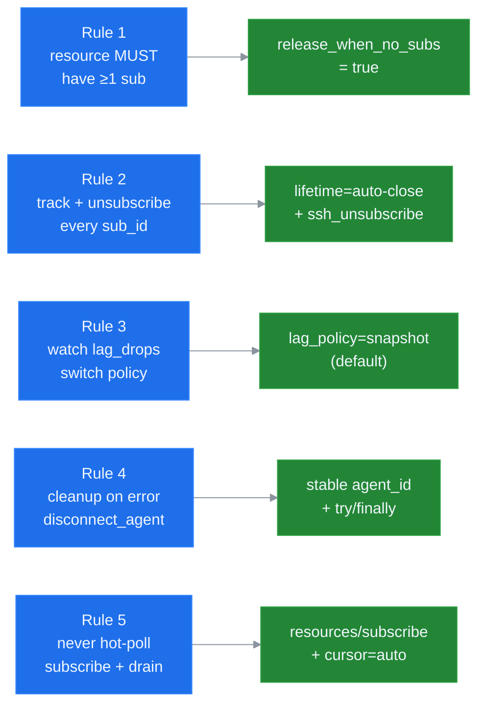
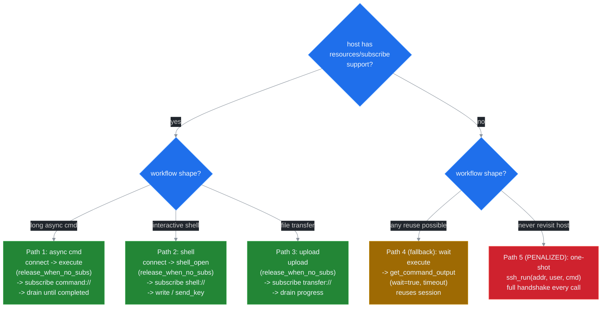
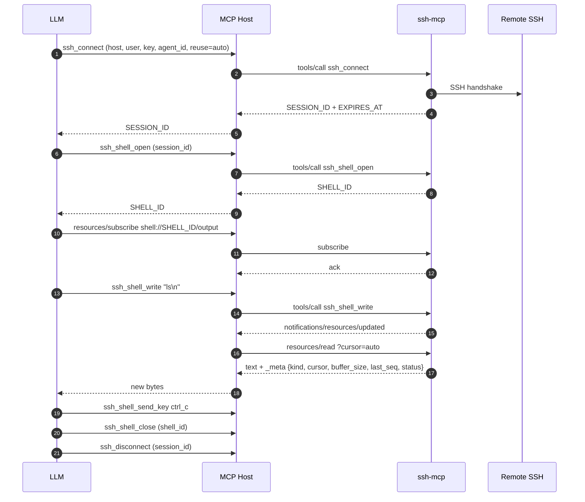
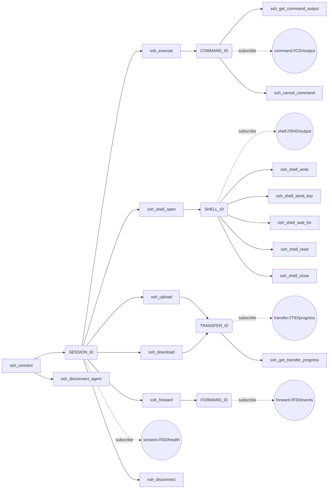
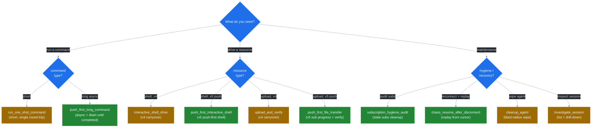
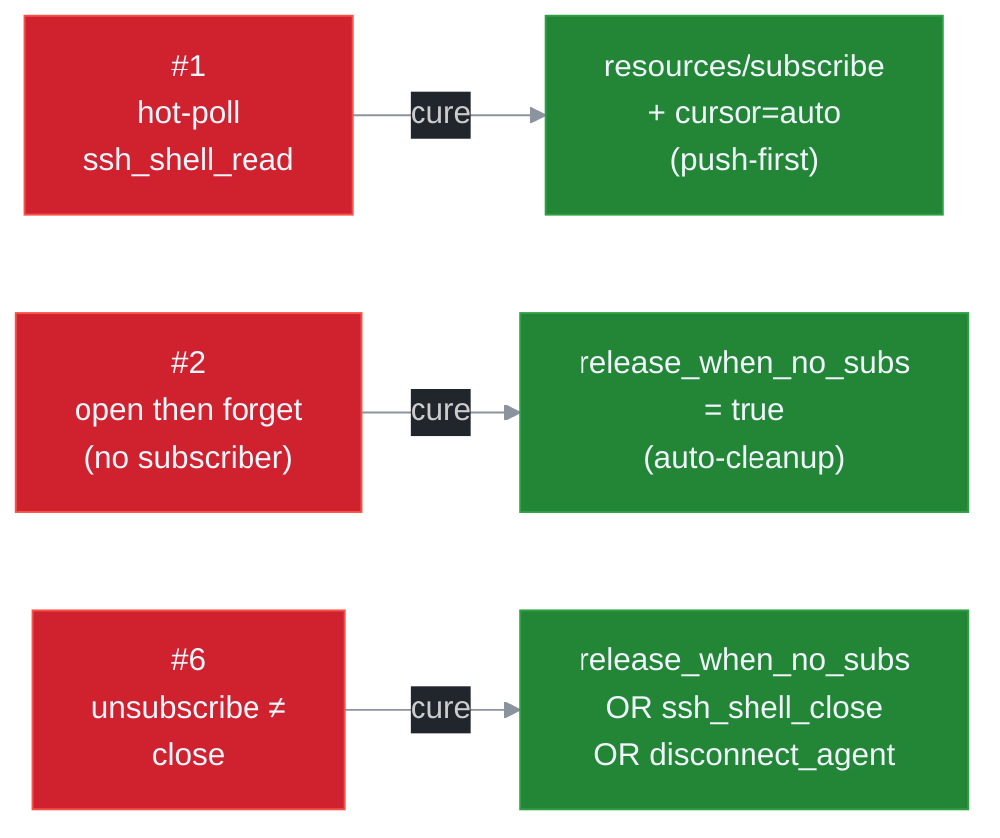
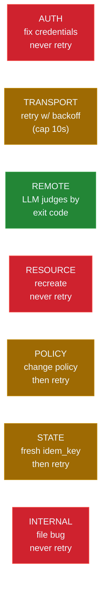

# LLM Guide

Single canonical reference for LLM hosts driving ssh-mcp. Combines the five golden rules, the 27B / 70B root prompts, the prompts catalogue, the ten anti-patterns, and the full 38-code error handbook. Sources: [ADR 0003](./adr/0003-lifecycle-binding.md), [ADR 0004](./adr/0004-channel-mux-fairness.md), [ADR 0005](./adr/0005-llm-ux-priorities.md), [ADR 0006](./adr/0006-backpressure-policies.md), [ADR 0007](./adr/0007-error-taxonomy.md), [ADR 0008](./adr/0008-ndjson-daemon-protocol.md).

Cross references:

- [API.md](./API.md) — full tool reference.
- [RESOURCES.md](./RESOURCES.md) — `resources/*` deep dive.
- [OPERATIONS.md](./OPERATIONS.md) — symptom → cure runbook.
- [DAEMON.md](./DAEMON.md) — `ssh-mcp-tail` op + event schema.

## Reading order

| Audience | Start here |
|---|---|
| 27B-class root prompt embedded in `Implementation.instructions` | [Root prompt — 27B](#root-prompt--27b-class-models) |
| 70B-class root prompt | [Root prompt — 70B](#root-prompt--70b-class-models) |
| Operator debugging a leak | [Anti-patterns](#anti-patterns) → [Error handbook](#error-handbook) |
| Host implementer wiring `prompts/list` | [Prompts catalogue](#prompts-catalogue) |
| Anyone needing to understand the design | [Golden rules](#golden-rules) → ADRs |

---

## Golden rules

Five inviolable rules every LLM driving ssh-mcp must respect. Sourced from [ADR 0005](./adr/0005-llm-ux-priorities.md) and enforced at the wire by the lifecycle and channel-mux layers ([ADR 0003](./adr/0003-lifecycle-binding.md), [ADR 0004](./adr/0004-channel-mux-fairness.md)). Advisory at the protocol level — the server will not refuse a violating request — but breaking them produces zombie remote state, leaked subscriptions, dropped events, or token waste. Treat as preconditions, not suggestions.



### Rule 1 — Every long-running resource MUST have at least one active subscriber

Long-running resources are `shell://<id>/output`, `command://<id>/output`, `transfer://<id>/progress`, `forward://<id>/events`. A bare resource without an observer accumulates output in the per-resource ring buffer until eviction; the operator never knows the resource exists; the LLM never sees the events.

**Violation.** Caller invokes `ssh_shell_open` then immediately disconnects without subscribing. The PTY stays alive, output fills the ring buffer, the session zombies until the inactivity TTL fires.

**Rationale.** v5.0 binds resource lifetime to subscription presence ([ADR 0003](./adr/0003-lifecycle-binding.md)). The lifecycle adapter tracks state with atomic refcounts; `Owned -> Observed -> Releasing -> Closed` transitions are CAS-driven. A resource without a subscriber and without `release_when_no_subs=true` parks in `Owned` indefinitely — the dominant leak vector for 27B-class hosts.

**How to comply.**
- Subscribe within 2 seconds of resource creation, OR
- Pass `release_when_no_subs=true` when calling `ssh_shell_open` / `ssh_execute` / `ssh_upload` / `ssh_download` so the server self-cleans after the configured grace window.

### Rule 2 — Always unsubscribe when done; track every `sub_id`

Every `ssh_subscribe` (or legacy `resources/subscribe`) returns a `sub_id` keyed to a per-channel state bag (cursor, filter, lag policy, mpsc lane, stats). Forgetting `ssh_unsubscribe` keeps the lane alive until peer GC fires (default 30 s) or the parent session is disconnected. Multiplied across a long agent loop this leaks lanes and distorts `events_sent`.

**Violation.** Agent re-subscribes on every event-loop iteration without ever unsubscribing. After 100 turns the session has 100 `sub_id`s on a single URI, each with its own backlog and counters.

**Rationale.** [ADR 0004](./adr/0004-channel-mux-fairness.md) gives each subscription its own bounded `mpsc::channel(N)` and a per-lane stats block. The server cannot reach into your conversation state to GC a stale `sub_id` — only explicit `ssh_unsubscribe` or peer-transport disconnect closes it.

**How to comply.**
- After every `ssh_subscribe`, store the returned `sub_id` in conversation state until the matching `ssh_unsubscribe`.
- On any error path that abandons the workflow, call `ssh_unsubscribe` for every outstanding `sub_id`, then `ssh_disconnect_agent`.
- Set `lifetime=auto-close` on the subscribe call so the server releases the resource cascade when the last consumer drops.

### Rule 3 — Watch `lag_drops` — switch to `lag_policy=snapshot` when drops > 0

Every push lane carries atomic counters (`events_sent`, `bytes_sent`, `lagged_drops`, `lagged_recoveries`, `queue_depth`, `queue_high_watermark`, `block_total_ms`) exposed via `ssh_sub_stats`. Drops indicate the consumer cannot keep up. Ignoring them produces silent gaps.

**Violation.** Agent sees `lagged_drops=42` on a lane, treats the marker as informational, keeps consuming as if nothing happened. Downstream logic that depends on strictly-monotonic event order silently corrupts.

**Rationale.** [ADR 0006](./adr/0006-backpressure-policies.md) defines four lag policies. `Snapshot` (the default) bridges drops by dropping the lane backlog and rebuilding from the resource ring buffer. `BlockSlow` retains zero loss but blocks the producer; choose for forensic captures only.

**How to comply.**
- Query `ssh_sub_stats` periodically (or after a long-running phase).
- If `lagged_drops > 0` and the workflow tolerates a snapshot rebuild, ensure `lag_policy=snapshot` (the default).
- If the workflow needs zero loss, switch to `lag_policy=block_slow` and adjust `SSH_BP_BLOCK_TIMEOUT_MS`.

### Rule 4 — On error, clean up — `ssh_disconnect_agent` is your circuit breaker

The `agent_id` parameter passed at `ssh_connect` time scopes ownership of every resource opened against that agent. When a workflow fails, release everything in one call rather than attempting incremental cleanup.

**Violation.** Agent panics mid-workflow. The host attempts `ssh_shell_close` for one of three open shells, fails, gives up. Two shells, two open commands, and an in-flight upload zombie until inactivity TTL fires.

**Rationale.** Agent-scoped cleanup is engineered as the cheapest correct recovery path. `ssh_disconnect_agent` walks every session bound to the agent and cascades through resources via the lifecycle layer ([ADR 0003](./adr/0003-lifecycle-binding.md)). Idempotent — duplicate calls return `OK` with `disconnected_count=0`.

**How to comply.**
- Wrap every workflow in a try/finally (or its host equivalent) that calls `ssh_disconnect_agent(agent_id)` on any failure path.
- Pass a stable `agent_id` to every `ssh_connect`.
- For agent-spanning workflows, prefer multiple agent IDs over re-using one — release granularity matches blast radius.

### Rule 5 — Never hot-poll `ssh_shell_read` — subscribe and drain push events

`ssh_shell_read` is a fallback for hosts without `resources/subscribe` support. It costs a full tool round-trip per call, returns at best a 50 ms-old snapshot, and on a tight loop produces token bills proportional to loop frequency.

**Violation.** Agent emits `ssh_shell_read(shell_id, wait=true, wait_timeout_secs=1)` in a `while true` loop. After a minute the host has consumed 60 round-trips and ~12 KB of redundant tool-response framing.

**Rationale.** [ADR 0004](./adr/0004-channel-mux-fairness.md) gives each subscriber its own debounced push lane (50 ms coalesce, 1 s force flush, 30 s keepalive). Server does the work once; LLM consumes events as conversation context; cursor advances exactly as fast as the consumer needs.

**How to comply.**
- Use `resources/subscribe` (or `ssh_subscribe` once Phase 3 lands) immediately after `ssh_shell_open`.
- On each `notifications/resources/updated`, issue `resources/read?cursor=auto` and consume the delta.
- Reserve `ssh_shell_read` for hosts that genuinely cannot subscribe; mark this in the agent's tool-selection logic.

---

## Root prompt — 27B-class models

Compact root prompt embedded verbatim into `Implementation.instructions` when the host signals a 27B-class model (Gemma 3 27B IT, Mistral Small 3, Qwen 2.5 32B). Stop here for those models.

```text
SSH MCP v5.0. Subscribe-first. 28 tools.

GOLDEN RULES:
 1. Long-running resource MUST have ≥1 subscriber.
    No subscriber? Pass release_when_no_subs=true.
 2. ssh_unsubscribe(sub_id) when done. Track every sub_id.
 3. lag_drops > 0 in ssh_sub_stats? Use lag_policy=snapshot.
 4. On error: ssh_disconnect_agent(agent_id) wipes your scope.
 5. NEVER hot-poll ssh_shell_read. Use ssh_subscribe + drain.

PUSH-FIRST HAPPY PATHS:
1) Async cmd:
   ssh_connect -> ssh_execute(release_when_no_subs=true)
   -> ssh_subscribe(uri=command://<cid>/output, lifetime=auto-close)
   -> drain events until ev=completed.
2) Interactive shell:
   ssh_connect -> ssh_shell_open(release_when_no_subs=true)
   -> ssh_subscribe(uri=shell://<sid>/output)
   -> ssh_shell_write / ssh_shell_send_key.
3) Upload + progress:
   ssh_upload(release_when_no_subs=true)
   -> ssh_subscribe(uri=transfer://<tid>/progress).

FALLBACK:
4) ssh_execute -> ssh_get_command_output(wait=true,
                                         wait_timeout_secs=30).
   (Use when host lacks subscribe support; reuses session.)
5) ssh_run (PENALIZED: connect+exec+disconnect every call).
   Pays full handshake (200-2000 ms) + tears session. Only when
   you will NEVER touch this host again. Two ssh_run calls cost
   as much as one ssh_connect + two ssh_execute calls.

CLEANUP CHECKLIST (run at workflow end):
 [ ] ssh_unsubscribe every sub_id you opened
 [ ] ssh_shell_close / ssh_cancel_command if not auto-close
 [ ] ssh_disconnect_agent(agent_id) on error
 [ ] ssh_disconnect for graceful single-session close

WIRE TIPS:
- Every response: KEY: value lines + JSON in structured_content.
- IDs end in _ID. NEXT: line = next-tool priority order.
- HINT: REQUIRED -> mandatory. HINT: RECOMMENDED -> soft.
- _meta.idempotency_key on retries dedupes mutating tools.
- Errors: REASON: [CODE] desc. DETAIL: cure (read it).
- AUTH/RESOURCE/INTERNAL = never retry. TRANSPORT = backoff.
  POLICY = retry conditional. STATE = retry only with idem key.

LAG POLICIES (per sub_id, default=snapshot):
- snapshot: drop backlog + rebuild from ring buffer.
- block_slow: zero loss, producer blocks (forensic).
- drop_oldest / drop_newest: explicit gap markers.
```

---

## Root prompt — 70B-class models

Detailed root prompt embedded verbatim into `Implementation.instructions` for Claude 3.5+, GPT-4-class, Llama 3.1 70B+, Qwen 2.5 72B. Adds tradeoffs for `lifetime`, `lag_policy`, and cleanup.



```text
SSH MCP v5.0. Subscribe-first. 28 tools (20 without port_forward + 8 sub
operations). All responses: KEY: value markdown + structured_content JSON.

GOLDEN RULES:
1. Every long-running resource (shell://, command://, transfer://,
   forward://) must have ≥1 active subscriber between creation and
   close. If you cannot guarantee a subscriber, set
   release_when_no_subs=true at creation time so the server
   self-cleans after the configured grace window.
2. Track every sub_id returned by ssh_subscribe (or the legacy
   resources/subscribe). Call ssh_unsubscribe(sub_id) before the
   workflow ends. Forgotten subs leak lanes until peer GC fires.
3. After every nontrivial workflow query ssh_sub_stats. If
   lagged_drops > 0, choose between lag_policy=snapshot (default,
   gap-bridging via ring buffer rebuild) and lag_policy=block_slow
   (zero loss, producer blocks; needs SSH_BP_BLOCK_TIMEOUT_MS).
4. On any error path call ssh_disconnect_agent(agent_id). It is
   idempotent and cascades through every owned session and resource.
   Pass a stable agent_id at ssh_connect time so the cleanup boundary
   is unambiguous.
5. Never poll ssh_shell_read in a loop. Use ssh_subscribe and consume
   notifications/resources/updated events; issue resources/read?
   cursor=auto to drain the delta.

PUSH-FIRST HAPPY PATHS (preferred):

1) Run an async command with push:
   ssh_connect(host, user, agent_id, reuse=Auto)
   -> ssh_execute(session_id, command, release_when_no_subs=true)
   -> ssh_subscribe(uri=command://<cid>/output,
                    lifetime=auto-close, lag_policy=snapshot)
   -> consume push events until ev=completed (carries exit code).
   -> ssh_unsubscribe(sub_id)  // optional with auto-close

2) Drive an interactive PTY shell:
   ssh_connect(...) -> ssh_shell_open(release_when_no_subs=true)
   -> ssh_subscribe(uri=shell://<sid>/output, lifetime=auto-close)
   -> ssh_shell_write or ssh_shell_send_key
   -> ssh_shell_wait_for(pattern) when synchronisation needed
   -> ssh_shell_close (or rely on auto-close when last sub drops)

3) Upload with progress visibility:
   ssh_upload(release_when_no_subs=true) returns transfer_id
   -> ssh_subscribe(uri=transfer://<tid>/progress, lifetime=auto-close)
   -> consume bytes_transferred events until completion event.

FALLBACK PATHS:

4) Wait-on-result (PREFERRED FALLBACK — reuses session):
   ssh_connect(reuse=auto) -> ssh_execute(...) returns command_id
   -> ssh_get_command_output(command_id, wait=true,
                             wait_timeout_secs=30) blocks until
   completion or timeout. Use when host has no subscribe support.
   Keeps the session alive for the next call.

5) One-shot (PENALIZED — avoid unless single-touch):
   ssh_run(address, username, command [, disconnect_after=true])
   pays a full SSH handshake (200-2000 ms) and tears the session
   down on every call. Two ssh_run calls cost as much as one
   ssh_connect + two ssh_execute calls. Acceptable ONLY when you
   will NEVER touch this host again (e.g. one-shot capability sniff
   across many distinct hosts, N=1 command per host). For any reuse
   default to path 1.

TRADEOFF GUIDE:

lifetime parameter on ssh_subscribe:
- "manual"     -> ssh_unsubscribe required; no auto-close.
                  Use for human-driven debugging where the resource
                  must outlive a transient agent.
- "auto-close" -> last sub triggers grace timer; resource releases.
                  Use for one-off LLM workflows. Default for new code.
- "lease"      -> bounded duration; renew with ssh_sub_resume.
                  Use for budget-capped agents.

lag_policy parameter (per sub_id):
- "snapshot"   -> default. Drop backlog + rebuild from ring buffer
                  on overflow. Strictly-monotonic cursor with gap
                  bridging. Best general-purpose choice.
- "block_slow" -> producer .awaits the consumer. Zero loss; bounded
                  by SSH_BP_BLOCK_TIMEOUT_MS (default 5000 ms).
                  Use for forensic / audit captures.
- "drop_oldest"/"drop_newest" -> explicit gap markers. Use only when
                  monitoring tolerates loss and snapshot rebuild is
                  too expensive (e.g. 16 MB ring buffers).

CLEANUP CHECKLIST (run at every workflow boundary):
- ssh_unsubscribe every sub_id you opened (or rely on lifetime=auto-close).
- ssh_shell_close / ssh_cancel_command for any resource without auto-close.
- ssh_disconnect_agent(agent_id) on any error path.
- ssh_disconnect for graceful single-session close.

WIRE CONTRACT:
- Every tool response: a KEY: value markdown body and a typed JSON
  payload on the structured_content channel. IDs end in _ID.
- HINT: REQUIRED NEXT STEP: ... -> mandatory follow-up.
  HINT: RECOMMENDED: ...        -> soft suggestion.
- NEXT: <tool> | <tool> | ...   -> push-first ordered successors.
- _meta.idempotency_key on mutating tools deduplicates retries
  (TTL: SSH_IDEMPOTENCY_TTL_SECS, default 300 s).
- WARN: SUB_LEAK_RISK on a list response = a Phase-1 lifecycle hint
  that one of your resources has 0 subs and no auto-cleanup.

ERROR TAXONOMY:
- AUTH       never retry. Fix credentials.
- TRANSPORT  retry with exponential backoff (cap 10 s).
- REMOTE     decide based on remote exit code.
- RESOURCE   never retry. The resource is gone or never existed.
- POLICY     retry conditional on policy change (e.g. switch
             lag_policy, raise SSH_LANE_BUFFER, audit ssh_sub_list).
- STATE      retry only with a fresh _meta.idempotency_key.
- INTERNAL   never retry; collect logs + report.

DETAIL on every error response carries a one-sentence cure tuned for
direct LLM consumption. Read it before deciding the next step.
```

---

## Decision table

The single most important table. Pick the star-marked path whenever the host advertises `resources.subscribe = true` (every spec-compliant MCP host since protocol 2025-06-18 does).

| What you want                                      | Tool / Pattern                                                |
| -------------------------------------------------- | ------------------------------------------------------------- |
| Run a one-shot remote command (host you may revisit) | `ssh_connect(reuse=auto)` -> `ssh_execute` -> `ssh_subscribe command://<id>/output` *  |
| Run a one-shot remote command (single-touch host)  | `ssh_run` (PENALIZED: full handshake + teardown per call)     |
| Open an interactive shell                          | `ssh_shell_open` + `resources/subscribe shell://<id>/output` * |
| Send `Ctrl+C`, arrows, function keys               | `ssh_shell_send_key`                                          |
| Send raw text input                                | `ssh_shell_write`                                             |
| Watch shell output realtime                        | `resources/subscribe` + `resources/read?cursor=auto` *        |
| Wait for a specific prompt (gate)                  | `ssh_shell_wait_for`                                          |
| Read shell buffer once (snapshot)                  | `resources/read shell://<id>/output`                          |
| Watch async command output realtime                | `resources/subscribe command://<id>/output` *                 |
| Watch SFTP transfer progress realtime              | `resources/subscribe transfer://<id>/progress` *              |
| Watch session health changes                       | `resources/subscribe session://<id>/health` *                 |
| Watch port-forward events                          | `resources/subscribe forward://<id>/events` *                 |
| Upload / download a file                           | `ssh_upload` / `ssh_download`                                 |
| Cancel a long-running command                      | `ssh_cancel_command`                                          |
| Forward a TCP port                                 | `ssh_forward` (feature-gated)                                 |
| Cleanup all sessions for an agent                  | `ssh_disconnect_agent`                                        |
| Disconnect a single session cleanly                | `ssh_disconnect`                                              |
| Discover existing SESSION_IDs                      | `ssh_list_sessions`                                           |
| Check what is still running before disconnect      | `ssh_list_commands`                                           |

\* = preferred path (lowest latency, lowest token cost).

> **NEXT: tip.** If a response contains a `NEXT:` line, prefer one of those tool calls over guessing the next move. Every async-spawn response carries a `NEXT:` advisory listing concrete next-step calls.

## Subscribe-first contract

Every `resources/read` response embeds the `_meta` envelope on the `ResourceContents`. Subscribe-first is the wire payload of every read.

### Envelope shape

```json
{
  "uri": "shell://4b9c8e2a-.../output",
  "mimeType": "text/plain",
  "text": "$ ls -la\n...",
  "_meta": {
    "kind": "shell",
    "cursor": 4096,
    "buffer_size": 4096,
    "last_seq": 17,
    "status": "open"
  }
}
```

Fields:

- `kind` — one of `"shell" | "command" | "transfer" | "session" | "forward"`. Lets the host route the response without re-parsing the URI.
- `cursor` — `u64`. Next cursor value to pass on the following `?cursor=` read. **Only present on `shell` and `command`** (the byte-stream resources).
- `buffer_size` — `u64`. Bytes currently held in the resource history buffer. **Only present on `shell` and `command`**.
- `last_seq` — `u64`. Last sequence number allocated for `(kind, id)` by the producer. Compare to your previous `last_seq` to detect gaps.
- `status` — string. Kind-specific (`open` / `closed` / `running` / `completed` / `failed` / `healthy` / `unhealthy`).

`transfer://`, `session://`, and `forward://` are point-in-time snapshots and omit `cursor` / `buffer_size`.

### Cursor-aware loop

```
1. resources/subscribe { uri }
2. wait for notifications/resources/updated { uri }
3. resources/read { uri: "<uri>?cursor=auto" }
4. server returns only fresh bytes/events since this peer's last read
   _meta.cursor advances atomically to <previous>+bytes_returned
5. goto 2
```

The server tracks `(peer, uri) -> cursor` internally. Re-issuing `?cursor=auto` after a notification returns just the delta.

### Stable peer identity

Peer identity used by `?cursor=auto` is derived from the transport, not minted per request:

- HTTP transport: `Mcp-Session-Id` header (case-insensitive). Every request that lands on the same Streamable HTTP session shares the same `PeerId`.
- Stdio transport: process-wide singleton (`Stdio` key).

Subscribe and unsubscribe addressed to the same connection always see the same per-peer cursor. Two concurrent peers (two HTTP clients with different `Mcp-Session-Id` values, or one HTTP client + one stdio client) advance independently.

## Golden path (subscribe-first PTY)

Canonical multi-step interactive flow.



### Step-by-step

1. **Connect** with `ssh_connect`. Pass `agent_id` (groups sessions for bulk cleanup) and `reuse=auto` (pick the most recent healthy match in one round-trip). Capture `SESSION_ID`. Watch the response for an `EXPIRES_AT` line — RFC3339 deadline at which the inactivity sweeper will reap the session unless you ping it.
2. **Open the PTY** with `ssh_shell_open`. Capture `SHELL_ID`.
3. **Subscribe immediately** to `shell://<SHELL_ID>/output` — before sending any input. The very first byte the remote emits triggers `notifications/resources/updated` instead of polling.
4. **Drive input** with `ssh_shell_write` (text) or `ssh_shell_send_key` (named keys). Both are non-blocking.
5. **Read the delta** with `resources/read?cursor=auto` whenever you receive `notifications/resources/updated`. Per-peer cursor on the server, so each read is just the new bytes.
6. **Gate on prompts** with `ssh_shell_wait_for` only when you need a single-shot gate (for example before sending the next command). For continuous observation prefer the subscribe loop.
7. **Close cleanly** with `ssh_shell_close`, then `ssh_disconnect` (or `ssh_disconnect_agent`).

## When to fall back (no subscribe support)

Some hosts do not consume MCP notifications. Fallback paths:

- **Continuous shell observation** -> `ssh_shell_read` with `wait=true` and `min_bytes` (default 1, cap = `max_output_bytes`).
- **Single-shot prompt gating** -> `ssh_shell_wait_for` (always works regardless of subscribe support).
- **Async command completion** -> `ssh_get_command_output` with `wait=true` (default 30 s, cap 300 s).
- **Transfer completion** -> `ssh_get_transfer_progress` with `wait=true`.

Even on the fallback path, prefer the long-poll `wait=true` variants over a tight loop of `wait=false` polls — long-poll wakes immediately on real activity and idles cheaply otherwise.

## Connection lifecycle and recycling

Three signals that small LLMs can use to keep a session pool tidy without leaking handles.

### `agent_id`

Pass `agent_id` on every `ssh_connect` to group sessions under a logical owner:

- `ssh_list_sessions { agent_id }` filters to that owner.
- `ssh_disconnect_agent { agent_id }` bulk-disconnects every session owned by that agent — cancelling commands, closing shells, aborting transfers.
- When `agent_id` is set on `ssh_connect`, `reuse=auto` and `reuse=suggest` rank sessions owned by the same agent first.

### `EXPIRES_AT` / `PERSISTENT`

`ssh_connect` and `ssh_list_sessions` emit one of two mutually exclusive lines per session:

- `EXPIRES_AT: <RFC3339 UTC>` — deadline at which the inactivity sweeper will reap the session. Clock starts at `connected_at` and resets on activity.
- `PERSISTENT: true` — the caller passed `persistent=true` on connect; the inactivity sweeper is disabled and `EXPIRES_AT` is omitted.

Extend a session before `EXPIRES_AT` fires by running any cheap call (a colon ping `ssh_execute ":"`, `ssh_list_sessions`, etc.). Each touch resets the timer.

### `HINT:` lines

When more than 5 sessions are owned by the same `agent_id` (anti-leak threshold), `ssh_list_sessions` and `ssh_connect SUGGESTED` append:

```
HINT: agent 'X' owns N sessions; consider ssh_disconnect_agent to bulk-cleanup
```

Treat `HINT:` as actionable. Most common cause: a workflow that keeps spawning new sessions instead of reusing a healthy one — fix by passing `reuse=auto`.

### `ReusePolicy` defaults

- `reuse=suggest` (default) — list matching sessions and stop. Right when a human will pick.
- `reuse=auto` — return the most recent healthy match (or open a new session). Right for "I just want to run a command".
- `reuse=force_new` — skip the lookup entirely. Right when you want a guaranteed fresh transport.

## Wire surface

### `NEXT:` advisory

Every response with a clear successor tool ends with a single `NEXT:` line listing one or more concrete tool calls (pipe-separated). A 27B-class model can chain a workflow by reading `NEXT:` instead of consulting the cookbook.

```
SSH_CONNECT: OK
SESSION_ID: s-abc
HOST: example.com:22
USERNAME: alice
AGENT_ID: claude-code-1
RETRY: 0
PERSISTENT: false
EXPIRES_AT: 2026-05-03T18:30:00+00:00
NEXT: ssh_execute(session_id=s-abc, command=...) | ssh_shell_open(session_id=s-abc) | ssh_disconnect(session_id=s-abc)
```

#### Coverage matrix

| Status | NEXT: emitted? | Hint string |
| --- | --- | --- |
| `SSH_CONNECT: OK` / `REUSED` | yes | `ssh_execute` / `ssh_shell_open` / `ssh_disconnect` |
| `SSH_CONNECT: SUGGESTED` | yes | reuse existing `session_id` or retry with `force_new` |
| `SSH_LIST_SESSIONS: OK` (non-empty) | yes | `ssh_disconnect_agent` (when agent owns sessions) / `ssh_disconnect` |
| `SSH_DISCONNECT: OK` / `SSH_DISCONNECT_AGENT: OK` | no (terminal) | — |
| `SSH_EXECUTE: STARTED` | yes | `ssh_get_command_output(wait=true)` / `ssh_cancel_command` |
| `SSH_EXECUTE: COMPLETED` | no (terminal) | — |
| `SSH_GET_COMMAND_OUTPUT: RUNNING` | yes | `resources/subscribe command://<id>/output` / `ssh_get_command_output(wait=true)` |
| `SSH_GET_COMMAND_OUTPUT: COMPLETED` | no (terminal) | — |
| `SSH_LIST_COMMANDS: OK` | no | — |
| `SSH_CANCEL_COMMAND: OK` / `NOOP` | no (terminal) | — |
| `SSH_SHELL_OPEN: OK` | yes | `resources/subscribe shell://<id>/output` / `ssh_shell_write` / `ssh_shell_send_key` |
| `SSH_SHELL_WRITE: OK` | yes | `resources/read shell://<id>/output?cursor=auto` / `ssh_shell_wait_for` / `ssh_shell_read` |
| `SSH_SHELL_SEND_KEY: OK` | yes | `resources/read shell://<id>/output?cursor=auto` / `ssh_shell_wait_for` / `ssh_shell_read` |
| `SSH_SHELL_READ: OK` | no | — |
| `SSH_SHELL_WAIT_FOR: MATCHED` | yes | `ssh_shell_write` / `ssh_shell_send_key` / `ssh_shell_close` |
| `SSH_SHELL_WAIT_FOR: TIMEOUT` | yes | `ssh_shell_wait_for` / `ssh_shell_read` / `ssh_shell_close` |
| `SSH_SHELL_WAIT_FOR: CLOSED` | no (terminal) | — |
| `SSH_SHELL_CLOSE: OK` | no (terminal) | — |
| `SSH_UPLOAD: STARTED` | yes | `ssh_get_transfer_progress(wait=true)` |
| `SSH_DOWNLOAD: STARTED` | yes | `ssh_get_transfer_progress(wait=true)` |
| `SSH_GET_TRANSFER_PROGRESS: RUNNING` | yes | `resources/subscribe transfer://<id>/progress` / `ssh_get_transfer_progress(wait=true)` |
| `SSH_GET_TRANSFER_PROGRESS: COMPLETED` / `FAILED` / `CANCELLED` | no (terminal) | — |
| `SSH_FORWARD: OK` | yes | `resources/subscribe forward://<id>/events` |

Terminal statuses deliberately omit `NEXT:` — the model's next move depends entirely on the user prompt.

### Subscribe-first `HINT:` lines

Every async-spawn response carries a subscribe-first `HINT:` line steering toward push notifications:

- `SSH_SHELL_OPEN: OK` -> `HINT: subscribe to shell://<id>/output for realtime output (preferred over polling)`
- `SSH_EXECUTE: STARTED` -> `HINT: subscribe to command://<id>/output for realtime output (preferred over polling)`
- `SSH_UPLOAD: STARTED` and `SSH_DOWNLOAD: STARTED` -> `HINT: subscribe to transfer://<id>/progress for realtime progress`
- `SSH_FORWARD: OK` -> `HINT: subscribe to forward://<id>/events for realtime event log`

Body line order: `... -> HINT: <subscribe> -> NEXT: <successors>`.

### `structured_content` channel

Every tool response carries BOTH the existing block-style Markdown (`content[].text`) AND a typed JSON object (`structured_content`). Smaller LLMs (27B class) can index the structured channel by key without parsing Markdown.

`ssh_connect: ok`:

```json
{
  "tool": "ssh_connect",
  "status": "ok",
  "session_id": "a3f2b1d7-...",
  "host": "example.com",
  "port": 22,
  "username": "alice",
  "agent_id": "claude-code-1",
  "next": ["ssh_execute(session_id=a3f2b1d7-..., command=...)",
           "ssh_shell_open(session_id=a3f2b1d7-...)",
           "ssh_disconnect(session_id=a3f2b1d7-...)"]
}
```

Error shape:

```json
{
  "tool": "ssh_execute",
  "status": "error",
  "code": "SESSION_NOT_FOUND",
  "reason": "no session with id sess-x",
  "detail": "closest matches: sess-1, sess-a"
}
```

The full per-tool typed result coverage (21 / 21) lives in `src/infra/mcp/results.rs` and is documented in [API.md](./API.md).

### Idempotency

Mutating tools accept a request `_meta.idempotency_key` (1..=256 bytes). When present and the key+tool tuple has been seen within the TTL window, the server returns the cached response verbatim — the use case is NOT re-executed.

Defaults:

- TTL: `300` seconds. Override via `SSH_IDEMPOTENCY_TTL_SECS`.
- Cache cap: `1024` entries. Override via `SSH_IDEMPOTENCY_MAX_ENTRIES`.
- Key length cap: `256` bytes. Oversized keys raise `IDEMPOTENCY_KEY_TOO_LONG`.
- Empty keys are treated as absent (idempotency OFF for that call).

15 mutating tools honour the key: `ssh_connect`, `ssh_disconnect`, `ssh_disconnect_agent`, `ssh_disconnect_many`, `ssh_execute`, `ssh_execute_batch`, `ssh_run`, `ssh_cancel_command`, `ssh_shell_open`, `ssh_shell_write`, `ssh_shell_send_key`, `ssh_shell_close`, `ssh_upload`, `ssh_download`, `ssh_forward`.

Read-only tools intentionally ignore the key: `ssh_list_sessions`, `ssh_list_commands`, `ssh_get_command_output`, `ssh_get_transfer_progress`, `ssh_shell_read`, `ssh_shell_wait_for`.

Request envelope:

```json
{
  "jsonrpc": "2.0",
  "id": 1,
  "method": "tools/call",
  "params": {
    "name": "ssh_run",
    "arguments": { "address": "h.example.com:22", "username": "alice", "command": "uptime" },
    "_meta": { "idempotency_key": "retry-1-abc" }
  }
}
```

Anti-pattern: reusing the same key for different argument sets. The cache keys on `(tool_name, key)` only — a retry with mutated arguments and the same key returns the cached response from the first call. Always pair `idempotency_key` with stable arguments.

### Progress notifications

When a request includes `_meta.progressToken`, the server fires periodic `notifications/progress` updates during long async waits — the LLM sees a "still alive" cue without polling.

| Tool | Cadence | Payload |
| --- | --- | --- |
| `ssh_get_command_output(wait=true)` | 5 s | `{ progress: <stdout_bytes>, total: null, message: "command running" }` |
| `ssh_get_transfer_progress(wait=true)` | 5 s | `{ progress: <bytes_transferred>, total: <total_bytes>, message: "transfer running" }` |
| `ssh_shell_wait_for` | 1 s | `{ progress: <elapsed_secs>, total: <timeout_secs>, message: "waiting for pattern" }` |

Notification errors are swallowed (transport hiccup, peer closed). When `_meta.progressToken` is absent, every emit is a no-op.

### NOT_FOUND closest-match suggestions

When `SESSION_NOT_FOUND` / `SHELL_NOT_FOUND` / `COMMAND_NOT_FOUND` / `TRANSFER_NOT_FOUND` / `FORWARD_NOT_FOUND` fires and the relevant repo holds at least one live entry, the `DETAIL:` line carries `closest matches: <id1>, <id2>, <id3>` (top-3 Levenshtein neighbors). Smaller LLMs recover from typos without round-tripping `ssh_list_*`.

```
SSH_EXECUTE: ERROR
REASON: [SESSION_NOT_FOUND] no session with id sess-abe
DETAIL: closest matches: sess-abc, sess-abd, sess-abf
```

### `INITIAL_BUFFER` on `ssh_shell_open`

When the PTY emits stdout within the first ~100 ms after `ssh_shell_open` (login banner or shell prompt), the response embeds:

- Markdown: `INITIAL_BUFFER: <escaped-bytes>` line (CR / LF escaped to `\r` / `\n`, head-truncated to 4 KiB).
- Structured: `initial_buffer` field (UTF-8-lossy decoded bytes).

Tunables: `SSH_SHELL_OPEN_INITIAL_PEEK_MS` (100), `SSH_SHELL_OPEN_INITIAL_PEEK_TICK_MS` (5), `SSH_SHELL_OPEN_INITIAL_BUFFER_MAX_BYTES` (4096).

### Cross-tool flow map



## Token efficiency tips

- **Use `?cursor=auto`** on `resources/read` so the server tracks the per-peer delta — every read returns just the new bytes.
- **Tune `max_output_bytes`** when falling back to `ssh_shell_read`. Default is 16 KiB; cap is 1 MiB (`SSH_MCP_OUTPUT_DEFAULT_BYTES` / `SSH_MCP_OUTPUT_MAX_BYTES_CAP`).
- **Prefer `ssh_shell_wait_for` with multi-pattern** over multiple sequential reads when branching logic depends on which prompt appears. Example: `["password:", "Permission denied", "$ "]` resolves three login outcomes in one tool call.
- **Use `ssh_list_sessions` once** at the start of a long task, then trust your `SESSION_ID`s for the rest of the session.
- **Filter `ssh_list_commands` with `status="running"`** when you only care about live work — the response is shorter.

---

## Prompts catalogue

10 workflows advertised via `prompts/list` — 5 v4 carryovers plus 5 v5 push-first additions. Source: [ADR 0005](./adr/0005-llm-ux-priorities.md). Phase 3 materialises these in `src/infra/mcp/prompts.rs`.



### `prompts/get` flow

Send a `prompts/get` request with `name` and `arguments` (a `Map<String, String>` keyed by argument name). The server returns a `GetPromptResult` carrying a single `User`-role message with the parameterised recipe text. Missing required arguments raise `invalid_params`; unknown prompt names raise `invalid_request`.

### Carryovers from v4

#### `run_one_shot_command`

Drive `ssh_run` with `reuse=auto` and `disconnect_after=true` to execute a short command and release the session.

- **Args**: `address`, `username`, `command` (all required strings).
- **Sequence**: `ssh_run` ack on stdout. Single round-trip; no push channel.
- **Failure modes**: `[AUTH_FAILED]` (never retry); `[CONNECTION_FAILED]` / `[CONNECTION_TIMEOUT]` (TRANSPORT, auto-retry with backoff); `[REMOTE_CMD_FAILED]` (LLM judges based on `exit_code`).

#### `investigate_session`

Snapshot async commands on a known session, read its health resource, then disconnect.

- **Args**: `session_id` (required).
- **Sequence**: `ssh_list_commands` → `resources/read session://<id>/health` → `ssh_disconnect`.
- **Failure modes**: `[SESSION_NOT_FOUND]` (RESOURCE, never retry; use `ssh_list_sessions` to find the live id).

#### `upload_and_verify`

Run `ssh_upload`, wait for completion, then `ssh_run sha256sum` on the remote path.

- **Args**: `address`, `username`, `local_path`, `remote_path` (all required).
- **Sequence**: `ssh_upload` → `ssh_get_transfer_progress(wait=true)` → `ssh_run sha256sum <remote_path>`. v5.0 prefers `push_first_file_transfer` (subscribe instead of poll).
- **Failure modes**: `[SFTP_ERROR]` (REMOTE; permission denied vs disk full); `[TRANSFER_NOT_FOUND]` (RESOURCE).

#### `interactive_shell_drive`

Open a shell, subscribe to its output, wait for the prompt pattern, then drive it.

- **Args**: `session_id`, `prompt_pattern` (regex, e.g. `\$\s$`), `command` (all required).
- **Sequence**: `ssh_shell_open` → `resources/subscribe shell://<sid>/output` → `ssh_shell_wait_for(pattern)` → `ssh_shell_write(command)` → consume push events → `ssh_shell_close`.
- **Failure modes**: `[SHELL_NOT_FOUND]` (RESOURCE); `[INVALID_REPEAT]` (STATE — out of range).

#### `cleanup_agent`

Call `ssh_disconnect_agent(agent_id)` to wipe every session and resource the agent owns.

- **Args**: `agent_id` (required).
- **Sequence**: single idempotent tool call; markdown body lists `disconnected_count`.
- **Failure modes**: none retryable; duplicate invocations succeed with `disconnected_count=0`.

### New in v5.0

#### `push_first_long_command`

Execute a long-running async command with subscription-based event drain. Resource auto-closes when the last subscriber drops.

- **Args**: `session_id`, `command` (required); `lag_policy` (default `"snapshot"`, one of `block_slow | drop_oldest | drop_newest | snapshot`).
- **Sequence**: `ssh_execute(release_when_no_subs=true)` → `ssh_subscribe(uri=command://<cid>/output, lifetime=auto-close, lag_policy=<arg>)` → push events until `ev=completed{exit:N}`.
- **Failure modes**: `[SUB_LEAK_RISK]` (POLICY, warn — subscribe missing and `release_when_no_subs=true` not set); `[LANE_BUFFER_FULL]` (raise `SSH_LANE_BUFFER` or switch to `snapshot`); `[REMOTE_CMD_FAILED]` (exit code in `ev=completed`).

```ndjson
{"op":"exec","sid":"sess-1","cmd":"top -b -n 30","release_when_no_subs":true,"id":"corr-1"}
{"ev":"started","cid":"cmd-1","sid":"sess-1","id":"corr-1"}
{"op":"subscribe","uri":"command://cmd-1/output","lifetime":"auto-close","lag_policy":"snapshot","id":"corr-2"}
{"ev":"ack","sub_id":"sub-1","id":"corr-2"}
{"ev":"push","sub_id":"sub-1","uri":"command://cmd-1/output","seq_local":1,"seq_global":42,"cursor":120,"delta":"top - 14:32:07..."}
{"ev":"completed","cid":"cmd-1","exit":0}
{"ev":"resource_closed","uri":"command://cmd-1/output","reason":"unsubscribe_grace_elapsed"}
```

#### `push_first_interactive_shell`

Open a PTY shell, subscribe before writing, drive it via `ssh_shell_write` / `ssh_shell_send_key`, synchronise on `ssh_shell_wait_for`. Resource auto-closes when the last subscriber drops.

- **Args**: `session_id`, `prompt_pattern` (regex), `script` (array of strings — one per line to write between waits).
- **Sequence**: `ssh_shell_open(release_when_no_subs=true)` → `ssh_subscribe(uri=shell://<sid>/output, lifetime=auto-close)` → for each script line: `ssh_shell_wait_for(prompt_pattern)` → `ssh_shell_write(line)` → consume push events. Final `ssh_unsubscribe` is optional under `lifetime=auto-close`.
- **Failure modes**: `[SHELL_NOT_FOUND]` (RESOURCE); `[SUB_LEAK_RISK]` (subscribe delayed past `SSH_SUB_LEAK_RISK_WARN_S`); `[LAG_DETECTED]` / `[LAG_BACKPRESSURE]` (tune `lag_policy` or consume faster).

#### `push_first_file_transfer`

Upload a file with subscription-based progress visibility; verify remotely when the transfer completes.

- **Args**: `session_id`, `local_path`, `remote_path` (required); `verify` (default `true` — runs `sha256sum` after completion).
- **Sequence**: `ssh_upload(release_when_no_subs=true)` → `ssh_subscribe(uri=transfer://<tid>/progress, lifetime=auto-close)` → consume `ev=transfer_progress` until `bytes_transferred == total_bytes` → optional `ssh_run sha256sum <remote_path>`.
- **Failure modes**: `[SFTP_ERROR]` (REMOTE — permission / disk / quota); `[TRANSFER_NOT_FOUND]` (RESOURCE); `[RING_BUFFER_OVERFLOW]` (rare).

#### `subscription_hygiene_audit`

Enumerate every active `sub_id`, surface stale subscriptions, unsubscribe the leakers.

- **Args**: `agent_id` (optional — restrict to subs owned by the agent); `stale_threshold_secs` (default 60).
- **Sequence**: `ssh_sub_list` → client filters stale subs → `ssh_unsubscribe(sub_id)` for each.
- **Failure modes**: `[SUB_NOT_FOUND]` — sub already cleaned; treat as success.

#### `chaos_resume_after_disconnect`

Reconnect after an unexpected transport drop and replay the lost segment of a known resource from a recorded cursor. Useful for long shells or audit-log streams that survive transient host crashes.

- **Args**: `address`, `username`, `agent_id` (same as prior session), `uri`, `from_cursor` (last confirmed cursor).
- **Sequence**: `ssh_connect` (`reuse=Auto` short-circuits if the prior session is live) → `ssh_subscribe(uri, lifetime=auto-close)` → `ssh_sub_replay(sub_id, from_cursor)` re-emits buffered events → consumer drains forward.
- **Failure modes**: `[RESOURCE_GONE]` (RESOURCE — released during disconnect window; recreate via `ssh_shell_open` / `ssh_execute` and resume from a fresh cursor); `[RING_BUFFER_OVERFLOW]` (POLICY, recover — cursor predates the available window).

---

## Anti-patterns

Ten failure modes v5.0 explicitly engineers against. Each entry: symptom on the wire, consequence, correct workflow, operator-side detection signal.



### #1 — Hot-poll loop on `ssh_shell_read`

**Symptom.** LLM emits `ssh_shell_read(shell_id, wait=true, wait_timeout_secs=1)` in a tight loop instead of subscribing once and consuming `notifications/resources/updated` events.
**Why bad.** Token waste (every poll round-trips a markdown body and a structured JSON), increased latency (50 ms+ per poll regardless of activity), nontrivial CPU on the server (debouncer wakes per poll cycle even with no new bytes). Push pipeline already coalesces output every 50 ms; a 1-second poll loop converts a 20 Hz native event rate into a 1 Hz client view.
**Fix.** `ssh_shell_open` -> `resources/subscribe shell://<sid>/output` -> on each push notification, `resources/read?cursor=auto`. Reserve `ssh_shell_read` for hosts that genuinely cannot subscribe.
**Detection.** Per-session call rate of `ssh_shell_read` > 1 Hz with no matching `subscribe` in the same session.

### #2 — Open then forget

**Symptom.** LLM opens a long-running resource (`ssh_shell_open`, `ssh_execute`, `ssh_upload`), never subscribes, never closes.
**Why bad.** Pure leak. Remote PTY or process keeps consuming resources; per-resource ring buffer fills and head-drops. Inactivity TTL eventually fires, but operator-visible state diverges from LLM internal model.
**Fix.** Either subscribe within `SSH_SUB_LEAK_RISK_WARN_S` (default 2 s) of resource creation, or pass `release_when_no_subs=true` so the server releases automatically after the configured grace window.
**Detection.** A `WARN: SUB_LEAK_RISK` line appended to subsequent `ssh_list_*` responses naming the resource; same warning emitted as `{"ev":"warn","code":"SUB_LEAK_RISK",...}` on the daemon NDJSON channel.

### #3 — Re-subscribe on every iteration

**Symptom.** LLM calls `ssh_subscribe` on the same URI for every iteration of an event loop, never tracks the returned `sub_id`, never unsubscribes.
**Why bad.** Each call mints a fresh `sub_id` with its own state bag (cursor, filter, lag policy, mpsc lane, atomic counters). After 100 iterations the resource has 100 lanes, 100 cursors, 100 sets of stats. Memory grows linearly. Stats become useless because `events_sent` is split across N lanes the client cannot aggregate.
**Fix.** Subscribe once per resource per workflow. Track the `sub_id` in the model's working state. Unsubscribe at workflow end. If the workflow rebinds the URI to a fresh consumer, call `ssh_unsubscribe(old_sub_id)` before the new `ssh_subscribe`.
**Detection.** `ssh_sub_list` returns multiple subs for the same URI under the same agent. `MAX_SUBS_PER_URI_EXCEEDED` fires when the per-URI cap is hit.

### #4 — Ignoring `lagged_drops`

**Symptom.** LLM observes `lagged_drops > 0` in `ssh_sub_stats` and continues consuming events as if nothing happened. Downstream logic that relies on strictly-monotonic event order silently corrupts.
**Why bad.** Data loss masked by silent gap. Under `DropOldest` or `DropNewest`, the lane has emitted a `{"ev":"lagged",...}` marker but the consumer ignored it. Under `BlockSlow` (with timeout), the producer fell back to `Snapshot` and emitted a `LAG_BACKPRESSURE` warning that the consumer also ignored.
**Fix.** Periodically query `ssh_sub_stats`. On `lagged_drops > 0`: switch to `lag_policy=snapshot` (gap bridged via ring-buffer rebuild) or `lag_policy=block_slow` (zero loss; raise `SSH_BP_BLOCK_TIMEOUT_MS` if needed).
**Detection.** `lagged` and `snapshot` event types in the NDJSON stream; `ssh_sub_stats` shows `lagged_drops` or `lagged_recoveries` increasing; `LAG_DETECTED` / `LAG_BACKPRESSURE` codes on subsequent operations.

### #5 — Mid-workflow panic without `ssh_disconnect_agent`

**Symptom.** LLM hits an unrecoverable error mid-workflow and abandons cleanup. Sessions, shells, commands, transfers tied to the agent persist until inactivity TTL fires.
**Why bad.** Cascade leak. Agent owned multiple resources; abandoning cleanup leaves all of them dangling. Every leaked resource competes for the per-tenant resource cap, eventually triggering `MAX_*_EXCEEDED` on legitimate future calls.
**Fix.** Wrap every workflow in a structured cleanup boundary. On any error path, call `ssh_disconnect_agent(agent_id)`. Idempotent and cascades through every owned session and resource via the lifecycle layer.
**Detection.** `ssh_list_sessions` shows agent-bound sessions older than expected workflow lifetime. Operators set `SSH_SUB_LEAK_RISK_KILL_S` to a non-zero value to convert leaks into hard failures.

### #6 — Confusing unsubscribe with close

**Symptom.** LLM calls `ssh_unsubscribe` and assumes the underlying resource is gone. Subsequent operations (`ssh_shell_write`, `ssh_get_command_output`) hit a stale resource that still occupies channel concurrency.
**Why bad.** Lifecycle confusion. v5 deliberately separates observability (subscription) from ownership (resource). Unsubscribing only closes the push channel — the remote PTY, async command, or in-flight transfer keeps running.
**Fix.** When the workflow finishes, choose one of:
- `release_when_no_subs=true` at resource creation -> last `ssh_unsubscribe` triggers grace timer (`LIFECYCLE_OWN_GRACE_MS`, default 2 s) -> resource auto-closes.
- Manual: `ssh_unsubscribe` AND `ssh_shell_close` / `ssh_cancel_command`.
- Workflow-scoped: `ssh_disconnect_agent(agent_id)` cascades through everything.
**Detection.** `ssh_list_*` returns the resource as still active after the agent's workflow has completed. `WARN: SUB_LEAK_RISK` surfaces if the resource sits in `Owned` past the warn threshold.

### #7 — Extending another consumer's resource lifetime

**Symptom.** Subscriber A wants to keep alive a shell that subscriber B opened. A repeatedly calls `ssh_subscribe` to bump the refcount.
**Why bad.** Subscribers should not own resource lifetime. Resource policy (`release_when_no_subs`, `grace_ms`, `cascade_session`) is set by the resource's creator at open time and is not subscriber-controlled.
**Fix.** If A genuinely owns the lifetime decision, A should be the resource's creator. If multiple observers need to coordinate cleanup, use one shared agent_id for the resource owner and let `ssh_disconnect_agent` orchestrate the close. To extend a lease, use `lifetime=lease` and `ssh_sub_resume` from the resource owner — not from a passive observer.
**Detection.** Long-lived `sub_id`s with low `events_sent` rate; auditable via `ssh_sub_list` ordered by age.

### #8 — Mismatched `_meta.idempotency_key`

**Symptom.** Two retries of the same mutating tool carry identical `_meta.idempotency_key` but different arguments (e.g. retry of `ssh_execute` with a different command string).
**Why bad.** Idempotency cache stores the original response keyed by `idempotency_key`. A second call with the same key and different args triggers `IDEMPOTENCY_KEY_MISMATCH`.
**Fix.** A `_meta.idempotency_key` must be paired one-to-one with a specific argument set. Use UUIDv7 (or a hash of the args) as the key. On a retry of a different operation, mint a new key.
**Detection.** `[IDEMPOTENCY_KEY_MISMATCH]` in error responses. The `DETAIL` line names the conflicting key.

### #9 — Silently absorbing `RESOURCE_GONE`

**Symptom.** A retry path catches `[RESOURCE_GONE]` and re-issues the same tool call, then catches `[RESOURCE_GONE]` again, then loops or panics.
**Why bad.** `RESOURCE_GONE` is RESOURCE-class — never retry. Resource is in `Closed` state; no amount of waiting brings it back.
**Fix.** Branch on the error category:
- `RESOURCE` -> recreate and resume from a known-good cursor (or from scratch).
- `TRANSPORT` -> retry with exponential backoff.
- `POLICY` -> change the policy (lag, capacity, cleanup).
- `STATE` -> retry only with a fresh `_meta.idempotency_key`.
- `AUTH` / `INTERNAL` -> never retry.
For `RESOURCE_GONE` specifically: call the matching open/exec/upload tool, observe the new ID, and resubscribe.
**Detection.** Telemetry shows repeated `RESOURCE_GONE` for the same URI with no intervening `ssh_shell_open` / `ssh_execute`.

### #10 — Trusting `ssh_get_command_output(wait=true)` for long workflows

**Symptom.** LLM uses the wait-on-result fallback (`ssh_execute` -> `ssh_get_command_output(wait=true, wait_timeout_secs=N)`) for commands that run longer than `N`, then loops on the wait call until the command finishes.
**Why bad.** Fallback is graceful degradation for hosts without subscribe support, not idiomatic flow for capable hosts. Each wait round-trip costs the same framing as a `ssh_shell_read` poll. For a 10-minute command, a 30-second wait loop produces 20 round-trips; the equivalent push-based path produces zero polls.
**Fix.** On capable hosts, use `push_first_long_command` (above). Reserve the wait loop for the (decreasing) class of hosts that genuinely cannot subscribe.
**Detection.** Multiple `ssh_get_command_output(wait=true)` calls for the same `command_id` with no matching subscribe.

---

## Error handbook

Canonical reference for the 38 wire codes defined by [ADR 0007](./adr/0007-error-taxonomy.md). One section per code, grouped into the seven categories. Every entry follows a uniform shape so an LLM can grep / jump to a single code without reading the rest.

The wire format is unchanged from v4:

```text
SSH_X: ERROR
REASON: [CODE] short human description
DETAIL: action-oriented one-sentence cure (≤120 chars)
```

The structured JSON channel mirrors the markdown:

```json
{ "tool": "ssh_x", "status": "error", "code": "<CODE>",
  "reason": "<DETAIL line>" }
```

Retry policy semantics:

- `no` — never retry. Caller must change inputs (credentials, args) or recreate the resource.
- `yes` — retry safe (typically TRANSPORT class) with exponential backoff capped at 10 s.
- `conditional` — retry only after changing policy (lag, capacity, cleanup state).
- `recover` — the server already absorbed the gap; consume the recovery event and continue.
- `warn` — informational; no retry needed but the caller should observe the signal and adjust.
- `idempotent-only` — retry only with a fresh `_meta.idempotency_key`.



---

### AUTH

Never retry. The caller must update credentials. Retries with the same key produce identical failures.

#### [AUTH_FAILED] Authentication rejected by remote host

- **Category:** AUTH
- **Retryable:** no
- **When:** Password / key / agent-based authentication was rejected by the remote sshd. The strategy chain (PasswordAuth -> KeyAuth -> AgentAuth) exhausted its options.
- **Why:** The credential supplied does not match a valid remote identity. Re-attempting with the same input produces the same outcome.
- **Cure:** Verify the username, the key path, and the agent socket; re-issue `ssh_connect` with corrected credentials.
- **Prevention:** Validate keys and passwords client-side before issuing the connect; keep agent forwarding enabled where supported.
- **Example:**

  ```ndjson
  {"op":"connect","host":"vm.example.com","user":"root","key":"/home/u/.ssh/wrong","id":"corr-1"}
  {"ev":"err","id":"corr-1","code":"AUTH_FAILED","reason":"Authentication rejected.","detail":"Verify username and key path; re-issue ssh_connect."}
  ```

- **Related:** [AUTH_KEY_PARSE].

#### [AUTH_KEY_PARSE] Cannot parse the supplied key file

- **Category:** AUTH
- **Retryable:** no
- **When:** The key file at the supplied path is not in OpenSSH or PKCS#8 format, is encrypted with an unsupported cipher, or has invalid PEM framing.
- **Why:** russh's key loader rejects malformed inputs before contacting the remote.
- **Cure:** Convert the key to a supported format (`ssh-keygen -p -m PEM` or `-m RFC4716`); supply the correct passphrase.
- **Prevention:** Standardise on OpenSSH-format keys; document the supported algorithm set in the operator runbook.
- **Example:**

  ```ndjson
  {"op":"connect","host":"vm.example.com","user":"root","key":"/tmp/garbage.pem","id":"corr-1"}
  {"ev":"err","id":"corr-1","code":"AUTH_KEY_PARSE","reason":"Cannot parse key file.","detail":"Convert key to OpenSSH or PKCS#8 PEM."}
  ```

- **Related:** [AUTH_FAILED].

---

### TRANSPORT

Auto-retry with exponential backoff (cap 10 s). Transient failures fix themselves under reasonable retry budgets.

#### [CONNECTION_FAILED] TCP connect or handshake failed

- **Category:** TRANSPORT
- **Retryable:** yes (exponential backoff, cap 10 s)
- **When:** The TCP connect to host:port failed (connection refused, no route to host, DNS resolution failure) or the SSH handshake did not complete.
- **Why:** The remote endpoint is unreachable transiently or the network path is broken.
- **Cure:** Retry with backoff. If repeated retries fail, surface to the operator and check DNS / firewall.
- **Prevention:** Run a pre-flight reachability probe; cache successful endpoints with TTL.
- **Example:**

  ```ndjson
  {"op":"connect","host":"unreachable","user":"root","id":"corr-1"}
  {"ev":"err","id":"corr-1","code":"CONNECTION_FAILED","reason":"Connection refused.","detail":"Auto-retry with backoff (cap 10s)."}
  ```

- **Related:** [CONNECTION_TIMEOUT], [TRANSPORT_ERROR].

#### [CONNECTION_TIMEOUT] Handshake exceeded the configured deadline

- **Category:** TRANSPORT
- **Retryable:** yes (exponential backoff, cap 10 s)
- **When:** TCP connect or SSH handshake did not complete within `SSH_CONNECT_TIMEOUT_S`.
- **Why:** Slow network, overloaded remote sshd, or an intermediate proxy stalling.
- **Cure:** Retry with backoff. Raise `SSH_CONNECT_TIMEOUT_S` if the legitimate path is slow.
- **Prevention:** Tune the timeout based on the slowest legitimate route; alert on sustained timeouts.
- **Related:** [CONNECTION_FAILED].

#### [TRANSPORT_ERROR] Generic transport failure (channel reset, EOF mid-frame)

- **Category:** TRANSPORT
- **Retryable:** yes (exponential backoff, cap 10 s)
- **When:** The SSH transport reset mid-flight (channel close while bytes pending, EOF before frame completion).
- **Why:** Network instability, remote sshd restart, or transient peer process death.
- **Cure:** Retry; the new connect re-establishes the channel.
- **Prevention:** Monitor SSH session uptimes; alert on frequent resets per host.
- **Related:** [CONNECTION_FAILED].

---

### REMOTE

Failures originating on the remote host. Retry decisions depend on the specific exit code or error string; the LLM judges.

#### [SFTP_ERROR] Remote SFTP operation failed

- **Category:** REMOTE
- **Retryable:** depends on the underlying cause (permission, disk full, quota — none auto-retryable)
- **When:** `ssh_upload`, `ssh_download`, or any SFTP-backed call returned a remote error.
- **Why:** Permissions, missing parent directory, disk full, quota exceeded, or remote SFTP subsystem disabled.
- **Cure:** Inspect the DETAIL line for the specific subcondition; fix the remote state and re-issue.
- **Prevention:** Pre-flight check the remote with `ssh_run stat <path>` and `ssh_run df` before launching transfers.
- **Related:** [REMOTE_CMD_FAILED].

#### [REMOTE_CMD_FAILED] Remote command exited non-zero

- **Category:** REMOTE
- **Retryable:** LLM judges based on the exit code (e.g. `1` for "no match" vs `127` for "command not found")
- **When:** `ssh_execute` / `ssh_run` completed but the command exited non-zero.
- **Why:** The command's own logic. ssh-mcp does not interpret remote semantics.
- **Cure:** Inspect `exit_code` and the captured stdout/stderr; decide whether the result is a workflow success or a recoverable error.
- **Prevention:** Use sentinel exit codes the workflow understands; capture stderr explicitly.
- **Related:** [SFTP_ERROR].

---

### RESOURCE

Never retry. The resource is gone or never existed. The cure is to recreate it (when applicable) or use the closest-match suggestion in the DETAIL line.

#### [SESSION_NOT_FOUND] No session matches the supplied `session_id`

- **Category:** RESOURCE
- **Retryable:** no
- **When:** A tool call referenced a `session_id` that was never created or has been disconnected.
- **Why:** Stale ID in the caller's state.
- **Cure:** `ssh_list_sessions` to enumerate live sessions; recreate via `ssh_connect` if needed.
- **Prevention:** Track `session_id` lifecycle in the caller's state; clear on disconnect events.
- **Example:**

  ```ndjson
  {"op":"exec","sid":"sess-stale","cmd":"id","id":"corr-1"}
  {"ev":"err","id":"corr-1","code":"SESSION_NOT_FOUND","reason":"Session not found.","detail":"Use ssh_list_sessions; recreate via ssh_connect. Closest: sess-3 (open since 14:32:07)."}
  ```

- **Related:** [SHELL_NOT_FOUND], [COMMAND_NOT_FOUND], [TRANSFER_NOT_FOUND].

#### [SHELL_NOT_FOUND] No shell matches the supplied `shell_id`

- **Category:** RESOURCE
- **Retryable:** no
- **When:** A `ssh_shell_*` call referenced a closed or unknown shell.
- **Why:** The shell was closed (manual or grace), or the ID is stale.
- **Cure:** `ssh_list_*` (when available) or simply recreate via `ssh_shell_open`.
- **Prevention:** Subscribe to `shell://<id>/output` so a `resource_closed` event lands in your stream when the shell ends.
- **Related:** [RESOURCE_GONE], [SESSION_NOT_FOUND].

#### [COMMAND_NOT_FOUND] No async command matches the supplied `command_id`

- **Category:** RESOURCE
- **Retryable:** no
- **When:** `ssh_get_command_output` / `ssh_cancel_command` referenced a stale or never-existed `command_id`.
- **Why:** The command finished and was reaped, or the ID is wrong.
- **Cure:** `ssh_list_commands` to enumerate live commands; re-issue `ssh_execute` if needed.
- **Prevention:** Subscribe to `command://<id>/output` and consume the `completed` event.
- **Related:** [SESSION_NOT_FOUND].

#### [TRANSFER_NOT_FOUND] No transfer matches the supplied `transfer_id`

- **Category:** RESOURCE
- **Retryable:** no
- **When:** `ssh_get_transfer_progress` referenced a finished or unknown transfer.
- **Why:** The transfer completed and was reaped, or the ID is wrong.
- **Cure:** Re-issue the upload/download to obtain a fresh ID.
- **Prevention:** Subscribe to `transfer://<id>/progress` so completion is observed in-stream.
- **Related:** [SESSION_NOT_FOUND].

#### [FORWARD_NOT_FOUND] No port-forward matches the supplied `forward_id`

- **Category:** RESOURCE
- **Retryable:** no
- **When:** A forward-management call referenced a stale or never-existed forward.
- **Why:** Forward was closed, or the feature `port_forward` is not built into this binary.
- **Cure:** Re-issue `ssh_forward` to recreate; verify the binary was built with the `port_forward` feature.
- **Prevention:** Track `forward_id` lifecycle alongside session lifecycle.
- **Related:** [SESSION_NOT_FOUND].

#### [RESOURCE_GONE] Resource closed (lifecycle Releasing/Closed)

- **Category:** RESOURCE
- **Retryable:** no
- **When:** A subscribe attempt or operation hit a resource whose lifecycle state is `Releasing` or `Closed`. The resource has been released by the lifecycle layer (manual close, grace timer fired, or cascade).
- **Why:** [ADR 0003 — Lifecycle Binding](./adr/0003-lifecycle-binding.md) defines `Closed` as a terminal state; new subscriptions are refused.
- **Cure:** Recreate via `ssh_shell_open` / `ssh_execute` / `ssh_upload` and resume from a fresh cursor.
- **Prevention:** Subscribe before the grace window expires; respect `release_when_no_subs=true` semantics; use `lifetime=manual` if the resource must outlive a transient agent.
- **Related:** [SHELL_NOT_FOUND], [GRACE_TIMER_EXPIRED].

#### [SUB_NOT_FOUND] No subscription matches the supplied `sub_id`

- **Category:** RESOURCE
- **Retryable:** no
- **When:** `ssh_unsubscribe` / `ssh_sub_pause` / `ssh_sub_resume` / `ssh_sub_filter` / `ssh_sub_replay` / `ssh_sub_stats` referenced a stale or never-existed `sub_id`.
- **Why:** The sub was already closed (manual or peer GC), or the ID is wrong.
- **Cure:** `ssh_sub_list` to enumerate active subs; the closest-match suggestion in DETAIL helps with typos.
- **Prevention:** Track `sub_id` lifetime in the caller's state; consume `resource_closed` events.
- **Related:** [RESOURCE_GONE].

#### [GRACE_TIMER_EXPIRED] Grace window elapsed; resource released

- **Category:** RESOURCE
- **Retryable:** no
- **When:** A subscribe arrived after `LIFECYCLE_OWN_GRACE_MS` (default 2 s) elapsed in `Releasing` state.
- **Why:** The lifecycle CAS transitioned `Releasing -> Closed`; the resource is gone.
- **Cure:** Recreate the resource and subscribe immediately.
- **Prevention:** Subscribe within the grace window; consider `lifetime=manual` for resources that must outlive transient observers.
- **Related:** [RESOURCE_GONE].

---

### POLICY

Retry only after changing the operative policy (lag, capacity, cleanup state). The error is a hint that the current policy is incompatible with the workload.

#### [MAX_SESSIONS_EXCEEDED] Per-tenant or global session cap reached

- **Category:** POLICY
- **Retryable:** conditional (after closing a session)
- **When:** `ssh_connect` would exceed `SSH_MAX_SESSIONS` (or per-agent cap).
- **Why:** Session leak, or legitimate fan-out beyond the configured budget.
- **Cure:** `ssh_list_sessions` to find disposable sessions; `ssh_disconnect` or `ssh_disconnect_agent` and retry.
- **Prevention:** Apply Rule 4 (golden rules); raise the cap if the workload requires.
- **Related:** [MAX_SHELLS_EXCEEDED], [MAX_COMMANDS_EXCEEDED].

#### [MAX_SHELLS_EXCEEDED] Per-session shell cap reached

- **Category:** POLICY
- **Retryable:** conditional (after closing a shell)
- **When:** `ssh_shell_open` would exceed `SSH_MAX_SHELLS_PER_SESSION`.
- **Why:** Shell leak, or legitimate parallelism beyond the configured budget.
- **Cure:** `ssh_shell_close` for stale shells; retry.
- **Prevention:** Use `release_when_no_subs=true` so shells self-clean.
- **Related:** [MAX_SESSIONS_EXCEEDED].

#### [MAX_COMMANDS_EXCEEDED] Per-session async command cap reached

- **Category:** POLICY
- **Retryable:** conditional (after a command finishes or is cancelled)
- **When:** `ssh_execute` would exceed `SSH_MAX_COMMANDS_PER_SESSION`.
- **Why:** Command leak, or fan-out beyond budget.
- **Cure:** `ssh_cancel_command` or wait for completions; retry.
- **Prevention:** Subscribe to `command://<id>/output` and consume `completed` events promptly.
- **Related:** [MAX_SHELLS_EXCEEDED].

#### [MAX_TRANSFERS_EXCEEDED] Per-session SFTP transfer cap reached

- **Category:** POLICY
- **Retryable:** conditional (after a transfer finishes)
- **When:** `ssh_upload` / `ssh_download` would exceed `SSH_MAX_TRANSFERS_PER_SESSION`.
- **Why:** Transfer concurrency limit hit.
- **Cure:** Wait for in-flight transfers to complete; retry.
- **Prevention:** Serialise transfers when the workload tolerates it.
- **Related:** [MAX_COMMANDS_EXCEEDED].

#### [MAX_SUBS_PER_URI_EXCEEDED] Per-URI subscription cap reached

- **Category:** POLICY
- **Retryable:** conditional
- **When:** A subscribe would exceed the per-URI sub cap (typical anti-pattern: re-subscribe-on-every-iteration loop).
- **Why:** Lane explosion under repeat subscribes.
- **Cure:** `ssh_sub_list` to find redundant subs; `ssh_unsubscribe` stale ones; retry.
- **Prevention:** Subscribe once per resource; track `sub_id`s in conversation state.
- **Related:** [MAX_SUBS_TOTAL_EXCEEDED], [SUB_LEAK_RISK].

#### [MAX_SUBS_TOTAL_EXCEEDED] Global subscription cap reached

- **Category:** POLICY
- **Retryable:** conditional
- **When:** A subscribe would exceed the global sub cap (e.g. `SSH_MAX_SUBS_TOTAL`).
- **Why:** Aggregate sub leak across resources.
- **Cure:** Audit `ssh_sub_list`; close stale subs; retry.
- **Prevention:** Apply Rule 2 (golden rules).
- **Related:** [MAX_SUBS_PER_URI_EXCEEDED].

#### [LANE_BUFFER_FULL] Per-lane mpsc buffer full

- **Category:** POLICY
- **Retryable:** conditional
- **When:** A consumer's lane mpsc reached `SSH_LANE_BUFFER` capacity and the lane's `LagPolicy` could not absorb the next event without policy intervention.
- **Why:** Slow consumer outpaced by the producer.
- **Cure:** Raise `SSH_LANE_BUFFER` or switch the lane's `lag_policy` to `snapshot`.
- **Prevention:** Default to `lag_policy=snapshot`; consume events in tight loops without doing heavy work inline.
- **Related:** [LAG_BACKPRESSURE], [MUX_BACKPRESSURE].

#### [MUX_BACKPRESSURE] Global mux mpsc full; outbound writer is slow

- **Category:** POLICY
- **Retryable:** conditional
- **When:** The global `ChannelMux` mpsc reached `SSH_MUX_BUFFER` (default 8192) and the outbound writer (rmcp peer or NDJSON stdout) is not draining.
- **Why:** The consumer of the daemon's stdout cannot keep up.
- **Cure:** Consume the daemon's NDJSON output faster; tune `SSH_MUX_BUFFER`.
- **Prevention:** Use a streaming consumer (`jq`, fluentbit, vector) rather than a polling reader.
- **Related:** [LANE_BUFFER_FULL].

#### [LAG_DETECTED] Lag absorbed via snapshot rebuild

- **Category:** POLICY
- **Retryable:** recover (the rebuild already happened)
- **When:** Under `LagPolicy::Snapshot`, the lane backlog filled and the server dropped it, then rebuilt from the per-resource ring buffer.
- **Why:** Slow consumer; the snapshot covers the gap with a strictly-monotonic cursor jump.
- **Cure:** Consume the rebuild event and continue. If lag is sustained, switch to `lag_policy=block_slow` or raise `SSH_LANE_BUFFER`.
- **Prevention:** Default `lag_policy=snapshot` is the right choice for most workloads. Consume events in tight loops.
- **Related:** [LAG_BACKPRESSURE], [RING_BUFFER_OVERFLOW].

#### [LAG_BACKPRESSURE] BlockSlow timeout fired; fell back to snapshot

- **Category:** POLICY
- **Retryable:** conditional
- **When:** Under `LagPolicy::BlockSlow`, the producer waited longer than `SSH_BP_BLOCK_TIMEOUT_MS` (default 5000 ms).
- **Why:** The consumer is genuinely stuck. The server falls back to snapshot semantics rather than deadlock.
- **Cure:** Consume stdout faster; raise `SSH_BP_BLOCK_TIMEOUT_MS` if the workload tolerates higher latency.
- **Prevention:** Reserve `BlockSlow` for forensic / audit captures; monitor `block_total_ms` in `ssh_sub_stats`.
- **Related:** [LAG_DETECTED].

#### [RING_BUFFER_OVERFLOW] Per-resource ring buffer dropped head bytes

- **Category:** POLICY
- **Retryable:** recover
- **When:** A consumer reading via `ssh_sub_replay(sub_id, from_cursor)` requested a cursor that predates the ring buffer's available window (`SSH_SHELL_MAX_BUFFER` or `SSH_COMMAND_MAX_BUFFER_SIZE`).
- **Why:** The resource produced more bytes than the ring buffer can hold.
- **Cure:** Accept the gap (the cursor is advanced to the start of the available window) or raise the buffer size.
- **Prevention:** Tune `SSH_SHELL_MAX_BUFFER` for high-volume shells; consume push events promptly so the ring buffer never overflows.
- **Related:** [LAG_DETECTED].

#### [SUB_LEAK_RISK] Resource owned > warn threshold with 0 subs and no auto-cleanup

- **Category:** POLICY
- **Retryable:** warn
- **When:** A `Owned` resource has had 0 subscribers for longer than `SSH_SUB_LEAK_RISK_WARN_S` (default 2 s) and was created without `release_when_no_subs=true`.
- **Why:** The lifecycle layer detects a configuration that almost always leads to a leak.
- **Cure:** Subscribe immediately, OR recreate the resource with `release_when_no_subs=true`.
- **Prevention:** Apply Rule 1 (golden rules).
- **Related:** [RESOURCE_GONE], [GRACE_TIMER_EXPIRED].

---

### STATE

Argument validation and idempotency cache failures. Retry only after changing the offending input or minting a fresh idempotency key.

#### [INVALID_ARGUMENT] Argument failed schema validation

- **Category:** STATE
- **Retryable:** no
- **When:** A tool argument violated the JSON Schema in `tools/list` (wrong type, out-of-range integer, missing required field).
- **Why:** The caller produced malformed input.
- **Cure:** Inspect the DETAIL line for the field name and constraint; correct and retry.
- **Prevention:** Validate against `tools/list` schema before dispatching.
- **Related:** [INVALID_REPEAT], [INVALID_LIFETIME], [INVALID_LAG_POLICY].

#### [INVALID_REPEAT] `repeat` argument out of accepted range

- **Category:** STATE
- **Retryable:** no
- **When:** `ssh_shell_send_key(repeat=N)` exceeded the configured cap.
- **Why:** Caller asked for an unreasonable repeat count.
- **Cure:** Reduce the repeat count; chain multiple calls if a higher count is genuinely required.
- **Prevention:** Cap at the bound documented in the tool description.
- **Related:** [INVALID_ARGUMENT].

#### [INVALID_LIFETIME] `lifetime` not in `{manual, auto-close, lease}`

- **Category:** STATE
- **Retryable:** no
- **When:** `ssh_subscribe(lifetime=...)` received an unsupported value.
- **Why:** Caller misspelled or invented a value.
- **Cure:** Pick from the documented enum.
- **Prevention:** Pin the enum in the host's typed schema.
- **Related:** [INVALID_LAG_POLICY].

#### [INVALID_LAG_POLICY] `lag_policy` not in the documented enum

- **Category:** STATE
- **Retryable:** no
- **When:** `ssh_subscribe(lag_policy=...)` received an unsupported value.
- **Why:** Misspelled or invented value.
- **Cure:** Pick from `block_slow | drop_oldest | drop_newest | snapshot`.
- **Prevention:** Pin the enum in the host's typed schema.
- **Related:** [INVALID_LIFETIME].

#### [IDEMPOTENCY_KEY_MISMATCH] Same key, different arguments

- **Category:** STATE
- **Retryable:** no (must mint a new key)
- **When:** A retry of a mutating tool reused `_meta.idempotency_key` with a different argument set than the original call.
- **Why:** The cache stores the response keyed on `idempotency_key`; arg drift indicates a logic bug.
- **Cure:** Mint a fresh `idempotency_key` per distinct argument set.
- **Prevention:** Derive the key from a hash of the arguments, or use UUIDv7 once per logical operation.
- **Related:** [INVALID_ARGUMENT].

#### [IDEMPOTENCY_KEY_TOO_LONG] `_meta.idempotency_key` exceeds 256 bytes

- **Category:** STATE
- **Retryable:** no (must mint a shorter key)
- **When:** The supplied `_meta.idempotency_key` is longer than `IDEMPOTENCY_KEY_MAX_BYTES` (256 bytes). The use case is NOT executed.
- **Why:** Caller produced an oversized key. The cap is sized for UUID-style values (UUIDv4 is 36 bytes); larger payloads are rejected to bound the cache.
- **Cure:** Trim the key client-side; standardise on UUIDv4/v7 (36 bytes) or a hash digest (e.g. SHA-256 hex = 64 bytes).
- **Prevention:** Mint keys via `Uuid::new_v7()` or a short hash; never embed long human strings.
- **Related:** [IDEMPOTENCY_KEY_MISMATCH].

#### [INVALID_OP] NDJSON `op` not in the daemon enum

- **Category:** STATE
- **Retryable:** no
- **When:** The NDJSON daemon received a line whose `op` field is not in `{connect, exec, subscribe, unsubscribe, shell_open, shell_write, shell_key, upload, cancel, disconnect, shutdown, ...}`.
- **Why:** Typo in the consumer's NDJSON producer.
- **Cure:** Inspect the DETAIL line for the supplied value; correct the producer.
- **Prevention:** Validate ops client-side against the JSON schema at `docs/api/ssh-mcp-ndjson.schema.json` (Phase 4).
- **Related:** [INVALID_ARGUMENT].

---

### INTERNAL

Bugs. Never retry. Collect logs and report.

#### [STORAGE_ERROR] Repository (DashMap) failure

- **Category:** INTERNAL
- **Retryable:** no
- **When:** A repository operation (insert, get, remove) returned an unexpected error. In normal operation DashMap operations cannot fail; this code surfaces only on poisoned shards or memory exhaustion.
- **Why:** Likely a bug or out-of-memory condition.
- **Cure:** Collect logs (`RUST_LOG=ssh_mcp=debug`) and file an issue.
- **Prevention:** None at the caller level.
- **Related:** [INTERNAL_ERROR].

#### [INTERNAL_ERROR] Unspecified internal failure

- **Category:** INTERNAL
- **Retryable:** no
- **When:** Catch-all for unexpected internal failures that do not map to a more specific code.
- **Why:** Bug.
- **Cure:** Collect logs and file an issue.
- **Prevention:** None at the caller level.
- **Related:** [STORAGE_ERROR], [LIFECYCLE_STATE_CONFLICT], [SESSION_REFCOUNT_UNDERFLOW].

#### [LIFECYCLE_STATE_CONFLICT] Lifecycle CAS rejected an unexpected transition

- **Category:** INTERNAL
- **Retryable:** no
- **When:** The lifecycle state machine refused a CAS edge that should never be reachable in correct code (e.g. `Closed -> Observed`).
- **Why:** Bug. The defensive CAS catches it before the system enters an inconsistent state.
- **Cure:** Collect logs and file an issue.
- **Prevention:** None at the caller level.
- **Related:** [SESSION_REFCOUNT_UNDERFLOW].

#### [SESSION_REFCOUNT_UNDERFLOW] Cascade decrement attempted to drive refcount below zero

- **Category:** INTERNAL
- **Retryable:** no
- **When:** A cascade close attempted `session.active_refs.fetch_sub(1)` when `active_refs == 0`.
- **Why:** Bug in the cascade orchestration.
- **Cure:** Collect logs and file an issue.
- **Prevention:** None at the caller level.
- **Related:** [LIFECYCLE_STATE_CONFLICT].

---

### Tagged transport / SFTP / arg subcodes (v4.5+ wire codes)

In addition to the 38 ADR 0007 codes above, the v4.5 dispatcher promotes 14 tag-prefixed `DomainError` reasons to granular wire codes. All 14 reach the wire as of v4.6 (no reserved tags remain).

| Bucket | Codes |
|---|---|
| `ARG_TAGS` (vs `INVALID_ARGUMENT`) | `EMPTY_PATTERNS`, `TOO_MANY_PATTERNS`, `PATTERN_TOO_LONG`, `MODIFIER_NOT_ALLOWED`, `INVALID_REPEAT`, `FEATURE_DISABLED` |
| `TRANSPORT_TAGS` (vs `TRANSPORT_ERROR`) | `WRITE_FAILED`, `CHANNEL_FAILED`, `COMMAND_FAILED`, `FORWARD_FAILED` |
| `SFTP_TAGS` (vs `SFTP_ERROR`) | `LOCAL_FILE_ERROR`, `LOCAL_NOT_FILE`, `SFTP_OPEN_FAILED`, `REMOTE_METADATA_ERROR` |

Per-tool granular code coverage is documented in [API.md](./API.md). Untagged messages fall through to the legacy flat code (`INVALID_ARGUMENT` / `TRANSPORT_ERROR` / `SFTP_ERROR`).

`PORT_IN_USE` is emitted by `ssh_forward` for `AddrInUse` errors (separate from the broader `FORWARD_FAILED` introduced in v4.6).

---

## Cross-references

- [GOLDEN_RULES](#golden-rules) — five inviolable rules.
- [Anti-patterns](#anti-patterns) — ten failure modes.
- [Error handbook](#error-handbook) — every wire code.
- [API.md](./API.md) — full tool reference.
- [RESOURCES.md](./RESOURCES.md) — `resources/*` deep dive.
- [OPERATIONS.md](./OPERATIONS.md) — symptom → cure runbook.
- [DAEMON.md](./DAEMON.md) — `ssh-mcp-tail` reference.
- [adr/0003](./adr/0003-lifecycle-binding.md), [adr/0004](./adr/0004-channel-mux-fairness.md), [adr/0005](./adr/0005-llm-ux-priorities.md), [adr/0006](./adr/0006-backpressure-policies.md), [adr/0007](./adr/0007-error-taxonomy.md), [adr/0008](./adr/0008-ndjson-daemon-protocol.md).
