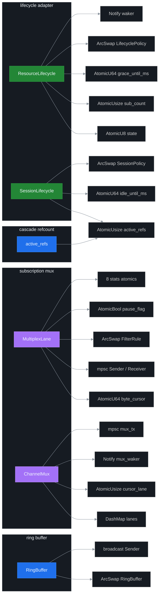
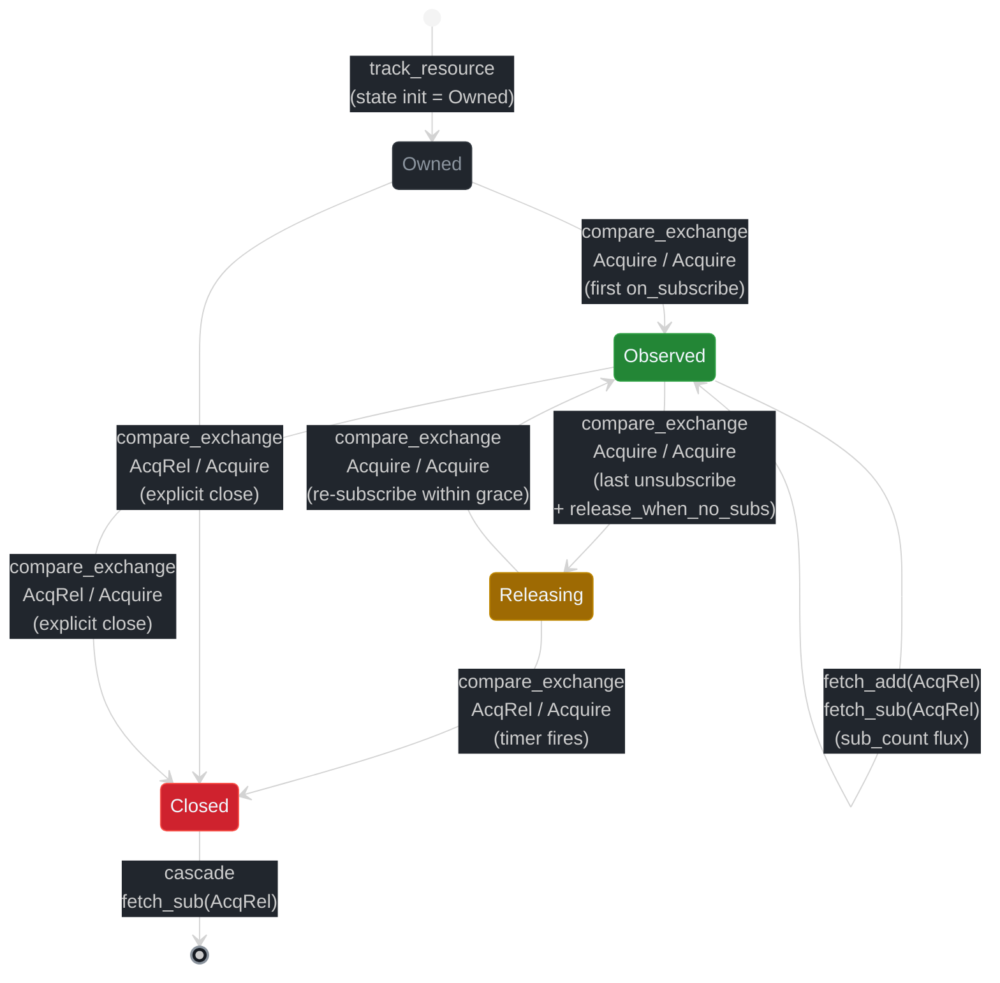

# Locks Reference (v5.0)

ssh-mcp v5 preserves the v3 / v4 **lock-free** baseline: every shared producer / consumer path uses `Arc<ArcSwap<T>>`, atomics, broadcast / mpsc channels, and `OnceCell` instead of `Mutex` / `RwLock`. v5 stacks three new categories on top — lifecycle adapter atomics ([ADR 0003](./adr/0003-lifecycle-binding.md)), subscription mux atomics ([ADR 0004](./adr/0004-channel-mux-fairness.md)), and cascade refcount atomics ([ADR 0003](./adr/0003-lifecycle-binding.md)) — all preserving the strict baseline lints (`await_holding_lock`, `mutex_atomic`, `mutex_integer`, `significant_drop_in_scrutinee`).

> **v5.0 — three new categories of lock-free state.** Phase 1 lands `ResourceLifecycle` + `SessionLifecycle` atomics ([§Lifecycle adapter](#lifecycle-adapter-invariants-phase-1)); Phase 2 lands per-`SubId` `MultiplexLane` mpsc + `ChannelMux` round-robin cursor ([§Subscription mux](#subscription-mux-invariants-phase-2)); cascade refcount sits on `SessionLifecycle.active_refs` ([§Cascade refcount](#cascade-refcount-phase-1)). All Mutex-free; all loom-verifiable.

Source of truth for patterns, the lints that enforce them, and the acquisition order for the residual `DashMap` shard locks (briefly, never across `.await`).

Cross-refs: [ARCHITECTURE.md](./ARCHITECTURE.md) (module map + threading) · [RESOURCES.md](./RESOURCES.md) (backpressure features) · ADRs [0003](./adr/0003-lifecycle-binding.md), [0004](./adr/0004-channel-mux-fairness.md), [0006](./adr/0006-backpressure-policies.md) · [MIGRATION_v3_to_v4.md](./MIGRATION_v3_to_v4.md), [MIGRATION_v4_to_v5.md](./MIGRATION_v4_to_v5.md).

## Adapter-internal carriers (post-v4.1 deep decouple, v5 additions)

H17.5a deleted the v3 monolith. v4.1 H17.6 finished the foundational decouple: the lock-free state carriers (`RunningCommand`, `RunningShell`, `RunningTransfer`) and the global `SUBSCRIPTION_REGISTRY` were relocated under the owning adapters. v5 adds three new carriers (`ResourceLifecycle`, `SessionLifecycle`, `MultiplexLane` + `ChannelMux`) under their own adapter subtrees.

| Carrier | Owner module | Consumer / surface |
|---------|---------------------|--------------------|
| `RunningCommand` | `src/adapters/ssh/internal/async_command.rs` | consumed by `src/adapters/ssh/russh_adapter.rs`, snapshot-read via `src/adapters/output_stream/russh_output.rs` |
| `RunningShell` | `src/adapters/ssh/internal/shell.rs` | consumed by `src/adapters/ssh/russh_adapter.rs` |
| `RunningTransfer` | `src/adapters/sftp/internal/transfer.rs` | consumed by `src/adapters/sftp/russh_sftp_adapter.rs` |
| `SUBSCRIPTION_REGISTRY` (global + `spawn_peer_gc` task) | `src/adapters/subscription/legacy.rs` (transitional) | v5 use cases consume `MemoryRegistry<N>` at `src/adapters/subscription/memory_registry.rs`. The legacy adapter coexists until SSH/SFTP runtime adapters are wired through the port surface end-to-end. |
| `SessionRef` (russh handle + health channel) | `src/adapters/ssh/internal/session.rs` + `src/adapters/ssh/internal/types.rs` | consumed by `src/adapters/ssh/russh_adapter.rs` |
| `ForwardHandle` (feature-gated) | `src/adapters/ssh/internal/types.rs` | consumed by the forward use case via `src/adapters/repo/dashmap/forward.rs` |
| **`ResourceLifecycle`** (v5 — Phase 1) | `src/adapters/lifecycle/refcount.rs` | consumed by every long-running use case (`open_shell`, `execute_command`, `upload_file`, `download_file`, `subscribe_resource`, `unsubscribe_resource`) via `LifecyclePolicyPort` |
| **`SessionLifecycle`** (v5 — Phase 1) | `src/adapters/lifecycle/cascade.rs` | aggregator for cascade — consulted by the session reaper before TTL eviction |
| **`MultiplexLane`** (v5 — Phase 2) | `src/adapters/subscription/subscriber_lane.rs` | one per `SubId`; consumed by the per-lane drain task and `ChannelMux` |
| **`ChannelMux`** (v5 — Phase 2) | `src/adapters/subscription/channel_mux.rs` | round-robin fan-in across all lanes; feeds the outbound writer (rmcp Peer or NDJSON formatter) |

The repository adapters (`src/adapters/repo/dashmap/{session,command,shell,transfer,forward}.rs`) and the subscription registry (`src/adapters/subscription/memory_registry.rs`) remain the port surface for use cases.

### Primitives map



## Lock-free invariants enforced

The following clippy lints are denied at the workspace level (`Cargo.toml` `[lints.clippy]`):

```toml
await_holding_lock              = "deny"
await_holding_refcell_ref       = "deny"
significant_drop_in_scrutinee   = "deny"
significant_drop_tightening     = "deny"
mutex_atomic                    = "deny"
mutex_integer                   = "deny"
```

Together they reject:

- Holding a `MutexGuard` / `RwLockReadGuard` / `RefMut` across a `.await` point.
- Constructing `Mutex<AtomicXxx>` or `Mutex<integer>` (use the atomic directly).
- Letting a `DashMap` shard guard live longer than necessary inside a scrutinee scope.

Combined with the standard `unwrap_used` / `panic` forbids, this guarantees no async path in production can deadlock on a contended sync primitive. **The v5 adapters preserve every invariant**: `ResourceLifecycle`, `SessionLifecycle`, `MultiplexLane`, and `ChannelMux` carry **zero** `Mutex` fields.

## Lifecycle adapter invariants (Phase 1)

ADR: [adr/0003-lifecycle-binding.md](./adr/0003-lifecycle-binding.md). Per-resource state lives behind `Arc<ResourceLifecycle>` at `src/adapters/lifecycle/refcount.rs`. The grace timer task lives in `src/adapters/lifecycle/grace_timer.rs`.

### Per-resource fields

| Field | Type | Memory ordering |
|---|---|---|
| `state` | `AtomicU8` (encoded `LifecycleState { Owned=0, Observed=1, Releasing=2, Closed=3 }`) | CAS via `compare_exchange(Acquire, Acquire)`; writers use `AcqRel` for `swap`; readers use `Acquire`. |
| `sub_count` | `AtomicUsize` | `fetch_add(AcqRel)` on subscribe; `fetch_sub(AcqRel)` on unsubscribe; reads use `Acquire`. |
| `grace_until_ms` | `AtomicU64` (epoch ms; 0 when not armed) | `Relaxed` reads (deadline check); `Release` writes (when arming the timer). |
| `policy` | `ArcSwap<LifecyclePolicy>` | hot-reload of `grace_ms` / `cascade_session` flag without locking readers. `load_full()` returns an `Arc` snapshot. |
| `waker` | `Arc<tokio::sync::Notify>` | `notify_waiters()` on policy change or deadline update. |
| `session_id` | `SessionId` (immutable) | parent ref for cascade (write-once at construction). |

### CAS state machine

```text
   on_subscribe (sub_count == 0 -> 1)
   ┌─────────────────────────────────┐
   │                                  │
   ▼                                  │
 Owned ───────── on_subscribe ────► Observed
   │                                  │
   │ explicit close                   │ on_unsubscribe (sub_count -> 0)
   │                                  │ AND policy.release_when_no_subs
   ▼                                  ▼
 Closed  ◄─ grace timer fires ──── Releasing  ◄─┐
                                      │          │
                                      └─ on_subscribe (cancel timer)
```

CAS edges are explicit: `compare_exchange(current_state, new_state, Acquire, Acquire)`. Invalid transitions return `LifecycleStateConflict` (a defensive `INTERNAL` class error per [ADR 0007](./adr/0007-error-taxonomy.md) — should never occur in correct code).

### CAS state-transition diagram



### Why `await_holding_lock = "deny"` still holds

The hot path takes zero `Mutex`. The grace timer task uses `tokio::time::sleep_until(deadline)` and `.await`s on the `Arc<Notify>` waker — neither is a sync lock. The `compare_exchange` calls are non-blocking. `ArcSwap::load_full()` returns a snapshot `Arc` and drops the swap-side guard before any `.await`. The lint continues to enforce that no future code introduces a sync `Mutex<LifecycleState>` shortcut.

### Loom invariants (Phase 1 — 4 new interleavings)

`tests/lockfree_invariants.rs` (commit `c01156d`):

1. **Subscribe / unsubscribe race** — concurrent `on_subscribe` + `on_unsubscribe` never observe `sub_count` going negative; the state machine settles deterministically.
2. **Grace fire vs re-subscribe** — a subscribe arriving *during* `Releasing -> Closed` either cancels the timer (success path) or returns `RESOURCE_GONE` (terminal path); never an invalid intermediate state.
3. **Cascade double-disconnect** — concurrent close + cascade decrement never drives `active_refs` past zero; protected by `SessionRefcountUnderflow` defensive error.
4. **Cursor monotonicity** — under contention, no observed cursor decreases. Tested across the full lifecycle CAS chain.

## Subscription mux invariants (Phase 2)

ADR: [adr/0004-channel-mux-fairness.md](./adr/0004-channel-mux-fairness.md). Per-lane state lives behind `Arc<MultiplexLane>` at `src/adapters/subscription/subscriber_lane.rs`. The drain orchestrator lives at `src/adapters/subscription/channel_mux.rs`.

### Per-lane fields

| Field | Type | Why this primitive |
|---|---|---|
| `byte_cursor` | `Arc<AtomicU64>` | per-`SubId` cursor; independent from peer cursor; `fetch_max` on advance preserves monotonicity. |
| `tx` | `tokio::sync::mpsc::Sender<SubscriptionMessage>` | bounded, single-producer (debouncer), single-consumer (lane task). Capacity = `SSH_LANE_BUFFER` (default 1024). |
| `policy` | `LagPolicy` (enum, copy-Cell) | per-lane backpressure choice. |
| `filter` | `ArcSwap<FilterRule>` | hot-reloadable regex / level. `load_full()` returns a snapshot before any `.await`. |
| `lifecycle` | `Arc<ResourceLifecycle>` | back-link to the owning resource (Phase 1). |
| `stats` | `SubscriberStats` (8 atomics) | `events_sent: AtomicU64`, `bytes_sent: AtomicU64`, `lagged_drops: AtomicU64`, `lagged_recoveries: AtomicU64`, `queue_depth: AtomicUsize`, `queue_high_watermark: AtomicUsize`, `block_total_ms: AtomicU64`. All `.load(Relaxed)` reads; `.fetch_add(Relaxed)` writes. `fetch_max(Relaxed)` for high watermark. |
| `pause_flag` | `AtomicBool` | `Acquire` reads on the drain side; `Release` writes from `ssh_sub_pause` / `ssh_sub_resume`. |

### ChannelMux fairness

The `ChannelMux` adapter owns a `DashMap<SubId, MultiplexLane>` plus the round-robin cursor:

| Field | Type | Memory ordering |
|---|---|---|
| `lanes` | `DashMap<SubId, Arc<MultiplexLane>>` | shard-locked briefly during `entry` / `remove`; never held across `.await`. |
| `cursor_lane` | `AtomicUsize` | `Acquire` load to start the round-robin; `Release` store after a successful drain. Wraps via `(idx + 1) % lanes.len()`. |
| `mux_waker` | `Arc<tokio::sync::Notify>` | `notify_one()` on producer enqueue; drain task `.await`s when no lane has work. |
| `mux_tx` | `mpsc::Sender<OutboundEvent>` | global outbound channel feeding the rmcp peer or NDJSON formatter. Capacity = `SSH_MUX_BUFFER` (default 8192). |

Drain loop (no spinning, no Mutex):

1. Snapshot active lanes via `dashmap::iter()` (per-shard guards held briefly).
2. If empty, `mux_waker.notified().await`.
3. From `cursor_lane.load(Acquire)`, iterate lanes in order; on each `try_recv`, first non-empty wins.
4. Forward via `mux_tx.send(...).await` (yields back to dispatcher when full — see [ADR 0006](./adr/0006-backpressure-policies.md) §Mux mpsc handling).
5. `cursor_lane.store((idx + 1) % len, Release)`.

Fairness invariant: between two adjacent backlogged lanes A and B, `cursor_lane` advances after every successful drain, so the mux drains them in alternation. A lane producing 10x faster will not starve a slower one.

### Loom invariants (Phase 2 — 4 new interleavings, commit `c48a0ba`)

1. **Mux fairness** — under simultaneous backpressure on two lanes, the round-robin cursor visits each lane within bounded steps.
2. **Lane mpsc full + drop_oldest** — concurrent `try_send` (drop_oldest) + drain never violates monotonic seq numbers; the dropped event is reflected in `lagged_drops`.
3. **Concurrent lane add/remove during drain** — a `lane_close` racing with `try_recv` never produces a stale read or a use-after-free; DashMap shard guards are scoped tightly.
4. **Cursor advance under contention** — `byte_cursor.fetch_max` under concurrent advances always settles to the supremum.

### Why `await_holding_lock = "deny"` still holds

The drain loop never holds a DashMap shard guard across `.await`. The pause/resume path does a `pause_flag.swap(true, AcqRel)` and yields without entering any sync section. The filter pipeline reads the filter via `ArcSwap::load_full()` and drops the swap-side guard before applying the regex (which can cost CPU but has no `.await`). All `mpsc::Sender::send().await` and `mpsc::Receiver::recv().await` calls are async-native — they yield to the runtime, never block a thread.

## Cascade refcount (Phase 1)

ADR: [adr/0003-lifecycle-binding.md](./adr/0003-lifecycle-binding.md). The session-level aggregator lives at `src/adapters/lifecycle/cascade.rs`.

### `SessionLifecycle` fields

| Field | Type | Memory ordering |
|---|---|---|
| `active_refs` | `AtomicUsize` | `fetch_add(AcqRel)` on resource open (shells, commands, transfers, manual `pin`); `fetch_sub(AcqRel)` on resource close. Underflow defensively trapped via `compare_exchange` (returns `SESSION_REFCOUNT_UNDERFLOW`). |
| `idle_until_ms` | `AtomicU64` | `Release` write when `active_refs` drops to 0; `Relaxed` read by the reaper. |
| `state` | `AtomicU8` (`Active=0, Idle=1, Releasing=2, Closed=3`) | CAS edges: `Active -> Idle` on `active_refs == 0`, `Idle -> Releasing` on `idle_grace_ms` elapsed, `Releasing -> Closed` after disconnect. |
| `policy` | `ArcSwap<SessionPolicy { persistent: bool, idle_grace_ms: u32 }>` | persistence flag honours the `ssh_connect persistent` argument. |

### `release_resource` chokepoint

A single function in `src/adapters/lifecycle/cascade.rs` enforces the cascade order:

1. CAS resource `state: Releasing -> Closed` (rejects if already Closed).
2. Drop the owner handle (delegates to `DisconnectShellUseCase` / `CancelCommandUseCase` / SFTP cancel / forward stop).
3. `session.active_refs.fetch_sub(1, AcqRel)`.
4. If `active_refs == 0` AND `!session.policy.persistent` AND state was not already `Releasing`, arm the session-level grace timer (`tokio::time::sleep_until` + `Notify` waker — same shape as the resource grace timer).

### Reaper supersedes TTL

The existing `SessionReaper` task consults `active_refs > 0` before honouring the inactivity TTL:

- `active_refs > 0` -> never reap (correct: refcount supersedes TTL).
- `active_refs == 0` AND `now > idle_until_ms + idle_grace_ms` -> proceed with disconnect.
- `active_refs == 0` AND `now <= idle_until_ms + idle_grace_ms` -> defer; recheck on next reaper tick.

### Why no `Mutex` is needed

`active_refs` is `AtomicUsize` — never `Mutex<usize>` (`mutex_integer = "deny"`). `idle_until_ms` is `AtomicU64` — same. The `state` CAS chain uses `compare_exchange` for explicit edges. The grace timer is a `tokio::task::JoinHandle` plus a `Notify`, never a `Mutex<bool>` flag. The reaper takes a snapshot of `active_refs.load(Acquire)` and `idle_until_ms.load(Relaxed)` without any guard.

## Patterns by structure

| Structure | Pattern | Notes |
|-----------|---------|-------|
| `RunningShell.history` | `Arc<ArcSwap<RingBuffer>>` + `ArcSwap::rcu` | Reader RCU loop ensures truncation composes with concurrent appends. |
| `RunningShell.output_tx` | `broadcast::Sender<Bytes>` | Lagged auto-recovery via snapshot from `history`. |
| `RunningShell.input_tx` | `mpsc::Sender<WriteRequest>` | Single dedicated writer task owns `ChannelWriter` — no `Mutex`. Capacity = 64 frames. |
| `RunningShell.last_activity_ms` | `Arc<AtomicU64>` (epoch ms) | Replaces the v2 `Mutex<Instant>`. |
| `RunningShell.data_notify` | `Arc<Notify>` | Wakes intra-server long-poll readers. |
| `RunningShell.max_buffer_size` | `Arc<AtomicU64>` | Tunable at runtime without touching the reader task. |
| `RunningCommand.output_history` | `Arc<ArcSwap<OutputBuffer>>` | Same RCU pattern as shell. |
| `RunningCommand.output_tx` | `broadcast::Sender<OutputChunk>` | `OutputChunk = Stdout { seq, data } | Stderr { seq, data } | Closed { seq, exit_code }`. |
| `RunningCommand.exit_code` / `error` | `Arc<OnceCell<…>>` | Write-once. |
| `RunningCommand.timed_out` / `output_read` | `Arc<AtomicBool>` | |
| `RunningTransfer.bytes_transferred` / `total_bytes` | `Arc<AtomicU64>` | Live counters; v4.8.1 wired the progress watcher to mirror them into the repo. |
| `RunningTransfer.error` | `Arc<OnceCell<String>>` | Write-once. |
| `RunningTransfer.progress_tx` | `broadcast::Sender<ProgressEvent>` | `Tick { seq, bytes_transferred, total_bytes } | Completed | Failed | Cancelled`. |
| `RunningTransfer.data_notify` | `Arc<Notify>` | Wakes intra-server long-poll progress readers. |
| `SessionRef.handle` | `Arc<russh::client::Handle<SshClientHandler>>` | Cheap clone. |
| `SessionRef.channel_permits` | `Arc<Semaphore>` (`CHANNEL_CONCURRENCY_PER_SESSION = 1`) | Serialises russh channel openings per session. |
| `SessionRef.health_tx` | `broadcast::Sender<HealthEvent>` | |
| `ForwardHandle.events_tx` (feature-gated) | `broadcast::Sender<ForwardEvent>` | |
| `DashMap*Repo` | `Arc<DashMap<Id, Entity>>` + secondary indexes | Lock-free externally; shard locks held briefly. |
| `MemoryRegistry.subscribers` | `DashMap<uri, Vec<SubscriberHandle>>` | Snapshot-clone-then-drop pattern before any `.await`. |
| `MemoryRegistry.peer_progress` (legacy) / `(SubId, Uri) cursor` (v5) | `DashMap<…, Arc<PeerProgress>>` | v5 adds `(SubId, Uri)` keys alongside the legacy `(PeerId, Uri)` for backwards compat (commit `4ccbca3`). |
| `MemoryRegistry.sequence_counters` | `DashMap<(kind, id), Arc<AtomicU64>>` | Per-resource monotonic seq. |
| `MemoryRegistry.wakers` | `DashMap<(kind, id), Arc<Notify>>` | Wakes the per-resource debouncer task. |
| `MemoryRegistry.debounce_tasks` | `DashMap<(kind, id), JoinHandle<()>>` | One task per active resource; aborted when last subscriber leaves. |
| **`ResourceLifecycle`** (v5) | `AtomicU8 + AtomicUsize + AtomicU64 + ArcSwap + Notify` | See [§Lifecycle adapter](#lifecycle-adapter-invariants-phase-1). |
| **`SessionLifecycle`** (v5) | `AtomicUsize + AtomicU64 + AtomicU8 + ArcSwap` | See [§Cascade refcount](#cascade-refcount-phase-1). |
| **`MultiplexLane`** (v5) | `AtomicU64 cursor + mpsc + ArcSwap filter + 8 stats atomics + AtomicBool pause` | See [§Subscription mux](#subscription-mux-invariants-phase-2). |
| **`ChannelMux`** (v5) | `DashMap + AtomicUsize cursor + Notify waker + mpsc` | See [§Subscription mux](#subscription-mux-invariants-phase-2). |
| `PeerTable` | `Arc<DashMap<PeerId, Arc<rmcp::Peer<RoleServer>>>>` | `RmcpPeerHandle` registers on construction, removes on `Drop`. |

## Acquisition order (residual DashMap shard locks)

DashMap acquires per-shard locks under the hood. They are not awaited across, but they are held briefly during `entry`, `get_mut`, `insert`, `remove`. To stay deadlock-free, any code that touches multiple maps in a single critical section must acquire them in the order below.

```
 1. adapters::repo::dashmap::session   shard
 2. adapters::repo::dashmap::command   shard
 3. adapters::repo::dashmap::shell     shard
 4. adapters::repo::dashmap::transfer  shard
 5. adapters::repo::dashmap::forward   shard (feature-gated)
 6. adapters::subscription::memory_registry::subscribers       shard
 7. adapters::subscription::memory_registry::peer_progress     shard
 8. adapters::subscription::memory_registry::sub_progress      shard (v5 — (SubId, Uri) cursor)
 9. adapters::subscription::memory_registry::sequence_counters shard
10. adapters::subscription::memory_registry::wakers            shard
11. adapters::subscription::memory_registry::debounce_tasks    shard
12. adapters::subscription::channel_mux::lanes                 shard (v5)
13. adapters::lifecycle::refcount::resources                   shard (v5)
14. adapters::lifecycle::cascade::sessions                     shard (v5)
15. adapters::notifier::rmcp_peer::PeerTable                   shard
```

The legacy global `adapters::subscription::legacy::SUBSCRIPTION_REGISTRY` follows the same relative order — its shard layout is identical to `MemoryRegistry`'s, and the SSH/SFTP runtime adapters never hold both registries' shards simultaneously.

Rules:

- **NEVER hold a higher-numbered shard while acquiring a lower one** in the same task.
- **NEVER `.await` while a `DashMap` ref or guard is alive.** The `await_holding_lock` lint enforces this for `Mutex`/`RwLock` but not `DashMap`; the `significant_drop_in_scrutinee` lint catches the common pattern of `for entry in &map { ... .await ... }`. The codebase preventively snapshots-and-drops.
- **Producers `poke` then drop the waker guard** before doing anything else. The debouncer task then runs entirely outside the registry's locks.
- **The mux drain task** snapshots `lanes` (DashMap iter over a shard) and drops the iter before any `.await` on `mpsc::Sender::send`.
- **Lifecycle CAS** never races a DashMap shard: `ResourceLifecycle` and `SessionLifecycle` are owned by the lifecycle adapter and consumed via the port surface; the DashMap of `(ResourceKey -> Arc<ResourceLifecycle>)` is iterated only by the leak-risk watcher background task ([ADR 0005](./adr/0005-llm-ux-priorities.md)), which uses the snapshot-then-drop pattern.

The current code base touches at most three shards in one critical section (Phase 2 subscribe writes to `subscribers`, `sub_progress`, and `lanes`); the order above leaves headroom.

## Channel sizing and recovery

| Channel | Capacity env | Default | Recovery on `Lagged` / full |
|---------|--------------|---------|----------------------|
| `RunningShell.output_tx` | `SSH_SHELL_BROADCAST_CAP` | 1024 | Subscriber re-reads `history` snapshot via `ArcSwap::load_full`. |
| `RunningCommand.output_tx` | `SSH_COMMAND_BROADCAST_CAP` | 1024 | Same — read from `output_history`. |
| `RunningTransfer.progress_tx` | `SSH_TRANSFER_BROADCAST_CAP` | 256 | Re-read atomic counters (`bytes_transferred`, `total_bytes`) and `status_rx`. |
| `SessionRef.health_tx` | `SSH_SESSION_BROADCAST_CAP` | 256 | Re-read `SessionInfo` via the session repository. |
| `ForwardHandle.events_tx` | `SSH_FORWARD_BROADCAST_CAP` | 256 | Forward storage is not persisted yet — broadcast is best-effort. |
| `RunningShell.input_tx` (mpsc) | hard-coded | 64 | Backpressure on the producer; no Lagged path. |
| **`MultiplexLane.tx`** (v5 mpsc, per `SubId`) | `SSH_LANE_BUFFER` | 1024 | Per-lane `LagPolicy`: `BlockSlow` / `DropOldest` / `DropNewest` / `Snapshot` (default — drop backlog + ring-buffer rebuild). [ADR 0006](./adr/0006-backpressure-policies.md). |
| **`ChannelMux.mux_tx`** (v5 mpsc, global outbound) | `SSH_MUX_BUFFER` | 8192 | `try_send` failure -> lane producer follows its lag policy. |

### Backpressure fronteira flow

Six fronteiras between the russh receiver and the host stdout / socket. Each carries a distinct lag-recovery story.

```mermaid
%%{init: {'theme':'dark','themeVariables':{'primaryColor':'#1f6feb','primaryTextColor':'#f0f6fc','primaryBorderColor':'#388bfd','lineColor':'#8b949e','secondaryColor':'#161b22','tertiaryColor':'#21262d','background':'#0d1117','mainBkg':'#161b22','secondBkg':'#21262d','tertiaryBkg':'#0d1117','nodeTextColor':'#f0f6fc','edgeLabelBackground':'#21262d','clusterBkg':'#161b22','clusterBorder':'#30363d','titleColor':'#f0f6fc'}}}%%
flowchart LR
    F0["russh recv<br/>tcp / pty"]
    F1["F1<br/>broadcast Sender<br/>SSH_SHELL_BROADCAST_CAP=1024<br/>lag = snapshot via ArcSwap"]
    F2["F2<br/>per-resource debouncer<br/>50 ms / 1 s flush"]
    F3["F3<br/>per-(SubId, Uri) lane<br/>SSH_LANE_BUFFER=1024<br/>LagPolicy: BlockSlow / DropOldest /<br/>DropNewest / Snapshot"]
    F4["F4<br/>ChannelMux mux_tx<br/>SSH_MUX_BUFFER=8192<br/>round-robin try_recv"]
    F5["F5<br/>rmcp Peer / NDJSON writer<br/>tokio io"]
    F6["F6<br/>stdout / socket"]

    F0 --> F1
    F1 --> F2
    F2 --> F3
    F3 --> F4
    F4 --> F5
    F5 --> F6

    style F0 fill:#1f6feb,color:#f0f6fc,stroke:#388bfd
    style F1 fill:#238636,color:#f0f6fc,stroke:#2ea043
    style F2 fill:#1f6feb,color:#f0f6fc,stroke:#388bfd
    style F3 fill:#a371f7,color:#f0f6fc,stroke:#bc8cff
    style F4 fill:#238636,color:#f0f6fc,stroke:#2ea043
    style F5 fill:#1f6feb,color:#f0f6fc,stroke:#388bfd
    style F6 fill:#1f6feb,color:#f0f6fc,stroke:#388bfd
```



## Loom invariants

`tests/lockfree_invariants.rs` is gated behind `#[cfg(loom)]`. To run:

```bash
RUSTFLAGS="--cfg loom" cargo test --test lockfree_invariants --release
```

The tests permute concurrent interleavings on:

- **v4 baseline (8 invariants)**: shell `ArcSwap<RingBuffer>` rcu loop, command `ArcSwap<OutputBuffer>` snapshot path, registry's `peer_progress` cursor advance, slow-subscriber recovery via snapshot, `OnceCell` write-once, `fetch_max` cursor under contention, `RingBuffer` head-truncation composition, broadcast lag recovery.
- **Phase 1 (4 new)**: subscribe / unsubscribe race on `ResourceLifecycle`, grace fire vs re-subscribe, cascade double-disconnect on `SessionLifecycle.active_refs`, cursor monotonicity under lifecycle CAS chain.
- **Phase 2 (4 new)**: `ChannelMux` round-robin fairness, lane mpsc full + drop_oldest, concurrent lane add / remove during drain, `byte_cursor.fetch_max` under contention.

Total: 16 invariants. When loom is not enabled, the binary compiles to an empty test set. Full loom mode is currently blocked by upstream tokio/loom incompatibility in russh + axum.

## Backpressure references

- Sequence numbers, keepalive, cumulative chunks: [RESOURCES.md](./RESOURCES.md).
- Per-lane LagPolicy semantics: [adr/0006-backpressure-policies.md](./adr/0006-backpressure-policies.md).
- BlockSlow timeout safety (`SSH_BP_BLOCK_TIMEOUT_MS` default 5000): [adr/0006-backpressure-policies.md](./adr/0006-backpressure-policies.md) §BlockSlow timeout safety.
- Truncation compensation across all peer cursors on a URI: `MemoryRegistry::compensate_truncation`.

## When you must add a new lock-free state

Decision tree:

1. **Single writer, many readers, immutable snapshots?** -> `Arc<ArcSwap<T>>` + `rcu` for compose-with-others writers.
2. **Write-once terminal value?** -> `Arc<OnceCell<T>>`.
3. **Counter or boolean flag?** -> `AtomicU64` / `AtomicBool` (never `Mutex<u64>` / `Mutex<bool>` — `mutex_integer` / `mutex_atomic` will reject it).
4. **Live event fan-out, single producer?** -> `tokio::sync::broadcast::Sender<Event>` with a per-resource sequence number.
5. **Live event fan-out, per-subscriber isolation?** -> `tokio::sync::mpsc` per `SubId` plus a `ChannelMux` round-robin drainer (Phase 2 pattern).
6. **Wake intra-server pollers?** -> `tokio::sync::Notify`.
7. **Single-consumer queue?** -> `tokio::sync::mpsc` with a dedicated owner task; never wrap a writer in a `Mutex`.
8. **Map-keyed registry?** -> `dashmap::DashMap`, with a `snapshot then drop guard then iterate / await` pattern.
9. **State machine across atomic edges?** -> `AtomicU8` encoding the enum + `compare_exchange(Acquire, Acquire)` for each transition; reject invalid edges defensively (Phase 1 pattern).

If none of the above fits, write a design note in your PR description before reaching for `Mutex` / `RwLock`. Adding a sync lock to an async path is a regression in this code base.
