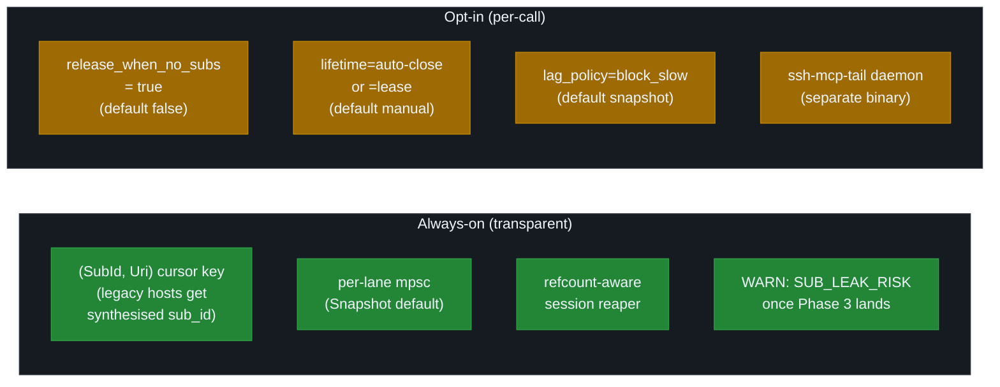

# Migration Guide

Single source for every migration path through ssh-mcp's history. Three self-contained sections cover the v2 → v3 client migration, the v3 → v4 contributor migration (including the v4.1 deep-decouple addendum and the v4.7 → v4.8 / v4.8 → v4.8.1 addenda), and the v4 → v5 host migration.


| Section | Audience | Scope |
|---|---|---|
| [v2 → v3](#v2--v3) | MCP client / host implementors | rmcp 1.6 transport, 18 tools, 5 `resources/*` schemes |
| [v3 → v4](#v3--v4) | Codebase contributors | Hexagonal restructuring, `src/mcp/` deletion, AFIT ports, v4.1 deep decouple, v4.7→v4.8 addendum |
| [v4 → v5](#v4--v5) | MCP host operators / contributors / downstream automations | Subscribe-first, lifecycle binding, channel mux, daemon binary |

The 8 ADRs at [adr/](./adr/) are the canonical source for every design decision. Read in order: [0001 rmcp](./adr/0001-migrate-to-rmcp.md), [0002 hexagonal](./adr/0002-adopt-hexagonal-architecture.md), [0003 lifecycle](./adr/0003-lifecycle-binding.md), [0004 mux+sub_id](./adr/0004-channel-mux-fairness.md), [0005 LLM UX](./adr/0005-llm-ux-priorities.md), [0006 backpressure](./adr/0006-backpressure-policies.md), [0007 errors](./adr/0007-error-taxonomy.md), [0008 daemon](./adr/0008-ndjson-daemon-protocol.md).

---

## v2 → v3

For **client / host implementors** upgrading from `ssh-mcp` 2.0.x to 3.0.0. If you only run the server binary you do not need to change anything except your transport library version. Design rationale: [ADR 0001 — Migrate to rmcp](./adr/0001-migrate-to-rmcp.md).

### Breaking changes

1. **Transport library changed from `poem-mcpserver` 0.3 to `rmcp` 1.6** (the official Anthropic Rust SDK). HTTP transport now follows the **Streamable HTTP MCP** wire format with an SSE channel for server-initiated notifications. Default endpoint is `/` (configurable via `MCP_HTTP_PATH`).
2. **The stdio binary's custom JSON-RPC quirks are gone.** The v2 stdio loop carried a hand-rolled `notifications/cancelled` parser that swallowed responses for cancelled IDs (`camelCase` and `snake_case` both). rmcp handles cancellation natively, so the wire shape is now purely spec-compliant.
3. **Response markdown is now block-only.** v2 mixed inline (`KEY: V | KEY: V`) and block forms depending on field count; v3 always emits one `KEY: value` per line. Parsers that only support the block form keep working; parsers that special-cased the inline form must be updated.
4. **`ReusePolicy` and `CommandStatus` are typed enums** in the JSON schema. v2 accepted `Option<String>` and silently fell back on typos; v3 returns a schema validation error.
5. **Two new tools were added.** `ssh_shell_send_key` and `ssh_shell_wait_for`. The total is 18 (was 16).
6. **Five `resources/*` schemes are now exposed.** `shell://`, `command://`, `transfer://`, `session://`, `forward://`. Subscribing yields `notifications/resources/updated` per debounce window.

### Compatibility matrix

| Feature                          | v2.0                                           | v3.0                                                                  |
| -------------------------------- | ---------------------------------------------- | --------------------------------------------------------------------- |
| Server SDK                       | `poem-mcpserver` 0.3                           | `rmcp` 1.6                                                            |
| HTTP transport                   | Poem streamable HTTP                           | rmcp `StreamableHttpService` (axum-hosted) + SSE notification channel |
| HTTP path                        | `/`                                            | `/` (configurable via `MCP_HTTP_PATH`)                                |
| `Mcp-Session-Id` header          | not used                                       | tracked by rmcp's `LocalSessionManager`                               |
| Tool count                       | 16                                             | **18** (`ssh_shell_send_key`, `ssh_shell_wait_for` added)             |
| `resources/*`                    | not implemented                                | 5 schemes (`shell`, `command`, `transfer`, `session`, `forward`)      |
| Server-initiated notifications   | none                                           | `notifications/resources/updated` (deferred: `list_changed`); cancellation handled natively by rmcp |
| Response format                  | mixed inline / block                           | block-only                                                            |
| `ssh_connect.reuse`              | `Option<String>`                               | `ReusePolicy` enum (`suggest \| auto \| force_new`)                   |
| `ssh_list_commands.status`       | `Option<String>`                               | `CommandStatus` enum (`running \| completed \| cancelled \| failed`)  |
| Stdio cancel-id parser           | custom (`camelCase` + `snake_case`)            | removed — rmcp native                                                 |

### Code changes for clients

#### Connect

v2 (loose schema):

```json
{
  "name": "ssh_connect",
  "arguments": {
    "address": "host:22",
    "username": "root",
    "reuse": "auto"
  }
}
```

v3 (typed schema — same wire JSON, schema-validated):

```json
{
  "name": "ssh_connect",
  "arguments": {
    "address": "host:22",
    "username": "root",
    "reuse": "auto"
  }
}
```

If you previously sent `"reuse": "Auto"` or `"reuse": "AUTO"`, rmcp will now reject the call with an `INVALID_PARAMS` JSON-RPC error. Use the `snake_case` literal `"auto"`.

#### Execute and poll

Wire format unchanged; the response markdown is now strictly block style:

```
SSH_GET_COMMAND_OUTPUT: COMPLETED
COMMAND_ID: 7d31...
EXIT: 0
--- stdout [a3f2b1d7] ---
foo bar
--- stderr [a3f2b1d7] (empty) ---
```

#### Interactive shell — old (poll loop)

```
ssh_shell_open
loop {
  ssh_shell_read (clear=true)
  ssh_shell_write
}
ssh_shell_close
```

#### Interactive shell — new (subscribe-first)

```
ssh_shell_open                            -> SHELL_ID
resources/subscribe shell://SHELL_ID/output

# parallel:
ssh_shell_write / ssh_shell_send_key

# notifications/resources/updated arrives ->
resources/read shell://SHELL_ID/output?cursor=auto

ssh_shell_close
```

The polling path still works (`ssh_shell_read` is a documented FALLBACK for hosts that cannot consume notifications), but you give up roughly half the tokens you would otherwise spend.

### ReusePolicy enum

v2 used `Option<String>` accepting `"suggest" | "auto" | "force_new"`. v3 promotes this to a tagged enum rendered into the JSON schema:

```rust
#[derive(Deserialize, JsonSchema)]
#[serde(rename_all = "snake_case")]
pub enum ReusePolicy {
    Suggest,    // default
    Auto,
    ForceNew,
}
```

Wire format for valid values is unchanged. Typos now produce a schema validation error.

### CommandStatus enum

Same treatment for `ssh_list_commands.status`:

```rust
#[derive(Deserialize, JsonSchema)]
#[serde(rename_all = "snake_case")]
pub enum CommandStatus {
    Running,
    Completed,
    Cancelled,
    Failed,
}
```

### Recommended upgrade path

1. **Update your MCP host** to a release that supports the Streamable HTTP MCP transport (or compatible stdio). Anthropic Claude Desktop 0.7+, MCP Inspector 0.4+, and any rmcp-based host work out of the box.
2. **Switch tool argument deserialization** to typed enums for `ReusePolicy` and `CommandStatus` if your client validates schemas before sending.
3. **Subscribe to `resources/*`** for realtime UX wins. On long-running shells the token spend drops by roughly 50% versus the v2 polling loop because deltas are pulled with `?cursor=auto` instead of full snapshots.
4. **Drop your custom cancel-id handling** if you previously worked around the stdio quirks. rmcp follows the spec.

### Server-side env var changes

See [CONFIGURATION.md](./CONFIGURATION.md) for the full list. Highlights:

| New in v3                          | Default | Purpose                                                                          |
| ---------------------------------- | ------- | -------------------------------------------------------------------------------- |
| `SSH_NOTIFY_DEBOUNCE_MS`           | 200     | Debounce window for `notifications/resources/updated`.                           |
| `SSH_NOTIFY_FORCE_FLUSH_MS`        | 1000    | Maximum gap between notifications under continuous activity.                     |
| `SSH_NOTIFY_KEEPALIVE_S`           | 30      | Idle keepalive interval per resource.                                            |
| `SSH_MCP_PEER_GC_INTERVAL_S`       | 30      | Period of the peer-GC scan (drops subscriptions for closed transports).          |
| `SSH_SHELL_BROADCAST_CAP`          | 1024    | Capacity of the shell `output_tx` broadcast channel.                             |
| `SSH_COMMAND_BROADCAST_CAP`        | 1024    | Capacity of the command `output_tx` broadcast channel.                           |
| `SSH_TRANSFER_BROADCAST_CAP`       | 256     | Capacity of the transfer `progress_tx` broadcast channel.                        |
| `SSH_SESSION_BROADCAST_CAP`        | 256     | Capacity of the session `health_tx` broadcast channel.                           |
| `SSH_FORWARD_BROADCAST_CAP`        | 256     | Capacity of the forward `events_tx` broadcast channel.                           |
| `MCP_HTTP_PATH`                    | `/`     | HTTP route prefix for the rmcp `StreamableHttpService`.                          |

### Removed env vars

None. All v2 knobs continue to work with the same semantics.

### Wire-format gotchas

- `Mcp-Session-Id`: sent by the rmcp HTTP transport as a session correlation header. Hosts that do not understand it can ignore it; hosts that drop unknown headers will still work because the server falls back to the SSE channel for state.
- `notifications/resources/updated`: payload is `{ "uri": "<uri>" }`. There is no diff in the notification — the host must call `resources/read?cursor=auto` to get the bytes.
- `notifications/resources/list_changed`: capability is advertised but not currently emitted. Treat as forward-compatible.

---

## v3 → v4

For **codebase contributors** moving from v3.0.x to the v4.x hexagonal layout (current: v4.1.0). The **public MCP API is stable** across the v4 line — every external client / host / LLM continues to work without any change. v4 is an internal restructuring, not a wire-format break.

If you only consume the MCP server (HTTP or stdio), stop here — see [API.md](./API.md) for the unchanged tool catalogue.

> **v4.1 update.** The H17.6 deep decouple shipped: the foundational `src/mcp/` tree is gone, the `async-trait` direct dependency is dropped, and every former `crate::mcp::*` reference now lives at `crate::adapters::{ssh,sftp,config,subscription}::internal::*` (or `adapters::subscription::legacy` for the transitional global registry). See the [v4.1 deep decouple addendum](#v41-deep-decouple-addendum) below.

Cross references: [ARCHITECTURE.md](./ARCHITECTURE.md) (full v4 hexagonal layout), [DEVELOPMENT.md → Lock-free invariants](./DEVELOPMENT.md#lock-free-invariants), [adr/0002-adopt-hexagonal-architecture.md](./adr/0002-adopt-hexagonal-architecture.md) (design rationale).

### What stayed identical (zero client work)

| Surface | v3 → v4 status |
|---------|----------------|
| MCP tool count | **18** (same) |
| MCP tool names + signatures | identical |
| MCP tool response markdown shape | identical (block-only, 8-hex nonce delimiters, `KEY: value` per line) |
| 5 `resources/*` schemes | identical URIs + `_meta` envelope + cursor semantics |
| `notifications/resources/updated` | identical (per debounce window) |
| `notifications/cancelled` | identical (rmcp 1.6 native) |
| Capability handshake (`get_info()`) | identical |
| 25+ env vars (`SSH_*`, `MCP_*`, `RUST_LOG`) | identical names, defaults, floors, caps |
| HTTP transport bind / path defaults (`0.0.0.0:8000`, `/`) | identical |
| Stdio transport behaviour | identical |
| Strict Clippy lint baseline (forbid / deny + lock-free invariants) | identical (every v3 lint kept) |
| Cargo features (`port_forward` default-on) | identical |

In short: a v3 host pointed at a v4 server sees no observable difference. Even error markdown bodies and the 8-hex nonce randomisation are byte-identical.

### What moved (file-path table)

The v3.0.0 codebase shipped under `src/mcp/` only. v4.0.0 introduces six top-level layers under `src/`:

```
src/
  domain/         # pure entities, value objects, errors, live event variants
  ports/          # trait skeletons (sync + async via trait-variant)
  application/    # use cases (one struct + DTO per business operation)
  adapters/       # concrete implementations of every port
  infra/          # inbound MCP transport (#[tool_router], ServerHandler, render, args, helpers)
  composition/    # root wiring (concrete adapter pinning + binary entry points)
  bin/            # ssh-mcp-stdio thin shell
  main.rs         # ssh-mcp HTTP thin shell
  lib.rs
```

#### Tool implementations

| v3 path | v4 path |
|---------|---------|
| `src/mcp/tools/connection.rs` | application: `src/application/{connect_session,disconnect_session,list_sessions,disconnect_agent}.rs` ; render: `src/infra/mcp/{args,render}/connection.rs` ; rmcp wiring: `src/infra/mcp/tool_router.rs` |
| `src/mcp/tools/execute.rs` | application: `src/application/{execute_command,get_command_output,list_commands,cancel_command}.rs` ; render: `src/infra/mcp/{args,render}/execute.rs` |
| `src/mcp/tools/shell.rs` | application: `src/application/{open_shell,write_shell,send_key,read_shell,wait_for_pattern,close_shell}.rs` ; render: `src/infra/mcp/{args,render}/shell.rs` |
| `src/mcp/tools/sftp.rs` | application: `src/application/{upload_file,download_file,get_transfer_progress}.rs` ; render: `src/infra/mcp/{args,render}/sftp.rs` |
| `src/mcp/tools/forward.rs` (feature `port_forward`) | application: `src/application/forward_port.rs` ; render: `src/infra/mcp/{args,render}/forward.rs` |
| `src/mcp/tools/legacy_helpers.rs` | deleted in H17.5a; helpers now under `src/infra/mcp/helpers/{error,nonce,output}.rs` |

#### Storage layer

| v3 path | v4 path |
|---------|---------|
| `src/mcp/storage/{traits,session,command,shell,transfer,forward}.rs` + globals | ports: `src/ports/{session_repo,command_repo,shell_repo,transfer_repo,forward_repo}.rs` ; adapters: `src/adapters/repo/dashmap/{session,command,shell,transfer,forward}.rs` (no globals — wired by `composition::prod`) |

#### MCP server + resources

| v3 path | v4 path |
|---------|---------|
| `src/mcp/server.rs` (`McpSshServer` + `#[tool_router]`) | `src/infra/mcp/server.rs` (`McpSshServer<UC>` generic) + `src/infra/mcp/tool_router.rs` (the 18 `#[tool]` entry points) + `src/infra/mcp/resource_handlers.rs` (resources/list, read, subscribe, unsubscribe) |
| `src/mcp/resources.rs` (URI parser + reader handlers) | application: `src/application/{list_resources,read_resource,subscribe_resource,unsubscribe_resource}.rs` ; rmcp wiring: `src/infra/mcp/resource_handlers.rs` |
| `src/mcp/message/{helpers,builder}.rs` | helpers: `src/infra/mcp/helpers/{error,nonce,output}.rs` ; builders: `src/infra/mcp/render/{connection,execute,shell,sftp,forward}.rs` |
| `src/mcp/schema.rs` | inlined into per-tool args structs under `src/infra/mcp/args/*.rs` |
| `src/mcp/keys.rs` | `src/domain/keys.rs` (domain layer owns the semantic keystroke encoder) |

#### Authentication

| v3 path | v4 path |
|---------|---------|
| `src/mcp/auth/{traits,password,key,agent,chain}.rs` (uses `#[async_trait]`) | port: `src/ports/auth_strategy.rs` ; adapters: `src/adapters/auth/{password,key,agent,chain}.rs` ; runtime chain (post v4.1): `src/adapters/ssh/internal/auth/{traits,password,key,agent,chain}.rs` (native AFIT + enum dispatcher; `async-trait` direct dep dropped) |

#### Subscription registry

| v3 path | v4 path |
|---------|---------|
| `src/mcp/subscription.rs` (`SUBSCRIPTION_REGISTRY` global + per-resource debouncer + peer-GC) | port: `src/ports/subscriber_registry.rs` ; hexagonal adapter: `src/adapters/subscription/memory_registry.rs` (`MemoryRegistry<N>` generic over the notifier) ; transitional global: `src/adapters/subscription/legacy.rs` (`SUBSCRIPTION_REGISTRY` + `spawn_peer_gc`) |

#### Notifier

| v3 path | v4 path |
|---------|---------|
| `rmcp::Peer<RoleServer>` plumbed by hand into every tool | port: `src/ports/notifier.rs` (`NotifierPort` async + `PeerHandle` sync) ; adapters: `src/adapters/notifier/{rmcp_adapter,rmcp_peer}.rs` ; `PeerTable` re-exposed under `src/infra/mcp/peer_handle.rs` |

### What changed for contributors

#### Static dispatch + AFIT

Every async port is declared via `#[trait_variant::make(Port: Send)]`. Use cases stay generic over the port type — no `Box<dyn Trait>`, no `async-trait` boxing. Example:

```rust
// src/ports/ssh_client.rs
#[trait_variant::make(SshClientPort: Send)]
pub trait LocalSshClientPort: Send + Sync {
    async fn connect(&self, ...) -> Result<SessionEntity, DomainError>;
}

// src/application/connect_session.rs
pub struct ConnectSessionUseCase<S, SR, C, Idg, Cfg>
where
    S: SshClientPort + Send + Sync + 'static,
    SR: SessionRepository + Send + Sync + 'static,
    // ...
{
    ssh: Arc<S>,
    sessions: Arc<SR>,
    // ...
}
```

The composition root pins one concrete adapter per port (see `src/composition/prod.rs`):

```rust
type ConcreteSsh = RusshAdapter;
type ConcreteSessionRepo = DashMapSessionRepo;
// ...
pub type ProdUseCases = UseCases<ConcreteSsh, ConcreteSftp, /* ... */>;
```

Wiring errors surface at the composition root, not at runtime. The legacy `mcp::auth` module that pinned `#[async_trait]` was deleted in v4.1 H17.6 P2; the runtime chain now lives at `adapters/ssh/internal/auth/` with native AFIT + enum dispatch.

#### Layer import rules

| Layer | Allowed deps | Forbidden deps |
|-------|--------------|----------------|
| `domain` | `std`, `serde`, `serde_json`, `chrono`, `thiserror`, `schemars`, `bytes` | `tokio`, `russh`, `rmcp`, `axum`, `dashmap` |
| `ports` | `domain`, `bytes`, `chrono`, `std`, `trait_variant` | `tokio`, `russh`, `rmcp`, `axum`, `dashmap` |
| `application` | `domain`, `ports`, `tokio` (`select!` / `spawn`) | `russh`, `rmcp`, `axum`, `dashmap` |
| `adapters` | All runtime crates | `rmcp` (only `notifier/rmcp_*`), `axum` |
| `infra` | `rmcp`, `application`, `domain`, `adapters::notifier::rmcp_peer` | `russh`, `russh_sftp`, `dashmap` |
| `composition` | All adapters + `infra::mcp` + `application` | — (it is the leaf) |

When in doubt, run `cargo clippy --all-features --all-targets --workspace -- -D warnings` and read the import error.

#### Adding a new tool

In v3 you would touch `src/mcp/tools/<domain>.rs` (args + business logic + render + rmcp wiring all in one file), `src/mcp/server.rs` (route entry), and `src/mcp/storage/<repo>.rs` (state).

In v4 the same change spans:

1. `src/domain/<entity>.rs` — entity + DTO + status enums (if any).
2. `src/ports/<port>.rs` — extend the trait surface (only if a new capability is needed).
3. `src/adapters/<adapter>.rs` — implement the new port method.
4. `src/application/<use_case>.rs` — write the use case (single `pub async fn execute(&self, req: Request) -> Result<Outcome, DomainError>`).
5. `src/infra/mcp/args/<domain>.rs` — `#[derive(Deserialize, JsonSchema)]` argument struct.
6. `src/infra/mcp/render/<domain>.rs` — markdown body builder.
7. `src/infra/mcp/tool_router.rs` — add the `#[tool]` entry, parse args, call the use case, render the outcome, return `CallToolResult`.
8. `src/composition/mod.rs` — extend `UseCases<…>` if a new use case generic appears.
9. `src/composition/prod.rs` — wire the new `Arc<UseCase<…>>` into `build_use_cases`.

The tradeoff is real (more files per change) and intentional: every layer is independently testable with fakes (`adapters::ssh::fake`, `adapters::sftp::fake`, `adapters::clock::fake`, etc.).

#### Writing a use case test

Use cases never instantiate `RusshAdapter` directly — they take `Arc<S: SshClientPort>`. Tests load `Arc<FakeSshAdapter>` instead:

```rust
#[tokio::test]
async fn connect_session_returns_reused_when_session_alive() {
    let ssh = Arc::new(FakeSshAdapter::default());
    let sessions = Arc::new(DashMapSessionRepo::default());
    let clock = Arc::new(FakeClock::new(...));
    let ids = Arc::new(DeterministicIds::new(...));
    let cfg = Arc::new(MemoryConfig::default());

    let uc = ConnectSessionUseCase::new(ssh, sessions, clock, ids, cfg);
    let outcome = uc.execute(ConnectRequest { /* ... */ }).await.expect("ok");
    assert!(matches!(outcome, ConnectOutcome::Reused(_)));
}
```

Composition isolation makes these tests fast (no russh, no real SFTP, deterministic IDs).

#### Lints (unchanged baseline)

Every v3 lint stays. The lock-free invariants (`await_holding_lock`, `mutex_atomic`, `mutex_integer`, `significant_drop_in_scrutinee`, `significant_drop_tightening`) now apply to `src/adapters/repo/dashmap/*`, `src/adapters/subscription/{memory_registry,legacy}.rs`, and the adapter-internal carriers under `src/adapters/{ssh,sftp}/internal/*`. See [DEVELOPMENT.md](./DEVELOPMENT.md#lock-free-invariants).

### Recommended workflow for an in-flight v3 patch

If you have a v3 patch sitting on a branch:

1. Identify which `src/mcp/tools/<domain>.rs` function the patch touches.
2. Use the [Tool implementations](#tool-implementations) table above to find the v4 split.
3. Move business logic into the use case; move markdown builders into `render/`; move arg structs into `args/`.
4. If the patch touches global storage, port the writes onto the relevant `*Repository` port and let the composition root pick `DashMap*Repo`.
5. Run `cargo test --all-features` (must pass) and `cargo clippy --all-features --all-targets --workspace -- -D warnings` (must be clean).

### Build / test / run (unchanged)

Same commands as v3:

```bash
cargo build --release                              # both binaries
cargo build --release --bin ssh-mcp                # HTTP only
cargo build --release --bin ssh-mcp-stdio          # stdio only
cargo build --release --no-default-features        # without port forwarding

cargo test --lib --quiet                           # 1014 lib tests
cargo test --tests --quiet                         # integration tests
cargo test --all-features                          # combined run

cargo fmt --all -- --check
cargo clippy --all-features --all-targets --workspace -- -D warnings
```

`MSRV` is now `1.85` (Rust 2024 edition + AFIT stable). `axum` was upgraded from `0.7` to `0.8`.

### v4.1 deep decouple addendum

H17.6 P1+P2+P3+P4 (commits `bf646f9`, `00009e3`, `72f1ccd`) shipped in v4.1.0. The foundational `mcp::*` paths are gone:

| Former v4.0 path | v4.1 path |
|------------------|-----------|
| `src/mcp/client.rs` | `src/adapters/ssh/internal/client.rs` |
| `src/mcp/session.rs` | `src/adapters/ssh/internal/session.rs` |
| `src/mcp/async_command.rs` | `src/adapters/ssh/internal/async_command.rs` |
| `src/mcp/shell.rs` | `src/adapters/ssh/internal/shell.rs` |
| `src/mcp/types.rs` (SSH-side) | `src/adapters/ssh/internal/types.rs` |
| `src/mcp/error.rs` | `src/adapters/ssh/internal/error.rs` |
| `src/mcp/auth/{traits,password,key,agent,chain}.rs` (`#[async_trait]`) | `src/adapters/ssh/internal/auth/{traits,password,key,agent,chain}.rs` (native AFIT + enum dispatcher; `async-trait` direct dep dropped) |
| `src/mcp/sftp.rs` | `src/adapters/sftp/internal/sftp.rs` |
| `src/mcp/transfer.rs` | `src/adapters/sftp/internal/transfer.rs` |
| `src/mcp/types.rs` (SFTP-side) | `src/adapters/sftp/internal/types.rs` |
| `src/mcp/config.rs` | `src/adapters/config/internal/mod.rs` |
| `src/mcp/subscription.rs::SUBSCRIPTION_REGISTRY` + `::spawn_peer_gc` | `src/adapters/subscription/legacy.rs::SUBSCRIPTION_REGISTRY` + `::spawn_peer_gc` (transitional, alongside `MemoryRegistry<N>`) |

For in-flight v4.0 patches: `git grep crate::mcp::` will surface every callsite that needs a path rewrite. Adapter-internal modules are private to their owning adapter; use cases never reach in.

The remaining v4.x backlog:

- Migrate the SSH/SFTP runtime adapters off `adapters::subscription::legacy::SUBSCRIPTION_REGISTRY` (current poker) and onto the `MemoryRegistry<N>` port handle, then delete the legacy adapter.
- Cross-adapter SFTP refinements (shared transfer scheduler, per-session SFTP semaphore tuning).

### v4.7 → v4.8 addendum

**v4.8 is strictly additive on `tools/list[].outputSchema` metadata.** No source-level migration steps are required for contributors of in-flight v4.7 patches.

What changed:

- 12 new typed result structs landed in `src/infra/mcp/results.rs` covering the tools that previously emitted free-form `structured_content` (`ssh_disconnect`, `ssh_list_sessions`, `ssh_disconnect_agent`, `ssh_list_commands`, `ssh_cancel_command`, `ssh_shell_write`, `ssh_shell_send_key`, `ssh_shell_wait_for`, `ssh_shell_close`, `ssh_upload`, `ssh_download`, `ssh_forward`).
- 24 new `output_schema = schema_for_type::<…Result>()` attributes on `#[tool]` macro sites in `src/infra/mcp/tool_router.rs` (12 with `port_forward`, 12 without).
- `SshConnectResult` schema gained 4 additive optional fields (`name`, `replaced`, `matches`, `count`) covering the existing runtime payload variants on `status = "ok"` / `"reused"` / `"suggested"`.
- `SshShellOpenResult` gained `initial_buffer: Option<String>` mirroring the v4.7 `INITIAL_BUFFER:` Markdown line.
- `src/infra/mcp/results.rs` head doc-comment "Coverage" section rewritten to claim 21 / 21 (or 20 / 20 without `port_forward`).

What did NOT change:

- Markdown response body: byte-identical to v4.7.1.
- `structured_content` JSON payload: byte-identical to v4.7.1 on every existing field.
- Env vars, error codes, runtime behaviour, lock-free invariants, channel sizes, port surface: all unchanged.
- Test suite: 1168 lib tests + 2 integration tests pass unchanged.

For external crates implementing one of the 21 typed result structs as a deserialisation target: every struct is `#[non_exhaustive]` so callers cannot match exhaustively across versions. Optional fields use `#[serde(skip_serializing_if = "Option::is_none")]` so absent values are not surfaced as JSON `null` on the wire.

### v4.8 → v4.8.1 addendum

**v4.8.1 is a wire-correctness patch.** No source-level migration steps required.

What changed:

- `ssh_get_transfer_progress` now reports live `bytes_transferred` mid-flight (was always 0 until the terminal hand-off through v4.8.0). The `transfer://<id>/progress` resource read path is transparently fixed too.
- A new per-transfer `spawn_progress_watcher` task in `src/adapters/sftp/russh_sftp_adapter.rs` consumes the `progress_tx` broadcast and calls `TransferStatusSink::record_progress(...)` (a sink hook present since v4.2 with no producer until now), throttled at 250 ms.
- 1168 -> 1172 lib tests (4 new `progress_watcher_tests` unit tests). New file `scripts/test_transfer_progress.py` adds 2 `requires_sshd` Python integration tests.

What did NOT change:

- `ssh_get_transfer_progress` Markdown body and `structured_content` shape: byte-identical to v4.8.0 on every field name. Only the *value* of `bytes_transferred` during running snapshots — it now reports real live bytes instead of the stale 0.
- `TransferStatusSink::record_progress`, `RepoTransferStatusSink::record_progress`, `NoopTransferStatusSink::record_progress`, `TransferEntity::with_progress(bytes)`: all already declared since v4.2; this patch simply wires a producer.

**No client-side migration required** — every v3 / v4.x host works against v4.8.1 servers without any change.

---

## v4 → v5

For **MCP host operators, contributors, and downstream automations** moving from ssh-mcp v4.8.x to v5.0.x. Wire compatibility, additive surface, default-behaviour deltas, and recipes for the workflows that change shape under v5.

If you only consume the v4 MCP surface and never opt into the new tools, env vars, or `release_when_no_subs` flag, no host-side change is required. v5 is wire-compatible with v4 on every legacy path. The expansions are additive.

> **Status.** v5.0 is in flight on the `feat/v5-foundation` branch (Phase 0 through Phase 7). This guide is forthcoming until v5.0-rc1 ships; sections marked _v5.0 forthcoming_ describe surface that exists in design (the 6 ADRs at [adr/0003-..0008.md](./adr/)) but is not yet exercised by every binary in the repo. Phase 1 (lifecycle layer with v4-compatible defaults) is the only fully-wired phase as of this branch snapshot.

### Wire compatibility summary

| Surface | v4.8.x | v5.0.x | Compat? |
|---|---|---|---|
| Tool catalogue (legacy 21 tools — 20 without `port_forward`) | 21 | 21 carried over + 9 new (additive) | yes |
| Tool response markdown shape (`KEY: value`, 8-hex nonce, `--- name [nonce] ---`) | block-only | identical | yes |
| Structured `_meta` channel on every tool response | typed JSON | identical (extended for new tools) | yes |
| Resources schemes | 5 | identical (no new schemes in v5.0) | yes |
| `notifications/resources/updated` debounce semantics (`SSH_NOTIFY_*`) | 200 ms / 1 s / 30 s | bumped debounce default from 50 → 200 ms (other timers identical) | partial — debounce default changed |
| `notifications/cancelled` (rmcp 1.6 native) | yes | yes | yes |
| `prompts/list` + `prompts/get` | 5 prompts | 10 prompts (5 new) | yes — additive |
| `resources/templates/list` | 4 / 5 templates | identical (no new templates in v5.0) | yes |
| Capability handshake | yes | identical | yes |
| Error wire envelope (`SSH_X: ERROR\nREASON: [CODE] description\nDETAIL: ...`) | yes | identical (codes added; format unchanged) | yes |
| Idempotency (`_meta.idempotency_key`) | 15 mutating tools | 15 carried over + 8 of the 9 new tools (the read-only `ssh_sub_list` / `ssh_sub_stats` / `ssh_daemon_stats` are pure reads) | yes |
| Cursor key on resource subscriptions | `(PeerId, Uri)` | `(SubId, Uri)` internally; `(PeerId, Uri)` synthesised for legacy hosts | yes — synthesised |
| HTTP transport bind / path defaults | `0.0.0.0:8000` `/` | identical | yes |
| Stdio transport | identical | identical | yes |

**Net result.** A v4 host pointed at a v5 server gets the same wire bytes on every legacy tool and resource. v5 ships nine new tools and a second binary (`ssh-mcp-tail`) that the v4 host can simply ignore.

### Breaking changes

There is **no breaking change on the wire** between v4.8 and v5.0. There are zero tool removals, zero schema-narrowing edits, and zero behaviour changes for any unmodified host.

The deltas are introduced as new defaults or new env vars — never as forced behaviour changes:

- New optional argument `release_when_no_subs: bool` on `ssh_shell_open`, `ssh_execute`, `ssh_upload`, `ssh_download` (default: `false` to match v4 semantics).
- New optional argument `lifetime: Lifetime` and `lag_policy: LagPolicy` on `ssh_subscribe` (the new tool — see [ADR 0004](./adr/0004-channel-mux-fairness.md)).
- New optional `filter` (regex / level) argument on `ssh_subscribe`.
- New env vars per [ADR 0003](./adr/0003-lifecycle-binding.md), [ADR 0006](./adr/0006-backpressure-policies.md), and [ADR 0008](./adr/0008-ndjson-daemon-protocol.md).

If your host parses the wire format byte-for-byte (snapshot tests, audit pipelines), no replacement test fixture is required — every legacy assertion still holds.

### Additive surface

v5.0 adds nine net-new MCP tools and one second binary (`ssh-mcp-tail`). All are additive — older hosts that ignore them continue to work.

#### Nine new tools (Phase 3)

The tool catalogue grows from 21 to 30 (or from 20 to 29 without `port_forward`). All nine are subscription-management primitives that key on the new `SubId` (UUIDv7 per `resources/subscribe` or `ssh_subscribe` call) introduced by [ADR 0004](./adr/0004-channel-mux-fairness.md).

| Tool | Purpose | Returns | Idempotency |
|---|---|---|---|
| `ssh_subscribe` | Open a push channel against a `shell://` / `command://` / `transfer://` / `session://` / `forward://` URI. Accepts `lifetime`, `lag_policy`, `filter`. | `sub_id` | yes |
| `ssh_unsubscribe` | Close a push channel by `sub_id`. Triggers grace timer if last subscriber and `release_when_no_subs = true`. | OK / NOT_FOUND | yes |
| `ssh_sub_pause` | Suspend the lane's drain loop. Producer keeps emitting; mpsc fills under the lane's lag policy. | OK | yes |
| `ssh_sub_resume` | Resume the drain loop. | OK | yes |
| `ssh_sub_filter` | Hot-reload the lane's filter regex / level. | OK | yes |
| `ssh_sub_replay` | Re-emit events from a chosen cursor (within the ring buffer window). | event count | no |
| `ssh_sub_list` | Enumerate active sub_ids with summary stats. | array of `{sub_id, uri, queue_depth, lag_policy}` | n/a (read-only) |
| `ssh_sub_stats` | Per-sub_id counter snapshot (events_sent, lag_drops, queue_depth, ...). | typed `SubscriberStats` | n/a |
| `ssh_daemon_stats` | Global stats aggregating across all sub_ids (active sessions, total subs, mux backlog, peer GC pace, ...). | typed `DaemonStats` | n/a |

Every new tool emits the same dual channel as the v4 tools: a markdown body with `KEY: value` lines and an 8-hex-char nonce framing block, plus a parallel `structured_content` JSON object.

#### New binary: `ssh-mcp-tail` (Phase 4)

`ssh-mcp-tail` is a single binary with three subcommands (`run`, `shell`, `daemon`). Its primary mode (`daemon`) reads NDJSON commands on stdin and emits NDJSON events on stdout. It embeds the same `composition::prod` adapters used by `ssh-mcp` and `ssh-mcp-stdio`, wired to itself via an in-process `tokio::io::duplex` MCP transport.

The binary exists for hosts that **do not** surface `notifications/resources/updated` to the LLM (Claude Code CLI as of 2026-Q1, and several IDE integrations). Driving it from such a host gives the LLM real push delivery without any host-level subscribe support.

The full reference is at [DAEMON.md](./DAEMON.md).

#### New env vars

Defaults preserve v4 behaviour. The new env vars are listed exhaustively in [CONFIGURATION.md](./CONFIGURATION.md). Highlights:

- `SSH_LIFECYCLE_GRACE_MS` (default 2000) — grace window between last `ssh_unsubscribe` and `Closed` when `release_when_no_subs = true`.
- `SSH_LIFECYCLE_OWN_GRACE_MS` (default unlimited unless `release_when_no_subs = true`) — grace for `Owned` resources that opted into auto-cleanup but never received a subscriber.
- `SSH_SESSION_IDLE_GRACE_MS` (default 5000) — grace at the session level after `active_refs` drops to zero.
- `SSH_LAG_POLICY_DEFAULT` (default `snapshot`) — lane LagPolicy for subscribers that do not specify.
- `SSH_LANE_BUFFER` (default 1024) — per-lane mpsc capacity.
- `SSH_MUX_BUFFER` (default 8192) — global mux mpsc capacity.
- `SSH_BP_BLOCK_TIMEOUT_MS` (default 5000) — `BlockSlow` escape hatch.
- `SSH_SUB_LEAK_RISK_WARN_S` (default 2) — warning threshold for `Owned` resources without subscribers.
- `SSH_SUB_LEAK_RISK_KILL_S` (default 0 = off) — operator-opt-in hard kill threshold.
- `SSH_NDJSON_LINE_MAX` (default 1 MB) — daemon stdin line size limit.
- `SSH_HEARTBEAT_INTERVAL_S` (default 30) — daemon heartbeat cadence.
- `SSH_DAEMON_STATS_INTERVAL_S` (default 60) — daemon stats auto-emit cadence.
- `SSH_GRACE_HARD_TIMEOUT_S` (default 30) — daemon graceful shutdown deadline.

### Default-behaviour deltas

The following defaults change between v4.8 and v5.0. None affect a host that does not opt into the new flag or env var; v4 idioms are preserved.



| Behaviour | v4.8 | v5.0 default | Opt-in flag |
|---|---|---|---|
| Resource auto-cleanup when no subscriber | n/a (manual close required) | unchanged for v4 idioms (`release_when_no_subs = false`) | `release_when_no_subs: true` per call |
| Cursor key on resource subscriptions | `(PeerId, Uri)` | `(SubId, Uri)` internally; legacy hosts get a synthesised `sub_id` per `(PeerId, Uri)` pair | always on (transparent) |
| Lane backpressure policy | one global broadcast channel; `RecvError::Lagged` triggers manual snapshot rebuild | per-lane mpsc with `Snapshot` default | `lag_policy` per `ssh_subscribe` call |
| Peer GC interval | 30 s | 30 s (`SSH_MCP_PEER_GC_INTERVAL_S`) | n/a |
| Session-level reaper | inactivity TTL only | refcount-aware (active_refs supersedes TTL) | always on |
| Inactivity TTL on shell | unchanged (`SSH_SHELL_INACTIVITY_TTL_SECS`) | unchanged | n/a |
| Shutdown sequence | abrupt for stdio; HTTP graceful via axum | NDJSON daemon adds explicit drain (`SSH_GRACE_HARD_TIMEOUT_S`) | `daemon` subcommand only |
| Auto-warning for leak risk | none | `WARN: SUB_LEAK_RISK` line on next `ssh_list_*` call referencing the resource | always on once Phase 3 lands |

The `release_when_no_subs = false` default means v5 hosts that do **not** add the flag inherit v4 leak semantics: a long-running shell persists until manually closed (or until the inactivity TTL fires). This is intentional. v6.0 will flip the default to `true`; v5 ships the flag wired but defaulted off so that hosts upgrade their prompts and idempotency strategy first.

### Recipes (before / after)

The recipes below show the same workflow under v4.8 and under v5.0 push-first. Both are valid in v5.0 — the v4 path remains supported. The v5 path is recommended once your host's prompt and the LLM tooling expose `ssh_subscribe`.

#### Open a shell + drain push (Claude Desktop, full-spec host)

**v4.8 — wait + read polling fallback**

```text
ssh_connect(address, username)
  -> SESSION_ID
ssh_shell_open(session_id, cols=80, rows=24)
  -> SHELL_ID
ssh_shell_read(shell_id, wait=true, wait_timeout_secs=30, min_bytes=1)
  # repeat until done; manually close
ssh_shell_close(shell_id)
ssh_disconnect(session_id)
```

**v5.0 — push-first**

```text
ssh_connect(address, username, agent_id="my-claude-agent")
  -> SESSION_ID
ssh_shell_open(session_id, cols=80, rows=24, release_when_no_subs=true)
  -> SHELL_ID  (returns INITIAL_BUFFER if the prompt arrives within 100 ms)
ssh_subscribe(uri="shell://<SHELL_ID>/output", lifetime="auto-close", lag_policy="snapshot")
  -> SUB_ID
# drive the shell; drain push events as they arrive
ssh_shell_write(shell_id, bytes="ls -la\n")
# ... events drain via notifications/resources/updated ...
ssh_unsubscribe(sub_id)            # release_when_no_subs triggers grace timer
# shell auto-closes after SSH_LIFECYCLE_GRACE_MS
ssh_disconnect_agent(agent_id="my-claude-agent")
```

#### Run a long command + sub + drain until completed

**v4.8 — wait fallback**

```text
ssh_connect -> SESSION_ID
ssh_execute(session_id, command="run-long-job") -> COMMAND_ID
ssh_get_command_output(command_id, wait=true, wait_timeout_secs=300)
  # blocks until exit or timeout; one tool call burns one round trip
ssh_disconnect(session_id)
```

**v5.0 — push-first with auto-cleanup**

```text
ssh_connect -> SESSION_ID
ssh_execute(session_id, command="run-long-job", release_when_no_subs=true) -> COMMAND_ID
ssh_subscribe(uri="command://<COMMAND_ID>/output",
              lifetime="auto-close",
              lag_policy="snapshot")
  -> SUB_ID
# drain events until { ev: "completed", exit: <int> } arrives
# resource auto-releases (Owned -> Releasing -> Closed) after grace timer
ssh_unsubscribe(sub_id)
ssh_disconnect(session_id)
```

#### Upload a file + sub progress

**v4.8 — poll**

```text
ssh_upload(session_id, local="/tmp/file", remote="/srv/file") -> TRANSFER_ID
ssh_get_transfer_progress(transfer_id, wait=true, wait_timeout_secs=300)
  # blocks until completion
```

**v5.0 — push-first**

```text
ssh_upload(session_id, local="/tmp/file", remote="/srv/file",
           release_when_no_subs=true) -> TRANSFER_ID
ssh_subscribe(uri="transfer://<TRANSFER_ID>/progress",
              lifetime="auto-close",
              lag_policy="snapshot")
  -> SUB_ID
# drain { ev: "transfer_progress", bytes: ..., total: ... } events
ssh_unsubscribe(sub_id)
```

#### Audit my owned subscriptions (v5.0 only)

```text
ssh_sub_list(filter_by_uri="shell://*")
  -> [{sub_id, uri, queue_depth, lag_policy, lagged_drops}, ...]
# decide which are stale, then:
ssh_unsubscribe(sub_id)
```

A `subscription_hygiene_audit` prompt published via `prompts/list` automates this loop. See [LLM_GUIDE.md → Prompts catalogue](./LLM_GUIDE.md#prompts-catalogue).

#### Replay after disconnect (v5.0 only)

```text
# after a network blip, reconnect:
ssh_connect(...) -> SESSION_ID
# the prior shell/command is still alive (refcount > 0 because the
# resource was created with release_when_no_subs=false OR the grace
# window has not elapsed):
ssh_subscribe(uri="shell://<SHELL_ID>/output", lifetime="auto-close")
  -> SUB_ID
# the lane initialises with lag_policy=snapshot; the first event is a
# `{ ev: "snapshot", cursor: N, delta: <bytes> }` with the live ring
# buffer contents from cursor 0 (or `last_seen_cursor` if you provided it).
ssh_sub_replay(sub_id, from_cursor=last_seen)
  # for explicit replay outside the snapshot rebuild
```

If the resource has `Closed` in the meantime (grace timer fired), `ssh_subscribe` returns `RESOURCE_GONE` with a `DETAIL: Resource closed (lifecycle Releasing/Closed); recreate via ssh_shell_open / ssh_execute / ssh_upload.` line. See [LLM_GUIDE.md → Error handbook](./LLM_GUIDE.md#error-handbook) for the full code-by-code retry policy.

#### Daemon-mode equivalent (Claude Code CLI, no-subscribe host)

When the host's LLM cannot consume `notifications/resources/updated`, a Claude Code shell can pipe NDJSON through `ssh-mcp-tail`:

```bash
ssh-mcp-tail run --host vm.example.com --user root -- "tail -f /var/log/app.log" \
  | jq 'select(.ev == "push") | .delta'
```

The daemon enforces the same lifecycle and lag policy as the in-process server. See [DAEMON.md](./DAEMON.md) for the full op + event schema and pipeline recipes.

### LLM prompt updates

If you embed `Implementation.instructions` in your host's system prompt or fine-tune a model on the v4 surface, refresh your prompt with the v5 root text. The canonical sources are [LLM_GUIDE.md → Root prompt 27B](./LLM_GUIDE.md#root-prompt--27b-class-models) and [LLM_GUIDE.md → Root prompt 70B](./LLM_GUIDE.md#root-prompt--70b-class-models).

The five golden rules ([LLM_GUIDE.md → Golden rules](./LLM_GUIDE.md#golden-rules)) are subscribe-first, always unsubscribe, watch lag_drops, cleanup on error, never hot-poll. If your fine-tuning recipe references rules by number, treat that section as the definitive list.

The 10 prompts published via `prompts/list` change shape: 5 v4 carryovers (`run_one_shot_command`, `investigate_session`, `upload_and_verify`, `interactive_shell_drive`, `cleanup_agent`) plus 5 v5 additions (`push_first_long_command`, `push_first_interactive_shell`, `push_first_file_transfer`, `subscription_hygiene_audit`, `chaos_resume_after_disconnect`). The catalog is documented at [LLM_GUIDE.md → Prompts catalogue](./LLM_GUIDE.md#prompts-catalogue).

The 10 documented anti-patterns (hot-poll, leak-on-error, lag-blindness, ...) live in [LLM_GUIDE.md → Anti-patterns](./LLM_GUIDE.md#anti-patterns). Use this when the LLM produces a workflow that compiles but leaks.

### Deprecation timeline

| Version | Status | Notes |
|---|---|---|
| **v5.0** | Nothing deprecated. | The legacy `(PeerId, Uri)` cursor key is kept; it is synthesised internally so v4 hosts work unchanged. The v4 `resources/subscribe` flow auto-mints a `sub_id`. The v4 tools, idempotency cache, debouncer defaults, and HTTP/stdio binaries are all preserved with identical semantics. |
| **v5.x** (minor releases) | Legacy `(PeerId, Uri)` cursor key remains supported. | New tools may add optional fields; existing fields keep their semantics. The default lag policy stays `snapshot`. |
| **v6.0** (future, no date) | `release_when_no_subs = true` may become default. | Once empirical data from v5.x confirms the leak rate falls under the auto-cleanup default, v6.0 may flip the flag. The v5 default (`false`) is intentionally conservative so existing hosts inherit v4 behaviour. v6.0 will publish a separate migration guide if the default changes. |

No v4 idiom is forbidden in v5.0. No tool, env var, or wire format is removed. Hosts that never opt into the new surface should not need to update code.

### References

The 8 ADRs at [adr/](./adr/) are the canonical source for every design decision behind v5.0:

- [ADR 0003 — Lifecycle Binding](./adr/0003-lifecycle-binding.md) — refcount + grace-timer state machine, `release_when_no_subs` flag.
- [ADR 0004 — Channel Mux + SubId](./adr/0004-channel-mux-fairness.md) — `(SubId, Uri)` cursor key, per-lane mpsc fan-out.
- [ADR 0005 — LLM UX Priorities](./adr/0005-llm-ux-priorities.md) — layered escalation surface, prompt catalog growth, `SUB_LEAK_RISK` warning.
- [ADR 0006 — Backpressure Policies](./adr/0006-backpressure-policies.md) — four `LagPolicy` variants, per-frontier failure mode matrix, `BlockSlow` timeout escape hatch.
- [ADR 0007 — Error Taxonomy](./adr/0007-error-taxonomy.md) — 7 categories, new codes (`RESOURCE_GONE`, `SUB_NOT_FOUND`, `LAG_*`, `INVALID_OP`, ...), canonical `DETAIL` phrasings.
- [ADR 0008 — NDJSON Daemon Protocol](./adr/0008-ndjson-daemon-protocol.md) — `ssh-mcp-tail` op + event schema, in-process duplex transport, graceful shutdown.

Operational follow-on:

- [DAEMON.md](./DAEMON.md) — daemon NDJSON reference.
- [OPERATIONS.md](./OPERATIONS.md) — symptom-driven diagnostic guide.
- [LLM_GUIDE.md](./LLM_GUIDE.md) — golden rules, prompts, anti-patterns, error handbook, 27B / 70B root prompts.
- [ARCHITECTURE.md](./ARCHITECTURE.md) — full hexagonal layout.
- [DEVELOPMENT.md](./DEVELOPMENT.md) — lock-free invariants enforced by Clippy.
- [RESOURCES.md](./RESOURCES.md) — resource scheme contract.
- [CONFIGURATION.md](./CONFIGURATION.md) — full env var table.
