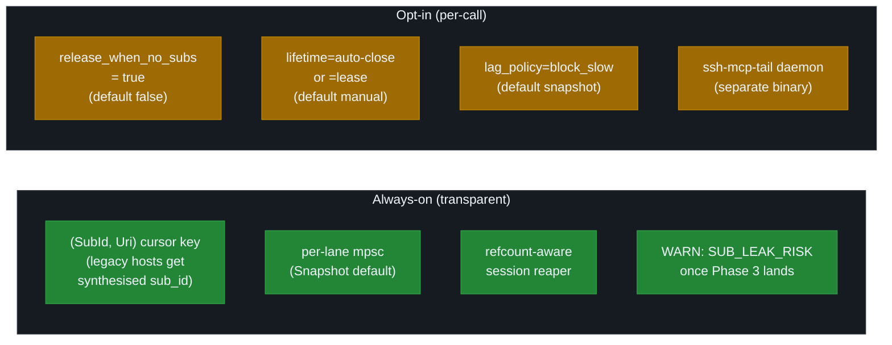

# v4.x to v5.0 Migration Guide

For MCP host operators, contributors, and downstream automations moving from ssh-mcp v4.8.x to v5.0.x. Hosts that only consume the v4 surface need **zero** changes — v5 is wire-compatible on every legacy path; expansions are additive.

v5.0 is in flight on `feat/v5-foundation` (Phases 0–7). This guide is **forthcoming** until v5.0-rc1 tags. Sections marked _v5.0 forthcoming_ describe surface defined by the 6 ADRs at [docs/adr/0003-..0008.md](./adr/) but not yet wired into every binary; Phase 1 (lifecycle layer with v4-compatible defaults) is the only fully-wired phase as of this branch snapshot. Until rc1 tags, treat every wire example as design intent — the test fixtures and integration tests under `tests/` are the binding contract.

For operators (not host authors), jump to [INSTRUCTIONS_DAEMON.md](./INSTRUCTIONS_DAEMON.md) and [TROUBLESHOOTING.md](./TROUBLESHOOTING.md).

## Wire compatibility summary

| Surface | v4.8.x | v5.0.x | Compat? |
|---|---|---|---|
| Tool catalogue (legacy 21 tools — 20 without `port_forward`) | 21 | 21 carried over + 9 new (additive) | yes |
| Tool response markdown shape (`KEY: value`, 8-hex nonce, `--- name [nonce] ---`) | block-only | identical | yes |
| Structured `_meta` channel on every tool response | typed JSON | identical (extended for new tools) | yes |
| Resources schemes (`shell://`, `command://`, `transfer://`, `session://`, `forward://`) | 5 | identical (no new schemes in v5.0) | yes |
| `notifications/resources/updated` debounce semantics (`SSH_NOTIFY_*`) | 50 ms / 1 s / 30 s | identical defaults | yes |
| `notifications/cancelled` (rmcp 1.6 native) | yes | yes | yes |
| `prompts/list` + `prompts/get` | 5 prompts | 10 prompts (5 new) | yes — additive |
| `resources/templates/list` | 4 / 5 templates | identical (no new templates in v5.0) | yes |
| Capability handshake (`V_2025_06_18`, `tools.listChanged`, `resources.subscribe`, `resources.listChanged`) | yes | identical | yes |
| Error wire envelope (`SSH_X: ERROR\nREASON: [CODE] description\nDETAIL: ...`) | yes | identical (codes added; format unchanged) | yes |
| Idempotency (`_meta.idempotency_key`) | 15 mutating tools | 15 carried over + 8 of the 9 new tools (the read-only `ssh_sub_list` / `ssh_sub_stats` / `ssh_daemon_stats` are pure reads) | yes |
| Cursor key on resource subscriptions | `(PeerId, Uri)` | `(SubId, Uri)` internally; `(PeerId, Uri)` synthesised for legacy hosts | yes — synthesised |
| HTTP transport bind / path defaults | `0.0.0.0:8000` `/` | identical | yes |
| Stdio transport | identical | identical | yes |

**Net result.** A v4 host pointed at a v5 server gets the same wire bytes on every legacy tool and resource. v5 ships nine new tools and a second binary (`ssh-mcp-tail`) that the v4 host can simply ignore.

## Breaking changes

**Zero breaking changes on the wire** between v4.8 and v5.0. No tool removals, no schema-narrowing edits, no behaviour changes for unmodified hosts. New deltas land as optional arguments or new env vars:

- `release_when_no_subs: bool` on `ssh_shell_open` / `ssh_execute` / `ssh_upload` / `ssh_download` (default `false`).
- `lifetime: Lifetime`, `lag_policy: LagPolicy`, `filter` on the new `ssh_subscribe` tool ([ADR 0004](./adr/0004-channel-mux-fairness.md)).
- New env vars per ADRs [0003](./adr/0003-lifecycle-binding.md), [0006](./adr/0006-backpressure-policies.md), [0008](./adr/0008-ndjson-daemon-protocol.md). Full table: [docs/CONFIGURATION.md](./CONFIGURATION.md) (promoted in Phase 6).

Hosts that snapshot wire bytes need no test fixture replacement — every legacy assertion still holds.

## Additive surface

v5.0 adds 9 net-new MCP tools and a second binary (`ssh-mcp-tail`). Older hosts that ignore them continue to work.

### Nine new tools (Phase 3)

Catalogue grows 21 → 30 (or 20 → 29 without `port_forward`). All nine are subscription-management primitives keyed on the new `SubId` (UUIDv7 per `resources/subscribe` or `ssh_subscribe` call — [ADR 0004](./adr/0004-channel-mux-fairness.md)).

| Tool | Purpose | Returns | Idempotency |
|---|---|---|---|
| `ssh_subscribe` | Open a push channel against a `shell://` / `command://` / `transfer://` / `session://` / `forward://` URI. Accepts `lifetime`, `lag_policy`, `filter`. | `sub_id` | yes |
| `ssh_unsubscribe` | Close a push channel by `sub_id`. Triggers grace timer if last subscriber and `release_when_no_subs = true`. | OK / NOT_FOUND | yes |
| `ssh_sub_pause` | Suspend the lane's drain loop. Producer keeps emitting; mpsc fills under the lane's lag policy. | OK | yes |
| `ssh_sub_resume` | Resume the drain loop. | OK | yes |
| `ssh_sub_filter` | Hot-reload the lane's filter regex / level. | OK | yes |
| `ssh_sub_replay` | Re-emit events from a chosen cursor (within the ring buffer window). | event count | no |
| `ssh_sub_list` | Enumerate active sub_ids with summary stats. | array of `{sub_id, uri, queue_depth, lag_policy}` | n/a (read-only) |
| `ssh_sub_stats` | Per-sub_id counter snapshot (events_sent, lag_drops, queue_depth, ...). | typed `SubscriberStats` | n/a |
| `ssh_daemon_stats` | Global stats aggregating across all sub_ids (active sessions, total subs, mux backlog, peer GC pace, ...). | typed `DaemonStats` | n/a |

Every new tool emits the same dual channel as the v4 tools: markdown `KEY: value` body with 8-hex nonce framing block, plus a parallel `structured_content` JSON object.

### New binary: `ssh-mcp-tail` (Phase 4)

Three subcommands (`run`, `shell`, `daemon`); primary mode (`daemon`) reads NDJSON ops on stdin and emits NDJSON events on stdout. Embeds the same `composition::prod` adapters as `ssh-mcp` and `ssh-mcp-stdio`, wired to itself via an in-process `tokio::io::duplex` MCP transport. Exists for hosts that do **not** surface `notifications/resources/updated` to the LLM (Claude Code CLI as of 2026-Q1, several IDE integrations). Full reference + NDJSON op/event schema: [INSTRUCTIONS_DAEMON.md](./INSTRUCTIONS_DAEMON.md).

### New env vars

Defaults preserve v4 behaviour. Full list and ranges live in [docs/CONFIGURATION.md](./CONFIGURATION.md) (promoted in Phase 6); ADRs [0003](./adr/0003-lifecycle-binding.md), [0006](./adr/0006-backpressure-policies.md), [0008](./adr/0008-ndjson-daemon-protocol.md) are authoritative until then. Highlights:

| Var | Default | Purpose |
|---|---|---|
| `SSH_LIFECYCLE_GRACE_MS` | 2000 | Grace between last `ssh_unsubscribe` and `Closed` when `release_when_no_subs=true` |
| `SSH_LIFECYCLE_OWN_GRACE_MS` | unlimited | Grace for `Owned` resources opted into auto-cleanup that never got a subscriber |
| `SSH_SESSION_IDLE_GRACE_MS` | 5000 | Session-level grace after `active_refs == 0` |
| `SSH_LAG_POLICY_DEFAULT` | `snapshot` | Lane LagPolicy when caller does not specify |
| `SSH_LANE_BUFFER` | 1024 | Per-lane mpsc capacity |
| `SSH_MUX_BUFFER` | 8192 | Global mux mpsc capacity |
| `SSH_BP_BLOCK_TIMEOUT_MS` | 5000 | `BlockSlow` escape hatch |
| `SSH_SUB_LEAK_RISK_WARN_S` | 2 | Warning threshold for `Owned` resources with 0 subs |
| `SSH_SUB_LEAK_RISK_KILL_S` | 0 (off) | Operator-opt-in hard kill threshold |
| `SSH_NDJSON_LINE_MAX` | 1 MB | Daemon stdin line size limit |
| `SSH_HEARTBEAT_INTERVAL_S` | 30 | Daemon heartbeat cadence |
| `SSH_DAEMON_STATS_INTERVAL_S` | 60 | Daemon stats auto-emit cadence |
| `SSH_GRACE_HARD_TIMEOUT_S` | 30 | Daemon graceful shutdown deadline |

## Default-behaviour deltas

These defaults change between v4.8 and v5.0. None affect a host that does not opt into a new flag or env var.



| Behaviour | v4.8 | v5.0 default | Opt-in flag |
|---|---|---|---|
| Resource auto-cleanup when no subscriber | n/a (manual close required) | unchanged for v4 idioms (`release_when_no_subs = false`) | `release_when_no_subs: true` per call |
| Cursor key on resource subscriptions | `(PeerId, Uri)` | `(SubId, Uri)` internally; legacy hosts get a synthesised `sub_id` per `(PeerId, Uri)` pair | always on (transparent) |
| Lane backpressure policy | one global broadcast channel; `RecvError::Lagged` triggers manual snapshot rebuild | per-lane mpsc with `Snapshot` default | `lag_policy` per `ssh_subscribe` call |
| Peer GC interval | 30 s | 30 s (`SSH_MCP_PEER_GC_INTERVAL_S`) | n/a |
| Session-level reaper | inactivity TTL only | refcount-aware (active_refs supersedes TTL) | always on |
| Inactivity TTL on shell | unchanged (`SSH_SHELL_INACTIVITY_TTL_SECS`) | unchanged | n/a |
| Shutdown sequence | abrupt for stdio; HTTP graceful via axum | NDJSON daemon adds explicit drain (`SSH_GRACE_HARD_TIMEOUT_S`) | `daemon` subcommand only |
| Auto-warning for leak risk | none | `WARN: SUB_LEAK_RISK` line on next `ssh_list_*` call referencing the resource | always on once Phase 3 lands |

`release_when_no_subs = false` is intentional — v5 hosts that do **not** opt in inherit v4 leak semantics (long-running shell persists until manual close or inactivity TTL). v6.0 may flip the default; v5 ships it off so hosts upgrade prompts and idempotency strategy first.

## Recipes (before / after)

The recipes below show the same workflow under v4.8 and under v5.0 push-first. Both are valid in v5.0 — the v4 path remains supported. The v5 path is recommended once your host's prompt and the LLM tooling expose `ssh_subscribe`.

### Open a shell + drain push (Claude Desktop, full-spec host)

**v4.8 — wait + read polling fallback**

```text
ssh_connect(address, username)
  -> SESSION_ID
ssh_shell_open(session_id, cols=80, rows=24)
  -> SHELL_ID
ssh_shell_read(shell_id, wait=true, wait_timeout_secs=30, min_bytes=1)
  # repeat until done; manually close
ssh_shell_close(shell_id)
ssh_disconnect(session_id)
```

**v5.0 — push-first**

```text
ssh_connect(address, username, agent_id="my-claude-agent")
  -> SESSION_ID
ssh_shell_open(session_id, cols=80, rows=24, release_when_no_subs=true)
  -> SHELL_ID  (returns INITIAL_BUFFER if the prompt arrives within 100 ms)
ssh_subscribe(uri="shell://<SHELL_ID>/output", lifetime="auto-close", lag_policy="snapshot")
  -> SUB_ID
# drive the shell; drain push events as they arrive
ssh_shell_write(shell_id, bytes="ls -la\n")
# ... events drain via notifications/resources/updated ...
ssh_unsubscribe(sub_id)            # release_when_no_subs triggers grace timer
# shell auto-closes after SSH_LIFECYCLE_GRACE_MS
ssh_disconnect_agent(agent_id="my-claude-agent")
```

### Run a long command + sub + drain until completed

**v4.8 — wait fallback**

```text
ssh_connect -> SESSION_ID
ssh_execute(session_id, command="run-long-job") -> COMMAND_ID
ssh_get_command_output(command_id, wait=true, wait_timeout_secs=300)
  # blocks until exit or timeout; one tool call burns one round trip
ssh_disconnect(session_id)
```

**v5.0 — push-first with auto-cleanup**

```text
ssh_connect -> SESSION_ID
ssh_execute(session_id, command="run-long-job", release_when_no_subs=true) -> COMMAND_ID
ssh_subscribe(uri="command://<COMMAND_ID>/output",
              lifetime="auto-close",
              lag_policy="snapshot")
  -> SUB_ID
# drain events until { ev: "completed", exit: <int> } arrives
# resource auto-releases (Owned -> Releasing -> Closed) after grace timer
ssh_unsubscribe(sub_id)
ssh_disconnect(session_id)
```

### Upload a file + sub progress

**v4.8 — poll**

```text
ssh_upload(session_id, local="/tmp/file", remote="/srv/file") -> TRANSFER_ID
ssh_get_transfer_progress(transfer_id, wait=true, wait_timeout_secs=300)
  # blocks until completion
```

**v5.0 — push-first**

```text
ssh_upload(session_id, local="/tmp/file", remote="/srv/file",
           release_when_no_subs=true) -> TRANSFER_ID
ssh_subscribe(uri="transfer://<TRANSFER_ID>/progress",
              lifetime="auto-close",
              lag_policy="snapshot")
  -> SUB_ID
# drain { ev: "transfer_progress", bytes: ..., total: ... } events
ssh_unsubscribe(sub_id)
```

### Audit my owned subscriptions (v5.0 only)

```text
ssh_sub_list(filter_by_uri="shell://*")
  -> [{sub_id, uri, queue_depth, lag_policy, lagged_drops}, ...]
# decide which are stale, then:
ssh_unsubscribe(sub_id)
```

A `subscription_hygiene_audit` prompt published via `prompts/list` automates this loop. See [`docs/llm-ux/PROMPTS_CATALOG.md`](./llm-ux/PROMPTS_CATALOG.md) (forthcoming).

### Replay after disconnect (v5.0 only)

```text
# after a network blip, reconnect:
ssh_connect(...) -> SESSION_ID
# the prior shell/command is still alive (refcount > 0 because the
# resource was created with release_when_no_subs=false OR the grace
# window has not elapsed):
ssh_subscribe(uri="shell://<SHELL_ID>/output", lifetime="auto-close")
  -> SUB_ID
# the lane initialises with lag_policy=snapshot; the first event is a
# `{ ev: "snapshot", cursor: N, delta: <bytes> }` with the live ring
# buffer contents from cursor 0 (or `last_seen_cursor` if you provided it).
ssh_sub_replay(sub_id, from_cursor=last_seen)
  # for explicit replay outside the snapshot rebuild
```

If the resource has `Closed` in the meantime (grace timer fired), `ssh_subscribe` returns `RESOURCE_GONE` with a `DETAIL: Resource closed (lifecycle Releasing/Closed); recreate via ssh_shell_open / ssh_execute / ssh_upload.` line. See [`docs/llm-ux/ERROR_HANDBOOK.md`](./llm-ux/ERROR_HANDBOOK.md) (forthcoming) for the full code-by-code retry policy.

### Daemon-mode equivalent (Claude Code CLI, no-subscribe host)

When the host's LLM cannot consume `notifications/resources/updated`, a Claude Code shell can pipe NDJSON through `ssh-mcp-tail`:

```bash
ssh-mcp-tail run --host vm.example.com --user root -- "tail -f /var/log/app.log" \
  | jq 'select(.ev == "push") | .delta'
```

The daemon enforces the same lifecycle and lag policy as the in-process server. See [`docs/INSTRUCTIONS_DAEMON.md`](./INSTRUCTIONS_DAEMON.md) for the full op + event schema and pipeline recipes.

## LLM prompt updates

If you embed `Implementation.instructions` in your system prompt or fine-tune on the v4 surface, refresh with the v5 root text:

| Resource | Source |
|---|---|
| Compact root prompt (27B-class) | [docs/llm-ux/INSTRUCTIONS_27B.md](./llm-ux/INSTRUCTIONS_27B.md) |
| Detailed root prompt (≥70B) | [docs/llm-ux/INSTRUCTIONS_70B.md](./llm-ux/INSTRUCTIONS_70B.md) |
| Five golden rules | [docs/llm-ux/GOLDEN_RULES.md](./llm-ux/GOLDEN_RULES.md) |
| 10 `prompts/list` workflows | [docs/llm-ux/PROMPTS_CATALOG.md](./llm-ux/PROMPTS_CATALOG.md) |
| 10 documented anti-patterns | [docs/llm-ux/ANTIPATTERNS.md](./llm-ux/ANTIPATTERNS.md) |

## Deprecation timeline

| Version | Status | Notes |
|---|---|---|
| **v5.0** | Nothing deprecated. | The legacy `(PeerId, Uri)` cursor key is kept; it is synthesised internally so v4 hosts work unchanged. The v4 `resources/subscribe` flow auto-mints a `sub_id`. The v4 tools, idempotency cache, debouncer defaults, and HTTP/stdio binaries are all preserved with identical semantics. |
| **v5.x** (minor releases) | Legacy `(PeerId, Uri)` cursor key remains supported. | New tools may add optional fields; existing fields keep their semantics. The default lag policy stays `snapshot`. |
| **v6.0** (future, no date) | `release_when_no_subs = true` may become default. | Once empirical data from v5.x confirms the leak rate falls under the auto-cleanup default, v6.0 may flip the flag. The v5 default (`false`) is intentionally conservative so existing hosts inherit v4 behaviour. v6.0 will publish a separate migration guide if the default changes. |

No v4 idiom is forbidden in v5.0. No tool, env var, or wire format is removed. Hosts that never opt into the new surface should not need to update code.

## References

ADRs (canonical for design decisions):

| ADR | Topic |
|---|---|
| [0003](./adr/0003-lifecycle-binding.md) | Lifecycle binding — refcount + grace-timer state machine, `release_when_no_subs` flag |
| [0004](./adr/0004-channel-mux-fairness.md) | Channel mux + SubId — `(SubId, Uri)` cursor key, per-lane mpsc fan-out |
| [0005](./adr/0005-llm-ux-priorities.md) | LLM UX priorities — layered escalation, prompt catalog, `SUB_LEAK_RISK` |
| [0006](./adr/0006-backpressure-policies.md) | Backpressure — four `LagPolicy` variants, per-frontier matrix, `BlockSlow` timeout |
| [0007](./adr/0007-error-taxonomy.md) | Error taxonomy — 7 categories, new codes (`RESOURCE_GONE`, `SUB_NOT_FOUND`, `LAG_*`, `INVALID_OP`, ...), canonical `DETAIL` phrasings |
| [0008](./adr/0008-ndjson-daemon-protocol.md) | NDJSON daemon protocol — `ssh-mcp-tail` op/event schema, in-process duplex transport, graceful shutdown |

Operational follow-on: [INSTRUCTIONS_DAEMON.md](./INSTRUCTIONS_DAEMON.md), [TROUBLESHOOTING.md](./TROUBLESHOOTING.md), [llm-ux/](./llm-ux/), [ARCHITECTURE.md](./ARCHITECTURE.md), [LOCKS.md](./LOCKS.md), [RESOURCES.md](./RESOURCES.md), [CONFIGURATION.md](./CONFIGURATION.md). Historical: [MIGRATION_v3_to_v4.md](./MIGRATION_v3_to_v4.md).
