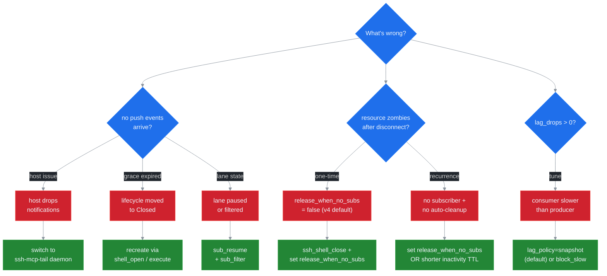
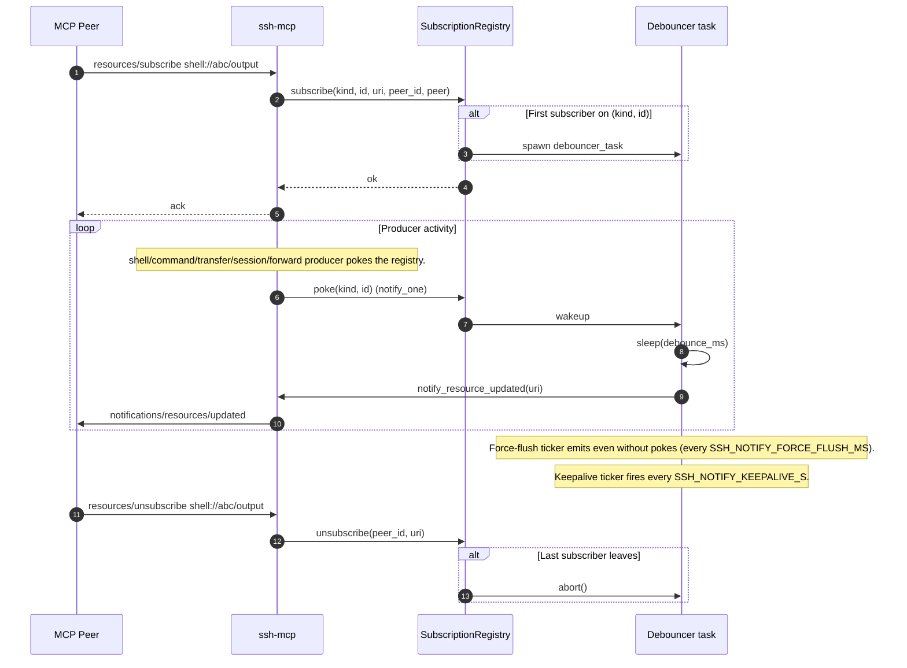
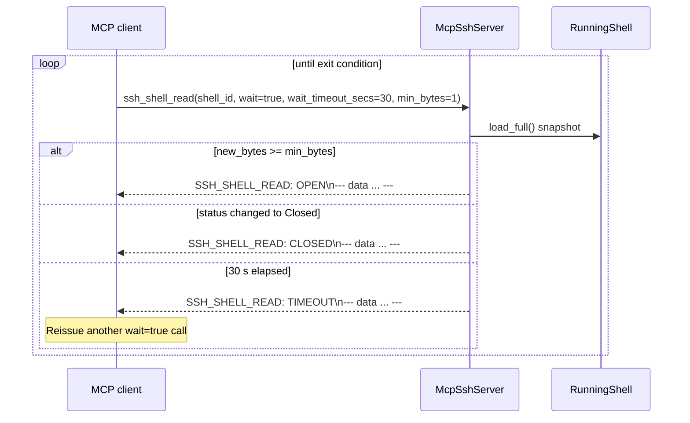
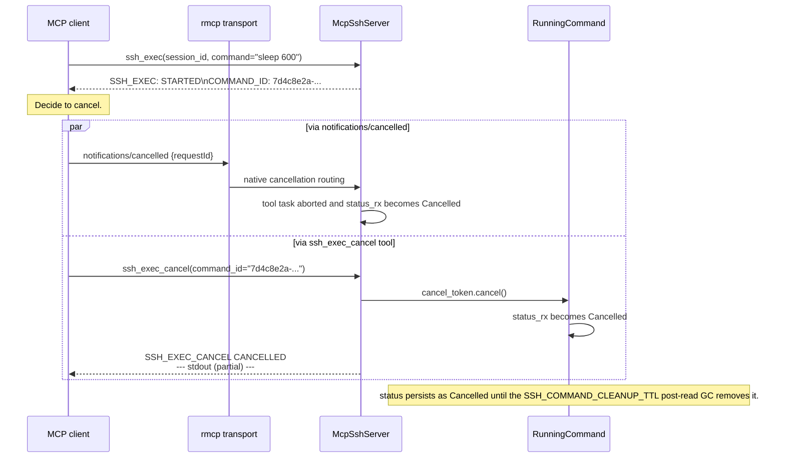
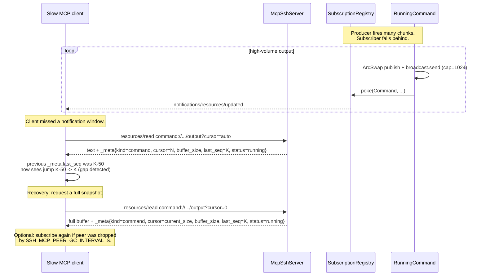
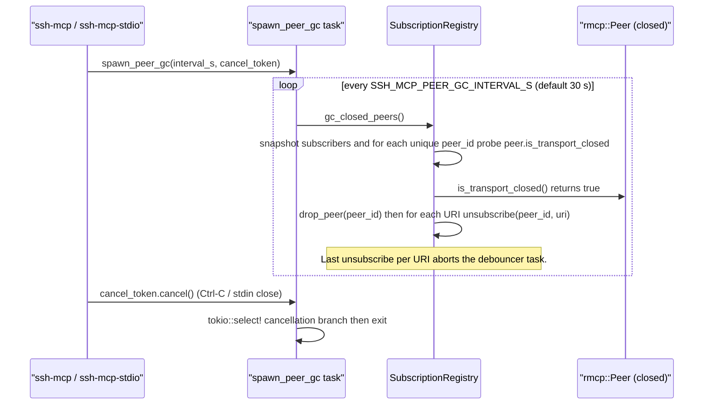
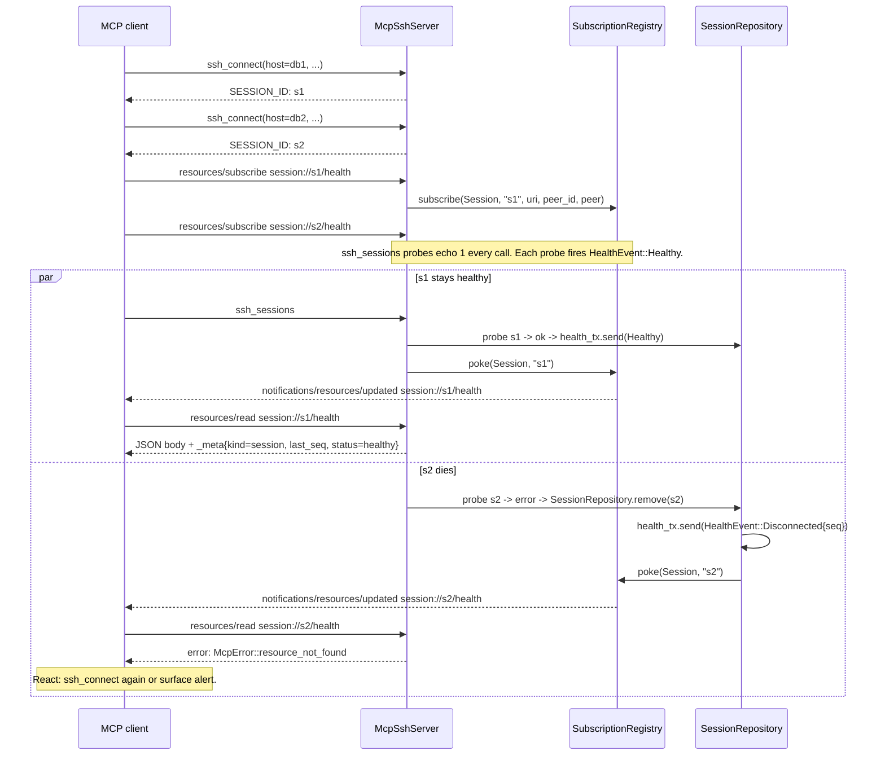

# Operations Runbook

Operator-facing reference for ssh-mcp. Symptom-to-cure decision tree, common failure shapes, the wire-format error envelope and per-tool error catalogue, and recovery sequence diagrams. Pairs with [LLM_GUIDE.md](./LLM_GUIDE.md) (the LLM-side handbook) and [DAEMON.md](./DAEMON.md) (the `ssh-mcp-tail` reference). For the full 38-code error taxonomy with retry semantics, see [LLM_GUIDE.md → Error handbook](./LLM_GUIDE.md#error-handbook).



## Table of contents

- [Common failure shapes](#common-failure-shapes)
  1. [Subscriber receives no push events](#1-subscriber-receives-no-push-events)
  2. [Shell becomes a zombie after caller disconnects](#2-shell-becomes-a-zombie-after-caller-disconnects)
  3. [`lag_drops > 0` in subscriber stats](#3-lag_drops--0-in-subscriber-stats)
  4. [`sub_open` returns `RESOURCE_GONE`](#4-sub_open-returns-resource_gone)
  5. [Cascade disconnect closes session unexpectedly](#5-cascade-disconnect-closes-session-unexpectedly)
  6. [Stuck transfer (`bytes_transferred` not advancing)](#6-stuck-transfer-bytes_transferred-not-advancing)
  7. [High CPU under load](#7-high-cpu-under-load)
  8. [High memory under load](#8-high-memory-under-load)
  9. [Daemon process orphans on shutdown](#9-daemon-process-orphans-on-shutdown)
- [Wire-format error envelope](#wire-format-error-envelope)
- [Per-tool error catalogue](#per-tool-error-catalogue)
- [Recovery flows](#recovery-flows)
- [Diagnostic toolbox](#diagnostic-toolbox)
- [When to file a bug](#when-to-file-a-bug)

---

## Common failure shapes

### 1. Subscriber receives no push events

**Symptom.** A host called `sub_open` (or the legacy `resources/subscribe`), the call returned a `sub_id`, and yet no `notifications/resources/updated` (or NDJSON `push` events) reach the consumer.

#### Causes

1. **Host does not surface `notifications/resources/updated` to the LLM.** Claude Code CLI (as of 2026-Q1) and several IDE integrations accept the protocol but never deliver push notifications as conversation context to the model. The MCP server emits them; the host drops them.
2. **Subscription was closed by peer GC.** Peer-GC scans the subscription registry every `SSH_MCP_PEER_GC_INTERVAL_S` (default 30 s) and drops peers whose rmcp transport closed. Reconnecting client gets a fresh `PeerId`; the old `sub_id` is dead.
3. **Lifecycle moved to `Releasing` without a re-subscribe inside the grace window.** When the last subscriber on a `release_when_no_subs=true` resource unsubscribed, the grace timer started counting down (`SSH_LIFECYCLE_GRACE_MS`, default 2000 ms). A new `subscribe` after grace expired returns `RESOURCE_GONE`.
4. **Filter excludes everything.** The lane has a regex / level filter that rejects every event before it hits the mpsc.
5. **Lane is paused.** A prior `sub_pause` call suspended the drain loop. Producer is still emitting; the lane mpsc fills under its lag policy.

#### Diagnosis

```text
sub_list                          # find your sub_id; check uri matches
sub_stats(sub_id=...)             # look at events_sent / lag_drops / queue_depth
sub_stats_all                      # global view; confirm the mux is forwarding events
```

If `events_sent > 0` but the consumer sees nothing, the host or transport is dropping the notification. Inspect with `mcp-inspector` or `wireshark` against `ssh-mcp` HTTP. If `events_sent == 0`, the lane is idle — check the filter, the pause state, and the lifecycle.

```bash
RUST_LOG=ssh_mcp=debug,ssh_mcp::adapters::subscription=trace ssh-mcp-stdio
```

#### Cure

| Cause | Cure |
|---|---|
| Host drops notifications | Switch to `ssh-mcp-tail daemon` and consume NDJSON push events directly. See [DAEMON.md](./DAEMON.md). |
| Peer GC swept the sub | Re-subscribe with the right `uri`. Track `sub_id`s in your host state and refresh on reconnect. |
| Grace window expired | Recreate the resource via `ssh_shell_open` / `ssh_exec` / `ssh_upload`. |
| Filter too strict | Hot-reload via `sub_filter` with a less restrictive pattern. |
| Lane paused | Call `sub_resume` on the `sub_id`. |

References: [ADR 0003](./adr/0003-lifecycle-binding.md), [ADR 0004](./adr/0004-channel-mux-fairness.md), [ADR 0008](./adr/0008-ndjson-daemon-protocol.md).

### 2. Shell becomes a zombie after caller disconnects

**Symptom.** A long-running shell (`shell://<id>/output`) keeps consuming a russh channel after the original caller's transport closed. `ssh_sessions` shows the session; the PTY is still allocated on the remote.

#### Causes

1. **`release_when_no_subs = false`** on `ssh_shell_open` (the v4-compatible default in v5.0). The lifecycle layer never auto-releases. Manual `ssh_shell_close` is required.
2. **The host did not subscribe.** A 27B-class model occasionally opens a shell, hot-polls `ssh_shell_read`, and never registers a `resources/subscribe`. With no subscriber the resource stays in `Owned` indefinitely (unless `release_when_no_subs = true`).
3. **Inactivity TTL has not yet fired.** The shell's idle reaper kicks in after `SSH_SHELL_INACTIVITY_TTL_SECS` of zero PTY traffic. A shell with steady output bypasses the TTL.
4. **`active_refs` on the session is greater than zero.** A second observed shell on the same session keeps the session alive; the zombie shell's parent never enters `Releasing`.

#### Diagnosis

```text
ssh_sessions                     # confirm session is alive
sub_list(filter_by_uri=shell://*) # any subscriber on the zombie shell?
sub_stats(sub_id=...)             # if a sub exists: any events_sent?
```

A zombie shell typically shows: session alive, zero subs on its `shell://` URI, output still flowing if you do `ssh_shell_read(shell_id, wait=false)`.

#### Cure

| Situation | Cure |
|---|---|
| One-time cleanup | `ssh_shell_close(shell_id)` then `ssh_disconnect(session_id)` (or `ssh_disconnect_agent(agent_id)` to wipe a logical group). |
| Prevent recurrence | Pass `release_when_no_subs=true` on every `ssh_shell_open` call from the host's prompt. The shell will auto-close after the grace timer when the last subscriber leaves. |
| Reduce idle TTL | Lower `SSH_SHELL_INACTIVITY_TTL_SECS` so even non-flagged shells are reaped faster. |
| Audit subscriptions | `subscription_hygiene_audit` prompt automates the audit-and-close loop. See [LLM_GUIDE.md → Prompts catalogue](./LLM_GUIDE.md#prompts-catalogue). |

References: [ADR 0003](./adr/0003-lifecycle-binding.md), [ADR 0005](./adr/0005-llm-ux-priorities.md), [LLM_GUIDE.md → Anti-patterns](./LLM_GUIDE.md#anti-patterns).

### 3. `lag_drops > 0` in subscriber stats

**Symptom.** `sub_stats` reports `lagged_drops` greater than zero, or NDJSON `lagged` events appear on the daemon stdout. Events are being dropped under the lane's lag policy.

#### Causes

1. **Consumer is slower than producer.** A tight `tail -f` loop on a noisy log fills the lane mpsc (`SSH_LANE_BUFFER`, default 1024) faster than the consumer drains.
2. **Filter pipeline downstream is slow.** A `jq` filter or a downstream sink (vector, fluentbit) backpressures the daemon's outbound writer. Mux backlog grows; lanes fall back to lag policy.
3. **Wrong `lag_policy` for the workload.** `BlockSlow` pegs the producer at the consumer's rate (no drops, but latency grows). `DropOldest` / `DropNewest` drop events. `Snapshot` rebuilds from the per-resource ring buffer (zero loss as long as the buffer covers the gap).

#### Diagnosis

```text
sub_stats(sub_id=...)
  # look at:
  #   queue_depth         (how full the lane is right now)
  #   queue_high_watermark (peak occupancy)
  #   lagged_drops        (cumulative drops)
  #   lagged_recoveries   (snapshot rebuilds completed)
  #   block_total_ms      (cumulative BlockSlow waits)
sub_stats_all
  # mux_queue_depth: outbound backlog
```

A lane with `queue_high_watermark = SSH_LANE_BUFFER` and growing `lagged_drops` is overflowing; pick a different policy or reduce production rate.

#### Cure

| Symptom | Cure |
|---|---|
| Drops on a monitoring lane | Switch to `lag_policy=snapshot` (the v5.0 default). The lane drops backlog and rebuilds via the per-resource ring buffer; the consumer sees a `snapshot` event with the live tail. |
| Drops on an audit / forensic lane | Switch to `lag_policy=block_slow`. Producer pauses until consumer drains. Set `SSH_BP_BLOCK_TIMEOUT_MS` if you need a hard ceiling. |
| Drops on a fast monitoring lane that wants gap markers | `lag_policy=drop_oldest` keeps the freshest events; `lagged` markers tell the consumer how many were lost. |
| Consumer downstream is slow | Profile the downstream sink. Add a buffer (kafka, vector). Filter server-side via `sub_filter` to reduce production rate. |

References: [ADR 0006](./adr/0006-backpressure-policies.md), [DAEMON.md](./DAEMON.md).

### 4. `sub_open` returns `RESOURCE_GONE`

**Symptom.** A subscribe op returns `REASON: [RESOURCE_GONE] Resource closed (lifecycle Releasing/Closed)` with `DETAIL: recreate via ssh_shell_open / ssh_exec / ssh_upload.` The host expected the resource to still be alive.

#### Causes

1. **Grace timer expired between create and subscribe.** A resource was created with `release_when_no_subs=true` and `SSH_LIFECYCLE_OWN_GRACE_MS` elapsed before any subscriber attached. The lifecycle moved `Owned -> Releasing -> Closed`.
2. **Last unsubscribe + grace timer.** A previous `sub_close` was the last subscriber; the grace timer fired before re-subscribe.
3. **Cascade close.** The parent session was disconnected; every owned resource cascaded to `Closed`.
4. **Manual close.** `ssh_shell_close` / `ssh_exec_cancel` was called.

#### Diagnosis

```text
ssh_sessions            # is the parent session still alive?
ssh_commands            # for command:// URIs
# the absence of the resource confirms it has been Closed
```

Check `RUST_LOG=ssh_mcp::adapters::lifecycle=trace` for the CAS edges that fired (`Owned -> Releasing`, `Releasing -> Closed`).

#### Cure

Recreate the resource and subscribe immediately:

- Shells: `ssh_shell_open(...)` + `sub_open(uri="shell://<new>/output", ...)` in the same workflow.
- Commands: re-run `ssh_exec(...)`. Note that re-running is not idempotent for side-effect commands — the resource lifecycle does not stash exit-code history past `Closed`.
- Transfers: re-issue `ssh_upload` / `ssh_download`.

#### Prevention

| Pattern | Prevention |
|---|---|
| Subscribe-after-create race | Issue `sub_open` immediately after the create call, in the same turn. Default grace window is 2 s. |
| Long-lived `Owned` without subscriber | Set `release_when_no_subs=false` on resources you intend to keep alive without observing. |
| Re-subscribe after disconnect | Track the `sub_id` and `uri`. On reconnect, resubscribe to the same URI within `SSH_LIFECYCLE_GRACE_MS`. |

References: [ADR 0003](./adr/0003-lifecycle-binding.md), [ADR 0007](./adr/0007-error-taxonomy.md), [LLM_GUIDE.md → Error handbook](./LLM_GUIDE.md#error-handbook).

### 5. Cascade disconnect closes session unexpectedly

**Symptom.** `ssh_disconnect(session_id)` was issued; the session and its observed shells closed; a different session, or a shell on the same session that the operator did not intend to close, was also closed.

#### Causes

1. **Operator confused two sessions.** `ssh_sessions` may show stale entries; double-check the `session_id` before disconnecting.
2. **Cascade close on the parent session.** A disconnect on a session always cascade-closes every owned shell, command, and transfer. By design — see [ADR 0003](./adr/0003-lifecycle-binding.md).
3. **`active_refs` underflow bug.** Theoretical only; surfaces as `SESSION_REFCOUNT_UNDERFLOW` (an `INTERNAL` category error). If you see this code, file a bug.
4. **`ssh_disconnect_agent(agent_id)`** wipes every session under that `agent_id`. If multiple sessions share an `agent_id`, all of them close.

#### Diagnosis

```text
ssh_sessions                   # which sessions exist
sub_list                        # which subs are bound to each
ssh_commands                   # which commands per session
```

After the disconnect, check the structured logs for `SESSION_REFCOUNT_UNDERFLOW`:

```bash
grep SESSION_REFCOUNT_UNDERFLOW /var/log/ssh-mcp.log
```

If the cascade closed more than expected, the most likely cause is an `agent_id` shared across sessions.

#### Cure

| Cause | Cure |
|---|---|
| Wrong `session_id` | Use `ssh_sessions` to confirm; cancel the next disconnect. |
| Shared `agent_id` | Use distinct `agent_id`s for distinct logical scopes. |
| `SESSION_REFCOUNT_UNDERFLOW` | File a bug with the structured logs (see [When to file a bug](#when-to-file-a-bug)). |

References: [ADR 0003](./adr/0003-lifecycle-binding.md), [ADR 0007](./adr/0007-error-taxonomy.md).

### 6. Stuck transfer (`bytes_transferred` not advancing)

**Symptom.** `ssh_transfer_progress` shows `bytes_transferred` stuck at a single value across multiple polls. `transfer://<tid>/progress` push events stop arriving. The remote file is incomplete.

#### Causes

1. **Network stall.** TCP backpressure on the underlying socket; russh recv window is full.
2. **Remote disk full.** SFTP `STATUS_NO_SPACE_LEFT_ON_DEVICE`; the daemon would emit `SFTP_ERROR` with the underlying message in `DETAIL:` if the remote signalled the error.
3. **Remote process killed.** OOM, signal; the SFTP session detects EOF and emits `SFTP_ERROR`.
4. **Subscribe missing.** The transfer is alive (the bytes are flowing on the wire); the subscriber lane mpsc is paused (`sub_pause`) or has a filter that excludes progress events. The transfer is fine; observability is broken.

#### Diagnosis

```text
ssh_transfer_progress(tid=..., wait=false)   # snapshot current state
sub_stats(sub_id=...)                         # if subscribed: events_sent stuck?
```

Check the live SSH connection on the remote side (`netstat`, `ss` on the remote, `iftop` on the local).

#### Cure

| Cause | Cure |
|---|---|
| Network stall | Wait; `russh` will resume when TCP recovers. If hard-stalled > 60 s, cancel and retry. |
| Disk full / remote error | Check `/var/log/ssh-mcp.log` for `SFTP_ERROR`; address the remote condition; restart the transfer. |
| Subscribe broken | `sub_resume`, then `sub_filter` to reset filter, then `sub_replay` from the last seen cursor. |

References: [ADR 0007](./adr/0007-error-taxonomy.md), `SFTP_ERROR` (`REMOTE` category).

### 7. High CPU under load

**Symptom.** `top` shows `ssh-mcp` (or `ssh-mcp-tail`) consuming an unexpected percentage of CPU. `tokio-console` shows a busy task.

#### Causes

1. **Hot poll on `ssh_shell_read`** from a misbehaving 27B-class model. Every call is a tool round trip; the loop saturates the dispatcher.
2. **Debouncer storm.** A noisy resource (e.g. `tail -f` on a fast log) producing more than `1000 / SSH_NOTIFY_DEBOUNCE_MS` events per second results in `1000 / SSH_NOTIFY_DEBOUNCE_MS` debounce dispatches per second — bounded but not zero. With many subscribers, the per-lane fan-out adds linear cost.
3. **Mux fairness loop spinning.** A bug in the round-robin would manifest as a busy `ChannelMux` task. Loom invariant tests cover this; any regression is a bug.
4. **Filter regex catastrophic backtracking.** A user-supplied regex with `.*.*` patterns can make filtering O(n²) per line.

#### Diagnosis

```bash
RUST_LOG=ssh_mcp=debug ssh-mcp-stdio
# correlate spikes with debouncer logs

# tokio-console (if compiled with the tokio-console feature)
tokio-console
```

The `sub_stats_all` event surfaces the mux backlog and the debouncer pace.

#### Cure

| Cause | Cure |
|---|---|
| Hot poll | Update the host's prompt to use `sub_open` instead of `ssh_shell_read` in a loop. Five golden rules: [LLM_GUIDE.md](./LLM_GUIDE.md#golden-rules). |
| Debouncer storm | Increase `SSH_NOTIFY_DEBOUNCE_MS` (default 200 ms; try 500–1000 ms for very noisy resources). |
| Mux loop spinning | File a bug; capture `tokio-console` profile and `sub_stats_all`. |
| Regex backtracking | Replace the filter with a simpler pattern; consider a level filter instead of regex. |

References: [ADR 0005](./adr/0005-llm-ux-priorities.md), [DEVELOPMENT.md](./DEVELOPMENT.md#lock-free-invariants).

### 8. High memory under load

**Symptom.** RSS grows over time; `sub_stats_all` shows growing `events_sent_total` but flat `lagged_drops_total`. Memory does not free.

#### Causes

1. **Per-resource ring buffers sized too high.** `SSH_SHELL_MAX_BUFFER` × N shells. Default 1 MB × 100 shells = 100 MB just for shells.
2. **Per-lane mpsc buffers stuck full.** With `SSH_LANE_BUFFER = 1024` events × 200 subs × ~256 bytes per event = ~50 MB. If a sub never drains, its lane caps at this size.
3. **Idempotency cache.** `SSH_IDEMPOTENCY_MAX_ENTRIES` (default 10000) × ~512 bytes per entry = ~5 MB.
4. **Subscriber stats.** ~200 bytes per `SubscriberStats` × 65000 subs = ~13 MB.

#### Diagnosis

```text
sub_stats_all
  # active_subs                — number of lanes
  # active_sessions            — number of sessions
  # events_sent_total          — global production rate
  # mux_queue_depth            — outbound backlog
sub_stats(sub_id=...)     # per-lane queue_depth + queue_high_watermark
```

A lane with `queue_high_watermark` close to `SSH_LANE_BUFFER` is hoarding memory.

#### Cure

| Cause | Cure |
|---|---|
| Ring buffers too large | Lower `SSH_SHELL_MAX_BUFFER` / `SSH_COMMAND_MAX_BUFFER_SIZE` for the workload. Trade-off: smaller buffer means snapshot rebuilds may not cover the gap; expect more `LAG_DETECTED` warnings. |
| Stuck lanes | Use `sub_list` to find lanes with high `queue_depth`; resume them, switch their `lag_policy` to `snapshot`, or unsubscribe and recreate. |
| Idempotency cache | Lower `SSH_IDEMPOTENCY_MAX_ENTRIES` or `SSH_IDEMPOTENCY_TTL_SECS`. |
| Stats overhead | If you are running 65000+ subs on a single daemon, partition into multiple daemon processes (each is single-tenant in v5.0). |

References: [ADR 0006](./adr/0006-backpressure-policies.md).

### 9. Daemon process orphans on shutdown

**Symptom.** `ssh-mcp-tail daemon` was killed (SIGTERM, parent process death), but the process is still alive in `ps`, or remote SSH sessions are not torn down.

#### Causes

1. **`SSH_GRACE_HARD_TIMEOUT_S` not yet expired.** The drain sequence runs: LineReader exits, Dispatcher exits, broadcast cancel, per-session `ssh_disconnect`, embed server task abort, EventMux flush, stdout close, exit 0. The default budget is 30 s; a slow remote disconnect can fill this.
2. **Hung russh recv loop.** A remote sshd that does not respond to channel close keeps a russh task pinned; the daemon's drain blocks on that task.
3. **stdout SIGPIPE not handled.** If the consumer of NDJSON closed its pipe but the daemon is mid-write on a buffered line, the kernel SIGPIPE kills the daemon — which is the correct behaviour. If the daemon is hung instead, the SIGPIPE handler is misconfigured.

#### Diagnosis

```bash
# inspect the process tree
ps -ef --forest | grep ssh-mcp-tail

# check the daemon's journal-equivalent
RUST_LOG=ssh_mcp=debug,ssh_mcp_tail=trace ssh-mcp-tail daemon

# correlate with the operator's expected drain time
```

If the process exits within `SSH_GRACE_HARD_TIMEOUT_S` (default 30 s), the behaviour is by design — wait. If it exceeds the budget by a lot, the russh layer or the embed server has a hang.

#### Cure

| Cause | Cure |
|---|---|
| Within drain budget | Wait. The drain is bounded; the process exits at the deadline at the latest. |
| Beyond drain budget | `kill -9 <pid>` and capture a `tokio-console` snapshot (or a flamegraph) for the hung task. File a bug. |
| Custom shutdown semantics | Lower `SSH_GRACE_HARD_TIMEOUT_S` for faster ungraceful exit; raise for slower-but-cleaner cleanup. |

References: [ADR 0008](./adr/0008-ndjson-daemon-protocol.md), [DAEMON.md](./DAEMON.md).

---

## Wire-format error envelope

All tool errors render as a `CallToolResult::error` carrying a markdown text block, plus a parallel structured JSON twin on the same response:

```text
TOOL_NAME: ERROR
REASON: [CODE] message
DETAIL: <optional context>
```

```json
{ "tool": "ssh_exec", "status": "error", "code": "SESSION_NOT_FOUND",
  "reason": "no session with id sess-x",
  "detail": "closest matches: sess-1, sess-a" }
```

The structured channel is byte-compatible across hosts that ignore `structured_content`; the text channel stays identical to v3 / v4.

`resources/*` errors are returned as proper JSON-RPC errors (`McpError`):

- `INVALID_PARAMS` for malformed URIs / arguments.
- `RESOURCE_NOT_FOUND` for unknown `(scheme, id)` pairs.
- `INTERNAL_ERROR` for registry-level failures (currently never raised — `subscribe` is infallible at runtime).

### NOT_FOUND closest-match suggestions

When `SESSION_NOT_FOUND` / `SHELL_NOT_FOUND` / `COMMAND_NOT_FOUND` / `TRANSFER_NOT_FOUND` / `FORWARD_NOT_FOUND` fires and the relevant repo holds at least one live entry, the `DETAIL:` line carries `closest matches: <id1>, <id2>, <id3>` (top-3 Levenshtein neighbors). When the repo is empty the suggestion clause is omitted.

Reference: `src/infra/mcp/suggestions.rs::closest_ids`.

### Granular tag dispatcher

`src/infra/mcp/tool_router.rs::classify_error` checks a `DomainError` reason for a `TAG: message` prefix and promotes the tag to the wire `CODE`. Three buckets:

- **`ARG_TAGS`** (vs `INVALID_ARGUMENT`): `EMPTY_PATTERNS`, `TOO_MANY_PATTERNS`, `PATTERN_TOO_LONG`, `MODIFIER_NOT_ALLOWED`, `INVALID_REPEAT`, `FEATURE_DISABLED`.
- **`TRANSPORT_TAGS`** (vs `TRANSPORT_ERROR`): `WRITE_FAILED`, `CHANNEL_FAILED`, `COMMAND_FAILED`, `FORWARD_FAILED`.
- **`SFTP_TAGS`** (vs `SFTP_ERROR`): `LOCAL_FILE_ERROR`, `LOCAL_NOT_FILE`, `SFTP_OPEN_FAILED`, `REMOTE_METADATA_ERROR`.

All 14 tags reach the wire as of v4.6 (no reserved tags remain).

### v4.7 idempotency error

| Code | Trigger | Emitted from | Recommended action |
|---|---|---|---|
| `IDEMPOTENCY_KEY_TOO_LONG` | `_meta.idempotency_key` exceeds 256 bytes (`IDEMPOTENCY_KEY_MAX_BYTES`). The use case is NOT executed. | `src/infra/mcp/idempotency.rs::extract_idempotency_key` (returns `KeyOutcome::TooLong`). | Trim the key client-side. The cap is sized for UUID-style values (UUIDv4 is 36 bytes); larger payloads are rejected to bound the cache. |

Empty keys are treated as absent (idempotency OFF for that call), so callers do not have to special-case the missing-vs-empty distinction. See [LLM_GUIDE.md → Idempotency](./LLM_GUIDE.md#idempotency).

---

## Per-tool error catalogue

### ssh_connect

| Code | Trigger | Emitted from | Recommended action |
|---|---|---|---|
| `CONNECTION_FAILED` | Handshake failed or all retries exhausted (transient + non-retryable both surface here after the budget). | `src/adapters/ssh/russh_adapter.rs::connect` | Inspect `DETAIL`; retry with a longer `timeout_secs` if transient, or with corrected credentials if it mentions auth / permission. |
| `AUTH_FAILED` | Auth chain (password -> key -> agent) exhausted with no successful method. | `src/adapters/auth/auth_chain.rs::authenticate` | Verify credentials; check that the SSH agent is reachable. |

### ssh_disconnect

| Code | Trigger | Emitted from | Recommended action |
|---|---|---|---|
| `SESSION_NOT_FOUND` | No session with the given `SESSION_ID`. | `src/application/disconnect.rs::execute` | Run `ssh_sessions` to recover the live ID list, or call `ssh_connect`. v4.7+: when at least one live session exists, `DETAIL:` carries `closest matches: <id1>, <id2>, <id3>`. |
| `TRANSPORT_ERROR` | russh transport failed during teardown. | `src/adapters/ssh/russh_adapter.rs::disconnect` | Treat as success (the session is gone either way). Surface details if needed. |

### ssh_sessions

No error codes. Returns an empty list when the optional `agent_id` filter matches nothing or when no sessions are stored. Dead sessions are health-checked and pruned before the response is built.

### ssh_disconnect_agent

No error codes. Unknown `agent_id` returns `SESSIONS: 0` and `COMMANDS: 0`.

### ssh_exec

| Code | Trigger | Emitted from | Recommended action |
|---|---|---|---|
| `SESSION_NOT_FOUND` | No session with the given `SESSION_ID`. | `src/application/execute_command.rs::execute` | Reconnect via `ssh_connect`. v4.7+: `DETAIL: closest matches: ...` populated when the session repo holds at least one live entry. |
| `MAX_COMMANDS_EXCEEDED` | Per-session running-command cap (100) reached. `DETAIL: limit=100`. | `src/application/execute_command.rs::execute` | Wait for in-flight commands to complete, or `ssh_exec_cancel` an obsolete one. |
| `CHANNEL_FAILED` | russh failed to open the exec channel. Tagged transport. | `src/adapters/ssh/russh_adapter.rs::execute_command` | Inspect; common causes: remote `MaxSessions` exhaustion, kex failure. |
| `TRANSPORT_ERROR` | russh transport error not covered by a tag. | `src/adapters/ssh/russh_adapter.rs::execute_command` | Inspect; consider a fresh session (`ssh_connect reuse=force_new`). |

### ssh_exec_output

| Code | Trigger | Emitted from | Recommended action |
|---|---|---|---|
| `COMMAND_NOT_FOUND` | No async command with the given `COMMAND_ID`. May indicate the command was cleaned up after `SSH_COMMAND_CLEANUP_TTL`. | `src/application/get_command_output.rs::execute` | Re-issue `ssh_exec`, or rely on the original output captured before the TTL. |
| `COMMAND_FAILED` | Status flipped to `Failed` (transport error, exec channel died mid-run). Tagged transport. | `src/adapters/ssh/russh_adapter.rs::execute_command` | Inspect `REASON`; retry the command if the cause looks transient (network), otherwise surface the failure to the user. |

### ssh_commands

No error codes. Filters that match nothing return an empty list.

### ssh_exec_cancel

| Code | Trigger | Emitted from | Recommended action |
|---|---|---|---|
| `COMMAND_NOT_FOUND` | No async command with the given `COMMAND_ID`. | `src/application/cancel_command.rs::execute` | Already cleaned up — treat as success. |

`NOOP` is not an error: when the command exists but is no longer running, the tool returns `SSH_EXEC_CANCEL: NOOP` as a successful `CallToolResult`.

### ssh_shell_open

| Code | Trigger | Emitted from | Recommended action |
|---|---|---|---|
| `SESSION_NOT_FOUND` | No session with the given `SESSION_ID`. | `src/application/open_shell.rs::execute` | Reconnect via `ssh_connect`. |
| `MAX_SHELLS_EXCEEDED` | Per-session shell cap (10) reached. `DETAIL: limit=10`. | `src/application/open_shell.rs::execute` | Close an idle shell with `ssh_shell_close`. |
| `CHANNEL_FAILED` | russh failed to open the PTY channel. Tagged transport. | `src/adapters/ssh/russh_adapter.rs::open_pty_shell` | Inspect; common causes: remote `MaxSessions` exhaustion, kex failure, transport closed. |
| `TRANSPORT_ERROR` | russh transport error not covered by a tag. | `src/adapters/ssh/russh_adapter.rs::open_pty_shell` | Inspect; consider a fresh session (`ssh_connect reuse=force_new`). |

### ssh_shell_write

| Code | Trigger | Emitted from | Recommended action |
|---|---|---|---|
| `SHELL_NOT_FOUND` | No active shell with the given `SHELL_ID`. | `src/application/write_shell.rs::execute` | Reopen via `ssh_shell_open`. |
| `WRITE_FAILED` | The dedicated background writer task closed (russh transport gone). | `src/adapters/ssh/russh_adapter.rs::send_shell_data` (tagged transport) | Treat the shell as dead: call `ssh_shell_close` (idempotent) and reopen if needed. |
| `TRANSPORT_ERROR` | russh transport error not covered by a tag. | `src/adapters/ssh/russh_adapter.rs::send_shell_data` | Inspect; reopen the shell. |

### ssh_shell_press

| Code | Trigger | Emitted from | Recommended action |
|---|---|---|---|
| `SHELL_NOT_FOUND` | No active shell with the given `SHELL_ID`. | `src/application/send_key.rs::execute` | Reopen via `ssh_shell_open`. |
| `MODIFIER_NOT_ALLOWED` | Modifier rejected for the requested `key` (tagged invalid argument). | `src/application/send_key.rs::validate_modifiers` | See modifier rules below; if you need a non-standard sequence, fall back to `ssh_shell_write` with raw bytes. |
| `INVALID_REPEAT` | `repeat` outside the range 1..=64 (tagged invalid argument). | `src/application/send_key.rs::validate_repeat` | Clamp client-side to [1, 64]. |
| `WRITE_FAILED` | The dedicated background writer task closed (tagged transport). | `src/adapters/ssh/russh_adapter.rs::send_shell_data` | Treat the shell as dead and reopen. |
| `TRANSPORT_ERROR` | russh transport error not covered by a tag. | `src/adapters/ssh/russh_adapter.rs::send_shell_data` | Inspect; reopen the shell. |

Modifier rules (enforced in `src/domain/keys.rs`):

- Allowed on arrows, navigation keys (`home`, `end`, `page_up`, `page_down`, `insert`, `delete`), and `f1..f12` — any combination of `shift`, `alt`, `ctrl`.
- `tab` accepts `shift` only (produces back-tab `\x1b[Z`).
- All `ctrl_*` variants, `enter`, `escape`, `backspace`, `space` reject every modifier.

### ssh_shell_read

| Code | Trigger | Emitted from | Recommended action |
|---|---|---|---|
| `SHELL_NOT_FOUND` | No active shell with the given `SHELL_ID`. | `src/application/read_shell.rs::execute` | Reopen via `ssh_shell_open`. |

`OPEN`, `CLOSED`, and `TIMEOUT` are statuses, not errors.

### ssh_shell_wait_for

| Code | Trigger | Emitted from | Recommended action |
|---|---|---|---|
| `SHELL_NOT_FOUND` | No active shell with the given `SHELL_ID`. | `src/application/wait_for_pattern.rs::execute` | Reopen via `ssh_shell_open`. |
| `EMPTY_PATTERNS` | `patterns` vector was empty (tagged invalid argument). | `src/application/wait_for_pattern.rs::validate_patterns` | Pass at least one substring. |
| `TOO_MANY_PATTERNS` | `patterns.len() > 16` (tagged invalid argument). | `src/application/wait_for_pattern.rs::validate_patterns` | Group patterns or split the wait into multiple calls. |
| `PATTERN_TOO_LONG` | A single pattern exceeded 1024 bytes (tagged invalid argument). | `src/application/wait_for_pattern.rs::validate_patterns` | Trim the pattern (use a shorter unique prefix). |

`MATCHED`, `TIMEOUT`, and `CLOSED` are statuses, not errors.

### ssh_shell_close

| Code | Trigger | Emitted from | Recommended action |
|---|---|---|---|
| `SHELL_NOT_FOUND` | No active shell with the given `SHELL_ID`. | `src/application/close_shell.rs::execute` | Treat as success. |

### ssh_upload

| Code | Trigger | Emitted from | Recommended action |
|---|---|---|---|
| `SESSION_NOT_FOUND` | No session with the given `SESSION_ID`. | `src/application/upload_file.rs::execute` | Reconnect via `ssh_connect`. |
| `MAX_TRANSFERS_EXCEEDED` | Per-session transfer cap (10) reached. `DETAIL: limit=10`. | `src/application/upload_file.rs::execute` | Wait for an in-flight transfer or cancel one via session disconnect. |
| `LOCAL_FILE_ERROR` | `fs::metadata` failed on `local_path` (tagged SFTP via `sftp_error_tag`). | `src/adapters/sftp/russh_sftp_adapter.rs::sftp_error_tag` (operation `stat`) | Inspect `REASON`; verify path, permissions, and that the file is reachable locally. |
| `LOCAL_NOT_FILE` | `local_path` resolved but is not a regular file (directory, symlink loop, special file). | `src/application/upload_file.rs::UploadFileUseCase::guard_local_path_is_file` | Pass an actual regular-file path. |
| `SFTP_ERROR` | Untagged catch-all for `DomainError::Sftp` (any other SFTP failure). | `src/adapters/sftp/russh_sftp_adapter.rs` | Inspect `REASON`; check remote disk, permissions, SFTP availability. |

### ssh_download

| Code | Trigger | Emitted from | Recommended action |
|---|---|---|---|
| `SESSION_NOT_FOUND` | No session with the given `SESSION_ID`. | `src/application/download_file.rs::execute` | Reconnect via `ssh_connect`. |
| `MAX_TRANSFERS_EXCEEDED` | Per-session transfer cap (10) reached. `DETAIL: limit=10`. | `src/application/download_file.rs::execute` | Wait for an in-flight transfer. |
| `SFTP_OPEN_FAILED` | Failed to open the SFTP subsystem on the SSH session (tagged SFTP via `sftp_error_tag`). | `src/adapters/sftp/russh_sftp_adapter.rs::sftp_error_tag` (operation `open`) | Verify the remote host has SFTP enabled (`Subsystem sftp`); fall back to `ssh_exec` + manual `cat`. |
| `REMOTE_METADATA_ERROR` | Remote `stat` failed during download — file missing, permission denied, transport blip mid-stat. | `src/adapters/sftp/russh_sftp_adapter.rs::stat_remote_size` | Inspect `REASON`; verify the remote path and the download user's permissions. |
| `SFTP_ERROR` | Untagged catch-all for `DomainError::Sftp`. | `src/adapters/sftp/russh_sftp_adapter.rs` | Inspect `REASON`; check remote disk, permissions, SFTP availability. |

### ssh_transfer_progress

| Code | Trigger | Emitted from | Recommended action |
|---|---|---|---|
| `TRANSFER_NOT_FOUND` | No transfer with the given `TRANSFER_ID`. May indicate cleanup after `SSH_TRANSFER_CLEANUP_TTL` (300s). | `src/application/get_transfer_progress.rs::execute` | Re-trigger the transfer if needed; otherwise treat as already terminal. |

`RUNNING`, `COMPLETED`, and `FAILED` are statuses, not errors.

### ssh_forward

| Code | Trigger | Emitted from | Recommended action |
|---|---|---|---|
| `SESSION_NOT_FOUND` | No session with the given `SESSION_ID` (when feature `port_forward` is enabled). | `src/application/forward_port.rs::execute` | Reconnect via `ssh_connect`. |
| `PORT_IN_USE` | Local port already bound. `DETAIL: port=<n>`. | `src/adapters/ssh/russh_adapter.rs::start_port_forward` | Pick a different `local_port` or release the current binder. |
| `FEATURE_DISABLED` | Resource subscribe to `forward://` on a build compiled without `--features port_forward` (tagged invalid argument). | `src/application/read_resource.rs::execute` + `subscribe_resource.rs::execute` | Use a build with the feature enabled (default). |
| `FORWARD_FAILED` | Local listener bind failed for reasons other than `AddrInUse` (e.g. `EACCES` on a privileged port, `EADDRNOTAVAIL` on a host without the requested address, IPv6/IPv4 family mismatch). | `src/application/forward_port.rs::ForwardPortUseCase::preflight_bind` | Inspect `REASON`; common causes: insufficient privileges (try a port >= 1024), invalid bind address, or the host lacks the requested family. `PORT_IN_USE` is still emitted separately for `AddrInUse`. |

### resources/list

No errors. Returns an empty list when no resources are registered.

### resources/read

| Code | Trigger | Recommended action |
|---|---|---|
| `INVALID_PARAMS` | URI parser error (`BadScheme`, `MissingId`, `BadSubPath`, `BadCursor`); on a build without `port_forward`, also raised by `FEATURE_DISABLED` for `forward://`. | Reformat the URI per [RESOURCES.md](./RESOURCES.md) URI grammar; rebuild with `port_forward` if you need `forward://`. |
| `RESOURCE_NOT_FOUND` | The `(scheme, id)` pair does not match any live resource. | Run `resources/list` to recover the live URI catalogue. |

### resources/subscribe

| Code | Trigger | Recommended action |
|---|---|---|
| `INVALID_PARAMS` | URI parser error; on a build without `port_forward`, also raised by `FEATURE_DISABLED` for `forward://`. | Reformat the URI per the URI grammar; rebuild with `port_forward` if needed. |
| `RESOURCE_NOT_FOUND` | `(scheme, id)` is not registered (enforced for every scheme including `forward://` when the feature is enabled). | Wait for the producer to register, or pick a different URI. |

### resources/unsubscribe

Idempotent — no error if the URI is not currently subscribed. May still return `INVALID_PARAMS` for malformed URIs.

---

## Recovery flows

Sequence diagrams for operator-relevant recovery scenarios. The hot-path data flow diagrams (debouncer, mux drain, lifecycle CAS) live in [DEVELOPMENT.md](./DEVELOPMENT.md#hot-path-sequence-diagrams).

### Subscribe / unsubscribe lifecycle



### Long-poll fallback (no subscribe support)

Hosts that cannot subscribe fall back to `ssh_shell_read.wait`.



### Cancellation propagation

`notifications/cancelled` is routed natively by rmcp 1.6 — no custom transport handling required.



### Subscriber lagged + auto-recovery

`broadcast::RecvError::Lagged` recovery uses `_meta.last_seq` to detect gaps and `?cursor=0` to resync.



### Peer disconnect GC

`spawn_peer_gc` periodically removes peers whose rmcp transport has closed (rmcp 1.6 does not raise a callback).



### Multi-session health monitoring

Subscribe to `session://<id>/health` for each session and react to disconnect events.



---

## Diagnostic toolbox

A short reference of the tools that pay back the time invested in learning them.

### `RUST_LOG`

Every binary respects `RUST_LOG` for `tracing` filtering. Useful targets:

| Target | What you see |
|---|---|
| `ssh_mcp=debug` | High-level use-case dispatch + adapter internals. |
| `ssh_mcp::adapters::lifecycle=trace` | Lifecycle CAS edges (`Owned -> Observed`, `Releasing -> Closed`, ...). |
| `ssh_mcp::adapters::subscription=trace` | Per-lane mpsc behaviour, debouncer flushes, snapshot rebuilds. |
| `ssh_mcp::adapters::ssh::internal::client=debug` | russh handshake + auth chain decisions. |
| `ssh_mcp_tail=debug` | Daemon dispatch loop + stdout writer. |

Layered example:

```bash
RUST_LOG=ssh_mcp=info,ssh_mcp::adapters::lifecycle=trace ssh-mcp-stdio
```

### `sub_stats_all`

Global counters across every active session, sub, and lane:

- `active_sessions`, `active_subs`
- `events_sent_total`, `lagged_drops_total`, `lagged_recoveries_total`
- `mux_queue_depth`, `peer_gc_pace_per_min`
- `rejected_ops_total`, `rejected_ops_by_code`

Available via the `sub_stats_all` MCP tool, and auto-emitted on the NDJSON stream every `SSH_DAEMON_STATS_INTERVAL_S` (default 60 s).

### `sub_stats`

Per-`sub_id` snapshot (atomic counters; lock-free read):

- `events_sent`, `bytes_sent`
- `lagged_drops`, `lagged_recoveries`
- `queue_depth`, `queue_high_watermark`
- `block_total_ms` (cumulative `BlockSlow` waits)

Use this when a single workflow misbehaves and you have its `sub_id`. Full list: [ADR 0004](./adr/0004-channel-mux-fairness.md), [ADR 0006](./adr/0006-backpressure-policies.md).

### `ssh_sessions` / `ssh_commands`

v4 carry-over tools. Useful to confirm which sessions / commands are alive before issuing a `disconnect` or a cascade-impacting op.

### `jq` filters for daemon NDJSON

Filter recipes for daemon stdout:

```bash
# Only push events
jq 'select(.ev=="push")' < daemon.ndjson

# Pushes per sub_id, count
jq -s 'group_by(.sub_id) | map({sub_id: .[0].sub_id, count: length})' \
  < <(jq 'select(.ev=="push")' daemon.ndjson)

# Errors only
jq 'select(.ev=="err")' < daemon.ndjson

# Warnings + errors
jq 'select(.ev=="warn" or .ev=="err")' < daemon.ndjson

# Completed commands with non-zero exit
jq 'select(.ev=="completed" and .exit != 0)' < daemon.ndjson

# Heartbeat-only (alive check)
jq 'select(.ev=="heartbeat") | .ts' < daemon.ndjson
```

### `mcp-inspector`

The reference MCP client. Use it to diff what the server emits against what your host receives. If `mcp-inspector` shows `notifications/resources/updated` arriving and your host does not deliver them to the LLM, the host is the issue.

### `tokio-console`

Useful for diagnosing hung tasks (high CPU, daemon shutdown stalls). Compile with the appropriate feature; connect locally; identify the busy task.

### `cargo test --features test-fixtures`

Runs the use-case tests against deterministic in-memory adapters (`FakeClock`, `DeterministicIdGen`). When a production bug looks lifecycle-shaped, replicate it under the fixtures to bisect.

---

## When to file a bug

File a bug when:

1. You see an `INTERNAL` category error code (`LIFECYCLE_STATE_CONFLICT`, `SESSION_REFCOUNT_UNDERFLOW`, `STORAGE_ERROR`, `INTERNAL_ERROR`). These signal an invariant violation; the code is defensive on purpose.
2. A documented invariant from [DEVELOPMENT.md → Lock-free invariants](./DEVELOPMENT.md#lock-free-invariants) appears to be violated (deadlock, livelock, observable Mutex on a hot path).
3. A wire format change is observed without a corresponding ADR (e.g. an unknown `ev` in NDJSON whose shape is undocumented).
4. A loom invariant test under `tests/lockfree_invariants.rs` regresses.
5. The daemon hangs past `SSH_GRACE_HARD_TIMEOUT_S` on shutdown.

Capture in the bug report:

- ssh-mcp version (e.g. `v5.0.0-rc1` or branch + commit SHA).
- The exact tool / op call sequence that reproduces the issue.
- `RUST_LOG=ssh_mcp=debug` output for the relevant time window.
- `sub_stats_all` snapshot at the moment of the issue.
- The wire response or NDJSON event that surprised you.
- Reproducer (shell script or Rust test) ideally.

The bug template under `.github/ISSUE_TEMPLATE/bug_report.md` (forthcoming) drives this checklist.

---

## See also

- [LLM_GUIDE.md](./LLM_GUIDE.md) — golden rules, anti-patterns, full 38-code error handbook.
- [DAEMON.md](./DAEMON.md) — `ssh-mcp-tail` op + event schema.
- [DEVELOPMENT.md](./DEVELOPMENT.md) — lock-free invariants, hot-path data flow.
- [ARCHITECTURE.md](./ARCHITECTURE.md) — hexagonal layout, v5 layers.
- [CONFIGURATION.md](./CONFIGURATION.md) — env var table and tuning profiles.
- [adr/](./adr/) — eight architecture decision records.
