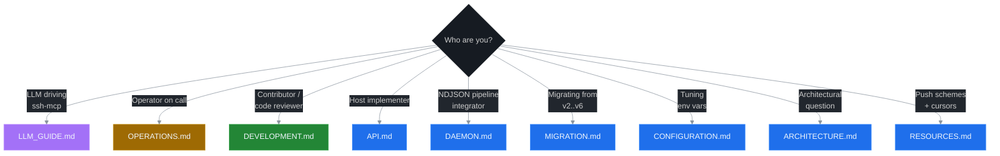

# ssh-mcp Documentation

Directory index. Every doc has a single, well-defined audience.

## Files

| File | Purpose |
|---|---|
| [ARCHITECTURE.md](./ARCHITECTURE.md) | Hexagonal layout, v5/v6/v7 layers (lifecycle / mux / LLM UX / daemon / serial / resume / rsync hybrid), per-module map, sequence diagrams. |
| [API.md](./API.md) | All 39 MCP tools (38 without `port_forward`) — inputs, outputs, structured content, error codes. |
| [RESOURCES.md](./RESOURCES.md) | Seven push schemes (`shell` · `command` · `transfer` · `session` · `forward` · `serial` · `rsync`), cursor + sequence semantics, `_meta` envelope, `resources/templates/list`. |
| [CONFIGURATION.md](./CONFIGURATION.md) | Full env-var table with floors, caps, and tuning profiles (verbose shells, many subscribers, low-RAM, real-time UX, rsync probe). |
| [LLM_GUIDE.md](./LLM_GUIDE.md) | Single canonical LLM doc — golden rules, 27B / 70B root prompts, prompts catalogue, anti-patterns, full 46-code error handbook. |
| [OPERATIONS.md](./OPERATIONS.md) | Symptom → cure runbook, wire-format error envelope, per-tool error catalogue, recovery sequence diagrams, diagnostic toolbox. |
| [DEVELOPMENT.md](./DEVELOPMENT.md) | Build / test / clippy gates, lock-free invariants, hot-path sequence diagrams (lifecycle CAS, mux drain, debouncer), Cargo features. |
| [DAEMON.md](./DAEMON.md) | `ssh-mcp-tail` reference — NDJSON op and event schema, architecture, shutdown sequence, composition recipes. |
| [MIGRATION.md](./MIGRATION.md) | Migration paths: v2 → v3 → v4 → v5 → v6.0 → v6.1 → v7.0. |
| [adr/](./adr/) | Eleven architecture decision records (`0001` rmcp · `0002` hexagonal · `0003` lifecycle · `0004` mux+sub_id · `0005` LLM UX · `0006` backpressure · `0007` errors · `0008` daemon · `0009` serial · `0010` SFTP resume · `0011` rsync hybrid transport). |
