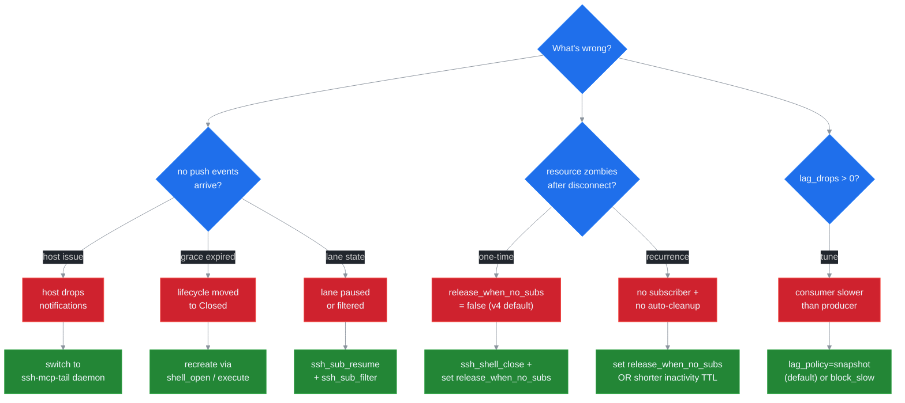

# Troubleshooting ssh-mcp v5

This guide is **operator-facing**: if you run `ssh-mcp` (HTTP), `ssh-mcp-stdio`, or `ssh-mcp-tail`, and a workflow misbehaves, find your symptom in the table of contents below and follow the diagnosis flow. The cures cite the canonical ADRs and the doc references where the design intent lives.

This document is **forthcoming** for v5.0 sections that depend on Phase 2 / 3 / 4 of the v5 roadmap (the channel mux, the new tools, the daemon binary). The diagnosis steps for v4-equivalent symptoms work today on `master`; the v5-specific steps activate as the relevant phases land.



## Table of contents

1. [Subscriber receives no push events](#1-subscriber-receives-no-push-events)
2. [Shell becomes a zombie after caller disconnects](#2-shell-becomes-a-zombie-after-caller-disconnects)
3. [`lag_drops > 0` in subscriber stats](#3-lag_drops--0-in-subscriber-stats)
4. [`ssh_subscribe` returns `RESOURCE_GONE`](#4-ssh_subscribe-returns-resource_gone)
5. [Cascade disconnect closes session unexpectedly](#5-cascade-disconnect-closes-session-unexpectedly)
6. [Stuck transfer (`bytes_transferred` not advancing)](#6-stuck-transfer-bytes_transferred-not-advancing)
7. [High CPU under load](#7-high-cpu-under-load)
8. [High memory under load](#8-high-memory-under-load)
9. [Daemon process orphans on shutdown](#9-daemon-process-orphans-on-shutdown)
10. [Diagnostic toolbox](#diagnostic-toolbox)
11. [When to file a bug](#when-to-file-a-bug)

## 1. Subscriber receives no push events

**Symptom.** A host called `ssh_subscribe` (or the legacy `resources/subscribe`), the call returned a `sub_id`, and yet no `notifications/resources/updated` (or NDJSON `push` events) reach the consumer.

### Causes

1. **Host does not surface `notifications/resources/updated` to the LLM.** Claude Code CLI (as of 2026-Q1) and several IDE integrations accept the protocol but never deliver push notifications as conversation context to the model. The MCP server is emitting them; the host is dropping them on the floor.
2. **Subscription was closed by peer GC.** The peer-GC task scans the subscription registry every `SSH_MCP_PEER_GC_INTERVAL_S` (default 30 s) and drops peers whose rmcp transport closed. A reconnecting client gets a fresh `PeerId`; the old `sub_id` is dead.
3. **Lifecycle moved to `Releasing` without a re-subscribe inside the grace window.** When the last subscriber on a `release_when_no_subs=true` resource unsubscribed, the grace timer started counting down (`SSH_LIFECYCLE_GRACE_MS`, default 2000 ms). A new `subscribe` after the grace expired returns `RESOURCE_GONE`.
4. **Filter excludes everything.** The lane has a regex / level filter that rejects every event before it hits the mpsc.
5. **Lane is paused.** A prior `ssh_sub_pause` call suspended the drain loop. Producer is still emitting; the lane mpsc fills under its lag policy.

### Diagnosis

Run, in order:

```text
ssh_sub_list                          # find your sub_id; check uri matches
ssh_sub_stats(sub_id=...)             # look at events_sent / lag_drops / queue_depth
ssh_daemon_stats                      # global view; confirm the mux is forwarding events
```

If `events_sent > 0` but the consumer sees nothing, the host or transport is dropping the notification. Inspect with `mcp-inspector` or `wireshark` against `ssh-mcp` HTTP. If `events_sent == 0`, the lane is idle — check the filter, the pause state, and the lifecycle.

Quick `RUST_LOG` invocation to surface the debouncer / mux behaviour:

```bash
RUST_LOG=ssh_mcp=debug,ssh_mcp::adapters::subscription=trace ssh-mcp-stdio
```

### Cure

| Cause | Cure |
|---|---|
| Host drops notifications | Switch to `ssh-mcp-tail daemon` and consume NDJSON push events directly. See [`docs/INSTRUCTIONS_DAEMON.md`](./INSTRUCTIONS_DAEMON.md). |
| Peer GC swept the sub | Re-subscribe with the right `uri`. Track `sub_id`s in your host state and refresh on reconnect. |
| Grace window expired | Recreate the resource via `ssh_shell_open` / `ssh_execute` / `ssh_upload`. |
| Filter too strict | Hot-reload via `ssh_sub_filter` with a less restrictive pattern. |
| Lane paused | Call `ssh_sub_resume` on the `sub_id`. |

### References

- [ADR 0003 — Lifecycle Binding](./adr/0003-lifecycle-binding.md) — grace timer semantics.
- [ADR 0004 — Channel Mux + SubId](./adr/0004-channel-mux-fairness.md) — per-lane filter / pause / resume.
- [ADR 0008 — NDJSON Daemon Protocol](./adr/0008-ndjson-daemon-protocol.md) — fallback when the host drops notifications.

## 2. Shell becomes a zombie after caller disconnects

**Symptom.** A long-running shell (`shell://<id>/output`) keeps consuming a russh channel after the original caller's transport closed. `ssh_list_sessions` shows the session; `ssh_list_commands` does not show the shell because shells are not commands. The PTY is still allocated on the remote.

### Causes

1. **`release_when_no_subs = false`** on `ssh_shell_open` (the v4-compatible default in v5.0). The lifecycle layer never auto-releases. Manual `ssh_shell_close` is required.
2. **The host did not subscribe.** A 27B-class model occasionally opens a shell, hot-polls `ssh_shell_read`, and never registers a `resources/subscribe`. With no subscriber the resource stays in the `Owned` state indefinitely (unless `release_when_no_subs = true`).
3. **Inactivity TTL has not yet fired.** The shell's idle reaper kicks in after `SSH_SHELL_INACTIVITY_TTL_SECS` of zero PTY traffic. A shell with steady output bypasses the TTL.
4. **`active_refs` on the session is greater than zero.** A second observed shell on the same session keeps the session alive; the zombie shell's parent never enters `Releasing`.

### Diagnosis

```text
ssh_list_sessions                     # confirm session is alive
ssh_sub_list(filter_by_uri=shell://*) # any subscriber on the zombie shell?
ssh_sub_stats(sub_id=...)             # if a sub exists: any events_sent?
```

A zombie shell typically shows: session alive, zero subs on its `shell://` URI, output still flowing if you do `ssh_shell_read(shell_id, wait=false)`.

### Cure

Pick the path that matches your host:

| Situation | Cure |
|---|---|
| One-time cleanup | `ssh_shell_close(shell_id)` then `ssh_disconnect(session_id)` (or `ssh_disconnect_agent(agent_id)` to wipe a logical group). |
| Prevent recurrence | Pass `release_when_no_subs=true` on every `ssh_shell_open` call from the host's prompt. The shell will auto-close after the grace timer when the last subscriber leaves. |
| Reduce idle TTL | Lower `SSH_SHELL_INACTIVITY_TTL_SECS` so even non-flagged shells are reaped faster. |
| Audit subscriptions | The `subscription_hygiene_audit` prompt at [`docs/llm-ux/PROMPTS_CATALOG.md`](./llm-ux/PROMPTS_CATALOG.md) (forthcoming) automates the audit-and-close loop. |

### References

- [ADR 0003 — Lifecycle Binding](./adr/0003-lifecycle-binding.md) — refcount + grace timer.
- [ADR 0005 — LLM UX Priorities](./adr/0005-llm-ux-priorities.md) — `SUB_LEAK_RISK` warning.
- [`docs/llm-ux/ANTIPATTERNS.md`](./llm-ux/ANTIPATTERNS.md) (forthcoming) — leak-on-error pattern.

## 3. `lag_drops > 0` in subscriber stats

**Symptom.** `ssh_sub_stats` reports `lagged_drops` greater than zero, or NDJSON `lagged` events appear on the daemon stdout. Events are being dropped under the lane's lag policy.

### Causes

1. **Consumer is slower than producer.** A tight `tail -f` loop on a noisy log fills the lane mpsc (`SSH_LANE_BUFFER`, default 1024) faster than the consumer drains.
2. **Filter pipeline downstream is slow.** A `jq` filter or a downstream sink (vector, fluentbit) backpressures the daemon's outbound writer. The mux backlog grows; lanes fall back to their lag policy.
3. **Wrong `lag_policy` for the workload.** `BlockSlow` pegs the producer at the consumer's rate (no drops, but latency grows). `DropOldest` / `DropNewest` drop events. `Snapshot` rebuilds from the per-resource ring buffer (zero loss as long as the buffer covers the gap).

### Diagnosis

```text
ssh_sub_stats(sub_id=...)
  # look at:
  #   queue_depth         (how full the lane is right now)
  #   queue_high_watermark (peak occupancy)
  #   lagged_drops        (cumulative drops)
  #   lagged_recoveries   (snapshot rebuilds completed)
  #   block_total_ms      (cumulative BlockSlow waits)
ssh_daemon_stats
  # mux_queue_depth: outbound backlog
```

A lane with `queue_high_watermark = SSH_LANE_BUFFER` and growing `lagged_drops` is overflowing; pick a different policy or reduce production rate.

### Cure

| Symptom | Cure |
|---|---|
| Drops on a monitoring lane | Switch to `lag_policy=snapshot` (the v5.0 default). The lane drops backlog and rebuilds via the per-resource ring buffer; the consumer sees a `snapshot` event with the live tail. |
| Drops on an audit / forensic lane | Switch to `lag_policy=block_slow`. Producer pauses until consumer drains. Set `SSH_BP_BLOCK_TIMEOUT_MS` if you need a hard ceiling. |
| Drops on a fast monitoring lane that wants gap markers | `lag_policy=drop_oldest` keeps the freshest events; `lagged` markers tell the consumer how many were lost. |
| Consumer downstream is slow | Profile the downstream sink. Add a buffer (kafka, vector). Filter server-side via `ssh_sub_filter` to reduce production rate. |

### References

- [ADR 0006 — Backpressure Policies](./adr/0006-backpressure-policies.md) — full per-fronteira matrix and policy table.
- [`docs/INSTRUCTIONS_DAEMON.md`](./INSTRUCTIONS_DAEMON.md) — Backpressure section.

## 4. `ssh_subscribe` returns `RESOURCE_GONE`

**Symptom.** A subscribe op returns `REASON: [RESOURCE_GONE] Resource closed (lifecycle Releasing/Closed)` with `DETAIL: recreate via ssh_shell_open / ssh_execute / ssh_upload.` The host expected the resource to still be alive.

### Causes

1. **Grace timer expired between create and subscribe.** A resource was created with `release_when_no_subs=true` and `SSH_LIFECYCLE_OWN_GRACE_MS` elapsed before any subscriber attached. The lifecycle moved `Owned -> Releasing -> Closed`.
2. **Last unsubscribe + grace timer.** A previous `ssh_unsubscribe` was the last subscriber; the grace timer fired before re-subscribe.
3. **Cascade close.** The parent session was disconnected; every owned resource cascaded to `Closed`.
4. **Manual close.** `ssh_shell_close` / `ssh_cancel_command` was called.

### Diagnosis

```text
ssh_list_sessions            # is the parent session still alive?
ssh_list_commands            # for command:// URIs
# the absence of the resource confirms it has been Closed
```

Check `RUST_LOG=ssh_mcp::adapters::lifecycle=trace` for the CAS edges that fired (`Owned -> Releasing`, `Releasing -> Closed`).

### Cure

Recreate the resource and subscribe immediately. Specifically:

- For shells: `ssh_shell_open(...)` + `ssh_subscribe(uri="shell://<new>/output", ...)` in the same workflow.
- For commands: re-run `ssh_execute(...)`. Note that re-running is not idempotent for side-effect commands; this is a design choice — the resource lifecycle does not stash exit-code history past `Closed`.
- For transfers: re-issue `ssh_upload` / `ssh_download`.

To prevent recurrence:

| Pattern | Prevention |
|---|---|
| Subscribe-after-create race | Issue `ssh_subscribe` immediately after the create call, in the same turn. The grace window is by default 2 s; subscribe within that window. |
| Long-lived `Owned` without subscriber | Set `release_when_no_subs=false` on resources you intend to keep alive without observing. |
| Re-subscribe after disconnect | Track the `sub_id` and `uri`. On reconnect, resubscribe to the same URI within `SSH_LIFECYCLE_GRACE_MS`. |

### References

- [ADR 0003 — Lifecycle Binding](./adr/0003-lifecycle-binding.md) — state machine.
- [ADR 0007 — Error Taxonomy](./adr/0007-error-taxonomy.md) — `RESOURCE_GONE` row.

## 5. Cascade disconnect closes session unexpectedly

**Symptom.** `ssh_disconnect(session_id)` was issued; the session and its observed shells closed; a different session, or a shell on the same session that the operator did not intend to close, was also closed.

### Causes

1. **Operator confused two sessions.** `ssh_list_sessions` may show stale entries; double-check the `session_id` before disconnecting.
2. **Cascade close on the parent session.** A disconnect on a session always cascade-closes every owned shell, command, and transfer. This is by design — see [ADR 0003](./adr/0003-lifecycle-binding.md).
3. **`active_refs` underflow bug.** Theoretical only; surfaces as `SESSION_REFCOUNT_UNDERFLOW` (an `INTERNAL` category error). If you see this code, file a bug — the lifecycle adapter is signalling that something tried to decrement a refcount past zero.
4. **`ssh_disconnect_agent(agent_id)`** wipes every session under that `agent_id`. If multiple sessions share an `agent_id`, all of them close.

### Diagnosis

Check the session graph before disconnecting:

```text
ssh_list_sessions                   # which sessions exist
ssh_sub_list                        # which subs are bound to each
ssh_list_commands                   # which commands per session
```

After the disconnect, check the structured logs for `SESSION_REFCOUNT_UNDERFLOW`:

```bash
grep SESSION_REFCOUNT_UNDERFLOW /var/log/ssh-mcp.log
```

If the cascade closed more than expected, the most likely cause is an `agent_id` shared across sessions.

### Cure

| Cause | Cure |
|---|---|
| Wrong `session_id` | Use `ssh_list_sessions` to confirm; cancel the next disconnect. |
| Shared `agent_id` | Use distinct `agent_id`s for distinct logical scopes. |
| `SESSION_REFCOUNT_UNDERFLOW` | File a bug with the structured logs (see [When to file a bug](#when-to-file-a-bug)). |

### References

- [ADR 0003 — Lifecycle Binding](./adr/0003-lifecycle-binding.md) — cascade through `SessionLifecycle.active_refs`.
- [ADR 0007 — Error Taxonomy](./adr/0007-error-taxonomy.md) — `SESSION_REFCOUNT_UNDERFLOW` (`INTERNAL` category).

## 6. Stuck transfer (`bytes_transferred` not advancing)

**Symptom.** `ssh_get_transfer_progress` shows `bytes_transferred` stuck at a single value across multiple polls. `transfer://<tid>/progress` push events stop arriving. The remote file is incomplete.

### Causes

1. **Network stall.** TCP backpressure on the underlying socket; russh recv window is full.
2. **Remote disk full.** SFTP `STATUS_NO_SPACE_LEFT_ON_DEVICE`; the daemon would emit `SFTP_ERROR` with the underlying message in `DETAIL:` if the remote signalled the error.
3. **Remote process killed.** OOM, signal; the SFTP session detects EOF and emits `SFTP_ERROR`.
4. **Subscribe missing.** The transfer is alive (the bytes are flowing on the wire); the subscriber lane mpsc is paused (`ssh_sub_pause`) or has a filter that excludes progress events. The transfer is fine; observability is broken.

### Diagnosis

```text
ssh_get_transfer_progress(tid=..., wait=false)   # snapshot current state
ssh_sub_stats(sub_id=...)                         # if subscribed: events_sent stuck?
```

Check the live SSH connection on the remote side (`netstat`, `ss` on the remote, `iftop` on the local).

### Cure

| Cause | Cure |
|---|---|
| Network stall | Wait; `russh` will resume when TCP recovers. If hard-stalled > 60 s, cancel and retry. |
| Disk full / remote error | Check `/var/log/ssh-mcp.log` for `SFTP_ERROR`; address the remote condition; restart the transfer. |
| Subscribe broken | `ssh_sub_resume`, then `ssh_sub_filter` to reset filter, then `ssh_sub_replay` from the last seen cursor. |

### References

- [ADR 0007 — Error Taxonomy](./adr/0007-error-taxonomy.md) — `SFTP_ERROR` (`REMOTE` category, retry conditional).

## 7. High CPU under load

**Symptom.** `top` shows `ssh-mcp` (or `ssh-mcp-tail`) consuming an unexpected percentage of CPU. `tokio-console` shows a busy task.

### Causes

1. **Hot poll on `ssh_shell_read`** from a misbehaving 27B-class model. Every call is a tool round trip; the loop saturates the dispatcher.
2. **Debouncer storm.** A noisy resource (e.g. `tail -f` on a fast log) producing more than `1000 / SSH_NOTIFY_DEBOUNCE_MS` events per second results in `1000 / SSH_NOTIFY_DEBOUNCE_MS` debounce dispatches per second — bounded but not zero. With many subscribers, the per-lane fan-out adds linear cost.
3. **Mux fairness loop spinning.** A bug in the round-robin would manifest as a busy `ChannelMux` task. Loom invariant tests (`tests/lockfree_invariants.rs`) cover this; any regression is a bug.
4. **Filter regex catastrophic backtracking.** A user-supplied regex with `.*.*` patterns can make filtering O(n²) per line.

### Diagnosis

```bash
RUST_LOG=ssh_mcp=debug ssh-mcp-stdio
# correlate spikes with debouncer logs

# tokio-console (if compiled with the tokio-console feature)
tokio-console
```

The `ssh_daemon_stats` event surfaces the mux backlog and the debouncer pace; correlate with the symptom.

### Cure

| Cause | Cure |
|---|---|
| Hot poll | Update the host's prompt to use `ssh_subscribe` instead of `ssh_shell_read` in a loop. The 5 golden rules at [`docs/llm-ux/GOLDEN_RULES.md`](./llm-ux/GOLDEN_RULES.md) (forthcoming) cover this. |
| Debouncer storm | Increase `SSH_NOTIFY_DEBOUNCE_MS` (default 50 ms; try 100–200 ms for noisy resources). |
| Mux loop spinning | File a bug; capture `tokio-console` profile and `ssh_daemon_stats`. |
| Regex backtracking | Replace the filter with a simpler pattern; consider a level filter instead of regex. |

### References

- [ADR 0005 — LLM UX Priorities](./adr/0005-llm-ux-priorities.md) — "never hot-poll" golden rule.
- [`docs/LOCKS.md`](./LOCKS.md) — lock-free invariants under `Cargo.toml [lints.clippy]`.

## 8. High memory under load

**Symptom.** RSS grows over time; `ssh_daemon_stats` shows growing `events_sent_total` but flat `lagged_drops_total`. Memory does not free.

### Causes

1. **Per-resource ring buffers sized too high.** `SSH_SHELL_MAX_BUFFER` × N shells. Default 1 MB × 100 shells = 100 MB just for shells.
2. **Per-lane mpsc buffers stuck full.** With `SSH_LANE_BUFFER = 1024` events × 200 subs × ~256 bytes per event = ~50 MB. If a sub never drains, its lane caps at this size.
3. **Idempotency cache.** `SSH_IDEMPOTENCY_MAX_ENTRIES` (default 10000) × ~512 bytes per entry = ~5 MB.
4. **Subscriber stats.** ~200 bytes per `SubscriberStats` × 65000 subs = ~13 MB.

### Diagnosis

```text
ssh_daemon_stats
  # active_subs                — number of lanes
  # active_sessions            — number of sessions
  # events_sent_total          — global production rate (with timestamps, derive rate/s)
  # mux_queue_depth            — outbound backlog
ssh_sub_stats(sub_id=...)     # per-lane queue_depth + queue_high_watermark
```

A lane with `queue_high_watermark` close to `SSH_LANE_BUFFER` is hoarding memory.

### Cure

| Cause | Cure |
|---|---|
| Ring buffers too large | Lower `SSH_SHELL_MAX_BUFFER` / `SSH_COMMAND_MAX_BUFFER_SIZE` for the workload. Trade off: smaller buffer means snapshot rebuilds may not cover the gap; expect more `LAG_DETECTED` warnings. |
| Stuck lanes | Use `ssh_sub_list` to find lanes with high `queue_depth`; resume them, switch their `lag_policy` to `snapshot`, or unsubscribe and recreate. |
| Idempotency cache | Lower `SSH_IDEMPOTENCY_MAX_ENTRIES` or `SSH_IDEMPOTENCY_TTL_SECS`. |
| Stats overhead | If you are running 65000+ subs on a single daemon, partition into multiple daemon processes (each is single-tenant in v5.0). |

### References

- [ADR 0006 — Backpressure Policies](./adr/0006-backpressure-policies.md) — per-fronteira state matrix.

## 9. Daemon process orphans on shutdown

**Symptom.** `ssh-mcp-tail daemon` was killed (SIGTERM, parent process death), but the process is still alive in `ps`, or remote SSH sessions are not torn down.

### Causes

1. **`SSH_GRACE_HARD_TIMEOUT_S` not yet expired.** The drain sequence runs: LineReader exits, Dispatcher exits, broadcast cancel, per-session `ssh_disconnect`, embed server task abort, EventMux flush, stdout close, exit 0. The default budget is 30 s; a slow remote disconnect can fill this.
2. **Hung russh recv loop.** A remote sshd that does not respond to channel close keeps a russh task pinned; the daemon's drain blocks on that task.
3. **stdout SIGPIPE not handled.** If the consumer of NDJSON closed its pipe but the daemon is mid-write on a buffered line, the kernel SIGPIPE kills the daemon — which is the correct behaviour. If the daemon is hung instead, the SIGPIPE handler is misconfigured.

### Diagnosis

```bash
# inspect the process tree
ps -ef --forest | grep ssh-mcp-tail

# check the daemon's journal-equivalent
RUST_LOG=ssh_mcp=debug,ssh_mcp_tail=trace ssh-mcp-tail daemon

# correlate with the operator's expected drain time
```

If the process exits within `SSH_GRACE_HARD_TIMEOUT_S` (default 30 s), the behaviour is by design — wait. If it exceeds the budget by a lot, the russh layer or the embed server has a hang.

### Cure

| Cause | Cure |
|---|---|
| Within drain budget | Wait. The drain is bounded; the process exits at the deadline at the latest. |
| Beyond drain budget | `kill -9 <pid>` and capture a `tokio-console` snapshot (or a flamegraph) for the hung task. File a bug. |
| Custom shutdown semantics | Lower `SSH_GRACE_HARD_TIMEOUT_S` for faster ungraceful exit; raise for slower-but-cleaner cleanup. |

### References

- [ADR 0008 — NDJSON Daemon Protocol](./adr/0008-ndjson-daemon-protocol.md) — Backpressure and shutdown section.

## Diagnostic toolbox

A short reference of the tools that pay back the time invested in learning them.

### `RUST_LOG`

Every binary respects `RUST_LOG` for `tracing` filtering. Useful targets:

| Target | What you see |
|---|---|
| `ssh_mcp=debug` | High-level use-case dispatch + adapter internals. |
| `ssh_mcp::adapters::lifecycle=trace` | Lifecycle CAS edges (`Owned -> Observed`, `Releasing -> Closed`, ...). |
| `ssh_mcp::adapters::subscription=trace` | Per-lane mpsc behaviour, debouncer flushes, snapshot rebuilds. |
| `ssh_mcp::adapters::ssh::internal::client=debug` | russh handshake + auth chain decisions. |
| `ssh_mcp_tail=debug` | Daemon dispatch loop + stdout writer. |

Layered example:

```bash
RUST_LOG=ssh_mcp=info,ssh_mcp::adapters::lifecycle=trace ssh-mcp-stdio
```

### `ssh_daemon_stats`

Global counters across every active session, sub, and lane. Expose:

- `active_sessions`, `active_subs`
- `events_sent_total`, `lagged_drops_total`, `lagged_recoveries_total`
- `mux_queue_depth`, `peer_gc_pace_per_min`
- `rejected_ops_total`, `rejected_ops_by_code`

Available via `ssh_daemon_stats` MCP tool, and auto-emitted on the NDJSON stream every `SSH_DAEMON_STATS_INTERVAL_S` (default 60 s).

### `ssh_sub_stats`

Per-`sub_id` snapshot (atomic counters; lock-free read). Fields:

- `events_sent`, `bytes_sent`
- `lagged_drops`, `lagged_recoveries`
- `queue_depth`, `queue_high_watermark`
- `block_total_ms` (cumulative `BlockSlow` waits)

Use this when a single workflow misbehaves and you have its `sub_id`. The full list of stats is in [ADR 0004](./adr/0004-channel-mux-fairness.md) and [ADR 0006](./adr/0006-backpressure-policies.md).

### `ssh_list_sessions` / `ssh_list_commands`

Existing v4 tools. Useful to confirm which sessions / commands are alive before issuing a `disconnect` or a cascade-impacting op.

### `jq` filters for daemon NDJSON

A short library of filter recipes for daemon stdout:

```bash
# Only push events
jq 'select(.ev=="push")' < daemon.ndjson

# Pushes per sub_id, count
jq -s 'group_by(.sub_id) | map({sub_id: .[0].sub_id, count: length})' \
  < <(jq 'select(.ev=="push")' daemon.ndjson)

# Errors only
jq 'select(.ev=="err")' < daemon.ndjson

# Warnings + errors
jq 'select(.ev=="warn" or .ev=="err")' < daemon.ndjson

# Completed commands with non-zero exit
jq 'select(.ev=="completed" and .exit != 0)' < daemon.ndjson

# Heartbeat-only (alive check)
jq 'select(.ev=="heartbeat") | .ts' < daemon.ndjson
```

### `mcp-inspector`

The reference MCP client. Use it to diff what the server emits against what your host receives. If `mcp-inspector` shows `notifications/resources/updated` arriving and your host does not deliver them to the LLM, the host is the issue.

### `tokio-console`

Useful for diagnosing hung tasks (high CPU, daemon shutdown stalls). Compile with the appropriate feature; connect locally; identify the busy task.

### `cargo test --features test-fixtures`

Runs the use-case tests against deterministic in-memory adapters (`FakeClock`, `DeterministicIdGen`). When a production bug looks lifecycle-shaped, replicate it under the fixtures to bisect.

## When to file a bug

File a bug when:

1. You see an `INTERNAL` category error code (`LIFECYCLE_STATE_CONFLICT`, `SESSION_REFCOUNT_UNDERFLOW`, `STORAGE_ERROR`, `INTERNAL_ERROR`). These signal an invariant violation; the code is defensive on purpose.
2. A documented invariant from [`docs/LOCKS.md`](./LOCKS.md) appears to be violated (deadlock, livelock, observable Mutex on a hot path).
3. A wire format change is observed without a corresponding ADR (e.g. an unknown `ev` in NDJSON whose shape is undocumented).
4. A loom invariant test under `tests/lockfree_invariants.rs` regresses (Phase 5 commits ≥4 new loom tests for the v5 lifecycle and channel mux).
5. The daemon hangs past `SSH_GRACE_HARD_TIMEOUT_S` on shutdown.

Capture, in the bug report:

- ssh-mcp version (e.g. `v5.0.0-rc1` or branch + commit SHA).
- The exact tool / op call sequence that reproduces the issue.
- `RUST_LOG=ssh_mcp=debug` output for the relevant time window.
- `ssh_daemon_stats` snapshot at the moment of the issue.
- The wire response or NDJSON event that surprised you.
- Reproducer (shell script or Rust test) ideally.

The bug template under `.github/ISSUE_TEMPLATE/bug_report.md` (forthcoming) drives this checklist.

## See also

- [`docs/MIGRATION_v4_to_v5.md`](./MIGRATION_v4_to_v5.md) — host migration guide.
- [`docs/INSTRUCTIONS_DAEMON.md`](./INSTRUCTIONS_DAEMON.md) — `ssh-mcp-tail` reference.
- [`docs/llm-ux/ERROR_HANDBOOK.md`](./llm-ux/ERROR_HANDBOOK.md) (forthcoming) — every wire code, every cure.
- [`docs/llm-ux/ANTIPATTERNS.md`](./llm-ux/ANTIPATTERNS.md) (forthcoming) — common LLM-driven failure modes.
- [`docs/LOCKS.md`](./LOCKS.md) — lock-free invariants enforced by Clippy.
- [ADR 0003 — Lifecycle Binding](./adr/0003-lifecycle-binding.md).
- [ADR 0004 — Channel Mux + SubId](./adr/0004-channel-mux-fairness.md).
- [ADR 0006 — Backpressure Policies](./adr/0006-backpressure-policies.md).
- [ADR 0007 — Error Taxonomy](./adr/0007-error-taxonomy.md).
- [ADR 0008 — NDJSON Daemon Protocol](./adr/0008-ndjson-daemon-protocol.md).
