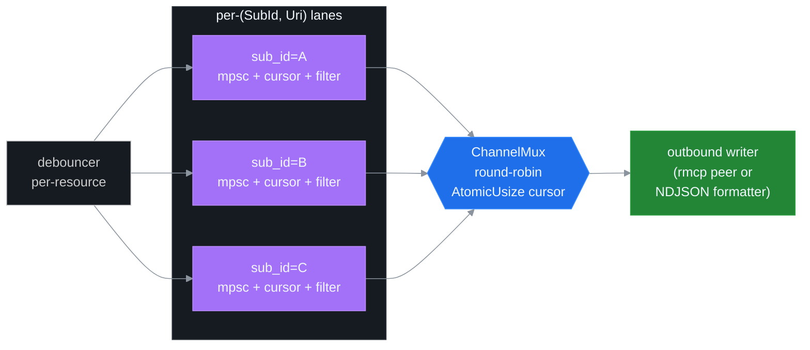
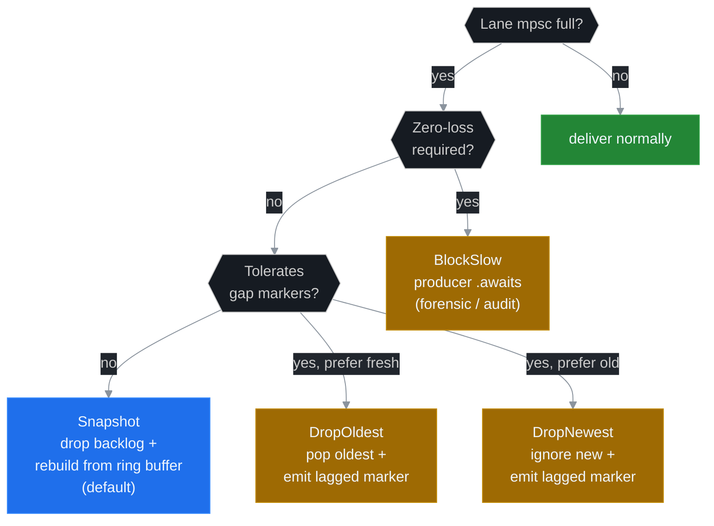

# ADR 0004: Channel Mux + SubId for Subscriber Isolation

## Status

Proposed (v5.0.0). Implementation tracked under Phase 2 of the v5 roadmap. Depends on ADR 0003 (Lifecycle Binding).

## Context

The v4 `MemoryRegistry` keys per-peer state on `(PeerId, Uri)`. Each peer has at most one logical subscription per URI, and the registry only tracks a byte cursor and a sequence ceiling. This is sufficient when the host is a single MCP client (Claude Desktop, mcp-inspector, …) consuming push notifications and reconciling via `resources/read?cursor=auto`.

Phase 4 of v5 introduces an embedded NDJSON daemon (`ssh-mcp-tail`) that runs an in-process MCP client + server pair across a `tokio::io::duplex` transport. Multiple consumers connect to the same daemon — a single peer fans events out to N independent NDJSON consumers, each with its own filter, lag policy, lifetime, and read cadence. The (PeerId, Uri) key collapses these N consumers into one channel, which means:

- A slow consumer on subscriber A throttles fast consumer B.
- A filter regex installed by C pollutes events delivered to D.
- A pause issued by E cannot be rescinded for E without affecting F.
- Per-subscriber stats (events_sent, lag_drops, queue_depth) cannot be attributed.
- An unsubscribe from A cannot release-on-no-subs for the underlying resource because the cursor key cannot distinguish "no peer-A consumer left" from "no consumers anywhere".

Two designs were on the table:

1. **Keep `(PeerId, Uri)` and add per-peer fan-out client-side.** The peer (the daemon, the LLM host, …) receives one stream and is responsible for splitting it. Rejected because every consumer of the daemon would have to re-implement filter / lag / replay / pause; the server already has all the state; pushing fan-out client-side duplicates engineering and prevents server-side filtering optimisations.
2. **Introduce `SubId` as the canonical channel key.** Each `resources/subscribe` call (or `ssh_subscribe` tool call — Phase 3) returns a UUIDv7 `sub_id`. Cursor, filter, lag policy, mpsc lane, and lifecycle handle key on `(SubId, Uri)`. Selected.

## Decision

Replace the `(PeerId, Uri)` cursor key with `(SubId, Uri)`. Each subscription now has:

- Its own `Arc<AtomicU64>` byte cursor.
- Its own `mpsc::Sender<SubscriptionMessage>` lane.
- Its own `LagPolicy` (BlockSlow / DropOldest / DropNewest / Snapshot).
- Its own `Filter` pipeline (regex / level / passthrough; hot-reloadable).
- Its own `LifecycleHandle` (Phase 1 ResourceLifecycle).
- Its own `SubscriberStats` (events_sent, bytes_sent, lag_drops, queue_depth, …).

A new `ChannelMux` task owns a `DashMap<SubId, MultiplexLane>` plus an `AtomicUsize` round-robin cursor.

Drain loop:

1. Snapshot the active lanes via the DashMap iterator.
2. Park on `Notify` if no lanes are active.
3. Round-robin from `cursor_lane.load(Relaxed)`. For each lane in order, `try_recv`. First non-empty wins.
4. Forward the event to the outbound writer (rmcp peer, NDJSON formatter, …).
5. Bump `cursor_lane` to `(idx + 1) % lanes.len()` (wrapping). Park if no lane had work.

Fairness invariant: between any two adjacent lanes A and B that both have backlog, the mux drains them in alternation. A lane producing 10× faster than another will not starve the slower one because `cursor_lane` advances after every successful drain.

### LagPolicy enum

| Variant | Behaviour | When to use |
|---|---|---|
| `BlockSlow` | Producer (debouncer task) `.await`s until consumer drains. Zero loss, latency cost grows with lag. | Forensic / audit log capture. |
| `DropOldest` | Pop oldest event, push new. Emit `{"ev":"lagged","sub_id":...,"dropped":N}` marker. | Monitoring with gap tolerance. |
| `DropNewest` | Ignore new event. Emit lagged marker. | Rare; prefer historical context. |
| `Snapshot` (default) | Drop the lane's mpsc backlog. Next event triggers a `read_resource(uri, cursor=current_seq)` rebuild that returns the live snapshot from the ring buffer. Emit `{"ev":"snapshot","sub_id":...,"cursor":N,"delta":<bytes>}`. Zero loss as long as the ring buffer covers the gap. | Default — best tradeoff. |

### Stats surface

`SubscriberStats` carries atomic counters that read lock-free via `.load(Relaxed)`:

| Field | Atomic | Use |
|---|---|---|
| `events_sent` | `AtomicU64` | total push events delivered |
| `bytes_sent` | `AtomicU64` | total bytes delivered |
| `lagged_drops` | `AtomicU64` | events dropped under lag policies |
| `lagged_recoveries` | `AtomicU64` | snapshot rebuilds completed |
| `queue_depth` | `AtomicUsize` | current mpsc length (sampled) |
| `queue_high_watermark` | `AtomicUsize` | max observed depth |
| `block_total_ms` | `AtomicU64` | cumulative time blocked (BlockSlow only) |

Exposed via the new `ssh_sub_stats` MCP tool (Phase 3).

### Operations on a SubId

The new tool surface introduced in Phase 3:

| Tool | Purpose |
|---|---|
| `ssh_subscribe` | Open a push channel. Returns `sub_id`. Accepts `lifetime` / `lag_policy` / `filter`. |
| `ssh_unsubscribe` | Close a push channel. Triggers grace timer if last subscriber on the URI and `release_when_no_subs = true` (ADR 0003). |
| `ssh_sub_pause` | Producer keeps emitting; consumer task suspends until resume. mpsc fills under the lane's lag policy. |
| `ssh_sub_resume` | Resume drain. |
| `ssh_sub_filter` | Hot-reload the lane's filter regex / level. |
| `ssh_sub_replay` | Re-emit from a chosen cursor (within the ring buffer window). |
| `ssh_sub_list` | Enumerate active sub_ids with summary stats. |
| `ssh_sub_stats` | Per-sub_id counter snapshot. |

The legacy `resources/subscribe` MCP path remains backward-compatible: it returns a `sub_id` synthesised by the registry, and the host can address the channel by sub_id going forward. Hosts that already use the v4 (PeerId-keyed) flow keep working — they receive notifications under `(PeerId, Uri)` semantics without addressing the new mux.

### Channel ownership and isolation

Each lane is a distinct `tokio::sync::mpsc::channel(N)` — bounded, single-producer (the per-resource debouncer), single-consumer (the lane's consumer task). Consumer tasks publish into the global `ChannelMux` mpsc that feeds the outbound writer. Cross-lane events never share queue capacity. A lane that drops events under `DropOldest` cannot affect another lane's delivery rate.

The DashMap chosen for the lane registry favours the typical workload (high churn on subscribe / unsubscribe in the daemon, low contention on iteration during drain). Iteration during drain locks one shard at a time, which is bounded; we re-iterate on every drain pass to pick up newly added lanes between passes.

### Resource lifecycle integration

When a sub_id is registered, `lifecycle_policy.on_subscribe(kind, resource_id)` from ADR 0003 fires. When the last sub_id on a `(kind, resource_id)` pair unsubscribes, `lifecycle_policy.on_unsubscribe` fires; the lifecycle layer decides whether to arm the grace timer based on the resource's policy (set at creation time).

Critically, the **resource policy is set by the resource's creator (open_shell / execute / upload / download)** — not by individual subscribers. A subscriber cannot extend or shorten the resource's lifetime. The subscriber controls only its own consumption (filter / lag / pause / replay). This separation prevents a misbehaving observer from terminating a critical resource that other observers still need.

## Consequences

### Positive

- **N independent consumers per peer.** The daemon binary (Phase 4) can fan out to many NDJSON consumers without server-side awareness of the fan-out — each gets its own sub_id with isolated state.
- **Per-channel filter, lag, replay.** Server-side filtering reduces useless event traffic on the slow consumer's lane without affecting fast consumers; replay from a cursor lets a reconnecting consumer recover without dropping the rest of the stream.
- **Fair scheduling.** The round-robin mux guarantees a slow consumer never starves a fast one and a fast consumer never monopolises the outbound writer.
- **Self-attributing stats.** Per-sub_id counters answer "who is lagging?" / "who is producing the most events?" without taking a single lock.

### Negative

- **Storage overhead grows linearly in N subs.** Each sub_id carries ~256 bytes of state (atomics, mpsc, policy). For 1024 active subscriptions that's ~256 KB; for 65 K subs (the per-tenant cap default) that's ~16 MB. Acceptable.
- **Cursor key migration.** All readers of `(PeerId, Uri)` cursor (peer_byte_cursor, advance_peer_byte_cursor) move to `(SubId, Uri)`. The change is local to `MemoryRegistry`; no public MCP tools expose the old key.
- **More lock-free state to verify.** Phase 5 adds 4 extra loom tests covering mux fairness, lane mpsc full + drop_oldest invariants, concurrent lane add/remove during drain, and cursor advance under contention.

### Neutral

- **Backwards compatibility is preserved by synthesis.** The v4 `resources/subscribe` flow auto-mints a sub_id behind the scenes; existing hosts don't need to know about it. The new tool surface is additive.
- **Multi-tenant scoping is left to a future ADR.** Today the daemon is single-tenant. When multi-tenant lands, scoping a sub_id to a tenant is a one-line `tenant_id` field on `Subscriber`.

## References

- [ADR 0003 — Lifecycle Binding](./0003-lifecycle-binding.md) — provides the refcount semantics this ADR keys on.
- [ADR 0006 — Backpressure Policies](./0006-backpressure-policies.md) — defines LagPolicy semantics in detail.
- [ADR 0008 — NDJSON Daemon Protocol](./0008-ndjson-daemon-protocol.md) — primary consumer of the channel mux.
- [docs/RESOURCES.md](../RESOURCES.md) — resource scheme contract.
- [docs/LOCKS.md](../LOCKS.md) — lock-free invariants.
