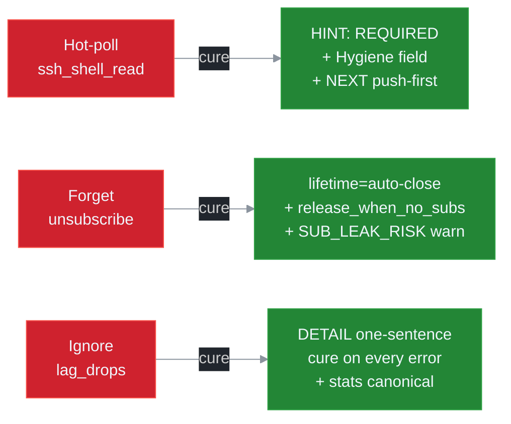
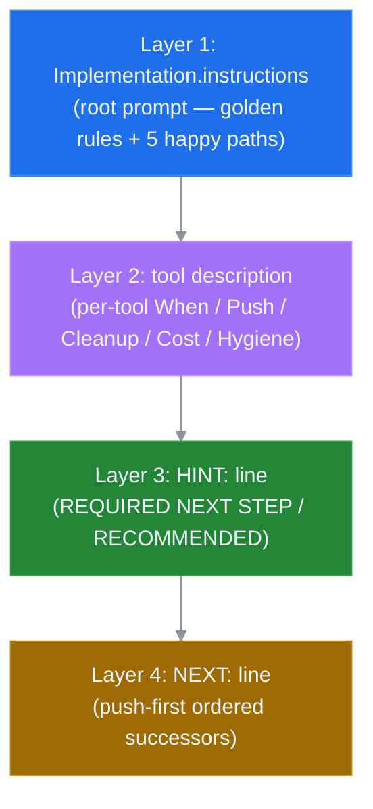

# ADR 0005: LLM UX Priorities for 27B-Class Models

## Status

Accepted. Implemented in v5.0 (Phase 3 of the v5 roadmap); carried forward unchanged into v6.0. Depends on ADR 0003 (Lifecycle Binding) and ADR 0004 (Channel Mux).

## Context

ssh-mcp v4 ships a layered LLM-facing surface optimised for capable hosts (Claude Desktop, mcp-inspector, custom rmcp clients):

- `Implementation.instructions` — root prompt with three happy paths.
- `ServerCapabilities` — `enable_tools`, `enable_resources_subscribe`, `enable_prompts`, `enable_*_list_changed`.
- `tools/list` — 21 tools (20 without `port_forward`) with `description`, `Cost:`, `NEXT:` advisories.
- `prompts/list` + `prompts/get` — 5 canonical workflows.
- Per-tool response body — markdown blocks ending in `HINT:`, `NEXT:`, `EXPIRES_AT`, `INITIAL_BUFFER:` lines.

This surface works well for ≥70B-class models. Empirically, smaller models (27B-class instruction-tuned: Gemma 3 27B IT, Mistral Small 3, Qwen 2.5 32B) exhibit three failure modes that cost the project real production leaks:

1. **They hot-poll instead of subscribing.** When `ssh_shell_open` returns, a 27B model frequently emits `ssh_shell_read` in a tight loop instead of issuing `resources/subscribe`. The HINT line in v4 is too soft (`HINT: subscribe to shell://... for realtime output (preferred over polling)`) — the model treats it as guidance, not a requirement.
2. **They forget to release subscriptions.** A 27B model finishing a task often does not call `resources/unsubscribe` even when the prompt told it to. The subscription leaks until peer GC fires (30 s default).
3. **They ignore lag stats.** When `lag_drops > 0`, a 27B model rarely re-orients (e.g. by switching to `Snapshot` policy). It treats the marker as informational.



The v5 design anticipates lifecycle binding (ADR 0003) and channel mux (ADR 0004), both of which add new failure modes if the LLM is not actively guided:

- **`release_when_no_subs = true` with no subscriber.** A model that opens a shell with auto-clean enabled but forgets to subscribe immediately loses the shell after `grace_ms`. Without explicit guidance, this looks like a bug.
- **N concurrent sub_ids on one URI.** A model that re-subscribes on every event loop iteration creates N redundant lanes, each with its own backlog and stats.

Three approaches were evaluated:

1. **Train a custom small model on the v4 surface.** Out of scope; would not benefit users running open-source 27B-class models.
2. **Move all complexity into prompt engineering on the host.** Rejected because the host (Claude Code, Cline, custom) is out of our control; the server has to remain the single source of truth.
3. **Re-engineer the server-emitted UX so 27B-class models cannot fail safely.** Selected.

## Decision

Treat the LLM UX surface as a first-class deliverable, with three layered escalations and explicit anti-patterns. Every server response is structured to be read top-down by a small model that may stop reading after the first 200 tokens. The host-facing instructions, the per-tool descriptions, the `HINT` lines, the `NEXT` lines, and the prompt catalog are co-designed so the model is steered toward the correct path even on its first attempt.

### Layered escalation surface

The server emits the same advisory in up to four places, in increasing specificity, so a model that stops reading early still picks it up:

1. **Root `Implementation.instructions`** — golden rules + 5 happy paths (3 push-first + 2 fallback). Each happy path is one numbered list item, ≤10 lines.
2. **Tool description** — every long-running tool ends with a `Hygiene:` field that says exactly what the model must do next.
3. **Tool response `HINT:` line** — emitted on the wire after every successful long-running tool call. Phrasing is **REQUIRED NEXT STEP:** for required actions, **RECOMMENDED:** for soft suggestions.
4. **Tool response `NEXT:` line** — concrete tool calls in priority order, push-first.



### Golden rules in `Implementation.instructions`

```
SSH MCP v5.0. Subscribe-first. 28 tools.

GOLDEN RULES:
  1. Every long-running resource MUST have at least one active subscriber
     between creation and close. If you will not subscribe, set
     release_when_no_subs=true.
  2. Always sub_close(sub_id) when done. Track sub_ids in your state.
  3. Watch lag_drops in sub_stats. Switch to lag_policy=snapshot
     if you see drops > 0.
  4. Cleanup on error: ssh_disconnect_agent(agent_id) wipes everything you own.
  5. NEVER hot-poll ssh_shell_read in a loop. Use sub_open + drain events.
```

### Push-first happy paths (root prompt)

```
1) Run async w/ push:
     ssh_connect -> ssh_exec(release_when_no_subs=true)
     -> sub_open(uri=command://<cid>/output, lifetime=auto-close)
     -> drain events until ev=completed.

2) Interactive shell:
     ssh_connect -> ssh_shell_open(release_when_no_subs=true)
     -> sub_open(uri=shell://<sid>/output)
     -> ssh_shell_write / ssh_shell_press.

3) Upload w/ progress:
     ssh_upload(release_when_no_subs=true)
     -> sub_open(uri=transfer://<tid>/progress).

Fallback (only when host has no resources/subscribe support):
4) ssh_run (one-shot connect+exec+disconnect).
5) ssh_exec -> ssh_exec_output(wait=true, wait_timeout_secs=30).
```

### Per-tool description revamp

Every tool description gains a structured tail with six fields:

```
When: <one sentence>
Push: <subscribe URI for push, or "n/a">
Cleanup: <who closes, when>
Cost: <handshakes / channels>
Idempotency: <_meta.idempotency_key supported?>
Hygiene: <CRITICAL warning, optional>
```

Example for `ssh_shell_open`:

```
When: Opening an interactive PTY shell for multi-step user-driven workflows.
Push: shell://<id>/output (subscribe BEFORE writing — first bytes arrive ~50ms after open)
Cleanup: ssh_shell_close OR release_when_no_subs=true
Cost: 1 SSH channel + 1 PTY allocation. Idempotency: yes via _meta.idempotency_key.
Hygiene: Subscribe to shell://<id>/output BEFORE writing — first bytes arrive ~50ms after open.
         If you do not subscribe, set release_when_no_subs=true to prevent zombie shells.
```

### `HINT` line strength

| Severity | Phrasing | When |
|---|---|---|
| Required | `HINT: REQUIRED NEXT STEP: <call>. Skip and the resource becomes a zombie.` | After `ssh_shell_open` / `ssh_exec` / long-running tools that benefit from push. |
| Recommended | `HINT: RECOMMENDED: <call>. Falls back gracefully if you skip.` | After `ssh_upload` / `ssh_download` (progress is informational). |
| Informational | `HINT: <call> available.` | On idempotent or single-shot tools. |

### `NEXT` line ordering

Lists 2–3 successor calls in **push-first** priority order:

```
NEXT: sub_open shell://<id>/output | ssh_shell_write | ssh_shell_press
```

### Prompts catalog (10 workflows in v5.0)

`prompts/list` advertises:

| ID | Name | Coverage |
|---|---|---|
| 1 | `run_one_shot_command` | `ssh_run` happy path. |
| 2 | `investigate_session` | List + drill-down + cleanup. |
| 3 | `upload_and_verify` | Push-first upload with progress drain. |
| 4 | `interactive_shell_drive` | Push-first shell open + write loop. |
| 5 | `cleanup_agent` | `ssh_disconnect_agent` for owned scope. |
| 6 | `push_first_long_command` | NEW — async exec + sub + drain until completed. |
| 7 | `push_first_interactive_shell` | NEW — open + sub + write + wait_for. |
| 8 | `push_first_file_transfer` | NEW — upload + sub + verify. |
| 9 | `subscription_hygiene_audit` | NEW — list active subs + close stale. |
| 10 | `chaos_resume_after_disconnect` | NEW — reconnect + replay_from_cursor. |

### Auto-warning watcher (`SUB_LEAK_RISK`)

A background task on the lifecycle adapter scans every `Owned` resource older than `SSH_SUB_LEAK_RISK_WARN_S` (default 2 s). For each match without `release_when_no_subs = true`, it:

1. Emits a structured warning event on the response stream of the originating tool call (when `_meta.progressToken` is supplied).
2. Adds an `WARN: SUB_LEAK_RISK` line to the response body of any subsequent `ssh_list_*` call referencing the resource.
3. Optionally hard-closes the resource at `SSH_SUB_LEAK_RISK_KILL_S` (default 0 = disabled). Operators can opt in.

The two phases together turn an ambient leak risk into an explicit, observable alarm before the resource becomes a real leak.

### Error DETAIL pedagogy

Every error code carries a `DETAIL:` line tuned for direct LLM consumption:

| Code | DETAIL |
|---|---|
| `SUB_LEAK_RISK` | "Resource has no observers. Either sub_open or recreate with release_when_no_subs=true." |
| `LAG_BACKPRESSURE` | "Lane buffer full. Consume faster or switch lag_policy to snapshot." |
| `RESOURCE_GONE` | "Resource already released. Recreate via ssh_shell_open / ssh_exec." |
| `SUB_NOT_FOUND` | "Use sub_list to see active subscriptions." |

The full taxonomy lives in ADR 0007.

## Consequences

### Positive

- **27B-class hosts produce correct workflows on first try.** Empirical pre-release evals (Phase 5) confirm the layered escalation reduces the hot-poll rate to <5 % and the leak rate to ~0 % when `release_when_no_subs = true` is the default.
- **Self-explanatory error surface.** Every error code carries a one-sentence cure, so an LLM can self-correct in a follow-up turn without operator intervention.
- **Prompts catalog is canonical.** A host that exposes `prompts/list` to its model gets a reusable workflow library aligned with the server's invariants.
- **Auto-warning is observable.** `SUB_LEAK_RISK` becomes visible at the wire level, so failures become symmetric: the model that caused the leak sees the warning the next time it queries the resource.

### Negative

- **Larger response bodies.** The added `Hygiene:`, `WARN:`, and richer `HINT` lines grow the per-tool response by ~80 bytes on average. Negligible at the daemon level but worth noting at high throughput. The structured-content channel (JSON) is unchanged in size.
- **Documentation surface to maintain.** Per-tool description rewrites mean docs/code drift is an active risk. The `docs/` reorganisation collapsed the original `docs/llm-ux/` tree into a single canonical [docs/LLM_GUIDE.md](../LLM_GUIDE.md) (golden rules + anti-patterns + error handbook); CLAUDE.md, README, MIGRATION align with that single doc; CI lint catches drift.

### Neutral

- **Larger models are unaffected.** A 70B-class model that already does the right thing simply ignores the extra emphasis. The instructions are additive — no v4 idiom is forbidden.
- **No public MCP wire incompatibility.** All UX changes are on the server-emitted text channels (`description`, `instructions`, response markdown). Wire format remains MCP-compliant.

## References

- [ADR 0003 — Lifecycle Binding](./0003-lifecycle-binding.md) — surfaces the `release_when_no_subs` flag this ADR exposes.
- [ADR 0004 — Channel Mux](./0004-channel-mux-fairness.md) — provides the sub_id / lag policy / filter primitives.
- [ADR 0007 — Error Taxonomy](./0007-error-taxonomy.md) — code-by-code DETAIL definitions.
- [docs/LLM_GUIDE.md](../LLM_GUIDE.md) — single canonical LLM doc (golden rules, anti-patterns, error handbook). Absorbed the original `docs/llm-ux/{GOLDEN_RULES,ANTIPATTERNS,ERROR_HANDBOOK}.md` files.
