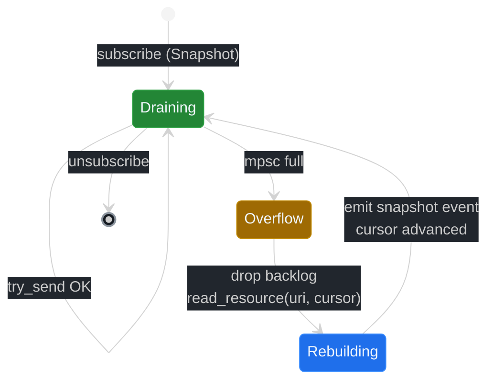
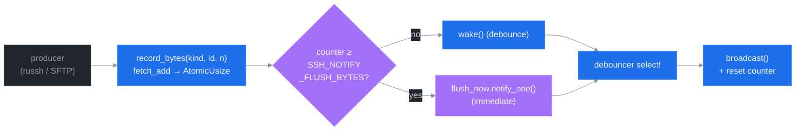

# ADR 0006: Backpressure Policies for Subscriber Lanes

## Status

Proposed (v5.0.0). Implementation tracked under Phase 2 of the v5 roadmap. Depends on ADR 0004 (Channel Mux).

**Amendment 1 (v5.1.0 — proposed):** Adds byte-threshold flush trigger to the debouncer fronteira plus per-call `flush_bytes` / `debounce` overrides on `sub_open`. Bumps debouncer defaults to **`200ms` coalesce** + **`64k` byte-threshold** and switches env-var interface from raw `*_MS`/`*_BYTES` integers to human-readable `Duration` (`200ms`, `1s`) and `ByteSize` (`64k`, `1m`) strings; legacy `*_MS` aliases remain accepted for one minor with a `DEPRECATED:` log nudge. See [Byte-threshold flush trigger](#byte-threshold-flush-trigger) and [Per-call overrides on `sub_open`](#per-call-overrides-on-sub_open).

## Context


ssh-mcp v4 surfaces backpressure at six points in the data path:

1. **russh recv** — TCP window flow control on the underlying socket. Out of our control; bounded by kernel.
2. **per-resource ring buffer** — `RunningShell.history` (`ArcSwap<RingBuffer>`), `RunningCommand.output_history` (`ArcSwap<OutputBuffer>`). Bounded by `max_buffer_size` per shell or `SSH_COMMAND_MAX_BUFFER_SIZE`. Head-drop on overflow with `compensate_truncation` cursor adjustment.
3. **debouncer task** — coalesces `next_seq + poke` events into one `notifications/resources/updated` per debounce window (`SSH_NOTIFY_DEBOUNCE_MS`, default 50 ms; force flush at `SSH_NOTIFY_FORCE_FLUSH_MS`, default 1 s).
4. **broadcast channel** (`output_tx`) — bounded by `SSH_*_BROADCAST_CAP`. Subscribers that fall behind surface `RecvError::Lagged`; recovery is to load a fresh snapshot from `output_history` and continue.
5. **rmcp transport buffer** — implicit; rmcp manages this.
6. **stdout writer** (in HTTP / stdio transports) — implicit OS buffer.

This works for a single peer per URI. With Phase 2's per-sub_id channel mux (ADR 0004), a new fronteira appears: each sub_id has its own bounded `mpsc::channel(N)` between the per-resource debouncer fan-out and the consumer task. The mpsc is per-lane, single-producer (debouncer) / single-consumer (lane drain). When the consumer is slow, the lane fills.

The v4 broadcast channel uses `RecvError::Lagged` — slow subscribers lose events and must rebuild from `output_history`. This is a single fixed policy. Phase 2 needs:

- An explicit per-sub_id choice between strict zero-loss (latency cost) and lossy fast-drain (gap markers).
- A snapshot-rebuild path that converts a transient overflow into a delivered snapshot, masking the gap from the LLM.
- Stats per sub_id so an LLM can detect lag and self-correct.
- A predictable mpsc full behaviour that does not deadlock the daemon.

Two approaches were evaluated:

1. **Single global policy.** Pick one default (BlockSlow) and ship it. Rejected because audit-log workloads need zero loss while real-time monitoring tolerates gaps; one policy does not fit both.
2. **Per-sub_id policy + per-fronteira strategy.** Each lane picks a policy; each fronteira has explicit, documented behaviour. Selected.

## Decision

Define **four lag policies** (chosen per-sub_id at subscribe time) and an explicit **per-fronteira strategy** for the six backpressure points listed above. Document the failure mode at each fronteira so the daemon never deadlocks and every drop is observable.

### LagPolicy enum

```rust
pub enum LagPolicy {
    /// Block the producer (debouncer task) until the consumer drains.
    /// Zero loss guarantee.  Latency growth = lag duration.
    /// Producer .await on `mpsc::Sender::send`.
    BlockSlow,

    /// Pop oldest event from the lane's mpsc; push the new event.
    /// Emit `{"ev":"lagged","sub_id":"...","dropped":N}` marker so the
    /// consumer knows it lost N events. Use when monitoring tolerates
    /// gaps.
    DropOldest,

    /// Ignore the new event when the mpsc is full. Emit lagged marker.
    /// Rare; use when you prefer to retain historical context over
    /// keeping up with current events.
    DropNewest,

    /// (Default.) Drop the lane's mpsc backlog when it fills. Next
    /// drain triggers a `read_resource(uri, cursor=current_seq)` that
    /// returns the live snapshot from the per-resource ring buffer.
    /// Emit `{"ev":"snapshot","sub_id":"...","cursor":N,"delta":<bytes>}`.
    /// Zero loss as long as the ring buffer covers the gap; otherwise
    /// emits a `LAG_DETECTED` warning.
    Snapshot,
}
```

`Snapshot` is the default because:

- The ring buffer already holds the live tail (`max_buffer_size` per shell / cmd).
- Rebuild is O(buf_size); typically <1 MB, so the worst-case latency is sub-ms on local memory.
- The consumer sees a strictly-monotonic sequence number; it can detect that a gap was bridged and update its UI accordingly.



### Per-fronteira behaviour matrix

| Fronteira | Default | Override env var | Failure mode |
|---|---|---|---|
| russh recv | TCP window | n/a | Backpressure propagates to remote sshd. |
| ring buffer | `max_buffer_size` head-drop + `compensate_truncation` | `SSH_SHELL_MAX_BUFFER`, `SSH_COMMAND_MAX_BUFFER_SIZE` | Cursor monotonicity preserved; head bytes lost. |
| debouncer | 200 ms coalesce, 1 s force flush, 30 s keepalive, 64 KiB byte-threshold | `SSH_NOTIFY_DEBOUNCE`, `SSH_NOTIFY_FORCE_FLUSH`, `SSH_NOTIFY_KEEPALIVE`, `SSH_NOTIFY_FLUSH_BYTES` (also per-call `debounce` / `flush_bytes` on `sub_open`) | Flush whichever fires first: debounce window expiry, force-flush tick, keepalive tick, **or** accumulated bytes since last broadcast crossing `SSH_NOTIFY_FLUSH_BYTES`. |
| **lane mpsc (per sub_id)** | `Snapshot` | `SSH_LAG_POLICY_DEFAULT`, per-call `lag_policy` | Per LagPolicy table above. |
| **mux mpsc (global)** | bounded; round-robin yields when full | `SSH_MUX_BUFFER` (default 8192) | Mux yields back to dispatcher via `try_send` failure handling; lane producer detects this and follows its lag policy. |
| stdout writer | OS pipe buffer; `SIGPIPE` triggers daemon shutdown grace | n/a | Daemon detects pipe broken, drains pending events, exits cleanly. |

### BlockSlow timeout safety

`BlockSlow` is unbounded by default — the producer waits as long as the consumer needs. Operators that want a hard ceiling set `SSH_BP_BLOCK_TIMEOUT_MS` (default 5000). On timeout, the producer falls back to `Snapshot` semantics (drop backlog + force snapshot rebuild) and emits a `LAG_BACKPRESSURE` warning. This converts a misbehaving consumer from a deadlock vector into a degraded-but-alive consumer.

### Stats wired through SubscriberStats

Every drop / block / recovery increments an atomic counter on the lane's `SubscriberStats`:

| Counter | Increments when |
|---|---|
| `events_sent` | Outbound mpsc `send` succeeds. |
| `bytes_sent` | Outbound `send` succeeds; payload size accumulated. |
| `lagged_drops` | DropOldest / DropNewest discards an event. |
| `lagged_recoveries` | Snapshot rebuild completes successfully. |
| `queue_depth` | Sampled via `mpsc::Sender::capacity` minus `len`. |
| `queue_high_watermark` | `fetch_max` on every `send`. |
| `block_total_ms` | Cumulative time spent in `BlockSlow` waits. |

The `sub_stats` MCP tool exposes these per sub_id; the global `sub_stats_all` aggregates across all subs.

### Mux mpsc handling

The global mux mpsc capacity is `SSH_MUX_BUFFER` (default 8192). When full:

1. The lane consumer task that tried to `send` falls back to its lane's `LagPolicy`. For `Snapshot`, this means flushing the lane's local backlog.
2. The mux drain loop is wakeup-driven; no spinning. When the outbound writer drains, it `notify_one` on the mux waker, and lanes resume.
3. If the outbound writer is genuinely stuck (e.g. NDJSON consumer paused), every lane's `Snapshot` rebuild will produce identical "drop and re-snapshot on resume" behaviour — no deadlock, no unbounded growth.

### Byte-threshold flush trigger

The original debouncer (Phase 2) is purely time-driven: every `(kind, resource_id)` flushes on debounce expiry, force-flush tick, or keepalive tick. Bursty producers that emit ≥8 KiB inside a single 50 ms debounce window therefore wait the full window before subscribers see anything — acceptable for chat output, painful for compile logs and `tail -f` of busy logs.

Amendment 1 adds a fourth wakeup source: **whenever the bytes accumulated for `(kind, resource_id)` since the last broadcast cross `SSH_NOTIFY_FLUSH_BYTES`, the debouncer broadcasts immediately and resets the byte counter.** First trigger to fire wins; the others rearm after broadcast.



**Knobs.**

| Env var | Default | Range | Parse | Behaviour |
|---|---|---|---|---|
| `SSH_NOTIFY_FLUSH_BYTES` | `64k` (65 536) | `[1k, 1m]` | bytesize string (`512`, `8k`, `64k`, `1m`, `2mb`, `1mib`) → `u64` bytes | Accumulated bytes per resource that force an immediate flush. `0` disables byte-threshold (time-only debouncer, v5.0 behaviour). |
| `SSH_NOTIFY_DEBOUNCE` | `200ms` | `[5ms, 5s]` | duration string (`50ms`, `200ms`, `1s`, `1500ms`) → `Duration` | Coalesce window. Per-call override lands at the same fronteira (debouncer). Replaces `SSH_NOTIFY_DEBOUNCE_MS` (deprecated alias still accepted as raw `u64` ms for one minor). |
| `SSH_NOTIFY_FORCE_FLUSH` | `1s` | `[100ms, 60s]` | duration string | Hard ceiling between broadcasts. Replaces `SSH_NOTIFY_FORCE_FLUSH_MS`. |
| `SSH_NOTIFY_KEEPALIVE` | `30s` | `[5s, 300s]` | duration string | Idle ping cadence. Replaces `SSH_NOTIFY_KEEPALIVE_S`. |

**Interface rationale.** Operators tuning bursty workloads compare values in human terms (`200ms` not `200`, `64k` not `65536`). Raw integer env vars stay backward-compatible for one minor (`SSH_NOTIFY_DEBOUNCE_MS=50` still parses as `Duration::from_millis(50)`); a `DEPRECATED:` log line nudges migration. Parser pseudo-rules:

- **Duration** — uses `humantime::parse_duration` semantics: bare integer with unit suffix `ms`/`s`/`m`/`h`. Bare integer (no unit) is rejected on the new env vars to avoid the "is this ms or s?" ambiguity that bit operators on `SSH_NOTIFY_KEEPALIVE_S` (seconds) vs. `SSH_NOTIFY_DEBOUNCE_MS` (ms).
- **Bytesize** — uses `bytesize::ByteSize::from_str` semantics: bare integer = bytes; suffixes `k`/`m`/`g` = decimal (1k = 1000); `kib`/`mib`/`gib` = binary (1kib = 1024); `kb`/`mb` accepted as decimal aliases. Default and clamps quoted in **kib/mib** for predictability (`64k` parses as 65 000 bytes, `64kib` as 65 536; the canonical default is `64kib`, but the docs and CLI examples use `64k` because LLM-host configs are forgiving).

### Per-call overrides on `sub_open`

Both knobs are also exposed as optional fields on the `sub_open` tool. Accept either typed primitives or the same human-readable strings as the env vars — the LLM picks whichever its prompt happens to surface:

```jsonc
{
  "name": "sub_open",
  "arguments": {
    "uri": "shell://<id>/output",
    // Either form is valid:
    "flush_bytes": "16k",         // string → bytesize parser → 16 000 bytes
    // "flush_bytes": 16384,      // integer → raw bytes
    "debounce":   "25ms"          // string → humantime parser → Duration
    // "debounce":   { "ms": 25 } // structured form also accepted
    // "debounce_ms": 25          // legacy alias kept for one minor
  }
}
```

**Precedence (highest wins):** tool argument → env var → compile-time default.

**Schema contract.** JSON Schema declares `flush_bytes: oneOf[integer, string-pattern]` and `debounce: oneOf[string-pattern, {ms: integer}]` so structured-output models do not need free-form regex. Server-side, both branches funnel through the same `parse_bytesize` / `parse_duration` helpers used by the env-var loaders — single canonical source of validation.

**Scope.** A per-call override is recorded on the **resource debouncer**, not on the lane. Because the debouncer is shared across all subscribers of `(kind, resource_id)`, the **first subscriber's override wins for the lifetime of the debouncer**. Subsequent subscribers may pass different values, but they are stored as a hint only and surface a wire-level `HINT: NOTIFY_OVERRIDE_IGNORED` informational line — the debouncer is not reconfigured mid-flight to avoid races on the byte counter and the `tokio::time::interval` ticks.

When the last subscriber detaches and the debouncer task exits (Phase 1 lifecycle policy `release_when_no_subs = true`) or the resource closes, the next `sub_open` resets the values from the new caller's override. This matches the existing "first subscriber owns the resource debouncer" invariant from v4.

**Validation.** Tool arguments are clamped to the same `[min, max]` range as the env vars; out-of-range values return `[CFG_INVALID]` with `DETAIL` pointing at the violated field and the parsed canonical form (e.g. `DETAIL: debounce "10000ms" exceeds max 5s; clamp or pass <=5s`). `flush_bytes: 0` (or `"0"`) is accepted — disables byte-threshold for this resource. `debounce` below 5 ms is rejected. Parser failures (`"24x"`, `"fast"`, `"-1k"`) return `[CFG_PARSE]` with the offending substring quoted.

**Stats.** `sub_stats` returns the *effective* values (`effective_flush_bytes`, `effective_debounce_ms`) for the resource the lane attaches to, so the LLM can verify its override took effect or reason about why it was overridden by a prior subscriber.

**Implementation contract.**

- `MemoryRegistry` adds `bytes_since_flush: DashMap<ResourceKey, AtomicUsize>` and `flush_now: DashMap<ResourceKey, Arc<Notify>>`.
- New port method on `SubscriberRegistryPort`: `record_bytes(kind, resource_id, n)`. Producers (russh shell/exec stdout, SFTP transfer progress) call this every time they append to the resource's ring buffer. The counter is incremented with `fetch_add(Relaxed)`; on cross of threshold the producer also calls `flush_now.notify_one()`.
- `debouncer_task` `select!` gains a fourth biased branch consuming `flush_now.notified()`. The branch broadcasts immediately and `store(0, Relaxed)` on the byte counter — no debounce sleep. The other branches (`waker`, `force_flush_tick`, `keepalive_tick`) also reset the counter on broadcast so subsequent crossings are measured from a clean baseline.
- `broadcast()` is the single reset point. Any concurrent `record_bytes` call between threshold cross and reset is bounded above by `SSH_NOTIFY_FLUSH_BYTES * 2`; subsequent flushes converge.
- Memory ordering: byte counter uses `Relaxed` everywhere (it is a coalescing hint, not a synchronisation primitive). Cursor and seq monotonicity remain governed by the existing `byte_cursor: AtomicU64` on the lane.

**LagPolicy interaction.** None. Byte-threshold lives at fronteira 3 (debouncer); LagPolicy lives at fronteira 4 (lane mpsc). A byte-triggered flush enqueues to the lane mpsc exactly like a time-triggered one; the lane's policy takes over on `try_send` failure.

**Counter on `SubscriberStats`.** Add `byte_triggered_flushes: AtomicU64` (per-resource fan-out, attributed to every lane on the resource — so one byte-triggered broadcast bumps the counter on every active sub on that URI). Exposed via `sub_stats` and aggregated in `sub_stats_all`.

**Disable path.** `SSH_NOTIFY_FLUSH_BYTES=0` skips the `record_bytes` increment branch entirely (early return) and the debouncer never installs the `flush_now` branch in `select!`. Zero overhead vs. v5.0 behaviour.

### Filter pipeline interaction

When a lane has a filter (regex / level), filtering happens **before** the mpsc enqueue. A lane with a strict filter that excludes 99 % of events will rarely fill its mpsc; backpressure stats will reflect the filtered rate, not the raw production rate.

## Consequences

### Positive

- **Per-workload tuning.** Audit log consumers select `BlockSlow`; monitoring consumers select `Snapshot`. Each gets the right tradeoff.
- **No deadlocks.** Every fronteira has a documented overflow strategy. The daemon never spins on `send` indefinitely; `BlockSlow` has a timeout escape hatch.
- **Self-attributing failures.** A laggy consumer shows up in its own stats without affecting peers. Operators see exactly which sub_id is the bottleneck.
- **Snapshot is the safe default.** A consumer that does nothing special inherits zero-loss-with-gap-bridging behaviour. The ring buffer absorbs all reasonable transient slowness.
- **Byte-threshold flush bounds tail-of-the-window latency.** A producer emitting at 1 MiB/s no longer waits 200 ms (200 KiB queued) before the consumer sees the first byte — first 64 KiB triggers an immediate broadcast (~64 ms at that rate). Bursty workloads (compile output, `tail -f`, log floods) become viable on default knobs. Quiet workloads (chat shell, single-line prompts) coalesce on the 200 ms window and pay for ≤1 notification every 200 ms regardless of input rate.
- **Human-readable knobs.** `64k` and `200ms` are immediately legible in tool calls, env files, and runbooks — fewer "ms or s?" tickets, easier to copy from a Grafana panel into a tool argument.

### Negative

- **More state per lane.** Eight atomic counters + the `LagPolicy` + the filter regex add ~200 bytes of state per sub_id. At 65 K subs that's 13 MB of stats, dominated by the filter compiled regex. Acceptable.
- **Snapshot rebuild is O(buf_size).** A consumer recovering from drop pays a constant cost per gap. With 1 MB buffers the cost is sub-ms; with 16 MB buffers it can be tens of ms. Operators that need lower-latency recovery tune `SSH_SHELL_MAX_BUFFER` down.
- **Operator-visible warnings.** `LAG_BACKPRESSURE` and `LAG_DETECTED` markers are wire-level events; misconfigured consumers will produce a steady stream until tuned.
- **Higher notification rate on bursty workloads.** A 10 MiB/s log producer emits ≥160 byte-triggered broadcasts per second (64 KiB threshold) vs. the previous ceiling of `1000ms / 200ms` = 5/s. rmcp transport and the consumer must keep up; otherwise the lane mpsc fills and the LagPolicy kicks in. Tune up with `SSH_NOTIFY_FLUSH_BYTES=256k` for chatty resources or set `0` to disable entirely.
- **One atomic per resource, not per lane.** Byte counter lives on the registry keyed by `(kind, resource_id)`, not on each `MultiplexLane`. Three subscribers on the same URI share one counter; a single byte cross fans out to all three. This is the right granularity (debouncer is per-resource) but means stats attribution under "who triggered this flush" is not 1:1 with sub_id — see counter note above.

### Neutral

- **Backwards compatibility.** v4 hosts that subscribe via the legacy `(PeerId, Uri)` path inherit `Snapshot` policy by default. Behaviour matches v4 semantics (slow subscribers recover via snapshot rebuild).
- **Test surface scales.** Phase 5 ships ≥8 backpressure scenarios per (lane × policy) combination. With 4 policies × 4 representative lane sizes, that's ~32 scenarios — covered by parameterised proptest cases.

## References

- [ADR 0004 — Channel Mux](./0004-channel-mux-fairness.md) — defines the per-sub_id lane structure.
- [ADR 0007 — Error Taxonomy](./0007-error-taxonomy.md) — `LAG_*` codes.
- [docs/CONFIGURATION.md](../CONFIGURATION.md) — env var defaults.
- [docs/RESOURCES.md](../RESOURCES.md) — resource scheme contract.
