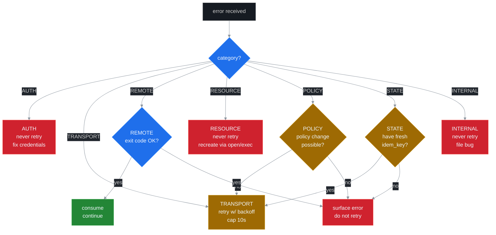

# ADR 0007: Error Taxonomy for v5.0

## Status

Proposed (v5.0.0). Implementation spans Phases 1, 2, 3 of the v5 roadmap.

## Context

ssh-mcp v4 ships ~14 distinct wire-level error codes. They are emitted via the `REASON: [CODE] description` markdown line plus a parallel structured `{ tool, status, code, reason, detail }` JSON object. Each code is a string suffixing a tool body. Hosts treat the codes as opaque hints; the project does not formalise them in a single document.

v5.0 introduces:

- ADR 0003 — lifecycle binding adds 3 codes (`RESOURCE_GONE`, `LIFECYCLE_STATE_CONFLICT`, `SESSION_REFCOUNT_UNDERFLOW`).
- ADR 0004 — channel mux adds 5 codes (`SUB_NOT_FOUND`, `MAX_SUBS_PER_URI_EXCEEDED`, `MAX_SUBS_TOTAL_EXCEEDED`, `LANE_BUFFER_FULL`, `MUX_BACKPRESSURE`).
- ADR 0005 — LLM UX adds 1 code (`SUB_LEAK_RISK`).
- ADR 0006 — backpressure adds 3 codes (`LAG_DETECTED`, `LAG_BACKPRESSURE`, `RING_BUFFER_OVERFLOW`).
- ADR 0008 — NDJSON daemon adds 1 code (`INVALID_OP`).

The cumulative surface is ~38 codes. Without a taxonomy, three issues compound:

1. **Inconsistent retry semantics.** Some codes are retryable (`CONNECTION_FAILED`), some are not (`AUTH_FAILED`), some depend on idempotency (`STATE`-class). A 27B model that re-attempts every error indiscriminately produces secondary failures.
2. **No structured DETAIL.** v4 puts a free-form `description` after the code. An LLM has to parse English to know what to do next.
3. **No canonical handbook.** Operators reading logs cannot look up a code without grepping the source. New contributors do not know which code to emit for a new failure mode.

Two approaches were on the table:

1. **Keep codes as strings; add docs but not categories.** Rejected because retry decisions become per-code lookups and the LLM still has to parse English.
2. **Categorise every code, attach typed retry semantics, define a canonical DETAIL phrasing.** Selected.

## Decision

Group every code into one of seven categories with explicit retry semantics. Each code carries a structured DETAIL that is one sentence, ≤120 characters, action-oriented, and aligned with the ADR 0005 LLM UX phrasing. Maintain a canonical handbook at `docs/llm-ux/ERROR_HANDBOOK.md` that lists every code, its category, retry policy, cause, cure, prevention, and an NDJSON exchange example.

### Categories

| Category | Retry semantics | Examples |
|---|---|---|
| `AUTH` | Never retry. Caller fixes credentials. | `AUTH_FAILED`, `AUTH_KEY_PARSE` |
| `TRANSPORT` | Auto-retry with exponential backoff (cap 10 s) for transient failures. | `CONNECTION_FAILED`, `CONNECTION_TIMEOUT`, `TRANSPORT_ERROR` |
| `REMOTE` | Depends on remote command exit code; LLM judges. | `SFTP_ERROR`, `REMOTE_CMD_FAILED` |
| `RESOURCE` | Never retry. Resource is gone or never existed. | `SESSION_NOT_FOUND`, `SHELL_NOT_FOUND`, `RESOURCE_GONE`, `SUB_NOT_FOUND` |
| `POLICY` | Retry conditional on policy change. | `MAX_*_EXCEEDED`, `LANE_BUFFER_FULL`, `LAG_*`, `SUB_LEAK_RISK` |
| `STATE` | Never retry without `_meta.idempotency_key`. | `INVALID_ARGUMENT`, `INVALID_REPEAT`, `INVALID_LIFETIME`, `IDEMPOTENCY_KEY_MISMATCH` |
| `INTERNAL` | Never retry; report bug. | `STORAGE_ERROR`, `INTERNAL_ERROR`, `LIFECYCLE_STATE_CONFLICT`, `SESSION_REFCOUNT_UNDERFLOW` |



### Code list (38 codes total)

For brevity, only the new v5.0 codes are listed in this ADR; pre-existing v4 codes carry over with their existing semantics. The full list is in `docs/llm-ux/ERROR_HANDBOOK.md`.

#### Lifecycle (ADR 0003)

| Code | Category | Retry | DETAIL |
|---|---|---|---|
| `RESOURCE_GONE` | RESOURCE | no | "Resource closed (lifecycle Releasing/Closed); recreate via ssh_shell_open / ssh_execute / ssh_upload." |
| `LIFECYCLE_STATE_CONFLICT` | INTERNAL | no | "Unexpected lifecycle CAS failure; collect logs + report." |
| `SESSION_REFCOUNT_UNDERFLOW` | INTERNAL | no | "Cascade decrement past zero; collect logs + report." |
| `GRACE_TIMER_EXPIRED` | RESOURCE | no | "Grace elapsed; recreate resource." |

#### Channel mux (ADR 0004)

| Code | Category | Retry | DETAIL |
|---|---|---|---|
| `SUB_NOT_FOUND` | RESOURCE | no | "Use ssh_sub_list to enumerate active subscriptions." |
| `MAX_SUBS_PER_URI_EXCEEDED` | POLICY | conditional | "Share an existing sub via fan-out client-side, or unsubscribe stale ones." |
| `MAX_SUBS_TOTAL_EXCEEDED` | POLICY | conditional | "Audit ssh_sub_list and unsubscribe stale subscriptions." |
| `INVALID_LIFETIME` | STATE | no | "lifetime ∈ {manual, auto-close, lease}." |
| `INVALID_LAG_POLICY` | STATE | no | "lag_policy ∈ {block_slow, drop_oldest, drop_newest, snapshot}." |

#### Backpressure (ADR 0006)

| Code | Category | Retry | DETAIL |
|---|---|---|---|
| `LANE_BUFFER_FULL` | POLICY | conditional | "Increase SSH_LANE_BUFFER or switch lag_policy to snapshot." |
| `LAG_DETECTED` | POLICY | recover | "Lagged N events; snapshot rebuilt; cursor adjusted." |
| `LAG_BACKPRESSURE` | POLICY | conditional | "Consume stdout faster or raise SSH_BP_BLOCK_TIMEOUT_MS." |
| `RING_BUFFER_OVERFLOW` | POLICY | recover | "Head bytes dropped; use ssh_sub_replay from cursor." |
| `MUX_BACKPRESSURE` | POLICY | conditional | "Outbound writer blocked; consume the daemon NDJSON output faster." |

#### LLM UX hygiene (ADR 0005)

| Code | Category | Retry | DETAIL |
|---|---|---|---|
| `SUB_LEAK_RISK` | POLICY | warn | "Resource owned > 2 s with 0 subs and no auto-cleanup; ssh_subscribe or recreate with release_when_no_subs=true." |

#### NDJSON daemon (ADR 0008)

| Code | Category | Retry | DETAIL |
|---|---|---|---|
| `INVALID_OP` | STATE | no | "Op not in {connect, exec, ...}; check the op enum or use ssh_sub_list." |
| `IDEMPOTENCY_KEY_MISMATCH` | STATE | no | "Same idempotency_key with different args; pick a new key." |

### Wire format unchanged

The MCP wire format remains:

```
SSH_X: ERROR
REASON: [CODE] description
DETAIL: <DETAIL line above>
```

Plus the structured JSON channel:

```json
{ "tool": "ssh_x", "status": "error", "code": "RESOURCE_GONE",
  "reason": "Resource closed (lifecycle Releasing/Closed); recreate via ssh_shell_open / ssh_execute / ssh_upload." }
```

(Note: `reason` carries the DETAIL on the structured channel; the markdown channel keeps both REASON and DETAIL on separate lines for backwards compatibility.)

### Idempotency_key interaction

`STATE`-class errors that are retryable (e.g. `MAX_SHELLS_EXCEEDED` after closing one) require `_meta.idempotency_key` to deduplicate. The cache TTL is `SSH_IDEMPOTENCY_TTL_SECS` (default 300 s), with a hard cap of `SSH_IDEMPOTENCY_MAX_ENTRIES` (default 10000). Hits return the original response, including any error.

### Closest-match suggestions

Already implemented in v4.7 for `NOT_FOUND` codes. Extended in v5.0 to cover `SUB_NOT_FOUND` (suggests by sub_id prefix match) and `RESOURCE_GONE` (suggests open resources of the same kind on the same session). The DETAIL line concatenates the suggestion: `DETAIL: Use ssh_sub_list to see active subscriptions. Closest: 019028a3-... (open since 14:32:07)`.

## Consequences

### Positive

- **Predictable retry decisions.** A 27B model can switch on the category alone (`AUTH` → never retry; `TRANSPORT` → retry with backoff; `RESOURCE` → never retry). Source code mostly does not need code-by-code branches.
- **Self-explanatory wire surface.** Every error response carries a one-sentence cure; no host-side mapping table is required.
- **Single source of truth.** The handbook at `docs/llm-ux/ERROR_HANDBOOK.md` is the canonical reference for operators, contributors, and LLMs alike.
- **Closest-match suggestions reduce typos.** Existing v4.7 mechanism extended to subscription-related codes.

### Negative

- **Larger response bodies.** DETAIL lines add ~80–120 bytes per error response. Negligible at typical error rates.
- **Maintenance overhead.** New error codes require an ADR / handbook update. Phase 6 commits the initial handbook; CI lint enforces an entry exists for every code emitted by the codebase.

### Neutral

- **Backwards compatibility preserved.** v4 codes keep their semantics. New codes are additive. Hosts that ignore DETAIL lines work as before; hosts that parse them benefit.
- **Structured channel parity.** The `code` and `reason` fields on the JSON channel align with the markdown channel. Hosts can pick either.

## References

- [ADR 0003 — Lifecycle Binding](./0003-lifecycle-binding.md)
- [ADR 0004 — Channel Mux](./0004-channel-mux-fairness.md)
- [ADR 0005 — LLM UX Priorities](./0005-llm-ux-priorities.md)
- [ADR 0006 — Backpressure Policies](./0006-backpressure-policies.md)
- [ADR 0008 — NDJSON Daemon Protocol](./0008-ndjson-daemon-protocol.md)
- [docs/llm-ux/ERROR_HANDBOOK.md](../llm-ux/ERROR_HANDBOOK.md) (forthcoming).
