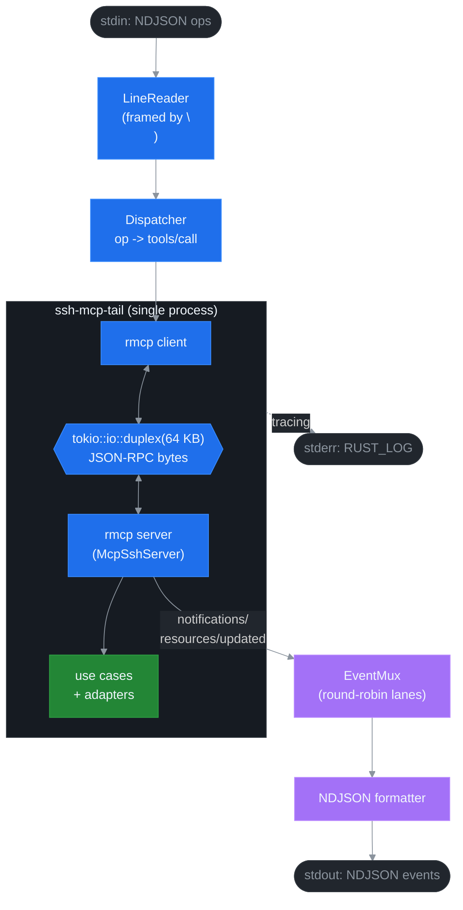
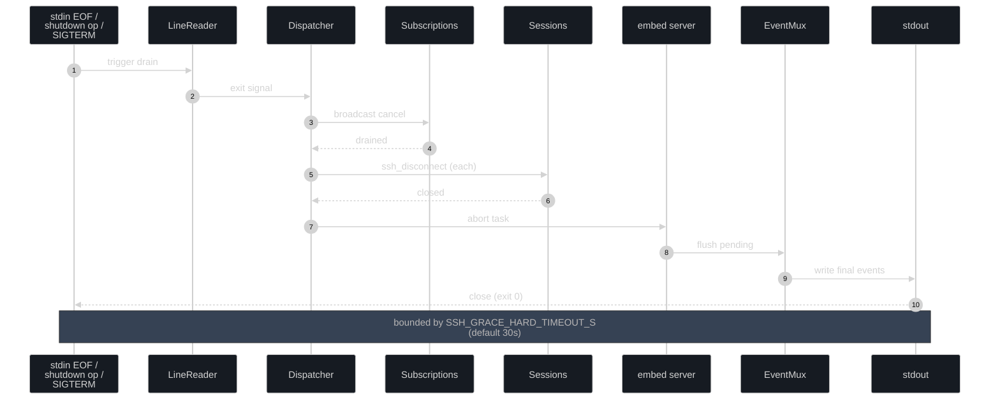

# ADR 0008: NDJSON Daemon Protocol (`ssh-mcp-tail`)

## Status

Proposed (v5.0.0). Implementation tracked under Phase 4 of the v5 roadmap. Depends on ADR 0003 (Lifecycle Binding), ADR 0004 (Channel Mux), and ADR 0005 (LLM UX).

## Context

The MCP protocol spec defines `resources/subscribe` + `notifications/resources/updated` as the standard push channel. Empirically, real-world MCP hosts split into three tiers:

1. **Full-spec hosts** (mcp-inspector, custom rmcp clients, Goose CLI, Cline): subscribe support, push delivered to the LLM, end-to-end push works.
2. **Partial hosts** (Claude Desktop, some IDE integrations): subscribe accepted on the protocol but push notifications are not surfaced to the LLM as conversation context. The LLM sees tool calls and resource reads only.
3. **No-subscribe hosts** (Claude Code CLI as of 2026-Q1): no `resources/subscribe` exposed to the LLM at all; only `tools/call` and one-shot `resources/read`.

For tier 2 and 3, the server-side push pipeline is still useful for in-process consumers (audit logs, distributed monitoring, browser-side bridges) but cannot be reached through the standard MCP path. The v4 architecture has no story for this.

The Phase 4 daemon (`ssh-mcp-tail`) addresses this with a single binary that:

- Embeds the `McpSshServer<UC>` (the existing rmcp `ServerHandler`) plus an embedded rmcp client.
- Connects them via `tokio::io::duplex` — JSON-RPC framed in-memory, no separate process, no IPC syscall.
- Translates a stdin NDJSON command stream into MCP tool calls and resource subscribes.
- Translates MCP push notifications into stdout NDJSON events with explicit sub_id / uri / seq attribution.

This produces a Unix-y composable surface: `ssh-mcp-tail daemon < commands.ndjson | jq 'select(.ev == "push")' | tee log.ndjson`. Three tier-3 LLM hosts can spawn the daemon as a subprocess and consume push events at the conversation layer without implementing the MCP subscribe protocol themselves.

Three architectures were on the table:

1. **HTTP/SSE bridge as separate binary.** Run the existing `ssh-mcp` binary, expose an HTTP+SSE proxy in front. Rejected for Phase 4 — too many moving parts (port management, TLS, rate-limit middleware) for the initial scope. May ship in a later release.
2. **Two-process pipeline (`ssh-mcp-stdio | tail-bridge`).** Run the standard stdio server and pipe its JSON-RPC stream through a bridge. Rejected because parsing the JSON-RPC framing adds latency and a failure mode we don't need.
3. **Single binary, in-process duplex transport.** Selected.

## Decision

Ship `ssh-mcp-tail` as a single binary with three subcommands and a shared NDJSON protocol.

### Subcommands

| Subcommand | Use | Stdin | Stdout |
|---|---|---|---|
| `ssh-mcp-tail run` | One-shot connect + exec + drain. | unused | NDJSON push events for the command. |
| `ssh-mcp-tail shell` | Interactive PTY shell. | bytes forwarded as `ssh_shell_write`. | bytes from the PTY. |
| `ssh-mcp-tail daemon` | Multi-session NDJSON command/event loop. | NDJSON ops. | NDJSON events. |

`run` and `shell` are scripts/aliases over `daemon` (~10 lines of shell wrapper each); the daemon mode is the primary deliverable.

### Internal architecture



The `tokio::io::duplex(64 KB)` pair gives both sides a real bidirectional async byte channel. Both halves are wrapped in rmcp's transport trait; the server task spawns under `composition::embed::wire()`, and the client task is owned by the daemon's main loop.

### NDJSON command schema (stdin)

One JSON object per line, terminated by `\n`. The schema is `serde`-tagged on `op`:

```json
{"op":"connect","host":"example.com","user":"root","key":"/home/user/.ssh/id_rsa","id":"corr-1"}
{"op":"exec","sid":"<session-uuid>","cmd":"top -b -n 5","pty":false,"id":"corr-2"}
{"op":"subscribe","uri":"command://<cmd-uuid>/output","lifetime":"auto-close","grace_ms":2000,"lag_policy":"snapshot","id":"corr-3"}
{"op":"unsubscribe","sub_id":"<sub-uuid>","id":"corr-4"}
{"op":"shell_open","sid":"<session-uuid>","cols":80,"rows":24,"id":"corr-5"}
{"op":"shell_write","shid":"<shell-uuid>","bytes":"ls -la\n","id":"corr-6"}
{"op":"shell_key","shid":"<shell-uuid>","key":"ctrl_c","id":"corr-7"}
{"op":"upload","sid":"<session-uuid>","local":"/tmp/file","remote":"/srv/file","id":"corr-8"}
{"op":"cancel","cid":"<cmd-uuid>","id":"corr-9"}
{"op":"disconnect","sid":"<session-uuid>","id":"corr-10"}
{"op":"shutdown","id":"corr-11"}
```

`id` is an optional correlation identifier; the daemon echoes it on every event tied to the op.

### NDJSON event schema (stdout)

One JSON object per line. `ev` is the discriminator:

```json
{"ev":"ack","id":"corr-1","sid":"<session-uuid>"}
{"ev":"err","id":"corr-1","code":"AUTH_FAILED","reason":"...","detail":"..."}
{"ev":"started","cid":"<cmd-uuid>","sid":"<session-uuid>"}
{"ev":"push","sub_id":"<sub-uuid>","uri":"command://<cmd-uuid>/output","seq_local":1,"seq_global":1893,"cursor":102400,"delta":"...","ts":"2026-05-04T..."}
{"ev":"completed","cid":"<cmd-uuid>","exit":0}
{"ev":"transfer_progress","tid":"<xfer-uuid>","bytes":1024,"total":4096}
{"ev":"shell_output","shid":"<shell-uuid>","bytes":"..."}
{"ev":"snapshot","sub_id":"<sub-uuid>","cursor":102400,"delta":"..."}
{"ev":"lagged","sub_id":"<sub-uuid>","dropped":42}
{"ev":"warn","code":"SUB_LEAK_RISK","resource":"shell://abc/output","msg":"..."}
{"ev":"closed","sid":"<session-uuid>"}
{"ev":"resource_closed","uri":"command://<cmd-uuid>/output","reason":"unsubscribe_grace_elapsed"}
{"ev":"heartbeat","ts":"2026-05-04T..."}
{"ev":"daemon_stats","active_sessions":3,"active_subs":7,...}
```

### Backpressure and shutdown



- **stdin EOF or `{"op":"shutdown"}`**: graceful drain. LineReader exits → Dispatcher exits → broadcast cancel to subscription consumers → for each session call `ssh_disconnect` → embed server task abort → EventMux flush → stdout close → process exit 0.
- **stdout SIGPIPE**: same graceful drain.
- **SIGTERM / SIGINT**: tokio signal handler triggers the same drain. `SSH_GRACE_HARD_TIMEOUT_S` (default 30) caps the drain.
- **Mpsc full**: see ADR 0006 LagPolicy. Lane drops follow per-sub policy; mux drops yield back to the dispatcher.
- **NDJSON parse errors**: emit `{"ev":"err","code":"INVALID_OP","detail":"<context>"}`; daemon continues.

### Observability

`stderr` is RUST_LOG-controlled tracing output (operator log). `stdout` stays clean (only NDJSON events, no log noise). Operators select the format:

```
RUST_LOG=ssh_mcp=info,ssh_mcp_tail=debug ssh-mcp-tail daemon
```

### Limits

| Limit | Default | Env var |
|---|---|---|
| Max NDJSON line size on stdin | 1 MB | `SSH_NDJSON_LINE_MAX` |
| Mux mpsc buffer | 8192 events | `SSH_MUX_BUFFER` |
| Per-lane mpsc buffer | 1024 events | `SSH_LANE_BUFFER` |
| Heartbeat interval | 30 s | `SSH_HEARTBEAT_INTERVAL_S` |
| Daemon stats auto-emit | 60 s | `SSH_DAEMON_STATS_INTERVAL_S` |
| Hard shutdown deadline | 30 s | `SSH_GRACE_HARD_TIMEOUT_S` |

## Consequences

### Positive

- **One binary, one process, no IPC.** Runs anywhere `ssh-mcp-stdio` runs. systemd-friendly.
- **Composable Unix surface.** `jq`, `tee`, `grep`, fluentbit, vector all work out of the box.
- **Real push for tier-2 / tier-3 hosts.** A Claude Code shell can `bash -c 'ssh-mcp-tail run --host vm.example.com --user root -- "tail -f /var/log/app.log"' | grep ERROR` and get genuine push (50 ms debounced) without implementing MCP subscribe.
- **Reuse across phases.** The same `composition::embed::wire()` powers integration tests, future browser bridges, and any in-process consumer.

### Negative

- **Two binaries to maintain (`ssh-mcp-stdio` + `ssh-mcp-tail`).** Code reuse minimises this — both share `composition::prod` adapters, the bin entries are thin shells. Phase 4 commits ~250 LOC of new bin + ~150 LOC of formatter / parser / mux.
- **NDJSON protocol versioning.** Each new op or event variant grows the protocol surface. `docs/INSTRUCTIONS_DAEMON.md` and a JSON schema (`docs/api/ssh-mcp-ndjson.schema.json`) lock the contract.
- **No multi-tenant story in Phase 4.** A daemon is single-tenant by default. Multi-tenant scoping (per-API-key) lands in a later release.

### Neutral

- **Wire compatibility with the MCP server is preserved.** The embed transport produces real JSON-RPC bytes; integration tests can swap the duplex for a `TcpStream` and the same code works.
- **Existing ssh-mcp-stdio is unchanged.** No behavioural overlap; the daemon is purely additive.

## References

- [ADR 0003 — Lifecycle Binding](./0003-lifecycle-binding.md) — release_when_no_subs honoured by daemon ops.
- [ADR 0004 — Channel Mux](./0004-channel-mux-fairness.md) — sub_id-based fan-out feeds the daemon's outbound writer.
- [ADR 0005 — LLM UX Priorities](./0005-llm-ux-priorities.md) — daemon emits the same HINT / NEXT / WARN markers.
- [ADR 0006 — Backpressure Policies](./0006-backpressure-policies.md) — daemon lag handling.
- [ADR 0007 — Error Taxonomy](./0007-error-taxonomy.md) — daemon NDJSON error envelope.
- [docs/INSTRUCTIONS_DAEMON.md](../INSTRUCTIONS_DAEMON.md) (forthcoming).
- [docs/api/ssh-mcp-ndjson.schema.json](../api/ssh-mcp-ndjson.schema.json) (forthcoming).
