# ADR 0009: Serial / UART / TTY / COM transport

## Status

Proposed (v5.2.0). Implemented end-to-end on `master`.

## Context

ssh-mcp v5.0 / v5.1 ship five push-resource schemes — `shell://`, `command://`, `transfer://`, `forward://`, `session://` — all gated on a working SSH session. Embedded, industrial, and lab workflows that need the same LLM-driven push semantics on a physical UART (RS-232 / RS-485 / TTL serial / CDC-ACM, etc.) had no native path: they had to wrap the device in `ser2net` / `socat` and tunnel through SSH, which doubles the moving parts and the failure modes.

The asks distilled from the v5.1 deployment feedback:

- **Native serial transport** — open `/dev/ttyUSB0` / `/dev/tty.usbserial-XXXX` / `COM3` directly from the LLM host, no SSH gateway required.
- **Full parameter coverage** — every `stty` knob exposed: `path`, `baud_rate`, `data_bits` (5–8), `stop_bits` (1 / 2), `parity` (none / odd / even), `flow_control` (none / software / hardware), `read_timeout`, history `max_buffer_size`, optional initial DTR / RTS levels, optional human label.
- **Subscribe-first push, lock-free** — opening a serial port must NOT lock subscribers out of the read path. Multiple subscribers attached to `serial://<id>/output` must read concurrently with the OS-level reader; backpressure on a slow consumer must NOT stall the kernel-side serial read.
- **Same byte-threshold flush as ADR 0006 Amendment 1** — chatty UART workloads (GPS NMEA, RS-485 sensor stream, firmware dump at 921 600 baud) must flush the push channel as soon as 64 KiB has accumulated since the last broadcast, not wait for the 50 ms debounce window.

## Decision

Add `serial://<id>/output` as a sixth push-resource scheme, served by a new lock-free per-port aggregate (`SerialPortState`) and a lightweight `SerialRegistry` singleton. Plug the producer side into the existing v4 `SUBSCRIPTION_REGISTRY` debouncer pipeline so subscribe / cursor / lag-policy / byte-threshold semantics are inherited byte-for-byte from the SSH-shell / async-command paths.

### Resource scheme

| Scheme | Suffix | Producer | Consumer |
|---|---|---|---|
| `serial://<serial_id>/output` | `output` | OS read half (via `tokio_serial::SerialStream`, `tokio::io::ReadHalf`) | `ssh_subscribe` lane → rmcp `notifications/resources/updated` |

Mirrors `shell://<id>/output` and `command://<id>/output` exactly — the `/output` suffix tells the existing `parse_uri` / `format_uri` helpers and the v4 read use case dispatcher that this resource carries an append-only byte stream.

### Hexagonal layer map

```mermaid
%%{init: {'theme':'dark','themeVariables':{'primaryColor':'#1f6feb','primaryTextColor':'#f0f6fc','primaryBorderColor':'#388bfd','lineColor':'#8b949e','secondaryColor':'#161b22','tertiaryColor':'#21262d','background':'#0d1117','mainBkg':'#161b22','secondBkg':'#21262d','tertiaryBkg':'#0d1117','nodeTextColor':'#f0f6fc','edgeLabelBackground':'#21262d','clusterBkg':'#161b22','clusterBorder':'#30363d','titleColor':'#f0f6fc'}}}%%
flowchart LR
    UART["physical UART<br/>(RS-232 / RS-485 / CDC-ACM)"]
    OS["OS device<br/>/dev/ttyUSB* | /dev/tty.usb* | COM*"]
    Reader["reader task<br/>(tokio::io::ReadHalf<SerialStream>)"]
    Writer["writer task<br/>(tokio::io::WriteHalf<SerialStream>)<br/>+ mpsc(64) write queue"]
    History["ArcSwap<RingBuffer><br/>per-port history (lock-free)"]
    Reg["SUBSCRIPTION_REGISTRY<br/>debouncer + flush_now"]
    Lane["per-SubId lane mpsc<br/>filter / replay / lag policy"]
    Peer["rmcp Peer<br/>notifications/resources/updated"]

    UART --> OS --> Reader
    Reader -->|"flush_serial_buffer:<br/>history.rcu(...)"| History
    Reader -->|"next_seq + poke + record_bytes"| Reg
    Reg -->|"debounce | force_flush | keepalive | byte-threshold"| Lane
    Lane --> Peer
    Peer -.->|"resources/read?cursor=auto"| History
    Peer -.->|"ssh_serial_write payload"| Writer
    Writer --> OS

    classDef ext fill:#21262d,color:#8b949e,stroke:#30363d
    classDef ours fill:#1f6feb,color:#f0f6fc,stroke:#388bfd
    classDef hot fill:#a371f7,color:#f0f6fc,stroke:#bc8cff
    class UART,OS,Peer ext
    class Reader,Writer,Reg,Lane ours
    class History hot
```



### Lock-free contract

- **History** lives on `ArcSwap<RingBuffer>` — `ArcSwap::load()` is `O(1)` and never blocks. Subscribers reading `serial://<id>/output?cursor=auto` snapshot the buffer once and slice from `cursor` onward; they never contend with the OS reader.
- **Writes** funnel through a bounded `mpsc::channel(64)` between any caller (HTTP / stdio request handler) and the writer task. The writer task owns the OS `WriteHalf<SerialStream>` exclusively, so a slow remote sink fills the mpsc first; subsequent `ssh_serial_write` calls return `SERIAL_BACKPRESSURE` instead of stalling the request.
- **Reader** owns `ReadHalf<SerialStream>` exclusively. After every flush threshold it rotates the local staging buffer into the history via `ArcSwap::rcu` — atomic, copy-on-write, no `Mutex`.
- **Cancellation** is cooperative via `tokio_util::sync::CancellationToken`. Cancel cascades to both reader and writer tasks; reader unwinds its in-flight staging buffer to history before exiting; the registry entry is removed (idempotent — `serial_close` is also idempotent).

### Producer-side hook

`flush_serial_buffer` calls into the existing v4 subscription pipeline:

1. `SUBSCRIPTION_REGISTRY.next_seq(ResourceKind::Serial, &serial_id)` — allocates a monotonic sequence number.
2. `SUBSCRIPTION_REGISTRY.poke(ResourceKind::Serial, &serial_id)` — wakes the per-resource debouncer.
3. `SUBSCRIPTION_REGISTRY.record_bytes(ResourceKind::Serial, &serial_id, chunk_len)` — feeds the ADR 0006 Amendment 1 byte-threshold counter; crossing `SSH_NOTIFY_FLUSH_BYTES` (default 64 KiB) flushes the push channel immediately.

This is bit-identical to how `command://*/output` is wired today — the byte-threshold flush, lag policies, debouncer, force-flush, keepalive ticks all "just work" for serial.

### Configuration surface

```rust
pub struct SerialConfig {
    pub path: String,                   // /dev/ttyUSB0 | /dev/tty.usbserial-X | COM3
    pub baud_rate: u32,                 // 9600 .. 921600 (whatever the driver accepts)
    pub data_bits: u8,                  // 5 | 6 | 7 | 8
    pub stop_bits: SerialStopBits,      // One | Two
    pub parity: SerialParity,           // None | Odd | Even
    pub flow_control: SerialFlowControl, // None | Software | Hardware
    pub read_timeout: Duration,         // OS read timeout (default 100 ms)
    pub max_buffer_size: u64,           // history cap (0 → 1 MiB default)
    pub initial_dtr: Option<bool>,      // None = driver default
    pub initial_rts: Option<bool>,      // None = driver default
    pub label: Option<String>,          // optional human label
}
```

### MCP tool surface

| Tool | Read-only | Idempotent | Description |
|---|---|---|---|
| `ssh_serial_open` | no | no | Open a port → `SERIAL_ID` + subscribe URI |
| `ssh_serial_close` | no | yes | Cancel reader / writer + drop registry entry |
| `ssh_serial_write` | no | no | Enqueue UTF-8 `text` OR base64 `bytes_base64` |
| `ssh_serial_send_key` | no | no | Named keystroke (`enter` / `cr` / `lf` / `crlf` / `esc` / `tab` / `backspace` / `ctrl_c`/`d`/`z`) with optional `repeat` 1..=64 |
| `ssh_serial_list_ports` | yes | yes | Snapshot OS-visible serial devices |
| `ssh_serial_list_open` | yes | yes | Snapshot ports currently held by this process |

Wire shape mirrors the rest of the catalogue: markdown body (`KEY: value` lines, `HINT:`/`NEXT:` advisories, 8-hex nonce on output blocks) plus a parallel `structured_content` JSON. Subscribe via the existing `ssh_subscribe uri=serial://<SERIAL_ID>/output` — no new subscribe primitive.

### LLM-UX hooks

- `ssh_serial_open` `HINT: RECOMMENDED` line steers the model to `ssh_subscribe uri=serial://...` for push (debounce + 64 KiB byte-threshold flush, same pipeline as shell / command).
- `ssh_serial_write` / `ssh_serial_send_key` `HINT: RECOMMENDED` line tells the model to wait for `notifications/resources/updated` and drain via `resources/read?cursor=auto` — never poll.

### Cross-platform notes

- **Linux:** `/dev/ttyUSB*` (FTDI / CP210x / CH34x USB UARTs), `/dev/ttyACM*` (CDC-ACM / Arduino), `/dev/ttyS*` (legacy 16550 onboard UARTs). User must be in the `dialout` (Debian/Ubuntu) or `uucp` (Arch) group, or have the `udev` rule grant access.
- **macOS:** `/dev/tty.usbserial-XXXX` (FTDI), `/dev/tty.usbmodemXXXX` (CDC-ACM); use the `tty.*` device, not the `cu.*` one (no DCD wait).
- **Windows:** `COM3`, `COM4`, ...; named devices use the `\\.\COMx` form which `tokio_serial` handles transparently.

### Out of scope (deferred)

- **Per-call `flush_bytes` / `debounce` overrides on serial subscriptions** — same v5.2 follow-up that gates the equivalent feature on `ssh_subscribe` for shell / command.
- **Hot reconfigure** (change baud / parity without close-reopen) — reserved for v5.3.
- **Hardware breaks (`tcsendbreak`)** — `ssh_serial_send_break` lands when there is a real workflow needing it.
- **Modem control mid-session** (toggle DTR / RTS at runtime) — currently only the `initial_dtr` / `initial_rts` fields on open. Mid-session toggle reserved for v5.3.

## Consequences

### Positive

- LLM workflows can drive UART-attached hardware (GPS, RS-485 sensors, debug consoles, programmer interfaces) end-to-end with the same subscribe-first ergonomics they already have for SSH shells.
- Zero changes to the existing wire format, structured-content schema, error taxonomy, or `ssh_subscribe` surface — drop-in for any v3 / v4 / v5.0 / v5.1 host.
- Lock-free contract preserved: no new `Mutex` on the hot path; lint baseline (`mutex_atomic = deny`, `await_holding_lock = deny`) keeps regressions out.
- Byte-threshold flush already wired — chatty serial workloads inherit the v5.1 latency win for free.

### Negative

- New transitive dependency: `tokio-serial = "5"` (≈400 KiB compiled, MIT-licensed, mature). `cargo deny check` accepts it under the existing transitive-versions allowance.
- `ResourceKind::Serial` enum variant breaks any external crate that exhaustively matches the enum without a wildcard. None known in this workspace; the lint baseline (`wildcard_enum_match_arm = "deny"`) means in-tree matches are exhaustive and were updated atomically.
- An open serial port holds an OS file descriptor and the corresponding kernel TTY for as long as the process lives or `ssh_serial_close` is called. Operators that rely on the host being able to release the device on demand should set `release_when_no_subs=true` semantics at the lifecycle layer (Phase 1 ADR 0003) — landing alongside per-call overrides in v5.3.

### Neutral

- Test surface adds ≈8 lib unit tests (config defaults, parser round-trips, registry sanity) plus the ability to write loopback-PTY integration tests under Linux/macOS using `socat -d -d pty,raw,echo=0 pty,raw,echo=0`.
- Backwards compatibility: every v5.1 host that does NOT call serial tools is byte-identical on the wire. Hosts that opt in see a 6-tool catalogue extension and a sixth push scheme.

## References

- [ADR 0003 — Lifecycle Binding](./0003-lifecycle-binding.md) — refcount + release_when_no_subs semantics shared with serial.
- [ADR 0004 — Channel Mux + SubId](./0004-channel-mux-fairness.md) — per-`SubId` lane mpsc that serial subscribers attach to.
- [ADR 0006 — Backpressure Policies](./0006-backpressure-policies.md) — Snapshot / BlockSlow / DropOldest / DropNewest LagPolicy + the byte-threshold flush trigger reused by serial.
- [docs/RESOURCES.md](../RESOURCES.md) — push-resource scheme contract.
- [docs/CONFIGURATION.md](../CONFIGURATION.md) — env-var reference (no new env vars introduced; serial inherits `SSH_NOTIFY_*`).
- [tokio-serial](https://docs.rs/tokio-serial/) — async wrapper around the platform serialport-rs binding.
