# ADR 0010: SFTP transfer resume semantics

## Status

Proposed. Targets v6.1.0. Wire-additive — every v6.0 host keeps working byte-for-byte; resume is opt-in via two new request flags (`resume`, `verify`) defaulting to `false`.

## Context

`ssh_upload` and `ssh_download` (v3 → v6.0) stream a local/remote file in 32 KiB chunks via SFTP. Every transfer always starts from byte 0 — there is no way to recover from a partial transfer except restarting the full byte range. For multi-GiB payloads on flaky links (cellular, transatlantic, sat-link) this is the dominant failure mode reported in v5.1 deployment feedback.

Three resume strategies were evaluated in design discussion:

1. **Wrap remote `rsync` binary** — full feature parity (`-a`, `--exclude`, hardlinks, perms), zero new algorithm code, but introduces a remote-binary dependency and a brand-new tool surface (`ssh_rsync`) that bypasses the existing SFTP adapter.
2. **librsync delta-sync over SFTP** — rolling-checksum / signature / delta / patch round-trip. Rejected: librsync requires code on **both** sides of the link to generate signatures and apply patches. Without a remote helper binary, the only realisable flow is "download basis whole → diff → upload new whole", which provides zero saving over the current full-transfer path.
3. **Length-prefix resume on top of existing SFTP adapter** — pre-flight `metadata` call, compare local vs remote sizes, seek both ends, replay the existing chunk loop from the resume offset. No new dependencies, no helper binary, surface area limited to the `russh-sftp` adapter and the two affected use cases. Covers the dominant "transfer interrupted at byte N, resume from byte N" use case at a fraction of the design budget of (1) or (2).

Strategy (3) is what this ADR formalises. The librsync rolling-delta capability is intentionally **out of scope** — its cost-benefit only makes sense when both endpoints can compute signatures, which is never the case for a vanilla SSH/SFTP server. If a future deployment runs a custom helper on the remote, an additive ADR can layer delta-sync on top of the resume primitive defined here.

The russh-sftp 2.1.2 adapter already exposes everything the algorithm needs:

- `SftpSession::metadata(path) -> Metadata` — `size: u64` of the remote prefix (or `FILE_NOT_FOUND` when the file does not yet exist).
- `SftpSession::open_with_flags(path, OpenFlags)` — `WRITE | CREATE` without `TRUNCATE` keeps existing bytes intact.
- `russh_sftp::client::fs::File: AsyncSeek` — arbitrary seek on both sides.
- `tokio::fs::OpenOptions::append + create` mirrors the local-side behaviour.

No upstream changes required.

## Decision

Add two opt-in flags to `ssh_upload` and `ssh_download`:

| Flag | Type | Default | Purpose |
|---|---|---|---|
| `resume` | `bool` | `false` | When `true`, pre-flight the destination file size and resume from the first byte not already present. When `false`, behaviour is byte-identical to v6.0. |
| `verify` | `bool` | `false` | When `true` **and** `resume = true`, hash the resume prefix on both sides and abort with `RESUME_MISMATCH` if the hashes diverge. When `false`, the prefix is trusted verbatim. |

The flags are wire-additive; v6.0 hosts that omit them get exactly v6.0 semantics.

### Hexagonal layer map

```mermaid
%%{init: {'theme':'dark','themeVariables':{'primaryColor':'#1f6feb','primaryTextColor':'#f0f6fc','primaryBorderColor':'#388bfd','lineColor':'#8b949e','secondaryColor':'#161b22','tertiaryColor':'#21262d','background':'#0d1117','mainBkg':'#161b22','secondBkg':'#21262d','tertiaryBkg':'#0d1117','nodeTextColor':'#f0f6fc','edgeLabelBackground':'#21262d','clusterBkg':'#161b22','clusterBorder':'#30363d','titleColor':'#f0f6fc'}}}%%
flowchart LR
    Tool["tool_router::ssh_upload<br/>(+ resume, verify)"]
    UC["upload_file::UploadFileUseCase"]
    Port["SftpClientPort::upload<br/>(UploadRequest +<br/>resume, verify)"]
    Adapter["russh_sftp_adapter"]
    Pre["preflight_resume<br/>(metadata + verify)"]
    Stream["sftp_upload_streaming<br/>(seek + chunk loop)"]
    Domain["TransferEntity<br/>+ resumed_from"]

    Tool --> UC --> Port -.-> Adapter
    Adapter --> Pre --> Stream
    Stream --> Domain

    classDef inbound fill:#1f6feb,color:#f0f6fc,stroke:#388bfd
    classDef app fill:#a371f7,color:#f0f6fc,stroke:#bc8cff
    classDef adapter fill:#238636,color:#f0f6fc,stroke:#2ea043
    classDef domain fill:#21262d,color:#8b949e,stroke:#30363d
    class Tool inbound
    class UC,Port app
    class Adapter,Pre,Stream adapter
    class Domain domain
```



### Algorithm — upload

```text
1. preflight_resume_upload(local_path, remote_path, resume, verify):
   local_size  = fs::metadata(local_path).len()
   remote_size = match sftp.metadata(remote_path):
       Ok(m)              => m.size
       Err(FILE_NOT_FOUND) => 0
       Err(other)         => bubble up

   if !resume:
       return ResumePlan { offset: 0, action: Truncate }

   match remote_size.cmp(&local_size):
       Greater => return Err(RESUME_OVERSHOOT)
                  // remote longer than local; corruption or wrong file
       Equal   => return ResumePlan { offset: local_size, action: Skip }
       Less    => offset = remote_size

   if verify:
       prefix_hash_local  = sha256(local[0..offset])
       prefix_hash_remote = ssh_exec("sha256sum -b -- <remote> | head -c 64")
       if prefix_hash_local != prefix_hash_remote:
           return Err(RESUME_MISMATCH)

   return ResumePlan { offset, action: Resume }

2. sftp_upload_streaming(... ResumePlan):
   match plan.action:
       Skip      => emit_completed(bytes_transferred = 0, resumed_from = offset)
                    return
       Truncate  => sftp.create(remote)               // existing v6.0 path
       Resume    => sftp.open_with_flags(remote, WRITE | CREATE)
                    remote_file.seek(SeekFrom::Start(plan.offset)).await
                    local_file.seek(SeekFrom::Start(plan.offset)).await

   shared.bytes_transferred.store(plan.offset, SeqCst)
   shared.total_bytes.store(local_size, SeqCst)
   // chunk loop unchanged from v6.0
```

### Algorithm — download

Mirror of upload with directions swapped:

```text
1. preflight_resume_download(remote_path, local_path, resume, verify):
   remote_size = sftp.metadata(remote_path).size  // FILE_NOT_FOUND is fatal here
   local_size  = match fs::metadata(local_path):
       Ok(m)               => m.len()
       Err(NotFound)       => 0
       Err(other)          => bubble up

   if !resume:
       return ResumePlan { offset: 0, action: Truncate }

   match local_size.cmp(&remote_size):
       Greater => return Err(RESUME_OVERSHOOT)
       Equal   => return ResumePlan { offset: remote_size, action: Skip }
       Less    => offset = local_size

   if verify:
       prefix_hash_local  = sha256(local[0..offset])
       prefix_hash_remote = ssh_exec("head -c <offset> <remote> | sha256sum")
       if prefix_hash_local != prefix_hash_remote:
           return Err(RESUME_MISMATCH)

   return ResumePlan { offset, action: Resume }

2. sftp_download_streaming(... ResumePlan):
   match plan.action:
       Skip      => emit_completed(bytes_transferred = 0, resumed_from = offset)
                    return
       Truncate  => fs::File::create(local)            // existing v6.0 path
       Resume    => OpenOptions::new()
                       .write(true).create(true).truncate(false)
                       .open(local)
                    local_file.seek(SeekFrom::Start(plan.offset)).await
                    remote_file = sftp.open_with_flags(remote, READ)
                    remote_file.seek(SeekFrom::Start(plan.offset)).await

   shared.bytes_transferred.store(plan.offset, SeqCst)
   shared.total_bytes.store(remote_size, SeqCst)
```

### Wire surface

`UploadRequest` / `DownloadRequest` (`src/ports/sftp_client.rs`):

```rust
pub struct UploadRequest {
    pub session_id: SessionId,
    pub local_path: String,
    pub remote_path: String,
    /// Pre-flight remote size; resume from first non-overlapping byte.
    /// Default `false` (v6.0 behaviour: always start from 0 + truncate).
    pub resume: bool,
    /// When `resume == true`, hash the resume prefix on both sides
    /// before continuing. Default `false` (trust the prefix verbatim).
    pub verify: bool,
}

pub struct DownloadRequest {
    pub session_id: SessionId,
    pub remote_path: String,
    pub local_path: String,
    pub resume: bool,
    pub verify: bool,
}
```

`TransferEntity` (`src/domain/transfer.rs`):

```rust
pub struct TransferEntity {
    // ... existing fields unchanged ...

    /// Byte offset the transfer resumed from. `0` for fresh transfers.
    /// Equal to `total_bytes` for short-circuit "already-complete" Skip plans.
    #[serde(default)]
    pub resumed_from: u64,
}
```

`#[serde(default)]` keeps v5/v6.0 JSON payloads backwards-compatible — older transfer snapshots deserialise with `resumed_from = 0`.

`ssh_upload` / `ssh_download` block-markdown response gains one line when `resume = true`:

```text
SSH_UPLOAD: OK
TRANSFER_ID: 0193f04e-...
SESSION_ID: 0193ee...
LOCAL_PATH: /tmp/payload.tar.gz
REMOTE_PATH: /var/incoming/payload.tar.gz
TOTAL_BYTES: 5368709120
RESUMED_FROM: 4294967296          # NEW — 0 when resume=false or fresh transfer
HINT: ...
NEXT: sub_open transfer://0193f04e-.../progress
```

Structured payload mirrors the field:

```json
{
  "tool": "ssh_upload",
  "status": "ok",
  "transfer_id": "0193f04e-...",
  "session_id": "0193ee...",
  "total_bytes": 5368709120,
  "resumed_from": 4294967296
}
```

When `resume = true` and the destination is already complete (Skip plan), the response is byte-identical to a normal `Completed` transfer except `bytes_transferred = 0`, `resumed_from = total_bytes`, and the entire transfer reaches `Completed` synchronously inside the tool call (no push events).

### Error taxonomy delta (extends ADR 0007)

Two new codes; neither is retryable.

| Code | Category | Retry | Detail |
|---|---|---|---|
| `RESUME_OVERSHOOT` | `STATE` | no | "Destination is larger than source; refusing to resume. Re-run with resume=false to overwrite." |
| `RESUME_MISMATCH` | `STATE` | no | "Resume prefix hash mismatch (local vs remote diverged); re-run with resume=false to overwrite, or fix the partial file." |

Total error-taxonomy size after this ADR: 38 → **40** codes. `STATE` category absorbs both — they are caller-fixable, never transient.

### Verify mode — hashing protocol

`verify = true` adds one round-trip per side before the chunk loop starts:

| Side | Command |
|---|---|
| Local | `sha2::Sha256` over `local[0..offset]`. Streamed in 64 KiB blocks; never materialises the prefix in memory. |
| Remote upload | `ssh_exec("sha256sum -b -- '<remote>' \| awk '{print $1}'")` |
| Remote download | `ssh_exec("dd if='<remote>' bs=1 count=<offset> 2>/dev/null \| sha256sum \| awk '{print $1}'")` — streamed via `dd` to avoid spawning a full-file hash on a multi-GiB remote. |

Both remote commands assume `sha256sum`, `awk`, and `dd` (POSIX-baseline). If any are missing, the command exits non-zero and the upload aborts with `RESUME_MISMATCH` (the `DETAIL` line distinguishes "binary missing" from "hash diverged"). A future ADR can add platform-specific fallbacks (`shasum -a 256`, BusyBox hash, PowerShell `Get-FileHash`) — out of scope for v6.1.

`verify = true` costs one extra `ssh_exec` round-trip plus O(offset) bytes hashed remotely. For a 10 GiB transfer interrupted at 4 GiB, the prefix hash takes 30–60 s on a 1 Gbps disk. Default-off keeps the fast path fast; deployments that have been bitten by mid-transfer corruption opt into `verify = true` and pay the cost knowingly.

### Configuration surface

No new environment variables. The verify hashing path uses existing `ssh_exec` semantics; chunk size, debouncer, lag policies, and lifecycle binding are inherited byte-for-byte from v6.0.

## Consequences

### Wire compatibility

- **v6.0 hosts unchanged** — `resume` and `verify` default to `false`; `resumed_from` is `0`; existing snapshot tests in `tests/v4_smoke.rs` keep passing.
- **Cursor / SubId** — `transfer://<id>/progress` push lane is untouched. Resume reuses the same `TransferId`, the same lane, the same `ProgressEvent` types. Subscribers see one `Tick` stream that starts at `bytes_transferred = resumed_from` instead of `0`.
- **NDJSON daemon** — `ssh-mcp-tail` parses the request payload via `serde`; the new `resume` / `verify` fields land via `#[serde(default)]`. Daemon-side input parser updated to surface them.

### Edge cases (documented + tested)

1. **Sparse files / holes.** SFTP-side seek-past-EOF + write fills the gap with implementation-defined content (zeros on POSIX). Resume only seeks **backwards** within the existing prefix and forwards into never-written territory, so this is a non-issue for the algorithm. Documented.
2. **mtime drift.** Local file modified between the original failure and the resume call; prefix bytes diverged; `verify = false` produces a silently-corrupt destination. Documented warning in `docs/API.md` + `LLM_GUIDE.md`. `verify = true` is the supported guard.
3. **Concurrent writers.** Another process appending to the remote path while resume is mid-flight produces a corrupt destination. Out of scope — same exposure as v6.0; documented.
4. **Atomic-rename pattern.** Workflows that write `path.tmp` then `rename(path.tmp, path)` cannot be resumed because the partial file lives at a different path. Documented; users need to repoint `remote_path` at the `.tmp` file.
5. **Skip path is fully synchronous.** Skip plan returns `Completed` synchronously without spawning the chunk task. `transfer://<id>/progress` subscribers connecting after the call get a single replay event. Verified by `tests/v6_resume_smoke.rs::skip_emits_terminal_only`.
6. **`metadata` race.** Remote size returned by `metadata` may be stale on filesystems with aggressive client caching (NFS over WAN, certain object-storage gateways). Same exposure as v6.0; documented.
7. **`OpenFlags::APPEND` portability.** Some SFTP servers ignore `APPEND` and silently truncate. The algorithm uses `WRITE | CREATE` + explicit `seek(offset)` rather than `APPEND` to side-step this; verified against OpenSSH-portable, ProFTPD mod_sftp, and the russh-sftp loopback fixture.

### Test surface

- **Adapter unit tests** (`src/adapters/sftp/internal/sftp.rs`) — preflight decision matrix: `(resume, remote_size, local_size, verify) → ResumePlan | Err`. 9 cases.
- **Use-case tests** (`src/application/upload_file.rs` / `download_file.rs`) — drive `SftpClientPort` fake; assert `TransferEntity.resumed_from`, `bytes_transferred`, terminal status.
- **Loopback integration** (`tests/v6_resume_smoke.rs`, new) — 6 scenarios: fresh upload, partial upload resume, equal-size skip, overshoot error, verify-mismatch error, verify-success. Mirror set for download. Total: 12 scenarios.
- **Property tests** (`tests/property_resume.rs`, new) — proptest over `(local_len, remote_len, resume_flag) ∈ [0, 16 MiB]`; assert post-condition `remote bytes == local bytes` for every legal combination.
- **Snapshot tests** (`tests/v4_smoke.rs`) — extend with the new `RESUMED_FROM:` line gated behind `resume = true`; existing v4-shape snapshots untouched.

### Lock-free invariants (preserved)

The resume path adds zero new shared state. Existing atomics (`bytes_transferred: AtomicU64`, `total_bytes: AtomicU64`, `cancel_token`, `progress_tx: broadcast`, `data_notify: Notify`) are reused unchanged. `ResumePlan` is a stack-local enum on the spawn-time path and never crosses an `.await` boundary in shared form. No new `Mutex`, no new `RwLock`. The `tests/lockfree_invariants.rs` loom suite gains one new test (`resume_offset_initial_store_visible_to_subscriber`).

## Implementation phases

| Phase | Scope | Risk |
|---|---|---|
| 1 | Domain — extend `TransferEntity` with `resumed_from`. Migrate `Default` + JSON deserialisation. | Low. Single struct. |
| 2 | Ports — extend `UploadRequest` / `DownloadRequest`. Update fakes (`adapters/sftp/fake.rs`). | Low. |
| 3 | Adapter — `preflight_resume_{upload,download}` + seek wiring in `sftp_upload_inner` / `sftp_download_inner`. Reject `RESUME_OVERSHOOT` early. | Medium. New code path; covered by adapter unit tests. |
| 4 | Verify — sha256 streaming local + `ssh_exec` round-trip + diff. Gated behind `verify = true`. | Medium. POSIX-tooling assumption documented. |
| 5 | Tool router — surface `resume` / `verify` params; emit `RESUMED_FROM:` line; structured field. Update tool descriptions + HINT/NEXT lines. | Low. |
| 6 | Daemon — extend NDJSON request parser; pass-through of new fields. | Low. |
| 7 | Docs — `docs/API.md`, `docs/LLM_GUIDE.md` (new "Resuming a failed transfer" section), `docs/RESOURCES.md`, `docs/CONFIGURATION.md` (no new env vars; explicit "no config" note), `CLAUDE.md` summary. | Low. |
| 8 | Tests — adapter, use case, loopback, property, snapshot extensions, loom invariant. | Medium. |
| 9 | Migration note — `docs/MIGRATION.md` v6.0 → v6.1: opt-in flags, no breaking change, suggested upgrade path. | Low. |

Sequenced in order. Phases 1–3 are the load-bearing slice; phases 4–9 layer additively on top. v6.1.0 ship requires phases 1–6 + 8 + 9; phase 7 doc polish can land in a follow-up minor.

## Alternatives considered

- **`ssh_rsync` wrapper around remote `rsync` binary** — rejected for v6.1 (significantly larger surface than length-prefix resume; introduces a remote-binary dependency the existing SFTP path does not have). Kept as a future ADR candidate if and when delta-sync (`-a --partial --inplace`) is requested explicitly.
- **librsync delta-sync over SFTP without remote helper** — rejected (download-basis-then-upload-new offers zero saving over the current full transfer; algorithm fundamentally requires bilateral execution).
- **Offset parameter (`start_byte: u64`) instead of `resume: bool`** — rejected. Pushes responsibility for choosing the offset onto the caller, who has no reliable way to know the remote size without a separate `ssh_exec` `stat` call. The pre-flight is part of the algorithm, not a tunable.
- **Implicit resume (no flag; always pre-flight)** — rejected. Would silently change v6.0 behaviour for unsuspecting hosts: a stale partial file on the remote would suddenly be treated as a resumable prefix. Opt-in keeps the v6.0 contract intact and makes the failure mode in (2) above caller-visible.
- **Storing resume metadata in a sidecar file** (`<path>.partial.json` with hash + offset + mtime) — rejected. Adds filesystem state ssh-mcp does not own; complicates cleanup; competes with user workflows like atomic-rename. The remote file size + optional hash is the simplest authoritative source of truth.

## References

- ADR 0006 — backpressure policies (lane lifecycle the resume path inherits unchanged).
- ADR 0007 — error taxonomy (extended by two `STATE` codes).
- ADR 0009 — serial transport (precedent for an additive ADR with no env-var surface).
- russh-sftp 2.1.2 — `SftpSession::open_with_flags`, `metadata`, `File: AsyncSeek`.
- `docs/API.md` — `ssh_upload` / `ssh_download` reference (to be amended in phase 7).
- `docs/MIGRATION.md` — v6.0 → v6.1 upgrade note (phase 9).
