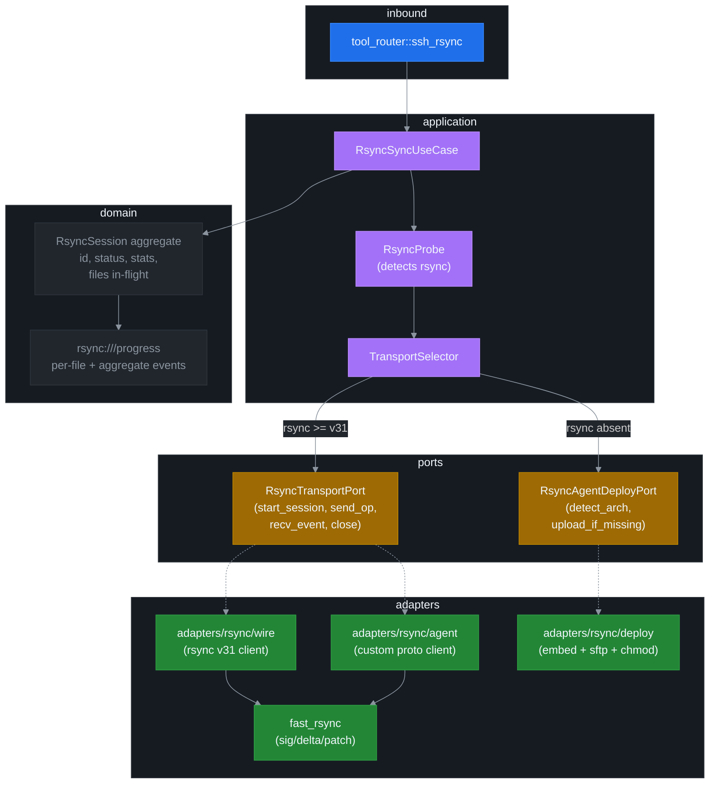

# ADR 0011: Rsync hybrid transport (wire-compat client + self-deploy agent fallback)

## Status

Proposed. Targets v7.0.0. **Major-version bump** because of the scope (~22–30 weeks of focused engineering, new sub-crate, embedded binaries, new push-resource scheme) — but **wire-additive on the MCP surface**: no v6.x tool changes shape; v7 adds `ssh_rsync` and `rsync://<id>/progress` on top.

Depends on ADR 0003 (Lifecycle Binding), ADR 0004 (Channel Mux), ADR 0005 (LLM UX), ADR 0006 (Backpressure), ADR 0007 (Error Taxonomy), and ADR 0010 (SFTP Resume). Co-exists with — does not replace — `ssh_upload` / `ssh_download`.

## Context

ssh-mcp v6.0 ships full SFTP transfer support but no delta-sync, no recursive directory mirror, no attribute preservation, no exclude/include patterns, no `--delete`, no hardlink/symlink handling, no sparse-file awareness, and no bandwidth shaping. ADR 0010 adds length-prefix resume (start-from-byte-N) but explicitly does not aim at "rsync feature parity" — it targets the single failure mode "transfer interrupted at byte N, resume from byte N" and stops there.

The v6.0 deployment feedback distilled four asks that ADR 0010 cannot satisfy:

1. **Recursive sync with `--delete`** — mirror a local tree onto remote, removing extraneous files. Today: scripted `find` + per-file `ssh_upload` — 10× slower than `rsync` and racy.
2. **Delta sync of large append-only files** (logs, RDB dumps, container layer tarballs). Today: full re-upload every time.
3. **Attribute-preserving copy** (perms, mtime, owner, group, hardlinks, symlinks, sparse). Today: lost.
4. **Exclude/include patterns** (`.git/`, `node_modules/`, `*.tmp`). Today: caller pre-filters file list.

A re-audit of the Rust ecosystem (cargo search 2026-05) found:

| Crate | Role | Status | Useful here |
|---|---|---|---|
| `fast_rsync` 0.2.0 | Pure-Rust librsync (Dropbox); MD4 + MD5 rolling + strong checksums | Production, stable | **Yes — math kernel** |
| `librsync` / `librsync-sys` | C-FFI bindings | Production | No — C dep, redundant with fast_rsync |
| `copia` 0.1.3 | Pure-Rust delta lib | Beta, MSRV 1.75 | Backup option |
| `rsyn` 0.0.1 | Wire-compat rsync client by Martin Pool (rsync co-author) | Pre-alpha, abandoned | Reference only |
| `arrsync` 0.2.1 | Async rsync wire-compat client; **retrieve path only** | Functional, narrow scope | Reference + possible vendor |
| `rjrssync` 0.2.7 | Self-deploying rsync-like tool (embeds cross-arch binaries, SFTP-uploads on first run) | Production | **Yes — pattern reference** |
| `sparsync` / `lms` / `rsy` | rsync-like, custom protocols | Beta/hobby | No (different transport assumptions) |

Key audit finding: the previous design pass dismissed librsync because it requires bilateral execution. The dismissal was correct in isolation but missed two ecosystem signals — `rjrssync` proved the **self-deploying agent pattern** works in production, and `arrsync` proved the **wire-compat client in Rust** is realisable for at least the read path. The two patterns together unlock "rsync completo" without requiring ssh-mcp to choose between deployments that have rsync installed and those that do not.

User decision (recorded for traceability):

- **Wire-compat with rsync.org**: yes — must talk to vanilla `rsync --server` over an existing russh channel when present.
- **Cross-arch fallback agent targets**: `linux-x86_64`, `linux-aarch64`, `macos-aarch64`. Other architectures get an explicit "bring your own agent" path via `RsyncOpts::agent_path`.
- **ADR 0010**: keep as v6.1.0 deliverable; this ADR builds on top, does not replace it (`--partial` semantics inherit from ADR 0010's resume primitive).
- **Math kernel**: `fast_rsync` 0.2.0 (Dropbox), accepting the 2022 release date — the algorithm is stable, the crate has not regressed, and the API is minimal enough that a vendored fork is trivially feasible if upstream activity becomes a concern.

## Decision

Ship a **two-tier transport** behind a single new MCP tool, `ssh_rsync`:

1. **Tier 1 — Wire-compat client.** When the remote host has `rsync >= 3.2.0` (protocol v31), open a russh channel, exec `rsync --server <derived-args>`, and drive protocol v31 from a Rust client we own. Math via `fast_rsync`. Wire-interoperable with stock rsync.
2. **Tier 2 — Self-deploying agent fallback.** When rsync is absent (or below v31 / non-protocol-v31-compatible), detect the remote architecture, SFTP-upload an embedded `ssh-mcp-rsync-agent` binary keyed by sha256, exec it, and drive a custom length-prefixed protocol over the same russh channel pattern. Math via `fast_rsync`. **Not** wire-compatible with rsync.org; covers the same feature set.

Both tiers reuse the v5/v6 lifecycle binding, channel mux, push pipeline, and error taxonomy unchanged.

### Hexagonal layer map



### Tool surface

```rust
// infra/mcp/tool_router.rs (new)
#[tool(name = "ssh_rsync")]
async fn ssh_rsync(
    &self,
    Parameters(req): Parameters<SshRsyncReq>,
) -> Result<CallToolResult, McpError> { ... }

pub struct SshRsyncReq {
    pub session_id: String,

    /// Local path or remote path. Direction inferred from which side has
    /// the `host:` prefix — exactly one of `src` / `dst` must be remote.
    pub src: String,        // e.g. "/home/me/build/" or "remote:/var/www/"
    pub dst: String,

    /// rsync feature flags. Default `RsyncOpts::default()` mirrors `rsync -a`.
    #[serde(default)]
    pub opts: RsyncOpts,

    /// Transport selection. Default `Auto` (probe; prefer wire-compat).
    #[serde(default)]
    pub transport: RsyncTransport,

    /// Override the on-disk agent path on the remote (skip embedded deploy).
    #[serde(default)]
    pub agent_path: Option<String>,

    /// ADR 0003 lifecycle: rsync session is auto-released when last
    /// subscriber detaches. Default `false` (manual close via `sub_close`
    /// + `ssh_rsync_cancel`).
    #[serde(default)]
    pub release_when_no_subs: bool,
}

#[derive(Default)]
pub struct RsyncOpts {
    pub recursive: bool,         // -r
    pub archive: bool,           // -a (alias for -rlptgoD)
    pub delete: bool,            // --delete
    pub exclude: Vec<String>,    // --exclude=PATTERN
    pub include: Vec<String>,    // --include=PATTERN
    pub dry_run: bool,           // -n
    pub bwlimit_kbps: Option<u64>, // --bwlimit=KBPS
    pub compress: bool,          // -z (only meaningful for wire-compat)
    pub partial: bool,           // --partial (inherits ADR 0010 resume)
    pub verify_checksum: bool,   // -c (force checksum even if size+mtime match)
    pub preserve: PreserveFlags,
}

pub struct PreserveFlags {
    pub perms: bool,      // -p
    pub mtime: bool,      // -t
    pub owner: bool,      // -o (root only on remote)
    pub group: bool,      // -g
    pub links: bool,      // -l (symlinks)
    pub hardlinks: bool,  // -H
    pub sparse: bool,     // -S
    pub devices: bool,    // -D (root only)
}

#[derive(Default)]
pub enum RsyncTransport {
    #[default]
    Auto,        // probe; prefer Wire if rsync >= v31 present, else Agent
    Wire,        // force wire-compat; error if rsync missing
    Agent,       // skip probe; deploy agent
}
```

Companion tool `ssh_rsync_cancel(rsync_id)` — same shape as `ssh_exec_cancel`. Companion read-only `ssh_rsync_stats(rsync_id)` returns the live aggregate (mirrors `ssh_transfer_progress`).

### Transport selection (probe phase)

```text
probe(session) -> ProbeResult:
    out = ssh_exec("which rsync 2>/dev/null && rsync --version 2>/dev/null | head -1 || echo MISSING")
    parse out:
        "MISSING"                           -> RsyncMissing
        "rsync  version <ver>  protocol version <pver>" if pver >= 31
                                            -> RsyncV31 { rsync_version: ver }
        otherwise                           -> RsyncTooOld { protocol: pver }

select(req.transport, probe) -> Result<Transport, DomainError>:
    match (req.transport, probe):
        (Wire,  RsyncV31)         => Ok(Wire)
        (Wire,  RsyncMissing)     => Err(RSYNC_NOT_FOUND)
        (Wire,  RsyncTooOld)      => Err(RSYNC_VERSION_TOO_OLD)
        (Agent, _)                => Ok(Agent)            // skip probe
        (Auto,  RsyncV31)         => Ok(Wire)             // prefer wire
        (Auto,  RsyncMissing)     => deploy_or_err()
        (Auto,  RsyncTooOld)      => deploy_or_err()      // agent reaches feature parity

deploy_or_err() -> Result<Transport, DomainError>:
    arch = ssh_exec("uname -sm")        // "Linux x86_64", "Linux aarch64", "Darwin arm64", ...
    target = arch_to_target(arch)
    match target:
        Linux x86_64                      => Ok(Agent)        // embedded
        Linux aarch64                     => Ok(Agent)
        Darwin aarch64                    => Ok(Agent)
        other if req.agent_path.is_some() => Ok(Agent)        // bring-your-own
        other                             => Err(AGENT_ARCH_UNSUPPORTED)
```

The probe is cached in the v5 `SessionLifecycle` aggregate for the session lifetime — repeated `ssh_rsync` calls against the same session pay one `ssh_exec` per session.

### Tier 1 — Wire-compat client (rsync v31)

**Scope:** rsync protocol version **31 only** (rsync 3.2.0 and newer; the version shipped on every distro since 2020). Older versions are detected and routed to the agent fallback. This is a hard line — implementing v27/v28/v29/v30 backwards-compat is what made `rsyn` plateau at 0.0.1; we will not repeat that mistake.

**Algorithm (sender side, push direction):**

```text
1. open russh channel, exec "rsync --server [-{a,r,l,p,t,g,o,D,H,S,z}]+ . <dst>"
2. handshake:
   - send 4 bytes magic "@RSYNCD" length-prefixed protocol marker
   - exchange supported protocol version (write 31, read remote response)
   - exchange checksum seed (random u32)
3. file-list exchange:
   - walk local tree (respecting --exclude/--include via gitignore-style matcher)
   - for each entry: emit FileEntry { name, size, mtime, mode, uid, gid, link_target?, hardlink_idx? }
   - terminate list with sentinel
4. per-file delta phase:
   - receive block-checksum vector from remote (rolling Adler32 + strong MD5)
   - run fast_rsync::diff to produce token stream (literal | block_match)
   - send token stream
   - receive ACK or NACK with retry attempts
5. cleanup:
   - if --delete, send delete-list to remote
   - exchange final stats (files, bytes, delta savings)
   - close channel cleanly
```

Receiver side (pull direction) is the dual: receive file-list, send block-checksums, receive token stream, apply via `fast_rsync::apply`.

**Implementation strategy:** vendor-evaluate `arrsync`'s receive path as a **reference**, but write our own implementation in `crates/ssh-mcp-rsync-wire/` to stay aligned with our error taxonomy, structured logging (`tracing`), and lock-free invariants. Do not depend on `arrsync` directly — it has a narrow scope (read-only mirror) and the licence (MIT) allows reuse but the API mismatch makes wholesale dependency cost-ineffective.

**Out of scope for v7.0:**

- xattrs (`-X`) — separate sub-protocol, defer to v7.1.
- ACLs (`-A`) — same.
- Daemon-mode / `rsync://` URL scheme — out of scope (we always tunnel through SSH).
- Compression negotiation (`-z`) is accepted in `RsyncOpts` but the wire path forwards it as a raw flag to `rsync --server`; we do not implement zstd / lz4 / xxhash mux ourselves.

### Tier 2 — Self-deploying agent (fallback)

**Sub-crate:** `crates/ssh-mcp-rsync-agent/` (new workspace member). Standalone binary, statically linked (musl on linux, dynamic on macos because Apple does not ship static libSystem). MSRV 1.85 (matches workspace).

**Embed mechanism:** cargo features mirroring the `rjrssync` pattern.

```toml
# Cargo.toml (workspace root)
[features]
default = []
embed-linux-x86_64  = []
embed-linux-aarch64 = []
embed-macos-aarch64 = []
embed-all           = ["embed-linux-x86_64", "embed-linux-aarch64", "embed-macos-aarch64"]

# build.rs (server crate) wires include_bytes! against pre-compiled artefacts
# in target/agents/<triple>/ssh-mcp-rsync-agent
```

CI cross-compiles the agent for each enabled target via `cargo zigbuild` (linux musl) and `cargo build --target aarch64-apple-darwin` (macos, signed). Released artefacts are checked in to a vendored `agents/` directory + sha256 manifest, so a `cargo install ssh-mcp` from crates.io ships the binaries without requiring the consumer to cross-compile.

**Deploy lifecycle:**

```text
1. Detect remote arch via ssh_exec("uname -sm").
2. Compute deployed_path = ~/.cache/ssh-mcp/agent-v<sha256-prefix>-<triple>
3. SFTP stat(deployed_path):
     - present + matching sha256 (read first 4096 bytes, hash vs expected) -> reuse
     - absent -> upload from include_bytes!() blob, chmod 0o755
     - mismatch -> rotate (delete + re-upload)
4. ssh_exec(deployed_path + " --serve") opens the long-running channel
5. Drive custom protocol over the same russh channel
6. On rsync_session close: do NOT delete the agent (keep cached for next call)
7. Cleanup:
   - ssh-mcp host-side periodic task (TTL 30 days) issues
     "find ~/.cache/ssh-mcp/ -mtime +30 -type f -delete" via ssh_exec
     once per session per startup. Idempotent + read-side safe.
```

**Trust model:**

- Embedded sha256 is the source of truth. Agent path includes the sha256 prefix, so two server versions never share an agent file.
- Server verifies the deployed agent's sha256 before exec — defends against partial-upload corruption and a tampered agent on a shared cache directory.
- The agent does NOT verify the server. Trust boundary stops at the SSH session: if the adversary owns the SSH channel, every existing tool (`ssh_exec`, `ssh_upload`) is already compromised.
- A hostile remote with write access to `~/.cache/ssh-mcp/` could replace the binary between sha256 check and exec (TOCTOU). Mitigation: fetch sha256, exec immediately on the same russh channel via `bash -c "[ \"\$(sha256sum ${path} | cut -d' ' -f1)\" = \"${expected}\" ] && exec ${path} --serve"` — single command, no race. Documented as a defence-in-depth measure, not a guarantee.

**Wire format (custom binary protocol):**

```text
Frame: <length: u32 BE> <op_code: u8> <payload: bincode>

Op codes:
  0x01 Hello          { protocol_version: u32, agent_version: String, sha256: [u8; 32] }
  0x02 ListRequest    { root: PathBuf, exclude: Vec<String>, include: Vec<String>, recursive: bool }
  0x03 ListEntry      { rel_path: PathBuf, kind: FileKind, size: u64, mtime: i64, mode: u32, uid: u32, gid: u32, link_target: Option<PathBuf>, hardlink_idx: Option<u32> }
  0x04 ListEnd        { total: u64 }
  0x05 SignatureReq   { rel_path: PathBuf, block_size: u32 }
  0x06 SignatureRsp   { rel_path: PathBuf, sig: Bytes }      // fast_rsync::Signature wire format
  0x07 DeltaReq       { rel_path: PathBuf, sig: Bytes }
  0x08 DeltaChunk     { rel_path: PathBuf, chunk_idx: u32, data: Bytes }
  0x09 DeltaEnd       { rel_path: PathBuf, total_chunks: u32 }
  0x0A Mkdir          { rel_path: PathBuf, mode: u32 }
  0x0B Symlink        { rel_path: PathBuf, target: PathBuf }
  0x0C Hardlink       { rel_path: PathBuf, source_idx: u32 }
  0x0D Chmod          { rel_path: PathBuf, mode: u32 }
  0x0E Chown          { rel_path: PathBuf, uid: u32, gid: u32 }
  0x0F Chmtime        { rel_path: PathBuf, mtime: i64 }
  0x10 Unlink         { rel_path: PathBuf }
  0x11 Progress       { rel_path: PathBuf, bytes_done: u64, bytes_total: u64 }
  0x12 FileDone       { rel_path: PathBuf, bytes_transferred: u64, bytes_skipped: u64 }
  0x13 Error          { code: AgentErrorCode, detail: String, rel_path: Option<PathBuf> }
  0x14 SyncDone       { stats: SyncStats }
  0x15 Cancel         { reason: String }                     // server -> agent

Length-prefixed bincode keeps decoding zero-copy where possible. Op_codes
0x06, 0x08, 0x12 carry the bulk of the bytes; everything else is metadata.
```

The agent is a thin shell over `fast_rsync` + `walkdir` + `nix`/`std::fs::Permissions`. Approximate LoC: 2500 production + 1000 tests.

### Push lane — `rsync://<rsync_id>/progress`

A new push-resource scheme registered in `MemoryRegistry` exactly like `transfer://<id>/progress`. Event types:

```rust
enum RsyncProgressEvent {
    SessionStarted { transport: Wire | Agent, files_planned: u64, bytes_planned: u64 },
    FileStarted    { rel_path: String, bytes_total: u64 },
    FileProgress   { rel_path: String, bytes_done: u64, bytes_total: u64 },
    FileCompleted  { rel_path: String, bytes_transferred: u64, bytes_skipped: u64 },
    FileSkipped    { rel_path: String, reason: SkipReason },     // SizeMatch | MtimeMatch | DryRun
    FileFailed     { rel_path: String, code: ErrorCode, detail: String },
    SyncProgress   { files_done: u64, files_total: u64, bytes_done: u64, bytes_total: u64 },
    SyncCompleted  { stats: RsyncStats },
    SessionFailed  { code: ErrorCode, detail: String },
}
```

Backpressure policy default: `Snapshot` (matches v5 defaults). Lane buffer default `SSH_LANE_BUFFER` (current 256). High-fanout sync of millions of small files -> caller switches to `DropOldest` per ADR 0006.

ADR 0006 Amendment 1 byte-threshold flush applies: per-event JSON is small (< 1 KiB) but `SyncProgress` ticks fire fast on multi-million-file trees; the default 64 KiB threshold flushes the channel ~every 60 events without waiting for the 50 ms debounce.

### Configuration surface

Five new env vars; all default-on with v6-compatible behaviour for callers who never set them.

| Env var | Default | Meaning |
|---|---|---|
| `SSH_RSYNC_PROBE_TIMEOUT_MS` | `2000` | Max time to wait for the `rsync --version` probe. |
| `SSH_RSYNC_AGENT_CACHE_TTL_DAYS` | `30` | Agent file TTL on `~/.cache/ssh-mcp/` (cleanup task). |
| `SSH_RSYNC_AGENT_CACHE_DIR` | `~/.cache/ssh-mcp` | Override deployment directory. Useful for `noexec` `/home`. |
| `SSH_RSYNC_BLOCK_SIZE` | `0` (auto: `sqrt(file_size)` rounded to 1 KiB) | Override fast_rsync block size. |
| `SSH_RSYNC_FILE_LIST_LIMIT` | `1_000_000` | Max file list size; refuse sync above this with `RSYNC_FILE_LIST_TOO_LARGE`. |

### Error taxonomy delta (extends ADR 0007 + ADR 0010)

Nine new codes; total taxonomy 40 → **49**.

| Code | Category | Retry | Detail (one-sentence; ADR 0007 contract) |
|---|---|---|---|
| `RSYNC_NOT_FOUND` | RESOURCE | no | "rsync binary missing on remote; install rsync >= 3.2.0 or set transport=agent." |
| `RSYNC_VERSION_TOO_OLD` | POLICY | conditional | "remote rsync protocol < v31; upgrade to rsync >= 3.2.0 or set transport=agent." |
| `RSYNC_PROTOCOL_ERROR` | TRANSPORT | yes | "wire-compat negotiation failed; check rsync server stderr or fall back to transport=agent." |
| `RSYNC_FILE_LIST_TOO_LARGE` | POLICY | conditional | "file list exceeds SSH_RSYNC_FILE_LIST_LIMIT; tighten --exclude or raise the limit." |
| `RSYNC_PARTIAL_TRANSFER` | TRANSPORT | yes | "transfer interrupted; re-run with --partial to resume." |
| `AGENT_DEPLOY_FAILED` | TRANSPORT | yes | "agent SFTP upload or chmod failed; check writable cache dir or set SSH_RSYNC_AGENT_CACHE_DIR." |
| `AGENT_ARCH_UNSUPPORTED` | POLICY | no | "remote arch not in {linux-x86_64, linux-aarch64, macos-aarch64}; provide agent_path explicitly." |
| `AGENT_TRUST_VIOLATION` | INTERNAL | no | "deployed agent sha256 mismatch; collect logs and report." |
| `AGENT_NOEXEC_TARGET` | POLICY | conditional | "cache dir is on a noexec mount; set SSH_RSYNC_AGENT_CACHE_DIR to an exec-capable path." |

## Consequences

### Wire compatibility

- **v6.x hosts unchanged.** No existing tool gains a parameter, no existing response gains a field. The only surface change is the addition of `ssh_rsync` + `ssh_rsync_cancel` + `ssh_rsync_stats` + the `rsync://` resource scheme.
- **MCP protocol shape stable.** `tools/list` gains 3 entries; `resources/list` gains the dynamic `rsync://<id>/progress` URIs as sessions open. Same envelope, same nonce, same structured-content convention.
- **Cursor / SubId / lifecycle.** `rsync://<id>/progress` is an ordinary push resource — subscribes mint a SubId per ADR 0004, attach via `sub_open`, drain via `notifications/resources/updated`. ADR 0003 lifecycle binding applies: `release_when_no_subs = true` on `ssh_rsync` releases the session when the last subscriber detaches.
- **Daemon NDJSON.** `ssh-mcp-tail` parser gains the new request shape via `serde`'s additive deserialisation; `notifications/resources/updated` events for `rsync://*` URIs surface as ordinary push events keyed on the `rsync_id`.

### Edge cases (documented + tested)

1. **Mid-sync session loss.** Russh channel drops mid-protocol. Wire-compat: `rsync --server` exits non-zero; we surface `RSYNC_PARTIAL_TRANSFER`. Caller re-runs with `--partial` (ADR 0010 resume). Agent: same — agent exits, partial files left intact, re-run resumes.
2. **rsync 3.1 / protocol v30 hosts.** Probe detects, routes to agent fallback. Documented.
3. **`noexec` `/home`.** Agent deploy fails; surface `AGENT_NOEXEC_TARGET`. Caller sets `SSH_RSYNC_AGENT_CACHE_DIR=/var/tmp/ssh-mcp` (or similar exec-capable path). Documented.
4. **SELinux / AppArmor.** Agent exec blocked by MAC policy. Detected as exit-code 126/127; surfaced as `AGENT_DEPLOY_FAILED`. Documented mitigation: deploy agent under `/var/tmp` with appropriate context; or pre-place the agent and pass `agent_path`.
5. **Antivirus quarantine.** Defender / ESET / equivalent quarantines the freshly-uploaded agent binary. Detected as `AGENT_DEPLOY_FAILED` (exec returns ENOENT post-quarantine). Documented; no clean mitigation other than allowlisting.
6. **TOCTOU on agent sha256 verify.** Mitigated by single-shot `bash -c "[hash check] && exec ..."` (see Trust model). Documented as defence-in-depth.
7. **Hardlink graph across sync root.** rsync v31 handles via `-H`; agent emits `Hardlink { source_idx }` referring to a `ListEntry` index. Cross-root hardlinks (link target outside the sync root) are out of scope — documented.
8. **Symlink target outside sync root.** `-l` preserves the symlink as-is; we do NOT follow. Same behaviour as rsync.
9. **Dry-run with `--delete`.** Both transports emit `FileSkipped { reason: DryRun }` for would-delete entries; no destructive op leaves the host.
10. **Bandwidth limit.** Wire-compat passes `--bwlimit=KBPS` to remote `rsync --server`. Agent implements via token-bucket on the writer side of the russh channel (60 ms tick granularity). Tested.
11. **Massive file list (millions of entries).** Memory budget: the file list is streamed, not buffered, on both ends. The `SSH_RSYNC_FILE_LIST_LIMIT` guard prevents pathological cases from OOM-ing the server. Documented.

### Test surface

- **Unit tests (each adapter):** ~80 cases covering frame parsing, op-code dispatch, sha256 verify, arch detection, exclude/include matcher, dry-run.
- **Use-case tests:** drive `RsyncTransportPort` fakes; assert `RsyncSession` lifecycle, push events, error propagation. ~40 cases.
- **Loopback integration:** `tests/v7_rsync_smoke.rs`, new. Spin up an OpenSSH test server (existing `tests/ssh_test_server.rs` infrastructure), invoke `ssh_rsync` against it for both transport modes. Cover: fresh push, fresh pull, delta push (preexisting destination tree, 1 % changed bytes), `--delete` path, `--exclude` semantics, attrs preservation, hardlink graph, symlink, sparse, dry-run, bandwidth limit, cancel mid-flight. ~30 scenarios.
- **Property tests:** `tests/property_rsync.rs`, new. proptest over `(file_count ∈ [0, 1000], byte_size_per_file ∈ [0, 1 MiB], change_ratio ∈ [0, 1])`; assert post-condition `dst tree == src tree`. ~10 strategies.
- **Wire-compat fixture tests:** capture rsync-over-SSH wire bytes from a real `rsync 3.2.7` ↔ `rsync 3.2.7` session; replay through our wire-compat client; assert byte-for-byte parity at the protocol layer. ~5 fixtures.
- **Agent fixture tests:** matrix of arch detection strings (`uname -sm` outputs from 8 distros).

Total new test surface: ~165 unit + integration cases + 10 property strategies + 5 wire fixtures = **~180 net-new test cases**.

### Lock-free invariants (preserved)

- `RsyncSession` aggregate is `AtomicU8 status` + `AtomicU64 bytes_transferred` + `AtomicU64 bytes_skipped` + `AtomicU64 files_done` + `AtomicU64 files_total` + `ArcSwap<RsyncStats>` for the read-side snapshot. Zero `Mutex`.
- Agent deploy state (`deployed_paths: DashMap<(SessionId, AgentSha256), DeployStatus>`) is `DashMap`; deploy is single-shot, idempotent, never holds a lock across an `.await`.
- `RsyncTransportPort` impls expose `tokio::sync::mpsc::channel(N)` for outbound op stream; reuse the `MultiplexLane` pattern from ADR 0004 for inbound progress events.
- New loom invariant tests in `tests/lockfree_invariants.rs`: `rsync_session_status_cas_race`, `agent_deploy_concurrent_idempotent`, `progress_lane_round_robin`. Total 20 → **23** loom tests.

## Implementation phases

| Phase | Scope | Estimate | Deliverable |
|---|---|---|---|
| 1 | Workspace split — promote ssh-mcp to multi-crate workspace; add `crates/ssh-mcp-rsync-agent` (skeleton, "hello world" handshake). | 1 wk | Workspace builds; agent binary exists for 1 target. |
| 2 | Shared protocol types (`crates/ssh-mcp-rsync-proto`): `RsyncOp`, `RsyncProgressEvent`, frame codec, bincode wiring. Used by both transports. | 1 wk | Protocol crate with 100 % unit-test coverage of frame encode/decode. |
| 3 | Domain — `RsyncSession` aggregate, `RsyncTransport` enum, `RsyncStats`, error code additions in `domain/error.rs`. | 1 wk | Compiles; existing tests green. |
| 4 | Ports — `RsyncTransportPort`, `RsyncAgentDeployPort`, fake adapters under `test-fixtures`. | 1 wk | Use case can be driven against fakes end-to-end. |
| 5 | Agent fallback — implement custom protocol in agent binary; deploy adapter (sha256 + SFTP + chmod). Single transport, single arch (linux-x86_64). | 4 wk | `transport=agent` works against linux-x86_64; integration test green. |
| 6 | Agent feature parity — recursive walk, attrs, hardlinks, symlinks, sparse, exclude/include matcher, --delete, dry-run, bwlimit. | 3 wk | Property tests pass for full feature matrix on agent. |
| 7 | Cross-arch agent matrix — linux-aarch64, macos-aarch64. CI cross-compile pipeline (zigbuild + macos signing). Embed manifest. | 2 wk | All three target arches deploy + execute end-to-end on real hardware. |
| 8 | Wire-compat client v31 — handshake, file list, block-checksums, delta tokens via `fast_rsync`. Push direction first; pull direction second. | 6 wk | `transport=wire` works against rsync 3.2.7 reference; wire fixtures green. |
| 9 | Wire-compat feature parity — attrs, hardlinks, sparse, exclude/include, --delete, dry-run, bwlimit. Catch up to agent feature set. | 3 wk | Property tests pass for both transports identically. |
| 10 | Push lane — `rsync://<id>/progress` resource scheme; per-file + aggregate event emission; lane integration with channel-mux + lifecycle binding; ADR 0006 Amendment 1 byte-threshold. | 2 wk | Push events surface to subscribers; loom invariants hold. |
| 11 | Tool router — `ssh_rsync`, `ssh_rsync_cancel`, `ssh_rsync_stats`. NDJSON daemon parser update. Block-markdown response, structured payload, HINT/NEXT lines. | 1 wk | MCP surface complete. |
| 12 | Docs — ADR 0011 (this); `docs/API.md` (new section); `docs/LLM_GUIDE.md` ("Recursive sync with rsync"); `docs/RESOURCES.md` (rsync://); `docs/CONFIGURATION.md` (5 new env vars); `docs/MIGRATION.md` (v6 → v7); `CLAUDE.md` summary. | 1 wk | Docs reflect surface. |
| 13 | Loopback + property + wire-fixture tests + loom invariant additions. | 3 wk | ~180 net-new tests green; coverage >= 85 %. |
| 14 | Beta release — RC1 on a feature flag (`feature = "rsync"` default-off); collect deployment feedback; harden. | 2 wk | RC1 → RC2 with bug fixes from real hosts. |
| 15 | GA — flip default-on, ship v7.0.0. | 1 wk | crates.io release. |

**Total: 32 weeks** of focused single-developer engineering. Parallelism reduces wall-clock: phases 5+8 are independent (different sub-crates); phases 6+9 fork into agent vs wire feature work; phase 10 fans out from 4+8 simultaneously. With one engineer on agent, one on wire, one on tooling/docs, the wall-clock collapses to ~16-18 weeks.

**Sequencing note.** Phases 1–4 are load-bearing for everything else and ship first. Phase 5 (agent on linux-x86_64) is the smallest viable deliverable that unlocks user-facing testing — once it's green, every later phase has a feedback loop. Phase 8 (wire-compat) is the largest single risk; if blockers emerge, fall back to "agent-only v7.0, wire-compat v7.1" — the user-facing surface is identical, only `transport=Wire` returns `RSYNC_VERSION_TOO_OLD` for every host until the wire client lands.

## Alternatives considered

- **Agent-only ("Path A" from audit).** Skip wire-compat entirely. Simpler, ~10 weeks. Rejected because the user explicitly asked for wire-compat; deployments where the operator does not control the remote host (managed services, vendor systems, SaaS shells) cannot accept an agent and need the wire path.
- **Wire-compat-only ("Path B" from audit).** Skip the agent. ~16-24 weeks. Rejected because some hosts (minimal containers, locked-down embedded systems, FreeBSD jails without rsync) genuinely have no rsync, and the cross-arch fallback list confirms the user wants coverage there.
- **Wrap rsync binary as transparent SSH transport ("Path C").** Spawn local `rsync` and pipe through russh. Rejected: loses session reuse (rsync forks its own SSH), push integration shrinks to stderr parsing, and `rsync --info=progress2` output is inconsistent across versions.
- **librsync C bindings instead of `fast_rsync`.** Adds C dep, redundant capability. `fast_rsync` is API-equivalent and stable. Rejected on supply-chain grounds.
- **`copia` instead of `fast_rsync`.** Newer pure-Rust delta library, MSRV 1.75. Rejected for v7.0 because Dropbox has shipped `fast_rsync` at scale; the older codebase has the production track record. Re-evaluate for v7.1+ if `copia` matures and `fast_rsync` activity stays at zero.
- **Vendor `arrsync` directly.** MIT-licensed; covers the receive path. Rejected as a hard dependency because the API is narrow (mirror-only) and the maintenance status is single-author. Treated as a reference implementation only.
- **Daemon-mode `rsync://` URL support.** Out of scope for v7.0; would require a non-SSH transport (TCP), which contradicts the "everything tunnels through an existing SSH session" contract. Punted.
- **xattr / ACL preservation.** Out of scope for v7.0. Both transports support the underlying capability; the wire format and op-code space leave room (op codes 0x16+ unused). Defer to v7.1 with a separate ADR.
- **Single ADR for resume + rsync.** Considered merging ADR 0010 into this ADR as a sub-section. Rejected — ADR 0010 ships in v6.1 (1-2 weeks); ADR 0011 ships in v7.0 (16-32 weeks). Coupling them delays the small win for no architectural benefit.

## References

- ADR 0003 — Lifecycle binding (`release_when_no_subs` semantics inherited).
- ADR 0004 — Channel mux + sub_id (push lane registration pattern).
- ADR 0005 — LLM UX priorities (HINT/NEXT lines on the new tools).
- ADR 0006 — Backpressure policies (default `Snapshot`; byte-threshold flush).
- ADR 0007 — Error taxonomy (extended by 9 codes).
- ADR 0010 — SFTP resume (`--partial` semantics inherit).
- `fast_rsync` 0.2.0 — https://crates.io/crates/fast_rsync (Dropbox; pure-Rust librsync).
- `rjrssync` 0.2.7 — https://github.com/Robert-Hughes/rjrssync (self-deploying agent pattern reference; superseded by the v7.0.0-alpha.2 retrenchment).
- `arrsync` 0.2.1 — https://crates.io/crates/arrsync (rsync wire-compat retrieve-path reference).
- rsync protocol v31 — `tech_report.tex`, `csprotocol.txt` in https://github.com/RsyncProject/rsync.
- openrsync — https://www.openrsync.org/ (BSD-licensed C reference impl).

---

## v7.0.0-alpha.2 — Architectural retrenchment (appendix)

After the original v7.0 plan landed phases 5+6+10 (linux-x86_64 agent
binary, full feature parity, push lane), the user's deployment feedback
distilled into a single preference: **tudo integrado** — keep both
transports inside the host crate, no cross-compiled remote binary, no
SFTP-deploy lifecycle, no embed feature matrix. The deployed-agent
path was retracted in favour of two integrated transports:

- **Wire transport (Path B from the original audit)** — drives a
  remote `rsync --server` process over the existing russh exec
  channel. Uses the rsync binary already installed on most unix
  hosts. Wire-interoperable with rsync v31. Implementation deferred
  to the next v7.0.x slice.
- **SFTP fallback transport (Path D from the original audit)** —
  pure SFTP `readdir` + `stat` + `read` + `write` + `setstat`, no
  remote helper. Slower than the Wire path (no rolling-checksum
  delta) but universal. Implementation deferred to the next v7.0.x
  slice.

### What was deleted

- The `crates/ssh-mcp-rsync-agent/` sub-crate (the deployed binary,
  ~5000+ LoC across the protocol main loop, `fast_rsync` math,
  `walkdir` + `globset` matcher, token-bucket bwlimit, frame
  codec, error taxonomy, unit tests).
- The `crates/ssh-mcp-rsync-proto/` sub-crate (shared wire-format
  types + bincode codec). Surviving value-object types
  (`FileKind`, `PreserveFlags`, `RsyncStats`, `RsyncProgressEvent`,
  `RsyncTransportKind`, `SkipReason`, `ErrorCode`) moved to
  `src/adapters/rsync/types.rs` (with `RsyncStats` re-homed in
  `src/domain/rsync.rs` so the domain layer's import-cap rule stays
  intact). Wire-format types (`RsyncOp`, `RsyncOpPayload`, frame
  codec, op-code constants) had a single producer / single consumer
  and were dropped along with the agent.
- `target/agents/{x86_64-unknown-linux-musl,aarch64-unknown-linux-musl,aarch64-apple-darwin}/`
  — the cross-compiled blobs.
- `RsyncAgentDeployPort`, `EmbeddedAgentDeployAdapter`,
  `AgentRsyncTransport`, `SshShellExecAdapter`, the `RemoteShellExec`
  collaborator port — every artefact under the deleted
  `src/adapters/rsync/agent/` sub-tree.
- `transport=Agent` on the inbound `RsyncTransportArg` enum
  (replaced by `transport=Sftp`).
- `agent_path` request override on `SshRsyncArgs` (no agent to
  override).
- Cargo features `embed-linux-x86_64`, `embed-linux-aarch64`,
  `embed-macos-aarch64`, `embed-all`.

### Error taxonomy delta (vs the original v7.0 plan)

The original 9 ADR 0011 codes split into two categories:

| Category | Codes | Status |
|---|---|---|
| Rsync-specific (kept) | `RSYNC_NOT_FOUND`, `RSYNC_VERSION_TOO_OLD`, `RSYNC_PROTOCOL_ERROR`, `RSYNC_FILE_LIST_TOO_LARGE`, `RSYNC_PARTIAL_TRANSFER` | Still useful for Wire + Sftp |
| Agent-specific (dropped) | `AGENT_DEPLOY_FAILED`, `AGENT_ARCH_UNSUPPORTED`, `AGENT_TRUST_VIOLATION`, `AGENT_NOEXEC_TARGET` | Deleted along with the agent path |

One new code added — `SFTP_FEATURE_MISSING` (POLICY, conditional retry)
— surfaced when the request asks the SFTP path for hardlinks
(`opts.preserve.hardlinks=true`) or delta-sync semantics
(`opts.verify_checksum=true`); both are Wire-only features today.

Net taxonomy delta: 9 → 6 codes; total ssh-mcp error-taxonomy
size grows from 40 → 46 (vs the original plan's 49).

### Use-case redesign

`RsyncSyncUseCase` collapsed from a 7-generic-parameter shape
(`<T, D, R, SR, Idg, Cfg, Sh>`) to a 7-parameter shape with one
*dual* transport slot (`<W, Sf, R, SR, Ssh, Idg, Cfg>`):

```rust
pub struct RsyncSyncUseCase<W, Sf, R, SR, Ssh, Idg, Cfg>
where
    W:   RsyncTransportPort,        // wire-compat
    Sf:  RsyncTransportPort,        // sftp fallback
    R:   RsyncRepository,
    SR:  SessionRepository,
    Ssh: SshClientPort,             // probe via .execute()
    Idg: IdGeneratorPort,
    Cfg: ConfigPort,
{ ... }

// Selection algorithm (replaces the original probe + deploy + arch flow):
match (transport_arg, probe_result) {
    (Wire, v >= 31)              => Wire,
    (Wire, _)                    => Err(RsyncVersionTooOld),
    (Sftp, _)                    => Sftp,
    (Auto, v >= 31)              => Wire,
    (Auto, _)                    => Sftp,
}
// Capability gate — Sftp + hardlinks/delta returns SftpFeatureMissing.
```

The probe (`which rsync && rsync --version | head -1`) now runs
through the existing `SshClientPort::execute` path — no separate
`RemoteShellExec` collaborator port. This shrinks the dependency
graph and the use-case constructor.

### v7.0.0-alpha.2 surface contract

This slice freezes the public-API shape: every `ssh_rsync*` call
accepts a request, runs the probe + selection logic, drives the
chosen transport's `start_session`, and surfaces a descriptive
`RSYNC_PROTOCOL_ERROR` with a transport-specific "being
implemented" detail line. The MCP surface, error taxonomy, push-lane
URI shape, and lifecycle binding are the permanent shape; the next
slice fills the transport bodies without churning anything else.

## Wire transport implementation status (v7.0.0-alpha.8)

The handcrafted alpha.5 / alpha.6 wire client was retired in alpha.7
in favour of a canonical port of OpenBSD's `openrsync` (BSD/ISC).
The status table tracks the per-slice port progress.

### Per-slice openrsync port rollout

| Slice | Coverage | Verified against rsync 3.2.7 | Files |
|---|---|---|---|
| Slice 1 (alpha.7) | Handshake + mplex I/O re-port | ✓ handshake reaches negotiated=31 + valid seed | `wire/session.rs`, `wire/io.rs` |
| Slice 2 (alpha.8) | File-list encode/decode + local walker | ✓ generator subsystem accepts our flist bytes | `wire/flist.rs` |
| Slice 3 | Block-checksum signature exchange + token stream + sender state machine | ✗ pending | `wire/blocks.rs` (TBD), `wire/hash.rs` (TBD), `wire/sender.rs` (TBD) |
| Slice 4 | Receiver / downloader / attribute apply | ✗ pending | `wire/receiver.rs` (TBD), `wire/downloader.rs` (TBD) |
| Slice 5 | `--delete`, `--exclude`, `--include`, `--bwlimit` policy | ✗ pending | — |

### Cumulative layer status

| Layer | Status | File |
|---|---|---|
| v31 handshake (version + compat_flags + seed) | ✓ live (slice 1) | `src/adapters/rsync/wire/session.rs` |
| Multiplex I/O framing (`MSG_*` tags + frame codec) | ✓ live (slice 1); 11 unit tests + e2e-vm coverage | `src/adapters/rsync/wire/io.rs` |
| File-list encode / decode (`FLIST_*` flag matrix, varint64 size, symlink target) | ✓ live (slice 2); 16 unit tests covering every flag combination + e2e-vm round-trip against real rsync | `src/adapters/rsync/wire/flist.rs` |
| Local-source walker (`gen_flist_local`) | ✓ live (slice 2); BFS + sort, `--exclude`/`--include` deferred to slice 5 | `src/adapters/rsync/wire/flist.rs` |
| Empty filter-list terminator (`MSG_DATA` frame with `0u32` LE payload) | ✓ live (slice 2); sent before flist on every push | `src/adapters/rsync/wire/mod.rs` |
| Block-checksum signature exchange | ✗ slice 3 | — |
| Token stream (literal / block_match) apply via `fast_rsync` | ✗ slice 3 | — |
| Sender / generator / receiver state machines | ✗ slice 3 / slice 4 | — |
| Attribute apply (perms, mtime, owner, group) | ✗ slice 4 | — |
| `--delete` pass | ✗ slice 5 | — |
| `--bwlimit` / `--exclude` / `--include` | ✗ slice 5 | — |

The `WireRsyncTransport::start_session` wraps the live work in a
5-second deadline: when the post-handshake mplex pump deadlocks
waiting on bytes the next slice's state machines must emit, the
transport surfaces a clean `DomainError::Timeout` (lane code
`TIMEOUT`) rather than pinning the consumer's `recv_event` lane
forever. This is the documented "honest deferral" surface for this
slice.

### Wire-compat compatibility notes (against rsync 3.2.7)

1. The original brief's textual `@RSYNCD: 31\n` handshake greeting
   is the **daemon-mode** (`rsync://` URL scheme) startup. The
   SSH-tunnelled path uses 4-byte LE u32 binary fields. The
   handshake module documents this verbatim.
2. The brief's bidirectional checksum-seed exchange is incorrect —
   rsync emits the seed unilaterally (server -> client). Both sides
   feed the same seed into the rolling-checksum kernel.
3. v31 file-list entries encode `mode` / `mtime` / `uid` / `gid` as
   rsync varints, not raw little-endian. The flist codec follows
   `flist.c::send_file` (rsync 3.2.7).
4. `MPLEX_BASE = 7`: every mplex tag byte on the wire is biased by
   this offset. `MplexTag::from_wire` / `MplexTag::to_wire` hide the
   bias from callers.
5. The rsync server-sender path **waits** for the client to send an
   empty filter-list terminator (single `MSG_DATA` mplex frame with
   `0u32` LE payload — `exclude.c::send_filter_list`) before it
   starts emitting `MSG_FLIST` chunks. The current slice sends the
   terminator but the full receiver-side state machine that
   consumes the file-list and replies with the per-file
   block-checksum requests lands in the next slice.
