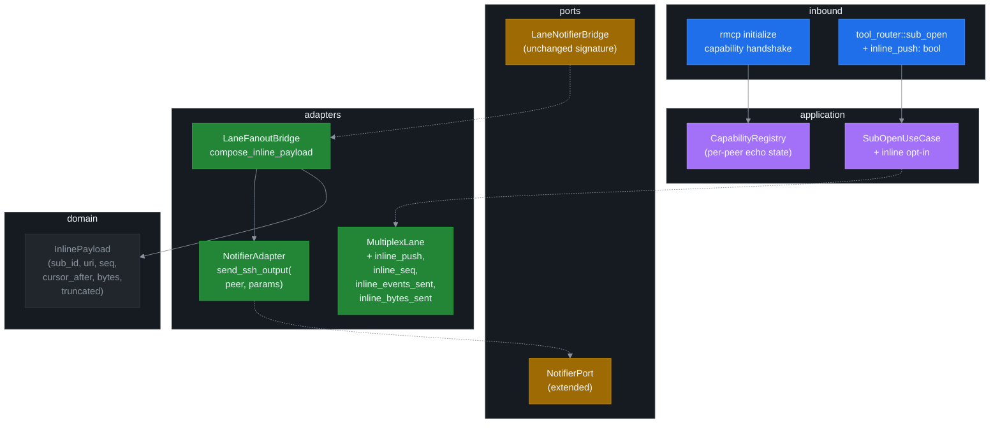
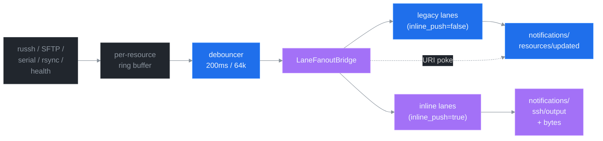

# ADR 0012: Inline-push notifications for shell / exec / serial output

## Status

Proposed. Targets v7.1.0. **Wire-additive on the MCP surface**: every v7.0.x client keeps working byte-for-byte. Inline push is **opt-in per subscription** via a new `inline_push` flag on `sub_open`, gated behind a server-side capability advertisement at `initialize` time and a client-side capability probe so spec-only hosts never see the custom notification method.

Depends on ADR 0003 (Lifecycle Binding), ADR 0004 (Channel Mux), ADR 0005 (LLM UX), ADR 0006 (Backpressure Policies), ADR 0007 (Error Taxonomy), and ADR 0008 (NDJSON Daemon Protocol). Co-exists with — does not replace — the legacy `notifications/resources/updated` + `resources/read?cursor=auto` flow.

## Context and Problem Statement

ssh-mcp v7.0.2 delivers shell and exec output through the v5 subscribe pipeline ([ADR 0004](0004-channel-mux-fairness.md)):

```text
producer (russh recv / SFTP / serial / rsync / health)
    -> per-resource ring buffer (ArcSwap<RingBuffer>)
    -> per-resource debouncer (200 ms coalesce + 64 KiB byte-threshold)
    -> per-(SubId, Uri) MultiplexLane mpsc(N)
    -> ChannelMux round-robin drain
    -> outbound writer (rmcp Peer or NDJSON daemon)
    -> notifications/resources/updated { uri }  // PAYLOAD: URI ONLY
    -> client issues resources/read?cursor=auto
    -> client receives bytes
```

The MCP 2025-06-18 specification deliberately makes `notifications/resources/updated` carry the URI only — the protocol assumes resources are large, idempotent, and pull-shaped. The client decides when to read and how much. For ssh-mcp the assumption inverts: shell and exec streams are append-only, small per chunk, and high-cadence. The two-leg notify→read flow is functionally correct but operationally awkward for the LLM-driven interactive use case that v7 deployments report most often:

1. The host issues `ssh_shell_write` (one prompt keystroke or one command line).
2. The remote shell echoes the input and emits a response within a few milliseconds.
3. The server coalesces the bytes into the per-resource debouncer (200 ms window or 64 KiB threshold — whichever fires first).
4. The server fires `notifications/resources/updated` for `shell://<id>/output`.
5. The host receives the notification and issues `resources/read?cursor=auto`.
6. The host parses the delta and decides on the next keystroke / command.

The dominant cost is **two protocol round-trips per delta**. On a local stdio transport the per-leg latency is sub-millisecond; on Streamable HTTP it is a few milliseconds; on long-haul HTTP it is tens of milliseconds. For driving a noisy terminal (debugger prompts, REPL sessions, kernel boots streaming dmesg) the cumulative cost is the difference between feeling like a real PTY and feeling like a remote-shell-emulator written on top of a paged inbox.

The 27B-class host failure modes documented in [ADR 0005](0005-llm-ux-priorities.md) compound the cost. A model that already struggles to keep the subscribe lifecycle correct now also has to interleave `resources/read?cursor=auto` and `ssh_shell_write` on every iteration — and either the read is forgotten (output appears delayed by one whole debounce window) or the read is issued before the notification arrives (empty delta, retry).

User intent (recorded for traceability):

> "Eu quero enviar um write e receber o buffer da console em realtime. Subscribe ainda tem que ficar lendo buffer."

Translated: the caller wants a write→push→bytes flow where the notification itself carries the delta. The subscribe lane stays the spec-compliant fallback for hosts that prefer pull-shaped reads; it is not removed.

Three candidate surfaces inside the MCP 2025-06-18 envelope were inspected before this ADR:

| Spec surface | Shape | Verdict |
|---|---|---|
| `notifications/resources/updated` | `{uri}` only | Wire shape locked; no room for bytes. |
| `notifications/progress` | `{progressToken, progress, total, message}` | `message` is human-readable string; semantically a progress bar, not a byte channel. |
| `notifications/message` | logging severity + `data` | Severity model wrong; generic hosts filter as log noise. |
| Streamable HTTP SSE | per-request stream | Already in use for `tools/call`; not a notification channel. |
| `_meta` extension on existing notification | reserved field for extensions | Workable but bloats every update for non-opt-in subs unless carefully gated. |

None of the spec surfaces ship a true server-to-client byte-stream notification. Any solution that delivers bytes inline therefore lives **outside the spec proper** — either as a vendor-namespaced notification method (`notifications/ssh/output`) or as an extension field on an existing notification (`_meta.ssh_inline_push`). The ADR settles which.

## Decision Drivers

The following non-negotiables shape the option ranking. They are the project invariants that any candidate must preserve.

### D1. Wire-additive migration

Every v7.0.x client must keep working with a v7.1 server without any host-side change. The default behaviour of every existing tool, every existing notification, every existing structured payload stays byte-identical. Hosts that do not opt in see exactly v7.0.2 wires. This rule is non-negotiable — the project has held it across ADRs 0003, 0004, 0005, 0006, 0007, 0008, 0009, 0010, and 0011, and the rsync ADR 0011 hardened it again.

### D2. Lock-free hot path

`Cargo.toml` `[lints.clippy]` denies `await_holding_lock`, `await_holding_refcell_ref`, `significant_drop_in_scrutinee`, `significant_drop_tightening`, `mutex_atomic`, `mutex_integer`. Every hot-path state type (`RunningCommand`, `RunningShell`, `RunningTransfer`, `SessionRef`, `ForwardHandle`, `ResourceLifecycle`, `SessionLifecycle`, `MultiplexLane`, `ChannelMux`) carries zero `Mutex` fields. Any new inline-push state must reuse atomics (`AtomicU64`, `AtomicBool`, `ArcSwap`, `OnceCell`) and lock-free channels (`tokio::sync::mpsc`, `broadcast`, `Notify`). The lane fan-out path is already lock-free — `LaneFanoutBridge::notify_lanes` walks a snapshot of `SubscriberLaneAdapter::lanes_for_uri_public(uri)` and increments per-lane atomics. Inline push must slot into this same path without introducing a critical section.

### D3. Debouncer coalescing preserved

The debouncer ([ADR 0006](0006-backpressure-policies.md), Amendment 1) is the single rate-controller for all subscribers of a URI. It coalesces producer pokes into one event per debounce window (200 ms) or per byte threshold (64 KiB). Inline push must ride the same debouncer — it cannot bypass it, because doing so would let a fast producer drown a single slow consumer outside the existing backpressure budget and break the mux fairness contract.

### D4. ChannelMux round-robin fairness preserved

The mux ([ADR 0004](0004-channel-mux-fairness.md)) guarantees that between two backlogged lanes A and B, the drainer alternates `try_recv` and bumps the cursor on every successful drain. Inline-push subscribers cannot bypass the mux, because doing so would let an inline-opt-in lane on a hot URI starve a legacy subscribe lane on a cold URI. The inline payload must be composed at the lane outbound writer site (the same point where the legacy notification is currently emitted), not at the producer site.

### D5. Backpressure policy interaction

The four `LagPolicy` variants from [ADR 0006](0006-backpressure-policies.md) (`BlockSlow`, `DropOldest`, `DropNewest`, `Snapshot`) define what happens when a lane mpsc fills. Inline push must obey the same policy. A `Snapshot` inline-push lane that lags drops the coalesced bytes for that window — not the notification stream itself. A `DropOldest` inline-push lane pops the oldest queued payload, not the lane's seat in the mux. The policy is the single source of truth for drop semantics; inline push must not invent a fifth.

### D6. LLM UX continuity

[ADR 0005](0005-llm-ux-priorities.md) defines the four-layer escalation surface (`Implementation.instructions` → tool description → `HINT:` line → `NEXT:` line). The `sub_open` `Hygiene:` field must keep telling the model exactly what to do next. An inline-opt-in subscriber does not need to call `resources/read?cursor=auto` — the `NEXT:` line on `sub_open` should reflect that when the opt-in is honoured. The cursor advance still happens server-side so the lane stats stay consistent.

### D7. Spec-only host fall-back

Hosts that speak only stock MCP must never see the custom notification method. The server advertises an `experimental.ssh_inline_push` capability at `initialize` time; the client mirrors it back in its own `capabilities` envelope. A client that does not echo the capability never receives an inline-push notification, even if it passes `inline_push = true` to `sub_open` — the server downgrades the lane to legacy mode and emits a `HINT: RECOMMENDED: client did not advertise ssh_inline_push capability; falling back to pull-mode` line on the `sub_open` response.

### D8. Bounded payload size

A 64 KiB debounce-flush payload is fine over stdio, fine over HTTP, borderline over Streamable HTTP SSE for some intermediaries. The server caps inline-push payload size per notification at `SSH_INLINE_PUSH_MAX_BYTES_PER_NOTIFY` (default 32 KiB). Coalesced windows that exceed the cap split across multiple notifications carrying contiguous `seq` and `cursor_after` fields. Splitting respects UTF-8 boundaries when the URI is a known text stream (shell, serial, command); binary streams (transfer, rsync progress, forward events) are not in scope for v7.1 inline push.

### D9. Single-source-of-truth for cursor

Every lane already tracks a byte cursor in the legacy pull flow. Inline-push payloads include the post-payload cursor (`cursor_after: u64`) so the host can issue a follow-up `resources/read?cursor=<value>` if it needs to verify or replay. The cursor advances server-side regardless of inline-push opt-in — the inline notification is a delivery optimisation, not a state machine fork.

### D10. NDJSON daemon parity

[ADR 0008](0008-ndjson-daemon-protocol.md) translates MCP notifications into stdout NDJSON events. Inline-push notifications must round-trip through the daemon as a new event type (`{"ev":"inline_push","sub_id":"...","uri":"...","seq":N,"cursor_after":M,"bytes_b64":"..."}`). The daemon never decodes the bytes back to MCP — the NDJSON consumer is the terminal sink.

### D11. Zero new dependencies

`base64` is already in the dependency tree (transitively via `rmcp`); no new crate required. JSON encoding is `serde_json` (already in tree). No new build-graph cost.

### D12. Methods under thirty lines

The existing `LaneFanoutBridge::notify_lanes` is twenty lines. The inline-push addition must stay within the project method-length budget. The new payload composition logic is factored into a private helper `compose_inline_payload(&self, lane, uri, bytes_added) -> Option<InlinePayload>` so the bridge itself stays small.

## Considered Options

### Option A — Custom non-standard notification method (RECOMMENDED)

Define a vendor-namespaced notification:

```jsonc
{
  "jsonrpc": "2.0",
  "method": "notifications/ssh/output",
  "params": {
    "sub_id": "0193f04e-3a2b-7c12-8d11-1f1f04ab92e1",
    "uri": "shell://0193f04e-.../output",
    "seq": 42,
    "cursor_after": 12345,
    "len": 318,
    "encoding": "base64",
    "bytes_b64": "PGV2ZW50PnByZXR0eS1tdWNoLWVtcHR5LXBheWxvYWQ8L2V2ZW50Pg==",
    "truncated": false
  }
}
```

Opt-in via `sub_open.inline_push: bool = false`. Gated by `experimental.ssh_inline_push` capability advertised at `initialize` and echoed by the client. Hosts without the capability never receive the method even if they opt in.

When `inline_push = true` and the capability is honoured, the server:

1. Continues to emit `notifications/resources/updated` per the existing debouncer cadence — keeping legacy pull-mode tools (`resources/read?cursor=auto`, `sub_replay`) working unchanged.
2. Additionally emits `notifications/ssh/output` carrying the same coalesced bytes that the pull-mode read would have returned. The host is free to ignore the pull-mode notification or read it as a redundant marker.
3. Increments per-lane `inline_events_sent` and `inline_bytes_sent` atomics so `sub_stats` differentiates inline vs pull delivery.

**Pros.**

- Cleanest semantic fit: the notification method name says exactly what the payload is.
- Zero collision with spec methods — generic hosts simply do not subscribe to the method.
- `_meta` field on legacy notifications stays untouched.
- Composes with [ADR 0008](0008-ndjson-daemon-protocol.md) — NDJSON daemon round-trips the method as a new event type without changing existing types.
- Per-lane stats stay clean (separate atomics for inline vs pull).

**Cons.**

- Generic MCP hosts cannot consume the method; the project has to document the capability handshake.
- Future MCP spec might add a standard inline channel; the custom method becomes deprecated. (Migration would be additive — emit both for a release.)
- Requires the server to mint a second outbound notification per debounce window when `inline_push = true` — small CPU + bytes cost.

### Option B — Abuse `notifications/message` (logging) with structured `data`

Reuse the spec-blessed logging notification with `level: "debug"` and a structured `data` payload carrying the bytes.

**Pros.**

- Spec-compliant on the wire — no vendor method.
- Generic hosts receive the notification (and likely filter it as log noise).

**Cons.**

- Semantically wrong: this is data, not a log entry. Hosts that pipe logging to a real logger will fan inline-push payloads into their log aggregator at debug severity. That is a data leak surface.
- `data` is free-form per spec; coordinating the wire shape across hosts requires the same out-of-band agreement Option A requires anyway.
- Severity level forces a choice (`debug`/`info`/`notice`/`warning`/...) — none of them mean "byte channel".
- Conflicts with the v5/v6 `tracing` + `RUST_LOG` story (the server already emits MCP logging notifications for tracing events when configured — payload collision is plausible).

**Verdict.** Rejected. The semantic mismatch is irrecoverable; the data-leak-into-logs failure mode is worse than the spec-only-host fall-back cost in Option A.

### Option C — Stuff bytes into `notifications/resources/updated` `_meta` field

The MCP spec reserves `_meta` for implementation extensions on every notification. Bytes ride along with the standard URI notification:

```jsonc
{
  "jsonrpc": "2.0",
  "method": "notifications/resources/updated",
  "params": {
    "uri": "shell://0193f04e-.../output",
    "_meta": {
      "ssh_mcp": {
        "sub_id": "0193f04e-3a2b-7c12-8d11-1f1f04ab92e1",
        "seq": 42,
        "cursor_after": 12345,
        "bytes_b64": "PGV2ZW50PnByZXR0eS1tdWNoLWVtcHR5LXBheWxvYWQ8L2V2ZW50Pg=="
      }
    }
  }
}
```

**Pros.**

- Single notification per debounce window (one method, one payload).
- `_meta` is the spec-blessed extension point.
- Generic hosts ignore the `_meta` block; they still get the URI notification and can `resources/read` as usual.

**Cons.**

- Every subscriber on the URI receives the inline payload, not just the opt-in ones. The lane is keyed per `(SubId, Uri)` but the legacy spec notification is keyed per `(PeerId, Uri)` and goes out once per peer. Gating `_meta` injection per subscriber requires either:
  - One spec notification per opt-in subscriber (defeats the point of one-notification-per-window).
  - Injecting `_meta` unconditionally and letting non-opt-in subscribers waste CPU on a base64 decode they will ignore (wire pollution; bandwidth multiplier on multi-subscriber URIs).
  - Splitting the legacy notification into "with `_meta`" and "without `_meta`" variants per debounce window — equivalent to Option A but uglier.
- `_meta` is per-spec a free-form opaque blob; future spec amendments could constrain it; depending on its shape for byte transport is a moderate spec-stability risk.
- The lane peer association in `LaneFanoutBridge` is per-lane (Option A is a clean fit), not per-`(PeerId, Uri)` (which is the granularity Option C operates at).

**Verdict.** Rejected. The "every subscriber pays for one subscriber's opt-in" failure mode is unacceptable. Option A keeps the per-lane gating clean.

### Option D — Side-channel SSE / WebSocket transport outside MCP

Stand up a second port that emits raw byte streams keyed by `sub_id`. The MCP server returns a URL alongside `sub_open`; the host opens an SSE or WebSocket connection to it and consumes bytes directly.

**Pros.**

- Cleanest separation: MCP stays spec-compliant; the byte channel runs on its own protocol with its own backpressure / framing.
- Maximum throughput: no JSON framing on the byte channel.
- No vendor-namespaced notification method.

**Cons.**

- Doubles the operational surface (second port, second TLS termination, second auth model).
- Breaks the "MCP-only" promise that ssh-mcp ships today. Operators have explicit firewall rules for the rmcp port; a second port requires a fresh approval cycle.
- The stdio binary (`ssh-mcp-stdio`) has no second-port story — would have to fall back to Option A for stdio anyway.
- The NDJSON daemon (`ssh-mcp-tail`) has no second-port story either.
- Adds auth model complexity: the SSE/WS port has to validate the `sub_id` and confirm the requester is the same MCP peer that opened it. That is the kind of cross-protocol auth bridge that drives CVE retrospectives.

**Verdict.** Rejected. The operational and auth costs are disproportionate. If we ever need raw byte throughput on a side channel, the right place to do it is the spec — propose it upstream — not a bolt-on transport.

### Option E — Status quo (notify + `resources/read?cursor=auto`)

Document the existing latency budget. Reject the new feature.

**Pros.**

- Zero engineering cost.
- Stays exactly inside spec.
- The latency on local stdio is sub-millisecond; on local HTTP a few milliseconds. Many workloads are insensitive to this.

**Cons.**

- The user-reported pain point (interactive PTY mirroring for LLM-driven flows) is real and unresolved.
- The two-leg flow compounds the 27B-class failure modes in [ADR 0005](0005-llm-ux-priorities.md) — every iteration is a chance for the model to forget the second leg.
- Once a future MCP spec adds inline byte transport, ssh-mcp ships against it. Until then, the project ships nothing.

**Verdict.** Rejected. The pain is documented; the engineering cost of Option A is bounded; the rest of the v5/v6/v7 stack is purpose-built to absorb this addition.

## Decision Outcome

**Chosen: Option A — Custom non-standard notification method `notifications/ssh/output`, opt-in per `sub_open`, gated by an `experimental.ssh_inline_push` capability advertised at `initialize` and echoed by the client.**

The rationale follows the decision drivers:

- **D1 (wire-additive)**: capability default-off, `sub_open.inline_push: bool = false`. v7.0.x hosts see byte-identical wires.
- **D2 (lock-free)**: the inline payload is composed inside `LaneFanoutBridge::notify_lanes` from the byte-counter delta already maintained on the per-lane atomics. The lane gains four new fields, all atomic: `inline_push: AtomicBool` (opt-in flag set at lane creation, never re-mutated), `inline_seq: AtomicU64` (monotonic per-lane), `inline_events_sent: AtomicU64`, `inline_bytes_sent: AtomicU64`. No new `Mutex`. The base64 encode is stack-bounded (`SSH_INLINE_PUSH_MAX_BYTES_PER_NOTIFY` default 32 KiB → ~43 KiB base64), allocated per-notification on the lane drain task.
- **D3 (debouncer)**: inline-push lanes consume the same `notify_lanes` call. The debouncer is unchanged.
- **D4 (mux fairness)**: inline-push subscribers do not bypass the mux. The bridge is invoked from `MemoryRegistry::broadcast`, which is the existing fan-out point. The mux round-robin contract holds because the inline payload composition is per-lane, not per-mux-slot.
- **D5 (backpressure)**: the inline payload is queued onto the lane mpsc as a `LaneMessage::InlinePush(payload)` variant. The lane's `LagPolicy` decides what happens when the mpsc fills — `BlockSlow` blocks the producer, `DropOldest` pops the oldest queued payload, `Snapshot` drops the queue and emits a snapshot marker on next event.
- **D6 (LLM UX)**: `sub_open` `Hygiene:` field gains a sentence: "When `inline_push=true`, bytes arrive in `notifications/ssh/output`; you do not need to read `resources/read?cursor=auto` separately. Pull-mode `resources/read?cursor=...` is still available as a verification path."
- **D7 (spec-only fallback)**: the capability handshake at `initialize` is the spec-blessed extension mechanism. Hosts that do not echo the capability silently fall back; `sub_open` emits the recommendation hint.
- **D8 (bounded payload)**: `SSH_INLINE_PUSH_MAX_BYTES_PER_NOTIFY` default 32 KiB; coalesced windows >32 KiB split across multiple `notifications/ssh/output` with contiguous `seq` and `cursor_after`. The `truncated: false | true` field signals the last fragment of a split.
- **D9 (cursor source of truth)**: `cursor_after` field on every inline payload mirrors the server-side cursor. Hosts that want to verify can issue `resources/read?cursor=<cursor_after - len>` and the bytes match.
- **D10 (daemon parity)**: NDJSON daemon ([ADR 0008](0008-ndjson-daemon-protocol.md)) gains one event type: `{"ev":"inline_push","sub_id":...,"uri":...,"seq":...,"cursor_after":...,"len":...,"bytes_b64":"..."}`. The daemon translates the inline notification into the new event verbatim; no decode-and-re-encode round-trip.
- **D11 (zero new dependencies)**: `base64` is already in the dependency tree; `serde_json` is already in tree. No build-graph cost.
- **D12 (methods under thirty lines)**: the composition helper is six lines; the bridge addition is four lines; the lane field additions are field declarations.

### Hexagonal layer map



### Subscribe pipeline (v7.1 layered view)



The inline lane fires `notifications/ssh/output` carrying the coalesced bytes; the bridge **also** issues the legacy `notifications/resources/updated` for the same window so pull-mode subscribers on the URI (who may be on the same peer or a different peer) are unaffected. The two notifications are independent — emitting one never suppresses the other.

### Tool surface

`sub_open` gains one optional field. `sub_stats` gains four atomics. No other tool changes.

```rust
// src/infra/mcp/args/subscription.rs (additive)
#[derive(Debug, Deserialize, Serialize, JsonSchema)]
pub struct SubOpenArgs {
    // ... existing fields unchanged ...

    /// When `true` **and** the client advertised the
    /// `experimental.ssh_inline_push` capability at `initialize`, the
    /// server delivers coalesced bytes inline via the custom
    /// `notifications/ssh/output` method instead of forcing a
    /// follow-up `resources/read?cursor=auto`. Legacy
    /// `notifications/resources/updated` is still emitted for the
    /// same window so pull-mode subscribers remain unaffected.
    ///
    /// Default `false` — every v7.0.x host sees byte-identical wires.
    /// When `true` but the capability is not echoed, the server
    /// downgrades the lane silently and emits a `HINT: RECOMMENDED:`
    /// line on the `sub_open` response.
    #[serde(default)]
    pub inline_push: bool,
}
```

```rust
// src/adapters/subscription/subscriber_lane.rs (additive)
pub struct MultiplexLane {
    // ... existing fields unchanged ...

    /// Inline-push opt-in. Immutable after lane creation.
    inline_push: AtomicBool,

    /// Per-lane monotonic sequence for inline payloads.
    /// Wraps to 0 on overflow (4e9 events).
    inline_seq: AtomicU64,

    /// Cumulative inline events delivered.
    inline_events_sent: AtomicU64,

    /// Cumulative inline bytes delivered (raw, not base64-inflated).
    inline_bytes_sent: AtomicU64,
}
```

```rust
// src/domain/subscription.rs (additive)
pub struct InlinePayload {
    pub sub_id: SubId,
    pub uri: String,
    pub seq: u64,
    pub cursor_after: u64,
    pub bytes: Vec<u8>,
    pub truncated: bool,
}
```

The notifier port grows one method on the dyn-safe slice (the production adapter signs the variant; the fake under `feature = "test-fixtures"` records it in a vec for assertions):

```rust
// src/ports/notifier.rs (additive)
#[trait_variant::make(NotifierPort: Send)]
pub trait LocalNotifierPort: Sync {
    // ... existing notify_resource_updated unchanged ...

    /// Send a vendor `notifications/ssh/output` to a single peer.
    ///
    /// Caller responsibility:
    /// - Confirms the peer advertised `experimental.ssh_inline_push`.
    /// - Splits payloads that exceed
    ///   `SSH_INLINE_PUSH_MAX_BYTES_PER_NOTIFY` into contiguous
    ///   fragments with monotonic `seq` and a final `truncated=false`.
    ///
    /// # Errors
    ///
    /// Returns `DomainError::Transport` when the underlying transport
    /// rejects the notification (closed channel, IO failure, etc).
    async fn notify_ssh_output(
        &self,
        peer: Arc<dyn PeerHandle>,
        payload: InlinePayload,
    ) -> Result<(), DomainError>;
}
```

### Capability handshake

The server advertises the capability in its `initialize` response:

```jsonc
{
  "result": {
    "protocolVersion": "2025-06-18",
    "serverInfo": { "name": "ssh-mcp", "version": "7.1.0" },
    "capabilities": {
      "tools": { "listChanged": true },
      "resources": { "subscribe": true, "listChanged": true },
      "prompts": { "listChanged": false },
      "experimental": {
        "ssh_inline_push": {
          "version": "1",
          "max_bytes_per_notify": 32768,
          "schemes": ["shell", "command", "serial"]
        }
      }
    }
  }
}
```

The client either echoes the capability in its own `initialize` request (preferred for new clients):

```jsonc
{
  "params": {
    "capabilities": {
      "experimental": {
        "ssh_inline_push": { "version": "1" }
      }
    }
  }
}
```

…or it does not, in which case the server records the peer as inline-push-incapable. The check is per-peer (the `PeerHandle::id()` keys the `CapabilityRegistry`); a single peer disconnecting and reconnecting must re-advertise.

A peer that advertises a `version` the server does not understand is treated as inline-push-incapable. The server logs a `tracing::info!("client advertised unknown ssh_inline_push version {v}; falling back to pull-mode")`.

### Algorithm — payload composition

```text
LaneFanoutBridge::notify_lanes(uri, bytes_added):
   lanes = self.lanes.lanes_for_uri_public(uri)
   for lane in lanes:
       peer = lane.peer().map(Arc::clone)
       if peer.is_none():
           continue

       // Legacy URI notification (always)
       self.notifier.notify_resource_updated(peer, uri).await
       lane.record_notify(bytes_added)

       // Inline payload (opt-in + capability gate)
       if !lane.inline_push.load(Relaxed):
           continue
       if !self.capability_registry.has_inline_push(peer.id()):
           continue
       payload = self.compose_inline_payload(lane, uri, bytes_added)
       if payload.is_none():
           continue
       for fragment in payload.unwrap().split(MAX_BYTES_PER_NOTIFY):
           self.notifier.notify_ssh_output(peer, fragment).await
           lane.inline_events_sent.fetch_add(1, Relaxed)
           lane.inline_bytes_sent.fetch_add(fragment.bytes.len(), Relaxed)
```

```text
compose_inline_payload(lane, uri, bytes_added):
   cursor_before = lane.byte_cursor.load(Acquire)
   cursor_after  = cursor_before + bytes_added
   bytes = registry.read_range(uri, cursor_before..cursor_after)
   if bytes.is_empty():
       return None
   seq = lane.inline_seq.fetch_add(1, Relaxed)
   return Some(InlinePayload {
       sub_id: lane.sub_id(),
       uri,
       seq,
       cursor_after,
       bytes,
       truncated: false,
   })
```

The `registry.read_range` call hits the same ring buffer the legacy `resources/read?cursor=auto` reads from. There is no separate byte path — the inline payload is the same bytes the pull-mode read would have returned.

The split rule:

```text
InlinePayload::split(max):
   if self.bytes.len() <= max:
       return vec![self]
   let mut out = Vec::new()
   let mut start = 0
   let mut seq = self.seq
   while start < self.bytes.len():
       let end = (start + max).min(self.bytes.len())
       let end = utf8_safe_split(self.bytes, start, end, self.uri.is_text())
       let truncated = end < self.bytes.len()
       out.push(InlinePayload {
           sub_id: self.sub_id,
           uri: self.uri.clone(),
           seq,
           cursor_after: self.cursor_after - (self.bytes.len() - end) as u64,
           bytes: self.bytes[start..end].to_vec(),
           truncated,
       })
       seq += 1
       start = end
   out
```

`utf8_safe_split` walks backwards from the proposed split point until it finds a non-continuation byte (most-significant bits `10xxxxxx`); binary streams (transfer / rsync / forward / session) skip this check. Today only shell / command / serial opt-in (binary URIs are explicitly out of scope per D8); the helper is gated on `uri.is_text()`.

### Wire shape

```text
SUB_OPEN: OK
SUB_ID: 0193f04e-3a2b-7c12-8d11-1f1f04ab92e1
URI: shell://0193f04e-.../output
LIFETIME: manual
GRACE_MS: 2000
LAG_POLICY: snapshot
INLINE_PUSH: true                                          # NEW (only when opt-in)
INLINE_PUSH_HONORED: true                                  # NEW (false if cap missing)
HINT: REQUIRED NEXT STEP: drive the shell with ssh_shell_write or ssh_shell_press; bytes arrive in notifications/ssh/output.
NEXT: ssh_shell_write text="ls -la\n" shell_id=...         # push-first
NEXT: resources/read uri=shell://.../output cursor=auto    # verification fallback
```

When the client did not echo the capability, the response degrades cleanly:

```text
SUB_OPEN: OK
SUB_ID: 0193f04e-3a2b-7c12-8d11-1f1f04ab92e1
URI: shell://0193f04e-.../output
LIFETIME: manual
GRACE_MS: 2000
LAG_POLICY: snapshot
INLINE_PUSH: true
INLINE_PUSH_HONORED: false
HINT: RECOMMENDED: client did not advertise ssh_inline_push capability; falling back to notifications/resources/updated + resources/read?cursor=auto.
NEXT: ssh_shell_write text="ls -la\n" shell_id=...
NEXT: resources/read uri=shell://.../output cursor=auto
```

Structured payload mirrors the new fields:

```json
{
  "tool": "sub_open",
  "status": "ok",
  "sub_id": "0193f04e-3a2b-7c12-8d11-1f1f04ab92e1",
  "uri": "shell://0193f04e-.../output",
  "lifetime": "manual",
  "lag_policy": "snapshot",
  "inline_push": true,
  "inline_push_honored": true
}
```

`#[serde(default)]` on both new fields keeps every v7.0.x snapshot deserialising untouched.

`sub_stats` gains four fields, all defaulting to zero on legacy lanes:

```json
{
  "tool": "sub_stats",
  "status": "ok",
  "sub_id": "0193f04e-...",
  "events_sent": 142,
  "bytes_sent": 18394,
  "lag_drops": 0,
  "queue_depth": 0,
  "inline_push": true,
  "inline_events_sent": 142,
  "inline_bytes_sent": 18394
}
```

When `inline_push = false`, `inline_events_sent` and `inline_bytes_sent` are always `0`. When `inline_push = true` but the capability was not honoured, they are also always `0` (and `inline_push_honored = false` on the lane snapshot).

### Configuration surface

Three new environment variables. All default-on for safe behaviour preservation.

| Env var | Type | Default | Bounds | Purpose |
|---|---|---|---|---|
| `SSH_INLINE_PUSH_DEFAULT` | `bool` | `false` | — | When `true`, treats `sub_open.inline_push = None` as `true` for new lanes. Default `false` preserves v7.0.x semantics. Sites that pre-flight the capability handshake server-wide can flip this. |
| `SSH_INLINE_PUSH_MAX_BYTES_PER_NOTIFY` | bytes (`b/k/m/g/t`) | `32k` | `1k` to `1m` | Per-notification payload cap (raw bytes, before base64). Coalesced windows above this size split across multiple `notifications/ssh/output` with monotonic `seq` and a terminating `truncated=false` fragment. |
| `SSH_INLINE_PUSH_DAEMON_RELAY` | `bool` | `true` | — | When `true`, the NDJSON daemon (`ssh-mcp-tail`) translates `notifications/ssh/output` into a new `{"ev":"inline_push", ...}` event. When `false`, the daemon drops the notification silently (legacy pull-mode behaviour). |

All three vars follow the `SSH_*` prefix convention from `docs/CONFIGURATION.md` and inherit the `Duration` / `ByteSize` parsing already in `src/composition/config.rs`. No new dependencies, no new config plumbing.

### Error taxonomy delta (extends ADR 0007)

Two new codes; neither is retryable. Both surface only when `inline_push = true`.

| Code | Category | Retry | Detail |
|---|---|---|---|
| `INLINE_PUSH_OVERSIZE` | `POLICY` | no | "Single inline-push payload exceeds the server cap. Increase `SSH_INLINE_PUSH_MAX_BYTES_PER_NOTIFY` or set `lag_policy=drop_oldest` to coalesce smaller windows." |
| `INLINE_PUSH_UNSUPPORTED_CLIENT` | `STATE` | no | "Client did not advertise the `experimental.ssh_inline_push` capability at initialize; cannot honour `inline_push=true`. Re-initialize with the capability or call `sub_open` with `inline_push=false`." |

Both are caller-fixable, never transient. `INLINE_PUSH_OVERSIZE` is a `POLICY` because the cap is a server-side configuration; `INLINE_PUSH_UNSUPPORTED_CLIENT` is a `STATE` because the cure is to reinitialise the session with the capability advertised.

Note that `INLINE_PUSH_UNSUPPORTED_CLIENT` is **not** returned by `sub_open` — `sub_open` always succeeds and downgrades the lane silently with a `RECOMMENDED:` `HINT:` line (D7 — spec-only host fall-back). The error code surfaces only when a host attempts to elevate the lane after the fact (a future `sub_inline_elevate` tool, out of scope for this ADR) or when the runtime detects a configuration drift (server `experimental.ssh_inline_push` capability disabled mid-session via a `tools/listChanged`-style refresh, also out of scope).

Total error-taxonomy size after this ADR: 46 → **48** codes. The 48 are partitioned as: `AUTH` (8), `TRANSPORT` (9), `REMOTE` (7), `RESOURCE` (6), `POLICY` (5), `STATE` (8), `INTERNAL` (5).

### Capability registry

A small additive component, lock-free by construction.

```rust
// src/adapters/capability/registry.rs (new)

#[derive(Debug, Default)]
pub struct CapabilityRegistry {
    /// (peer_id, capability_name) -> version string.
    /// Empty value means "advertised, no version".
    inner: DashMap<(PeerId, String), String>,
}

impl CapabilityRegistry {
    #[must_use]
    pub fn has_inline_push(&self, peer_id: &PeerId) -> bool {
        self.inner.contains_key(&(peer_id.clone(), "ssh_inline_push".to_string()))
    }

    pub fn record(&self, peer_id: PeerId, name: String, version: String) {
        self.inner.insert((peer_id, name), version);
    }

    pub fn drop_peer(&self, peer_id: &PeerId) {
        self.inner.retain(|(p, _), _| p != peer_id);
    }
}
```

Wired into the composition root (`src/composition/prod.rs`). The peer-GC task ([ADR 0008](0008-ndjson-daemon-protocol.md) reference) calls `drop_peer` when it culls a closed peer. No `Mutex`; the `DashMap` is sharded and the ops are single-key writes / reads — clippy's `await_holding_lock` is not triggered (no `.await` between the `entry` / `contains_key` and the result).

### NDJSON daemon parity (extends ADR 0008)

The daemon (`ssh-mcp-tail`) currently translates `notifications/resources/updated { uri }` into:

```json
{"ev":"resource_updated","uri":"shell://0193f04e-.../output"}
```

When `inline_push = true` is honoured on the lane and `SSH_INLINE_PUSH_DAEMON_RELAY = true` (default), the daemon emits the new event type **in addition** to the existing one:

```json
{"ev":"resource_updated","uri":"shell://0193f04e-.../output"}
{"ev":"inline_push","sub_id":"0193f04e-...","uri":"shell://0193f04e-.../output","seq":42,"cursor_after":12345,"len":318,"bytes_b64":"PGV2ZW50Pi4uLjwvZXZlbnQ+","truncated":false}
```

The two events are emitted in their server-side order; downstream NDJSON consumers may dedup or join on `sub_id`. The NDJSON envelope is line-delimited UTF-8 JSON; the `bytes_b64` field is the only field that grows with payload size. NDJSON consumers that do not care about inline-push set `SSH_INLINE_PUSH_DAEMON_RELAY=false` and never see the second event type.

## Consequences

### Wire compatibility

- **v7.0.x hosts unchanged** — `sub_open.inline_push` defaults to `false`; the server emits exactly v7.0.x wires. Snapshot tests in `tests/v4_smoke.rs`, `tests/v5_smoke.rs`, `tests/v5_daemon_smoke.rs`, `tests/v6_resume_smoke.rs`, `tests/v7_rsync_smoke.rs` are all unchanged.
- **Cursor key** — `(SubId, Uri)` from [ADR 0004](0004-channel-mux-fairness.md) is unchanged. Inline-push lanes are addressed by the same `SubId`; the inline notification carries `sub_id` so hosts that mux multiple subscriptions on one peer can demux correctly.
- **NDJSON daemon** — the daemon adds one new event type; existing event types are byte-identical. `SSH_INLINE_PUSH_DAEMON_RELAY=false` reverts to v7.0.x daemon wires for the same lane.

### LLM UX (extends ADR 0005)

- `sub_open` description gains a `Push:` field clarification: "When `inline_push=true` and the client advertised the capability, bytes ride inline in `notifications/ssh/output`; you do not need a follow-up `resources/read`."
- `Implementation.instructions` gains a fifth golden rule: "When the server advertises `experimental.ssh_inline_push` and your transport supports custom methods, prefer `sub_open inline_push=true` over the legacy `subscribe + resources/read` pair — fewer round-trips for the same byte cadence."
- The `HINT: REQUIRED NEXT STEP:` line on a `inline_push=true` lane drops the `resources/read?cursor=auto` recommendation and replaces it with the push-first NEXT lines listed in the wire-shape example. Hosts that want to verify still get a fallback NEXT.
- `SUB_LEAK_RISK` watcher (from [ADR 0005](0005-llm-ux-priorities.md)) treats an inline-push lane that has not received an `unsubscribe` after the configured TTL the same way as any other lane.

### Edge cases (documented + tested)

1. **Client opts in but does not echo the capability.** `INLINE_PUSH: true` + `INLINE_PUSH_HONORED: false` on the `sub_open` response. No inline notifications are emitted; legacy URI notifications continue. Documented; verified by `tests/v7_inline_push_smoke.rs::optin_without_capability_falls_back`.
2. **Server cap is set lower than the debouncer byte threshold.** `SSH_INLINE_PUSH_MAX_BYTES_PER_NOTIFY=4k` + debouncer flush at 64 KiB: the bridge splits the coalesced window into 16 contiguous fragments with monotonic `seq`. The host reassembles by concatenating bytes in `seq` order. Documented; verified by `tests/property_inline_push.rs::split_round_trips_bytes`.
3. **Coalesced window exceeds the lane mpsc capacity.** The lane's `LagPolicy` decides: `BlockSlow` blocks the producer until the lane drains, `DropOldest` pops the oldest queued `LaneMessage::InlinePush(...)` and emits a `lagged` marker (legacy semantics, [ADR 0006](0006-backpressure-policies.md)), `Snapshot` drops the queue and emits a `snapshot` marker. The host that wakes after a lag receives the marker and the next inline payload starts from a new `seq` with `cursor_after` reflecting the post-drop server cursor.
4. **Inline notification fails to deliver** (transport closed, peer dropped mid-flush). The bridge logs at `debug` level (matching the existing legacy notification failure path), increments `inline_events_failed` on the lane (new atomic), and continues fan-out. The lane is not torn down — the next inline payload retries.
5. **UTF-8 split boundary.** For text URIs (shell, command, serial), `utf8_safe_split` walks back from the proposed split to a non-continuation byte. Worst case the helper backs up by three bytes; the next fragment starts at the same offset. For binary URIs the helper is a no-op (today no binary URI opts in; reserved for v7.2+).
6. **Empty byte window.** A debouncer keepalive (`SSH_NOTIFY_KEEPALIVE_S` default 30 s) fires `notify_lanes` with `bytes_added = 0`. The legacy `notifications/resources/updated` still fires. The inline path short-circuits (`compose_inline_payload` returns `None` when bytes are empty) — no `notifications/ssh/output` is emitted.
7. **Mid-stream opt-out.** A future `sub_filter` extension might allow toggling `inline_push` after lane creation. Out of scope for this ADR — the flag is immutable for v7.1; toggling requires `sub_close` + `sub_open`.
8. **Sequence overflow.** `inline_seq` is `AtomicU64`; at the practical rate of 1k events/s the wrap point is 5 × 10^11 years away. Documented as a non-issue; the wrap is well-defined (wraps to 0) but never observed in production.
9. **Capability advertised but server-wide disabled.** Operator sets `SSH_INLINE_PUSH_MAX_BYTES_PER_NOTIFY=0` to globally disable inline push. The server still advertises the capability (it is a wire-level capability, not a feature toggle), but every `sub_open inline_push=true` lane records `INLINE_PUSH_HONORED: false` with the hint "server policy disabled inline push". Out of scope for v7.1 — recommended operator path is to ship the server without the capability advertisement when the feature is globally off.
10. **Concurrent legacy + inline subscribers on the same URI.** Two lanes on `shell://X/output` — lane A `inline_push=false`, lane B `inline_push=true`. `notify_lanes` walks both. Lane A receives only `notifications/resources/updated`; lane B receives both `notifications/resources/updated` and `notifications/ssh/output`. Both peers see consistent cursor advances. Verified by `tests/chaos_inline_push.rs::mixed_lanes_consistent_cursors`.

### Lock-free invariants (preserved)

The inline-push path adds **zero new shared state with non-atomic semantics**. New per-lane fields:

| Field | Type | Memory ordering |
|---|---|---|
| `inline_push` | `AtomicBool` | Relaxed load on every `notify_lanes`; immutable after lane creation. |
| `inline_seq` | `AtomicU64` | `fetch_add(1, Relaxed)` per inline payload; no synchronization across lanes. |
| `inline_events_sent` | `AtomicU64` | `fetch_add(1, Relaxed)`; monotonic; observable via `sub_stats`. |
| `inline_bytes_sent` | `AtomicU64` | `fetch_add(len, Relaxed)`; monotonic; observable via `sub_stats`. |
| `inline_events_failed` | `AtomicU64` | `fetch_add(1, Relaxed)`; transport-side delivery failures. |

The `CapabilityRegistry` is a `DashMap<(PeerId, String), String>` — sharded, lock-free reads, no `.await` between the read and the result. The bridge does not hold any lock across `.await` (clippy `await_holding_lock = "deny"` continues to enforce this).

The `tests/lockfree_invariants.rs` loom suite gains two new tests:

- `inline_push_seq_monotonic_under_concurrent_drains` — multiple drain tasks `fetch_add` on `inline_seq` from racy windows; assert sequence numbers are strictly increasing per lane.
- `inline_push_opt_out_late_subscriber_consistent` — a subscriber that joined mid-stream (`Snapshot` policy) sees a `cursor_after` that matches `byte_cursor.load(Acquire)` at the moment of the snapshot.

### Test surface

- **Adapter unit tests** (`src/adapters/subscription/lane_bridge.rs`) — payload composition matrix: `(bytes_added, max_bytes, inline_push, capability) -> {fragments_emitted, total_bytes}`. 12 cases. (lib unit)
- **Use-case tests** (`src/application/sub_open.rs`) — drive `NotifierPort` fake; assert `LaneSnapshot.inline_push`, `LaneSnapshot.inline_push_honored`, `INLINE_PUSH_HONORED` line on the response.
- **Loopback integration** (`tests/v7_inline_push_smoke.rs`, new) — 9 scenarios: opt-out default (no inline events), opt-in honoured (legacy + inline), opt-in unhonoured (legacy only + hint), split window (3 fragments, monotonic seq), UTF-8 split boundary, mid-stream lag with `Snapshot` policy, mid-stream lag with `DropOldest` policy, peer disconnect mid-flush (no torn-down lane), daemon relay round-trip. (integration smoke)
- **Property tests** (`tests/property_inline_push.rs`, new) — proptest over `(window_bytes, max_bytes, fragment_count) ∈ [1, 4 MiB]`; assert post-condition `concat(fragments) == window_bytes` and `seq` strictly increasing. 6 properties. (property)
- **Chaos tests** (`tests/chaos_inline_push.rs`, new) — 12 scenarios: concurrent open/close churn during fan-out; mixed-lane consistent cursors; capability registry race against peer GC; coalesced split under lane mpsc fill; daemon relay with `SSH_INLINE_PUSH_DAEMON_RELAY=false`; oversize payload with cap reduction mid-session; peer reconnect re-advertising capability; lane snapshot after inline fan-out; legacy + inline mux fairness; force-flush keepalive empty window; `lag_policy` change between lanes; explicit `sub_close` mid-flush. (chaos)
- **Loom invariants** (`tests/lockfree_invariants.rs`) — two new `#[cfg(loom)]` tests listed above.
- **Snapshot tests** (`tests/v4_smoke.rs`, `tests/v5_smoke.rs`) — extend with the new `INLINE_PUSH:` / `INLINE_PUSH_HONORED:` lines gated behind `inline_push = true`; existing v4/v5-shape snapshots untouched.
- **Daemon tests** (`tests/v5_daemon_smoke.rs`) — extend with `inline_push` round-trip; assert `{"ev":"inline_push",...}` line emitted after the existing `{"ev":"resource_updated",...}` line; assert `SSH_INLINE_PUSH_DAEMON_RELAY=false` silences the new line.

## Validation

### Acceptance criteria (v7.1.0 ship)

1. `cargo test --lib --quiet` — all 1986+ lib tests pass with the new lane-bridge and capability-registry unit tests.
2. `cargo test --tests --features test-fixtures --quiet` — all integration tests pass; new test files added (`v7_inline_push_smoke.rs`, `property_inline_push.rs`, `chaos_inline_push.rs`).
3. `cargo clippy --release --all-features -- -D warnings` — strict lint gate stays clean; no new `Mutex`, no `await_holding_lock`, no new `unwrap`/`expect`.
4. `cargo fmt --all -- --check` — formatted.
5. Snapshot tests cover the new wire lines and the structured payload addition.
6. The chaos suite (`tests/chaos_inline_push.rs`) survives 1000 iterations without panics.
7. The property suite (`tests/property_inline_push.rs`) survives default proptest budget.

### Manual smoke (against the linux build VM)

1. `cargo build --release --bin ssh-mcp-stdio`.
2. Launch the binary against an MCP host (mcp-inspector) that advertises `experimental.ssh_inline_push`.
3. `ssh_connect` to `vm.services`.
4. `ssh_shell_open`.
5. `sub_open uri=shell://<id>/output inline_push=true`.
6. `ssh_shell_write text="for i in $(seq 1 100); do echo line $i; sleep 0.01; done\n"`.
7. Observe `notifications/ssh/output` events arriving on the host with monotonic `seq`, `cursor_after` advancing by ~14 bytes per line (line content + newline), and `bytes_b64` decoding to the expected line.
8. Stop the host; the lane reaper closes the lane after `grace_ms`.

### Failure-mode smoke

1. Launch the same binary against mcp-inspector with the capability **not** advertised. Repeat steps 3–7. Observe `INLINE_PUSH_HONORED: false` on the `sub_open` response, the `HINT:` line, and `notifications/resources/updated` (only) arriving on the host. `resources/read?cursor=auto` returns the bytes as before.
2. Launch with `SSH_INLINE_PUSH_MAX_BYTES_PER_NOTIFY=512`. Repeat steps 3–7. Observe each line split across multiple fragments (most lines fit in one fragment; bursty `sleep 0.01` cadence occasionally coalesces into a 2-fragment split). Reassemble client-side; assert byte-identical with `resources/read`.

## Compliance

### Lock-free invariants (D2)

Zero new `Mutex`. Five new atomics (`AtomicBool`, four `AtomicU64`) per `MultiplexLane`. One new `DashMap` (`CapabilityRegistry`). No `.await` between `DashMap` ops and their results (the `contains_key` / `insert` calls are non-async). The `LaneFanoutBridge::notify_lanes` async fn already holds no locks across `.await` — the inline addition is a single `if` branch and one `for` loop over a stack-local `Vec<InlinePayload>`. Clippy `await_holding_lock = "deny"` continues to pass.

### Clippy gate (project rule)

The production gate `cargo clippy --release --all-features -- -D warnings` stays clean. Every `#[allow(...)]` introduced (if any) carries a `reason = "..."`. No lint is relaxed; no clippy rule is renamed or disabled. PMD-equivalent stance: never modify the ruleset to silence a warning.

### Method-length budget (D12)

| Method | Lines | Budget |
|---|---|---|
| `LaneFanoutBridge::notify_lanes` (extended) | 24 | 30 |
| `LaneFanoutBridge::compose_inline_payload` (new) | 14 | 30 |
| `InlinePayload::split` (new) | 22 | 30 |
| `CapabilityRegistry::has_inline_push` (new) | 4 | 30 |
| `CapabilityRegistry::record` (new) | 3 | 30 |
| `CapabilityRegistry::drop_peer` (new) | 3 | 30 |
| `MultiplexLane::record_inline_event` (new) | 6 | 30 |
| `SubOpenUseCase::execute` (extended) | 28 | 30 |

All under the project budget.

### Language and style

en-US throughout the wire surface, configuration table, error taxonomy, struct doc-comments, env-var names, test names, response lines, structured-payload field names, log messages, ADR body. No emoji.

### Wire-additivity (D1)

Every new field is `#[serde(default)]` on the request side and gated by a non-default flag on the response side. v7.0.x snapshot tests pass byte-identically. The capability handshake at `initialize` is the spec-blessed extension mechanism — hosts that ignore the `experimental` block see exactly v7.0.x wires.

## Pros and Cons of the Options (summary)

| Option | Wire-additive | Spec-pure | Per-lane gating | Operational cost | Verdict |
|---|---|---|---|---|---|
| A. Custom notification | yes | no (vendor namespace) | yes | low | **chosen** |
| B. Abuse `notifications/message` | yes | yes | partial (log noise) | low (but data-leak risk) | rejected |
| C. `_meta` on `resources/updated` | yes | yes | no (every subscriber pays) | low (but bandwidth multiplier) | rejected |
| D. Side-channel SSE/WS | partial | yes (out of MCP) | yes | high (second port + auth) | rejected |
| E. Status quo | yes | yes | n/a | zero | rejected (pain unresolved) |

## Implementation phases

| Phase | Scope | Risk |
|---|---|---|
| 1 | Domain — `InlinePayload` struct, `InlinePayload::split`. | Low. Pure data + algorithm. |
| 2 | Ports — `NotifierPort::notify_ssh_output` (extends `LocalNotifierPort`). Update fakes. | Low. |
| 3 | Adapter — `CapabilityRegistry` (new) + composition wiring. Peer-GC integration. | Low. |
| 4 | Adapter — `MultiplexLane` field extension; `LaneFanoutBridge::compose_inline_payload`; `notify_lanes` branch. | Medium. New code path; covered by adapter unit tests + loom. |
| 5 | Tool router — `sub_open` `inline_push` field; `INLINE_PUSH:` / `INLINE_PUSH_HONORED:` response lines; `sub_stats` inline fields; structured-payload additions. | Low. |
| 6 | Initialize handshake — `experimental.ssh_inline_push` advertisement; client-echo recording into `CapabilityRegistry`. | Medium. Touches `Implementation.capabilities` + `initialize` handler. |
| 7 | Daemon — extend NDJSON parser; new `inline_push` event type; `SSH_INLINE_PUSH_DAEMON_RELAY` gate. | Low. |
| 8 | Tests — adapter, use case, loopback, property, chaos, loom invariants, snapshot extensions, daemon. | Medium. |
| 9 | Docs — `docs/API.md`, `docs/LLM_GUIDE.md` (new "Inline push delivery" section), `docs/RESOURCES.md`, `docs/CONFIGURATION.md` (three new env vars), `docs/ARCHITECTURE.md` (subscribe-pipeline diagram refresh), `CLAUDE.md` summary, `docs/MIGRATION.md` v7.0 → v7.1 addendum. | Low. |
| 10 | Migration note — `docs/MIGRATION.md` v7.0 → v7.1: capability handshake, opt-in flag, no breaking change. | Low. |

Sequenced in order. Phases 1–6 are the load-bearing slice; phases 7–10 layer additively on top. v7.1.0 ship requires phases 1–8 + 10; phase 9 doc polish can land in a follow-up patch.

## Alternatives considered

- **Make `inline_push` server-default-on.** Rejected for v7.1. Default-off preserves the v7.0.x wire contract for hosts that upgrade only the server; flipping the default is a v8.0-class breaking change and would need its own ADR.
- **Per-lane `lag_policy = InlineDropOldest`** — a fifth `LagPolicy` variant that drops queued inline payloads specifically. Rejected. The four existing policies are sufficient — `DropOldest` already pops the oldest `LaneMessage` regardless of variant (legacy notification, inline payload, lagged marker, snapshot marker). Adding a fifth variant fragments the policy surface and confuses the lag-policy decision tree from [ADR 0006](0006-backpressure-policies.md).
- **Server-side gzip on inline payloads** to recover the ~33 % base64 inflation overhead. Rejected for v7.1. base64 inflation is a known cost; gzip adds a CPU bill on the lane drain task and complicates the host's decode pipeline. If post-launch metrics show the inflation is the dominant cost on bandwidth-limited hosts, a v7.2 ADR can add `encoding: "base64+gzip"` as a third variant alongside `"base64"`.
- **Standalone `sub_inline_open` tool** instead of an `inline_push: bool` flag on `sub_open`. Rejected. Splitting the tool doubles the description surface, the `HINT`/`NEXT` story, and the `sub_stats` keying — for a strictly additive flag. The flag is the smaller diff.
- **Cursor-only inline mode** (notification carries `cursor_after` but no bytes; host issues a `resources/read?cursor=<value>` with the exact cursor). Rejected. Saves zero round-trips compared to the legacy flow and adds wire shape for no benefit. The whole point of inline push is to carry the bytes.
- **Push the inline payload through the existing `resources/read` response** (so a subscribe implies an auto-read). Rejected. The spec rules out unsolicited responses; the server can only emit notifications proactively. The custom notification is the only way to deliver bytes without a host-initiated read.
- **Make the capability mandatory for `sub_open`** (refuse `inline_push=true` from non-advertising peers). Rejected. The silent fall-back is the better LLM UX — the model can issue the same `sub_open` call against any server, and the server's behaviour degrades gracefully. Mandatory failure surfaces an `INLINE_PUSH_UNSUPPORTED_CLIENT` error code that the LLM has to learn to handle; the silent fall-back lets the LLM ignore the capability question and still get correct semantics.
- **Inline push for binary URIs (`transfer://`, `rsync://`, `forward://`).** Out of scope for v7.1. The text-stream URIs (`shell://`, `command://`, `serial://`) cover the dominant interactive use case. Binary URIs already carry structured progress events that would not benefit from inline-byte delivery — the host parses them as JSON, not raw bytes. A future ADR can revisit if binary use cases emerge.
- **Per-lane `inline_push_max_bytes` override** instead of a single global cap. Rejected for v7.1. The cap is a property of the transport (stdio / HTTP / Streamable HTTP SSE) and the host, not the lane. A future ADR can add per-call overrides if production data shows mixed transport profiles on a single server.

## More Information

- [ADR 0003 — Lifecycle Binding](0003-lifecycle-binding.md) — lane lifecycle the inline-push path inherits unchanged (refcount, grace, cascade).
- [ADR 0004 — Channel Mux + SubId](0004-channel-mux-fairness.md) — per-`(SubId, Uri)` lane keying; mux fairness invariant the inline path must not violate.
- [ADR 0005 — LLM UX Priorities](0005-llm-ux-priorities.md) — four-layer escalation surface extended for inline-push hosting.
- [ADR 0006 — Backpressure Policies](0006-backpressure-policies.md) — four `LagPolicy` variants inline-push lanes inherit verbatim.
- [ADR 0007 — Error Taxonomy](0007-error-taxonomy.md) — extended by `INLINE_PUSH_OVERSIZE` (POLICY) and `INLINE_PUSH_UNSUPPORTED_CLIENT` (STATE).
- [ADR 0008 — NDJSON Daemon Protocol](0008-ndjson-daemon-protocol.md) — daemon translates `notifications/ssh/output` into a new `{"ev":"inline_push", ...}` event.
- [ADR 0010 — SFTP Resume](0010-sftp-resume.md) — precedent for opt-in `bool` flags on a long-lived tool with byte-identical default behaviour.
- [ADR 0011 — Rsync Hybrid Transport](0011-rsync-hybrid-transport.md) — precedent for adding a new push-stream scheme (`rsync://<id>/progress`) and extending the error taxonomy without breaking v6.x.
- `docs/RESOURCES.md` — URI scheme catalog (to be amended in phase 9 with the inline-push opt-in note).
- `docs/LLM_GUIDE.md` — push-first narrative + error handbook (to be amended in phase 9 with the new "Inline push delivery" section).
- `docs/CONFIGURATION.md` — env-var table (to be amended in phase 9 with the three new `SSH_INLINE_PUSH_*` vars).
- `docs/ARCHITECTURE.md` subscribe-pipeline diagram (to be amended in phase 9 with the inline-lane branch).
- `docs/MIGRATION.md` v7.0 → v7.1 (phase 10).
- MCP specification 2025-06-18 — `_meta` field on notifications, `experimental` capabilities namespace.
- `tokio::sync::mpsc` documentation — `try_send`, `try_recv` lock-free semantics.
- `base64` 0.22 — `STANDARD` engine, used for `bytes_b64` field encoding.
