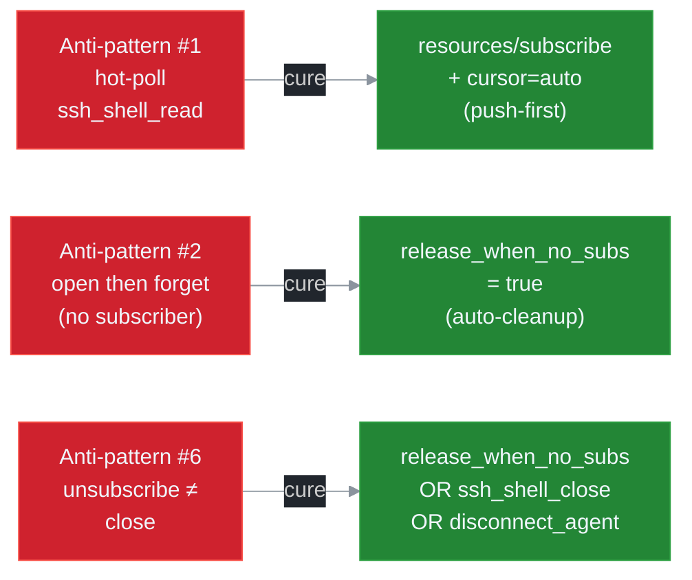

# Anti-patterns

Ten failure modes that v5.0 explicitly engineers against. Each entry maps a behaviour to its symptom on the wire, the consequence (token waste / leak / cascade failure / data loss), the correct workflow, and the operator-side detection signal.

The list is informed by [ADR 0005](../adr/0005-llm-ux-priorities.md), the lifecycle layer in [ADR 0003](../adr/0003-lifecycle-binding.md), and the channel-mux invariants in [ADR 0004](../adr/0004-channel-mux-fairness.md). The error codes referenced below are catalogued in [`ERROR_HANDBOOK.md`](./ERROR_HANDBOOK.md).

## Anti-pattern #1: hot-poll loop on `ssh_shell_read`

**Symptom.** The LLM emits `ssh_shell_read(shell_id, wait=true, wait_timeout_secs=1)` in a tight loop instead of subscribing once and consuming `notifications/resources/updated` events.

**Why bad.** Token waste (every poll round-trips a markdown body and a structured JSON), increased latency (50 ms+ per poll regardless of activity), and a nontrivial CPU bill on the server side (debouncer wakes per poll cycle even when it has no new bytes). The push pipeline already coalesces output every 50 ms; a 1-second poll loop converts a 20 Hz native event rate into a 1 Hz client view.

**Fix.** `ssh_shell_open` -> `resources/subscribe shell://<sid>/output` -> on each push notification, `resources/read?cursor=auto`. Reserve `ssh_shell_read` for hosts that genuinely cannot subscribe.

**Detection.** Per-session call rate of `ssh_shell_read` > 1 Hz with no matching `subscribe` in the same session. Operator dashboards expose this via `ssh_sub_stats` (the absence of an active `sub_id` on the URI implies polling is happening client-side).

## Anti-pattern #2: open then forget

**Symptom.** The LLM opens a long-running resource (`ssh_shell_open`, `ssh_execute`, `ssh_upload`), never subscribes, and never closes. Examples: shell with no consumer, async command whose output is never read.

**Why bad.** Pure leak. The remote PTY or process keeps consuming resources; the per-resource ring buffer fills and head-drops. The session inactivity TTL eventually fires, but by then operator-visible state diverges from the LLM's internal model. With v5 lifecycle binding, the server can self-clean if the caller opted in to `release_when_no_subs=true`; if not, it parks in `Owned` until manual close.

**Fix.** Either subscribe within `SSH_SUB_LEAK_RISK_WARN_S` (default 2 s) of resource creation, or pass `release_when_no_subs=true` so the server releases automatically after the configured grace window.

**Detection.** A `WARN: SUB_LEAK_RISK` line appended to subsequent `ssh_list_*` responses naming the resource; the same warning is emitted as `{"ev":"warn","code":"SUB_LEAK_RISK",...}` on the daemon NDJSON channel.

## Anti-pattern #3: re-subscribe on every iteration

**Symptom.** The LLM calls `ssh_subscribe` on the same URI for every iteration of an event loop, never tracks the returned `sub_id`, never unsubscribes.

**Why bad.** Each call mints a fresh `sub_id` with its own state bag (cursor, filter, lag policy, mpsc lane, atomic counter block — see [ADR 0004](../adr/0004-channel-mux-fairness.md)). After 100 iterations the resource has 100 lanes, 100 cursors, and 100 sets of stats. Memory grows linearly. Outbound bandwidth grows linearly because each lane independently emits push events. Stats become useless because `events_sent` is split across N lanes that the client cannot aggregate.

**Fix.** Subscribe once per resource per workflow. Track the `sub_id` in the model's working state. Unsubscribe at workflow end. If the workflow rebinds the URI to a fresh consumer, call `ssh_unsubscribe(old_sub_id)` before the new `ssh_subscribe`.

**Detection.** `ssh_sub_list` returns multiple subs for the same URI under the same agent. The `MAX_SUBS_PER_URI_EXCEEDED` error fires when the per-URI cap is hit; before that, operators see the scale in `ssh_daemon_stats`.

## Anti-pattern #4: ignoring `lagged_drops`

**Symptom.** The LLM observes `lagged_drops > 0` in `ssh_sub_stats` and continues consuming events as if nothing happened. Downstream logic that relies on a strictly-monotonic event order silently corrupts.

**Why bad.** Data loss masked by silent gap. Under `DropOldest` or `DropNewest`, the lane has emitted a `{"ev":"lagged",...}` marker but the consumer ignored it. Under `BlockSlow` (with timeout), the producer fell back to `Snapshot` and emitted a `LAG_BACKPRESSURE` warning that the consumer also ignored.

**Fix.** Periodically query `ssh_sub_stats`. On `lagged_drops > 0`:
- If gaps are tolerable, switch to `lag_policy=snapshot` (default) so the gap is bridged via ring-buffer rebuild.
- If zero loss is required, switch to `lag_policy=block_slow` and raise `SSH_BP_BLOCK_TIMEOUT_MS` if needed.
- Reduce the consumption gap by simplifying downstream filtering or by increasing `SSH_LANE_BUFFER`.

**Detection.** Wire-level: `lagged` and `snapshot` event types in the NDJSON stream. Tool-level: `ssh_sub_stats` shows `lagged_drops` or `lagged_recoveries` increasing. Error-level: `LAG_DETECTED` or `LAG_BACKPRESSURE` codes on subsequent operations.

## Anti-pattern #5: mid-workflow panic without `ssh_disconnect_agent`

**Symptom.** The LLM hits an unrecoverable error mid-workflow and abandons cleanup. Sessions, shells, commands, and transfers tied to the agent persist until the inactivity TTL fires.

**Why bad.** Cascade leak. The agent owned multiple resources; abandoning cleanup leaves all of them dangling. Every leaked resource competes for the per-tenant resource cap, which eventually triggers `MAX_*_EXCEEDED` on legitimate future calls. Operators face a slow drift between expected and actual session state.

**Fix.** Wrap every workflow in a structured cleanup boundary. On any error path, call `ssh_disconnect_agent(agent_id)`. The call is idempotent and cascades through every owned session and resource via the lifecycle layer. Use a stable `agent_id` per workflow so the cleanup boundary is unambiguous.

**Detection.** `ssh_list_sessions` shows agent-bound sessions older than expected workflow lifetime. Operators set `SSH_SUB_LEAK_RISK_KILL_S` to a non-zero value to convert leaks into hard failures; `RESOURCE_GONE` then surfaces on the next legitimate use.

## Anti-pattern #6: confusing unsubscribe with close

**Symptom.** The LLM calls `ssh_unsubscribe` and assumes the underlying resource is gone. Subsequent operations (`ssh_shell_write`, `ssh_get_command_output`) hit a stale resource that still occupies channel concurrency.

**Why bad.** Lifecycle confusion. v5 deliberately separates observability (subscription) from ownership (resource). Unsubscribing only closes the push channel — the remote PTY, async command, or in-flight transfer keeps running. Without `release_when_no_subs=true`, the resource lingers in `Owned` until manual close.

**Fix.** When the workflow finishes, choose one of:
- `release_when_no_subs=true` at resource creation -> last `ssh_unsubscribe` triggers the grace timer (`LIFECYCLE_OWN_GRACE_MS`, default 2 s) -> resource auto-closes.
- Manual: `ssh_unsubscribe` AND `ssh_shell_close` / `ssh_cancel_command`.
- Workflow-scoped: `ssh_disconnect_agent(agent_id)` cascades through everything.

**Detection.** `ssh_list_*` returns the resource as still active after the agent's workflow has completed. The `WARN: SUB_LEAK_RISK` line surfaces if the resource sits in `Owned` past the warn threshold.

## Anti-pattern #7: extending another consumer's resource lifetime

**Symptom.** Subscriber A wants to keep a shell alive that subscriber B opened. A repeatedly calls `ssh_subscribe` to bump the refcount.

**Why bad.** Subscribers should not own resource lifetime. The resource policy (`release_when_no_subs`, `grace_ms`, `cascade_session`) is set by the resource's creator at open time and is not subscriber-controlled. A misbehaving observer that holds a sub indefinitely starves cleanup; conversely, an observer that drops its sub should not be able to terminate a critical resource that other observers still need.

**Fix.** If A genuinely owns the lifetime decision, A should be the resource's creator. If multiple observers need to coordinate cleanup, use one shared agent_id for the resource owner and let `ssh_disconnect_agent` orchestrate the close. To extend a lease, use `lifetime=lease` and `ssh_sub_resume` from the resource owner — not from a passive observer.

**Detection.** Long-lived `sub_id`s with low `events_sent` rate; auditable via `ssh_sub_list` ordered by age.

## Anti-pattern #8: mismatched `_meta.idempotency_key`

**Symptom.** Two retries of the same mutating tool carry identical `_meta.idempotency_key` but different arguments (e.g. retry of `ssh_execute` with a different command string).

**Why bad.** The idempotency cache stores the original response keyed by `idempotency_key`. A second call with the same key and different args triggers `IDEMPOTENCY_KEY_MISMATCH`. The caller cannot tell from the error alone that it was a key reuse error vs an argument typo, leading to debugging churn.

**Fix.** A `_meta.idempotency_key` must be paired one-to-one with a specific argument set. Use UUIDv7 (or a hash of the args) as the key. On a retry of a different operation, mint a new key.

**Detection.** `[IDEMPOTENCY_KEY_MISMATCH]` in error responses. The `DETAIL` line names the conflicting key; operator inspects request/response logs to identify the typo.

## Anti-pattern #9: silently absorbing `RESOURCE_GONE`

**Symptom.** A retry path catches `[RESOURCE_GONE]` and re-issues the same tool call, then catches `[RESOURCE_GONE]` again, then loops or panics.

**Why bad.** `RESOURCE_GONE` is RESOURCE-class — never retry. The resource is in `Closed` state; no amount of waiting brings it back. The correct action is to recreate the resource (via the appropriate `ssh_shell_open` / `ssh_execute` / `ssh_upload`) and continue from a fresh cursor.

**Fix.** Branch on the error category:
- `RESOURCE` -> recreate and resume from a known-good cursor (or from scratch).
- `TRANSPORT` -> retry with exponential backoff.
- `POLICY` -> change the policy (lag, capacity, cleanup).
- `STATE` -> retry only with a fresh `_meta.idempotency_key`.
- `AUTH` / `INTERNAL` -> never retry.

**Fix specifically for `RESOURCE_GONE`.** Call the matching open/exec/upload tool, observe the new ID, and resubscribe.

**Detection.** Telemetry shows repeated `RESOURCE_GONE` for the same URI with no intervening `ssh_shell_open` / `ssh_execute`. The closest-match suggestion in the `DETAIL` line names a live alternative when one exists.

## Anti-pattern #10: trusting `ssh_get_command_output(wait=true)` for long workflows

**Symptom.** The LLM uses the wait-on-result fallback (`ssh_execute` -> `ssh_get_command_output(wait=true, wait_timeout_secs=N)`) for commands that run longer than `N`, then loops on the wait call until the command finishes.

**Why bad.** The fallback is a graceful degradation for hosts without subscribe support, not an idiomatic flow for capable hosts. Each wait round-trip costs the same framing as a `ssh_shell_read` poll. For a 10-minute command, a 30-second wait loop produces 20 round-trips; the equivalent push-based path produces zero polls and consumes events as they arrive.

**Fix.** On capable hosts, use `push_first_long_command` (see [`PROMPTS_CATALOG.md`](./PROMPTS_CATALOG.md)). Reserve the wait loop for the (decreasing) class of hosts that genuinely cannot subscribe; mark this in the agent's tool-selection logic so the fallback is selected only when push is unavailable.

**Detection.** Multiple `ssh_get_command_output(wait=true)` calls for the same `command_id` with no matching subscribe. Operators surface this via `ssh_sub_list` correlated against the command catalogue.

## Cross-references

- [`GOLDEN_RULES.md`](./GOLDEN_RULES.md) — the rules these anti-patterns violate.
- [`PROMPTS_CATALOG.md`](./PROMPTS_CATALOG.md) — the canonical correct workflows.
- [`ERROR_HANDBOOK.md`](./ERROR_HANDBOOK.md) — every code referenced above with cure and prevention.
- [ADR 0005 — LLM UX Priorities](../adr/0005-llm-ux-priorities.md) — design rationale for the warn / kill thresholds.
