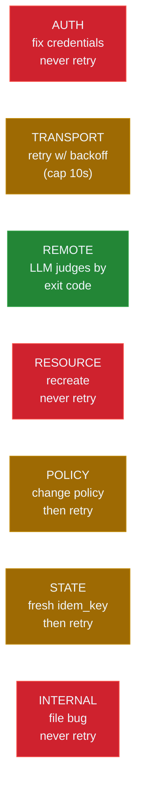

# Error Handbook

Canonical reference for the 38 wire codes defined by [ADR 0007](../adr/0007-error-taxonomy.md). One section per code, grouped into the seven categories. Every entry follows a uniform shape so an LLM can grep / jump to a single code without reading the rest.

The wire format is unchanged from v4:

```text
SSH_X: ERROR
REASON: [CODE] short human description
DETAIL: action-oriented one-sentence cure (≤120 chars)
```

The structured JSON channel mirrors the markdown:

```json
{ "tool": "ssh_x", "status": "error", "code": "<CODE>",
  "reason": "<DETAIL line>" }
```

Retry policy semantics (one of):

- `no` — never retry. Caller must change inputs (credentials, args) or recreate the resource.
- `yes` — retry safe (typically TRANSPORT class) with exponential backoff capped at 10 s.
- `conditional` — retry only after changing policy (lag, capacity, cleanup state).
- `recover` — the server already absorbed the gap; consume the recovery event and continue.
- `warn` — informational; no retry needed but the caller should observe the signal and adjust.
- `idempotent-only` — retry only with a fresh `_meta.idempotency_key`.

Cross-references: [`GOLDEN_RULES.md`](./GOLDEN_RULES.md), [`ANTIPATTERNS.md`](./ANTIPATTERNS.md), [ADR 0003](../adr/0003-lifecycle-binding.md), [ADR 0004](../adr/0004-channel-mux-fairness.md), [ADR 0006](../adr/0006-backpressure-policies.md), [ADR 0008](../adr/0008-ndjson-daemon-protocol.md).



---

## AUTH

Never retry. The caller must update credentials. Retries with the same key produce identical failures.

### [AUTH_FAILED] Authentication rejected by remote host

- **Category:** AUTH
- **Retryable:** no
- **When:** Password / key / agent-based authentication was rejected by the remote sshd. The strategy chain (PasswordAuth -> KeyAuth -> AgentAuth) exhausted its options.
- **Why:** The credential supplied does not match a valid remote identity. Re-attempting with the same input produces the same outcome.
- **Cure:** Verify the username, the key path, and the agent socket; re-issue `ssh_connect` with corrected credentials.
- **Prevention:** Validate keys and passwords client-side before issuing the connect; keep agent forwarding enabled where supported.
- **Example:**

  ```ndjson
  {"op":"connect","host":"vm.example.com","user":"root","key":"/home/u/.ssh/wrong","id":"corr-1"}
  {"ev":"err","id":"corr-1","code":"AUTH_FAILED","reason":"Authentication rejected.","detail":"Verify username and key path; re-issue ssh_connect."}
  ```

- **Related:** [AUTH_KEY_PARSE].

### [AUTH_KEY_PARSE] Cannot parse the supplied key file

- **Category:** AUTH
- **Retryable:** no
- **When:** The key file at the supplied path is not in OpenSSH or PKCS#8 format, is encrypted with an unsupported cipher, or has invalid PEM framing.
- **Why:** russh's key loader rejects malformed inputs before contacting the remote.
- **Cure:** Convert the key to a supported format (`ssh-keygen -p -m PEM` or `-m RFC4716`); supply the correct passphrase.
- **Prevention:** Standardise on OpenSSH-format keys; document the supported algorithm set in the operator runbook.
- **Example:**

  ```ndjson
  {"op":"connect","host":"vm.example.com","user":"root","key":"/tmp/garbage.pem","id":"corr-1"}
  {"ev":"err","id":"corr-1","code":"AUTH_KEY_PARSE","reason":"Cannot parse key file.","detail":"Convert key to OpenSSH or PKCS#8 PEM."}
  ```

- **Related:** [AUTH_FAILED].

---

## TRANSPORT

Auto-retry with exponential backoff (cap 10 s). Transient failures fix themselves under reasonable retry budgets.

### [CONNECTION_FAILED] TCP connect or handshake failed

- **Category:** TRANSPORT
- **Retryable:** yes (exponential backoff, cap 10 s)
- **When:** The TCP connect to host:port failed (connection refused, no route to host, DNS resolution failure) or the SSH handshake did not complete.
- **Why:** The remote endpoint is unreachable transiently or the network path is broken.
- **Cure:** Retry with backoff. If repeated retries fail, surface to the operator and check DNS / firewall.
- **Prevention:** Run a pre-flight reachability probe; cache successful endpoints with TTL.
- **Example:**

  ```ndjson
  {"op":"connect","host":"unreachable","user":"root","id":"corr-1"}
  {"ev":"err","id":"corr-1","code":"CONNECTION_FAILED","reason":"Connection refused.","detail":"Auto-retry with backoff (cap 10s)."}
  ```

- **Related:** [CONNECTION_TIMEOUT], [TRANSPORT_ERROR].

### [CONNECTION_TIMEOUT] Handshake exceeded the configured deadline

- **Category:** TRANSPORT
- **Retryable:** yes (exponential backoff, cap 10 s)
- **When:** TCP connect or SSH handshake did not complete within `SSH_CONNECT_TIMEOUT_S`.
- **Why:** Slow network, overloaded remote sshd, or an intermediate proxy stalling.
- **Cure:** Retry with backoff. Raise `SSH_CONNECT_TIMEOUT_S` if the legitimate path is slow.
- **Prevention:** Tune the timeout based on the slowest legitimate route; alert on sustained timeouts.
- **Example:**

  ```ndjson
  {"op":"connect","host":"slow.example.com","user":"root","id":"corr-1"}
  {"ev":"err","id":"corr-1","code":"CONNECTION_TIMEOUT","reason":"Handshake timed out.","detail":"Auto-retry with backoff or raise SSH_CONNECT_TIMEOUT_S."}
  ```

- **Related:** [CONNECTION_FAILED].

### [TRANSPORT_ERROR] Generic transport failure (channel reset, EOF mid-frame)

- **Category:** TRANSPORT
- **Retryable:** yes (exponential backoff, cap 10 s)
- **When:** The SSH transport reset mid-flight (channel close while bytes pending, EOF before frame completion).
- **Why:** Network instability, remote sshd restart, or transient peer process death.
- **Cure:** Retry; the new connect re-establishes the channel.
- **Prevention:** Monitor SSH session uptimes; alert on frequent resets per host.
- **Example:**

  ```ndjson
  {"op":"exec","sid":"sess-1","cmd":"long-running","id":"corr-1"}
  {"ev":"err","id":"corr-1","code":"TRANSPORT_ERROR","reason":"Channel reset.","detail":"Auto-retry with backoff."}
  ```

- **Related:** [CONNECTION_FAILED].

---

## REMOTE

Failures originating on the remote host. Retry decisions depend on the specific exit code or error string; the LLM judges.

### [SFTP_ERROR] Remote SFTP operation failed

- **Category:** REMOTE
- **Retryable:** depends on the underlying cause (permission, disk full, quota — none auto-retryable)
- **When:** `ssh_upload`, `ssh_download`, or any SFTP-backed call returned a remote error.
- **Why:** Permissions, missing parent directory, disk full, quota exceeded, or remote SFTP subsystem disabled.
- **Cure:** Inspect the DETAIL line for the specific subcondition; fix the remote state and re-issue.
- **Prevention:** Pre-flight check the remote with `ssh_run stat <path>` and `ssh_run df` before launching transfers.
- **Example:**

  ```ndjson
  {"op":"upload","sid":"sess-1","local":"/tmp/x","remote":"/root/x","id":"corr-1"}
  {"ev":"err","id":"corr-1","code":"SFTP_ERROR","reason":"Permission denied.","detail":"Check remote permissions; remote_path must be writable."}
  ```

- **Related:** [REMOTE_CMD_FAILED].

### [REMOTE_CMD_FAILED] Remote command exited non-zero

- **Category:** REMOTE
- **Retryable:** LLM judges based on the exit code (e.g. `1` for "no match" vs `127` for "command not found")
- **When:** `ssh_execute` / `ssh_run` completed but the command exited non-zero.
- **Why:** The command's own logic. ssh-mcp does not interpret remote semantics.
- **Cure:** Inspect `exit_code` and the captured stdout/stderr; decide whether the result is a workflow success or a recoverable error.
- **Prevention:** Use sentinel exit codes the workflow understands; capture stderr explicitly.
- **Example:**

  ```ndjson
  {"op":"exec","sid":"sess-1","cmd":"grep MISSING /etc/hosts","id":"corr-1"}
  {"ev":"completed","cid":"cmd-1","exit":1}
  ```

- **Related:** [SFTP_ERROR].

---

## RESOURCE

Never retry. The resource is gone or never existed. The cure is to recreate it (when applicable) or use the closest-match suggestion in the DETAIL line.

### [SESSION_NOT_FOUND] No session matches the supplied `session_id`

- **Category:** RESOURCE
- **Retryable:** no
- **When:** A tool call referenced a `session_id` that was never created or has been disconnected.
- **Why:** Stale ID in the caller's state.
- **Cure:** `ssh_list_sessions` to enumerate live sessions; recreate via `ssh_connect` if needed.
- **Prevention:** Track `session_id` lifecycle in the caller's state; clear on disconnect events.
- **Example:**

  ```ndjson
  {"op":"exec","sid":"sess-stale","cmd":"id","id":"corr-1"}
  {"ev":"err","id":"corr-1","code":"SESSION_NOT_FOUND","reason":"Session not found.","detail":"Use ssh_list_sessions; recreate via ssh_connect. Closest: sess-3 (open since 14:32:07)."}
  ```

- **Related:** [SHELL_NOT_FOUND], [COMMAND_NOT_FOUND], [TRANSFER_NOT_FOUND].

### [SHELL_NOT_FOUND] No shell matches the supplied `shell_id`

- **Category:** RESOURCE
- **Retryable:** no
- **When:** A `ssh_shell_*` call referenced a closed or unknown shell.
- **Why:** The shell was closed (manual or grace), or the ID is stale.
- **Cure:** `ssh_list_*` (when available) or simply recreate via `ssh_shell_open`.
- **Prevention:** Subscribe to `shell://<id>/output` so a `resource_closed` event lands in your stream when the shell ends.
- **Example:**

  ```ndjson
  {"op":"shell_write","shid":"sh-stale","bytes":"ls\n","id":"corr-1"}
  {"ev":"err","id":"corr-1","code":"SHELL_NOT_FOUND","reason":"Shell not found.","detail":"Recreate via ssh_shell_open."}
  ```

- **Related:** [RESOURCE_GONE], [SESSION_NOT_FOUND].

### [COMMAND_NOT_FOUND] No async command matches the supplied `command_id`

- **Category:** RESOURCE
- **Retryable:** no
- **When:** `ssh_get_command_output` / `ssh_cancel_command` referenced a stale or never-existed `command_id`.
- **Why:** The command finished and was reaped, or the ID is wrong.
- **Cure:** `ssh_list_commands` to enumerate live commands; re-issue `ssh_execute` if needed.
- **Prevention:** Subscribe to `command://<id>/output` and consume the `completed` event.
- **Example:**

  ```ndjson
  {"op":"cancel","cid":"cmd-stale","id":"corr-1"}
  {"ev":"err","id":"corr-1","code":"COMMAND_NOT_FOUND","reason":"Command not found.","detail":"Use ssh_list_commands."}
  ```

- **Related:** [SESSION_NOT_FOUND].

### [TRANSFER_NOT_FOUND] No transfer matches the supplied `transfer_id`

- **Category:** RESOURCE
- **Retryable:** no
- **When:** `ssh_get_transfer_progress` referenced a finished or unknown transfer.
- **Why:** The transfer completed and was reaped, or the ID is wrong.
- **Cure:** Re-issue the upload/download to obtain a fresh ID.
- **Prevention:** Subscribe to `transfer://<id>/progress` so completion is observed in-stream.
- **Example:**

  ```ndjson
  {"op":"transfer_progress","tid":"xfer-stale","id":"corr-1"}
  {"ev":"err","id":"corr-1","code":"TRANSFER_NOT_FOUND","reason":"Transfer not found.","detail":"Re-issue ssh_upload or ssh_download."}
  ```

- **Related:** [SESSION_NOT_FOUND].

### [FORWARD_NOT_FOUND] No port-forward matches the supplied `forward_id`

- **Category:** RESOURCE
- **Retryable:** no
- **When:** A forward-management call referenced a stale or never-existed forward.
- **Why:** Forward was closed, or the feature `port_forward` is not built into this binary.
- **Cure:** Re-issue `ssh_forward` to recreate; verify the binary was built with the `port_forward` feature.
- **Prevention:** Track `forward_id` lifecycle alongside session lifecycle.
- **Example:**

  ```ndjson
  {"op":"forward_close","fid":"fwd-stale","id":"corr-1"}
  {"ev":"err","id":"corr-1","code":"FORWARD_NOT_FOUND","reason":"Forward not found.","detail":"Re-issue ssh_forward."}
  ```

- **Related:** [SESSION_NOT_FOUND].

### [RESOURCE_GONE] Resource closed (lifecycle Releasing/Closed)

- **Category:** RESOURCE
- **Retryable:** no
- **When:** A subscribe attempt or operation hit a resource whose lifecycle state is `Releasing` or `Closed`. The resource has been released by the lifecycle layer (manual close, grace timer fired, or cascade).
- **Why:** [ADR 0003 — Lifecycle Binding](../adr/0003-lifecycle-binding.md) defines `Closed` as a terminal state; new subscriptions are refused.
- **Cure:** Recreate via `ssh_shell_open` / `ssh_execute` / `ssh_upload` and resume from a fresh cursor.
- **Prevention:** Subscribe before the grace window expires; respect `release_when_no_subs=true` semantics; use `lifetime=manual` if the resource must outlive a transient agent.
- **Example:**

  ```ndjson
  {"op":"subscribe","uri":"shell://sh-9/output","id":"corr-1"}
  {"ev":"err","id":"corr-1","code":"RESOURCE_GONE","reason":"Resource closed.","detail":"Resource closed (lifecycle Releasing/Closed); recreate via ssh_shell_open / ssh_execute / ssh_upload."}
  ```

- **Related:** [SHELL_NOT_FOUND], [GRACE_TIMER_EXPIRED].

### [SUB_NOT_FOUND] No subscription matches the supplied `sub_id`

- **Category:** RESOURCE
- **Retryable:** no
- **When:** `ssh_unsubscribe` / `ssh_sub_pause` / `ssh_sub_resume` / `ssh_sub_filter` / `ssh_sub_replay` / `ssh_sub_stats` referenced a stale or never-existed `sub_id`.
- **Why:** The sub was already closed (manual or peer GC), or the ID is wrong.
- **Cure:** `ssh_sub_list` to enumerate active subs; the closest-match suggestion in DETAIL helps with typos.
- **Prevention:** Track `sub_id` lifetime in the caller's state; consume `resource_closed` events.
- **Example:**

  ```ndjson
  {"op":"unsubscribe","sub_id":"sub-stale","id":"corr-1"}
  {"ev":"err","id":"corr-1","code":"SUB_NOT_FOUND","reason":"Sub not found.","detail":"Use ssh_sub_list to enumerate active subscriptions."}
  ```

- **Related:** [RESOURCE_GONE].

### [GRACE_TIMER_EXPIRED] Grace window elapsed; resource released

- **Category:** RESOURCE
- **Retryable:** no
- **When:** A subscribe arrived after `LIFECYCLE_OWN_GRACE_MS` (default 2 s) elapsed in `Releasing` state.
- **Why:** The lifecycle CAS transitioned `Releasing -> Closed`; the resource is gone.
- **Cure:** Recreate the resource and subscribe immediately.
- **Prevention:** Subscribe within the grace window; consider `lifetime=manual` for resources that must outlive transient observers.
- **Example:**

  ```ndjson
  {"op":"subscribe","uri":"shell://sh-9/output","id":"corr-1"}
  {"ev":"err","id":"corr-1","code":"GRACE_TIMER_EXPIRED","reason":"Grace elapsed.","detail":"Recreate resource and resubscribe."}
  ```

- **Related:** [RESOURCE_GONE].

---

## POLICY

Retry only after changing the operative policy (lag, capacity, cleanup state). The error is a hint that the current policy is incompatible with the workload.

### [MAX_SESSIONS_EXCEEDED] Per-tenant or global session cap reached

- **Category:** POLICY
- **Retryable:** conditional (after closing a session)
- **When:** `ssh_connect` would exceed `SSH_MAX_SESSIONS` (or per-agent cap).
- **Why:** Session leak, or legitimate fan-out beyond the configured budget.
- **Cure:** `ssh_list_sessions` to find disposable sessions; `ssh_disconnect` or `ssh_disconnect_agent` and retry.
- **Prevention:** Apply [`GOLDEN_RULES.md`](./GOLDEN_RULES.md) Rule 4; raise the cap if the workload requires.
- **Example:**

  ```ndjson
  {"op":"connect","host":"...","user":"root","id":"corr-1"}
  {"ev":"err","id":"corr-1","code":"MAX_SESSIONS_EXCEEDED","reason":"Session cap reached.","detail":"Audit ssh_list_sessions; ssh_disconnect_agent stale agents."}
  ```

- **Related:** [MAX_SHELLS_EXCEEDED], [MAX_COMMANDS_EXCEEDED].

### [MAX_SHELLS_EXCEEDED] Per-session shell cap reached

- **Category:** POLICY
- **Retryable:** conditional (after closing a shell)
- **When:** `ssh_shell_open` would exceed `SSH_MAX_SHELLS_PER_SESSION`.
- **Why:** Shell leak, or legitimate parallelism beyond the configured budget.
- **Cure:** `ssh_shell_close` for stale shells; retry.
- **Prevention:** Use `release_when_no_subs=true` so shells self-clean.
- **Example:**

  ```ndjson
  {"op":"shell_open","sid":"sess-1","id":"corr-1"}
  {"ev":"err","id":"corr-1","code":"MAX_SHELLS_EXCEEDED","reason":"Shell cap reached.","detail":"ssh_shell_close stale shells before retry."}
  ```

- **Related:** [MAX_SESSIONS_EXCEEDED].

### [MAX_COMMANDS_EXCEEDED] Per-session async command cap reached

- **Category:** POLICY
- **Retryable:** conditional (after a command finishes or is cancelled)
- **When:** `ssh_execute` would exceed `SSH_MAX_COMMANDS_PER_SESSION`.
- **Why:** Command leak, or fan-out beyond budget.
- **Cure:** `ssh_cancel_command` or wait for completions; retry.
- **Prevention:** Subscribe to `command://<id>/output` and consume `completed` events promptly.
- **Example:**

  ```ndjson
  {"op":"exec","sid":"sess-1","cmd":"id","id":"corr-1"}
  {"ev":"err","id":"corr-1","code":"MAX_COMMANDS_EXCEEDED","reason":"Command cap reached.","detail":"Cancel stale or wait for completions."}
  ```

- **Related:** [MAX_SHELLS_EXCEEDED].

### [MAX_TRANSFERS_EXCEEDED] Per-session SFTP transfer cap reached

- **Category:** POLICY
- **Retryable:** conditional (after a transfer finishes)
- **When:** `ssh_upload` / `ssh_download` would exceed `SSH_MAX_TRANSFERS_PER_SESSION`.
- **Why:** Transfer concurrency limit hit.
- **Cure:** Wait for in-flight transfers to complete; retry.
- **Prevention:** Serialise transfers when the workload tolerates it.
- **Example:**

  ```ndjson
  {"op":"upload","sid":"sess-1","local":"/tmp/x","remote":"/srv/x","id":"corr-1"}
  {"ev":"err","id":"corr-1","code":"MAX_TRANSFERS_EXCEEDED","reason":"Transfer cap reached.","detail":"Wait for completions or raise SSH_MAX_TRANSFERS_PER_SESSION."}
  ```

- **Related:** [MAX_COMMANDS_EXCEEDED].

### [MAX_SUBS_PER_URI_EXCEEDED] Per-URI subscription cap reached

- **Category:** POLICY
- **Retryable:** conditional
- **When:** A subscribe would exceed the per-URI sub cap (typical anti-pattern: re-subscribe-on-every-iteration loop).
- **Why:** Lane explosion under repeat subscribes; see [`ANTIPATTERNS.md`](./ANTIPATTERNS.md) #3.
- **Cure:** `ssh_sub_list` to find redundant subs; `ssh_unsubscribe` stale ones; retry.
- **Prevention:** Subscribe once per resource; track `sub_id`s in conversation state.
- **Example:**

  ```ndjson
  {"op":"subscribe","uri":"shell://sh-1/output","id":"corr-1"}
  {"ev":"err","id":"corr-1","code":"MAX_SUBS_PER_URI_EXCEEDED","reason":"Per-URI sub cap reached.","detail":"Share an existing sub via fan-out client-side, or unsubscribe stale ones."}
  ```

- **Related:** [MAX_SUBS_TOTAL_EXCEEDED], [SUB_LEAK_RISK].

### [MAX_SUBS_TOTAL_EXCEEDED] Global subscription cap reached

- **Category:** POLICY
- **Retryable:** conditional
- **When:** A subscribe would exceed the global sub cap (e.g. `SSH_MAX_SUBS_TOTAL`).
- **Why:** Aggregate sub leak across resources.
- **Cure:** Audit `ssh_sub_list`; close stale subs; retry.
- **Prevention:** Apply Rule 2 from [`GOLDEN_RULES.md`](./GOLDEN_RULES.md).
- **Example:**

  ```ndjson
  {"op":"subscribe","uri":"command://cmd-1/output","id":"corr-1"}
  {"ev":"err","id":"corr-1","code":"MAX_SUBS_TOTAL_EXCEEDED","reason":"Global sub cap reached.","detail":"Audit ssh_sub_list and unsubscribe stale subscriptions."}
  ```

- **Related:** [MAX_SUBS_PER_URI_EXCEEDED].

### [LANE_BUFFER_FULL] Per-lane mpsc buffer full

- **Category:** POLICY
- **Retryable:** conditional
- **When:** A consumer's lane mpsc reached `SSH_LANE_BUFFER` capacity and the lane's `LagPolicy` could not absorb the next event without policy intervention.
- **Why:** Slow consumer outpaced by the producer.
- **Cure:** Raise `SSH_LANE_BUFFER` or switch the lane's `lag_policy` to `snapshot`.
- **Prevention:** Default to `lag_policy=snapshot`; consume events in tight loops without doing heavy work inline.
- **Example:**

  ```ndjson
  {"ev":"err","code":"LANE_BUFFER_FULL","reason":"Lane buffer full.","detail":"Increase SSH_LANE_BUFFER or switch lag_policy to snapshot."}
  ```

- **Related:** [LAG_BACKPRESSURE], [MUX_BACKPRESSURE].

### [MUX_BACKPRESSURE] Global mux mpsc full; outbound writer is slow

- **Category:** POLICY
- **Retryable:** conditional
- **When:** The global `ChannelMux` mpsc reached `SSH_MUX_BUFFER` (default 8192) and the outbound writer (rmcp peer or NDJSON stdout) is not draining.
- **Why:** The consumer of the daemon's stdout cannot keep up.
- **Cure:** Consume the daemon's NDJSON output faster; tune `SSH_MUX_BUFFER`.
- **Prevention:** Use a streaming consumer (`jq`, fluentbit, vector) rather than a polling reader.
- **Example:**

  ```ndjson
  {"ev":"err","code":"MUX_BACKPRESSURE","reason":"Mux backpressure.","detail":"Outbound writer blocked; consume the daemon NDJSON output faster."}
  ```

- **Related:** [LANE_BUFFER_FULL].

### [LAG_DETECTED] Lag absorbed via snapshot rebuild

- **Category:** POLICY
- **Retryable:** recover (the rebuild already happened)
- **When:** Under `LagPolicy::Snapshot`, the lane backlog filled and the server dropped it, then rebuilt from the per-resource ring buffer.
- **Why:** Slow consumer; the snapshot covers the gap with a strictly-monotonic cursor jump.
- **Cure:** Consume the rebuild event and continue. If lag is sustained, switch to `lag_policy=block_slow` or raise `SSH_LANE_BUFFER`.
- **Prevention:** Default `lag_policy=snapshot` is the right choice for most workloads. Consume events in tight loops.
- **Example:**

  ```ndjson
  {"ev":"snapshot","sub_id":"sub-1","cursor":102400,"delta":"<bytes>"}
  {"ev":"warn","code":"LAG_DETECTED","reason":"Lagged 42 events; snapshot rebuilt; cursor advanced.","detail":"Lagged N events; snapshot rebuilt; cursor adjusted."}
  ```

- **Related:** [LAG_BACKPRESSURE], [RING_BUFFER_OVERFLOW].

### [LAG_BACKPRESSURE] BlockSlow timeout fired; fell back to snapshot

- **Category:** POLICY
- **Retryable:** conditional
- **When:** Under `LagPolicy::BlockSlow`, the producer waited longer than `SSH_BP_BLOCK_TIMEOUT_MS` (default 5000 ms).
- **Why:** The consumer is genuinely stuck. The server falls back to snapshot semantics rather than deadlock.
- **Cure:** Consume stdout faster; raise `SSH_BP_BLOCK_TIMEOUT_MS` if the workload tolerates higher latency.
- **Prevention:** Reserve `BlockSlow` for forensic / audit captures; monitor `block_total_ms` in `ssh_sub_stats`.
- **Example:**

  ```ndjson
  {"ev":"warn","code":"LAG_BACKPRESSURE","reason":"BlockSlow timeout.","detail":"Consume stdout faster or raise SSH_BP_BLOCK_TIMEOUT_MS."}
  ```

- **Related:** [LAG_DETECTED].

### [RING_BUFFER_OVERFLOW] Per-resource ring buffer dropped head bytes

- **Category:** POLICY
- **Retryable:** recover
- **When:** A consumer reading via `ssh_sub_replay(sub_id, from_cursor)` requested a cursor that predates the ring buffer's available window (`SSH_SHELL_MAX_BUFFER` or `SSH_COMMAND_MAX_BUFFER_SIZE`).
- **Why:** The resource produced more bytes than the ring buffer can hold.
- **Cure:** Accept the gap (the cursor is advanced to the start of the available window) or raise the buffer size.
- **Prevention:** Tune `SSH_SHELL_MAX_BUFFER` for high-volume shells; consume push events promptly so the ring buffer never overflows.
- **Example:**

  ```ndjson
  {"op":"sub_replay","sub_id":"sub-1","from_cursor":0,"id":"corr-1"}
  {"ev":"warn","code":"RING_BUFFER_OVERFLOW","reason":"Head bytes dropped.","detail":"Head bytes dropped; use ssh_sub_replay from a more recent cursor."}
  ```

- **Related:** [LAG_DETECTED].

### [SUB_LEAK_RISK] Resource owned > warn threshold with 0 subs and no auto-cleanup

- **Category:** POLICY
- **Retryable:** warn
- **When:** A `Owned` resource has had 0 subscribers for longer than `SSH_SUB_LEAK_RISK_WARN_S` (default 2 s) and was created without `release_when_no_subs=true`.
- **Why:** The lifecycle layer detects a configuration that almost always leads to a leak.
- **Cure:** Subscribe immediately, OR recreate the resource with `release_when_no_subs=true`.
- **Prevention:** Apply Rule 1 from [`GOLDEN_RULES.md`](./GOLDEN_RULES.md).
- **Example:**

  ```ndjson
  {"ev":"warn","code":"SUB_LEAK_RISK","resource":"shell://sh-1/output","msg":"Resource has no observers."}
  ```

- **Related:** [RESOURCE_GONE], [GRACE_TIMER_EXPIRED].

---

## STATE

Argument validation and idempotency cache failures. Retry only after changing the offending input or minting a fresh idempotency key.

### [INVALID_ARGUMENT] Argument failed schema validation

- **Category:** STATE
- **Retryable:** no
- **When:** A tool argument violated the JSON Schema in `tools/list` (wrong type, out-of-range integer, missing required field).
- **Why:** The caller produced malformed input.
- **Cure:** Inspect the DETAIL line for the field name and constraint; correct and retry.
- **Prevention:** Validate against `tools/list` schema before dispatching.
- **Example:**

  ```ndjson
  {"op":"shell_open","sid":"sess-1","cols":-1,"id":"corr-1"}
  {"ev":"err","id":"corr-1","code":"INVALID_ARGUMENT","reason":"Argument out of range.","detail":"cols must be > 0; supplied -1."}
  ```

- **Related:** [INVALID_REPEAT], [INVALID_LIFETIME], [INVALID_LAG_POLICY].

### [INVALID_REPEAT] `repeat` argument out of accepted range

- **Category:** STATE
- **Retryable:** no
- **When:** `ssh_shell_send_key(repeat=N)` exceeded the configured cap.
- **Why:** Caller asked for an unreasonable repeat count.
- **Cure:** Reduce the repeat count; chain multiple calls if a higher count is genuinely required.
- **Prevention:** Cap at the bound documented in the tool description.
- **Example:**

  ```ndjson
  {"op":"shell_key","shid":"sh-1","key":"down","repeat":10000,"id":"corr-1"}
  {"ev":"err","id":"corr-1","code":"INVALID_REPEAT","reason":"Repeat out of range.","detail":"repeat must be in 1..=512."}
  ```

- **Related:** [INVALID_ARGUMENT].

### [INVALID_LIFETIME] `lifetime` not in `{manual, auto-close, lease}`

- **Category:** STATE
- **Retryable:** no
- **When:** `ssh_subscribe(lifetime=...)` received an unsupported value.
- **Why:** Caller misspelled or invented a value.
- **Cure:** Pick from the documented enum.
- **Prevention:** Pin the enum in the host's typed schema.
- **Example:**

  ```ndjson
  {"op":"subscribe","uri":"shell://sh-1/output","lifetime":"forever","id":"corr-1"}
  {"ev":"err","id":"corr-1","code":"INVALID_LIFETIME","reason":"Unknown lifetime.","detail":"lifetime ∈ {manual, auto-close, lease}."}
  ```

- **Related:** [INVALID_LAG_POLICY].

### [INVALID_LAG_POLICY] `lag_policy` not in the documented enum

- **Category:** STATE
- **Retryable:** no
- **When:** `ssh_subscribe(lag_policy=...)` received an unsupported value.
- **Why:** Misspelled or invented value.
- **Cure:** Pick from `block_slow | drop_oldest | drop_newest | snapshot`.
- **Prevention:** Pin the enum in the host's typed schema.
- **Example:**

  ```ndjson
  {"op":"subscribe","uri":"shell://sh-1/output","lag_policy":"yolo","id":"corr-1"}
  {"ev":"err","id":"corr-1","code":"INVALID_LAG_POLICY","reason":"Unknown lag policy.","detail":"lag_policy ∈ {block_slow, drop_oldest, drop_newest, snapshot}."}
  ```

- **Related:** [INVALID_LIFETIME].

### [IDEMPOTENCY_KEY_MISMATCH] Same key, different arguments

- **Category:** STATE
- **Retryable:** no (must mint a new key)
- **When:** A retry of a mutating tool reused `_meta.idempotency_key` with a different argument set than the original call.
- **Why:** The cache stores the response keyed on `idempotency_key`; arg drift indicates a logic bug.
- **Cure:** Mint a fresh `idempotency_key` per distinct argument set.
- **Prevention:** Derive the key from a hash of the arguments, or use UUIDv7 once per logical operation.
- **Example:**

  ```ndjson
  {"op":"exec","sid":"sess-1","cmd":"uptime","_meta":{"idempotency_key":"k-1"},"id":"corr-1"}
  {"op":"exec","sid":"sess-1","cmd":"date","_meta":{"idempotency_key":"k-1"},"id":"corr-2"}
  {"ev":"err","id":"corr-2","code":"IDEMPOTENCY_KEY_MISMATCH","reason":"Same key, different args.","detail":"Pick a new key for distinct argument sets."}
  ```

- **Related:** [INVALID_ARGUMENT].

### [INVALID_OP] NDJSON `op` not in the daemon enum

- **Category:** STATE
- **Retryable:** no
- **When:** The NDJSON daemon received a line whose `op` field is not in `{connect, exec, subscribe, unsubscribe, shell_open, shell_write, shell_key, upload, cancel, disconnect, shutdown, ...}`.
- **Why:** Typo in the consumer's NDJSON producer.
- **Cure:** Inspect the DETAIL line for the supplied value; correct the producer.
- **Prevention:** Validate ops client-side against the JSON schema at `docs/api/ssh-mcp-ndjson.schema.json` (Phase 4).
- **Example:**

  ```ndjson
  {"op":"yolo","id":"corr-1"}
  {"ev":"err","id":"corr-1","code":"INVALID_OP","reason":"Unknown op.","detail":"Op not in {connect, exec, subscribe, ...}."}
  ```

- **Related:** [INVALID_ARGUMENT].

---

## INTERNAL

Bugs. Never retry. Collect logs and report.

### [STORAGE_ERROR] Repository (DashMap) failure

- **Category:** INTERNAL
- **Retryable:** no
- **When:** A repository operation (insert, get, remove) returned an unexpected error. In normal operation DashMap operations cannot fail; this code surfaces only on poisoned shards or memory exhaustion.
- **Why:** Likely a bug or out-of-memory condition.
- **Cure:** Collect logs (`RUST_LOG=ssh_mcp=debug`) and file an issue.
- **Prevention:** None at the caller level.
- **Example:**

  ```ndjson
  {"ev":"err","code":"STORAGE_ERROR","reason":"Repository operation failed.","detail":"Collect logs + report."}
  ```

- **Related:** [INTERNAL_ERROR].

### [INTERNAL_ERROR] Unspecified internal failure

- **Category:** INTERNAL
- **Retryable:** no
- **When:** Catch-all for unexpected internal failures that do not map to a more specific code.
- **Why:** Bug.
- **Cure:** Collect logs and file an issue.
- **Prevention:** None at the caller level.
- **Example:**

  ```ndjson
  {"ev":"err","code":"INTERNAL_ERROR","reason":"Internal error.","detail":"Collect logs + report."}
  ```

- **Related:** [STORAGE_ERROR], [LIFECYCLE_STATE_CONFLICT], [SESSION_REFCOUNT_UNDERFLOW].

### [LIFECYCLE_STATE_CONFLICT] Lifecycle CAS rejected an unexpected transition

- **Category:** INTERNAL
- **Retryable:** no
- **When:** The lifecycle state machine refused a CAS edge that should never be reachable in correct code (e.g. `Closed -> Observed`).
- **Why:** Bug. The defensive CAS catches it before the system enters an inconsistent state.
- **Cure:** Collect logs and file an issue.
- **Prevention:** None at the caller level.
- **Example:**

  ```ndjson
  {"ev":"err","code":"LIFECYCLE_STATE_CONFLICT","reason":"Unexpected lifecycle CAS failure.","detail":"Unexpected lifecycle CAS failure; collect logs + report."}
  ```

- **Related:** [SESSION_REFCOUNT_UNDERFLOW].

### [SESSION_REFCOUNT_UNDERFLOW] Cascade decrement attempted to drive refcount below zero

- **Category:** INTERNAL
- **Retryable:** no
- **When:** A cascade close attempted `session.active_refs.fetch_sub(1)` when `active_refs == 0`.
- **Why:** Bug in the cascade orchestration.
- **Cure:** Collect logs and file an issue.
- **Prevention:** None at the caller level.
- **Example:**

  ```ndjson
  {"ev":"err","code":"SESSION_REFCOUNT_UNDERFLOW","reason":"Cascade decrement past zero.","detail":"Cascade decrement past zero; collect logs + report."}
  ```

- **Related:** [LIFECYCLE_STATE_CONFLICT].

---

## Cross-references

- [`GOLDEN_RULES.md`](./GOLDEN_RULES.md) — the rules whose violation surfaces these codes.
- [`ANTIPATTERNS.md`](./ANTIPATTERNS.md) — common workflow shapes that produce these errors.
- [`PROMPTS_CATALOG.md`](./PROMPTS_CATALOG.md) — failure-mode tables per prompt naming the codes above.
- [ADR 0007 — Error Taxonomy](../adr/0007-error-taxonomy.md) — design rationale and category definitions.
