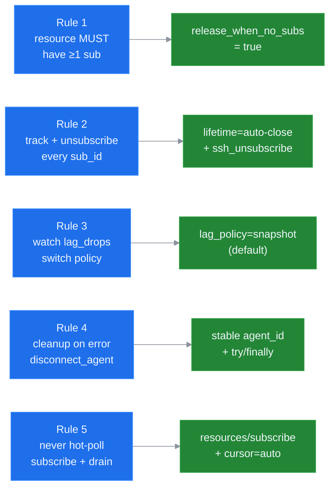

# Golden Rules

Five inviolable rules every LLM driving ssh-mcp v5.0 must respect. They are sourced from [ADR 0005](../adr/0005-llm-ux-priorities.md) and enforced at the wire by the lifecycle and channel-mux layers defined in [ADR 0003](../adr/0003-lifecycle-binding.md) and [ADR 0004](../adr/0004-channel-mux-fairness.md).

These rules are advisory at the protocol level — the server will not refuse a violating request — but breaking them produces zombie remote state, leaked subscriptions, dropped events, or token waste. The server is engineered to make compliance the easy path; treat the rules as preconditions, not as suggestions.

## Rule 1: Every long-running resource MUST have at least one active subscriber

A long-running resource is anything addressable by a push URI: `shell://<id>/output`, `command://<id>/output`, `transfer://<id>/progress`, `forward://<id>/events`. A bare resource without an observer accumulates output in the per-resource ring buffer until eviction; the operator never knows the resource exists; the LLM never sees the events.

**Violation.** Caller invokes `ssh_shell_open` then immediately disconnects without subscribing. The PTY stays alive, output fills the ring buffer, the session zombies until the inactivity TTL fires (minutes later).

**Rationale.** v5.0 binds resource lifetime to subscription presence (see [ADR 0003 — Lifecycle Binding](../adr/0003-lifecycle-binding.md)). The lifecycle adapter tracks state with atomic refcounts; `Owned -> Observed -> Releasing -> Closed` transitions are CAS-driven. A resource without a subscriber and without `release_when_no_subs=true` parks in `Owned` indefinitely, which is the dominant leak vector for 27B-class hosts.

**How to comply.**
- Subscribe within 2 seconds of resource creation, OR
- Pass `release_when_no_subs=true` when calling `ssh_shell_open` / `ssh_execute` / `ssh_upload` / `ssh_download` so the server self-cleans after the configured grace window.

## Rule 2: Always unsubscribe when done — track every `sub_id`

Every `ssh_subscribe` (or legacy `resources/subscribe`) returns a `sub_id` that uniquely keys a per-channel state bag (cursor, filter, lag policy, mpsc lane, stats). Forgetting `ssh_unsubscribe` keeps the lane alive until peer GC fires (default 30 s) or the parent session is disconnected. Multiplied across a long agent loop, this leaks lanes, distorts `events_sent`, and wastes outbound bandwidth.

**Violation.** Agent re-subscribes on every event-loop iteration without ever unsubscribing. After 100 turns the session has 100 `sub_id`s on a single URI, each with its own backlog and counters.

**Rationale.** [ADR 0004 — Channel Mux](../adr/0004-channel-mux-fairness.md) gives each subscription its own bounded `mpsc::channel(N)` and a per-lane stats block. The server intentionally cannot reach into your conversation state to GC a stale `sub_id`; it can only react to explicit `ssh_unsubscribe` or to peer-transport disconnect. Track `sub_id`s in the model's working memory and close them as soon as the workflow finishes.

**How to comply.**
- After every `ssh_subscribe`, store the returned `sub_id` in the conversation state until the matching `ssh_unsubscribe` is invoked.
- On any error path that abandons the workflow, call `ssh_unsubscribe` for every outstanding `sub_id`, then `ssh_disconnect_agent` for the owning agent.
- Set `lifetime=auto-close` on the subscribe call so the server releases the resource cascade when the last consumer drops.

## Rule 3: Watch `lag_drops` — switch to `lag_policy=snapshot` when drops > 0

Every push lane carries atomic counters (`events_sent`, `bytes_sent`, `lagged_drops`, `lagged_recoveries`, `queue_depth`, `queue_high_watermark`, `block_total_ms`) exposed via `ssh_sub_stats`. Drops indicate the consumer cannot keep up with the producer. Ignoring them produces silent gaps in the event stream.

**Violation.** Agent sees `lagged_drops=42` on one of its lanes, treats the marker as informational, and keeps consuming events as if nothing happened. Downstream logic depends on a strictly-monotonic event order it no longer has.

**Rationale.** [ADR 0006 — Backpressure Policies](../adr/0006-backpressure-policies.md) defines four lag policies. `Snapshot` (the default) bridges drops by dropping the lane backlog and rebuilding from the resource's ring buffer; the consumer sees a strictly-monotonic cursor that jumps over the gap. `BlockSlow` retains zero loss but blocks the producer; choose it for forensic captures only. Reading the stats and tuning the policy converts a silent gap into either a zero-loss block or an explicit snapshot rebuild.

**How to comply.**
- On every nontrivial workflow, query `ssh_sub_stats` periodically (or after a long-running phase).
- If `lagged_drops > 0` and the workflow tolerates a snapshot rebuild, ensure `lag_policy=snapshot` (the default).
- If the workflow needs zero loss, switch the lane to `lag_policy=block_slow` and adjust `SSH_BP_BLOCK_TIMEOUT_MS` accordingly.

## Rule 4: On error, clean up — `ssh_disconnect_agent` is your circuit breaker

The `agent_id` parameter passed at `ssh_connect` time scopes ownership of every resource opened against that agent. When an agent's workflow fails, the safe action is to release everything it owns in one call, not to attempt incremental cleanup with partial state.

**Violation.** Agent panics mid-workflow. The host attempts `ssh_shell_close` for one of three open shells, fails, and gives up. Two shells, two open commands, and an in-flight upload zombie until the inactivity TTL fires.

**Rationale.** Agent-scoped cleanup is engineered to be the cheapest correct recovery path. `ssh_disconnect_agent` walks every session bound to the agent and cascades through resources via the lifecycle layer (see [ADR 0003](../adr/0003-lifecycle-binding.md)). It is idempotent — duplicate calls return `OK` with `disconnected_count=0`. It is fast — one round of CAS transitions per resource.

**How to comply.**
- Wrap every workflow in a try/finally (or its host equivalent) that calls `ssh_disconnect_agent(agent_id)` on any failure path.
- Pass a stable `agent_id` to every `ssh_connect` so the cleanup boundary is unambiguous.
- For agent-spanning workflows, prefer multiple agent IDs over re-using one — release granularity matches blast radius.

## Rule 5: Never hot-poll `ssh_shell_read` — subscribe and drain push events

`ssh_shell_read` is a fallback for hosts without `resources/subscribe` support. It costs a full tool round-trip (request + response framing + tool dispatch + ring-buffer read) per call, returns at best a 50 ms-old snapshot, and on a tight loop produces token bills proportional to the loop frequency.

**Violation.** Agent emits `ssh_shell_read(shell_id, wait=true, wait_timeout_secs=1)` in a `while true` loop, polling every second. After a minute the host has consumed 60 round-trips and roughly 12 KB of redundant tool-response framing.

**Rationale.** [ADR 0004 — Channel Mux](../adr/0004-channel-mux-fairness.md) gives each subscriber its own debounced push lane (50 ms coalesce window, 1 s force flush, 30 s keepalive). The push pipeline is engineered to be the cheapest path: the server does the work once, the LLM consumes the events as conversation context, and the cursor advances exactly as fast as the consumer needs.

**How to comply.**
- Use `resources/subscribe` (or `ssh_subscribe` once Phase 3 lands) immediately after `ssh_shell_open`.
- On each `notifications/resources/updated` event, issue `resources/read?cursor=auto` and consume the delta.
- Reserve `ssh_shell_read` for hosts that genuinely cannot subscribe; mark this in the agent's tool-selection logic so the fallback never wins on a capable host.

## Cross-references

- [`INSTRUCTIONS_27B.md`](./INSTRUCTIONS_27B.md) condenses these rules to ≤80 lines for embedding into `Implementation.instructions`.
- [`ANTIPATTERNS.md`](./ANTIPATTERNS.md) lists the ten failure modes that violate one or more golden rules.
- [`ERROR_HANDBOOK.md`](./ERROR_HANDBOOK.md) maps every wire code (e.g. `SUB_LEAK_RISK`, `LAG_BACKPRESSURE`) onto the rule it surfaces.
