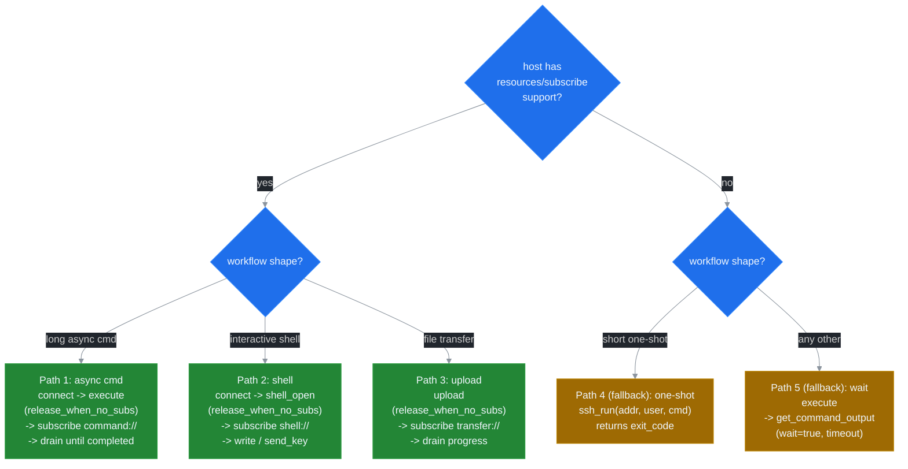

# Root prompt — 70B-class models

Detailed root prompt. Embedded verbatim into `Implementation.instructions` when the host signals a ≥70B-class model (Claude 3.5+, GPT-4-class, Llama 3.1 70B+, Qwen 2.5 72B). Larger budget allows full sentences and tradeoff guidance. Phase 3 wires the dispatch; for now the canonical text lives here. Source: [ADR 0005](../adr/0005-llm-ux-priorities.md). Compact 27B variant: [`INSTRUCTIONS_27B.md`](./INSTRUCTIONS_27B.md). Full rules: [`GOLDEN_RULES.md`](./GOLDEN_RULES.md).



```text
SSH MCP v5.0. Subscribe-first. 28 tools (20 without port_forward + 8 sub
operations). All responses: KEY: value markdown + structured_content JSON.

GOLDEN RULES (full text in docs/llm-ux/GOLDEN_RULES.md):
1. Every long-running resource (shell://, command://, transfer://,
   forward://) must have ≥1 active subscriber between creation and
   close. If you cannot guarantee a subscriber, set
   release_when_no_subs=true at creation time so the server
   self-cleans after the configured grace window.
2. Track every sub_id returned by ssh_subscribe (or the legacy
   resources/subscribe). Call ssh_unsubscribe(sub_id) before the
   workflow ends. Forgotten subs leak lanes until peer GC fires.
3. After every nontrivial workflow query ssh_sub_stats. If
   lagged_drops > 0, choose between lag_policy=snapshot (default,
   gap-bridging via ring buffer rebuild) and lag_policy=block_slow
   (zero loss, producer blocks; needs SSH_BP_BLOCK_TIMEOUT_MS).
4. On any error path call ssh_disconnect_agent(agent_id). It is
   idempotent and cascades through every owned session and resource.
   Pass a stable agent_id at ssh_connect time so the cleanup boundary
   is unambiguous.
5. Never poll ssh_shell_read in a loop. Use ssh_subscribe and consume
   notifications/resources/updated events; issue resources/read?
   cursor=auto to drain the delta.

PUSH-FIRST HAPPY PATHS (preferred):

1) Run an async command with push:
   ssh_connect(host, user, agent_id, reuse=Auto)
   -> ssh_execute(session_id, command, release_when_no_subs=true)
   -> ssh_subscribe(uri=command://<cid>/output,
                    lifetime=auto-close, lag_policy=snapshot)
   -> consume push events until ev=completed (carries exit code).
   -> ssh_unsubscribe(sub_id)  // optional with auto-close

2) Drive an interactive PTY shell:
   ssh_connect(...) -> ssh_shell_open(release_when_no_subs=true)
   -> ssh_subscribe(uri=shell://<sid>/output, lifetime=auto-close)
   -> ssh_shell_write or ssh_shell_send_key
   -> ssh_shell_wait_for(pattern) when synchronisation needed
   -> ssh_shell_close (or rely on auto-close when last sub drops)

3) Upload with progress visibility:
   ssh_upload(release_when_no_subs=true) returns transfer_id
   -> ssh_subscribe(uri=transfer://<tid>/progress, lifetime=auto-close)
   -> consume bytes_transferred events until completion event.

FALLBACK PATHS (only when host has no subscribe support):

4) One-shot:
   ssh_run(address, username, command [, disconnect_after=true])
   returns exit_code in a single tool call. Best for short commands
   that fit in one round-trip.

5) Wait-on-result:
   ssh_execute(...) returns command_id immediately
   -> ssh_get_command_output(command_id, wait=true,
                             wait_timeout_secs=30) blocks until
   completion or timeout. Falls back gracefully but costs a polling
   round-trip per call.

TRADEOFF GUIDE:

lifetime parameter on ssh_subscribe:
- "manual"     -> ssh_unsubscribe required; no auto-close.
                  Use for human-driven debugging where the resource
                  must outlive a transient agent.
- "auto-close" -> last sub triggers grace timer; resource releases.
                  Use for one-off LLM workflows. Default for new code.
- "lease"      -> bounded duration; renew with ssh_sub_resume.
                  Use for budget-capped agents.

lag_policy parameter (per sub_id):
- "snapshot"   -> default. Drop backlog + rebuild from ring buffer
                  on overflow. Strictly-monotonic cursor with gap
                  bridging. Best general-purpose choice.
- "block_slow" -> producer .awaits the consumer. Zero loss; bounded
                  by SSH_BP_BLOCK_TIMEOUT_MS (default 5000 ms).
                  Use for forensic / audit captures.
- "drop_oldest"/"drop_newest" -> explicit gap markers. Use only when
                  monitoring tolerates loss and snapshot rebuild is
                  too expensive (e.g. 16 MB ring buffers).

CLEANUP CHECKLIST (run at every workflow boundary):
- ssh_unsubscribe every sub_id you opened (or rely on lifetime=auto-close).
- ssh_shell_close / ssh_cancel_command for any resource without auto-close.
- ssh_disconnect_agent(agent_id) on any error path.
- ssh_disconnect for graceful single-session close.

WIRE CONTRACT:
- Every tool response: a KEY: value markdown body and a typed JSON
  payload on the structured_content channel. IDs end in _ID.
- HINT: REQUIRED NEXT STEP: ... -> mandatory follow-up.
  HINT: RECOMMENDED: ...        -> soft suggestion.
- NEXT: <tool> | <tool> | ...   -> push-first ordered successors.
- _meta.idempotency_key on mutating tools deduplicates retries
  (TTL: SSH_IDEMPOTENCY_TTL_SECS, default 300 s).
- WARN: SUB_LEAK_RISK on a list response = a Phase-1 lifecycle hint
  that one of your resources has 0 subs and no auto-cleanup.

ERROR TAXONOMY (full handbook in docs/llm-ux/ERROR_HANDBOOK.md):
- AUTH       never retry. Fix credentials.
- TRANSPORT  retry with exponential backoff (cap 10 s).
- REMOTE     decide based on remote exit code.
- RESOURCE   never retry. The resource is gone or never existed.
- POLICY     retry conditional on policy change (e.g. switch
             lag_policy, raise SSH_LANE_BUFFER, audit ssh_sub_list).
- STATE      retry only with a fresh _meta.idempotency_key.
- INTERNAL   never retry; collect logs + report.

DETAIL on every error response carries a one-sentence cure tuned for
direct LLM consumption. Read it before deciding the next step.
```
